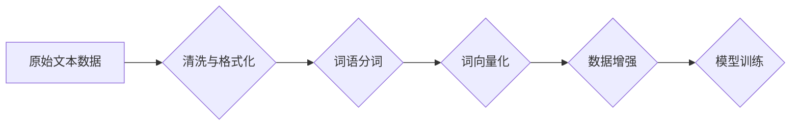

> 大语言模型、预训练、语料处理、Transformer、BERT、GPT、Fine-tuning

## 1. 背景介绍

近年来，深度学习技术取得了飞速发展，特别是大语言模型（Large Language Model，LLM）的出现，为自然语言处理（NLP）领域带来了革命性的变革。LLM 拥有强大的文本理解和生成能力，能够完成各种复杂的任务，例如文本分类、机器翻译、问答系统、文本摘要等。

然而，训练一个大型的语言模型需要海量的计算资源和数据。本文将深入探讨大语言模型的原理和工程实践，重点介绍如何训练一个 7B 参数的大语言模型，并详细讲解语料预处理的重要性。

## 2. 核心概念与联系

大语言模型的核心概念包括：

* **Transformer:** Transformer是一种新型的神经网络架构，其能够有效地处理序列数据，并具有强大的并行计算能力。它在自然语言处理领域取得了突破性的进展，成为大语言模型的基础架构。

* **预训练:** 预训练是指在大量未标记数据上训练模型，使其学习到语言的通用知识和模式。预训练模型可以作为下游任务的初始模型，通过微调（Fine-tuning）的方式快速适应特定任务。

* **语料预处理:** 语料预处理是指对原始文本数据进行清洗、格式化和转换，使其更适合模型训练。

**Mermaid 流程图:**



## 3. 核心算法原理 & 具体操作步骤

### 3.1  算法原理概述

大语言模型通常基于 Transformer 架构，其核心组件包括：

* **Encoder:** 负责将输入文本序列编码成固定长度的向量表示。
* **Decoder:** 负责根据编码后的向量表示生成输出文本序列。
* **注意力机制:** 允许模型关注输入序列中与当前输出相关的部分，提高模型的理解能力。

### 3.2  算法步骤详解

1. **数据收集和预处理:** 收集大量文本数据，并进行清洗、格式化、词语分词、词向量化等预处理步骤。
2. **模型构建:** 根据 Transformer 架构构建模型，并设置模型参数，例如隐藏层数、神经元数量、学习率等。
3. **模型训练:** 使用预处理后的数据训练模型，并使用交叉熵损失函数和优化算法（例如 Adam）进行模型优化。
4. **模型评估:** 使用验证集评估模型性能，并根据评估结果调整模型参数和训练策略。
5. **模型微调:** 将预训练好的模型微调到特定任务，例如文本分类、机器翻译等。

### 3.3  算法优缺点

**优点:**

* 强大的文本理解和生成能力。
* 可以处理各种复杂的任务。
* 预训练模型可以快速适应特定任务。

**缺点:**

* 训练成本高，需要大量的计算资源和数据。
* 模型参数量大，部署成本高。
* 容易受到训练数据偏差的影响。

### 3.4  算法应用领域

大语言模型在以下领域有广泛的应用：

* **自然语言理解:** 文本分类、情感分析、问答系统、文本摘要等。
* **自然语言生成:** 机器翻译、对话系统、文本创作等。
* **代码生成:** 代码补全、代码生成等。
* **多模态理解:** 图像和文本的联合理解。

## 4. 数学模型和公式 & 详细讲解 & 举例说明

### 4.1  数学模型构建

Transformer 模型的核心是注意力机制和多头注意力机制。

**注意力机制:**

注意力机制允许模型关注输入序列中与当前输出相关的部分。其计算公式如下：

$$
\text{Attention}(Q, K, V) = \text{softmax}\left(\frac{QK^T}{\sqrt{d_k}}\right)V
$$

其中：

* $Q$：查询矩阵
* $K$：键矩阵
* $V$：值矩阵
* $d_k$：键向量的维度

**多头注意力机制:**

多头注意力机制将注意力机制应用于多个不同的子空间，从而提高模型的表达能力。其计算公式如下：

$$
\text{MultiHeadAttention}(Q, K, V) = \text{Concat}\left(\text{head}_1, \text{head}_2, ..., \text{head}_h\right)W_o
$$

其中：

* $h$：注意力头的数量
* $\text{head}_i$：第 $i$ 个注意力头的输出

### 4.2  公式推导过程

注意力机制的 softmax 函数用于计算每个键向量与查询向量的相似度，并将其归一化，从而得到每个键向量的权重。

多头注意力机制通过将注意力机制应用于多个不同的子空间，可以学习到更丰富的文本表示。

### 4.3  案例分析与讲解

例如，在机器翻译任务中，注意力机制可以帮助模型关注源语言中与目标语言单词相关的部分，从而提高翻译的准确性。

## 5. 项目实践：代码实例和详细解释说明

### 5.1  开发环境搭建

* 操作系统：Ubuntu 20.04
* Python 版本：3.8
* CUDA 版本：11.0
* cuDNN 版本：8.0

### 5.2  源代码详细实现

```python
# 导入必要的库
import torch
import torch.nn as nn

# 定义 Transformer 模型
class Transformer(nn.Module):
    def __init__(self, vocab_size, embedding_dim, num_heads, num_layers):
        super(Transformer, self).__init__()
        self.embedding = nn.Embedding(vocab_size, embedding_dim)
        self.transformer_layers = nn.ModuleList([
            nn.TransformerEncoderLayer(embedding_dim, num_heads)
            for _ in range(num_layers)
        ])
        self.linear = nn.Linear(embedding_dim, vocab_size)

    def forward(self, x):
        # 词嵌入
        x = self.embedding(x)
        # Transformer encoder
        for layer in self.transformer_layers:
            x = layer(x)
        # 输出层
        x = self.linear(x)
        return x

# 实例化模型
model = Transformer(vocab_size=10000, embedding_dim=512, num_heads=8, num_layers=6)
```

### 5.3  代码解读与分析

* 模型定义了词嵌入层、Transformer encoder 和输出层。
* Transformer encoder 由多个 Transformer encoder layer 组成，每个 layer 包含多头注意力机制和前馈神经网络。
* 输出层是一个全连接层，用于将编码后的向量表示映射到词汇表的大小。

### 5.4  运行结果展示

训练模型后，可以使用验证集评估模型性能，例如计算困惑度（Perplexity）。困惑度越低，模型的预测能力越强。

## 6. 实际应用场景

### 6.1  文本生成

大语言模型可以用于生成各种类型的文本，例如：

* **小说、诗歌、剧本:** 可以根据给定的主题或关键词生成创意文本。
* **新闻报道、文章:** 可以根据事件或主题生成新闻报道或文章。
* **对话系统:** 可以与用户进行自然流畅的对话。

### 6.2  文本分类

大语言模型可以用于对文本进行分类，例如：

* **情感分析:** 判断文本表达的情感倾向，例如正面、负面或中性。
* **主题分类:** 将文本归类到不同的主题类别，例如新闻、体育、娱乐等。
* **垃圾邮件过滤:** 将垃圾邮件从正常邮件中过滤出来。

### 6.3  机器翻译

大语言模型可以用于机器翻译，例如：

* **英语-中文翻译:** 将英语文本翻译成中文，或将中文文本翻译成英语。
* **多语言翻译:** 支持多种语言之间的翻译。

### 6.4  未来应用展望

大语言模型在未来将有更广泛的应用，例如：

* **个性化教育:** 根据学生的学习情况提供个性化的学习内容和辅导。
* **医疗诊断:** 辅助医生进行疾病诊断和治疗方案制定。
* **法律服务:** 帮助律师进行法律研究和案件分析。

## 7. 工具和资源推荐

### 7.1  学习资源推荐

* **书籍:**
    * 《深度学习》
    * 《自然语言处理》
* **在线课程:**
    * Coursera: 自然语言处理
    * Udacity: 深度学习

### 7.2  开发工具推荐

* **PyTorch:** 深度学习框架
* **TensorFlow:** 深度学习框架
* **HuggingFace Transformers:** 预训练模型库

### 7.3  相关论文推荐

* **Attention Is All You Need:** https://arxiv.org/abs/1706.03762
* **BERT: Pre-training of Deep Bidirectional Transformers for Language Understanding:** https://arxiv.org/abs/1810.04805

## 8. 总结：未来发展趋势与挑战

### 8.1  研究成果总结

大语言模型在自然语言处理领域取得了显著的进展，展现出强大的文本理解和生成能力。

### 8.2  未来发展趋势

* **模型规模更大:** 训练更大规模的模型，以提高模型的性能。
* **多模态理解:** 将文本与其他模态数据（例如图像、音频）进行联合理解。
* **可解释性:** 研究大语言模型的决策过程，提高模型的可解释性。

### 8.3  面临的挑战

* **数据获取和标注:** 大语言模型需要海量的训练数据，数据获取和标注成本高。
* **计算资源:** 训练大语言模型需要大量的计算资源，成本高昂。
* **伦理问题:** 大语言模型可能被用于生成虚假信息或进行恶意攻击，需要关注伦理问题。

### 8.4  研究展望

未来，大语言模型将继续朝着更强大、更智能的方向发展，并应用于更多领域，为人类社会带来更多福祉。

## 9. 附录：常见问题与解答

* **Q: 如何选择合适的预训练模型？**
* **A:** 选择预训练模型时需要考虑模型大小、参数量、训练数据、任务类型等因素。

* **Q: 如何进行模型微调？**
* **A:** 模型微调是指在预训练模型的基础上，使用特定任务的数据进行训练，以提高模型在特定任务上的性能。

* **Q: 如何评估大语言模型的性能？**
* **A:** 大语言模型的性能可以评估指标包括困惑度、BLEU分数、ROUGE分数等。


作者：禅与计算机程序设计艺术 / Zen and the Art of Computer Programming 
<end_of_turn>