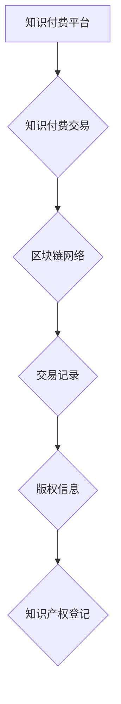

> 区块链，知识付费，版权保护，智能合约，去中心化

## 1. 背景介绍

知识付费作为一种新型的商业模式，近年来发展迅速，为创作者提供了新的收入来源，也为用户提供了优质的学习资源。然而，知识付费行业也面临着版权保护的难题。传统的版权保护机制存在着成本高、效率低、易受人为干预等问题。

区块链技术作为一种去中心化、透明、不可篡改的分布式账本技术，为知识付费版权保护提供了新的解决方案。区块链可以记录知识付费交易的完整信息，确保知识产权的归属和交易的真实性，有效地解决知识付费行业版权保护的痛点。

## 2. 核心概念与联系

### 2.1 区块链技术

区块链是一种分布式账本技术，它由多个节点组成，每个节点都拥有完整的区块链数据副本。区块链上的数据以区块的形式存储，每个区块包含多个交易记录，并通过加密算法链接在一起，形成一个不可篡改的链条。

### 2.2 知识付费

知识付费是指创作者将自己的知识、技能、经验等转化为付费内容，通过线上平台向用户提供学习和获取知识的机会。知识付费内容包括但不限于课程、书籍、视频、音频等。

### 2.3 知识付费版权保护

知识付费版权保护是指保护知识付费内容的著作权，防止未经授权的复制、传播和使用。

**区块链与知识付费版权保护的联系**

区块链技术可以为知识付费版权保护提供以下优势：

* **去中心化:** 区块链上的数据分布在多个节点上，不存在单点故障，不易被攻击和篡改。
* **透明度:** 区块链上的所有交易记录都是公开透明的，任何人都可以查看交易历史。
* **不可篡改:** 区块链上的数据一旦写入，就无法修改，确保知识付费交易的真实性和可靠性。

**区块链技术在知识付费版权保护中的应用场景**

* **知识产权登记:** 利用区块链记录知识付费内容的版权信息，建立知识产权的永久性记录。
* **交易记录:** 记录知识付费交易的完整信息，包括交易时间、交易金额、交易双方等，防止交易欺诈。
* **版权授权管理:** 利用智能合约自动执行版权授权协议，实现版权授权的自动化和透明化。

**Mermaid 流程图**



## 3. 核心算法原理 & 具体操作步骤

### 3.1 算法原理概述

区块链技术的核心算法包括：

* **哈希算法:** 用于生成区块的唯一标识，确保数据的完整性和不可篡改性。
* **密码学算法:** 用于加密和解密数据，保护交易的安全性。
* **共识算法:** 用于验证交易的有效性和达成共识，确保区块链的安全性。

### 3.2 算法步骤详解

1. **交易发起:** 用户发起知识付费交易请求。
2. **交易打包:** 交易请求被打包成区块。
3. **区块验证:** 节点验证区块的有效性，包括交易数据的真实性和哈希值的正确性。
4. **区块添加:** 验证通过的区块被添加到区块链中。
5. **交易确认:** 交易被添加到区块链中后，被视为已完成。

### 3.3 算法优缺点

**优点:**

* **安全性高:** 哈希算法和密码学算法确保数据的安全性。
* **透明度高:** 所有交易记录都是公开透明的。
* **不可篡改:** 数据一旦写入区块链，就无法修改。

**缺点:**

* **处理能力有限:** 区块链的处理能力有限，无法处理大量交易。
* **技术复杂:** 区块链技术复杂，需要专业的技术人员进行开发和维护。

### 3.4 算法应用领域

区块链技术在知识付费版权保护领域之外，还广泛应用于其他领域，例如：

* 金融
* 供应链管理
* 医疗保健
* 政府

## 4. 数学模型和公式 & 详细讲解 & 举例说明

### 4.1 数学模型构建

区块链中的数据结构可以抽象为一个图模型，其中节点代表区块，边代表区块之间的链接关系。

**图模型:**

* 节点: $B_i$ (i = 1, 2, ..., n) 代表区块
* 边: $(B_i, B_j)$ 代表区块 $B_i$ 和 $B_j$ 之间的链接关系

**图模型的数学表示:**

* $G = (V, E)$

其中:

* $V$ 是节点集合，即所有区块的集合。
* $E$ 是边集合，即所有区块之间的链接关系集合。

### 4.2 公式推导过程

区块链中的哈希算法可以表示为一个函数 $H(x)$，其中 $x$ 是输入数据，$H(x)$ 是输出哈希值。

**哈希算法公式:**

* $H(x) = h$

其中:

* $H(x)$ 是哈希函数
* $x$ 是输入数据
* $h$ 是输出哈希值

### 4.3 案例分析与讲解

假设有一个区块链网络，其中包含三个区块 $B_1$, $B_2$, $B_3$。

* $B_1$ 的哈希值是 $h_1$
* $B_2$ 的哈希值是 $h_2$
* $B_3$ 的哈希值是 $h_3$

$B_2$ 的哈希值 $h_2$ 包含 $B_1$ 的哈希值 $h_1$，$B_3$ 的哈希值 $h_3$ 包含 $B_2$ 的哈希值 $h_2$。

因此，区块链网络的结构可以表示为:

* $B_1 \rightarrow B_2 \rightarrow B_3$

## 5. 项目实践：代码实例和详细解释说明

### 5.1 开发环境搭建

* 操作系统: Ubuntu 20.04
* 节点软件: Hyperledger Fabric

### 5.2 源代码详细实现

```python
# 智能合约代码示例

from fabric_contract_api import FabricContract

class KnowledgeContract(FabricContract):
    def __init__(self, ctx):
        super().__init__(ctx)

    def create_content(self, content_id, content_data):
        # 将知识内容信息存储到区块链
        self.ctx.stub.put_state(content_id, content_data)

    def get_content(self, content_id):
        # 获取知识内容信息
        return self.ctx.stub.get_state(content_id)

```

### 5.3 代码解读与分析

* `FabricContract` 类继承自 `fabric_contract_api` 模块中的 `FabricContract` 类，用于定义智能合约。
* `create_content()` 方法用于将知识内容信息存储到区块链。
* `get_content()` 方法用于获取知识内容信息。

### 5.4 运行结果展示

运行智能合约代码，可以将知识内容信息存储到区块链中，并通过 `get_content()` 方法获取知识内容信息。

## 6. 实际应用场景

### 6.1 在线课程平台

在线课程平台可以利用区块链技术记录课程的版权信息，防止盗版和侵权。

### 6.2 电子书出版平台

电子书出版平台可以利用区块链技术记录电子书的版权信息，确保作者的权益。

### 6.3 知识库平台

知识库平台可以利用区块链技术记录知识库中的知识内容的版权信息，防止知识流失和知识盗窃。

### 6.4 未来应用展望

区块链技术在知识付费版权保护领域还有很大的发展空间，未来可以应用于：

* **知识付费分发:** 利用智能合约自动执行知识付费分发协议，确保创作者和平台的利益。
* **知识付费认证:** 利用区块链技术对知识付费用户进行身份认证，防止虚假用户。
* **知识付费交易市场:** 建立一个去中心化的知识付费交易市场，让创作者和用户直接交易。

## 7. 工具和资源推荐

### 7.1 学习资源推荐

* **区块链技术入门书籍:** 《区块链技术入门》
* **区块链技术在线课程:** Coursera, edX

### 7.2 开发工具推荐

* **Hyperledger Fabric:** 一个开源的企业级区块链平台
* **Ethereum:** 一个开源的公共区块链平台

### 7.3 相关论文推荐

* **"Blockchain Technology for Copyright Protection"**
* **"A Survey of Blockchain Applications in Intellectual Property Rights Management"**

## 8. 总结：未来发展趋势与挑战

### 8.1 研究成果总结

区块链技术为知识付费版权保护提供了新的解决方案，可以有效地解决传统版权保护的痛点。

### 8.2 未来发展趋势

未来，区块链技术在知识付费版权保护领域将继续发展，应用场景将更加广泛，技术也将更加成熟。

### 8.3 面临的挑战

区块链技术在知识付费版权保护领域也面临着一些挑战，例如：

* **技术复杂性:** 区块链技术复杂，需要专业的技术人员进行开发和维护。
* **法律法规:** 区块链技术应用于知识付费版权保护领域，需要完善相关的法律法规。
* **用户接受度:** 用户对区块链技术的了解和接受度还比较低。

### 8.4 研究展望

未来，需要进一步研究区块链技术在知识付费版权保护领域的应用，解决技术和法律法规方面的挑战，提高用户对区块链技术的接受度。

## 9. 附录：常见问题与解答

**常见问题:**

* 区块链技术真的可以有效地保护知识付费版权吗？
* 区块链技术在知识付费版权保护领域有哪些应用场景？
* 如何使用区块链技术保护知识付费版权？

**解答:**

* 是的，区块链技术可以有效地保护知识付费版权，因为它具有去中心化、透明、不可篡改等特点。
* 区块链技术可以应用于在线课程平台、电子书出版平台、知识库平台等知识付费平台。
* 使用区块链技术保护知识付费版权，需要开发智能合约，将知识内容信息存储到区块链中，并利用智能合约自动执行版权授权协议。


作者：禅与计算机程序设计艺术 / Zen and the Art of Computer Programming 
<end_of_turn>