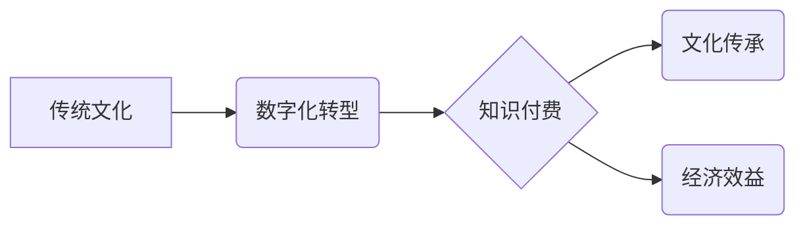

> 传统文化、知识付费、数字化转型、人工智能、内容创作、商业模式

## 1. 背景介绍

传统文化作为中华民族的宝贵财富，蕴藏着丰富的历史、哲学、艺术和生活智慧。然而，随着时代发展和社会变迁，传统文化面临着传承断裂、传播受限等挑战。知识付费作为一种新型的商业模式，为传统文化的发展提供了新的机遇。

近年来，知识付费行业蓬勃发展，从教育培训、专业技能到兴趣爱好，各种类型的付费内容层出不穷。传统文化领域也开始尝试利用知识付费模式，将文化遗产、传统技艺、历史故事等内容转化为有价值的知识产品，以满足人们对文化传承和精神食粮的需求。

## 2. 核心概念与联系

**2.1 知识付费**

知识付费是指通过付费的方式获取知识、技能和信息。它是一种基于价值交换的商业模式，用户通过支付一定的费用，获得知识产权的授权使用权，从而提升自身的能力和价值。

**2.2 传统文化**

传统文化是指一个民族或社会在长期历史发展中形成的文化积淀，包括思想观念、艺术形式、生活方式、习俗风俗等方面。

**2.3 数字化转型**

数字化转型是指利用数字化技术和手段，对传统产业和服务进行改造升级，提升效率、降低成本、创造新的价值。

**2.4 核心概念联系**

知识付费、传统文化和数字化转型相互关联，共同构成了传统文化知识付费的新模式。

* 数字化转型为传统文化知识付费提供了技术支撑，通过互联网、移动互联网等平台，将传统文化内容进行数字化制作、传播和销售。
* 知识付费模式为传统文化提供了新的商业模式，通过付费的方式，可以更好地保护知识产权，激励文化创作者，促进传统文化的传承和发展。
* 传统文化作为知识付费的优质内容来源，可以满足人们对精神文化的需求，提升文化素养，促进社会和谐发展。

**Mermaid 流程图**



## 3. 核心算法原理 & 具体操作步骤

**3.1 算法原理概述**

传统文化知识付费的算法原理主要基于内容推荐、用户画像、个性化定制等技术。

* 内容推荐算法：通过分析用户行为数据、兴趣偏好等信息，推荐与用户需求相匹配的传统文化内容。
* 用户画像算法：通过收集用户数据，构建用户画像，了解用户的文化背景、兴趣爱好、学习习惯等信息，为用户提供个性化的服务。
* 个性化定制算法：根据用户的需求和喜好，定制个性化的学习方案、课程内容、文化体验等。

**3.2 算法步骤详解**

1. **数据采集:** 收集用户行为数据、兴趣偏好数据、文化背景数据等信息。
2. **数据清洗:** 对收集到的数据进行清洗、处理，去除无效数据、噪声数据等。
3. **特征提取:** 从数据中提取用户特征、内容特征等信息。
4. **模型训练:** 利用机器学习算法，训练内容推荐、用户画像、个性化定制等模型。
5. **模型评估:** 对模型进行评估，调整模型参数，提高模型精度。
6. **内容推荐:** 根据用户特征和内容特征，推荐与用户需求相匹配的传统文化内容。
7. **用户画像:** 根据用户数据，构建用户画像，了解用户的文化背景、兴趣爱好、学习习惯等信息。
8. **个性化定制:** 根据用户的需求和喜好，定制个性化的学习方案、课程内容、文化体验等。

**3.3 算法优缺点**

* **优点:**
    * 可以精准推荐用户感兴趣的内容，提高用户体验。
    * 可以根据用户需求，提供个性化的服务，满足用户的多样化需求。
    * 可以帮助传统文化更好地传播和传承。
* **缺点:**
    * 需要大量的用户数据进行训练，数据质量对模型精度有很大影响。
    * 模型训练需要一定的技术门槛，需要专业的技术人员进行开发和维护。
    * 算法可能会存在偏差，导致推荐结果不准确。

**3.4 算法应用领域**

* 传统文化教育平台
* 文化旅游平台
* 文化创意产业
* 文化遗产保护

## 4. 数学模型和公式 & 详细讲解 & 举例说明

**4.1 数学模型构建**

传统文化知识付费的数学模型可以基于用户行为数据、内容特征数据、市场需求等因素进行构建。

例如，可以构建一个用户价值模型，将用户的付费意愿、学习时长、知识掌握程度等因素作为指标，计算用户的价值。

**4.2 公式推导过程**

用户价值模型的公式可以表示为：

$$
U = f(P, L, K)
$$

其中：

* $U$ 表示用户的价值
* $P$ 表示用户的付费意愿
* $L$ 表示用户的学习时长
* $K$ 表示用户的知识掌握程度

**4.3 案例分析与讲解**

假设一个用户在传统文化知识付费平台上学习了书法课程，学习时长为 10 小时，知识掌握程度为 80%，付费意愿为 90%。

根据上述公式，可以计算该用户的价值：

$$
U = f(0.9, 10, 0.8)
$$

通过具体的函数 $f$ 的定义，可以得到该用户的价值值。

## 5. 项目实践：代码实例和详细解释说明

**5.1 开发环境搭建**

* 操作系统：Windows/macOS/Linux
* 编程语言：Python
* 开发工具：PyCharm/VS Code
* 框架：Django/Flask

**5.2 源代码详细实现**

```python
# 用户模型
class User(models.Model):
    username = models.CharField(max_length=255)
    password = models.CharField(max_length=255)
    # 其他用户属性

# 内容模型
class Content(models.Model):
    title = models.CharField(max_length=255)
    description = models.TextField()
    # 其他内容属性

# 课程模型
class Course(models.Model):
    title = models.CharField(max_length=255)
    description = models.TextField()
    # 其他课程属性

# 支付模型
class Payment(models.Model):
    user = models.ForeignKey(User, on_delete=models.CASCADE)
    content = models.ForeignKey(Content, on_delete=models.CASCADE)
    amount = models.DecimalField(max_digits=10, decimal_places=2)
    # 其他支付属性
```

**5.3 代码解读与分析**

以上代码示例展示了传统文化知识付费平台的基本模型结构。

* 用户模型：存储用户信息，包括用户名、密码等。
* 内容模型：存储传统文化内容信息，包括标题、描述等。
* 课程模型：存储课程信息，包括课程名称、描述等。
* 支付模型：存储用户支付信息，包括用户、内容、支付金额等。

**5.4 运行结果展示**

通过运行上述代码，可以搭建一个基本的传统文化知识付费平台，用户可以注册登录、浏览内容、购买课程、进行支付等操作。

## 6. 实际应用场景

**6.1 教育培训**

传统文化知识付费可以应用于教育培训领域，提供传统文化课程、讲座、研讨会等在线学习资源，帮助用户学习传统文化知识，提升文化素养。

**6.2 文化旅游**

传统文化知识付费可以应用于文化旅游领域，提供文化体验、导游服务、历史讲解等线上线下结合的文化旅游产品，让用户沉浸式体验传统文化魅力。

**6.3 文化创意产业**

传统文化知识付费可以应用于文化创意产业，提供传统文化元素的设计素材、版权授权、创意孵化等服务，促进传统文化与现代创意的融合发展。

**6.4 未来应用展望**

随着人工智能、虚拟现实等技术的不断发展，传统文化知识付费将呈现更加多元化、智能化、沉浸式的发展趋势。

* 人工智能技术可以用于个性化推荐、智能问答、虚拟导游等方面，提升用户体验。
* 虚拟现实技术可以用于打造沉浸式的文化体验场景，让用户身临其境地感受传统文化魅力。
* 区块链技术可以用于保障知识产权，促进文化创作者的收益。

## 7. 工具和资源推荐

**7.1 学习资源推荐**

* 在线课程平台：Coursera、edX、Udemy
* 文化网站：中国文化网、中华网
* 图书馆资源：国家图书馆、地方图书馆

**7.2 开发工具推荐**

* 编程语言：Python、Java、JavaScript
* 开发框架：Django、Flask、React
* 数据库：MySQL、MongoDB

**7.3 相关论文推荐**

* 知识付费模式的构建与发展
* 数字化转型对传统文化的影响
* 人工智能在传统文化知识付费中的应用

## 8. 总结：未来发展趋势与挑战

**8.1 研究成果总结**

传统文化知识付费作为一种新型的商业模式，为传统文化的发展提供了新的机遇。通过数字化转型、人工智能技术等手段，传统文化知识付费可以更好地传播和传承，满足人们对文化需求，促进文化产业发展。

**8.2 未来发展趋势**

未来，传统文化知识付费将呈现更加多元化、智能化、沉浸式的发展趋势。人工智能、虚拟现实等技术的应用将进一步提升用户体验，推动传统文化知识付费的创新发展。

**8.3 面临的挑战**

传统文化知识付费也面临着一些挑战，例如：

* 数据质量问题：传统文化知识付费需要大量的用户数据进行训练，数据质量对模型精度有很大影响。
* 内容版权问题：传统文化知识的版权保护需要加强，防止知识盗版和侵权行为。
* 用户付费意愿问题：传统文化知识付费需要提高用户付费意愿，建立良好的付费机制。

**8.4 研究展望**

未来，需要进一步研究传统文化知识付费的算法模型、商业模式、用户行为等方面，探索更加有效的知识付费模式，促进传统文化的发展和传承。

## 9. 附录：常见问题与解答

**9.1 如何选择合适的传统文化知识付费平台？**

选择传统文化知识付费平台时，可以考虑以下因素：

* 平台的口碑和信誉
* 平台的内容质量和丰富度
* 平台的学习模式和互动性
* 平台的收费标准和服务保障

**9.2 如何保护传统文化知识的版权？**

传统文化知识的版权保护可以通过以下方式进行：

* 申请著作权登记
* 使用版权管理软件
* 加强知识产权宣传教育

**9.3 如何提高用户付费意愿？**

提高用户付费意愿可以通过以下方式进行：

* 提供高质量、有价值的知识内容
* 建立良好的付费机制
* 提供优质的学习服务和售后保障


作者：禅与计算机程序设计艺术 / Zen and the Art of Computer Programming 
<end_of_turn>