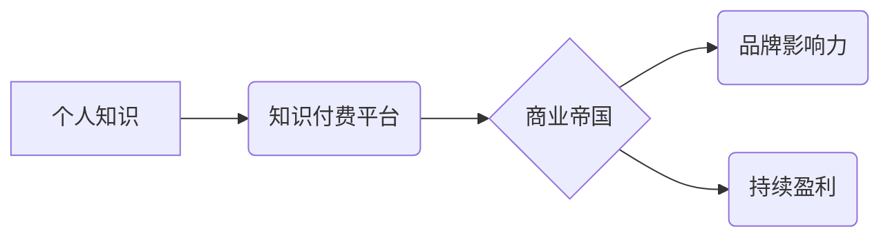

> 个人知识付费,商业帝国,技术博客,人工智能,软件架构,知识产权,品牌建设,营销策略

## 1. 背景介绍

在当今数字时代，知识已成为最宝贵的资源。个人知识付费模式的兴起，为拥有专业技能和知识的人们提供了新的商业机会。通过线上平台，个人可以将自己的知识和经验转化为有价值的付费内容，并建立自己的知识付费商业帝国。

然而，打造个人知识付费商业帝国并非易事。需要具备清晰的商业目标、专业的知识体系、有效的营销策略以及强大的执行力。本文将从多个角度探讨如何打造个人知识付费商业帝国，为有志于在这个领域创业的人们提供参考和指导。

## 2. 核心概念与联系

**2.1 个人知识付费模式**

个人知识付费模式是指个人或机构以知识、技能、经验等为核心，通过线上平台向付费用户提供学习、培训、咨询等服务。

**2.2 商业帝国**

商业帝国是指拥有强大影响力、广泛资源和持续盈利能力的企业集团。

**2.3 知识付费商业帝国**

知识付费商业帝国是指通过个人知识付费模式，建立起庞大的知识生态系统，并实现持续盈利和品牌影响力的企业。

**2.4 核心概念关系图**



## 3. 核心算法原理 & 具体操作步骤

**3.1 算法原理概述**

打造个人知识付费商业帝国的核心算法，可以概括为“内容生产-用户运营-商业变现”闭环模式。

**3.2 算法步骤详解**

1. **内容生产:** 
    * 确定目标受众和知识领域。
    * 制定内容规划和创作策略。
    * 创作高质量、有价值的知识内容。
2. **用户运营:**
    * 建立用户社区，加强用户互动。
    * 提供个性化学习体验和服务。
    * 持续收集用户反馈，优化内容和服务。
3. **商业变现:**
    * 选择合适的商业模式，例如付费课程、会员订阅、咨询服务等。
    * 推广营销，吸引目标用户。
    * 优化运营，提高转化率和用户留存率。

**3.3 算法优缺点**

* **优点:**
    * 灵活性和可定制性强。
    * 能够快速积累用户和粉丝。
    * 盈利模式多样化。
* **缺点:**
    * 内容生产和用户运营需要投入大量时间和精力。
    * 需要不断学习和更新知识，保持竞争力。
    * 需要具备一定的商业运营能力。

**3.4 算法应用领域**

* 教育培训
* 职业技能提升
* 个人兴趣爱好
* 创业投资
* 健康养生

## 4. 数学模型和公式 & 详细讲解 & 举例说明

**4.1 数学模型构建**

知识付费商业帝国的成功可以看作是一个复杂的系统，我们可以用以下数学模型来描述其发展趋势：

```latex
N(t) = N_0 * e^{rt}
```

其中：

* $N(t)$ 代表在时间 $t$ 时刻的知识付费商业帝国规模。
* $N_0$ 代表初始规模。
* $r$ 代表增长率。
* $t$ 代表时间。

**4.2 公式推导过程**

该模型基于指数增长规律，假设知识付费商业帝国的规模随着时间的推移呈指数增长。增长率 $r$ 取决于多个因素，例如内容质量、用户运营、商业模式等。

**4.3 案例分析与讲解**

假设一个知识付费商业帝国的初始规模为 1000 名用户，增长率为 10% per year。那么，经过 5 年后，其规模将达到：

```latex
N(5) = 1000 * e^{0.1 * 5} \approx 1649
```

这意味着，在 5 年内，该知识付费商业帝国的规模将增长到 1649 名用户。

## 5. 项目实践：代码实例和详细解释说明

**5.1 开发环境搭建**

* 操作系统：Windows/macOS/Linux
* 编程语言：Python
* 开发工具：VS Code/PyCharm
* 框架：Django/Flask

**5.2 源代码详细实现**

```python
# 知识付费平台模型
class Course(models.Model):
    title = models.CharField(max_length=255)
    description = models.TextField()
    price = models.DecimalField(max_digits=10, decimal_places=2)

# 用户模型
class User(models.Model):
    username = models.CharField(max_length=255)
    email = models.EmailField()
    password = models.CharField(max_length=255)

# 课程购买记录模型
class Purchase(models.Model):
    user = models.ForeignKey(User, on_delete=models.CASCADE)
    course = models.ForeignKey(Course, on_delete=models.CASCADE)
    purchase_date = models.DateTimeField(auto_now_add=True)
```

**5.3 代码解读与分析**

以上代码示例展示了知识付费平台的基本模型结构。

* `Course` 模型代表课程信息，包括标题、描述和价格。
* `User` 模型代表用户信息，包括用户名、邮箱和密码。
* `Purchase` 模型记录用户购买课程的信息。

**5.4 运行结果展示**

通过运行以上代码，可以建立一个基本的知识付费平台数据库，并进行数据操作，例如添加课程、注册用户、记录购买记录等。

## 6. 实际应用场景

**6.1 教育培训**

知识付费平台可以提供各种在线课程，涵盖各个学科和专业领域，满足不同用户的学习需求。

**6.2 职业技能提升**

知识付费平台可以提供职业技能培训课程，帮助用户提升职场竞争力。

**6.3 个人兴趣爱好**

知识付费平台可以提供各种兴趣爱好课程，例如摄影、绘画、音乐等，满足用户个性化需求。

**6.4 未来应用展望**

随着人工智能、虚拟现实等技术的不断发展，知识付费平台将更加智能化、个性化和沉浸式。

## 7. 工具和资源推荐

**7.1 学习资源推荐**

* 在线课程平台：Coursera、Udemy、edX
* 博客和技术论坛：Stack Overflow、Medium、GitHub

**7.2 开发工具推荐**

* 编程语言：Python、JavaScript、Java
* 开发框架：Django、Flask、React、Vue.js
* 数据库：MySQL、PostgreSQL、MongoDB

**7.3 相关论文推荐**

* The Economics of Online Education
* The Future of Work: How Technology Will Transform the Workplace
* The Impact of Artificial Intelligence on Education

## 8. 总结：未来发展趋势与挑战

**8.1 研究成果总结**

打造个人知识付费商业帝国需要具备清晰的商业目标、专业的知识体系、有效的营销策略以及强大的执行力。

**8.2 未来发展趋势**

知识付费平台将更加智能化、个性化和沉浸式。

**8.3 面临的挑战**

* 内容质量竞争激烈
* 用户留存率低
* 商业模式创新乏力

**8.4 研究展望**

未来研究将重点关注知识付费平台的智能化、个性化和沉浸式体验，以及如何解决用户留存率低和商业模式创新乏力的挑战。

## 9. 附录：常见问题与解答

**9.1 如何确定目标受众和知识领域？**

* 分析自身优势和兴趣。
* 研究市场需求和竞争情况。
* 通过调研和问卷调查了解目标用户的需求。

**9.2 如何创作高质量的知识内容？**

* 确定内容主题和目标受众。
* 制定详细的创作计划和结构。
* 使用清晰易懂的语言和丰富的案例。
* 确保内容的准确性和原创性。

**9.3 如何进行用户运营和营销推广？**

* 建立用户社区，加强用户互动。
* 提供个性化学习体验和服务。
* 利用社交媒体和线上广告进行推广。
* 与其他平台和机构合作，扩大影响力。


作者：禅与计算机程序设计艺术 / Zen and the Art of Computer Programming 
<end_of_turn>