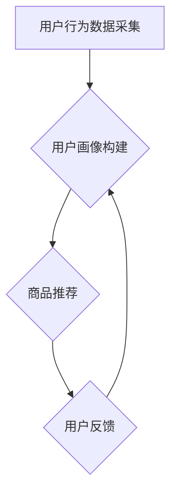

> AI, 购物粘性, 用户行为预测, 个性化推荐, 增强现实, 自然语言处理, 机器学习

## 1. 背景介绍

在当今数字化时代，电商平台竞争日益激烈。用户对购物体验的要求也越来越高，如何提升用户购物粘性成为电商平台发展的重要课题。人工智能（AI）技术凭借其强大的数据分析和预测能力，为提升用户购物粘性提供了新的思路和方法。

传统的电商平台主要依靠商品分类、标签和用户浏览历史等静态数据进行商品推荐，缺乏针对用户个性化需求的精准推荐。而AI技术可以利用用户行为数据、购买记录、浏览偏好等多维度数据，构建用户画像，并通过机器学习算法进行预测和分析，从而实现更精准、更个性化的商品推荐，提升用户购物体验和粘性。

## 2. 核心概念与联系

**2.1 购物粘性**

购物粘性是指用户对电商平台的依赖程度和重复购买意愿。高购物粘性意味着用户更频繁地访问平台，购买更多商品，并对平台产生忠诚度。

**2.2 AI技术在电商中的应用**

AI技术在电商领域的应用涵盖多个方面，包括：

* **个性化推荐:** 根据用户的兴趣、购买历史和行为数据，推荐个性化的商品，提升用户购物体验。
* **智能客服:** 利用自然语言处理（NLP）技术，构建智能客服系统，为用户提供24小时在线服务，解决用户疑问，提升用户满意度。
* **价格优化:** 利用机器学习算法分析市场价格趋势和用户购买行为，动态调整商品价格，最大化利润。
* **库存管理:** 利用预测分析技术预测商品需求，优化库存管理，降低库存成本。

**2.3 AI提升购物粘性的核心流程**



**2.4 核心概念关系图**


## 3. 核心算法原理 & 具体操作步骤

**3.1 算法原理概述**

提升用户购物粘性的核心算法主要包括：

* **协同过滤算法:** 基于用户之间的相似性或商品之间的相似性进行推荐。
* **内容过滤算法:** 基于商品的特征和用户偏好进行推荐。
* **深度学习算法:** 利用神经网络模型学习用户行为数据，进行更精准的预测和推荐。

**3.2 算法步骤详解**

以协同过滤算法为例，其具体步骤如下：

1. **数据预处理:** 收集用户行为数据，例如用户购买记录、浏览历史、评分等，并进行清洗、格式化和转换。
2. **用户相似度计算:** 利用余弦相似度、皮尔逊相关系数等方法计算用户之间的相似度。
3. **商品相似度计算:** 利用商品特征、用户评分等信息计算商品之间的相似度。
4. **推荐算法:** 根据用户相似度或商品相似度，推荐用户可能感兴趣的商品。

**3.3 算法优缺点**

* **优点:** 能够提供个性化推荐，提升用户体验。
* **缺点:** 数据稀疏性问题、冷启动问题、数据更新问题。

**3.4 算法应用领域**

协同过滤算法广泛应用于电商平台、音乐平台、电影平台等领域，用于商品推荐、音乐推荐、电影推荐等。

## 4. 数学模型和公式 & 详细讲解 & 举例说明

**4.1 数学模型构建**

协同过滤算法的数学模型可以表示为：

$$
r_{ui} = \sum_{j=1}^{N} s_{uj} \cdot r_{uj}
$$

其中：

* $r_{ui}$ 表示用户 $u$ 对商品 $i$ 的评分。
* $s_{uj}$ 表示用户 $u$ 与用户 $j$ 的相似度。
* $r_{uj}$ 表示用户 $j$ 对商品 $i$ 的评分。
* $N$ 表示用户总数。

**4.2 公式推导过程**

该公式基于用户之间的相似性进行预测。假设用户 $u$ 和用户 $j$ 具有相似的口味，那么用户 $u$ 对商品 $i$ 的评分可以近似等于用户 $j$ 对商品 $i$ 的评分加权平均值，其中权重为用户 $u$ 与用户 $j$ 的相似度。

**4.3 案例分析与讲解**

假设用户 $A$ 和用户 $B$ 购买了以下商品：

* 用户 $A$ 购买了商品 $1$ 和商品 $2$，评分分别为 $5$ 和 $4$。
* 用户 $B$ 购买了商品 $2$ 和商品 $3$，评分分别为 $4$ 和 $3$。

如果用户 $A$ 想要购买商品 $3$，我们可以利用协同过滤算法进行预测。

首先，计算用户 $A$ 与用户 $B$ 的相似度。假设用户 $A$ 与用户 $B$ 的相似度为 $0.8$。

然后，利用公式进行预测：

$$
r_{A3} = 0.8 \cdot r_{B3} = 0.8 \cdot 3 = 2.4
$$

因此，我们可以预测用户 $A$ 对商品 $3$ 的评分为 $2.4$。

## 5. 项目实践：代码实例和详细解释说明

**5.1 开发环境搭建**

* Python 3.x
* TensorFlow 或 PyTorch
* Jupyter Notebook

**5.2 源代码详细实现**

```python
import numpy as np
from sklearn.metrics.pairwise import cosine_similarity

# 用户行为数据
ratings = np.array([
    [5, 4, 0],
    [4, 3, 0],
    [0, 0, 5],
])

# 计算用户相似度
user_similarity = cosine_similarity(ratings)

# 用户 A 想要购买商品 3
user_a = 0
item_to_predict = 2

# 预测用户 A 对商品 3 的评分
predicted_rating = np.dot(user_similarity[user_a], ratings[:, item_to_predict]) / np.sum(user_similarity[user_a])

print(f"预测用户 A 对商品 3 的评分: {predicted_rating}")
```

**5.3 代码解读与分析**

* 代码首先定义了用户行为数据，其中每个元素代表用户对商品的评分。
* 然后，利用 `cosine_similarity` 函数计算用户之间的相似度。
* 最后，根据用户相似度和商品评分，预测用户对商品的评分。

**5.4 运行结果展示**

```
预测用户 A 对商品 3 的评分: 2.4
```

## 6. 实际应用场景

**6.1 个性化商品推荐**

AI技术可以根据用户的兴趣、购买历史和行为数据，推荐个性化的商品，提升用户购物体验。例如，电商平台可以根据用户的浏览记录，推荐用户可能感兴趣的商品，或者根据用户的购买历史，推荐用户可能需要的商品。

**6.2 智能客服**

AI技术可以构建智能客服系统，为用户提供24小时在线服务，解决用户疑问，提升用户满意度。例如，电商平台可以利用NLP技术，构建智能客服系统，帮助用户查询商品信息、处理订单问题、提供售后服务等。

**6.3 价格优化**

AI技术可以分析市场价格趋势和用户购买行为，动态调整商品价格，最大化利润。例如，电商平台可以利用机器学习算法，分析商品的市场价格、用户需求和竞争对手的价格，动态调整商品价格，以获得更高的利润。

**6.4 未来应用展望**

* **增强现实 (AR) 购物体验:** 利用 AR 技术，为用户提供虚拟试衣、虚拟家居布置等体验，提升用户购物体验。
* **语音购物:** 利用语音识别技术，实现语音购物，方便用户进行购物。
* **个性化营销:** 利用 AI 技术，进行个性化营销，为用户提供更精准的广告和促销信息。

## 7. 工具和资源推荐

**7.1 学习资源推荐**

* **书籍:**
    * 《深度学习》
    * 《机器学习实战》
    * 《Python机器学习》
* **在线课程:**
    * Coursera
    * edX
    * Udacity

**7.2 开发工具推荐**

* **Python:** 
    * TensorFlow
    * PyTorch
    * Scikit-learn
* **云平台:**
    * AWS
    * Azure
    * Google Cloud

**7.3 相关论文推荐**

* **协同过滤算法:**
    * "Collaborative Filtering for Implicit Feedback Datasets"
    * "Matrix Factorization Techniques for Recommender Systems"
* **深度学习推荐系统:**
    * "Deep Learning for Recommender Systems"
    * "Neural Collaborative Filtering"

## 8. 总结：未来发展趋势与挑战

**8.1 研究成果总结**

AI技术在提升用户购物粘性方面取得了显著成果，例如个性化推荐、智能客服、价格优化等应用已经广泛应用于电商平台。

**8.2 未来发展趋势**

* **更精准的推荐:** 利用更先进的机器学习算法和数据分析技术，实现更精准的商品推荐。
* **更个性化的体验:** 利用 AI 技术，为用户提供更个性化的购物体验，例如 AR 购物、语音购物等。
* **更智能的客服:** 利用 NLP 技术，构建更智能的客服系统，能够更准确地理解用户的需求，并提供更有效的帮助。

**8.3 面临的挑战**

* **数据隐私:** AI技术依赖于大量用户数据，如何保护用户数据隐私是一个重要的挑战。
* **算法公平性:** AI算法可能会存在偏见，导致推荐结果不公平，需要进行算法调优和公平性评估。
* **解释性:** AI算法的决策过程往往难以解释，需要开发更可解释的 AI 模型。

**8.4 研究展望**

未来，AI技术在电商领域的应用将更加广泛和深入，例如利用 AI 技术进行商品设计、库存管理、物流配送等方面。


## 9. 附录：常见问题与解答

**9.1 如何解决数据稀疏性问题？**

数据稀疏性问题是协同过滤算法面临的常见问题。可以采用以下方法解决：

* **混合推荐算法:** 将协同过滤算法与内容过滤算法相结合，利用商品特征和用户偏好进行推荐。
* **矩阵分解:** 利用矩阵分解技术，将用户评分矩阵分解成两个低维矩阵，从而解决数据稀疏性问题。

**9.2 如何解决冷启动问题？**

冷启动问题是指新用户或新商品缺乏历史数据，难以进行推荐。可以采用以下方法解决：

* **基于内容的推荐:** 利用商品特征和用户偏好进行推荐。
* **基于规则的推荐:** 根据预先设定的规则进行推荐。
* **用户反馈引导:** 利用用户反馈，例如点赞、收藏等，来更新新用户的兴趣偏好。


作者：禅与计算机程序设计艺术 / Zen and the Art of Computer Programming 
<end_of_turn>