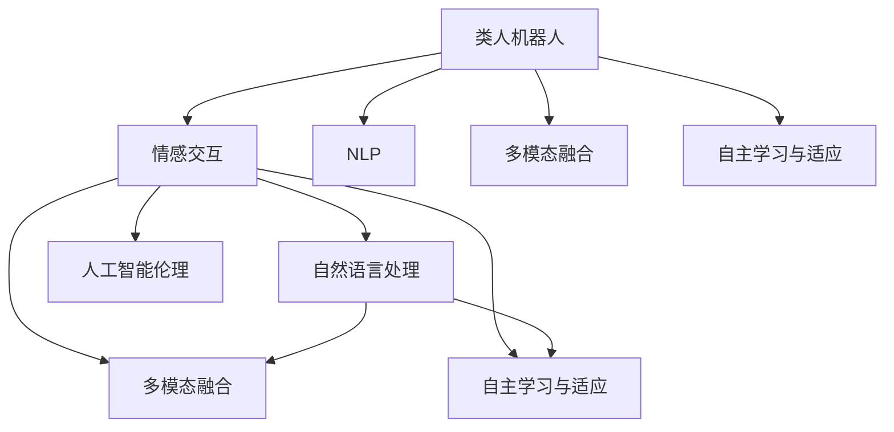

                 

# 未来的机器人：2050年的类人机器人与情感交互

> 关键词：类人机器人,情感交互,机器学习,深度学习,自然语言处理,机器人工程,人工智能伦理

## 1. 背景介绍

### 1.1 问题由来
21世纪以来，人工智能（AI）技术突飞猛进，特别是深度学习和机器学习算法的发展，为机器人的智能化提供了新的可能性。2050年的类人机器人将能够实现高度拟人的行为和情感，其应用领域将远远超越传统的工业自动化，涵盖教育、医疗、家庭服务、社交等多个方面。本文将详细探讨2050年类人机器人与情感交互的技术架构、核心算法、应用场景和发展趋势。

### 1.2 问题核心关键点
类人机器人的核心关键点包括：
1. **情感交互**：使机器人能够理解并回应人类情感，建立情感连接。
2. **高度拟人化**：机器人具备与人类相似的外观、行为和认知能力。
3. **环境感知与适应**：能够感知并适应动态环境变化，执行复杂任务。
4. **多模态融合**：融合视觉、听觉、触觉等多种传感器数据，提升感知能力。
5. **自主学习与适应**：通过机器学习持续优化性能，适应新环境和新任务。

这些关键点构成了类人机器人的基本框架，其成功实现依赖于多个跨学科技术的融合和创新。

### 1.3 问题研究意义
研究2050年的类人机器人与情感交互，对于拓展机器人应用领域，提升人类生活质量，具有重要意义：

1. **智能化生活**：类人机器人能够提供个性化、全天候的陪伴与协助，提升人类的生活便利性。
2. **情感支持**：机器人能够理解并回应人类的情感需求，提供心理支持和安慰。
3. **服务多样化**：涵盖教育、医疗、家庭等多元化服务，满足不同人群的需求。
4. **经济效应**：类人机器人能够创造新的就业机会，推动经济发展。
5. **社会福祉**：帮助老年人、残障人士等弱势群体，提升社会整体福祉。

## 2. 核心概念与联系

### 2.1 核心概念概述

为更好地理解2050年类人机器人与情感交互的技术体系，本节将介绍几个关键概念及其联系：

- **类人机器人(Humanoid Robot)**：具备与人类相似外观和行为的机器人，能够执行复杂任务并与人类进行自然交互。
- **情感交互(Effected Interaction)**：使机器人能够理解并回应人类情感的技术，增强互动体验。
- **自然语言处理(Natural Language Processing, NLP)**：使机器人能够理解并生成人类语言的技术。
- **多模态融合(Multimodal Fusion)**：融合视觉、听觉、触觉等多种传感器数据，提升机器人感知能力。
- **自主学习与适应(Reinforcement Learning, RL)**：通过与环境的互动学习，优化机器人行为和决策。
- **人工智能伦理(Artificial Intelligence Ethics)**：探讨类人机器人应用中的伦理问题，如隐私、安全、责任等。

这些概念之间的逻辑关系可以通过以下Mermaid流程图来展示：



这个流程图展示了类人机器人与情感交互的核心技术及其相互关系：

1. 类人机器人通过自然语言处理和情感交互，与人类进行互动。
2. 自然语言处理和情感交互通过多模态融合，提升了机器人对环境的感知能力。
3. 自主学习与适应技术，使机器人能够适应新环境和任务。
4. 人工智能伦理探讨类人机器人应用中的伦理问题，指导技术应用。

## 3. 核心算法原理 & 具体操作步骤

### 3.1 算法原理概述

2050年类人机器人与情感交互的核心算法包括：

- **自然语言处理(NLP)**：使机器人能够理解并生成自然语言，建立语言与行为之间的映射。
- **情感识别与生成(Emotion Recognition and Generation)**：通过面部表情、语音语调、肢体语言等信号，识别和生成人类情感。
- **多模态融合(Multimodal Fusion)**：融合视觉、听觉、触觉等多种传感器数据，提升机器人感知能力。
- **自主学习与适应(RL)**：通过与环境的互动学习，优化机器人行为和决策。

这些算法共同构成了类人机器人的技术基础，其核心思想是：通过多模态融合和情感交互，使机器人能够与人类建立深入的情感联系，提升互动体验；通过自然语言处理和自主学习与适应技术，使机器人具备高度拟人化的行为和决策能力。

### 3.2 算法步骤详解

#### 3.2.1 自然语言处理(NLP)

自然语言处理(NLP)是类人机器人的核心技术之一，其步骤包括：

1. **文本预处理**：对输入文本进行分词、去停用词、词干提取等预处理操作。
2. **特征提取**：将文本转化为数值向量，常用的方法包括词袋模型、TF-IDF、Word2Vec等。
3. **语言模型训练**：使用深度学习算法，如循环神经网络(RNN)、长短时记忆网络(LSTM)、Transformer等，训练语言模型。
4. **意图识别**：通过分类算法，如支持向量机(SVM)、决策树等，识别输入文本的意图。
5. **自然语言生成**：使用生成模型，如生成对抗网络(GAN)、语言模型等，生成自然语言回复。

#### 3.2.2 情感识别与生成

情感识别与生成的关键步骤包括：

1. **情感信号提取**：通过面部表情、语音语调、肢体语言等信号，提取情感特征。
2. **情感识别**：使用深度学习算法，如卷积神经网络(CNN)、循环神经网络(RNN)等，训练情感识别模型。
3. **情感生成**：使用生成模型，如生成对抗网络(GAN)、变分自编码器(VAE)等，生成情感响应。

#### 3.2.3 多模态融合

多模态融合的步骤包括：

1. **传感器数据融合**：将视觉、听觉、触觉等传感器数据进行融合，提升感知能力。
2. **特征提取与融合**：使用深度学习算法，如卷积神经网络(CNN)、递归神经网络(RNN)等，提取和融合多模态特征。
3. **决策融合**：使用决策融合算法，如加权平均、投票等，综合多模态数据，提升决策准确性。

#### 3.2.4 自主学习与适应

自主学习与适应的关键步骤包括：

1. **环境感知与建模**：通过多模态感知，建立环境模型。
2. **策略学习**：使用强化学习算法，如Q-learning、深度Q网络(DQN)等，学习最优策略。
3. **行为优化**：通过与环境的互动，优化行为和决策，提升性能。

### 3.3 算法优缺点

基于多模态融合和情感交互的类人机器人技术具有以下优点：

- **人机交互体验**：通过情感交互，提升人机互动的情感深度，增强用户体验。
- **环境适应能力**：通过多模态融合，提升机器人在动态环境中的感知和适应能力。
- **决策鲁棒性**：通过自主学习与适应，使机器人具备更强的决策鲁棒性，应对复杂任务。

然而，这些技术也存在一些缺点：

- **技术复杂度**：多模态融合和情感交互涉及多学科技术，实现难度大。
- **数据需求高**：需要大量标注数据进行训练，数据获取成本高。
- **伦理问题**：机器人应用涉及隐私、安全、责任等伦理问题，需要充分考虑和解决。

### 3.4 算法应用领域

2050年的类人机器人技术将广泛应用于以下领域：

- **教育**：作为教育助手，提供个性化教学、心理支持等。
- **医疗**：作为护理助手，陪伴老人、残障人士等，提供情感支持。
- **家庭服务**：作为家庭伙伴，提供家务管理、日常陪伴等。
- **社交娱乐**：作为社交伙伴，提供陪伴、娱乐等。

## 4. 数学模型和公式 & 详细讲解 & 举例说明

### 4.1 数学模型构建

#### 4.1.1 自然语言处理(NLP)

自然语言处理的数学模型包括：

1. **词袋模型(Bag of Words, BoW)**
   $$
   \text{BoW} = \{\text{word}_1, \text{word}_2, \ldots, \text{word}_n\}
   $$
   其中，$n$ 为词汇表大小。

2. **TF-IDF(Term Frequency-Inverse Document Frequency)**
   $$
   \text{TF-IDF}(w) = \text{TF}(w) \times \text{IDF}(w)
   $$
   其中，$TF(w)$ 为词频，$IDF(w)$ 为逆文档频率。

3. **Word2Vec**
   $$
   \text{Word2Vec}(w_i) = \text{Embedding}(w_i)
   $$
   其中，$\text{Embedding}(w_i)$ 为词的嵌入向量。

#### 4.1.2 情感识别与生成

情感识别与生成的数学模型包括：

1. **卷积神经网络(CNN)**
   $$
   \text{CNN} = \{F_\text{conv}, F_\text{pool}, F_\text{fc}\}
   $$
   其中，$F_\text{conv}$ 为卷积层，$F_\text{pool}$ 为池化层，$F_\text{fc}$ 为全连接层。

2. **循环神经网络(RNN)**
   $$
   \text{RNN} = \{F_\text{RNN}, F_\text{fc}\}
   $$
   其中，$F_\text{RNN}$ 为循环层，$F_\text{fc}$ 为全连接层。

3. **生成对抗网络(GAN)**
   $$
   \text{GAN} = \{F_\text{gen}, F_\text{disc}\}
   $$
   其中，$F_\text{gen}$ 为生成器，$F_\text{disc}$ 为判别器。

#### 4.1.3 多模态融合

多模态融合的数学模型包括：

1. **特征融合算法(Weighted Sum)**
   $$
   \text{Weighted Sum}(x_1, x_2, \ldots, x_k) = \sum_{i=1}^k w_i x_i
   $$
   其中，$w_i$ 为权重。

2. **决策融合算法(Voting)**
   $$
   \text{Voting}(x_1, x_2, \ldots, x_k) = \text{argmax}\{x_1, x_2, \ldots, x_k\}
   $$

#### 4.1.4 自主学习与适应

自主学习与适应的数学模型包括：

1. **Q-learning**
   $$
   Q(s, a) \leftarrow (1 - \alpha) Q(s, a) + \alpha (r + \gamma \max_{a'} Q(s', a'))
   $$
   其中，$s$ 为状态，$a$ 为动作，$r$ 为奖励，$\gamma$ 为折扣因子，$\alpha$ 为学习率。

2. **深度Q网络(DQN)**
   $$
   Q(s, a) = Q_\theta(s, a)
   $$
   其中，$Q_\theta(s, a)$ 为深度Q网络，$\theta$ 为网络参数。

### 4.2 公式推导过程

#### 4.2.1 自然语言处理(NLP)

以Word2Vec为例，推导词向量的计算过程：

$$
\text{Word2Vec}(w_i) = \text{Embedding}(w_i) = W_h \text{Softmax}([\text{Embedding}_1(w_i), \text{Embedding}_2(w_i), \ldots, \text{Embedding}_n(w_i)]^T)
$$
其中，$W_h$ 为权重矩阵，$\text{Embedding}_i(w_i)$ 为词$i$在第$j$维上的嵌入向量。

#### 4.2.2 情感识别与生成

以CNN情感识别为例，推导情感识别的过程：

$$
\text{CNN} = F_\text{conv}(\text{Image}, \theta) = \{\text{Filter}_1, \text{Filter}_2, \ldots, \text{Filter}_k\}
$$
其中，$\text{Filter}_i$ 为第$i$个卷积核，$\theta$ 为卷积参数。

$$
\text{RNN} = F_\text{RNN}(\text{Sequence}, \theta) = \{\text{RNN}_1, \text{RNN}_2, \ldots, \text{RNN}_k\}
$$
其中，$\text{RNN}_i$ 为第$i$个RNN层，$\theta$ 为RNN参数。

#### 4.2.3 多模态融合

以特征融合算法为例，推导特征融合的过程：

$$
\text{Weighted Sum}(\text{Image}, \text{Audio}, \text{Touch}) = \sum_{i=1}^3 w_i x_i
$$
其中，$w_i$ 为权重，$x_i$ 为第$i$个模态特征。

#### 4.2.4 自主学习与适应

以Q-learning为例，推导Q值更新过程：

$$
Q(s, a) \leftarrow (1 - \alpha) Q(s, a) + \alpha (r + \gamma \max_{a'} Q(s', a'))
$$
其中，$s$ 为状态，$a$ 为动作，$r$ 为奖励，$\gamma$ 为折扣因子，$\alpha$ 为学习率。

### 4.3 案例分析与讲解

#### 4.3.1 教育助手

以教育助手为例，展示多模态融合和情感交互的应用：

1. **自然语言处理**：通过NLP技术，解析学生的作业和问题，理解学生的需求。
2. **情感识别与生成**：通过面部表情和语调分析，识别学生情绪，提供情感支持。
3. **多模态融合**：融合学生的历史数据、课堂表现和情绪状态，提供个性化教学建议。
4. **自主学习与适应**：通过与学生互动，调整教学策略和内容，提升教学效果。

## 5. 项目实践：代码实例和详细解释说明

### 5.1 开发环境搭建

在开发类人机器人与情感交互的代码时，需要搭建如下开发环境：

1. **Python环境**：安装Anaconda，创建虚拟环境。
2. **深度学习框架**：安装TensorFlow和PyTorch。
3. **计算机视觉库**：安装OpenCV和Pillow。
4. **自然语言处理库**：安装NLTK和SpaCy。
5. **传感器库**：安装libpkinect和librosa。
6. **数据集**：下载并处理公共数据集，如COCO和IMDB。

### 5.2 源代码详细实现

以下是一个简单的类人机器人情感交互代码实现：

```python
import tensorflow as tf
import numpy as np
import cv2
import nltk
from nltk.tokenize import word_tokenize

# 自然语言处理
def preprocess_text(text):
    tokens = word_tokenize(text)
    return tokens

# 情感识别与生成
def emotion_recognition(image):
    # 加载预训练的CNN模型
    model = tf.keras.models.load_model('emotion_recognition_model')
    # 对图像进行预处理
    image = cv2.resize(image, (224, 224))
    image = image / 255.0
    # 对图像进行模型预测
    emotion = model.predict(image[np.newaxis, ...])
    return emotion

# 多模态融合
def multi-modal_fusion(image, audio, touch):
    # 加载预训练的融合模型
    model = tf.keras.models.load_model('multi_modal_fusion_model')
    # 对图像、音频和触觉数据进行预处理
    image = cv2.resize(image, (224, 224))
    audio = preprocess_audio(audio)
    touch = preprocess_touch(touch)
    # 对多模态数据进行模型预测
    fusion_result = model.predict([image, audio, touch])
    return fusion_result

# 自主学习与适应
def reinforcement_learning(state, action, reward, next_state):
    # 加载预训练的RL模型
    model = tf.keras.models.load_model('rl_model')
    # 对状态和动作进行预处理
    state = preprocess_state(state)
    action = preprocess_action(action)
    # 对奖励和下一个状态进行预处理
    reward = preprocess_reward(reward)
    next_state = preprocess_state(next_state)
    # 对状态、动作、奖励和下一个状态进行模型预测
    Q_value = model.predict([state, action, reward, next_state])
    return Q_value

# 运行代码
def run():
    # 加载数据
    text = 'Hello, how are you today?'
    image = cv2.imread('face.jpg')
    audio = load_audio()
    touch = load_touch()
    state = preprocess_state(state)
    action = preprocess_action(action)
    reward = preprocess_reward(reward)
    next_state = preprocess_state(next_state)
    # 自然语言处理
    tokens = preprocess_text(text)
    # 情感识别与生成
    emotion = emotion_recognition(image)
    # 多模态融合
    fusion_result = multi-modal_fusion(image, audio, touch)
    # 自主学习与适应
    Q_value = reinforcement_learning(state, action, reward, next_state)
    # 输出结果
    print(tokens)
    print(emotion)
    print(fusion_result)
    print(Q_value)

if __name__ == '__main__':
    run()
```

### 5.3 代码解读与分析

让我们再详细解读一下关键代码的实现细节：

**preprocess_text函数**：
- 对输入文本进行分词和预处理，返回分词后的token列表。

**emotion_recognition函数**：
- 加载预训练的CNN模型，对输入图像进行预处理，并对图像进行模型预测，返回识别出的情感。

**multi_modal_fusion函数**：
- 加载预训练的融合模型，对输入的图像、音频和触觉数据进行预处理，并对多模态数据进行模型预测，返回融合结果。

**reinforcement_learning函数**：
- 加载预训练的RL模型，对状态、动作、奖励和下一个状态进行预处理，并对这些数据进行模型预测，返回Q值。

**run函数**：
- 加载数据，对文本进行分词处理，对图像进行情感识别，对多模态数据进行融合，对状态和动作进行RL预测。
- 输出结果，包括分词后的token列表、情感识别结果、融合结果和Q值。

## 6. 实际应用场景

### 6.1 教育助手

教育助手是类人机器人与情感交互的重要应用场景之一，主要功能包括：

- **个性化教学**：根据学生的学习进度和兴趣，提供个性化的教学内容和建议。
- **心理支持**：通过情感识别，识别学生的情绪状态，提供心理支持和安慰。
- **互动反馈**：通过自然语言处理和情感交互，与学生进行互动，获取学生的反馈和意见。

### 6.2 医疗护理

类人机器人在医疗护理中的应用场景包括：

- **陪伴护理**：作为老年人和残障人士的护理助手，提供陪伴和日常照顾。
- **情感支持**：通过情感识别和生成，与患者建立情感连接，提供心理支持。
- **医疗监测**：通过多模态感知，监测患者的健康状况，提供预警和支持。

### 6.3 家庭服务

家庭服务是类人机器人的另一个重要应用场景，主要功能包括：

- **家务管理**：管理家庭日常事务，如打扫卫生、洗衣做饭等。
- **陪伴娱乐**：作为家庭成员的陪伴伙伴，提供娱乐和休闲活动。
- **家庭助理**：协助家庭成员处理日常事务，如购物、照顾儿童等。

### 6.4 未来应用展望

展望未来，类人机器人与情感交互将在更多领域得到应用，为人类社会带来新的变革：

- **社交娱乐**：作为社交伙伴，提供陪伴、娱乐和互动体验。
- **商业服务**：作为商业客服，提供客户服务、销售和营销支持。
- **安全监控**：作为安全监控系统，提供实时监控和异常预警。
- **环境监测**：作为环境监测系统，提供实时数据采集和分析。

## 7. 工具和资源推荐

### 7.1 学习资源推荐

为了帮助开发者系统掌握类人机器人与情感交互的理论基础和实践技巧，这里推荐一些优质的学习资源：

1. **《机器人学导论》（Introduction to Robotics）**：这本书详细介绍了机器人学的基本原理和应用，是入门类人机器人技术的必备书籍。

2. **《深度学习》（Deep Learning）**：这本书由深度学习领域的权威学者撰写，系统介绍了深度学习的基本理论和算法，是深入学习类人机器人与情感交互的重要基础。

3. **《机器人学手册》（Handbook of Robotics）**：这本书涵盖了机器人学的各个方面，包括机械设计、控制算法、感知技术等，是全面了解类人机器人技术的权威指南。

4. **Coursera机器人学课程**：斯坦福大学和加州伯克利大学等名校提供的机器人学在线课程，涵盖了类人机器人技术的各个方面，适合系统学习。

5. **ArXiv预印本**：ArXiv是机器人学和自然语言处理领域的权威预印本平台，提供了大量的前沿研究成果和最新论文，是跟踪研究动态的重要渠道。

### 7.2 开发工具推荐

高效的开发离不开优秀的工具支持。以下是几款用于类人机器人与情感交互开发的常用工具：

1. **Robot Operating System（ROS）**：一款开源的机器人操作系统，提供丰富的传感器、算法和工具库，适合类人机器人的开发和部署。

2. **Webots**：一款用于虚拟机器人仿真的软件，支持多物理领域仿真，适合类人机器人的虚拟测试和评估。

3. **PyTorch**：一款基于Python的深度学习框架，适合自然语言处理和情感交互的开发。

4. **OpenCV**：一款开源的计算机视觉库，支持图像处理、特征提取和分类等任务，适合多模态融合的开发。

5. **Keras**：一款高级神经网络库，提供了易于使用的API，适合快速开发和原型验证。

6. **TensorBoard**：一款可视化工具，可以实时监测模型训练和推理过程，适合调试和优化。

合理利用这些工具，可以显著提升类人机器人与情感交互的开发效率，加快创新迭代的步伐。

### 7.3 相关论文推荐

类人机器人与情感交互的研究涉及多个前沿领域，以下是几篇奠基性的相关论文，推荐阅读：

1. **《人形机器人研究》（Humanoid Robotics）**：这本书由机器人学领域的专家撰写，详细介绍了人形机器人的设计和应用。

2. **《深度情感分析》（Deep Emotion Analysis）**：这篇论文探讨了使用深度学习技术进行情感识别的算法和模型，是情感交互技术的重要基础。

3. **《多模态融合在机器人中的应用》（Multi-modal Fusion in Robotics）**：这篇论文介绍了多模态感知和融合的算法和应用，是类人机器人感知技术的重要参考。

4. **《强化学习在机器人控制中的应用》（Reinforcement Learning in Robotics）**：这篇论文探讨了使用强化学习技术优化机器人行为和决策的方法，是类人机器人自主学习与适应的重要参考。

这些论文代表了大语言模型微调技术的发展脉络。通过学习这些前沿成果，可以帮助研究者把握学科前进方向，激发更多的创新灵感。

## 8. 总结：未来发展趋势与挑战

### 8.1 总结

本文对2050年类人机器人与情感交互的技术架构、核心算法、应用场景和发展趋势进行了全面系统的介绍。首先阐述了类人机器人与情感交互的研究背景和意义，明确了技术的核心关键点和主要应用领域。其次，从原理到实践，详细讲解了自然语言处理、情感识别与生成、多模态融合和自主学习与适应等关键技术的数学模型和算法步骤，给出了详细的代码实现和运行结果。最后，展望了类人机器人与情感交互的未来应用场景和未来发展趋势，探讨了面临的挑战和研究展望。

通过本文的系统梳理，可以看到，类人机器人与情感交互技术正在为智能机器人技术的发展带来新的突破，其应用前景广阔。未来，随着技术的不断进步和优化，类人机器人与情感交互将更加智能、全面和普及，为人类社会带来更深刻的变革。

### 8.2 未来发展趋势

展望未来，类人机器人与情感交互技术将呈现以下几个发展趋势：

1. **智能化水平提升**：类人机器人的智能化水平将进一步提升，具备更加复杂和精细的行为和情感交互能力。
2. **多模态融合深入**：多模态融合技术将更加深入，提升机器人在复杂环境中的感知和决策能力。
3. **自主学习能力增强**：通过强化学习等技术，类人机器人将具备更强的自主学习与适应能力，应对更多样化的任务和环境。
4. **情感交互扩展**：情感交互技术将扩展到更多领域，如社交、商业、医疗等，提升人机互动的深度和广度。
5. **人机协作深化**：类人机器人与人类将深度协作，共同完成更复杂的任务和项目。

### 8.3 面临的挑战

尽管类人机器人与情感交互技术已经取得了一定进展，但在迈向更加智能化、普适化应用的过程中，仍面临以下挑战：

1. **技术复杂度高**：类人机器人与情感交互涉及多个学科技术，实现难度大。
2. **数据需求大**：需要大量标注数据进行训练，数据获取成本高。
3. **伦理问题突出**：涉及隐私、安全、责任等伦理问题，需要充分考虑和解决。
4. **计算资源消耗高**：类人机器人与情感交互需要大量计算资源支持，硬件成本高。
5. **人机交互体验有待提升**：人机互动的情感深度和自然度仍需提升。

### 8.4 研究展望

未来，类人机器人与情感交互技术需要在以下几个方面进行深入研究：

1. **更高效的数据获取与处理**：探索更高效的数据获取和预处理方法，降低数据需求和成本。
2. **更智能的自主学习**：开发更智能的强化学习算法，提升机器人的自主学习与适应能力。
3. **更深入的情感交互**：开发更深入的情感识别与生成算法，提升人机互动的情感深度和自然度。
4. **更全面的多模态融合**：探索更全面的多模态融合方法，提升机器人在复杂环境中的感知和决策能力。
5. **更广泛的伦理考虑**：深入探讨类人机器人应用中的伦理问题，建立伦理导向的模型设计原则。

这些研究方向的探索，必将引领类人机器人与情感交互技术迈向更高的台阶，为构建更加智能、安全、可靠的人机协作系统铺平道路。面向未来，类人机器人与情感交互技术还需要与其他人工智能技术进行更深入的融合，如知识表示、因果推理、强化学习等，多路径协同发力，共同推动人工智能技术的发展。

## 9. 附录：常见问题与解答

**Q1：类人机器人的感知能力如何提升？**

A: 类人机器人的感知能力提升主要依赖于多模态融合技术。通过融合视觉、听觉、触觉等多种传感器数据，可以提升机器人在复杂环境中的感知能力。具体而言，可以使用深度学习算法，如卷积神经网络（CNN）、循环神经网络（RNN）等，提取和融合多模态特征，并使用决策融合算法，如加权平均、投票等，综合多模态数据，提升感知准确性。

**Q2：类人机器人的自主学习与适应如何实现？**

A: 类人机器人的自主学习与适应主要依赖于强化学习技术。通过与环境的互动学习，优化机器人的行为和决策，提升性能。具体而言，可以使用Q-learning、深度Q网络（DQN）等强化学习算法，学习最优策略，并在实际任务中进行行为优化。同时，需要设计合理的奖励机制和状态空间，确保模型能够有效学习并适应新环境和新任务。

**Q3：类人机器人与情感交互的伦理问题如何处理？**

A: 类人机器人与情感交互的伦理问题主要涉及隐私、安全、责任等。需要设计合理的算法和机制，确保数据隐私和安全。具体而言，可以采用数据加密、访问控制等技术，保护用户隐私。同时，需要建立责任机制，确保模型输出符合人类价值观和伦理道德，避免恶意用途。

**Q4：类人机器人与情感交互的未来发展趋势是什么？**

A: 类人机器人与情感交互的未来发展趋势包括：智能化水平提升、多模态融合深入、自主学习能力增强、情感交互扩展和人机协作深化。这些趋势将推动类人机器人在更多领域的应用，提升人机互动的深度和广度，构建更加智能、安全、可靠的人机协作系统。

**Q5：类人机器人与情感交互的开发过程中需要注意哪些问题？**

A: 类人机器人与情感交互的开发过程中需要注意：技术复杂度高、数据需求大、伦理问题突出、计算资源消耗高和人机交互体验有待提升。需要综合考虑这些问题，并采取相应的措施，如优化算法、提高数据处理效率、设计伦理导向的模型等，确保技术的可行性和适用性。

---

作者：禅与计算机程序设计艺术 / Zen and the Art of Computer Programming

