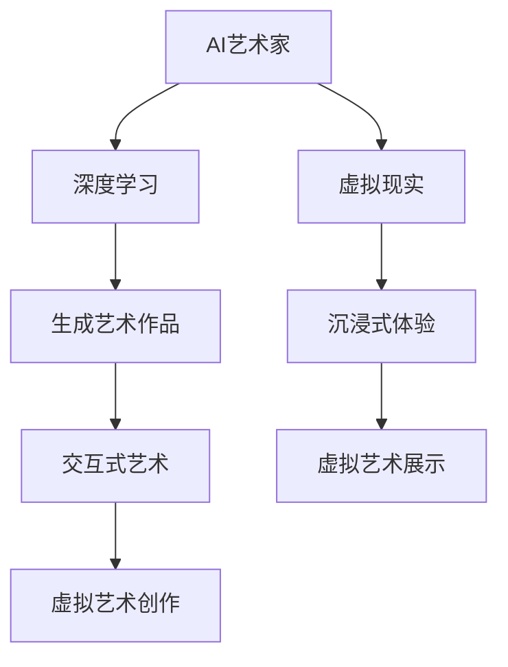
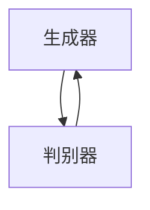

                 

# 未来的艺术创作：2050年的AI艺术家与虚拟现实艺术

> 关键词：人工智能,艺术创作,虚拟现实,未来技术,创意设计,交互式艺术

## 1. 背景介绍

### 1.1 问题由来

随着人工智能(AI)技术的迅速发展，AI艺术家与虚拟现实(VR)艺术的结合已经成为未来艺术创作领域的一大趋势。AI艺术作品能够通过自我学习，生成具有创意和个性化的艺术作品，极大地拓展了艺术创作的边界。同时，VR艺术利用沉浸式体验，让用户能够沉浸在艺术创作和欣赏的虚拟环境中，带来全新的感官体验。本文将介绍未来2050年的AI艺术家与VR艺术，探讨其在艺术创作领域的创新应用。

### 1.2 问题核心关键点

本文主要关注以下几个关键点：

- AI艺术家如何生成艺术作品
- VR艺术在创作和体验中的应用
- AI与VR艺术的结合及其对未来艺术创作的影响
- AI艺术家在2050年的发展趋势
- VR艺术技术的最新进展

这些关键点将帮助我们全面了解AI艺术家与VR艺术的未来应用及其对艺术创作的影响。

### 1.3 问题研究意义

AI艺术家与VR艺术的结合将极大地推动未来艺术创作的发展，带来新的创意和表达形式。通过理解和掌握这些前沿技术，我们能够预见未来艺术创作的趋势，为未来的艺术工作者提供新的灵感和工具。

## 2. 核心概念与联系

### 2.1 核心概念概述

- **AI艺术家**：通过机器学习算法，能够自主生成艺术作品的AI系统，如基于神经网络的艺术生成模型。

- **VR艺术**：利用虚拟现实技术，创建沉浸式艺术作品，通过三维空间和交互式体验，提升艺术欣赏和创作质量。

- **深度学习**：AI艺术家的核心技术之一，通过多层神经网络，实现对输入数据的抽象和生成。

- **虚拟现实**：通过计算机生成的3D环境，模拟真实世界，提供沉浸式体验的技术。

这些核心概念构成了AI艺术家与VR艺术的基础，在未来的艺术创作中将发挥重要作用。

### 2.2 核心概念原理和架构的 Mermaid 流程图



此流程图展示了AI艺术家与VR艺术的基本架构及其联系。AI艺术家利用深度学习生成艺术作品，而VR艺术则通过沉浸式体验和交互式艺术提升创作和欣赏的质量。两者结合，形成了新的艺术形式和体验方式。

## 3. 核心算法原理 & 具体操作步骤

### 3.1 算法原理概述

AI艺术家通过深度学习模型生成艺术作品，主要原理如下：

1. **数据准备**：收集大量艺术作品数据，标注其风格、主题等信息，作为训练数据。
2. **模型选择**：选择合适的深度学习模型，如生成对抗网络(GAN)、变分自编码器(VAE)等。
3. **模型训练**：使用训练数据对模型进行训练，调整模型参数，使其能够生成具有特定风格的艺术作品。
4. **作品生成**：将生成的艺术作品进行后处理，如图像增强、颜色调整等，确保作品的艺术质量。

VR艺术通过虚拟现实技术，创造沉浸式体验，其核心原理如下：

1. **三维建模**：创建三维模型，通过多边形或网格建模技术，实现逼真的三维场景。
2. **纹理贴图**：对三维模型应用纹理贴图，提升模型的真实感和视觉表现。
3. **环境渲染**：使用渲染技术，将三维模型和纹理贴图渲染为可交互的虚拟环境。
4. **用户交互**：通过控制器或手势识别等技术，实现用户与虚拟环境的交互。

### 3.2 算法步骤详解

#### AI艺术家生成艺术作品的具体操作步骤：

1. **数据收集**：从公开的艺术作品库中，收集不同类型的艺术作品，如油画、水彩画、素描等。
2. **数据预处理**：对收集到的数据进行清洗、归一化处理，确保数据的质量和一致性。
3. **模型选择**：选择适合的艺术生成模型，如CycleGAN、StarGAN等。
4. **模型训练**：使用GPU或TPU进行模型训练，调整超参数，确保模型的稳定性和生成质量。
5. **作品生成**：利用训练好的模型生成新的艺术作品，使用工具进行后处理和优化。

#### VR艺术创造沉浸式体验的具体操作步骤：

1. **环境设计**：根据艺术作品的风格，设计虚拟环境的三维模型和纹理贴图。
2. **环境渲染**：使用渲染引擎，如Unity或Unreal Engine，将三维模型和纹理贴图渲染为可交互的虚拟场景。
3. **用户交互**：设计用户交互方式，如点击、拖拽、手势识别等，使用控制器或VR头显实现用户与虚拟场景的互动。
4. **用户反馈**：收集用户对虚拟场景的反馈，优化交互设计和艺术表达。

### 3.3 算法优缺点

AI艺术家生成艺术作品的优点包括：

- **高效性**：能够快速生成大量艺术作品，减少人工创作的时间成本。
- **多样性**：生成作品具有多样性和随机性，拓展了艺术创作的可能性。
- **可定制性**：根据用户需求，定制特定风格或主题的艺术作品。

缺点包括：

- **缺乏情感**：AI作品可能缺乏人类艺术家所表达的情感和细腻的笔触。
- **技术依赖**：深度学习模型的性能依赖于数据质量和训练方法，存在一定的局限性。

VR艺术创造沉浸式体验的优点包括：

- **沉浸式**：通过虚拟现实技术，提供沉浸式的艺术体验，增强用户参与感。
- **交互性**：用户可以与虚拟艺术作品互动，获得更加个性化的体验。
- **灵活性**：可以根据不同的艺术作品和主题，设计灵活的虚拟场景和交互方式。

缺点包括：

- **设备成本**：VR设备价格较高，推广和普及有一定难度。
- **技术门槛**：设计和开发VR艺术作品需要较高的技术门槛，对团队和设备要求较高。

### 3.4 算法应用领域

AI艺术家与VR艺术的应用领域非常广泛，涵盖以下几方面：

1. **虚拟画廊**：创建虚拟画廊，展示艺术家的作品，并提供交互式体验。
2. **艺术创作工具**：作为艺术家的创作辅助工具，提供创意和灵感。
3. **教育培训**：用于艺术教育和培训，提供沉浸式学习体验。
4. **游戏和娱乐**：开发虚拟艺术游戏，提供新的游戏体验。
5. **公共艺术**：在公共空间展示虚拟艺术作品，增强艺术影响力。

## 4. 数学模型和公式 & 详细讲解 & 举例说明

### 4.1 数学模型构建

AI艺术家的生成过程主要依赖深度学习模型，如GAN和VAE。以下是一个简单的VAE生成模型的数学模型：

设输入为 $x$，输出为 $z$，使用一个编码器将输入 $x$ 转换为潜在表示 $z$，再使用一个解码器将潜在表示 $z$ 转换为生成输出 $y$。VAE的目标函数为：

$$
\min_{\theta_e, \theta_d} \mathcal{L} = \mathbb{E}_{x \sim p(x)} [D_{KL}(q(z|x) || p(z))] + \mathbb{E}_{z \sim q(z)} [\|x - \mu(z)\|^2]
$$

其中 $q(z|x)$ 为编码器输出的潜在表示概率分布，$p(z)$ 为潜在表示的全局概率分布，$\mu(z)$ 为解码器输出的生成结果，$D_{KL}$ 为KL散度损失。

### 4.2 公式推导过程

VAE模型的推导过程如下：

1. **编码器**：将输入 $x$ 转换为潜在表示 $z$，使用均值 $\mu(z)$ 和方差 $\sigma(z)$ 来表示潜在表示的概率分布。
2. **解码器**：将潜在表示 $z$ 转换为生成输出 $y$，使用均值 $\mu(y)$ 和方差 $\sigma(y)$ 来表示生成的概率分布。
3. **目标函数**：由两部分组成，第一部分为潜在表示的KL散度损失，第二部分为生成结果的重构损失。

### 4.3 案例分析与讲解

以GAN模型为例，以下是生成对抗网络的基本架构：



生成器和判别器是GAN模型的两个关键组件：

1. **生成器**：将随机噪声 $z$ 转换为生成图像 $y$。
2. **判别器**：判断输入图像 $y$ 是否为真实图像，输出概率 $p(y)$。

GAN模型的目标函数为：

$$
\min_G \max_D V(D, G) = \mathbb{E}_{x \sim p(x)} [\log D(x)] + \mathbb{E}_{z \sim p(z)} [\log(1 - D(G(z)))]
$$

其中 $V(D, G)$ 为生成器和判别器的对抗损失，$D$ 为判别器的损失函数，$G$ 为生成器的损失函数。

## 5. 项目实践：代码实例和详细解释说明

### 5.1 开发环境搭建

为了实践AI艺术家与VR艺术的应用，我们需要搭建相应的开发环境：

1. **环境安装**：安装Python、PyTorch、Unity等开发工具。
2. **数据准备**：收集艺术作品数据，标注和清洗数据。
3. **环境部署**：搭建虚拟现实设备，如VR头显和控制器。

### 5.2 源代码详细实现

以下是一个简单的VAE生成模型的代码实现：

```python
import torch
import torch.nn as nn
import torch.optim as optim

class Encoder(nn.Module):
    def __init__(self):
        super(Encoder, self).__init__()
        self.fc1 = nn.Linear(784, 256)
        self.fc2 = nn.Linear(256, 128)
        self.fc21 = nn.Linear(128, 64)
        self.fc22 = nn.Linear(128, 64)
    
    def forward(self, x):
        x = x.view(-1, 784)
        x = torch.relu(self.fc1(x))
        x = torch.relu(self.fc2(x))
        z_mean = torch.tanh(self.fc21(x))
        z_log_var = torch.tanh(self.fc22(x))
        return z_mean, z_log_var

class Decoder(nn.Module):
    def __init__(self):
        super(Decoder, self).__init__()
        self.fc3 = nn.Linear(64, 256)
        self.fc4 = nn.Linear(256, 784)
    
    def forward(self, z):
        z = torch.relu(self.fc3(z))
        x_recon = torch.sigmoid(self.fc4(z))
        return x_recon

class VAE(nn.Module):
    def __init__(self):
        super(VAE, self).__init__()
        self.encoder = Encoder()
        self.decoder = Decoder()
    
    def forward(self, x):
        z_mean, z_log_var = self.encoder(x)
        z = torch.normal(z_mean, z_log_var.exp())
        recon_x = self.decoder(z)
        return recon_x, z_mean, z_log_var

# 训练模型
model = VAE()
optimizer = optim.Adam(model.parameters(), lr=0.001)
loss_fn = nn.MSELoss()

# 训练过程
for epoch in range(10):
    for x, y in train_loader:
        x = x.view(-1, 784)
        z_mean, z_log_var = model.encoder(x)
        z = torch.normal(z_mean, z_log_var.exp())
        recon_x = model.decoder(z)
        loss = loss_fn(recon_x, x)
        optimizer.zero_grad()
        loss.backward()
        optimizer.step()
```

### 5.3 代码解读与分析

以上代码展示了VAE生成模型的实现过程：

1. **模型定义**：定义编码器和解码器，构建VAE模型。
2. **损失函数**：使用均方误差损失函数。
3. **训练过程**：在训练数据上迭代训练，更新模型参数。

## 6. 实际应用场景

### 6.1 虚拟画廊

虚拟画廊是VR艺术的一个重要应用场景，能够展示艺术家的作品，并提供互动体验。用户可以通过VR头显和控制器，沉浸在虚拟环境中，欣赏和互动不同的艺术作品。

### 6.2 艺术创作工具

AI艺术家可以作为艺术家的创作辅助工具，提供创意和灵感。艺术家可以使用AI工具，生成新的艺术作品，并进行后续的创作和修改。

### 6.3 教育培训

VR艺术可以用于艺术教育和培训，提供沉浸式的学习体验。学生可以通过虚拟现实技术，学习艺术史和技法，进行创意表达。

### 6.4 游戏和娱乐

虚拟艺术游戏是一种新的游戏形式，通过沉浸式体验和交互式设计，提供新的游戏体验。玩家可以在虚拟环境中，创作和欣赏艺术作品。

### 6.5 公共艺术

虚拟艺术可以在公共空间展示，增强艺术影响力。通过VR技术，公众可以随时随地欣赏艺术作品，提高艺术普及度。

## 7. 工具和资源推荐

### 7.1 学习资源推荐

1. **《深度学习与计算机视觉》**：是一本介绍深度学习与计算机视觉的经典教材，涵盖深度学习的基础知识和应用。
2. **《Python深度学习》**：由知名AI专家Francois Chollet撰写的深度学习教程，使用Keras框架，适合初学者。
3. **Unity和Unreal Engine文档**：虚拟现实技术的主要开发平台，提供了详细的文档和教程。

### 7.2 开发工具推荐

1. **PyTorch**：一个强大的深度学习框架，易于使用，适合研究和原型开发。
2. **Unity和Unreal Engine**：虚拟现实技术的主要开发平台，提供丰富的3D建模和渲染工具。
3. **Google Colab**：免费的云平台，提供高性能的GPU和TPU资源，适合深度学习和VR开发。

### 7.3 相关论文推荐

1. **《生成对抗网络》**：由Ian Goodfellow等人撰写的GAN经典论文，详细介绍了GAN的基本原理和应用。
2. **《变分自编码器》**：由Karol Kurach等人撰写的VAE经典论文，详细介绍了VAE的基本原理和应用。
3. **《深度学习在艺术创作中的应用》**：一篇综述性论文，总结了深度学习在艺术创作中的应用。

## 8. 总结：未来发展趋势与挑战

### 8.1 未来发展趋势

AI艺术家与VR艺术的结合将带来以下几个发展趋势：

1. **智能化**：未来AI艺术家将更加智能，能够根据用户的反馈和需求，生成更加个性化的艺术作品。
2. **互动性**：未来VR艺术将更加互动，用户可以实时参与创作过程，与艺术作品互动。
3. **跨领域融合**：未来艺术创作将与其他领域的技术融合，如音乐、舞蹈等，创造新的艺术形式。
4. **普及化**：未来VR设备和AI艺术家将更加普及，更多艺术家和公众可以体验到虚拟艺术。

### 8.2 面临的挑战

尽管AI艺术家与VR艺术的应用前景广阔，但也面临以下挑战：

1. **技术门槛**：VR设备和AI艺术家需要较高的技术门槛，对开发团队的要求较高。
2. **数据隐私**：在收集和处理用户数据时，需要考虑数据隐私和安全问题。
3. **设备成本**：VR设备价格较高，普及和推广需要较大的资金投入。
4. **用户体验**：如何提升用户体验，避免技术带来的不适感和眩晕感，是一个重要的研究方向。

### 8.3 研究展望

未来研究可以重点关注以下几个方向：

1. **可解释性**：提高AI艺术家的可解释性，使用户能够理解模型的创作过程。
2. **跨领域融合**：探索AI艺术家与其他领域技术的融合，拓展艺术创作的可能性。
3. **普适化**：降低技术门槛，使更多艺术家和公众能够体验虚拟艺术。

## 9. 附录：常见问题与解答

**Q1：AI艺术家与VR艺术有哪些应用场景？**

A: AI艺术家与VR艺术的应用场景包括虚拟画廊、艺术创作工具、教育培训、游戏和娱乐、公共艺术等。

**Q2：AI艺术家与VR艺术有哪些优势和劣势？**

A: AI艺术家与VR艺术的优点包括高效性、多样性、可定制性等，缺点包括缺乏情感、技术依赖等。

**Q3：AI艺术家与VR艺术的未来发展趋势是什么？**

A: AI艺术家与VR艺术的未来发展趋势包括智能化、互动性、跨领域融合、普及化等。

**Q4：AI艺术家与VR艺术的应用面临哪些挑战？**

A: 技术门槛、数据隐私、设备成本、用户体验是AI艺术家与VR艺术应用面临的主要挑战。

---

作者：禅与计算机程序设计艺术 / Zen and the Art of Computer Programming

