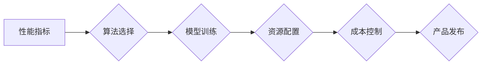

> AI产品开发,性能优化,成本控制,算法选择,资源管理,云计算,机器学习,深度学习

## 1. 背景介绍

人工智能（AI）技术近年来发展迅速，已广泛应用于各个领域，从自动驾驶到医疗诊断，从个性化推荐到金融风险控制，AI正在深刻地改变着我们的生活。然而，开发和部署AI产品并非易事，其中面临着诸多挑战，其中最关键的挑战之一便是如何平衡性能与成本。

一方面，AI产品的性能直接关系到其应用效果和用户体验。例如，在自动驾驶领域，模型的预测精度直接影响车辆的安全性和可靠性；在医疗诊断领域，模型的诊断准确率直接关系到患者的健康和生命。另一方面，AI产品的开发和部署成本也十分高昂，需要大量的计算资源、数据存储和人工成本。

因此，在开发AI产品时，需要权衡性能和成本之间的关系，找到一个最佳的平衡点。

## 2. 核心概念与联系

**2.1 性能指标**

AI产品的性能通常通过以下指标来衡量：

* **准确率:** 模型预测结果与真实结果的匹配程度。
* **召回率:** 模型能够识别出所有真实正例的比例。
* **F1-score:** 准确率和召回率的调和平均值，综合衡量模型的性能。
* **速度:** 模型进行预测的所需时间。
* **内存占用:** 模型运行所需的内存空间。

**2.2 成本指标**

AI产品的成本主要包括以下方面：

* **数据标注成本:** 训练AI模型需要大量的标注数据，数据标注是一个耗时和费力的过程。
* **计算资源成本:** 训练和部署AI模型需要大量的计算资源，例如GPU、CPU和内存。
* **存储成本:** AI模型和训练数据都需要存储，存储成本会随着数据量的增加而增加。
* **人工成本:** 开发、维护和部署AI产品的需要人工参与，人工成本也是一个重要的成本因素。

**2.3 性能与成本之间的关系**

性能和成本之间存在着密切的联系。一般来说，为了提高AI产品的性能，需要增加计算资源、训练数据和模型复杂度，这会导致成本的增加。反之，为了降低成本，可能会牺牲一些性能。

**2.4 Mermaid 流程图**



## 3. 核心算法原理 & 具体操作步骤

**3.1 算法原理概述**

在AI产品开发中，算法的选择直接影响到产品的性能和成本。常见的AI算法包括：

* **机器学习算法:** 
    * **监督学习:** 使用标注数据训练模型，例如线性回归、逻辑回归、支持向量机、决策树、随机森林、神经网络等。
    * **无监督学习:** 使用未标注数据训练模型，例如聚类、降维等。
    * **强化学习:** 通过与环境交互学习，例如Q学习、SARSA等。
* **深度学习算法:** 
    * **卷积神经网络 (CNN):** 用于图像识别、物体检测等任务。
    * **循环神经网络 (RNN):** 用于自然语言处理、语音识别等任务。
    * **生成对抗网络 (GAN):** 用于图像生成、文本生成等任务。

**3.2 算法步骤详解**

**3.2.1 监督学习算法**

1. **数据收集和预处理:** 收集相关数据，并进行清洗、转换、特征工程等预处理操作。
2. **模型选择:** 根据任务需求选择合适的监督学习算法。
3. **模型训练:** 使用训练数据训练模型，并调整模型参数以最小化损失函数。
4. **模型评估:** 使用测试数据评估模型的性能，并选择性能最好的模型。
5. **模型部署:** 将训练好的模型部署到生产环境中，用于进行预测或决策。

**3.2.2 深度学习算法**

深度学习算法的训练步骤与监督学习算法类似，但需要更多的计算资源和训练数据。

**3.3 算法优缺点**

不同的算法具有不同的优缺点，需要根据具体任务需求进行选择。

**3.4 算法应用领域**

AI算法广泛应用于各个领域，例如：

* **计算机视觉:** 图像识别、物体检测、图像分割等。
* **自然语言处理:** 文本分类、情感分析、机器翻译等。
* **语音识别:** 语音转文本、语音合成等。
* **推荐系统:** 商品推荐、内容推荐等。
* **医疗诊断:** 疾病诊断、影像分析等。

## 4. 数学模型和公式 & 详细讲解 & 举例说明

**4.1 数学模型构建**

在AI产品开发中，数学模型是描述算法原理和计算过程的基础。常见的数学模型包括：

* **线性回归模型:** 用于预测连续变量，模型假设目标变量与输入变量之间存在线性关系。

* **逻辑回归模型:** 用于预测分类变量，模型假设目标变量服从伯努利分布。

* **神经网络模型:** 由多个层组成，每层包含多个神经元，神经元之间通过权重连接，模型能够学习复杂的非线性关系。

**4.2 公式推导过程**

例如，线性回归模型的目标是找到最佳的权重参数，使得模型预测值与真实值之间的误差最小。可以使用最小二乘法来求解最佳权重参数。

**最小二乘法公式:**

$$
\theta = (X^T X)^{-1} X^T y
$$

其中：

* $\theta$ 是权重参数向量。
* $X$ 是输入特征矩阵。
* $y$ 是目标变量向量。

**4.3 案例分析与讲解**

例如，假设我们想要预测房价，输入特征包括房屋面积、房间数量、地理位置等，目标变量是房价。可以使用线性回归模型来构建预测模型。

**4.3.1 数据准备:**

收集房价数据，包括房屋面积、房间数量、地理位置等特征，以及对应的房价。

**4.3.2 模型训练:**

使用最小二乘法训练线性回归模型，找到最佳的权重参数。

**4.3.3 模型评估:**

使用测试数据评估模型的性能，例如计算模型的R-squared值。

**4.3.4 模型部署:**

将训练好的模型部署到生产环境中，用于预测新的房价。

## 5. 项目实践：代码实例和详细解释说明

**5.1 开发环境搭建**

* 安装Python编程语言和相关库，例如NumPy、Pandas、Scikit-learn等。
* 选择合适的深度学习框架，例如TensorFlow、PyTorch等。
* 设置开发环境，例如使用Jupyter Notebook进行代码开发和调试。

**5.2 源代码详细实现**

```python
# 导入必要的库
import numpy as np
from sklearn.linear_model import LinearRegression

# 创建训练数据
X = np.array([[100, 2], [150, 3], [200, 4], [250, 5]])
y = np.array([200, 250, 300, 350])

# 创建线性回归模型
model = LinearRegression()

# 训练模型
model.fit(X, y)

# 预测新的房价
new_house = np.array([[300, 6]])
predicted_price = model.predict(new_house)

# 打印预测结果
print(f"预测的房价为: {predicted_price[0]}")
```

**5.3 代码解读与分析**

* 首先，导入必要的库，例如NumPy用于数值计算，Scikit-learn用于机器学习算法。
* 然后，创建训练数据，包括房屋面积、房间数量等特征，以及对应的房价。
* 创建线性回归模型，并使用训练数据训练模型。
* 训练完成后，可以使用模型预测新的房价。

**5.4 运行结果展示**

运行上述代码，可以得到预测的房价结果。

## 6. 实际应用场景

**6.1 自动驾驶**

AI算法在自动驾驶领域应用广泛，例如：

* **目标检测:** 识别道路上的车辆、行人、交通信号灯等。
* **路径规划:** 规划车辆行驶路线，避开障碍物。
* **决策控制:** 根据感知到的环境信息，控制车辆的加速、减速、转向等动作。

**6.2 医疗诊断**

AI算法在医疗诊断领域也发挥着重要作用，例如：

* **疾病诊断:** 根据患者的症状、检查结果等信息，辅助医生诊断疾病。
* **影像分析:** 分析医学影像，例如X光片、CT扫描、MRI等，辅助医生发现病灶。
* **药物研发:** 辅助药物研发，例如预测药物的疗效和安全性。

**6.3 个性化推荐**

AI算法在个性化推荐领域应用广泛，例如：

* **商品推荐:** 根据用户的购买历史、浏览记录等信息，推荐相关的商品。
* **内容推荐:** 根据用户的兴趣爱好、阅读习惯等信息，推荐相关的文章、视频、音乐等内容。

**6.4 未来应用展望**

随着AI技术的不断发展，其应用场景将会更加广泛，例如：

* **智能客服:** 使用AI技术开发智能客服机器人，为用户提供24小时在线服务。
* **个性化教育:** 使用AI技术开发个性化教育平台，根据学生的学习进度和能力，提供定制化的学习内容和辅导。
* **智能制造:** 使用AI技术提高制造业的效率和自动化程度。

## 7. 工具和资源推荐

**7.1 学习资源推荐**

* **在线课程:** Coursera、edX、Udacity等平台提供丰富的AI课程。
* **书籍:** 《深度学习》、《机器学习实战》等书籍是学习AI的基础教材。
* **博客和论坛:** 许多AI专家和爱好者在博客和论坛上分享他们的经验和知识。

**7.2 开发工具推荐**

* **Python:** 作为AI开发的主要编程语言，Python拥有丰富的库和框架，例如NumPy、Pandas、Scikit-learn、TensorFlow、PyTorch等。
* **Jupyter Notebook:** 用于代码开发、调试和可视化。
* **云计算平台:** AWS、Azure、Google Cloud等云计算平台提供丰富的AI服务和工具。

**7.3 相关论文推荐**

* **《ImageNet Classification with Deep Convolutional Neural Networks》:** 介绍了AlexNet模型，标志着深度学习在图像识别领域的突破。
* **《Attention Is All You Need》:** 介绍了Transformer模型，在自然语言处理领域取得了突破性进展。

## 8. 总结：未来发展趋势与挑战

**8.1 研究成果总结**

近年来，AI技术取得了长足的进步，在各个领域都取得了显著的应用成果。

**8.2 未来发展趋势**

* **模型规模和复杂度不断提高:** 随着计算资源的不断发展，AI模型的规模和复杂度将会不断提高，从而提升模型的性能。
* **模型解释性和可解释性增强:** 如何解释和理解AI模型的决策过程，是未来研究的重要方向。
* **边缘计算和联邦学习的兴起:** 将AI模型部署到边缘设备，并通过联邦学习的方式训练模型，可以提高模型的隐私性和效率。

**8.3 面临的挑战**

* **数据获取和隐私保护:** AI模型的训练需要大量的训练数据，如何获取高质量的数据，并保护用户隐私，是面临的挑战。
* **算法公平性和可解释性:** AI算法可能会存在偏见和不可解释性，如何确保算法的公平性和可解释性，是需要解决的重要问题。
* **伦理和社会影响:** AI技术的快速发展，可能会对社会产生深远的影响，需要认真思考AI技术的伦理和社会责任。

**8.4 研究展望**

未来，AI研究将继续朝着更智能、更安全、更可解释的方向发展。


## 9. 附录：常见问题与解答

**9.1 如何选择合适的AI算法？**

选择合适的