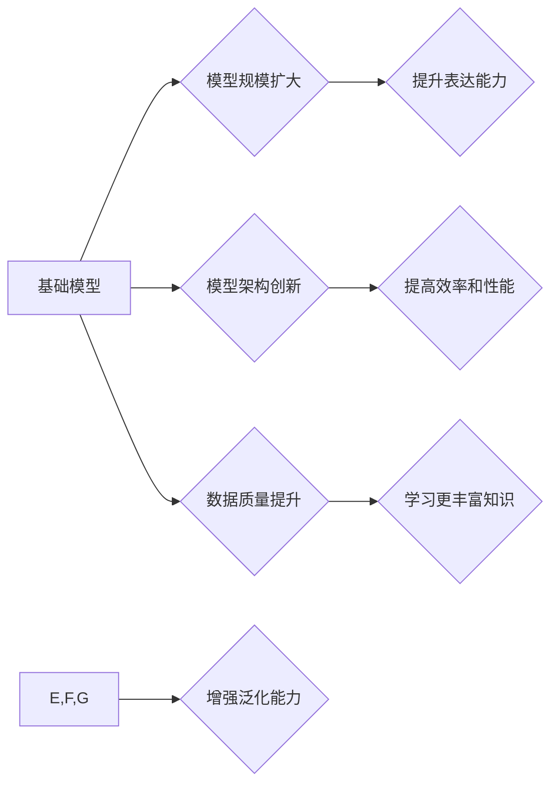

> 基础模型, 泛化能力, 迁移学习, 知识蒸馏, 预训练模型

## 1. 背景介绍

近年来，深度学习领域取得了令人瞩目的进展，基础模型在推动人工智能发展方面发挥着越来越重要的作用。基础模型是指具有强大泛化能力和迁移学习能力的预训练模型，能够在各种下游任务中取得优异的性能。张钹院士在《基础模型的三大出路》一文中，提出了基础模型的三大发展方向，为基础模型的未来发展指明了方向。

## 2. 核心概念与联系

**2.1 基础模型的定义**

基础模型是指在海量数据上进行预训练，并具备强大的泛化能力和迁移学习能力的深度学习模型。其核心特点是：

* **规模大:** 基础模型通常拥有大量的参数，能够学习到更复杂的特征表示。
* **泛化能力强:** 基础模型在预训练过程中学习到通用的知识和规律，能够应用于各种不同的下游任务。
* **迁移学习能力强:** 基础模型可以将预训练的知识迁移到新的任务中，无需从头开始训练，从而提高训练效率和性能。

**2.2 基础模型的三大发展方向**

张钹院士认为，基础模型的发展方向主要有以下三大途径：

* **模型规模的进一步扩大:** 随着计算资源的不断发展，模型规模将继续扩大，从而提升模型的表达能力和泛化能力。
* **模型架构的创新:** 研究新的模型架构，例如 Transformer 的变体、混合模型等，以提高模型的效率和性能。
* **数据质量和多样性的提升:** 提升训练数据的质量和多样性，例如使用多模态数据、增强数据等，以帮助模型学习到更丰富的知识。

**2.3 基础模型的应用场景**

基础模型在各个领域都有广泛的应用，例如：

* **自然语言处理:** 文本分类、机器翻译、问答系统等。
* **计算机视觉:** 图像识别、目标检测、图像生成等。
* **语音识别:** 语音转文本、语音合成等。
* **推荐系统:** 商品推荐、内容推荐等。

**2.4 Mermaid 流程图**



## 3. 核心算法原理 & 具体操作步骤

**3.1 算法原理概述**

基础模型的训练主要基于深度学习算法，例如 Transformer、BERT 等。这些算法通过多层神经网络结构，学习到输入数据的特征表示，并通过训练过程不断优化模型参数，以达到更高的预测精度。

**3.2 算法步骤详解**

1. **数据预处理:** 将原始数据进行清洗、格式化、编码等操作，使其能够被模型理解。
2. **模型构建:** 根据任务需求选择合适的模型架构，并初始化模型参数。
3. **预训练:** 在海量数据上进行模型训练，学习到通用的知识和规律。
4. **微调:** 将预训练模型应用于具体的下游任务，通过少量数据进行微调，以提高模型在该任务上的性能。

**3.3 算法优缺点**

**优点:**

* 泛化能力强
* 迁移学习能力强
* 训练效率高

**缺点:**

* 训练成本高
* 数据依赖性强
* 容易出现过拟合问题

**3.4 算法应用领域**

基础模型在各个领域都有广泛的应用，例如：

* **自然语言处理:** 文本分类、机器翻译、问答系统等。
* **计算机视觉:** 图像识别、目标检测、图像生成等。
* **语音识别:** 语音转文本、语音合成等。
* **推荐系统:** 商品推荐、内容推荐等。

## 4. 数学模型和公式 & 详细讲解 & 举例说明

**4.1 数学模型构建**

基础模型的训练过程可以看作是一个优化问题，目标是找到最优的模型参数，使得模型在训练数据上的损失函数最小。

**损失函数:**

$$
L(w) = \sum_{i=1}^{N} \mathcal{L}(y_i, \hat{y}_i)
$$

其中：

* $w$ 是模型参数
* $N$ 是训练数据的数量
* $\mathcal{L}$ 是损失函数
* $y_i$ 是真实标签
* $\hat{y}_i$ 是模型预测结果

**4.2 公式推导过程**

模型参数的更新通常使用梯度下降算法，其核心思想是沿着梯度方向更新模型参数，以减小损失函数的值。

梯度下降算法公式：

$$
w = w - \eta \nabla L(w)
$$

其中：

* $\eta$ 是学习率
* $\nabla L(w)$ 是损失函数对模型参数的梯度

**4.3 案例分析与讲解**

例如，在文本分类任务中，可以使用交叉熵损失函数来衡量模型预测结果与真实标签之间的差异。

交叉熵损失函数公式：

$$
\mathcal{L}(y, \hat{y}) = - \sum_{i=1}^{C} y_i \log(\hat{y}_i)
$$

其中：

* $C$ 是类别数
* $y_i$ 是真实标签的 one-hot 编码
* $\hat{y}_i$ 是模型预测结果的概率分布

## 5. 项目实践：代码实例和详细解释说明

**5.1 开发环境搭建**

使用 Python 语言和深度学习框架 TensorFlow 或 PyTorch 进行开发。

**5.2 源代码详细实现**

```python
import tensorflow as tf

# 定义模型架构
model = tf.keras.models.Sequential([
    tf.keras.layers.Embedding(input_dim=vocab_size, output_dim=embedding_dim),
    tf.keras.layers.LSTM(units=hidden_size),
    tf.keras.layers.Dense(units=num_classes, activation='softmax')
])

# 编译模型
model.compile(optimizer='adam', loss='sparse_categorical_crossentropy', metrics=['accuracy'])

# 训练模型
model.fit(x_train, y_train, epochs=num_epochs, batch_size=batch_size)

# 评估模型
loss, accuracy = model.evaluate(x_test, y_test)
print('Test Loss:', loss)
print('Test Accuracy:', accuracy)
```

**5.3 代码解读与分析**

* 代码首先定义了模型架构，包括 Embedding 层、LSTM 层和 Dense 层。
* 然后编译模型，指定优化器、损失函数和评价指标。
* 接着训练模型，使用训练数据进行训练。
* 最后评估模型，使用测试数据计算模型的损失和准确率。

**5.4 运行结果展示**

训练完成后，可以查看模型的训练曲线和测试结果，评估模型的性能。

## 6. 实际应用场景

基础模型在各个领域都有广泛的应用，例如：

* **自然语言处理:** 基于 BERT 的模型在文本分类、问答系统、机器翻译等任务中取得了优异的性能。
* **计算机视觉:** 基于 Vision Transformer 的模型在图像识别、目标检测、图像生成等任务中取得了突破性进展。
* **语音识别:** 基于 Wav2Vec 2.0 的模型在语音识别任务中取得了新的记录。

**6.4 未来应用展望**

随着基础模型的不断发展，其应用场景将更加广泛，例如：

* **个性化推荐:** 基于用户行为和偏好的基础模型可以提供更精准的个性化推荐。
* **自动代码生成:** 基于代码库的基础模型可以自动生成代码，提高开发效率。
* **科学发现:** 基于海量科学数据的基础模型可以帮助科学家发现新的规律和知识。

## 7. 工具和资源推荐

**7.1 学习资源推荐**

* **论文:**
    * BERT: Pre-training of Deep Bidirectional Transformers for Language Understanding
    * Transformer: Attention Is All You Need
    * Vision Transformer: An Image Transformer
    * Wav2Vec 2.0: A Framework for Self-Supervised Learning of Speech Representations

* **博客:**
    * The Illustrated Transformer
    * Understanding BERT

**7.2 开发工具推荐**

* **深度学习框架:** TensorFlow, PyTorch
* **自然语言处理库:** NLTK, spaCy
* **计算机视觉库:** OpenCV, Pillow

**7.3 相关论文推荐**

* **基础模型:**
    * Scaling Laws for Neural Language Models
    * On the Dangers of Stochastic Parrots: Can Language Models Be Too Big?
* **迁移学习:**
    * Transfer Learning
    * Domain Adaptation

## 8. 总结：未来发展趋势与挑战

**8.1 研究成果总结**

基础模型在深度学习领域取得了显著的进展，为人工智能的发展提供了强大的工具。

**8.2 未来发展趋势**

* 模型规模的进一步扩大
* 模型架构的创新
* 数据质量和多样性的提升
* 跨模态基础模型的开发
* 联邦学习和隐私保护

**8.3 面临的挑战**

* 计算资源的限制
* 数据获取和隐私保护
* 模型的可解释性和鲁棒性
* 算法的公平性和可控性

**8.4 研究展望**

未来，基础模型的研究将继续深入，探索更强大的模型架构、更丰富的训练数据和更有效的训练方法，以推动人工智能技术的进步。

## 9. 附录：常见问题与解答

**常见问题:**

* 什么是基础模型？
* 基础模型有哪些应用场景？
* 如何训练基础模型？
* 基础模型有哪些挑战？

**解答:**

* 基础模型是指在海量数据上进行预训练，并具备强大的泛化能力和迁移学习能力的深度学习模型。
* 基础模型在各个领域都有广泛的应用，例如自然语言处理、计算机视觉、语音识别等。
* 训练基础模型需要大量的计算资源和数据，通常使用梯度下降算法进行训练。
* 基础模型面临的挑战包括计算资源的限制、数据获取和隐私保护、模型的可解释性和鲁棒性等。


作者：禅与计算机程序设计艺术 / Zen and the Art of Computer Programming 
<end_of_turn>