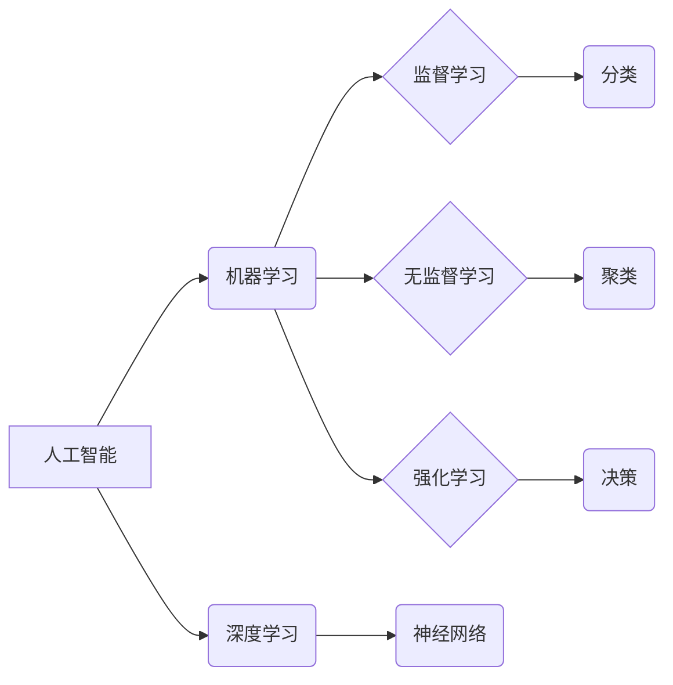

>  人工智能、机器学习、深度学习、编程、软件开发、学习方法、高效学习

## 1. 背景介绍

在当今科技飞速发展的时代，新兴技术层出不穷，专业技能的更新迭代也日新月异。想要在激烈的竞争中脱颖而出，掌握一门新专业，快速提升自身价值，已成为许多人的迫切需求。然而，学习一门新专业往往需要漫长的时间和大量的精力投入，这对于时间紧迫、精力有限的人来说，无疑是一个巨大的挑战。

本书旨在为读者提供一种高效的学习方法，帮助他们在9个月内快速掌握一门新专业。本书将结合人工智能、机器学习、深度学习等热门领域的案例，详细讲解学习方法、学习资源、学习技巧等方面的内容，并提供具体的实践操作步骤，帮助读者快速入门，快速提升。

## 2. 核心概念与联系

### 2.1  人工智能 (AI)

人工智能 (Artificial Intelligence，简称 AI) 是指模拟人类智能行为的计算机系统。它涵盖了广泛的领域，包括机器学习、深度学习、自然语言处理、计算机视觉等。

### 2.2  机器学习 (ML)

机器学习是人工智能的一个子领域，它通过算法训练模型，使模型能够从数据中学习，并做出预测或决策。机器学习算法可以分为监督学习、无监督学习和强化学习三大类。

### 2.3  深度学习 (DL)

深度学习是机器学习的一个子领域，它使用多层神经网络来模拟人类大脑的学习过程。深度学习算法能够处理海量数据，并提取出复杂的特征，在图像识别、语音识别、自然语言处理等领域取得了突破性的进展。

**核心概念与联系流程图:**



## 3. 核心算法原理 & 具体操作步骤

### 3.1  算法原理概述

**线性回归算法**是一种监督学习算法，用于预测连续值。它假设数据之间存在线性关系，并通过最小化预测值与真实值的误差来找到最佳拟合直线。

### 3.2  算法步骤详解

1. **数据准备:** 收集并预处理数据，包括特征选择、数据清洗、数据标准化等步骤。
2. **模型构建:** 使用线性回归模型，定义预测变量和目标变量之间的关系。
3. **模型训练:** 使用训练数据训练模型，通过最小化损失函数来找到最佳模型参数。
4. **模型评估:** 使用测试数据评估模型的性能，常用的指标包括均方误差 (MSE)、平均绝对误差 (MAE) 等。
5. **模型预测:** 使用训练好的模型对新数据进行预测。

### 3.3  算法优缺点

**优点:**

* 算法简单易懂，易于实现。
* 计算效率高，适合处理大规模数据。

**缺点:**

* 只能处理线性关系的数据。
* 对异常值敏感。

### 3.4  算法应用领域

线性回归算法广泛应用于各个领域，例如：

* 房价预测
* 股票价格预测
* 销售额预测
* 医疗诊断

## 4. 数学模型和公式 & 详细讲解 & 举例说明

### 4.1  数学模型构建

线性回归模型的数学表达式为：

$$y = w_0 + w_1x_1 + w_2x_2 + ... + w_nx_n + \epsilon$$

其中：

* $y$ 是目标变量
* $x_1, x_2, ..., x_n$ 是预测变量
* $w_0, w_1, w_2, ..., w_n$ 是模型参数
* $\epsilon$ 是误差项

### 4.2  公式推导过程

线性回归的目标是找到最佳的模型参数，使预测值与真实值之间的误差最小化。常用的损失函数是均方误差 (MSE)：

$$MSE = \frac{1}{n}\sum_{i=1}^{n}(y_i - \hat{y}_i)^2$$

其中：

* $n$ 是样本数量
* $y_i$ 是第 $i$ 个样本的真实值
* $\hat{y}_i$ 是第 $i$ 个样本的预测值

通过最小化 MSE，可以得到最佳的模型参数。

### 4.3  案例分析与讲解

假设我们想要预测房屋价格，已知房屋面积和房间数量等特征。我们可以使用线性回归模型，将房屋面积和房间数量作为预测变量，房屋价格作为目标变量。通过训练模型，我们可以得到最佳的模型参数，并使用这些参数对新房子的价格进行预测。

## 5. 项目实践：代码实例和详细解释说明

### 5.1  开发环境搭建

本项目使用 Python 语言进行开发，需要安装以下软件：

* Python 3.x
* NumPy
* Pandas
* Scikit-learn

### 5.2  源代码详细实现

```python
import numpy as np
from sklearn.linear_model import LinearRegression
from sklearn.model_selection import train_test_split

# 加载数据
data = np.loadtxt('housing_data.csv', delimiter=',')

# 分割数据
X = data[:, :-1]  # 特征
y = data[:, -1]  # 目标变量
X_train, X_test, y_train, y_test = train_test_split(X, y, test_size=0.2, random_state=42)

# 创建线性回归模型
model = LinearRegression()

# 训练模型
model.fit(X_train, y_train)

# 预测测试数据
y_pred = model.predict(X_test)

# 评估模型性能
from sklearn.metrics import mean_squared_error
mse = mean_squared_error(y_test, y_pred)
print(f'均方误差: {mse}')
```

### 5.3  代码解读与分析

* 首先，我们加载数据并将其分割为训练集和测试集。
* 然后，我们创建线性回归模型并使用训练集进行训练。
* 训练完成后，我们使用测试集进行预测，并计算模型的均方误差 (MSE) 来评估模型性能。

### 5.4  运行结果展示

运行代码后，会输出模型的均方误差值。

## 6. 实际应用场景

线性回归算法在各个领域都有广泛的应用，例如：

* **房价预测:** 根据房屋面积、房间数量、地理位置等特征，预测房屋价格。
* **股票价格预测:** 根据股票历史数据、市场趋势等特征，预测股票价格。
* **销售额预测:** 根据市场营销活动、季节性因素等特征，预测销售额。
* **医疗诊断:** 根据患者症状、病史等特征，预测疾病风险。

### 6.4  未来应用展望

随着人工智能技术的不断发展，线性回归算法将在更多领域得到应用，例如：

* **个性化推荐:** 根据用户的行为数据，推荐个性化的商品或服务。
* **欺诈检测:** 根据交易数据，识别欺诈行为。
* **风险评估:** 根据客户数据，评估客户的信用风险。

## 7. 工具和资源推荐

### 7.1  学习资源推荐

* **在线课程:** Coursera、edX、Udacity 等平台提供丰富的机器学习课程。
* **书籍:** 《机器学习》 (周志华)、《深入理解机器学习》 (李航) 等书籍。
* **博客:** 机器学习相关的博客网站，例如：Towards Data Science、Machine Learning Mastery 等。

### 7.2  开发工具推荐

* **Python:** 机器学习开发的常用语言。
* **NumPy:** 数值计算库。
* **Pandas:** 数据处理库。
* **Scikit-learn:** 机器学习库。

### 7.3  相关论文推荐

* **《机器学习》 (周志华)**
* **《深入理解机器学习》 (李航)**

## 8. 总结：未来发展趋势与挑战

### 8.1  研究成果总结

线性回归算法是一种经典的机器学习算法，在预测连续值方面具有良好的性能。

### 8.2  未来发展趋势

随着人工智能技术的不断发展，线性回归算法将继续得到改进和完善，例如：

* **结合深度学习:** 将线性回归算法与深度学习算法相结合，提高模型的预测精度。
* **处理非线性关系:** 研究新的算法和方法，能够处理非线性关系的数据。
* **提高模型解释性:** 研究提高模型解释性的方法，使模型的决策过程更加透明。

### 8.3  面临的挑战

线性回归算法也面临一些挑战，例如：

* **对异常值敏感:** 线性回归算法对异常值敏感，需要进行数据预处理来减少异常值的影响。
* **只能处理线性关系:** 线性回归算法只能处理线性关系的数据，对于非线性关系的数据，需要使用其他算法。

### 8.4  研究展望

未来，我们将继续研究线性回归算法的改进和完善，使其能够更好地应用于实际问题。

## 9. 附录：常见问题与解答

**Q1: 线性回归算法的适用场景有哪些？**

**A1:** 线性回归算法适用于预测连续值的问题，例如房价预测、股票价格预测、销售额预测等。

**Q2: 线性回归算法的优缺点是什么？**

**A2:** 线性回归算法的优点是简单易懂、计算效率高；缺点是只能处理线性关系的数据、对异常值敏感。

**Q3: 如何评估线性回归模型的性能？**

**A3:** 常用的评估指标包括均方误差 (MSE)、平均绝对误差 (MAE) 等。

**Q4: 如何处理线性回归算法中的异常值？**

**A4:** 可以通过数据清洗、数据标准化等方法来减少异常值的影响。


作者：禅与计算机程序设计艺术 / Zen and the Art of Computer Programming 
<end_of_turn>