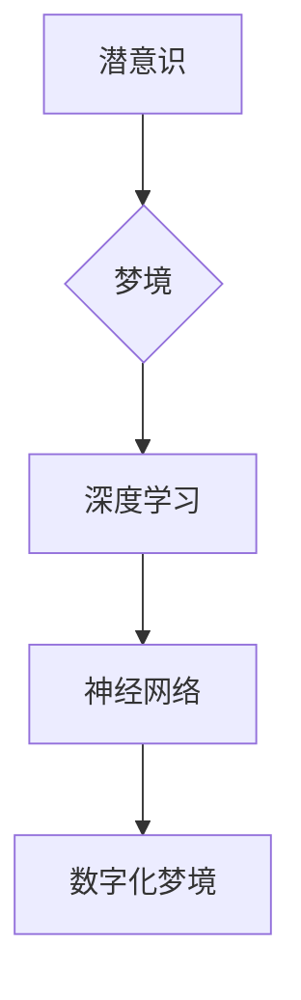

>  人工智能、潜意识、深度学习、神经网络、梦境模拟、虚拟现实、认知科学

## 1. 背景介绍

人类自古以来就对梦境充满了好奇和探索。梦境，作为我们潜意识活动的表现形式，充满了神秘和未知。近年来，随着人工智能技术的飞速发展，特别是深度学习和神经网络的突破，我们开始能够利用技术手段模拟和探索梦境的本质。

本篇文章将探讨人工智能在模拟和探索潜意识领域的应用，特别是如何利用深度学习技术编织数字化梦境，并探讨其背后的原理、技术挑战以及未来发展趋势。

## 2. 核心概念与联系

### 2.1 潜意识与梦境

潜意识是指人类意识之外的思想、情感和记忆，它对我们的行为和决策产生着深远的影响。梦境被认为是潜意识活动的表现形式，它通常包含着象征意义和隐喻，反映了我们内心深处的渴望、恐惧和冲突。

### 2.2 深度学习与神经网络

深度学习是一种机器学习的子领域，它利用多层神经网络来模拟人类大脑的学习过程。神经网络由大量的节点（神经元）组成，这些节点相互连接，通过学习数据中的模式和关系来进行预测和分类。

### 2.3 数字化梦境

数字化梦境是指利用计算机技术模拟和生成梦境体验的虚拟环境。通过深度学习技术，我们可以训练神经网络来生成梦境场景、人物和情节，并通过虚拟现实技术提供沉浸式的梦境体验。

**核心概念与联系流程图**



## 3. 核心算法原理 & 具体操作步骤

### 3.1 算法原理概述

模拟潜意识和梦境的算法通常基于以下几个核心原理：

* **生成式对抗网络 (GAN):** GAN 由两个神经网络组成：生成器和鉴别器。生成器试图生成逼真的梦境内容，而鉴别器试图区分真实内容和生成内容。通过不断的对抗训练，生成器能够生成越来越逼真的梦境。
* **变分自编码器 (VAE):** VAE 可以将梦境内容压缩成低维表示，并将其解码回原始内容。通过训练 VAE，我们可以学习到梦境内容的潜在结构和特征。
* **强化学习:** 强化学习可以训练一个代理来在梦境环境中进行交互，并通过奖励机制学习到如何生成更符合用户期望的梦境内容。

### 3.2 算法步骤详解

1. **数据收集和预处理:** 收集大量梦境描述、绘画、视频等数据，并进行预处理，例如文本清洗、图像增强等。
2. **模型训练:** 使用深度学习算法，例如 GAN、VAE 或强化学习，训练神经网络模型。
3. **梦境生成:** 利用训练好的模型，根据用户的输入或意图，生成梦境场景、人物和情节。
4. **虚拟现实渲染:** 将生成的梦境内容渲染成虚拟现实体验，并通过头显设备提供沉浸式的梦境体验。

### 3.3 算法优缺点

**优点:**

* 可以生成逼真的梦境体验，满足用户对探索潜意识的渴望。
* 可以根据用户的喜好和需求定制梦境内容，提供个性化的体验。
* 可以用于治疗心理疾病，例如梦境疗法。

**缺点:**

* 目前技术还无法完全模拟人类的潜意识活动，生成的梦境内容可能缺乏真实感和深度。
* 训练深度学习模型需要大量的计算资源和数据，成本较高。
* 存在伦理问题，例如梦境内容的真实性、用户隐私保护等。

### 3.4 算法应用领域

* **娱乐:** 创建沉浸式的虚拟现实游戏和体验。
* **教育:** 模拟历史事件、科学实验等，提供更直观的学习体验。
* **医疗:** 用于治疗心理疾病、缓解压力和焦虑。
* **艺术创作:** 探索新的艺术表达形式，创作基于梦境的艺术作品。

## 4. 数学模型和公式 & 详细讲解 & 举例说明

### 4.1 数学模型构建

模拟潜意识和梦境的数学模型通常基于概率论和统计学，例如：

* **贝叶斯网络:** 用于表示梦境内容之间的因果关系和概率依赖。
* **隐马尔可夫模型:** 用于建模梦境内容的时间序列特征。
* **高斯混合模型:** 用于对梦境内容进行聚类和分类。

### 4.2 公式推导过程

例如，使用贝叶斯网络来建模梦境内容，我们可以定义以下公式：

$$P(梦境|特征) = \frac{P(特征|梦境) * P(梦境)}{P(特征)}$$

其中：

* $P(梦境|特征)$ 是给定特征条件下梦境的概率。
* $P(特征|梦境)$ 是给定梦境条件下特征的概率。
* $P(梦境)$ 是梦境的先验概率。
* $P(特征)$ 是特征的先验概率。

### 4.3 案例分析与讲解

例如，我们可以使用贝叶斯网络来预测用户梦境中出现的特定人物。通过收集用户梦境描述和人物特征数据，我们可以训练贝叶斯网络模型，并根据用户的输入特征，预测梦境中出现特定人物的概率。

## 5. 项目实践：代码实例和详细解释说明

### 5.1 开发环境搭建

* 操作系统: Ubuntu 20.04
* Python 版本: 3.8
* 深度学习框架: TensorFlow 2.0

### 5.2 源代码详细实现

```python
import tensorflow as tf

# 定义生成器模型
def generator_model():
    # ...

# 定义鉴别器模型
def discriminator_model():
    # ...

# 训练循环
for epoch in range(num_epochs):
    # ...

```

### 5.3 代码解读与分析

* 生成器模型负责生成梦境内容，例如场景、人物、情节等。
* 鉴别器模型负责区分真实梦境内容和生成梦境内容。
* 训练循环中，生成器和鉴别器模型进行对抗训练，生成器不断改进生成内容的逼真度，鉴别器不断提高区分真实和生成的梦境内容的能力。

### 5.4 运行结果展示

训练完成后，我们可以使用生成器模型生成梦境内容，并通过虚拟现实技术提供沉浸式的梦境体验。

## 6. 实际应用场景

### 6.1 娱乐

* 创建沉浸式的虚拟现实游戏和体验，例如梦境探险游戏、虚拟梦境主题公园等。

### 6.2 教育

* 模拟历史事件、科学实验等，提供更直观的学习体验，例如梦境穿越历史、梦境探索宇宙等。

### 6.3 医疗

* 用于治疗心理疾病，例如梦境疗法，帮助患者探索潜意识，缓解焦虑和压力。

### 6.4 未来应用展望

* 更逼真的梦境体验，例如能够感知触觉、嗅觉等感官刺激。
* 个性化的梦境定制，根据用户的喜好和需求生成定制化的梦境内容。
* 与其他技术融合，例如增强现实、人工智能助手等，创造更丰富的梦境体验。

## 7. 工具和资源推荐

### 7.1 学习资源推荐

* **书籍:**
    * 《深度学习》
    * 《生成对抗网络》
* **在线课程:**
    * Coursera 深度学习课程
    * Udacity 生成对抗网络课程

### 7.2 开发工具推荐

* **TensorFlow:** 开源深度学习框架
* **PyTorch:** 开源深度学习框架
* **Unity:** 游戏引擎，可用于开发虚拟现实体验

### 7.3 相关论文推荐

* 《Generative Adversarial Networks》
* 《Variational Autoencoders for Generation》
* 《Reinforcement Learning for Dream Generation》

## 8. 总结：未来发展趋势与挑战

### 8.1 研究成果总结

人工智能在模拟潜意识和梦境的领域取得了显著进展，例如生成逼真的梦境内容、提供沉浸式的梦境体验等。

### 8.2 未来发展趋势

* 更逼真的梦境体验，例如能够感知触觉、嗅觉等感官刺激。
* 个性化的梦境定制，根据用户的喜好和需求生成定制化的梦境内容。
* 与其他技术融合，例如增强现实、人工智能助手等，创造更丰富的梦境体验。

### 8.3 面临的挑战

* 算法的复杂性，需要更强大的计算能力和更有效的算法设计。
* 伦理问题，例如梦境内容的真实性、用户隐私保护等。
* 缺乏对潜意识的深入理解，难以完全模拟人类的梦境体验。

### 8.4 研究展望

未来，人工智能在模拟潜意识和梦境的领域将继续取得突破，为我们提供更丰富、更深刻的体验。


## 9. 附录：常见问题与解答

**Q1: 数字化梦境是否会侵犯用户的隐私？**

**A1:** 这是个重要的伦理问题。在开发数字化梦境技术时，必须充分考虑用户隐私保护，例如数据加密、匿名化处理等。

**Q2: 数字化梦境是否会让人上瘾？**

**A2:** 任何新技术都有可能带来潜在的风险。我们需要谨慎使用数字化梦境技术，避免过度依赖和沉迷。

**Q3: 数字化梦境技术是否会取代现实生活？**

**A3:** 不太可能。数字化梦境技术可以丰富我们的生活体验，但它并不能取代现实生活。现实生活仍然是我们的主要生活方式。


作者：禅与计算机程序设计艺术 / Zen and the Art of Computer Programming 
<end_of_turn>