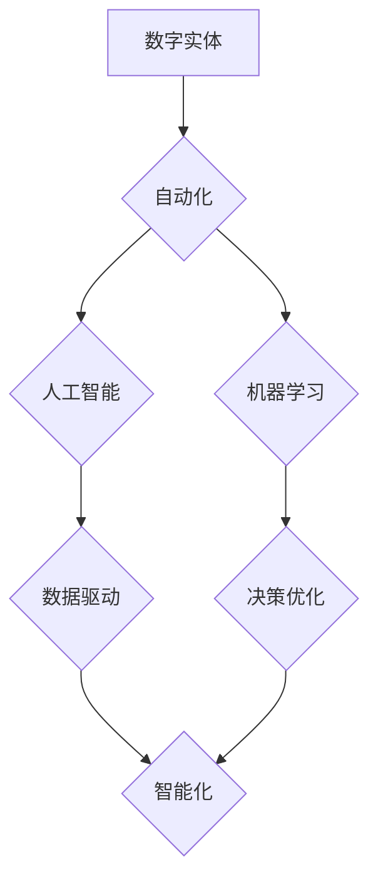

> 数字实体、自动化、人工智能、机器学习、数据驱动、数字孪生、工业互联网、未来趋势

## 1. 背景介绍

数字时代，数据正在成为不可或缺的生产要素。随着物联网、云计算、大数据等技术的蓬勃发展，越来越多的物理实体被数字化，并以数字形式存在于网络空间中。这些数字化的实体被称为“数字实体”。数字实体不仅能够反映物理实体的实时状态，还能模拟物理实体的行为，并进行预测和优化。

数字实体的自动化发展前景广阔，它将深刻地改变我们的生产生活方式。例如，在工业领域，数字实体可以实现智能制造，提高生产效率和产品质量；在城市管理领域，数字实体可以帮助我们构建智慧城市，提高城市运营效率和居民生活质量；在医疗领域，数字实体可以辅助医生诊断疾病，提高医疗服务水平。

## 2. 核心概念与联系

**2.1 数字实体的概念**

数字实体是指用数字模型表示的物理实体或抽象概念。它包含了实体的物理属性、行为特征、运行状态等信息，并能够与现实世界进行交互。

**2.2 自动化概念**

自动化是指利用技术手段，使生产或工作过程无需人工干预即可完成。自动化可以提高效率、降低成本、提高质量，是现代工业和社会发展的重要趋势。

**2.3 数字实体的自动化**

数字实体的自动化是指利用人工智能、机器学习等技术，使数字实体能够自动完成预设的任务，无需人工干预。例如，数字实体可以自动收集数据、分析数据、做出决策、执行操作等。

**2.4 核心概念联系**

数字实体的自动化是数字实体发展的重要方向，也是人工智能技术应用的重要场景。数字实体的自动化可以帮助我们更好地利用数字实体的优势，实现更高效、更智能的生产生活方式。



## 3. 核心算法原理 & 具体操作步骤

**3.1 算法原理概述**

数字实体的自动化主要依赖于人工智能和机器学习算法。这些算法可以帮助数字实体自动学习、分析和决策。常见的算法包括：

* **监督学习:** 利用标记数据训练模型，预测未知数据。
* **无监督学习:** 从未标记数据中发现模式和结构。
* **强化学习:** 通过试错学习，获得最大奖励。

**3.2 算法步骤详解**

数字实体的自动化流程一般包括以下步骤：

1. **数据采集:** 收集数字实体相关的数据，包括物理属性、行为特征、运行状态等信息。
2. **数据预处理:** 对采集到的数据进行清洗、转换、特征提取等处理，使其适合算法训练。
3. **模型训练:** 选择合适的算法，利用训练数据训练模型，使其能够学习数字实体的规律。
4. **模型评估:** 利用测试数据评估模型的性能，并进行调整优化。
5. **模型部署:** 将训练好的模型部署到数字实体中，使其能够自动完成预设的任务。

**3.3 算法优缺点**

* **优点:** 自动化程度高，效率高，可持续学习和优化。
* **缺点:** 算法训练需要大量数据，对数据质量要求高，存在黑盒问题。

**3.4 算法应用领域**

数字实体的自动化算法广泛应用于各个领域，例如：

* **工业自动化:** 智能制造、设备预测维护、生产过程优化。
* **城市管理:** 交通管理、环境监测、公共安全。
* **医疗保健:** 疾病诊断、个性化治疗、药物研发。

## 4. 数学模型和公式 & 详细讲解 & 举例说明

**4.1 数学模型构建**

数字实体的自动化可以利用数学模型来描述和预测其行为。例如，我们可以使用状态空间模型来描述数字实体的动态变化，并利用控制理论来设计控制策略，使数字实体达到预设的目标。

**4.2 公式推导过程**

状态空间模型的数学表达式如下：

$$
\dot{x}(t) = f(x(t), u(t))
$$

$$
y(t) = h(x(t))
$$

其中：

* $x(t)$ 是数字实体的状态向量。
* $u(t)$ 是输入信号。
* $y(t)$ 是输出信号。
* $f(x(t), u(t))$ 是状态方程，描述了数字实体的状态随时间的变化。
* $h(x(t))$ 是输出方程，描述了数字实体的输出与状态的关系。

**4.3 案例分析与讲解**

例如，我们可以使用状态空间模型来描述一个温度控制系统。

* $x(t)$ 是系统的温度。
* $u(t)$ 是加热器的功率。
* $y(t)$ 是系统的温度传感器读数。

我们可以根据系统的物理特性建立状态方程和输出方程，并利用控制理论设计控制策略，使系统的温度保持在预设的范围内。

## 5. 项目实践：代码实例和详细解释说明

**5.1 开发环境搭建**

* 操作系统: Ubuntu 20.04 LTS
* 编程语言: Python 3.8
* 库依赖: TensorFlow, NumPy, Pandas

**5.2 源代码详细实现**

```python
import tensorflow as tf
from tensorflow.keras.models import Sequential
from tensorflow.keras.layers import Dense

# 构建模型
model = Sequential()
model.add(Dense(128, activation='relu', input_shape=(10,)))
model.add(Dense(64, activation='relu'))
model.add(Dense(1))

# 编译模型
model.compile(optimizer='adam', loss='mse')

# 训练模型
model.fit(X_train, y_train, epochs=100)

# 评估模型
loss = model.evaluate(X_test, y_test)
print('Loss:', loss)

# 预测
predictions = model.predict(X_new)
```

**5.3 代码解读与分析**

这段代码实现了数字实体的自动化预测模型。

* 首先，我们使用 TensorFlow 库构建了一个简单的深度神经网络模型。
* 然后，我们使用 Adam 优化器和均方误差损失函数对模型进行训练。
* 最后，我们使用训练好的模型对新的数据进行预测。

**5.4 运行结果展示**

训练完成后，我们可以查看模型的损失值，并使用模型对新的数据进行预测。

## 6. 实际应用场景

**6.1 工业自动化**

数字实体的自动化可以帮助企业实现智能制造，提高生产效率和产品质量。例如，我们可以使用数字实体来模拟生产过程，预测设备故障，优化生产计划。

**6.2 城市管理**

数字实体的自动化可以帮助城市管理者构建智慧城市，提高城市运营效率和居民生活质量。例如，我们可以使用数字实体来监测交通流量，优化交通信号灯控制，预测空气污染。

**6.3 医疗保健**

数字实体的自动化可以帮助医生诊断疾病，提高医疗服务水平。例如，我们可以使用数字实体来分析患者的医疗影像，预测疾病风险，辅助医生制定治疗方案。

**6.4 未来应用展望**

数字实体的自动化将应用于越来越多的领域，例如教育、金融、娱乐等。随着人工智能技术的不断发展，数字实体的自动化将更加智能、更加高效。

## 7. 工具和资源推荐

**7.1 学习资源推荐**

* **书籍:**
    * 《深度学习》
    * 《机器学习》
    * 《人工智能：一种现代方法》
* **在线课程:**
    * Coursera: 深度学习
    * edX: 机器学习
    * Udacity: 人工智能工程师

**7.2 开发工具推荐**

* **TensorFlow:** 开源深度学习框架
* **PyTorch:** 开源深度学习框架
* **Scikit-learn:** 机器学习库

**7.3 相关论文推荐**

* 《Attention Is All You Need》
* 《Generative Adversarial Networks》
* 《Deep Reinforcement Learning》

## 8. 总结：未来发展趋势与挑战

**8.1 研究成果总结**

数字实体的自动化取得了显著的进展，在各个领域都得到了广泛应用。人工智能和机器学习算法为数字实体的自动化提供了强大的技术支撑。

**8.2 未来发展趋势**

* **更加智能的数字实体:** 数字实体将更加智能，能够更好地理解和响应用户的需求。
* **更加广泛的应用场景:** 数字实体将应用于更多的领域，例如教育、金融、娱乐等。
* **更加安全的数字实体:** 数字实体的安全性和隐私性将得到更加重视。

**8.3 面临的挑战**

* **数据质量问题:** 数字实体的自动化依赖于高质量的数据，而数据质量问题仍然是一个挑战。
* **算法解释性问题:** 许多人工智能算法是黑盒模型，难以解释其决策过程，这限制了数字实体的应用。
* **伦理问题:** 数字实体的自动化可能会带来一些伦理问题，例如算法偏见、隐私泄露等。

**8.4 研究展望**

未来，我们需要继续研究更加智能、更加安全、更加可解释的数字实体自动化算法，并解决数据质量、算法解释性和伦理等问题，推动数字实体的自动化技术向更加成熟的方向发展。

## 9. 附录：常见问题与解答

**9.1 如何选择合适的数字实体自动化算法？**

选择合适的算法取决于具体的应用场景和数据特点。例如，如果数据量大，可以使用深度学习算法；如果数据量小，可以使用传统机器学习算法。

**9.2 如何解决数字实体自动化中的数据质量问题？**

数据质量问题可以通过数据清洗、数据转换、数据特征提取等方法进行解决。

**9.3 如何提高数字实体自动化的安全性？**

可以通过加密、身份验证、访问控制等方法提高数字实体自动化的安全性。


作者：禅与计算机程序设计艺术 / Zen and the Art of Computer Programming 
<end_of_turn>