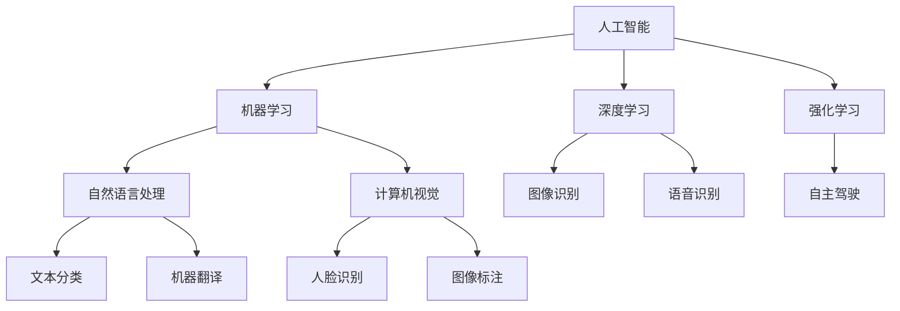

                 

# 构建更智能的世界：人类计算的应用场景

> 关键词：人工智能,机器学习,深度学习,强化学习,自然语言处理,NLP,计算机视觉,CV,计算机程序设计,人类计算

## 1. 背景介绍

### 1.1 问题由来
人类计算（Human Computing）这一概念，最初由曾获得图灵奖的Edward Feigenbaum于1959年提出，用以形容通过计算机辅助人类解决复杂问题的过程。随着人工智能（AI）和机器学习（ML）技术的飞速发展，人类计算的概念得到了新的扩展和应用。

如今，人类计算已经超越了传统的计算范畴，涵盖了从大数据处理到深度学习、自然语言处理、计算机视觉等诸多领域，形成了以计算机为中介，助力人类处理和理解信息的新范式。AI技术的进步，使得机器能够处理海量信息，识别复杂模式，甚至进行智能决策，从而在教育、医疗、金融、制造等各行各业中发挥着重要作用。

### 1.2 问题核心关键点
人类计算的核心在于利用计算机算法，通过数据驱动的决策支持，来辅助人类处理复杂问题。目前，人类计算的应用主要集中在以下几个方面：

- **大数据处理**：通过分布式计算和机器学习算法，从海量数据中提取有价值的信息和模式，支持决策制定。
- **自然语言处理（NLP）**：使计算机能够理解、处理和生成人类语言，从而提升人机交互的智能化水平。
- **计算机视觉（CV）**：通过图像识别和分析，使计算机具备图像理解能力，广泛应用于自动驾驶、医疗诊断等领域。
- **强化学习**：通过与环境交互，学习最优策略，优化决策过程，适用于游戏、机器人控制等场景。

这些技术的发展，使得计算机能够越来越深入地介入人类的计算过程，辅助人类进行更复杂、更精确的计算和决策。

## 2. 核心概念与联系

### 2.1 核心概念概述

为更好地理解人类计算的应用场景，本节将介绍几个密切相关的核心概念：

- **人工智能（AI）**：研究、开发用于模拟、延伸和扩展人类智能的理论、方法、技术及应用系统的一门新的技术科学。
- **机器学习（ML）**：通过数据和算法，使计算机能够学习和改进，从而实现特定任务的自动化。
- **深度学习（DL）**：一种特殊的机器学习方法，通过多层神经网络模拟人脑的学习机制，处理和分析复杂数据。
- **强化学习（RL）**：通过试错学习，优化决策策略，使计算机在特定环境中实现最优行为。
- **自然语言处理（NLP）**：涉及计算机理解和生成自然语言的技术，使计算机能够理解人类语言，进行信息处理。
- **计算机视觉（CV）**：使计算机具备图像和视频分析能力，处理和理解视觉信息。

这些核心概念之间的逻辑关系可以通过以下Mermaid流程图来展示：



这个流程图展示的核心概念及其之间的关系：

1. 人工智能涵盖了机器学习、深度学习和强化学习等子领域，是实现人类计算的基础。
2. 机器学习通过数据和算法，使计算机能够学习和改进，实现特定任务的自动化。
3. 深度学习通过多层神经网络，处理和分析复杂数据，是机器学习的重要分支。
4. 强化学习通过试错学习，优化决策策略，使计算机在特定环境中实现最优行为。
5. 自然语言处理涉及计算机理解和生成自然语言，使计算机能够处理人类语言。
6. 计算机视觉使计算机具备图像和视频分析能力，处理和理解视觉信息。

这些核心概念共同构成了人类计算的基础框架，使得计算机能够辅助人类处理复杂问题，提升工作效率和生活质量。

## 3. 核心算法原理 & 具体操作步骤
### 3.1 算法原理概述

人类计算的核心算法包括机器学习、深度学习和强化学习等，它们通过数据和算法，使计算机能够学习和改进，从而实现特定任务的自动化。以下是这些算法的基本原理：

**机器学习算法**：
- **监督学习**：通过有标签的数据集，训练模型预测新样本的标签。
- **无监督学习**：在无标签的数据集中，发现数据的内在结构和规律。
- **半监督学习**：结合少量有标签数据和大量无标签数据，提高模型的泛化能力。

**深度学习算法**：
- **前馈神经网络**：通过多层神经元的组合，实现复杂数据的非线性建模。
- **卷积神经网络（CNN）**：在图像处理任务中，提取局部特征并进行组合。
- **循环神经网络（RNN）**：处理序列数据，适用于时间相关的任务。
- **长短期记忆网络（LSTM）**：一种特殊的RNN，能够处理长序列数据，适用于语言模型等。

**强化学习算法**：
- **Q-learning**：通过环境交互，学习最优策略，实现决策自动化。
- **策略梯度方法**：通过优化策略参数，使决策策略达到最优。
- **蒙特卡罗树搜索（MCTS）**：在搜索空间中，通过模拟决策树，找到最优策略。

这些算法通过不同的训练和推理机制，使计算机能够从数据中学习和改进，从而实现各种复杂的计算任务。

### 3.2 算法步骤详解

**机器学习算法**：
- **步骤1**：数据预处理。将原始数据转化为适合模型训练的格式，包括特征提取、归一化、缺失值处理等。
- **步骤2**：模型训练。使用训练集数据，通过优化算法（如梯度下降），更新模型参数。
- **步骤3**：模型评估。使用测试集数据，评估模型性能，如准确率、召回率等。
- **步骤4**：模型应用。将训练好的模型应用于新数据，进行预测或决策。

**深度学习算法**：
- **步骤1**：数据准备。将数据转化为适合神经网络输入的格式，包括图像预处理、文本分词等。
- **步骤2**：模型构建。设计神经网络结构，确定层数、激活函数、损失函数等。
- **步骤3**：模型训练。使用训练集数据，通过反向传播算法更新模型参数。
- **步骤4**：模型优化。使用正则化、Dropout等技术，防止过拟合。
- **步骤5**：模型评估。使用测试集数据，评估模型性能，如交叉熵、均方误差等。
- **步骤6**：模型应用。将训练好的模型应用于新数据，进行预测或决策。

**强化学习算法**：
- **步骤1**：环境设计。定义环境状态、动作空间和奖励函数。
- **步骤2**：策略设计。设计决策策略，如Q-learning中的动作选择策略。
- **步骤3**：环境交互。在环境中进行试错学习，更新策略参数。
- **步骤4**：策略评估。使用评估策略的指标，如累计奖励、策略稳定度等。
- **步骤5**：策略优化。通过优化策略参数，提升策略性能。

### 3.3 算法优缺点

人类计算的核心算法具有以下优点：
- **广泛适用**：可以应用于各种复杂的计算任务，如自然语言处理、图像识别、智能决策等。
- **高度自动化**：通过算法自动化处理数据和模型，提高工作效率和准确性。
- **可扩展性强**：随着数据和算力的增长，模型性能和复杂度可以不断提升。

同时，这些算法也存在一定的局限性：
- **数据依赖**：算法的性能很大程度上取决于数据的质量和数量，获取高质量数据成本较高。
- **模型复杂**：深度学习等模型参数量庞大，计算和存储成本较高。
- **泛化能力不足**：在特定领域或数据分布下，模型泛化能力有限，可能出现过拟合。
- **黑箱性质**：部分算法（如深度学习）难以解释其内部决策逻辑，缺乏可解释性。

尽管存在这些局限性，但就目前而言，机器学习、深度学习和强化学习等算法仍是人类计算领域的主要范式，极大地推动了AI技术的发展和应用。未来相关研究的重点在于如何进一步降低数据需求，提高模型的泛化能力和可解释性，同时兼顾算法的效率和效果。

### 3.4 算法应用领域

人类计算的核心算法已经在诸多领域得到了广泛应用，以下是几个典型应用场景：

**医疗健康**：
- **诊断辅助**：通过图像识别和自然语言处理技术，辅助医生进行疾病诊断和病历分析。
- **药物研发**：利用机器学习和深度学习算法，从海量生物数据中发现潜在药物，加速新药研发进程。

**金融行业**：
- **风险管理**：通过数据分析和机器学习，预测市场风险，优化投资策略。
- **信用评估**：利用深度学习算法，从用户行为数据中预测信用风险，优化贷款审批流程。

**制造业**：
- **质量检测**：通过计算机视觉技术，实时监测生产线上的产品质量，提升检测效率。
- **供应链管理**：利用强化学习算法，优化物流和供应链管理，降低成本，提高效率。

**教育领域**：
- **智能辅导**：通过自然语言处理和机器学习算法，实现个性化学习辅导，提高教育效果。
- **学习分析**：利用数据分析和深度学习，评估学习行为，优化教学策略。

**智能家居**：
- **语音助手**：通过自然语言理解和智能决策，实现家庭设备的智能控制和语音交互。
- **环境监测**：利用传感器数据和机器学习，实时监测家庭环境，提升居住舒适度。

这些应用场景展示了人类计算的广泛影响力和应用潜力，未来随着技术的不断进步，人类计算的应用将进一步扩展，为各行各业带来深远变革。

## 4. 数学模型和公式 & 详细讲解  
### 4.1 数学模型构建

本节将使用数学语言对人类计算中的机器学习和深度学习算法进行更加严格的刻画。

**机器学习算法**：
- **线性回归**：目标函数为均方误差，求解公式为：
  $$
  \theta^* = \arg\min_{\theta} \frac{1}{2N} \sum_{i=1}^N (y_i - \theta \cdot x_i)^2
  $$
  其中 $y$ 为标签向量，$x$ 为特征向量，$\theta$ 为模型参数。

- **逻辑回归**：目标函数为交叉熵损失，求解公式为：
  $$
  \theta^* = \arg\min_{\theta} -\frac{1}{N} \sum_{i=1}^N [y_i \log \hat{y}_i + (1-y_i) \log (1-\hat{y}_i)]
  $$
  其中 $\hat{y}_i = \sigma(\theta^T x_i)$，$\sigma$ 为sigmoid函数。

**深度学习算法**：
- **多层感知机（MLP）**：目标函数为均方误差，求解公式为：
  $$
  \theta^* = \arg\min_{\theta} \frac{1}{2N} \sum_{i=1}^N (y_i - h_{\theta}(x_i))^2
  $$
  其中 $h_{\theta}(x)$ 为多层感知机前向传播输出。

- **卷积神经网络（CNN）**：目标函数为交叉熵损失，求解公式为：
  $$
  \theta^* = \arg\min_{\theta} -\frac{1}{N} \sum_{i=1}^N [y_i \log \hat{y}_i + (1-y_i) \log (1-\hat{y}_i)]
  $$
  其中 $\hat{y}_i = h_{\theta}(x_i)$，$h_{\theta}$ 为CNN前向传播输出。

### 4.2 公式推导过程

**线性回归**：
- 目标函数为均方误差，梯度下降求解公式为：
  $$
  \frac{\partial \mathcal{L}(\theta)}{\partial \theta_j} = \frac{1}{N} \sum_{i=1}^N (y_i - \theta \cdot x_i) x_{ij}
  $$
  其中 $x_{ij}$ 为特征向量的第 $j$ 维元素。

**逻辑回归**：
- 目标函数为交叉熵损失，梯度下降求解公式为：
  $$
  \frac{\partial \mathcal{L}(\theta)}{\partial \theta_j} = \frac{1}{N} \sum_{i=1}^N [y_i - \hat{y}_i] x_{ij}
  $$
  其中 $\hat{y}_i = \sigma(\theta^T x_i)$。

**多层感知机（MLP）**：
- 目标函数为均方误差，梯度下降求解公式为：
  $$
  \frac{\partial \mathcal{L}(\theta)}{\partial \theta_{lj}} = \frac{1}{N} \sum_{i=1}^N [y_i - h_{\theta}(x_i)] \frac{\partial h_{\theta}(x_i)}{\partial \theta_{lj}}
  $$
  其中 $\frac{\partial h_{\theta}(x_i)}{\partial \theta_{lj}}$ 为多层感知机前向传播的导数。

**卷积神经网络（CNN）**：
- 目标函数为交叉熵损失，梯度下降求解公式为：
  $$
  \frac{\partial \mathcal{L}(\theta)}{\partial \theta_{lk}} = \frac{1}{N} \sum_{i=1}^N [y_i - h_{\theta}(x_i)] \frac{\partial h_{\theta}(x_i)}{\partial \theta_{lk}}
  $$
  其中 $\frac{\partial h_{\theta}(x_i)}{\partial \theta_{lk}}$ 为卷积神经网络前向传播的导数。

以上公式展示了机器学习和深度学习算法的数学基础，通过这些公式，可以对算法进行精确的数学推导和实现。

### 4.3 案例分析与讲解

**案例1：线性回归**：
假设我们有一组数据集 $(x_i,y_i)$，其中 $x_i$ 为特征向量，$y_i$ 为标签。我们的目标是通过线性回归模型预测新的样本 $x$ 的标签 $y$。模型的形式为 $h_{\theta}(x) = \theta^T x$，其中 $\theta$ 为模型参数。目标函数为均方误差损失，求解公式为：
  $$
  \theta^* = \arg\min_{\theta} \frac{1}{2N} \sum_{i=1}^N (y_i - \theta^T x_i)^2
  $$
  通过梯度下降算法，可以求解出最优参数 $\theta$。

**案例2：卷积神经网络（CNN）**：
假设我们有一组图像数据集 $(x_i,y_i)$，其中 $x_i$ 为图像像素矩阵，$y_i$ 为标签。我们的目标是通过卷积神经网络模型预测新的图像 $x$ 的标签 $y$。模型的形式为 $h_{\theta}(x) = h_{conv}(x)$，其中 $h_{conv}$ 为卷积神经网络前向传播输出。目标函数为交叉熵损失，求解公式为：
  $$
  \theta^* = \arg\min_{\theta} -\frac{1}{N} \sum_{i=1}^N [y_i \log \hat{y}_i + (1-y_i) \log (1-\hat{y}_i)]
  $$
  其中 $\hat{y}_i = h_{conv}(x_i)$。通过反向传播算法和梯度下降，可以求解出最优参数 $\theta$。

通过这些案例，我们可以看到机器学习和深度学习算法的实际应用，以及其数学推导过程。

## 5. 项目实践：代码实例和详细解释说明
### 5.1 开发环境搭建

在进行人类计算的算法开发前，我们需要准备好开发环境。以下是使用Python进行TensorFlow开发的环境配置流程：

1. 安装Anaconda：从官网下载并安装Anaconda，用于创建独立的Python环境。

2. 创建并激活虚拟环境：
```bash
conda create -n tensorflow-env python=3.8 
conda activate tensorflow-env
```

3. 安装TensorFlow：根据CUDA版本，从官网获取对应的安装命令。例如：
```bash
pip install tensorflow
```

4. 安装各类工具包：
```bash
pip install numpy pandas scikit-learn matplotlib tqdm jupyter notebook ipython
```

完成上述步骤后，即可在`tensorflow-env`环境中开始开发。

### 5.2 源代码详细实现

这里我们以一个简单的图像分类任务为例，展示如何使用TensorFlow进行深度学习模型的训练和测试。

首先，定义数据预处理函数：

```python
import tensorflow as tf
from tensorflow.keras.preprocessing.image import ImageDataGenerator

def preprocess_data(x, y):
    img_gen = ImageDataGenerator(rescale=1./255, shear_range=0.2, zoom_range=0.2, horizontal_flip=True)
    img_gen.fit(x)
    return img_gen.flow(x, y, batch_size=batch_size)
```

然后，定义模型和优化器：

```python
from tensorflow.keras import models, layers

model = models.Sequential([
    layers.Conv2D(32, (3, 3), activation='relu', input_shape=(img_height, img_width, img_channels)),
    layers.MaxPooling2D((2, 2)),
    layers.Conv2D(64, (3, 3), activation='relu'),
    layers.MaxPooling2D((2, 2)),
    layers.Conv2D(64, (3, 3), activation='relu'),
    layers.Flatten(),
    layers.Dense(64, activation='relu'),
    layers.Dense(num_classes, activation='softmax')
])

optimizer = tf.keras.optimizers.Adam(lr=learning_rate)
```

接着，定义训练和评估函数：

```python
def train_epoch(model, dataset, batch_size, optimizer):
    model.compile(optimizer=optimizer, loss='sparse_categorical_crossentropy', metrics=['accuracy'])
    model.fit(dataset, epochs=epochs, batch_size=batch_size)

def evaluate(model, dataset, batch_size):
    model.evaluate(dataset, batch_size=batch_size)
```

最后，启动训练流程并在测试集上评估：

```python
epochs = 10
batch_size = 32

train_dataset = preprocess_data(train_images, train_labels)
test_dataset = preprocess_data(test_images, test_labels)

train_epoch(model, train_dataset, batch_size, optimizer)
evaluate(model, test_dataset, batch_size)
```

以上就是使用TensorFlow进行图像分类任务训练的完整代码实现。可以看到，得益于TensorFlow的强大封装，我们可以用相对简洁的代码完成模型的训练和测试。

### 5.3 代码解读与分析

让我们再详细解读一下关键代码的实现细节：

**preprocess_data函数**：
- `ImageDataGenerator`：用于数据增强和预处理，包括缩放、旋转、翻转等操作。
- `fit`：对数据进行一次预处理，生成生成器对象。
- `flow`：生成批次数据，供模型训练和推理使用。

**模型构建**：
- `Sequential`：按顺序添加层，适合构建序列化的神经网络。
- `Conv2D`：卷积层，用于提取图像特征。
- `MaxPooling2D`：池化层，用于下采样。
- `Flatten`：将高维张量展平，转换为一维向量。
- `Dense`：全连接层，用于分类决策。

**训练函数**：
- `compile`：配置模型参数，如优化器、损失函数和评估指标。
- `fit`：对模型进行训练，指定训练轮数和批次大小。

**评估函数**：
- `evaluate`：对模型进行评估，输出模型的损失和精度。

**训练流程**：
- 定义总的epoch数和批次大小，开始循环迭代
- 每个epoch内，先在训练集上训练，输出训练结果
- 在测试集上评估，输出测试结果

可以看到，TensorFlow提供了强大的深度学习框架，使得模型的训练和测试变得非常简单。开发者可以将更多精力放在模型设计和优化上，而不必过多关注底层实现细节。

当然，工业级的系统实现还需考虑更多因素，如模型的保存和部署、超参数的自动搜索、更灵活的任务适配层等。但核心的算法实现基本与此类似。

## 6. 实际应用场景
### 6.1 智能制造

人工智能在制造业中的应用，可以有效提升生产效率和产品质量。例如，通过计算机视觉技术，可以实时监测生产线的运行状态，检测和识别异常产品。机器学习算法可以在大量历史数据上训练模型，预测设备故障，优化生产流程。

在生产调度方面，强化学习算法可以用于优化生产计划，平衡资源分配，提高生产效率。通过在仿真环境中模拟生产过程，算法可以学习最优策略，自动调整生产计划。

**案例**：某制造业公司使用计算机视觉和机器学习算法，实现了实时质量检测和故障预测。通过在生产线上安装摄像头，实时采集图像数据，并使用深度学习模型进行图像识别和分析。对于异常图像，系统自动报警，并触发后续处理流程。同时，系统还使用机器学习模型对设备运行数据进行分析，预测设备故障，优化维护计划，降低了生产成本。

### 6.2 智能交通

智能交通系统通过人工智能技术，可以实现交通流量的实时监测、预测和优化。例如，通过摄像头和传感器，收集交通数据，使用机器学习算法预测交通流量，优化红绿灯控制，提升交通效率。

在自动驾驶方面，强化学习算法可以用于控制自动驾驶车辆的行为，优化行驶路线。通过在仿真环境中训练模型，算法可以学习安全、高效的驾驶策略，实现自动驾驶。

**案例**：某城市交通管理系统使用计算机视觉和机器学习算法，实现了实时交通流量预测和优化。系统通过在关键路口安装摄像头和传感器，收集交通数据，并使用深度学习模型进行流量预测。系统自动调整红绿灯控制策略，优化交通流量。同时，系统还使用强化学习算法，训练自动驾驶车辆，优化行驶路线，提高了交通效率和安全性。

### 6.3 智能电网

人工智能在电力系统的应用，可以实现电力供需的精准预测和优化调度。例如，通过传感器和智能设备，实时监测电力数据，使用机器学习算法预测电力负荷，优化供电策略。

在电力交易方面，强化学习算法可以用于优化电力市场交易，平衡供需关系，降低交易成本。通过在仿真环境中训练模型，算法可以学习最优交易策略，实现电力市场的动态优化。

**案例**：某电力公司使用计算机视觉和机器学习算法，实现了电力负荷预测和优化调度。系统通过在电力设备上安装传感器，实时监测电力数据，并使用深度学习模型进行负荷预测。系统自动调整供电策略，优化电力分配。同时，系统还使用强化学习算法，训练电力市场交易模型，优化交易策略，降低了交易成本。

### 6.4 未来应用展望

随着人工智能技术的发展，未来人类计算的应用场景将更加广泛和深入。以下是对未来发展趋势的展望：

**1. 多模态融合**：未来的AI系统将越来越多地融合多模态数据，如文本、图像、语音等，提升对复杂环境的理解能力。这将带来新的应用场景，如智能家居、医疗诊断等。

**2. 增强现实（AR）和虚拟现实（VR）**：AI技术将进一步融入AR和VR领域，提供更加智能、沉浸式的用户体验。例如，在教育领域，AI技术可以用于智能辅导和虚拟实验室。

**3. 自动驾驶**：自动驾驶技术将实现更加智能化和自主化，提升行车安全。AI技术可以用于车辆行为预测、路径规划、交通流量控制等方面。

**4. 健康医疗**：AI技术将广泛应用于医疗领域，提升诊断准确性和治疗效果。例如，在医学影像分析、个性化治疗等方面，AI技术可以提供辅助决策支持。

**5. 金融科技**：AI技术将优化金融市场的交易、风控等流程，提升金融服务的智能化水平。例如，在投资策略、信用评估等方面，AI技术可以提供数据驱动的决策支持。

**6. 智慧城市**：AI技术将应用于城市管理、公共安全等方面，提升城市治理的智能化水平。例如，在智能交通、公共安全等方面，AI技术可以提供实时监测和预测支持。

未来，人工智能将深入各行各业，推动技术进步和社会变革。人类计算的应用前景将更加广阔，为经济社会发展注入新的动力。

## 7. 工具和资源推荐
### 7.1 学习资源推荐

为了帮助开发者系统掌握人工智能技术，以下是一些优质的学习资源：

1. 《深度学习》（Ian Goodfellow著）：深度学习领域的经典教材，涵盖了深度学习的理论基础和实践技巧。

2. 《机器学习实战》（Peter Harrington著）：通过实践案例，介绍了机器学习的基本概念和算法。

3. 《自然语言处理综论》（Daniel Jurafsky, James H. Martin著）：自然语言处理领域的经典教材，涵盖NLP的各个方面。

4. 《计算机视觉：算法与应用》（Richard Szeliski著）：计算机视觉领域的经典教材，介绍了计算机视觉的基本概念和算法。

5. 《TensorFlow官方文档》：TensorFlow的官方文档，提供了完整的代码示例和详细的使用指南。

6. 《PyTorch官方文档》：PyTorch的官方文档，提供了丰富的深度学习模型和算法实现。

通过对这些资源的学习实践，相信你一定能够快速掌握人工智能技术的精髓，并用于解决实际的计算问题。

### 7.2 开发工具推荐

高效的开发离不开优秀的工具支持。以下是几款用于人工智能开发常用的工具：

1. TensorFlow：由Google主导开发的开源深度学习框架，生产部署方便，适合大规模工程应用。

2. PyTorch：基于Python的开源深度学习框架，灵活动态的计算图，适合快速迭代研究。

3. Scikit-learn：Python的机器学习库，提供了丰富的数据预处理、模型选择和评估工具。

4. Keras：高层次的神经网络API，易于上手，适合快速原型开发。

5. OpenCV：开源计算机视觉库，提供了丰富的图像处理和计算机视觉算法。

6. Gensim：自然语言处理库，提供了高效的文本处理和主题建模功能。

合理利用这些工具，可以显著提升人工智能开发效率，加快创新迭代的步伐。

### 7.3 相关论文推荐

人工智能技术的发展源于学界的持续研究。以下是几篇奠基性的相关论文，推荐阅读：

1. 《Deep Learning》（Goodfellow, Bengio, Courville著）：深度学习领域的经典教材，涵盖了深度学习的理论基础和实践技巧。

2. 《A Three-Fold Convergence: Machine Learning, Logic and Reasoning》（Lewis, Phillips, Levesque著）：探讨了机器学习和逻辑推理的结合，提出了基于逻辑的推理学习框架。

3. 《Human Computation: A Computational Model of Computation by Humans》（Feigenbaum著）：介绍了人类计算的概念和应用，为人工智能的发展提供了理论基础。

4. 《AlphaGo Zero: Mastering the Game of Go without Human Knowledge》（Silver, Schrittwieser, Simonyan等著）：AlphaGo Zero的论文，展示了强化学习在复杂游戏中的应用。

5. 《Attention is All You Need》（Vaswani, Shazeer, Parmar等著）：Transformer论文，提出了Transformer结构，开启了NLP领域的预训练大模型时代。

6. 《BERT: Pre-training of Deep Bidirectional Transformers for Language Understanding》（Devlin, Chang, Lee, Toutanova著）：BERT论文，提出BERT模型，引入基于掩码的自监督预训练任务，刷新了多项NLP任务SOTA。

这些论文代表了大语言模型微调技术的发展脉络。通过学习这些前沿成果，可以帮助研究者把握学科前进方向，激发更多的创新灵感。

## 8. 总结：未来发展趋势与挑战

### 8.1 总结

本文对人类计算的算法原理和实际应用进行了全面系统的介绍。首先阐述了人工智能、机器学习、深度学习、强化学习等核心概念，并明确了它们在解决复杂计算问题中的作用。其次，从原理到实践，详细讲解了机器学习和深度学习算法的数学基础和实现细节，给出了算法的完整代码实例。同时，本文还广泛探讨了AI技术在智能制造、智能交通、智能电网等多个领域的应用前景，展示了AI技术的广泛影响力和应用潜力。

通过本文的系统梳理，可以看到，人类计算技术正在成为各行各业的重要助力，极大地提升了生产效率和生活质量。未来，随着技术的不断进步，人类计算的应用将更加广泛和深入，为经济社会发展注入新的动力。

### 8.2 未来发展趋势

展望未来，人类计算技术将呈现以下几个发展趋势：

**1. 深度融合**：AI技术将更加深入各行各业，提升效率和精度。例如，在医疗、金融、制造业等领域，AI技术将实现更广泛的应用。

**2. 多模态融合**：未来的AI系统将越来越多地融合多模态数据，提升对复杂环境的理解能力。例如，在智能家居、医疗诊断等领域，AI技术将实现更智能化和精准化的应用。

**3. 边缘计算**：AI技术将更多地应用于边缘设备，提升实时性和效率。例如，在智能交通、智能制造等领域，AI技术将实现更智能化的实时处理和优化。

**4. 人机协同**：未来的AI系统将更加注重人机协同，提升用户体验和系统安全性。例如，在智能客服、智能家居等领域，AI技术将实现更智能化的服务。

**5. 自监督学习**：未来的AI系统将更多地利用自监督学习技术，降低对标注数据的依赖，提升模型的泛化能力。例如，在图像识别、文本分类等领域，AI技术将实现更高效和准确的学习。

**6. 自动化部署**：未来的AI系统将更多地采用自动化部署技术，提升系统的灵活性和可扩展性。例如，在自动驾驶、智能电网等领域，AI技术将实现更灵活和高效的部署。

以上趋势凸显了人类计算技术的广阔前景。这些方向的探索发展，必将进一步提升AI技术的应用范围和效果，为各行各业带来深远变革。

### 8.3 面临的挑战

尽管人类计算技术已经取得了瞩目成就，但在迈向更加智能化、普适化应用的过程中，它仍面临着诸多挑战：

**1. 数据依赖**：算法的性能很大程度上取决于数据的质量和数量，获取高质量数据成本较高。如何进一步降低数据需求，提升模型的泛化能力，将是重要的研究方向。

**2. 计算资源**：深度学习等模型参数量庞大，计算和存储成本较高。如何优化模型结构，提升计算效率，降低成本，将是重要的优化方向。

**3. 可解释性**：部分算法（如深度学习）难以解释其内部决策逻辑，缺乏可解释性。如何赋予AI系统更强的可解释性，将是亟待攻克的难题。

**4. 安全性**：AI技术可能会学习到有偏见、有害的信息，通过应用传递到下游任务，产生误导性、歧视性的输出，给实际应用带来安全隐患。如何从数据和算法层面消除模型偏见，避免恶意用途，确保输出的安全性，也将是重要的研究方向。

**5. 伦理道德**：AI技术的广泛应用可能带来新的伦理道德问题，如隐私保护、决策透明等。如何在应用中平衡技术创新和伦理道德，将是重要的挑战。

**6. 跨领域融合**：AI技术的应用需要跨领域融合，如知识图谱、逻辑推理等。如何在不同模态数据间建立协同机制，实现全面、准确的信息整合，将是重要的研究方向。

这些挑战凸显了人类计算技术的复杂性和多维度性，需要学界和产业界的共同努力，才能实现技术创新和伦理道德的双赢。

### 8.4 研究展望

面对人类计算技术所面临的挑战，未来的研究需要在以下几个方面寻求新的突破：

**1. 自监督学习**：摆脱对大规模标注数据的依赖，利用自监督学习技术，提升模型的泛化能力。例如，在图像识别、文本分类等领域，通过自监督学习，提升模型的准确性。

**2. 多模态融合**：将不同模态的数据进行融合，提升AI系统的理解能力。例如，在智能家居、医疗诊断等领域，将文本、图像、语音等多种数据融合，提升系统的智能化水平。

**3. 参数高效**：开发更加参数高效的模型结构，提升计算效率和模型的泛化能力。例如，在图像处理、自然语言处理等领域，通过参数高效模型，提升系统的实时性和灵活性。

**4. 自动化部署**：开发自动化部署技术，提升系统的灵活性和可扩展性。例如，在自动驾驶、智能制造等领域，通过自动化部署，提升系统的实时性和安全性。

**5. 可解释性增强**：开发可解释性较强的算法模型，提升系统的透明度和可信度。例如，在金融、医疗等领域，提升系统的决策可解释性，增强用户信任。

**6. 伦理道德保障**：建立伦理道德约束机制，确保AI技术的应用符合人类价值观和伦理道德。例如，在自动驾驶、智能制造等领域，建立决策透明和责任明确机制，确保技术应用的安全性和公正性。

这些研究方向的探索，必将引领人类计算技术迈向更高的台阶，为构建智能社会注入新的动力。面向未来，人类计算技术还需要与其他人工智能技术进行更深入的融合，如知识表示、因果推理、强化学习等，多路径协同发力，共同推动人类计算技术的进步。只有勇于创新、敢于突破，才能不断拓展计算的边界，让人工智能技术更好地造福人类社会。

## 9. 附录：常见问题与解答

**Q1：人类计算的应用场景有哪些？**

A: 人类计算的应用场景非常广泛，包括但不限于：
1. 大数据处理：通过机器学习算法，从海量数据中提取有价值的信息和模式。
2. 自然语言处理（NLP）：使计算机能够理解、处理和生成人类语言，提升人机交互的智能化水平。
3. 计算机视觉（CV）：使计算机具备图像和视频分析能力，处理和理解视觉信息。
4. 强化学习：通过与环境交互，学习最优策略，优化决策过程。
5. 智能制造：通过计算机视觉和机器学习技术，提升生产效率和产品质量。
6. 智能交通：通过计算机视觉和机器学习技术，实现交通流量的实时监测和优化。
7. 智能电网：通过计算机视觉和机器学习技术，优化电力供需和交易策略。

**Q2：机器学习和深度学习的区别是什么？**

A: 机器学习和深度学习都是人工智能的分支，但它们的主要区别在于模型复杂度和数据需求：
1. 机器学习通常采用浅层模型，如线性回归、逻辑回归、决策树等，对数据量和计算资源的需求较低。
2. 深度学习采用深层神经网络，如卷积神经网络、循环神经网络等，对数据量和计算资源的需求较高，但可以处理更加复杂的数据和任务。

**Q3：人工智能技术在制造领域的应用有哪些？**

A: 人工智能技术在制造领域的应用非常广泛，主要包括：
1. 质量检测：通过计算机视觉技术，实现实时质量检测和缺陷识别。
2. 故障预测：通过机器学习算法，预测设备故障，优化维护计划，降低生产成本。
3. 生产调度：通过强化学习算法，优化生产计划，平衡资源分配，提高生产效率。
4. 供应链管理：通过机器学习算法，优化物流和供应链管理，降低成本，提高效率。

**Q4：未来人工智能技术的发展趋势有哪些？**

A: 未来人工智能技术的发展趋势包括：
1. 多模态融合：未来的AI系统将越来越多地融合多模态数据，提升对复杂环境的理解能力。
2. 增强现实（AR）和虚拟现实（VR）：AI技术将进一步融入AR和VR领域，提供更加智能、沉浸式的用户体验。
3. 自动驾驶：自动驾驶技术将实现更加智能化和自主化，提升行车安全。
4. 健康医疗：AI技术将广泛应用于医疗领域，提升诊断准确性和治疗效果。
5. 金融科技：AI技术将优化金融市场的交易、风控等流程，提升金融服务的智能化水平。
6. 智慧城市：AI技术将应用于城市管理、公共安全等方面，提升城市治理的智能化水平。

**Q5：如何提高机器学习模型的泛化能力？**

A: 提高机器学习模型的泛化能力，可以通过以下方法：
1. 数据增强：通过数据增强技术，丰富训练数据的多样性，提升模型的泛化能力。
2. 正则化：使用L2正则、Dropout等技术，防止模型过拟合。
3. 参数高效微调：通过参数高效微调技术，固定大部分预训练参数，只调整少量任务相关参数。
4. 迁移学习：利用预训练模型和微调技术，提升模型在特定任务上的性能。
5. 对抗训练：通过对抗样本训练，提升模型的鲁棒性和泛化能力。

通过这些方法，可以在有限的标注数据下，提升机器学习模型的泛化能力和性能表现。

---

作者：禅与计算机程序设计艺术 / Zen and the Art of Computer Programming

