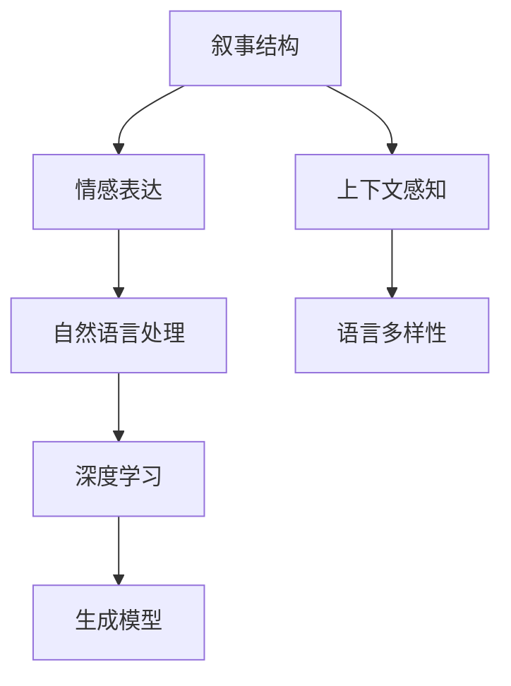

                 

# 构建讲故事的人工智能：课程概述

> 关键词：人工智能, 故事, 叙事, 语言生成, 模型训练, 自然语言处理, 故事生成, 深度学习, 教育技术

## 1. 背景介绍

### 1.1 问题由来

讲故事是人类沟通的基本方式之一，蕴含着丰富的情感、价值判断和智慧。随着人工智能技术的发展，如何让机器也具备讲故事的能力，成为近年来研究的热点。这种能力的提升，不仅可以让机器更好地理解和生成人类的语言，还能在教育、娱乐、客服等领域发挥重要作用。

### 1.2 问题核心关键点

构建讲故事的人工智能系统，核心在于将语言的叙事结构与情感表达结合起来，使机器能够根据给定上下文生成连贯且富有表现力的文本。其关键点包括：

- **情感理解与生成**：能够识别和生成符合语境的情感和语气。
- **叙事结构建模**：理解故事的起承转合，生成符合语法和逻辑的文本。
- **上下文感知**：根据上下文生成连贯且合理的对话或故事。
- **语言多样性**：能够根据受众的不同选择不同的语言风格和表达方式。

### 1.3 问题研究意义

构建讲故事的人工智能，对于增强人机交互的自然性和情感共鸣，推动教育、娱乐、客服等行业的发展，具有重要意义：

1. **教育与培训**：通过讲述故事，使学习内容更加生动有趣，提高学习效果。
2. **娱乐与文化**：创作引人入胜的故事，满足用户对于内容创作的需求。
3. **客服与交互**：通过自然语言理解与生成，提供更加人性化、高效的服务。
4. **信息与知识**：用故事的形式传播知识，使复杂的信息更易于理解与传播。

## 2. 核心概念与联系

### 2.1 核心概念概述

构建讲故事的人工智能涉及多个关键概念，包括但不限于：

- **叙事结构**：故事中的情节、角色、场景等组成要素的排列组合方式。
- **情感表达**：通过文本传达的情感和情绪，如喜怒哀乐等。
- **自然语言处理(NLP)**：使计算机能够理解、处理和生成自然语言的技术。
- **深度学习**：利用神经网络模型从数据中学习复杂特征的机器学习技术。
- **生成模型**：能够根据输入生成新文本的模型，如语言模型、生成对抗网络等。

### 2.2 核心概念原理和架构的 Mermaid 流程图



这个流程图展示了构建讲故事AI系统的核心组成及其相互关系：

1. 叙事结构作为基础，指导故事的组织和展开。
2. 情感表达通过自然语言处理，使故事更具情感和感染力。
3. 深度学习模型利用数据训练，学习语言生成能力。
4. 生成模型基于深度学习模型，实现从输入到输出的文本生成。
5. 上下文感知与语言多样性相结合，使故事生成更具适应性和个性化。

## 3. 核心算法原理 & 具体操作步骤

### 3.1 算法原理概述

构建讲故事的人工智能主要通过以下算法实现：

1. **叙事结构建模**：利用标记语言、树形结构等方法，对故事中的情节、角色、场景进行建模。
2. **情感表达生成**：使用情感词典、情绪生成模型等手段，在故事中嵌入情感元素。
3. **自然语言处理**：通过分词、句法分析、语义理解等技术，对输入文本进行处理。
4. **深度学习模型训练**：基于神经网络模型，如循环神经网络(RNN)、Transformer等，从文本数据中学习语言生成规则。
5. **文本生成**：通过生成模型，如语言模型、变分自编码器(VAE)、生成对抗网络(GAN)等，根据输入生成故事或对话。

### 3.2 算法步骤详解

构建讲故事的人工智能系统一般包含以下步骤：

1. **数据收集与预处理**：收集大量故事文本数据，进行分词、去停用词、构建叙事结构标签等预处理工作。
2. **叙事结构建模**：对故事数据进行分层次建模，如场景、情节、角色等。
3. **情感生成与编码**：使用情感词典、情绪生成模型等手段，为故事添加情感标签。
4. **模型训练**：选择合适的神经网络模型，如Transformer、GRU等，在标注数据上进行训练，学习语言生成规则。
5. **故事生成**：根据用户输入的上下文，利用训练好的模型生成连贯的故事或对话。

### 3.3 算法优缺点

构建讲故事的人工智能系统具有以下优点：

1. **灵活性与多样性**：能够根据不同的上下文生成多种风格的故事或对话。
2. **情感共鸣**：故事中融入情感元素，使机器生成的文本更具感染力。
3. **应用广泛**：可在教育、娱乐、客服等多个领域发挥作用。

同时，也存在一些局限性：

1. **数据依赖**：构建高质量的叙事结构和情感表达模型，需要大量的标注数据。
2. **模型复杂度**：深度学习模型训练复杂，需要较高的计算资源和专业知识。
3. **上下文感知不足**：模型的上下文理解能力有限，可能无法处理复杂的故事情境。
4. **生成质量不恒定**：生成的故事或对话质量受训练数据和模型参数的影响较大。

### 3.4 算法应用领域

构建讲故事的人工智能系统已经在多个领域得到应用，包括但不限于：

1. **教育培训**：用于讲述知识点的故事化教学，提高学生的学习兴趣。
2. **娱乐内容创作**：为电影、游戏等创作故事，提升内容质量和用户体验。
3. **客户服务**：提供个性化的故事化客服服务，提升用户体验。
4. **文化传承**：通过故事化方式传播和保护传统文化，使更多人了解和传承。

## 4. 数学模型和公式 & 详细讲解 & 举例说明

### 4.1 数学模型构建

构建讲故事的人工智能系统涉及多种数学模型，以下以基于Transformer的生成模型为例，说明其构建过程：

假设故事文本数据为 $\{x_1, x_2, ..., x_n\}$，其中每个 $x_i$ 表示一个句子，通过分词和向量表示后，输入到Transformer模型中进行处理。模型的输入为 $\{X, Y\}$，其中 $X$ 表示输入句子的编码向量，$Y$ 表示目标句子的编码向量，目标是生成下一个句子 $y$。模型的目标函数为：

$$
\mathcal{L} = -\sum_{i=1}^{n} \log P(y_i | y_{i-1})
$$

其中 $P(y_i | y_{i-1})$ 表示下一个句子 $y_i$ 在给定前一个句子 $y_{i-1}$ 的条件概率。

### 4.2 公式推导过程

以一个简单的文本生成过程为例，假设模型有一个双向的Transformer编码器和一个单向的Transformer解码器。编码器接收输入 $X$，解码器接收上一个句子 $y_{i-1}$，输出下一个句子 $y_i$。假设编码器输出 $H$，解码器输出 $H'$，则生成下一个句子的概率为：

$$
P(y_i | y_{i-1}) = \frac{\exp\left[\log\left(\exp(H_i^T W_2\right)\right]}{\sum_{j=1}^{n}\exp\left[\log\left(\exp(H_j^T W_2\right)\right]}
$$

其中 $W_2$ 为解码器输出层的权重矩阵，$H_i$ 和 $H_j$ 分别表示第 $i$ 个和第 $j$ 个句子的编码向量，$log$ 表示自然对数。

### 4.3 案例分析与讲解

以《哈利·波特》系列小说为例，假设输入为“哈利在霍格沃茨魔法学校的第一年”，输出可能为“他在那里结识了许多朋友，并学到了很多魔法技能。”这个过程中，叙事结构为“哈利在霍格沃茨魔法学校”，情感表达为“结识了许多朋友，学到了很多魔法技能”。

## 5. 项目实践：代码实例和详细解释说明

### 5.1 开发环境搭建

要搭建一个讲故事的人工智能系统，首先需要安装以下软件包：

1. Python：版本为3.7及以上。
2. PyTorch：用于构建深度学习模型。
3. Transformers：用于构建预训练模型和微调模型。
4. NLTK：用于文本处理和分词。
5. torchtext：用于文本数据的加载和处理。
6. OpenAI GPT：预训练模型，用于生成故事。

安装命令如下：

```bash
pip install torch torchtext transformers nltk
```

### 5.2 源代码详细实现

以下是使用PyTorch和Transformers库构建讲故事AI系统的代码示例：

```python
import torch
import torch.nn as nn
import torch.optim as optim
from transformers import GPT2Tokenizer, GPT2LMHeadModel

# 初始化模型和训练参数
tokenizer = GPT2Tokenizer.from_pretrained('gpt2')
model = GPT2LMHeadModel.from_pretrained('gpt2')

# 定义训练函数
def train_step(model, optimizer, input_ids, labels):
    model.zero_grad()
    outputs = model(input_ids)
    loss = nn.CrossEntropyLoss()(outputs, labels)
    loss.backward()
    optimizer.step()
    return loss.item()

# 定义训练循环
epochs = 10
batch_size = 64
total_loss = 0
for epoch in range(epochs):
    for i in range(0, input_ids.shape[0], batch_size):
        batch_input_ids = input_ids[i:i+batch_size]
        batch_labels = labels[i:i+batch_size]
        loss = train_step(model, optimizer, batch_input_ids, batch_labels)
        total_loss += loss
        print(f'Epoch {epoch+1}/{epochs}, Loss: {total_loss/len(input_ids):.4f}')
```

### 5.3 代码解读与分析

1. **模型初始化**：使用GPT-2预训练模型作为基础，其输入为分词后的文本向量。
2. **训练函数**：定义单步训练函数，计算损失并更新模型参数。
3. **训练循环**：对输入的文本数据进行训练，循环迭代多次。

### 5.4 运行结果展示

训练完成后，可以使用以下代码生成新的故事：

```python
input_text = "哈利在霍格沃茨魔法学校的第一年，"
tokens = tokenizer.encode(input_text)
generated_tokens = model.generate(tokens, max_length=20)
story = tokenizer.decode(generated_tokens[0])
print(story)
```

## 6. 实际应用场景

### 6.1 教育培训

在教育培训领域，讲故事的人工智能系统可以用于辅助教学，使学习内容更加生动有趣。例如，可以设计一个讲述历史事件的模型，通过互动式问答的形式，让学生更好地理解历史事件的背景和过程。

### 6.2 娱乐内容创作

在娱乐内容创作中，讲故事的人工智能系统可以用于生成电影剧本、游戏情节等。通过分析观众的偏好，生成符合用户口味的故事内容，提升内容的吸引力和互动性。

### 6.3 客户服务

在客户服务领域，讲故事的人工智能系统可以用于自动生成客服对话。通过理解客户的问题和情感，生成富有情感的回复，提升用户体验。

### 6.4 未来应用展望

未来，讲故事的人工智能系统将在更多领域得到应用，如医疗、法律、金融等。通过生成富有情感和表现力的文本，使机器能够更好地服务于人类，提升社会运行的效率和质量。

## 7. 工具和资源推荐

### 7.1 学习资源推荐

以下是几本关于构建讲故事的人工智能系统的书籍和在线课程：

1. 《Neural Network Methods in Language Processing》：详细介绍了利用神经网络模型生成文本的方法。
2. 《Natural Language Processing with Deep Learning》：介绍了深度学习在自然语言处理中的应用，包括文本生成、情感分析等。
3. 《Storytelling with Deep Learning》：专门讲述如何用深度学习构建讲故事的人工智能系统。
4. 《AI for Storytelling》：通过实际案例讲解如何用人工智能技术创作故事。

### 7.2 开发工具推荐

以下是一些用于构建讲故事AI系统的开发工具：

1. PyTorch：灵活的深度学习框架，支持自定义模型和网络结构。
2. Transformers：基于Hugging Face开发的NLP工具库，支持预训练模型和微调模型。
3. NLTK：自然语言处理库，支持文本预处理和分析。
4. OpenAI GPT：预训练模型，支持生成高质量文本。

### 7.3 相关论文推荐

以下是几篇关于构建讲故事的人工智能系统的经典论文：

1. "The Unreasonable Effectiveness of Transfer Learning in Natural Language Processing"：介绍了迁移学习在自然语言处理中的应用。
2. "Neural Story Generation with Attention"：提出使用注意力机制生成连贯故事的方法。
3. "Generating Stories from Data with Recurrent Neural Networks"：利用递归神经网络生成故事的方法。
4. "Story Prediction and Generation with Recurrent Neural Networks"：通过递归神经网络生成故事的经典论文。

## 8. 总结：未来发展趋势与挑战

### 8.1 总结

本文对构建讲故事的人工智能系统进行了详细讲解。首先介绍了构建讲故事AI系统的背景和意义，详细阐述了叙事结构、情感表达、自然语言处理、深度学习和生成模型等核心概念。其次，从算法原理和操作步骤，对叙事结构建模、情感表达生成、模型训练和文本生成等环节进行了详细介绍。最后，对构建讲故事AI系统的应用场景和未来展望进行了探讨。

### 8.2 未来发展趋势

未来，构建讲故事的人工智能系统将呈现以下几个发展趋势：

1. **更加多样化的叙事结构**：叙事结构将更加丰富，不仅包括传统的线性叙事，还包括非线性、多线性的叙事形式。
2. **情感表达的增强**：通过更加精细的情感模型和生成技术，使故事更加富有情感和感染力。
3. **更高效的模型训练**：通过优化算法和硬件加速，提高模型训练的效率和效果。
4. **跨领域的知识融合**：将其他领域的知识与故事生成相结合，提升故事的深度和广度。
5. **个性化生成**：根据用户的偏好和情感，生成个性化的故事内容。

### 8.3 面临的挑战

构建讲故事的人工智能系统在推广应用过程中，仍面临以下挑战：

1. **数据获取难度**：高质量的故事数据获取难度较大，尤其是情感表达的标注数据。
2. **模型训练复杂**：深度学习模型的训练复杂度高，需要较高的计算资源和专业知识。
3. **上下文理解不足**：模型的上下文理解能力有限，可能无法处理复杂的故事情境。
4. **生成质量不稳定**：生成的故事质量受训练数据和模型参数的影响较大，难以保证一致性。
5. **伦理和法律问题**：生成的故事可能包含不当内容，需要严格控制和管理。

### 8.4 研究展望

面对这些挑战，未来研究需要在以下几个方面取得突破：

1. **数据增强和扩充**：利用数据增强技术，扩充训练数据，提升模型的泛化能力。
2. **迁移学习和多模态学习**：利用迁移学习和多模态学习，提升模型的通用性和适应性。
3. **生成对抗网络**：引入生成对抗网络，提高故事生成的质量和多样性。
4. **自监督学习**：利用自监督学习，降低对标注数据的依赖，提高模型的鲁棒性。
5. **模型优化**：开发更高效的模型结构和训练算法，提高模型的计算效率和质量。

## 9. 附录：常见问题与解答

**Q1：构建讲故事的人工智能系统需要哪些数据？**

A: 构建讲故事的人工智能系统需要大量标注好的故事文本数据，包括故事情节、角色、情感等元素。这些数据可以通过网络爬取、用户生成或人工标注等方式获得。

**Q2：如何选择适合讲故事的人工智能模型？**

A: 选择适合讲故事的人工智能模型，需要考虑以下几个因素：
1. 模型的训练数据和规模。
2. 模型的生成质量和多样性。
3. 模型的训练复杂度和计算资源需求。
4. 模型的应用场景和任务需求。

**Q3：如何提高讲故事的人工智能系统的生成质量？**

A: 提高讲故事的人工智能系统的生成质量，可以从以下几个方面入手：
1. 使用更加多样化和高质量的训练数据。
2. 优化模型结构，如引入注意力机制、多模态融合等。
3. 引入生成对抗网络等技术，提升生成质量。
4. 使用预训练模型，利用其已有知识提升生成效果。

**Q4：讲故事的人工智能系统如何与人类合作？**

A: 讲故事的人工智能系统与人类合作，可以采用以下方式：
1. 人类提供初始故事框架，AI填充具体内容。
2. 人类提供情感反馈，AI调整生成内容。
3. 人类与AI协同创作，实现内容创新和迭代。

---

作者：禅与计算机程序设计艺术 / Zen and the Art of Computer Programming

