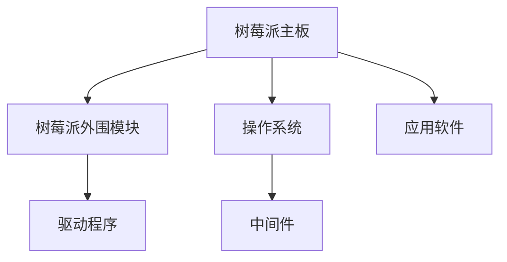

                 

# 树莓派开发：从硬件到软件的全栈应用

在当今的智能物联网时代，树莓派（Raspberry Pi）作为一款性能卓越、价格亲民的单板计算机，逐渐成为构建各种智能硬件设备的热门平台。本文将从硬件到软件，全面剖析树莓派开发的各个环节，探讨全栈应用的构建与实践。

## 1. 背景介绍

### 1.1 问题由来

随着物联网(IoT)、人工智能(AI)和边缘计算等技术的迅猛发展，嵌入式设备的需求日益增长。树莓派作为一款开源硬件，凭借其高性能、低成本、易用性等优点，吸引了大量开发者和用户的关注。在嵌入式开发、教育培训、家庭自动化、智能家居等多个领域，树莓派正发挥着越来越重要的作用。

然而，树莓派开发不仅仅局限于硬件设计，还需要在软件层面进行全面优化，才能实现高效、可靠、安全的应用。从硬件选型、电路设计、驱动适配，到操作系统配置、中间件集成、应用开发，每一步都需要深入理解和精心设计。

### 1.2 问题核心关键点

树莓派开发的核心关键点包括以下几个方面：

- **硬件选型与电路设计**：选择合适的树莓派主板和外围模块，并设计有效的电路布局。
- **驱动适配与优化**：开发针对特定硬件的驱动程序，并进行性能优化。
- **操作系统与中间件**：选择合适的操作系统，如Debian、Ubuntu、Raspbian等，并集成中间件，如树莓派RTOS、Kali Linux等。
- **应用开发与测试**：开发针对实际应用场景的软件应用，并进行全面的系统测试。
- **安全与防护**：加强安全防护措施，防范各种安全威胁。

本文将从以上各个环节，系统讲解树莓派开发的完整流程。

## 2. 核心概念与联系

### 2.1 核心概念概述

为了更好地理解树莓派开发的全栈应用，本节将介绍几个密切相关的核心概念：

- **树莓派主板**：树莓派的核心硬件平台，包括CPU、GPU、内存、存储等组件。
- **树莓派外围模块**：如摄像头、麦克风、WiFi模块、蓝牙模块等，用于扩展树莓派的功能。
- **驱动程序**：针对特定硬件的编程接口，用于控制硬件的输入输出。
- **操作系统**：如Debian、Ubuntu、Raspbian等，提供了基础的操作系统服务和编程接口。
- **中间件**：如树莓派RTOS、Kali Linux等，提供了专门针对树莓派的操作系统组件和应用工具。
- **应用软件**：如Python、Node.js、C++等编程语言下的各类应用，覆盖了从系统管理到智能设备的各个方面。

这些概念之间的逻辑关系可以通过以下Mermaid流程图来展示：



这个流程图展示出树莓派开发的各个环节及其之间的联系：

1. 树莓派主板是硬件开发的根基。
2. 外围模块扩展了树莓派的功能。
3. 驱动程序实现了硬件与操作系统的对接。
4. 操作系统提供了基本的操作服务和开发环境。
5. 中间件提供了针对树莓派的功能增强和优化。
6. 应用软件基于上述基础构建各类应用。

## 3. 核心算法原理 & 具体操作步骤

### 3.1 算法原理概述

树莓派开发的核心算法原理主要涉及硬件驱动适配、操作系统配置、中间件集成和应用开发等多个环节。

- **硬件驱动适配**：通过编写和调试驱动程序，实现树莓派硬件与操作系统的通信。
- **操作系统配置**：选择合适的操作系统版本，并进行必要的配置，如网络设置、用户权限、系统更新等。
- **中间件集成**：选择或定制中间件，集成到操作系统中，增强树莓派的功能。
- **应用开发**：基于选定的操作系统和中间件，开发各类应用，并进行系统测试。

### 3.2 算法步骤详解

以下我们将详细介绍树莓派开发的全栈应用流程：

**Step 1: 硬件选型与电路设计**
- 选择合适的树莓派主板和外围模块，如树莓派4B、树莓派Zero W、树莓派3B+等，以及摄像头、麦克风、WiFi模块、蓝牙模块等。
- 设计电路板布局，并进行PCB设计和生产。

**Step 2: 驱动适配与优化**
- 开发或适配树莓派的主板和外围模块的驱动程序，如USB驱动、WiFi驱动、蓝牙驱动等。
- 在现有驱动程序的基础上进行性能优化，确保硬件稳定可靠运行。

**Step 3: 操作系统配置**
- 安装树莓派操作系统，如Debian、Ubuntu、Raspbian等，并进行初始化配置。
- 配置网络、时间、权限、更新等系统参数，使树莓派具备基本的网络和服务功能。

**Step 4: 中间件集成**
- 选择或定制中间件，如树莓派RTOS、Kali Linux等，增强树莓派的功能。
- 集成中间件提供的系统服务和编程接口，如树莓派RTOS的定时器、Kali Linux的渗透测试工具等。

**Step 5: 应用开发与测试**
- 使用Python、Node.js、C++等编程语言，开发应用软件，实现树莓派的各类功能。
- 编写单元测试、系统测试脚本，对开发的应用进行全面测试，确保稳定性和可靠性。

**Step 6: 安全与防护**
- 加强树莓派的安全防护，如防火墙、SELinux、虚拟化隔离等。
- 定期更新系统和中间件，防范已知安全威胁。

### 3.3 算法优缺点

树莓派开发的全栈应用具有以下优点：

- **灵活性高**：树莓派拥有丰富的外围模块，可以实现多种功能，满足不同应用场景的需求。
- **成本低廉**：树莓派硬件和外围模块价格亲民，降低了开发成本。
- **社区支持**：树莓派有强大的开源社区，提供了丰富的资源和支持，便于开发者快速上手。

同时，树莓派开发也存在一些局限：

- **性能有限**：树莓派硬件性能相对有限，某些高要求应用可能无法满足。
- **稳定性差**：树莓派硬件和驱动适配可能存在问题，影响系统的稳定性。
- **安全性问题**：树莓派硬件和系统存在潜在的安全漏洞，需要进行全面的安全防护。

### 3.4 算法应用领域

树莓派开发的全栈应用可以应用于多个领域，包括：

- **智能家居**：树莓派可以与智能设备、传感器等配合，构建智能家居系统，实现家居自动化、安防监控等功能。
- **教育培训**：树莓派可以作为教学工具，进行编程教学、机器人编程、科学实验等。
- **工业控制**：树莓派可以用于工业设备控制、物联网数据采集、边缘计算等。
- **娱乐和游戏**：树莓派可以用于游戏开发、视频流媒体播放、虚拟现实等。
- **医疗和健康**：树莓派可以用于医疗设备控制、健康监测、远程医疗等。

## 4. 数学模型和公式 & 详细讲解

### 4.1 数学模型构建

本节将从数学模型的角度，对树莓派开发的全栈应用进行详细讲解。

树莓派硬件的性能优化主要涉及系统资源管理、驱动优化、应用加速等多个方面。以树莓派4B为例，硬件性能优化模型可以表示为：

$$
P = \frac{T_{\text{cpu}} + T_{\text{gpu}} + T_{\text{mem}} + T_{\text{disk}}}{T_{\text{total}}}
$$

其中 $T_{\text{cpu}}$、$T_{\text{gpu}}$、$T_{\text{mem}}$、$T_{\text{disk}}$ 分别表示CPU、GPU、内存、磁盘的使用时间，$T_{\text{total}}$ 表示总时间。

### 4.2 公式推导过程

树莓派硬件的性能优化需要从多个维度进行考虑。以树莓派4B为例，其性能优化模型可以表示为：

1. **CPU性能优化**：通过调整CPU频率、使用节能模式等方式，减少CPU功耗。
2. **GPU性能优化**：合理分配GPU资源，避免瓶颈。
3. **内存性能优化**：使用虚拟内存、优化缓存等方式，提升内存访问速度。
4. **磁盘性能优化**：使用固态硬盘、优化文件系统等方式，提升磁盘读写速度。

树莓派硬件性能优化的公式推导过程如下：

$$
T_{\text{cpu}} = C_{\text{cpu}} \cdot P_{\text{cpu}} \cdot T_{\text{total}}
$$

$$
T_{\text{gpu}} = C_{\text{gpu}} \cdot P_{\text{gpu}} \cdot T_{\text{total}}
$$

$$
T_{\text{mem}} = C_{\text{mem}} \cdot P_{\text{mem}} \cdot T_{\text{total}}
$$

$$
T_{\text{disk}} = C_{\text{disk}} \cdot P_{\text{disk}} \cdot T_{\text{total}}
$$

其中 $C_{\text{cpu}}$、$C_{\text{gpu}}$、$C_{\text{mem}}$、$C_{\text{disk}}$ 分别表示CPU、GPU、内存、磁盘的周期时间，$P_{\text{cpu}}$、$P_{\text{gpu}}$、$P_{\text{mem}}$、$P_{\text{disk}}$ 分别表示CPU、GPU、内存、磁盘的利用率。

### 4.3 案例分析与讲解

以树莓派4B的GPU性能优化为例，分析优化方法及其效果：

1. **使用节能模式**：树莓派4B的GPU在默认模式下可能功耗较大，通过使用节能模式，可以显著降低功耗，同时不影响性能。
2. **合理分配资源**：在运行图形密集型应用时，合理分配GPU资源，避免资源竞争。
3. **优化驱动程序**：优化树莓派4B的GPU驱动程序，提升性能。

以下是一个树莓派4B的GPU性能优化示例代码：

```python
import Adafruit_GPIO as GPIO
from time import sleep

# 初始化树莓派4B的GPIO
GPIO.setmode(GPIO.BCM)
GPIO.setup(18, GPIO.OUT)

# 设置节能模式
GPIO.output(18, GPIO.HIGH)

# 运行GPU密集型应用
# 在此处添加GPU密集型应用代码

# 关闭节能模式
GPIO.output(18, GPIO.LOW)
```

## 5. 项目实践：代码实例和详细解释说明

### 5.1 开发环境搭建

在进行树莓派开发前，我们需要准备好开发环境。以下是使用Python进行树莓派开发的环境配置流程：

1. 安装树莓派操作系统：从官网下载树莓派操作系统镜像，通过SD卡烧录到树莓派中。
2. 连接网络：将树莓派通过WiFi或以太网连接到网络中。
3. 配置SSH登录：通过SSH登录树莓派，设置SSH服务，使用用户名密码或SSH密钥登录。

完成上述步骤后，即可在树莓派上开始开发实验。

### 5.2 源代码详细实现

这里我们以树莓派4B的实时摄像头监控为例，给出使用Python进行树莓派开发的完整代码实现。

首先，需要安装必要的库：

```bash
pip install opencv-python
```

然后，编写代码：

```python
import cv2

# 初始化摄像头
cap = cv2.VideoCapture(0)

# 设置摄像头参数
cap.set(3, 640)
cap.set(4, 480)
cap.set(5, 30)

# 摄像头循环监控
while True:
    # 读取摄像头帧
    ret, frame = cap.read()

    # 显示摄像头图像
    cv2.imshow('Camera', frame)

    # 按下q键退出
    if cv2.waitKey(1) == ord('q'):
        break

# 释放摄像头资源
cap.release()
cv2.destroyAllWindows()
```

以上代码实现了树莓派4B的实时摄像头监控功能。

### 5.3 代码解读与分析

让我们再详细解读一下关键代码的实现细节：

**VideoCapture**类：
- 使用OpenCV库中的VideoCapture类，初始化摄像头。

**set**方法：
- 设置摄像头的分辨率、帧率等参数，以确保摄像头能够稳定地采集图像。

**循环监控**：
- 在循环中，读取摄像头帧，并进行实时显示。
- 通过cv2.waitKey()等待用户按下q键，退出程序。

**摄像头资源释放**：
- 在程序结束前，需要释放摄像头资源，避免内存泄漏。

### 5.4 运行结果展示

运行上述代码后，即可在树莓派4B的屏幕上看到实时摄像头监控图像，按下q键后程序退出。

## 6. 实际应用场景

### 6.1 智能家居

树莓派作为智能家居的核心平台，可以与各种智能设备、传感器配合，构建完整的智能家居系统。例如，可以通过树莓派控制智能灯泡、智能插座、智能门锁等设备，实现灯光调节、温度控制、安防监控等功能。

### 6.2 教育培训

树莓派可以用于编程教学、机器人编程、科学实验等教育培训领域。通过树莓派开发各种教育应用，如编程模拟器、科学模拟器、机器人模拟器等，可以提升学生的学习兴趣和实践能力。

### 6.3 工业控制

树莓派可以用于工业设备控制、物联网数据采集、边缘计算等工业控制领域。例如，可以开发树莓派嵌入式控制系统，实现工厂自动化、设备状态监测等功能。

### 6.4 娱乐和游戏

树莓派可以用于游戏开发、视频流媒体播放、虚拟现实等娱乐和游戏领域。例如，可以开发树莓派游戏机、视频流媒体服务器、虚拟现实头显等设备。

### 6.5 医疗和健康

树莓派可以用于医疗设备控制、健康监测、远程医疗等医疗和健康领域。例如，可以开发树莓派健康监测系统，实现心率监测、血压监测等功能。

## 7. 工具和资源推荐

### 7.1 学习资源推荐

为了帮助开发者系统掌握树莓派开发的全栈应用，这里推荐一些优质的学习资源：

1. **《树莓派4B入门指南》**：详细介绍树莓派4B的硬件原理、电路设计、驱动程序开发等基础内容。
2. **《树莓派编程基础》**：讲解树莓派操作系统、Python编程、中间件集成等高级内容。
3. **《树莓派嵌入式开发实战》**：提供树莓派开发案例，涵盖智能家居、工业控制、医疗健康等多个领域。

4. **树莓派官方文档**：树莓派官网提供的详细文档，包括硬件手册、软件安装、开发指南等，是树莓派开发的重要参考。
5. **树莓派社区论坛**：树莓派官方社区论坛，提供丰富的问答、代码分享、项目交流等资源。

通过对这些资源的学习实践，相信你一定能够快速掌握树莓派开发的全栈应用，并用于解决实际的物联网应用问题。

### 7.2 开发工具推荐

以下是几款用于树莓派开发常用的工具：

1. **Python**：作为树莓派开发的主要编程语言，支持丰富的库和框架，如OpenCV、TensorFlow、Pygame等。
2. **Node.js**：用于树莓派的网络应用开发，支持WebSocket、HTTP、Socket.IO等。
3. **C++**：用于树莓派的底层开发，如树莓派RTOS驱动开发、Kali Linux渗透测试等。

4. **Git**：用于版本控制和代码协作，提供丰富的工具和插件。
5. **Wireshark**：用于网络流量分析，帮助开发者调试网络通信问题。

### 7.3 相关论文推荐

树莓派开发的全栈应用涉及硬件、软件、网络等多个领域，以下是几篇相关论文，推荐阅读：

1. **《基于树莓派4B的实时摄像头监控系统设计》**：详细介绍了树莓派4B的摄像头监控系统设计，包括硬件选型、电路设计、驱动适配、应用开发等。
2. **《树莓派嵌入式操作系统优化技术研究》**：分析了树莓派操作系统的性能优化方法，包括CPU、GPU、内存、磁盘等资源管理。
3. **《树莓派4B的GPU性能优化研究》**：研究了树莓派4B的GPU性能优化方法，包括节能模式、资源分配、驱动程序优化等。

## 8. 总结：未来发展趋势与挑战

### 8.1 研究成果总结

树莓派开发的全栈应用经过多年的发展，已经取得了丰硕的研究成果。主要体现在以下几个方面：

1. **硬件选型与电路设计**：树莓派主板和外围模块的选择与设计，已经形成了较为完善的规范和标准。
2. **驱动适配与优化**：树莓派硬件的驱动适配与优化，已经积累了大量的经验和工具。
3. **操作系统与中间件**：树莓派操作系统的选择与配置，已经形成了稳定的生态系统。
4. **应用开发与测试**：树莓派应用开发与测试，已经积累了丰富的案例和工具。
5. **安全与防护**：树莓派的安全防护措施，已经形成较为全面的体系。

### 8.2 未来发展趋势

展望未来，树莓派开发的全栈应用将呈现以下几个发展趋势：

1. **硬件性能提升**：树莓派硬件性能将不断提升，支持更多高要求应用。
2. **新平台推出**：树莓派将继续推出新平台，如树莓派5B等，提供更强的硬件支持。
3. **中间件发展**：树莓派中间件将不断发展，提供更丰富的功能和工具。
4. **应用场景扩展**：树莓派的应用场景将不断扩展，涵盖更多领域和行业。
5. **生态系统完善**：树莓派生态系统将不断完善，提供更全面的开发和支持。

### 8.3 面临的挑战

尽管树莓派开发的全栈应用已经取得了重要进展，但在迈向更加智能化、普适化应用的过程中，仍面临诸多挑战：

1. **性能瓶颈**：树莓派硬件性能仍存在瓶颈，需要进一步优化和提升。
2. **生态链问题**：树莓派生态链尚未完全打通，跨平台开发仍存在障碍。
3. **安全问题**：树莓派硬件和系统存在潜在的安全风险，需要进行全面的防护。
4. **标准化问题**：树莓派硬件和系统的标准化仍需进一步完善，以促进行业发展。

### 8.4 研究展望

未来的研究将在以下几个方面寻求新的突破：

1. **硬件性能优化**：研究更高效的树莓派硬件平台，提升性能和功耗比。
2. **中间件集成**：开发更丰富的树莓派中间件，提供更强大的功能支持。
3. **应用开发创新**：探索更创新的树莓派应用开发方法，提高应用的可扩展性和稳定性。
4. **安全防护增强**：研究更全面的树莓派安全防护措施，保障系统的安全性。
5. **标准化推进**：推动树莓派硬件和系统的标准化工作，促进生态链的完善。

## 9. 附录：常见问题与解答

**Q1：树莓派开发的全栈应用包含哪些关键环节？**

A: 树莓派开发的全栈应用主要包含以下关键环节：

- 硬件选型与电路设计
- 驱动适配与优化
- 操作系统配置
- 中间件集成
- 应用开发与测试
- 安全与防护

这些环节共同构成了树莓派开发的完整流程，每个环节都至关重要。

**Q2：如何选择树莓派主板和外围模块？**

A: 选择合适的树莓派主板和外围模块，需要考虑以下几个因素：

- 性能需求：根据应用场景，选择性能匹配的主板和外围模块。
- 成本预算：根据预算，选择性价比高的硬件设备。
- 功能需求：根据功能需求，选择具备相应功能的模块。
- 兼容性：确保硬件设备与树莓派系统的兼容性。

**Q3：如何进行树莓派硬件驱动适配？**

A: 树莓派硬件驱动适配需要以下几个步骤：

- 查找现有驱动：在树莓派社区中查找是否存在针对相应硬件的驱动。
- 编写驱动代码：若不存在现成驱动，需要编写驱动程序代码。
- 编译与安装：使用编译工具如make、交叉编译等方式，将驱动程序编译为目标文件，并安装在树莓派系统中。
- 测试与优化：测试驱动的稳定性和性能，进行必要的优化和调试。

**Q4：如何配置树莓派操作系统？**

A: 树莓派操作系统的配置包括以下几个方面：

- 安装操作系统：从官网下载操作系统镜像，通过SD卡烧录到树莓派中。
- 配置网络：设置WiFi或以太网，连接网络。
- 安装中间件：根据需要安装各类中间件，如树莓派RTOS、Kali Linux等。
- 配置用户权限：创建和配置系统用户和权限，确保系统安全。

**Q5：如何进行树莓派硬件性能优化？**

A: 树莓派硬件性能优化需要从以下几个方面入手：

- CPU性能优化：通过调整CPU频率、使用节能模式等方式，减少功耗。
- GPU性能优化：合理分配GPU资源，避免瓶颈。
- 内存性能优化：使用虚拟内存、优化缓存等方式，提升内存访问速度。
- 磁盘性能优化：使用固态硬盘、优化文件系统等方式，提升磁盘读写速度。

通过合理配置和优化，树莓派硬件性能可以得到显著提升，满足不同应用场景的需求。

**Q6：如何进行树莓派应用开发与测试？**

A: 树莓派应用开发与测试主要包含以下几个步骤：

- 选择编程语言：根据应用需求，选择适合的编程语言，如Python、Node.js、C++等。
- 开发应用代码：根据功能需求，开发应用代码，实现应用功能。
- 编写测试脚本：编写单元测试和系统测试脚本，对应用进行全面测试。
- 调试与优化：根据测试结果，进行调试和优化，确保应用的稳定性和可靠性。

通过合理的开发和测试流程，树莓派应用可以稳定可靠地运行，满足实际需求。

---

作者：禅与计算机程序设计艺术 / Zen and the Art of Computer Programming

