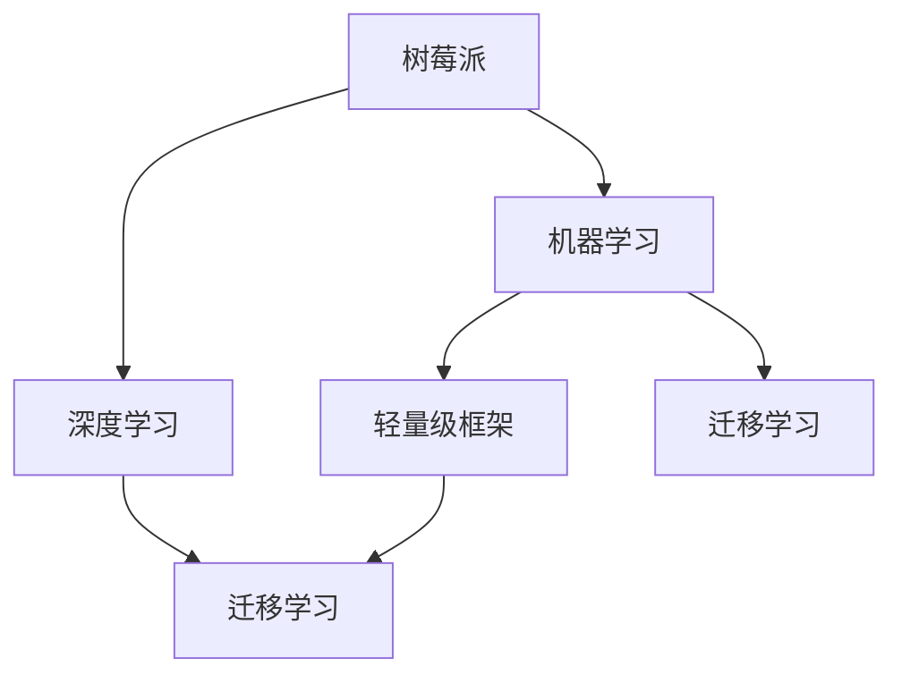

                 

## 1. 背景介绍

树莓派（Raspberry Pi）是一款开源的、以ARM处理器为核心的计算平台。由于其经济、便捷、功能强大等特点，广泛应用于教育、科研、娱乐等领域。随着机器学习技术的飞速发展，树莓派+机器学习已经成为了一个热门话题，越来越多的人希望在树莓派上运行机器学习应用程序。

### 1.1 问题由来
机器学习在图像处理、自然语言处理、推荐系统等领域有诸多应用。然而，传统机器学习的应用需要高端硬件平台，如PC服务器或者高性能的工作站。而树莓派作为一款资源有限的计算平台，其应用机器学习面临着诸多挑战：

1. 计算资源不足：树莓派的CPU、GPU性能较低，难以支撑复杂的机器学习模型和算法。
2. 存储资源受限：树莓派的硬盘空间较小，无法存储大规模训练数据集。
3. 网络带宽低：树莓派的网络连接速度较慢，限制了数据传输的效率。
4. 操作系统问题：树莓派运行的是Linux操作系统，与一些流行的深度学习框架（如TensorFlow、PyTorch）的兼容性有待提升。

### 1.2 问题核心关键点
针对上述挑战，本文将探讨如何在树莓派上高效开发和部署机器学习应用程序。具体将从以下几个方面入手：

- 选择合适的框架：如何在树莓派上部署高效、轻量级的机器学习框架。
- 数据处理：如何在资源受限的情况下，处理大规模数据集。
- 模型训练与优化：如何在计算资源不足的条件下，高效训练机器学习模型。
- 应用部署：如何利用树莓派的网络资源，实现实时数据处理和应用部署。

## 2. 核心概念与联系

### 2.1 核心概念概述

为了更好地理解在树莓派上开发和部署机器学习应用程序，本节将介绍几个密切相关的核心概念：

- 树莓派（Raspberry Pi）：开源计算平台，具备ARM处理器，广泛应用于教育、科研等领域。
- 机器学习（Machine Learning）：利用数据和算法，让计算机从数据中学习并做出预测或决策的过程。
- 深度学习（Deep Learning）：机器学习的一个分支，通过构建神经网络进行复杂模式识别和特征提取。
- 轻量级框架（Lightweight Framework）：针对计算资源受限的设备，设计更小、更高效的机器学习框架。
- 迁移学习（Transfer Learning）：通过在预训练模型上进行微调，提升在特定任务上的性能。

这些核心概念之间的逻辑关系可以通过以下Mermaid流程图来展示：



这个流程图展示了这个核心概念之间的逻辑关系：

1. 树莓派通过机器学习实现智能应用。
2. 机器学习使用深度学习作为核心算法。
3. 深度学习使用轻量级框架降低计算需求。
4. 轻量级框架通过迁移学习提升特定任务性能。

这些核心概念共同构成了树莓派上开发和部署机器学习应用程序的理论基础。

## 3. 核心算法原理 & 具体操作步骤
### 3.1 算法原理概述

在树莓派上开发机器学习应用程序，需要借助轻量级的深度学习框架，并采用迁移学习策略。其核心思想是：通过预训练模型在更大数据集上的训练，减少在树莓派上的训练时间和资源消耗。具体步骤包括：

1. 选择合适的预训练模型作为初始化参数，如MobileNet、ResNet等轻量级模型。
2. 收集树莓派上的数据集，并对其进行标注。
3. 在树莓派上使用轻量级框架（如TensorFlow Lite）对预训练模型进行微调。
4. 在树莓派上部署微调后的模型，进行实时数据处理和应用。

### 3.2 算法步骤详解

以下是具体的操作流程：

#### 3.2.1 数据预处理
在树莓派上处理大规模数据集，需要考虑以下因素：

1. 数据压缩：将数据集压缩为更小的文件格式（如JPEG、PNG等），减小硬盘空间占用。
2. 数据分块：将数据集划分为多个小块，降低单个数据集的尺寸，减少内存占用。
3. 数据存储：将数据存储在树莓派的SD卡或NFS网络存储中，避免直接存储在本地硬盘。

#### 3.2.2 模型微调
在树莓派上微调模型，可以遵循以下步骤：

1. 加载预训练模型：使用TensorFlow Lite加载轻量级深度学习模型。
2. 定义数据输入输出：使用TensorFlow Lite定义模型的输入输出接口。
3. 定义损失函数：根据具体任务定义损失函数，如交叉熵损失、均方误差损失等。
4. 定义优化器：选择合适的优化算法（如SGD、Adam等），并设置学习率、批大小等超参数。
5. 训练模型：使用数据集进行训练，最小化损失函数。
6. 模型保存：将训练好的模型保存到树莓派的硬盘或NFS存储中，方便后续使用。

#### 3.2.3 应用部署
在树莓派上部署微调后的模型，可以遵循以下步骤：

1. 设置树莓派环境：确保树莓派上有TensorFlow Lite运行所需的依赖库。
2. 加载模型：使用TensorFlow Lite加载微调后的模型。
3. 定义推理接口：定义模型输入输出接口，方便应用调用。
4. 数据处理：对实时数据进行处理，如图像缩放、归一化等。
5. 推理预测：使用加载的模型对数据进行推理预测。
6. 结果处理：将模型输出转换为应用需要的格式，进行后续处理。

### 3.3 算法优缺点

在树莓派上开发机器学习应用程序，具有以下优点：

1. 成本低廉：树莓派的硬件成本较低，相比于传统的PC服务器，可以大大降低开发成本。
2. 灵活性高：树莓派支持的硬件资源多样，可以满足不同应用场景的需求。
3. 适用性强：树莓派上部署的机器学习应用程序，可以应用于嵌入式系统、物联网设备等。

同时，也存在一些缺点：

1. 计算资源受限：树莓派上的计算资源相对有限，难以支撑复杂的深度学习模型和算法。
2. 存储资源受限：树莓派的硬盘空间较小，无法存储大规模训练数据集。
3. 网络带宽低：树莓派的网络连接速度较慢，限制了数据传输的效率。
4. 操作系统问题：树莓派运行的是Linux操作系统，与一些流行的深度学习框架（如TensorFlow、PyTorch）的兼容性有待提升。

## 4. 数学模型和公式 & 详细讲解 & 举例说明
### 4.1 数学模型构建

在树莓派上开发机器学习应用程序，可以使用以下数学模型：

- 损失函数（Loss Function）：用于衡量模型输出与真实标签之间的差异。常见的损失函数包括交叉熵损失、均方误差损失等。
- 优化算法（Optimization Algorithm）：用于最小化损失函数，常用的优化算法包括梯度下降、Adam、SGD等。
- 数据增强（Data Augmentation）：通过对训练数据进行随机变换，增加数据多样性，提高模型泛化能力。
- 迁移学习（Transfer Learning）：通过在预训练模型上进行微调，减少训练时间和资源消耗。

### 4.2 公式推导过程

以交叉熵损失函数为例，推导过程如下：

设模型输出为 $\hat{y}$，真实标签为 $y$，则交叉熵损失函数为：

$$
L(y,\hat{y}) = -\frac{1}{N}\sum_{i=1}^N y_i \log \hat{y}_i
$$

其中 $N$ 为样本数，$y_i$ 和 $\hat{y}_i$ 分别为第 $i$ 个样本的真实标签和模型输出。

在树莓派上训练模型时，可以使用小批量随机梯度下降算法（Mini-batch Stochastic Gradient Descent），公式如下：

$$
\theta_{t+1} = \theta_t - \eta \frac{1}{m} \sum_{i=1}^m \nabla L(y^{(i)},\hat{y}^{(i)}) \tag{1}
$$

其中 $\eta$ 为学习率，$m$ 为批次大小。

### 4.3 案例分析与讲解

以图像分类任务为例，分析在树莓派上使用轻量级框架TensorFlow Lite进行微调的过程：

#### 4.3.1 数据预处理
假设有一批图像数据，需要进行预处理：

1. 将图像压缩为JPEG格式，减小文件大小。
2. 将图像按尺寸缩放为固定大小，如224x224像素。
3. 将图像归一化到[0,1]区间。

#### 4.3.2 模型微调
使用预训练模型MobileNet作为初始化参数，对模型进行微调：

1. 加载预训练模型：使用TensorFlow Lite加载MobileNet模型。
2. 定义输入输出：定义模型的输入输出接口。
3. 定义损失函数：使用交叉熵损失函数。
4. 定义优化器：使用Adam优化算法，学习率为0.001。
5. 训练模型：使用数据集进行训练，迭代1000次。
6. 模型保存：将训练好的模型保存到树莓派的硬盘中。

#### 4.3.3 应用部署
在树莓派上部署微调后的模型，进行实时图像分类：

1. 设置树莓派环境：安装TensorFlow Lite依赖库。
2. 加载模型：使用TensorFlow Lite加载微调后的模型。
3. 定义输入输出：定义模型的输入输出接口。
4. 数据处理：读取摄像头拍摄的图像，并进行预处理。
5. 推理预测：使用加载的模型对图像进行推理预测。
6. 结果处理：将模型输出转换为应用需要的格式，进行后续处理。

## 5. 项目实践：代码实例和详细解释说明
### 5.1 开发环境搭建

在树莓派上搭建开发环境，可以遵循以下步骤：

1. 准备硬件设备：确保树莓派有足够的内存和硬盘空间。
2. 安装操作系统：使用Raspbian作为树莓派的操作系统。
3. 安装依赖库：安装TensorFlow Lite和其他相关依赖库。
4. 设置网络环境：确保树莓派能够连接到网络，访问NFS存储。

### 5.2 源代码详细实现

以下是使用TensorFlow Lite在树莓派上进行图像分类的完整代码实现：

```python
import tensorflow as tf
import numpy as np
import cv2
import os

# 加载预训练模型
model = tf.lite.Interpreter(model_path='path/to/model.tflite')
model.allocate_tensors()

# 定义输入输出
input_details = model.get_input_details()
output_details = model.get_output_details()

# 定义标签
labels = ['class_0', 'class_1', 'class_2']

# 读取摄像头图像
cap = cv2.VideoCapture(0)
while True:
    _, frame = cap.read()
    if frame is None:
        break
    
    # 预处理图像
    img = cv2.resize(frame, (224, 224))
    img = np.array(img, dtype=np.float32) / 255.0
    img = np.expand_dims(img, axis=0)
    
    # 输入数据
    input_data = input_details[0]['tensor']
    input_data[0] = img
    
    # 执行推理
    model.set_tensor(input_details[0]['index'], input_data)
    model.invoke()
    
    # 输出结果
    output_data = output_details[0]['tensor']
    result = np.argmax(output_data)
    label = labels[result]
    
    # 显示结果
    cv2.putText(frame, label, (10, 30), cv2.FONT_HERSHEY_SIMPLEX, 1, (0, 255, 0), 2)
    cv2.imshow('frame', frame)
    if cv2.waitKey(1) & 0xFF == ord('q'):
        break

# 释放资源
cap.release()
cv2.destroyAllWindows()
```

### 5.3 代码解读与分析

让我们再详细解读一下关键代码的实现细节：

1. 加载预训练模型：使用TensorFlow Lite加载预训练模型，定义输入输出接口。
2. 定义标签：根据具体任务定义标签列表。
3. 读取摄像头图像：使用OpenCV读取摄像头拍摄的图像。
4. 预处理图像：对图像进行缩放、归一化等预处理操作。
5. 输入数据：将预处理后的图像输入模型。
6. 执行推理：使用模型进行推理预测。
7. 输出结果：将模型输出转换为标签。
8. 显示结果：将标签显示在图像上，并显示在屏幕上。
9. 释放资源：释放OpenCV和TensorFlow Lite使用的资源。

## 6. 实际应用场景
### 6.1 图像分类
在树莓派上进行图像分类，可以应用于安全监控、自动驾驶等领域。例如，在门禁系统中，可以通过摄像头拍摄图像，并使用预训练模型进行分类，判断是否为授权人员。

### 6.2 自然语言处理
在树莓派上进行自然语言处理，可以应用于智能家居、智能客服等领域。例如，在智能家居系统中，可以通过树莓派和语音识别模块，对用户的语音命令进行识别和处理，实现自动化控制。

### 6.3 实时数据处理
在树莓派上进行实时数据处理，可以应用于环境监测、工业控制等领域。例如，在工业控制系统中，可以通过树莓派和传感器，实时监测设备状态，及时预警异常情况。

### 6.4 未来应用展望

随着树莓派硬件性能的提升和机器学习技术的发展，未来树莓派+机器学习的应用将更加广泛和深入：

1. 更加智能化的家居系统：结合自然语言处理和计算机视觉，实现更加智能化的家居控制。
2. 工业物联网系统：结合工业传感器和树莓派，实现工业设备的远程监控和控制。
3. 可穿戴设备：结合树莓派和各类传感器，实现健康监测、运动追踪等功能。
4. 环境监测系统：结合树莓派和各类传感器，实现空气质量、水质等环境监测。
5. 智慧城市系统：结合树莓派和各类传感器，实现城市交通、公共安全等智慧化管理。

## 7. 工具和资源推荐
### 7.1 学习资源推荐

为了帮助开发者系统掌握树莓派+机器学习的应用，这里推荐一些优质的学习资源：

1. Raspberry Pi官方文档：官方文档提供了树莓派的硬件和软件说明，是入门必备。
2. TensorFlow Lite官方文档：TensorFlow Lite官方文档提供了轻量级深度学习框架的使用指南，是开发必备。
3. PyImageSearch：PyImageSearch提供了大量的图像处理和计算机视觉教程，是学习必备。
4. ArXiv：ArXiv提供了大量的机器学习论文，可以了解前沿研究。

### 7.2 开发工具推荐

以下是几款用于树莓派+机器学习开发的常用工具：

1. PyTorch：基于Python的开源深度学习框架，灵活动态的计算图，适合快速迭代研究。
2. TensorFlow Lite：谷歌开源的轻量级深度学习框架，适合资源受限的设备。
3. OpenCV：开源的计算机视觉库，提供了丰富的图像处理和计算机视觉函数。
4. Jupyter Notebook：交互式编程环境，适合快速开发和调试。
5. Weights & Biases：模型训练的实验跟踪工具，可以记录和可视化模型训练过程中的各项指标。

### 7.3 相关论文推荐

树莓派+机器学习技术的发展源于学界的持续研究。以下是几篇奠基性的相关论文，推荐阅读：

1. "Towards Smart City: Internet of Things with Raspberry Pi"：介绍了树莓派在智慧城市中的应用，包括智能家居、环境监测等。
2. "A Survey of Transfer Learning Methods in Computer Vision"：综述了迁移学习在计算机视觉领域的应用，包括深度学习模型微调等。
3. "Real-time Object Detection with Raspberry Pi"：介绍了在树莓派上进行实时物体检测的实现方法，包括深度学习模型的部署和优化。
4. "Raspberry Pi-Based Object Recognition System"：介绍了基于树莓派的物体识别系统，包括图像分类和物体检测等。
5. "A Comparative Study of Convolutional Neural Networks on Raspberry Pi"：比较了不同的卷积神经网络在树莓派上的性能和资源消耗，为模型选择提供了参考。

通过对这些资源的学习实践，相信你一定能够快速掌握树莓派+机器学习的应用，并用于解决实际的NLP问题。

## 8. 总结：未来发展趋势与挑战
### 8.1 总结

本文对在树莓派上开发和部署机器学习应用程序进行了全面系统的介绍。首先阐述了树莓派和机器学习的背景和意义，明确了树莓派上开发机器学习应用程序的优势和劣势。其次，从原理到实践，详细讲解了树莓派上开发和部署机器学习应用程序的步骤，给出了微调任务开发的完整代码实例。同时，本文还探讨了树莓派+机器学习的应用场景和未来展望，展示了树莓派+机器学习技术的广阔前景。最后，本文精选了树莓派+机器学习技术的学习资源，力求为读者提供全方位的技术指引。

通过本文的系统梳理，可以看到，树莓派+机器学习技术正在成为热门话题，为嵌入式系统、物联网设备等带来了新的应用可能。然而，树莓派+机器学习技术仍面临诸多挑战，如计算资源不足、存储资源受限、网络带宽低等。唯有通过不断优化模型、提升硬件性能、探索新的应用场景，才能实现树莓派+机器学习技术的深度应用。

### 8.2 未来发展趋势

展望未来，树莓派+机器学习技术将呈现以下几个发展趋势：

1. 更高效轻量级的模型：随着硬件性能的提升，未来将出现更高效、更轻量级的深度学习模型，满足树莓派上的实时处理需求。
2. 更加多样化的应用场景：随着树莓派硬件性能的提升，未来将涌现更多应用场景，如可穿戴设备、智慧城市等。
3. 更加灵活的开发工具：未来将出现更多灵活、易用的开发工具，降低开发者入门门槛。
4. 更加智能的嵌入式系统：结合自然语言处理、计算机视觉等技术，未来将实现更加智能化的嵌入式系统。
5. 更加广泛的数据来源：随着传感器和智能设备的发展，未来将有更多数据来源，如传感器数据、物联网数据等。
6. 更加灵活的硬件平台：未来将出现更多灵活、易用的硬件平台，如ARM Cortex-A系列芯片等。

### 8.3 面临的挑战

尽管树莓派+机器学习技术已经取得了一定的进展，但在迈向更加智能化、普适化应用的过程中，仍面临诸多挑战：

1. 计算资源不足：树莓派的计算资源相对有限，难以支撑复杂的深度学习模型和算法。
2. 存储资源受限：树莓派的硬盘空间较小，无法存储大规模训练数据集。
3. 网络带宽低：树莓派的网络连接速度较慢，限制了数据传输的效率。
4. 操作系统问题：树莓派运行的是Linux操作系统，与一些流行的深度学习框架（如TensorFlow、PyTorch）的兼容性有待提升。
5. 资源优化：如何在有限的硬件资源下，优化模型的计算图，减少计算量，提高运行效率。
6. 模型优化：如何在有限的资源下，优化模型结构，减少参数量，提高运行速度。

### 8.4 研究展望

面对树莓派+机器学习技术面临的挑战，未来的研究需要在以下几个方面寻求新的突破：

1. 探索更高效的轻量级模型：开发更加高效、轻量级的深度学习模型，满足树莓派上的实时处理需求。
2. 探索更灵活的硬件平台：开发更多灵活、易用的硬件平台，满足不同应用场景的需求。
3. 探索更加智能的嵌入式系统：结合自然语言处理、计算机视觉等技术，实现更加智能化的嵌入式系统。
4. 探索更加多样化的应用场景：探索更多树莓派+机器学习的应用场景，如智能家居、工业物联网等。
5. 探索更加灵活的开发工具：开发更多灵活、易用的开发工具，降低开发者入门门槛。
6. 探索更加广泛的数据来源：探索更多数据来源，如传感器数据、物联网数据等。
7. 探索更加灵活的开发环境：开发更多灵活、易用的开发环境，降低开发者开发难度。
8. 探索更加智能的智能家居：结合自然语言处理、计算机视觉等技术，实现更加智能化的智能家居系统。

这些研究方向的探索，必将引领树莓派+机器学习技术迈向更高的台阶，为嵌入式系统、物联网设备等带来新的应用可能。

## 9. 附录：常见问题与解答

**Q1：在树莓派上使用深度学习框架的兼容性问题如何解决？**

A: 在树莓派上使用深度学习框架，需要解决兼容性问题。以下是一些解决兼容性问题的方法：

1. 使用预编译好的库：可以使用预编译好的库（如TensorFlow Lite），避免编译依赖库的过程。
2. 使用轻量级框架：选择轻量级深度学习框架（如TensorFlow Lite），降低资源消耗。
3. 使用虚拟环境：使用虚拟环境（如Python虚拟环境），隔离深度学习框架与树莓派系统的依赖冲突。

**Q2：如何在树莓派上处理大规模数据集？**

A: 在树莓派上处理大规模数据集，需要考虑以下方法：

1. 数据压缩：将数据集压缩为更小的文件格式（如JPEG、PNG等），减小文件大小。
2. 数据分块：将数据集划分为多个小块，降低单个数据集的尺寸，减少内存占用。
3. 数据存储：将数据存储在树莓派的SD卡或NFS网络存储中，避免直接存储在本地硬盘。

**Q3：如何在树莓派上优化模型训练？**

A: 在树莓派上优化模型训练，可以遵循以下方法：

1. 使用小批量随机梯度下降算法（Mini-batch Stochastic Gradient Descent）。
2. 使用预训练模型作为初始化参数，减少训练时间。
3. 使用模型剪枝和量化等技术，减小模型尺寸，提高推理速度。
4. 使用数据增强技术，增加数据多样性，提高模型泛化能力。

**Q4：如何在树莓派上实现实时数据处理和应用部署？**

A: 在树莓派上实现实时数据处理和应用部署，可以遵循以下方法：

1. 使用轻量级深度学习框架（如TensorFlow Lite），降低计算资源消耗。
2. 使用高效的推理算法，如ONNX-Runtime、NNPACK等。
3. 使用NFS网络存储，实现数据实时读取和写入。
4. 使用树莓派网络接口，实现实时数据传输和处理。

---

作者：禅与计算机程序设计艺术 / Zen and the Art of Computer Programming

