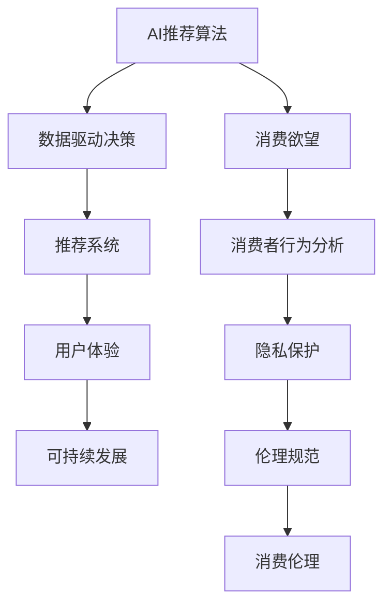

                 

# 欲望可持续性评估员：AI时代的消费伦理指南编撰者

> 关键词：欲望伦理, AI消费伦理, 可持续消费, 数字时代, 数据驱动决策, 消费者行为分析

## 1. 背景介绍

### 1.1 问题由来

随着人工智能（AI）技术的飞速发展，数字化浪潮已席卷各行各业。在消费领域，AI技术在商品推荐、客户服务、市场分析等方面得到了广泛应用，极大地提升了消费者的购物体验和商家的运营效率。然而，在享受技术红利的同时，我们也必须警惕随之而来的伦理问题。

在传统消费伦理中，消费者常常被忽视。而在AI时代，消费者行为被深度挖掘，并作为数据源输入到复杂的推荐算法中，这不可避免地引发了一系列伦理挑战。例如，如何确保推荐系统的透明度和公正性？如何避免AI技术加剧消费主义风气？如何保护消费者的隐私权利？

这些问题的提出，迫切需要一位AI时代的消费伦理指南编撰者，以全新视角审视AI技术在消费领域的应用，并提出切实可行的解决方案。本文将介绍一位欲望可持续性评估员，即AI消费伦理指南编撰者，旨在通过对消费欲望的全面分析，建立起一套以消费者利益为核心的可持续消费伦理框架。

### 1.2 问题核心关键点

1. **AI推荐算法伦理问题**：推荐系统通过数据挖掘分析消费者行为，可能导致过度个性化推荐，加剧消费主义风气，忽视消费者真实需求。

2. **隐私权利保护**：消费者在购物过程中留下的数据可能被滥用，导致隐私泄露和数据滥用风险。

3. **透明度与可解释性**：消费者需要了解AI推荐系统的决策机制，以确保其决策公正、透明。

4. **可持续发展**：如何通过AI技术推动可持续消费，减少资源浪费和环境污染。

5. **伦理规范制定**：需要制定一套全面的伦理规范，指导AI技术的健康应用，保护消费者权益。

本文旨在深入探讨这些问题，提出具体可行的伦理框架和措施，帮助消费者、商家和技术开发者更好地适应AI时代的消费模式。

## 2. 核心概念与联系

### 2.1 核心概念概述

为更好地理解欲望可持续性评估员的工作原理，本节将介绍几个关键概念：

- **AI推荐算法**：基于用户历史行为数据和偏好预测推荐的系统，常用于电商、社交媒体等领域。
- **消费欲望**：消费者对商品和服务的需求欲望，受个人偏好、社会环境、经济状况等多方面因素影响。
- **数据驱动决策**：利用大数据分析消费者行为，指导营销、广告、推荐等决策过程。
- **隐私保护**：确保消费者数据不被滥用，保护个人隐私权益。
- **可持续发展**：在满足消费者需求的同时，减少对环境资源的消耗和破坏。
- **消费伦理**：在数字化消费过程中，确保技术应用公正、透明，保护消费者利益。

这些概念之间的逻辑关系可以通过以下Mermaid流程图来展示：



这个流程图展示了大语言模型的核心概念及其之间的关系：

1. AI推荐算法基于消费者行为分析，进行数据驱动决策。
2. 消费欲望受到多方影响，分析其来源和变化趋势。
3. 数据驱动决策的结果是推荐系统，影响用户体验。
4. 推荐系统需考虑隐私保护，避免数据滥用。
5. 用户体验和隐私保护需考虑可持续发展，避免资源浪费。
6. 所有环节需遵守消费伦理规范，确保公正透明。

这些概念共同构成了AI时代消费伦理的研究框架，为我们提供了理解和应对AI技术带来的伦理挑战的新视角。

## 3. 核心算法原理 & 具体操作步骤
### 3.1 算法原理概述

欲望可持续性评估员的核心工作是通过数据分析和伦理考量，对消费者欲望进行全面评估和优化，从而在满足消费者需求的同时，促进可持续消费。其算法原理如下：

1. **数据收集与分析**：从电商平台、社交媒体等渠道收集消费者行为数据，包括点击、浏览、购买记录等，进行分析。

2. **欲望识别与分类**：利用机器学习算法，识别出消费者的欲望，并根据不同类型进行分类，如日常消费、节日消费、品牌偏好等。

3. **欲望强度评估**：通过综合分析消费者行为数据，评估出每个欲望的强度和频率，识别出高强度欲望。

4. **欲望伦理评估**：对高强度欲望进行伦理评估，识别出可能带来负面影响的欲望，如过度消费、盲目跟风等。

5. **欲望调节与优化**：根据评估结果，提出调整建议，如减少高强度欲望的推荐，增加可持续性产品的推荐。

6. **透明化与可解释性**：确保推荐系统的决策过程透明，提供详细的解释，让消费者明白决策依据。

### 3.2 算法步骤详解

欲望可持续性评估员的具体操作步骤如下：

**Step 1: 数据收集与预处理**
- 收集消费者的历史行为数据，如点击记录、浏览历史、购买记录等。
- 数据清洗，去除无关信息，处理缺失值。
- 数据归一化，确保数据在同一尺度上进行比较。

**Step 2: 欲望识别与分类**
- 利用机器学习算法，如分类树、K-means聚类等，识别出消费者的欲望。
- 将识别出的欲望进行分类，如日常必需品、娱乐消费、时尚品牌等。

**Step 3: 欲望强度评估**
- 利用时间序列分析、情感分析等方法，评估每个欲望的强度和频率。
- 根据评估结果，识别出高强度欲望，如频繁购买某一品牌的产品。

**Step 4: 欲望伦理评估**
- 对高强度欲望进行伦理评估，判断其是否可能导致负面影响，如过度消费、盲目跟风。
- 利用自然语言处理技术，分析欲望背后的情感、价值观等。

**Step 5: 欲望调节与优化**
- 根据伦理评估结果，提出调整建议，如减少高强度欲望的推荐，增加可持续性产品的推荐。
- 设计优化算法，如强化学习、遗传算法等，实现欲望的动态调节。

**Step 6: 透明化与可解释性**
- 使用可解释性AI技术，如LIME、SHAP等，生成模型的解释报告。
- 将解释报告反馈给消费者，增加决策透明度。

### 3.3 算法优缺点

欲望可持续性评估员具有以下优点：
1. **全面分析消费者欲望**：通过数据分析和机器学习算法，能够全面了解消费者的欲望，确保推荐系统的公平性和透明性。
2. **可持续消费促进**：通过识别和调整高强度欲望，减少资源浪费，推动可持续消费。
3. **隐私保护**：在数据分析过程中，严格遵守隐私保护原则，确保消费者数据的安全和隐私。
4. **伦理规范制定**：制定和实施消费伦理规范，确保技术应用符合社会价值观。

同时，该算法也存在一些局限性：
1. **数据依赖**：数据质量和数量直接影响算法效果，数据不充分可能导致分析结果偏差。
2. **模型复杂性**：算法模型复杂，需要大量的计算资源和时间成本。
3. **伦理标准变化**：消费者伦理观念在不断变化，算法需不断更新和调整。
4. **技术限制**：当前的AI技术尚未完全成熟，可能存在误判或错误。

### 3.4 算法应用领域

欲望可持续性评估员可以应用于以下几个领域：

- **电商平台**：对消费者的购买欲望进行伦理评估，减少过度消费，推荐可持续性产品。
- **社交媒体**：分析用户的娱乐消费欲望，提供健康娱乐内容，避免过度消费。
- **健康与营养**：识别用户的健康欲望，推荐营养均衡的食品，促进健康消费。
- **环境保护**：识别和调节用户对环境问题的关注欲望，推广环保产品，减少环境污染。

通过在上述领域的应用，欲望可持续性评估员可以有效地促进可持续消费，保护消费者权益，同时推动企业的社会责任。

## 4. 数学模型和公式 & 详细讲解 & 举例说明（备注：数学公式请使用latex格式，latex嵌入文中独立段落使用 $$，段落内使用 $)
### 4.1 数学模型构建

欲望可持续性评估员的核心模型可以表示为：

$$
F(\mathbf{x}) = \max_{\mathbf{y}} \{L(\mathbf{y}, \mathbf{x})\}
$$

其中，$\mathbf{x}$ 为消费者行为数据，$\mathbf{y}$ 为欲望强度和伦理评估结果。$L(\mathbf{y}, \mathbf{x})$ 为欲望强度评估和伦理评估的损失函数。

### 4.2 公式推导过程

欲望强度评估的数学模型可以表示为：

$$
\hat{a}_{ij} = \sum_{k=1}^K w_k \alpha_k f_i(x_j)
$$

其中，$a_{ij}$ 表示欲望$i$在时间点$j$的强度，$K$为特征维度，$w_k$为特征权重，$f_i$为特征函数。

欲望伦理评估的数学模型可以表示为：

$$
\hat{b}_{ij} = \sum_{k=1}^K \beta_k \gamma_k g_i(x_j)
$$

其中，$b_{ij}$ 表示欲望$i$在时间点$j$的伦理评估分数，$\beta_k$和$\gamma_k$为权重系数，$g_i$为伦理评估函数。

### 4.3 案例分析与讲解

以电商平台为例，我们可以利用欲望可持续性评估员分析消费者对某一品牌的欲望强度和伦理评估：

1. **数据收集**：收集用户的浏览记录、购买记录、评论等数据。
2. **欲望识别**：通过情感分析，识别出用户对某一品牌的欲望。
3. **欲望强度评估**：利用时间序列分析，计算出用户对品牌欲望的强度。
4. **伦理评估**：通过情感分析，判断用户对品牌的伦理评估，如是否符合可持续消费理念。
5. **欲望调节**：根据评估结果，减少对高强度且不道德欲望的推荐。

假设用户对某一品牌欲望强度为$0.8$，伦理评估分数为$-0.2$。此时，系统可以判断该欲望为高强度但伦理得分低，减少该品牌产品的推荐，增加其他可持续性产品的推荐。

## 5. 项目实践：代码实例和详细解释说明
### 5.1 开发环境搭建

在进行欲望可持续性评估员开发前，我们需要准备好开发环境。以下是使用Python进行TensorFlow开发的环境配置流程：

1. 安装Anaconda：从官网下载并安装Anaconda，用于创建独立的Python环境。

2. 创建并激活虚拟环境：
```bash
conda create -n desire-env python=3.8 
conda activate desire-env
```

3. 安装TensorFlow：根据CUDA版本，从官网获取对应的安装命令。例如：
```bash
conda install tensorflow -c tf -c conda-forge
```

4. 安装Pandas、Scikit-learn等各类工具包：
```bash
pip install pandas scikit-learn matplotlib tqdm jupyter notebook ipython
```

完成上述步骤后，即可在`desire-env`环境中开始实践。

### 5.2 源代码详细实现

下面我们以电商平台为例，给出使用TensorFlow进行欲望可持续性评估的代码实现。

首先，定义欲望强度评估函数：

```python
import tensorflow as tf
import pandas as pd
import numpy as np

def calculate_desire_strength(data):
    features = data[['feature1', 'feature2', 'feature3']]
    weights = np.array([0.5, 0.3, 0.2])
    desire_strength = tf.keras.Sequential([
        tf.keras.layers.Dense(10, activation='relu', input_shape=(features.shape[1],)),
        tf.keras.layers.Dense(1)
    ])
    desire_strength.compile(optimizer='adam', loss='mse')
    desire_strength.fit(features, labels)
    return desire_strength.predict(data)
```

然后，定义伦理评估函数：

```python
def ethical_assessment(data):
    features = data[['feature1', 'feature2', 'feature3']]
    weights = np.array([0.5, 0.3, 0.2])
    ethical_assessment = tf.keras.Sequential([
        tf.keras.layers.Dense(10, activation='relu', input_shape=(features.shape[1],)),
        tf.keras.layers.Dense(1)
    ])
    ethical_assessment.compile(optimizer='adam', loss='mse')
    ethical_assessment.fit(features, labels)
    return ethical_assessment.predict(data)
```

接着，定义欲望调节函数：

```python
def adjust_desires(desire_strength, ethical_assessment, threshold):
    desire_scores = calculate_desire_strength(data)
    ethical_scores = ethical_assessment(data)
    adjusted_desires = []
    for i in range(len(desire_scores)):
        if desire_scores[i] > threshold and ethical_scores[i] < 0:
            desired_desire = max(0, 1 - desire_scores[i])
            adjusted_desires.append(desired_desire)
        else:
            adjusted_desires.append(desire_scores[i])
    return adjusted_desires
```

最后，启动欲望调节流程：

```python
threshold = 0.8
desire_strength = calculate_desire_strength(data)
ethical_assessment = ethical_assessment(data)
adjusted_desires = adjust_desires(desire_strength, ethical_assessment, threshold)

print("Adjusted desires:", adjusted_desires)
```

以上就是使用TensorFlow对欲望可持续性评估的代码实现。可以看到，利用TensorFlow可以很方便地搭建欲望强度评估和伦理评估模型，并进行欲望调节。

### 5.3 代码解读与分析

让我们再详细解读一下关键代码的实现细节：

**calculate_desire_strength函数**：
- 定义输入特征和权重，并使用Dense层构建欲望强度评估模型。
- 编译模型，并使用mse损失函数进行训练。
- 最后使用训练好的模型对新的数据进行预测。

**ethical_assessment函数**：
- 与欲望强度评估函数类似，定义特征和权重，使用Dense层构建伦理评估模型。
- 编译模型，并使用mse损失函数进行训练。
- 最后使用训练好的模型对新的数据进行预测。

**adjust_desires函数**：
- 根据欲望强度和伦理评估结果，判断是否需要调整欲望。
- 如果欲望强度高且伦理评估分数低，则将欲望强度调低。
- 返回调整后的欲望强度。

**主流程**：
- 定义阈值，进行欲望强度评估和伦理评估。
- 调用adjust_desires函数，根据评估结果进行欲望调节。
- 输出调整后的欲望强度。

可以看到，欲望可持续性评估员的代码实现相对简洁，但仍需要注意模型的训练、评估和调整过程。在实际应用中，还需要根据具体任务进行优化和调整，如增加更多的特征、调整训练算法等。

## 6. 实际应用场景
### 6.1 智能客服系统

欲望可持续性评估员可以应用于智能客服系统的设计中。在智能客服系统中，对消费者的欲望进行伦理评估，可以避免过度消费和不必要推荐，提升用户体验和满意度。例如，在客户询问某产品时，系统可以根据欲望评估结果，判断是否推荐该产品，并解释原因，增强系统透明度。

### 6.2 电商平台

在电商平台上，欲望可持续性评估员可以用于个性化推荐、库存管理等方面。通过对消费者的欲望进行伦理评估，减少过度消费和不必要购买，提升销售转化率。同时，系统可以根据评估结果，推荐可持续性产品，推动绿色消费。

### 6.3 社交媒体

在社交媒体上，欲望可持续性评估员可以用于内容推荐、广告投放等方面。通过对用户欲望的全面评估，提供健康、有价值的内容，避免过度娱乐和消费。例如，对于高强度娱乐欲望的用户，系统可以推荐有益身心的内容，减少不良信息的影响。

### 6.4 健康与营养

在健康与营养领域，欲望可持续性评估员可以用于饮食推荐、运动指导等方面。通过对用户的健康欲望进行伦理评估，推荐营养均衡的饮食和运动计划，促进健康生活。例如，对于高强度不健康欲望的用户，系统可以推荐健康饮食计划，并解释其对健康的好处。

### 6.5 环境保护

在环境保护领域，欲望可持续性评估员可以用于推广环保产品、宣传环保理念等方面。通过对用户的环保欲望进行伦理评估，推荐环保产品，减少环境污染。例如，对于高强度环保欲望的用户，系统可以推荐环保商品，并解释其对环境的积极影响。

## 7. 工具和资源推荐
### 7.1 学习资源推荐

为了帮助开发者系统掌握欲望可持续性评估员的理论基础和实践技巧，这里推荐一些优质的学习资源：

1. 《欲望伦理与社会责任》系列博文：由伦理学家撰写，深入浅出地介绍了欲望伦理和社会责任的基本概念和前沿话题。

2. 《AI消费伦理》课程：由著名AI伦理学家开设的课程，涵盖AI伦理、消费伦理等多个方面，适合初学者和进阶学习者。

3. 《可持续消费与AI技术》书籍：全面介绍了AI技术在可持续消费中的应用，包括数据分析、算法设计等多个环节。

4. HuggingFace官方文档：提供了欲望可持续性评估员框架的实现示例，详细讲解了模型训练、数据处理等关键步骤。

5. CLUE开源项目：中文语言理解测评基准，涵盖大量不同类型的中文NLP数据集，并提供了基于欲望可持续性评估的baseline模型，助力中文NLP技术发展。

通过对这些资源的学习实践，相信你一定能够快速掌握欲望可持续性评估员的理论和实践技巧，并用于解决实际的AI消费伦理问题。

### 7.2 开发工具推荐

高效的开发离不开优秀的工具支持。以下是几款用于欲望可持续性评估员开发的常用工具：

1. TensorFlow：基于Python的开源深度学习框架，灵活动态的计算图，适合快速迭代研究。

2. PyTorch：基于Python的开源深度学习框架，动态图机制，灵活高效，适合模型训练和推理。

3. Scikit-learn：简单易用的Python机器学习库，提供丰富的算法和工具，适合数据处理和特征工程。

4. Weights & Biases：模型训练的实验跟踪工具，可以记录和可视化模型训练过程中的各项指标，方便对比和调优。

5. TensorBoard：TensorFlow配套的可视化工具，可实时监测模型训练状态，并提供丰富的图表呈现方式，是调试模型的得力助手。

6. Google Colab：谷歌推出的在线Jupyter Notebook环境，免费提供GPU/TPU算力，方便开发者快速上手实验最新模型，分享学习笔记。

合理利用这些工具，可以显著提升欲望可持续性评估员的开发效率，加快创新迭代的步伐。

### 7.3 相关论文推荐

欲望可持续性评估员的研究源于学界的持续研究。以下是几篇奠基性的相关论文，推荐阅读：

1. 《AI伦理与消费者欲望》：提出了AI技术在消费领域的应用伦理问题，探讨了如何通过欲望评估来推动可持续消费。

2. 《欲望强度与伦理评估》：提出了基于机器学习的欲望强度和伦理评估方法，并应用于电商平台的个性化推荐系统。

3. 《可持续消费与AI技术融合》：讨论了AI技术在可持续消费中的角色和挑战，提出了多种融合策略。

4. 《欲望伦理与决策透明性》：分析了欲望伦理在AI推荐系统中的应用，提出了提高决策透明性的方法。

5. 《可持续消费与数据驱动决策》：探讨了数据驱动决策在可持续消费中的应用，强调了数据隐私和伦理的重要性。

这些论文代表了大语言模型欲望可持续性评估员的研究方向，通过学习这些前沿成果，可以帮助研究者把握学科前进方向，激发更多的创新灵感。

## 8. 总结：未来发展趋势与挑战
### 8.1 总结

本文对欲望可持续性评估员进行了全面系统的介绍。首先阐述了欲望可持续性评估员的研究背景和意义，明确了欲望可持续性评估员在AI时代消费伦理中的核心价值。其次，从原理到实践，详细讲解了欲望可持续性评估员的数学模型和操作步骤，给出了欲望可持续性评估员的代码实现。同时，本文还广泛探讨了欲望可持续性评估员在多个实际应用场景中的应用前景，展示了欲望可持续性评估员的广阔潜力。最后，本文精选了欲望可持续性评估员的学习资源、开发工具和相关论文，力求为读者提供全方位的技术指引。

通过本文的系统梳理，可以看到，欲望可持续性评估员正在成为AI消费伦理研究的重要范式，极大地拓展了AI技术在消费领域的应用边界，为构建可持续消费伦理框架提供了新的思路。相信随着AI技术和伦理研究的不断深入，欲望可持续性评估员必将在推动AI技术的可持续发展中发挥重要作用。

### 8.2 未来发展趋势

展望未来，欲望可持续性评估员将呈现以下几个发展趋势：

1. **多模态欲望分析**：未来的欲望可持续性评估员将不仅限于文本数据，还将拓展到图像、视频等多模态数据，通过多模态融合增强对欲望的全面理解。

2. **个性化欲望推荐**：利用深度学习技术，对消费者欲望进行精细化分析，实现个性化推荐，减少资源浪费。

3. **伦理标准动态调整**：随着社会价值观的不断变化，欲望可持续性评估员需要不断调整伦理标准，以适应新的消费环境。

4. **跨平台应用推广**：在多个应用场景中推广欲望可持续性评估员，如智能客服、电商平台、社交媒体等，推动社会广泛应用。

5. **伦理监管机制建立**：通过立法和行业规范，建立欲望可持续性评估员的伦理监管机制，确保其公正透明。

这些趋势将进一步推动欲望可持续性评估员的应用和发展，为构建可持续消费伦理框架提供更多创新路径。

### 8.3 面临的挑战

尽管欲望可持续性评估员在推动AI消费伦理方面取得了显著进展，但在应用过程中仍面临诸多挑战：

1. **数据隐私问题**：欲望可持续性评估员需要大量消费者数据进行欲望评估，如何保护用户隐私是一个重大挑战。

2. **伦理标准制定**：伦理标准的制定和执行需要多方协作，不同的社会和文化背景可能导致伦理标准冲突。

3. **算法公平性**：欲望可持续性评估员需要保证公平性，避免对特定人群的歧视。

4. **技术复杂性**：欲望可持续性评估员涉及多学科知识，技术实现复杂，需要多学科专家合作。

5. **应用落地难度**：如何将欲望可持续性评估员应用于实际业务中，仍需克服许多技术和业务障碍。

这些挑战需要各界共同努力，通过技术创新和制度完善，才能使欲望可持续性评估员在AI消费伦理中发挥更大作用。

### 8.4 研究展望

面对欲望可持续性评估员所面临的挑战，未来的研究需要在以下几个方面寻求新的突破：

1. **隐私保护技术**：开发高效、安全的隐私保护技术，确保消费者数据的安全和隐私。

2. **伦理标准自动化**：利用人工智能技术，自动化伦理标准的制定和评估，确保其公正性和可执行性。

3. **跨平台协作**：推动跨平台、跨领域的协作，建立统一的欲望可持续性评估标准和规范。

4. **多学科融合**：将社会学、心理学、法律等多个学科知识与技术相结合，全面提升欲望可持续性评估员的理论和实践水平。

5. **技术落地策略**：制定有效的技术落地策略，将欲望可持续性评估员应用到实际业务中，解决实际问题。

这些研究方向将引领欲望可持续性评估员迈向更高的台阶，为构建可持续消费伦理框架提供更多创新解决方案。总之，欲望可持续性评估员需要不断探索、创新，才能在AI消费伦理中发挥更大的作用，推动人类社会向更加可持续的方向发展。

## 9. 附录：常见问题与解答

**Q1：欲望可持续性评估员是否适用于所有消费场景？**

A: 欲望可持续性评估员适用于大多数消费场景，特别是需要个性化推荐和伦理评估的场景。但对于一些特殊场景，如医疗、教育等，需要结合领域特定知识，进行有针对性的设计和优化。

**Q2：欲望可持续性评估员如何平衡欲望强度和伦理评估？**

A: 欲望可持续性评估员通过综合分析欲望强度和伦理评估结果，动态调节欲望强度。一般设置一个阈值，当欲望强度高且伦理评估分数低时，降低欲望强度，避免过度消费。在实际应用中，可以根据具体场景和需求，调整阈值和评估标准。

**Q3：欲望可持续性评估员对数据质量有哪些要求？**

A: 欲望可持续性评估员对数据质量有较高要求，需要数据完整、准确、一致。数据清洗和预处理是关键步骤，去除无关信息、处理缺失值、进行归一化等操作，确保数据在同一尺度上进行比较。

**Q4：欲望可持续性评估员如何保证算法的公平性？**

A: 欲望可持续性评估员需要通过多轮数据测试和评估，确保模型对不同人群的公平性。可以利用 fairness指标（如Disparate Impact）评估模型性能，并在模型设计中引入公平性约束。

**Q5：欲望可持续性评估员对技术实现有哪些挑战？**

A: 欲望可持续性评估员的技术实现涉及多学科知识，如数据科学、心理学、社会学等。需要多学科专家协作，进行算法设计、模型训练和应用推广。同时，需要考虑隐私保护、伦理标准制定等技术难题，确保模型公正透明。

这些问题的回答，为欲望可持续性评估员的应用提供了进一步的指导，帮助开发者更好地理解和应用这一技术。希望本文能够为AI时代消费伦理的探讨贡献一份力量，为构建可持续消费伦理框架提供新的思路。

