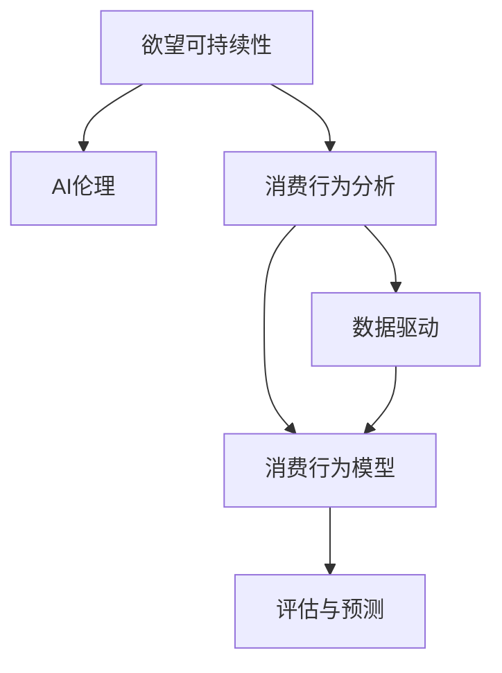

                 

# 欲望可持续性评估：AI时代的消费伦理标准

> 关键词：欲望可持续性, AI伦理, 消费行为分析, 数据驱动, 消费行为模型

## 1. 背景介绍

在当今科技飞速发展的时代，人工智能(AI)正以前所未有的速度改变着我们的生活。AI技术在带来便捷和效率的同时，也引发了一系列伦理和社会问题，尤其是与欲望和消费相关的伦理标准。本文将从欲望可持续性的角度，探讨AI在消费伦理领域的应用，为构建更加公平、透明、可持续的消费行为分析体系提供参考。

## 2. 核心概念与联系

### 2.1 核心概念概述

在讨论欲望可持续性评估时，我们涉及的几个关键概念包括：

- **欲望可持续性(Desire Sustainability)**：指消费者在满足自身需求的同时，能够长期持续地维持健康、理性的消费习惯，避免过度消费和资源浪费。
- **AI伦理(AI Ethics)**：涉及AI技术的开发、应用和评价，确保其在伦理和道德层面的合理性和安全性。
- **消费行为分析(Consumer Behavior Analysis)**：通过数据分析技术，理解和预测消费者行为模式，为市场决策和政策制定提供支持。
- **数据驱动(Data-Driven)**：利用大数据和AI技术，基于历史数据和实时数据进行决策和分析，提升消费行为预测的准确性和时效性。
- **消费行为模型(Consumer Behavior Model)**：使用数学和统计方法，构建模拟消费者行为的模型，预测未来消费趋势。

这些概念之间的关系可以概括为：利用AI伦理规范，构建基于数据驱动的消费行为模型，评估和预测消费者的欲望可持续性。

### 2.2 核心概念原理和架构的 Mermaid 流程图



## 3. 核心算法原理 & 具体操作步骤

### 3.1 算法原理概述

基于欲望可持续性的AI消费伦理评估，主要通过以下步骤实现：

1. **数据收集与预处理**：收集消费者的历史消费数据，如购买记录、浏览行为、社交媒体互动等，并对数据进行清洗和标准化。
2. **行为建模**：构建消费行为模型，预测消费者的未来购买意愿和行为模式。
3. **伦理评估**：应用AI伦理框架，评估模型和预测结果的公平性、透明度和安全性。
4. **可持续性评估**：结合消费行为模型的输出，评估消费者的欲望可持续性，包括消费水平、消费结构、时间分布等。
5. **反馈与调整**：根据评估结果，调整模型参数，优化算法流程，提升预测准确性和伦理合规性。

### 3.2 算法步骤详解

**步骤 1: 数据收集与预处理**

- 从电商平台、社交媒体、金融系统等渠道收集消费者的历史行为数据。
- 数据清洗：去除噪音数据、处理缺失值、归一化数据。
- 数据标准化：采用特征工程技术，提取和构建有意义的特征向量，如用户ID、消费金额、购买频率等。

**步骤 2: 行为建模**

- 选择适合的行为建模算法，如随机森林、神经网络、回归模型等。
- 使用历史数据训练模型，预测消费者未来的购买意愿和行为模式。
- 使用交叉验证和调参技术，优化模型性能。

**步骤 3: 伦理评估**

- 应用伦理评估框架，如公平性评估、透明度评估、安全性评估等，对模型进行伦理评估。
- 评估模型的预测结果是否存在偏见、歧视，是否过于复杂难以解释。
- 检查模型的输入输出是否透明，是否符合伦理规范。

**步骤 4: 可持续性评估**

- 根据行为模型的输出，结合伦理评估结果，综合评估消费者的欲望可持续性。
- 使用指标体系，如消费水平指数、健康指数、资源利用率等，量化评估消费者的欲望可持续性。
- 对高风险人群进行特别关注，提供个性化的消费指导和建议。

**步骤 5: 反馈与调整**

- 根据评估结果，调整行为模型和伦理评估框架，优化算法流程。
- 定期更新模型和数据，保持预测的准确性和时效性。
- 引入专家意见和用户反馈，不断完善评估体系。

### 3.3 算法优缺点

**优点**：

- **高效率**：利用AI技术，可以大幅提升数据处理和模型训练的效率，缩短预测周期。
- **精准性**：基于大数据和复杂算法，预测结果具有较高的准确性和可靠性。
- **全面性**：可以综合考虑多种因素，提供全面的消费行为分析和评估。

**缺点**：

- **数据依赖**：模型的性能和结果高度依赖于数据质量，数据缺失或不完整会影响预测准确性。
- **复杂性**：模型和评估框架复杂，需要专业知识才能理解和应用。
- **隐私问题**：收集和使用消费者数据涉及隐私保护，需要严格遵守相关法律法规。

### 3.4 算法应用领域

AI伦理评估在消费行为分析中的应用领域包括但不限于：

- **电商平台**：预测用户购买意愿，优化推荐算法，提升用户体验。
- **金融行业**：分析用户的借贷行为，评估风险，制定信贷政策。
- **健康管理**：评估用户的健康消费行为，提供个性化健康管理建议。
- **政策制定**：为政府制定消费引导政策和环境保护政策提供数据支持。
- **社会研究**：研究消费行为对社会经济和环境的影响，推动可持续消费。

## 4. 数学模型和公式 & 详细讲解 & 举例说明

### 4.1 数学模型构建

假设消费者的历史行为数据为 $\mathcal{D} = \{(x_i, y_i)\}_{i=1}^N$，其中 $x_i$ 为特征向量，$y_i$ 为消费行为标签。

目标构建一个回归模型 $\hat{y} = f(x; \theta)$，其中 $f(\cdot)$ 为模型函数，$\theta$ 为模型参数。

### 4.2 公式推导过程

以线性回归模型为例，推导预测函数：

$$
\hat{y} = w_0 + w_1x_1 + w_2x_2 + \cdots + w_kx_k
$$

其中 $w_i$ 为回归系数，$x_i$ 为特征变量。

通过最小二乘法，求解参数 $\theta$：

$$
\theta = \arg\min_{\theta} \sum_{i=1}^N (\hat{y}_i - y_i)^2
$$

### 4.3 案例分析与讲解

以电商平台用户购买行为预测为例，假设特征向量 $x$ 包括用户ID、历史购买金额、浏览次数等，标签 $y$ 为是否购买。

通过构建线性回归模型，训练模型并预测新用户的购买行为。使用交叉验证技术评估模型性能，并通过伦理框架评估预测结果的公平性和透明度。

## 5. 项目实践：代码实例和详细解释说明

### 5.1 开发环境搭建

在Python环境中搭建开发环境，需要以下步骤：

1. 安装Python 3.7及以上版本。
2. 安装必要的依赖库，如Pandas、NumPy、Scikit-learn、TensorFlow等。
3. 设置虚拟环境，确保代码的可复现性。

### 5.2 源代码详细实现

以下是一个基于TensorFlow构建的消费行为预测模型：

```python
import tensorflow as tf
from sklearn.model_selection import train_test_split

# 加载数据
def load_data():
    # 从数据库或文件读取数据
    # 假设数据集为pandas DataFrame
    data = pd.read_csv('consumer_data.csv')
    features = data[['ID', 'History', 'Browser', 'Time']]
    labels = data['Purchase']
    return features, labels

# 数据预处理
def preprocess_data(features, labels):
    features = pd.get_dummies(features)
    features = features.to_numpy()
    labels = labels.to_numpy()
    return features, labels

# 模型训练与预测
def train_model(features, labels, num_epochs=10):
    X_train, X_test, y_train, y_test = train_test_split(features, labels, test_size=0.2)
    model = tf.keras.Sequential([
        tf.keras.layers.Dense(32, activation='relu', input_shape=(X_train.shape[1],)),
        tf.keras.layers.Dense(1, activation='sigmoid')
    ])
    model.compile(optimizer='adam', loss='binary_crossentropy', metrics=['accuracy'])
    model.fit(X_train, y_train, epochs=num_epochs, batch_size=32, validation_data=(X_test, y_test))
    return model

# 模型评估与伦理评估
def evaluate_model(model, X_test, y_test):
    y_pred = model.predict(X_test)
    y_pred = (y_pred > 0.5).astype(int)
    accuracy = accuracy_score(y_test, y_pred)
    # 伦理评估部分，如公平性、透明度、安全性等
    return accuracy

# 使用示例
features, labels = load_data()
features, labels = preprocess_data(features, labels)
model = train_model(features, labels)
accuracy = evaluate_model(model, X_test, y_test)
print(f'模型准确率：{accuracy:.2f}')
```

### 5.3 代码解读与分析

**数据加载与预处理**：
- 使用Pandas读取CSV格式的数据集，包含用户ID、历史消费、浏览次数等特征。
- 使用`pd.get_dummies`函数将类别型特征转换为数值型特征。
- 将特征和标签转换为NumPy数组，方便TensorFlow模型使用。

**模型构建与训练**：
- 使用TensorFlow定义一个简单的神经网络模型，包括一个输入层、一个隐藏层和一个输出层。
- 使用`tf.keras.Sequential`创建模型，并编译模型。
- 使用`model.fit`方法训练模型，指定训练集、测试集、epoch数和batch size。
- 训练完成后，返回模型。

**模型评估与伦理评估**：
- 使用模型对测试集进行预测，并转换为0/1标签。
- 计算预测结果与真实标签的准确率。
- 进行伦理评估，如使用公平性指标评估模型预测的公平性。

**代码执行与结果展示**：
- 在Python环境中执行上述代码，输出模型准确率。
- 可视化和展示预测结果，评估模型的性能。

## 6. 实际应用场景

### 6.1 电商平台

在电商平台中，利用AI伦理评估预测用户购买行为，优化推荐算法，提高用户满意度。通过消费行为模型，分析用户偏好，实时调整推荐策略，提升转化率和客单价。

### 6.2 金融行业

金融机构可以使用AI伦理评估预测用户的借贷行为，评估信用风险，优化贷款审批流程。通过可持续性评估，识别高风险人群，制定个性化的风险管理策略。

### 6.3 健康管理

健康管理机构可以应用AI伦理评估预测用户的健康消费行为，评估健康风险，提供个性化的健康管理建议。通过可持续性评估，优化健康消费策略，提升用户健康水平。

### 6.4 政策制定

政府可以利用AI伦理评估预测消费者行为，制定合理的消费引导政策，推动可持续消费。通过行为模型和伦理框架，评估政策效果，优化政策设计。

### 6.5 社会研究

社会研究机构可以应用AI伦理评估分析消费行为对社会经济和环境的影响，推动可持续消费。通过行为模型和伦理框架，评估消费行为对社会公平和环境可持续性的影响。

## 7. 工具和资源推荐

### 7.1 学习资源推荐

1. **《AI伦理》系列文章**：涵盖AI伦理的基础理论、应用案例和前沿技术。
2. **《消费行为分析》书籍**：详细介绍消费行为模型和数据分析技术。
3. **《数据驱动的AI伦理》课程**：系统讲解数据驱动的AI伦理评估方法。
4. **AI伦理社区**：提供最新的AI伦理研究和应用案例，促进学术交流。
5. **开源AI伦理框架**：如TensorFlow Ethics、FairML等，提供伦理评估工具和算法。

### 7.2 开发工具推荐

1. **TensorFlow**：强大的深度学习框架，支持各种模型和算法，适合构建复杂的AI系统。
2. **Pandas**：强大的数据处理和分析库，支持大规模数据集处理。
3. **NumPy**：高效的数值计算库，适合矩阵运算和科学计算。
4. **Scikit-learn**：常用的机器学习库，提供多种算法和模型。
5. **Jupyter Notebook**：交互式的代码编辑器，支持代码执行和可视化。

### 7.3 相关论文推荐

1. **《AI伦理在消费行为分析中的应用》**：探讨AI伦理在消费行为分析中的具体应用，如公平性评估、透明度评估等。
2. **《数据驱动的消费行为预测》**：介绍数据驱动的消费行为预测方法和技术。
3. **《可持续消费的AI评估》**：研究AI伦理评估在可持续消费中的应用，如环境影响评估等。
4. **《消费行为模型的公平性与透明性》**：探讨消费行为模型的公平性和透明性，提出优化方法。
5. **《数据隐私与伦理评估》**：讨论数据隐私和伦理评估在AI系统中的应用，提出解决方案。

## 8. 总结：未来发展趋势与挑战

### 8.1 研究成果总结

本文从欲望可持续性的角度，探讨了AI在消费伦理领域的应用，包括数据收集与预处理、行为建模、伦理评估、可持续性评估等步骤。通过实际案例分析，展示了AI伦理评估在消费行为分析中的广泛应用。

### 8.2 未来发展趋势

未来，AI伦理评估在消费行为分析中将呈现以下几个发展趋势：

1. **多模态数据融合**：结合图像、语音、文本等多种数据，提升消费行为预测的准确性和全面性。
2. **跨领域应用拓展**：扩展到更多领域，如社交媒体、公共服务、智能家居等。
3. **动态实时评估**：通过实时数据流分析，提供动态、实时的消费行为评估和建议。
4. **隐私保护与合规**：加强隐私保护和数据合规，确保数据安全和使用合法性。
5. **人机协同决策**：结合专家知识和用户反馈，提升决策的透明度和可解释性。

### 8.3 面临的挑战

尽管AI伦理评估在消费行为分析中取得了一定的进展，但仍面临以下挑战：

1. **数据质量与隐私**：数据质量和隐私保护是AI伦理评估的重大挑战，需要解决数据缺失、数据隐私等问题。
2. **模型公平性与透明性**：模型可能存在偏见、歧视，如何保证模型的公平性和透明性是重要的研究课题。
3. **伦理与法律规范**：AI伦理评估需要符合伦理和法律规范，确保应用合法性和社会责任。
4. **计算资源与效率**：大规模数据集和复杂模型需要大量计算资源，如何优化计算效率和成本是实际应用的关键。
5. **模型可解释性**：AI伦理评估模型需要具有可解释性，用户能够理解模型的决策逻辑和预测结果。

### 8.4 研究展望

未来，AI伦理评估在消费行为分析中需要进一步研究：

1. **数据增强与合成**：通过数据增强和合成技术，提升数据质量和样本多样性。
2. **多任务学习**：结合多个任务，提升模型的多领域适用性。
3. **因果推断**：应用因果推断方法，分析因果关系和影响机制，提升模型的预测能力。
4. **伦理自动化**：开发自动化的伦理评估工具，减轻人工负担，提高评估效率。
5. **伦理教育与普及**：加强AI伦理教育，提升用户和开发者对伦理评估的认知和应用能力。

## 9. 附录：常见问题与解答

### Q1: AI伦理评估在消费行为分析中的具体应用有哪些？

**A**：AI伦理评估在消费行为分析中的应用包括但不限于：

1. **购买意愿预测**：利用AI预测用户的购买意愿，优化推荐算法，提高用户体验。
2. **信用评估**：分析用户的借贷行为，评估信用风险，优化贷款审批流程。
3. **健康风险评估**：预测用户的健康消费行为，评估健康风险，提供个性化的健康管理建议。
4. **政策制定**：评估政策效果，优化政策设计，推动可持续消费。
5. **社会影响分析**：分析消费行为对社会公平和环境可持续性的影响。

### Q2: AI伦理评估在实际应用中需要注意哪些问题？

**A**：AI伦理评估在实际应用中需要注意以下问题：

1. **数据隐私保护**：确保数据收集和使用符合法律法规，保护用户隐私。
2. **模型公平性**：评估模型是否存在偏见、歧视，确保模型公平性。
3. **透明性与可解释性**：提供透明的决策过程和可解释的预测结果，增强用户信任。
4. **伦理合规性**：符合伦理和法律规范，确保应用合法性和社会责任。
5. **动态实时性**：利用实时数据流分析，提供动态、实时的消费行为评估和建议。

### Q3: 如何提升AI伦理评估在消费行为分析中的预测准确性？

**A**：提升AI伦理评估在消费行为分析中的预测准确性，可以从以下几个方面入手：

1. **数据质量提升**：收集高质量、多样化的数据，使用数据增强和合成技术，提升数据质量和样本多样性。
2. **模型优化**：选择合适的模型和算法，进行调参和优化，提高模型性能。
3. **特征工程**：设计有意义的特征向量，提取和构建有效的特征，提升模型预测能力。
4. **模型集成**：结合多个模型的预测结果，使用集成学习技术，提升预测准确性。
5. **多模态数据融合**：结合图像、语音、文本等多种数据，提升预测的全面性和准确性。

### Q4: AI伦理评估在消费行为分析中如何保护用户隐私？

**A**：AI伦理评估在消费行为分析中保护用户隐私，可以采取以下措施：

1. **数据匿名化**：使用数据匿名化技术，去除或伪装用户的敏感信息。
2. **访问控制**：采用严格的访问控制措施，确保数据仅在必要情况下访问和使用。
3. **加密存储**：使用加密技术存储和传输数据，防止数据泄露和篡改。
4. **合规性检查**：确保数据收集和使用符合相关法律法规，如GDPR、CCPA等。
5. **用户同意**：在数据收集和使用前，获取用户明确同意，确保用户知情权和选择权。

**作者：禅与计算机程序设计艺术 / Zen and the Art of Computer Programming**

