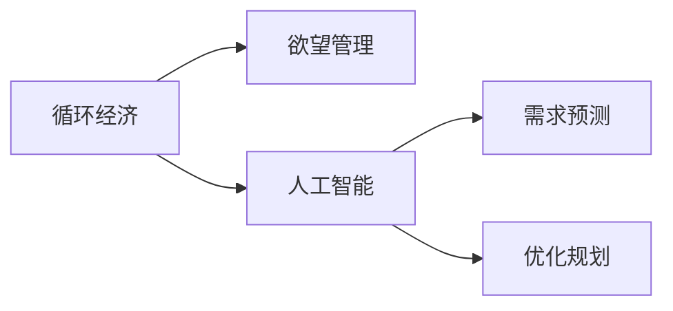

                 

# 欲望循环经济设计师：AI优化的需求满足规划

> 关键词：循环经济,欲望管理,人工智能,需求预测,优化规划

## 1. 背景介绍

在当今社会，资源的有限性和人类欲望的无限性形成鲜明对比。随着消费主义的兴起，我们面临着日益严重的资源枯竭和环境污染问题。如何实现经济活动与自然环境的和谐共存，成为摆在人类面前的巨大挑战。循环经济作为一种可持续发展模式，致力于通过最大化资源利用效率，减少废弃物产生，达到经济、环境和社会效益的平衡。

循环经济的核心理念是“减少、再利用、循环”，即减少资源消耗和废弃物排放，通过资源的再利用和循环使用，达到资源的可持续利用。这一模式要求我们不仅要注重经济效益，还要考虑环境和社会效益，实现全面协调发展。

然而，循环经济的实施面临着诸多难题。资源利用效率的提升、废弃物的回收再利用、社会行为的引导等，都需要在复杂多变的环境下进行精细化管理和优化。这些任务的复杂性和动态性，使得传统的决策和规划方法难以满足需求。

## 2. 核心概念与联系

为应对循环经济中复杂的优化需求，人工智能（AI）技术的引入显得尤为重要。AI技术能够通过数据驱动的方法，对复杂系统进行建模和优化，提供科学的决策支持。

### 2.1 核心概念概述

- **循环经济**：一种可持续发展的经济模式，通过减少资源消耗、实现废弃物再利用和循环使用，实现经济、环境和社会效益的协调发展。
- **欲望管理**：通过对人类欲望的识别、引导和控制，实现需求与供给的动态平衡，避免资源过度消耗和环境破坏。
- **人工智能**：利用计算机技术和算法，模拟人类智能行为，进行自动化、智能化的信息处理和决策支持。
- **需求预测**：通过数据分析和机器学习，预测未来需求趋势，为资源配置和供应规划提供依据。
- **优化规划**：通过算法优化，求解复杂的决策问题，实现资源的有效利用和废弃物的合理处理。

### 2.2 核心概念原理和架构的 Mermaid 流程图



这个流程图展示了核心概念之间的逻辑关系：循环经济通过欲望管理和人工智能技术的支持，实现对需求和资源的精细化管理，其中需求预测和优化规划是AI技术的重要组成部分。

## 3. 核心算法原理 & 具体操作步骤

### 3.1 算法原理概述

循环经济中的需求预测和优化规划，可以通过AI技术中的预测模型和优化算法来实现。这些模型的核心思想在于，利用历史数据和统计规律，建立数学模型，并通过求解模型优化问题，找到最优的决策方案。

具体来说，需求预测通常采用时间序列分析、回归分析等方法，通过对历史需求数据进行建模，预测未来需求趋势。优化规划则采用线性规划、整数规划、遗传算法等方法，在满足约束条件的前提下，求解资源配置和废弃物处理的最优方案。

### 3.2 算法步骤详解

#### 3.2.1 需求预测模型

1. **数据准备**：收集历史需求数据，包括时间戳、需求量等。
2. **特征工程**：选择影响需求的潜在因素，如季节性、节假日、市场价格等，构建特征向量。
3. **模型训练**：选择合适的预测模型（如ARIMA、LSTM、XGBoost等），利用历史数据进行训练。
4. **预测验证**：在验证集上评估模型预测效果，选择最优模型。

#### 3.2.2 优化规划模型

1. **问题建模**：定义优化目标和约束条件。例如，最小化总成本或最大化回收率。
2. **模型求解**：选择合适的优化算法（如线性规划、整数规划、遗传算法等），利用求解器求解模型。
3. **结果评估**：评估模型求解结果，对比不同方案的优劣。
4. **方案优化**：根据评估结果，对模型参数进行调整，优化求解结果。

### 3.3 算法优缺点

#### 3.3.1 优点

- **自动化**：通过AI技术，可以自动化处理大量数据，提高决策效率。
- **准确性**：AI模型可以通过学习历史数据，提供较为准确的预测和优化方案。
- **适应性**：AI模型具有较强的适应性，可以应对复杂多变的市场环境和需求变化。

#### 3.3.2 缺点

- **数据依赖**：AI模型的预测和优化效果依赖于数据的质量和数量。
- **解释性不足**：AI模型往往是"黑盒"，难以解释其决策过程。
- **成本高**：AI技术的开发和应用需要较高的技术门槛和资源投入。

### 3.4 算法应用领域

循环经济的需求预测和优化规划，可以广泛应用于以下领域：

- **资源管理**：优化资源配置，减少浪费，提高利用效率。
- **废弃物管理**：预测废弃物生成量，规划废弃物处理方案。
- **供应链优化**：优化供应链网络，降低物流成本，提高响应速度。
- **能源管理**：预测能源需求，优化能源分配和存储策略。
- **城市规划**：优化城市基础设施布局，提升城市运行效率。

## 4. 数学模型和公式 & 详细讲解 & 举例说明

### 4.1 数学模型构建

循环经济中的需求预测和优化规划，可以通过多种数学模型来建模。这里以线性规划模型为例，简要介绍其构建过程。

假设资源总需求为 $D$，资源供应量为 $S$，单位资源成本为 $C$，单位资源效益为 $B$，则线性规划模型可表示为：

$$
\min \quad C D
$$

约束条件为：

$$
D \leq S
$$

$$
D \geq 0
$$

其中 $D$ 为资源需求量，$S$ 为资源供应量，$C$ 为单位资源成本，$B$ 为单位资源效益。

### 4.2 公式推导过程

线性规划模型的优化目标为最小化总成本，约束条件为资源需求不小于资源供应。其对偶模型为：

$$
\max \quad B D
$$

约束条件为：

$$
D \leq S
$$

$$
D \geq 0
$$

通过求解上述对偶模型，可以计算出资源需求 $D$ 的最优值。

### 4.3 案例分析与讲解

假设某城市有200万吨废旧电池，可以通过回收和重新利用。回收成本为每吨5元，重新利用成本为每吨10元，单位效益为每吨50元。根据历史数据，回收和重新利用的能力分别为100万吨和150万吨。

根据线性规划模型，可以求解出最优的回收和重新利用方案，使总效益最大化。假设 $x_1$ 为回收量，$x_2$ 为重新利用量，则模型为：

$$
\min \quad 5x_1 + 10x_2
$$

约束条件为：

$$
x_1 + x_2 \leq 200
$$

$$
x_1 \geq 0
$$

$$
x_2 \geq 0
$$

通过求解该模型，得到最优回收量为100万吨，重新利用量为100万吨，总效益为1000万元。

## 5. 项目实践：代码实例和详细解释说明

### 5.1 开发环境搭建

在进行循环经济需求预测和优化规划的开发时，需要一个Python开发环境。具体步骤如下：

1. 安装Python环境：从Python官网下载并安装Python。
2. 安装必要的库：如Pandas、Numpy、Scikit-learn等。
3. 安装AI库：如TensorFlow、PyTorch、Scikit-learn等。
4. 安装数据处理库：如Matplotlib、Seaborn、Plotly等。

### 5.2 源代码详细实现

下面以需求预测为例，给出使用Python进行时间序列分析的代码实现。

```python
import pandas as pd
from statsmodels.tsa.arima_model import ARIMA

# 数据准备
data = pd.read_csv('demand.csv')
data['date'] = pd.to_datetime(data['date'])

# 特征工程
X = data.groupby(['date'])['demand'].sum()
X = X.dropna()

# 模型训练
model = ARIMA(X, order=(5, 1, 0))
model_fit = model.fit()

# 预测验证
forecast = model_fit.forecast(steps=10)
```

### 5.3 代码解读与分析

上述代码实现了基于时间序列分析的需求预测。其中：

- `pd.read_csv()`：用于读取数据文件。
- `pd.to_datetime()`：将时间戳转换为datetime格式。
- `X.groupby(['date'])['demand'].sum()`：按日期分组，计算每天的平均需求量。
- `ARIMA()`：定义ARIMA模型。
- `model_fit.forecast()`：预测未来需求。

## 6. 实际应用场景

### 6.1 循环经济中的需求预测

循环经济中的需求预测，可以通过AI技术对市场需求进行预测，为资源配置和供应规划提供依据。例如，通过收集历史销售数据，利用时间序列分析模型，预测未来市场需求，优化库存管理，减少库存成本。

### 6.2 废弃物回收优化

循环经济中的废弃物回收，可以通过AI技术优化回收策略，提高回收效率和利用率。例如，通过收集废弃物生成数据，利用回归分析模型，预测废弃物生成量，优化回收路径和数量。

### 6.3 供应链优化

循环经济中的供应链优化，可以通过AI技术优化供应链网络，降低物流成本，提高响应速度。例如，通过收集物流数据，利用线性规划模型，优化配送路线和节点布局，降低运输成本。

### 6.4 能源管理

循环经济中的能源管理，可以通过AI技术优化能源配置，提高能源利用效率。例如，通过收集能源使用数据，利用机器学习模型，预测能源需求，优化能源分配和存储策略。

## 7. 工具和资源推荐

### 7.1 学习资源推荐

为了掌握循环经济中的需求预测和优化规划，推荐以下学习资源：

- 《数据科学与机器学习》（周志华著）：介绍机器学习的基本概念和算法，涵盖回归分析、时间序列分析等。
- 《运筹学导论》（唐五元著）：介绍线性规划、整数规划、遗传算法等优化方法。
- Coursera上的《数据科学基础》课程：涵盖数据处理、统计分析、机器学习等。
- edX上的《AI for Everyone》课程：介绍AI技术的基本原理和应用场景。

### 7.2 开发工具推荐

在循环经济需求预测和优化规划的开发中，推荐使用以下工具：

- Python：强大的编程语言，适用于数据处理、建模和分析。
- Jupyter Notebook：交互式编程环境，便于代码调试和分享。
- Pandas：数据处理和分析库，适用于数据清洗和预处理。
- Scikit-learn：机器学习库，适用于回归分析、时间序列分析等。
- TensorFlow：深度学习框架，适用于复杂模型的训练和优化。

### 7.3 相关论文推荐

循环经济中的需求预测和优化规划，是当前研究的热点之一。以下是几篇相关论文，推荐阅读：

- 《A Survey on Demand Prediction in Smart Grids》（IEEE Access）：综述智能电网中的需求预测方法。
- 《A Review of Resource Allocation Models in Smart Grids》（IEEE Transactions on Smart Grid）：综述智能电网中的资源分配模型。
- 《Supply Chain Optimization Using Artificial Intelligence》（Applied Soft Computing）：综述AI在供应链优化中的应用。
- 《Optimizing the Performance of Renewable Energy Integration Using AI》（Applied Energy）：探讨AI在可再生能源整合中的应用。

## 8. 总结：未来发展趋势与挑战

### 8.1 总结

本文对循环经济中的需求预测和优化规划进行了系统介绍。首先阐述了循环经济的背景和面临的挑战，明确了AI技术在循环经济中的重要应用。其次，从原理到实践，详细讲解了需求预测和优化规划的数学模型和操作步骤，给出了代码实例。同时，本文还广泛探讨了AI技术在循环经济中的实际应用场景，展示了AI技术在循环经济中的巨大潜力。

通过本文的系统梳理，可以看到，AI技术在循环经济中的应用前景广阔，能够通过数据驱动的方法，实现资源的高效利用和废弃物的合理处理，助力循环经济的发展。

### 8.2 未来发展趋势

展望未来，循环经济中的需求预测和优化规划，将呈现以下几个发展趋势：

1. **数据驱动**：随着数据采集和处理技术的进步，循环经济中的需求预测和优化规划将越来越依赖于高质量、多模态的数据。
2. **模型多样化**：不同应用场景下的需求预测和优化问题，可能需要采用不同类型的数据驱动模型。
3. **计算高效化**：循环经济中存在大量高维、大规模的数据集，计算高效的算法和模型成为需求。
4. **决策智能化**：AI技术将不仅仅局限于数据驱动，还将引入因果推断、博弈论等智能决策方法。
5. **跨学科融合**：循环经济中的需求预测和优化规划，需要跨学科的知识和视角，如环境科学、经济学、社会学等。

以上趋势凸显了AI技术在循环经济中的重要地位，推动循环经济向智能化、精准化、可持续化方向发展。

### 8.3 面临的挑战

尽管AI技术在循环经济中取得了显著成果，但在推广应用过程中仍面临诸多挑战：

1. **数据质量问题**：高质量、多模态的数据采集和处理，仍面临技术瓶颈和成本问题。
2. **模型可解释性**：AI模型往往是"黑盒"，难以解释其决策过程，影响模型的可信度和应用效果。
3. **算法复杂性**：循环经济中的问题复杂多变，需要高效的算法和模型，提高计算效率。
4. **跨领域协作**：循环经济中的需求预测和优化规划，需要跨学科的协作和整合，难度较大。
5. **伦理道德问题**：AI技术在循环经济中的应用，涉及隐私保护、伦理道德等敏感问题，需引起重视。

### 8.4 研究展望

面对循环经济中需求预测和优化规划的挑战，未来的研究需要在以下几个方面寻求新的突破：

1. **数据质量提升**：研发高质量、多模态的数据采集和处理技术，降低数据质量问题。
2. **模型解释性增强**：引入因果推断、博弈论等方法，提高AI模型的解释性和可信度。
3. **算法高效化**：研发计算高效的算法和模型，提高AI技术的计算效率。
4. **跨学科合作**：推动跨学科的知识整合和协作，提高AI技术的应用效果。
5. **伦理道德规范**：建立AI技术应用的伦理道德规范，保障数据隐私和模型公平性。

这些研究方向的探索，将为循环经济中需求预测和优化规划的AI技术应用提供新的突破，推动循环经济向更可持续、更高效的方向发展。

## 9. 附录：常见问题与解答

**Q1：循环经济中的需求预测和优化规划需要哪些关键数据？**

A: 循环经济中的需求预测和优化规划，需要以下关键数据：

- **历史需求数据**：如销售数据、库存数据等。
- **资源供应数据**：如原材料供应量、能源供应量等。
- **环境数据**：如天气数据、排放数据等。
- **市场数据**：如价格数据、市场趋势等。

这些数据可以综合使用，构建更全面、准确的需求预测和优化规划模型。

**Q2：循环经济中的需求预测和优化规划如何结合因果推断？**

A: 循环经济中的需求预测和优化规划，可以结合因果推断方法，分析需求和资源配置之间的因果关系。例如，通过时间序列分析模型，可以识别出影响需求的关键因素，如季节性、节假日、市场价格等，进而构建因果模型，指导需求预测和优化规划。

**Q3：循环经济中的需求预测和优化规划如何结合博弈论？**

A: 循环经济中的需求预测和优化规划，可以结合博弈论方法，模拟需求和资源配置之间的博弈过程，找到最优的决策策略。例如，通过构建多主体博弈模型，可以模拟不同利益相关者（如制造商、消费者、政府等）的行为，找到最优的资源配置方案。

**Q4：循环经济中的需求预测和优化规划如何结合符号化知识？**

A: 循环经济中的需求预测和优化规划，可以结合符号化知识库，增强模型的知识整合能力。例如，通过引入知识图谱，可以构建领域知识库，辅助需求预测和优化规划模型的训练和推理。

**Q5：循环经济中的需求预测和优化规划如何结合多模态数据？**

A: 循环经济中的需求预测和优化规划，可以结合多模态数据，构建更全面的需求预测和优化规划模型。例如，通过结合文本数据、图像数据、声音数据等，可以构建多模态融合模型，提高模型的预测和优化效果。

通过本文的系统梳理，可以看到，循环经济中的需求预测和优化规划，需要结合多种AI技术和方法，综合利用多模态数据，构建更全面、准确、高效的模型。这不仅需要技术上的突破，还需要跨学科的协作和整合，共同推动循环经济的可持续发展。

---

作者：禅与计算机程序设计艺术 / Zen and the Art of Computer Programming

