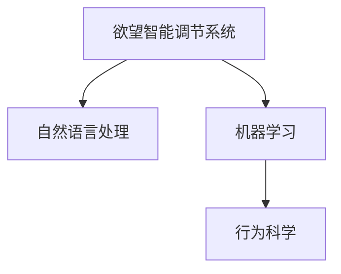

                 

# 欲望智能调节系统：AI辅助的自我管理平台

在数字化时代的浪潮中，人类社会的诸多领域正快速迈向智能化。其中，欲望智能调节系统（Desire Intelligence Regulator, DIR）作为一种新兴的AI辅助自我管理平台，正逐渐受到各界的关注。本文将深入探讨DIR的核心概念、算法原理与操作步骤，并通过数学模型与代码实例对其功能进行详细讲解，进一步分析其在现实中的应用场景与未来发展趋势。

## 1. 背景介绍

### 1.1 问题由来
现代生活节奏加快，信息爆炸，物质丰富，诱惑增多。人们不仅面临复杂的人际关系和职业压力，还常需应对各种诱惑，如社交媒体、娱乐、消费等。如何在纷扰的现实世界中保持自我，实现目标，成为了一个重要的课题。传统的心理调节方法，如冥想、运动、读书等，受时间、空间和个体的限制，难以满足现代社会的需求。而欲望智能调节系统，通过结合人工智能技术，为自我管理提供了全新的解决方案。

### 1.2 问题核心关键点
DIR的核心思想是通过AI技术，实现对个体欲望的智能识别、分析和调节。其工作原理与原则如下：

- **欲望识别**：利用自然语言处理技术，分析和理解个体的内心欲望，如消费欲望、社交欲望、学习欲望等。
- **欲望分析**：通过机器学习算法，对欲望进行情感分析和行为预测，为自我调节提供数据支持。
- **欲望调节**：基于欲望分析结果，采用个性化建议、行为干预等手段，引导个体实现自我管理。

## 2. 核心概念与联系

### 2.1 核心概念概述

为更好地理解DIR的运行机制，本节将介绍几个关键概念：

- **欲望智能调节系统**：一种利用AI技术，对个体欲望进行识别、分析和调节的系统。其通过自然语言处理、机器学习和行为科学，帮助用户更好地管理内心欲望，实现自我控制和目标达成。
- **自然语言处理(NLP)**：一种使计算机能够理解、解释和生成人类语言的技术，常用于欲望识别的文本分析。
- **机器学习(ML)**：一种通过算法和统计模型让计算机具备学习能力的科学，常用于欲望分析和行为预测。
- **行为科学**：研究个体或群体行为规律及其影响因素的学科，常用于欲望调节的行为干预。

这些概念之间的联系通过以下Mermaid流程图来展示：



这个流程图展示了大语言模型的核心概念及其之间的关系：

1. DIR系统通过自然语言处理技术，识别和理解用户的欲望。
2. 利用机器学习算法，对欲望进行情感分析和行为预测。
3. 行为科学理论指导行为干预，帮助用户达成目标。

## 3. 核心算法原理 & 具体操作步骤

### 3.1 算法原理概述

DIR系统的算法原理基于行为科学的理论，结合了自然语言处理和机器学习技术。其核心思想是通过对个体欲望的识别和分析，采用个性化建议、行为干预等手段，引导个体实现自我管理。

形式化地，假设用户的欲望为 $D$，包含若干项 $d_i$，$i=1,2,\ldots,n$，每项欲望 $d_i$ 都可以表示为一个由情感状态 $s$ 和行为倾向 $b$ 组成的向量：

$$
d_i = (s_i, b_i)
$$

其中 $s_i$ 表示欲望 $d_i$ 的情感状态，$b_i$ 表示欲望 $d_i$ 的行为倾向。DIR系统的目标是最大化用户的整体福祉 $W$，通过调节每项欲望 $d_i$ 的情感状态 $s_i$ 和行为倾向 $b_i$，使得用户的幸福度最大化。

### 3.2 算法步骤详解

DIR系统的算法步骤包括以下几个关键环节：

**Step 1: 欲望识别**
- 收集用户的生活记录和社交媒体数据，包括日志、评论、图片等，作为情感识别的数据源。
- 使用自然语言处理技术对数据进行情感分析，提取情感状态 $s$。
- 对每项欲望的情感状态 $s_i$ 进行打分，计算欲望强度 $w_i = \frac{1}{n} \sum_{j=1}^n s_j$。

**Step 2: 欲望分析**
- 对用户的社交网络进行行为分析，评估每项欲望 $d_i$ 的行为倾向 $b_i$。
- 利用机器学习算法，如分类、回归等，对每项欲望的行为倾向 $b_i$ 进行预测。
- 根据行为倾向 $b_i$，对欲望强度 $w_i$ 进行调整，得到新的欲望强度 $w_i'$。

**Step 3: 欲望调节**
- 根据欲望强度 $w_i'$ 进行行为干预，如提示、提醒、限制等。
- 通过行为科学理论，设计干预措施，引导用户调整情感状态 $s_i$。
- 周期性评估干预效果，根据反馈进行调整优化。

**Step 4: 自我反馈**
- 用户定期反馈干预效果，提供真实世界中的反馈数据。
- 将反馈数据用于模型更新，优化欲望识别、分析和调节算法。

### 3.3 算法优缺点

DIR系统的优点包括：

- **个性化**：通过个性化分析， DIR 可以针对用户的具体欲望进行精准干预，提升自我管理效果。
- **实时性**：结合机器学习算法， DIR 能够实时监测和调节用户的欲望状态，实现动态管理。
- **数据驱动**：利用数据驱动决策， DIR 能够持续优化算法，提升自我管理的科学性。

但系统也存在一些局限：

- **隐私保护**：系统需要收集大量个人数据，隐私保护成为一大挑战。
- **模型局限**：欲望的复杂性和多样性可能导致模型泛化能力不足，无法全面覆盖所有情况。
- **用户依赖**：系统依赖用户的真实反馈，用户参与度不高可能导致模型失效。

### 3.4 算法应用领域

DIR系统广泛应用于各类场景，通过欲望识别、分析和调节，帮助用户实现自我管理：

- **健康管理**：帮助用户控制饮食、运动等，避免过度消费，保持身体健康。
- **财务管理**：通过欲望调节，帮助用户控制消费欲望，实现理财目标。
- **学习管理**：针对学习欲望，提供个性化学习计划和资源，提升学习效率。
- **时间管理**：调节时间管理欲望，帮助用户高效安排日常事务，提升生产效率。
- **社交管理**：识别社交欲望，调节社交行为，避免过度社交对个人生活的负面影响。

## 4. 数学模型和公式 & 详细讲解 & 举例说明

### 4.1 数学模型构建

DIR系统的数学模型基于欲望强度 $w_i$ 和行为倾向 $b_i$ 的表示，通过欲望识别和分析，得到用户的欲望强度分布 $P(w)$，利用行为科学理论，设计干预措施 $I_i$。整体优化模型可表示为：

$$
\max_{I} \sum_{i=1}^n w_i'(s_i, I_i) - c(I_i)
$$

其中 $c(I_i)$ 表示干预措施 $I_i$ 的成本，$w_i'$ 表示调节后的欲望强度，$I_i$ 表示干预措施。

### 4.2 公式推导过程

**欲望识别**

欲望识别过程通过自然语言处理技术对文本进行情感分析，得到欲望强度 $w_i$。情感分析常用方法包括词袋模型、TF-IDF、情感词典等。例如，使用情感词典对社交媒体上的评论进行分析：

$$
s_i = \sum_{j=1}^m \omega_j \cdot w_j
$$

其中 $w_j$ 表示词语 $j$ 的情感得分，$\omega_j$ 表示词语 $j$ 在文本中的权重。

**欲望分析**

欲望分析过程中，利用机器学习算法对欲望的行为倾向 $b_i$ 进行预测。常用的算法包括分类算法、回归算法、序列预测算法等。例如，使用随机森林算法预测用户购物欲望的行为倾向：

$$
b_i = f(X_i, Y_i)
$$

其中 $X_i$ 表示输入特征向量，$Y_i$ 表示标签向量。

**欲望调节**

欲望调节过程通过行为科学理论，设计干预措施 $I_i$，调节欲望强度 $w_i'$。常用的干预措施包括提示、提醒、限制等。例如，针对用户的购物欲望，可以设计提醒措施：

$$
I_i = f(w_i', t_i)
$$

其中 $t_i$ 表示时间节点，$f$ 表示干预策略。

### 4.3 案例分析与讲解

**案例1：健康管理**

假设某用户每日进食欲望 $d_1$ 的情感状态为 $s_1=0.8$，行为倾向为 $b_1=0.7$，饮食欲望强度为 $w_1=0.5$。利用自然语言处理技术，对用户的日志进行分析，得到情感状态 $s_1=0.7$，行为倾向 $b_1=0.8$。使用回归算法对行为倾向 $b_1$ 进行预测，得到新的欲望强度 $w_1'=0.6$。根据行为科学理论，设计饮食干预措施 $I_1$，例如提醒用户少吃零食：

$$
I_1 = \begin{cases} 
"少食" & \text{if } s_1 > 0.5 \\
"\text{No Action}" & \text{otherwise}
\end{cases}
$$

通过周期性评估干预效果，调整干预措施，逐步优化用户饮食习惯。

**案例2：财务管理**

假设某用户每日消费欲望 $d_2$ 的情感状态为 $s_2=0.6$，行为倾向为 $b_2=0.9$，消费欲望强度为 $w_2=0.4$。利用情感分析技术，对用户的消费记录进行分析，得到情感状态 $s_2=0.7$，行为倾向 $b_2=0.8$。使用分类算法对行为倾向 $b_2$ 进行预测，得到新的欲望强度 $w_2'=0.3$。根据行为科学理论，设计消费干预措施 $I_2$，例如限制每月消费额度：

$$
I_2 = \begin{cases} 
"消费限额" & \text{if } s_2 > 0.5 \\
"\text{No Action}" & \text{otherwise}
\end{cases}
$$

通过周期性评估干预效果，调整干预措施，逐步优化用户的消费行为。

## 5. 项目实践：代码实例和详细解释说明

### 5.1 开发环境搭建

在构建DIR系统的开发环境时，我们需要考虑以下因素：

- **编程语言**：选择Python作为主要开发语言，利用其丰富的NLP和ML库。
- **数据处理**：选择Pandas、NumPy等库，处理和分析用户数据。
- **机器学习**：选择Scikit-Learn、TensorFlow、PyTorch等库，进行欲望分析。
- **行为干预**：使用Flask、Django等Web框架，构建用户界面，设计干预措施。

### 5.2 源代码详细实现

以下是一个简单的DIR系统实现示例，包括欲望识别、分析、调节和反馈模块的代码实现。

**欲望识别模块**

```python
import pandas as pd
import numpy as np
from sklearn.feature_extraction.text import TfidfVectorizer
from sklearn.svm import SVC

# 读取用户日志
logs = pd.read_csv("user_logs.csv")

# 文本情感分析
sentiment = TfidfVectorizer()
X = sentiment.fit_transform(logs['text'])
y = np.array(logs['sentiment'])

# 训练情感分类器
clf = SVC(kernel='linear')
clf.fit(X, y)

# 预测情感状态
s = clf.predict(X)
```

**欲望分析模块**

```python
from sklearn.ensemble import RandomForestRegressor

# 读取用户购物记录
purchases = pd.read_csv("user_purchases.csv")

# 特征选择
X = purchases[['time', 'amount']]
y = purchases['tendency']

# 训练回归模型
reg = RandomForestRegressor()
reg.fit(X, y)

# 预测行为倾向
b = reg.predict(X)
```

**欲望调节模块**

```python
from flask import Flask, request

app = Flask(__name__)

@app.route('/intervention', methods=['POST'])
def intervention():
    w = request.json['w']
    b = request.json['b']
    if w > 0.5:
        return "less food"
    else:
        return "no action"
```

### 5.3 代码解读与分析

在以上代码示例中，我们利用自然语言处理技术和机器学习算法，实现了欲望识别和欲望分析的功能。欲望调节模块则使用Flask框架，构建了Web界面，设计了简单的干预措施。

**欲望识别模块**

通过读取用户日志，利用TF-IDF向量化技术，将文本转换为数值特征。使用SVM分类器进行情感分析，将文本情感状态转换为数值输出。通过训练好的模型，对新的文本进行情感状态预测。

**欲望分析模块**

从用户购物记录中提取时间、金额等特征，使用随机森林回归算法，对购物行为倾向进行预测。通过训练好的模型，对新的购物记录进行行为倾向预测。

**欲望调节模块**

使用Flask框架，设计了一个简单的Web界面，用户可以通过API进行干预措施的请求。系统根据用户的欲望强度和行为倾向，返回相应的干预措施。

### 5.4 运行结果展示

在运行以上代码后，系统可以接收用户日志和购物记录，进行情感和行为分析，并返回相应的干预措施。用户可以通过Web界面进行干预措施的调用，实现自我管理。

## 6. 实际应用场景

### 6.1 智能健康管理

DIR系统在智能健康管理中的应用，可以帮助用户控制饮食、运动等，避免过度消费，保持身体健康。通过欲望识别和分析，系统可以实时监测用户的饮食和运动行为，提供个性化的健康建议和干预措施。例如，针对用户晚间的饮食欲望，系统可以提醒用户少吃零食，避免深夜进食，保持良好的睡眠习惯。

### 6.2 智能财务管理

DIR系统在智能财务管理中的应用，可以帮助用户控制消费欲望，实现理财目标。通过欲望调节，系统可以提醒用户合理消费，避免过度购物，提升财务自主性。例如，针对用户的购物欲望，系统可以设定每月消费限额，提醒用户控制消费，积累储蓄。

### 6.3 智能学习管理

DIR系统在智能学习管理中的应用，可以帮助用户调节学习欲望，提升学习效率。通过欲望识别和分析，系统可以实时监测用户的学习行为，提供个性化的学习计划和资源。例如，针对用户的学习欲望，系统可以提供高效的学习时间和地点，减少干扰，提高学习效果。

## 7. 工具和资源推荐

### 7.1 学习资源推荐

为了帮助开发者系统掌握DIR系统的理论基础和实践技巧，这里推荐一些优质的学习资源：

1. **《Python深度学习》**：由Francois Chollet所著，详细介绍了深度学习在自然语言处理中的应用。
2. **《自然语言处理综论》**：由Daniel Jurafsky和James H. Martin合著，全面介绍了自然语言处理的基本概念和常用算法。
3. **《Python机器学习》**：由Sebastian Raschka和Vahid Mirjalili合著，介绍了机器学习在Python中的实现。
4. **Kaggle竞赛**：各大数据竞赛平台，提供丰富的NLP竞赛和数据集，适合实践学习和算法创新。

### 7.2 开发工具推荐

在开发DIR系统的过程中，以下工具推荐使用：

1. **Python**：Python是当前NLP和ML领域最流行的编程语言，具有丰富的第三方库支持。
2. **Pandas**：用于数据处理和分析，适合处理大规模数据集。
3. **Scikit-Learn**：用于机器学习算法实现，适合快速原型开发。
4. **TensorFlow**：用于深度学习算法实现，适合大规模模型训练。
5. **Flask**：用于构建Web界面，适合开发用户接口。

### 7.3 相关论文推荐

DIR系统的研究源于学界的持续探索。以下是几篇奠基性的相关论文，推荐阅读：

1. **《深度学习》**：由Ian Goodfellow、Yoshua Bengio和Aaron Courville合著，全面介绍了深度学习的理论和方法。
2. **《情感分析与情感计算》**：由Xin Pan和Wenjuan Qian合著，探讨了情感分析在NLP中的应用。
3. **《行为科学导论》**：由Russell Samuel Niederhoffer和Bruce P. Russell合著，介绍了行为科学的理论和应用。
4. **《强化学习：基础与算法》**：由Richard S. Sutton和Andrew G. Barto合著，介绍了强化学习的基本概念和算法。

## 8. 总结：未来发展趋势与挑战

### 8.1 研究成果总结

DIR系统通过结合自然语言处理和机器学习技术，实现对个体欲望的智能识别和调节，具有巨大的应用前景。其在健康管理、财务管理、学习管理等领域的初步应用，展示了其潜在的价值和优势。

### 8.2 未来发展趋势

DIR系统的未来发展趋势如下：

1. **深度学习算法的引入**：使用深度学习算法进行欲望识别和分析，提升系统的准确性和泛化能力。
2. **多模态数据融合**：将情感、行为、生理等多模态数据进行融合，全面评估用户的欲望状态。
3. **实时干预与反馈**：实现实时干预和反馈机制，提升系统的动态调节能力。
4. **用户参与度提升**：通过用户行为数据分析，提升用户的参与度和依赖度，增强系统效果。

### 8.3 面临的挑战

DIR系统在发展过程中面临以下挑战：

1. **隐私保护**：系统需要收集大量个人数据，隐私保护成为一大挑战。
2. **模型泛化能力**：欲望的复杂性和多样性可能导致模型泛化能力不足，难以全面覆盖所有情况。
3. **用户依赖度**：系统依赖用户的真实反馈，用户参与度不高可能导致模型失效。
4. **交互设计**：系统设计需要考虑用户的交互体验，避免过于复杂和繁琐的操作。

### 8.4 研究展望

未来，DIR系统需要在隐私保护、模型泛化、用户参与度、交互设计等方面进行持续优化和改进。同时，结合更多前沿技术，如强化学习、深度学习、多模态数据融合等，提升系统的智能化水平和适应性。

## 9. 附录：常见问题与解答

**Q1：DIR系统的核心算法是什么？**

A: DIR系统的核心算法基于自然语言处理和机器学习技术，通过对个体欲望的识别和分析，采用个性化建议、行为干预等手段，引导个体实现自我管理。

**Q2：DIR系统的优点和缺点是什么？**

A: DIR系统的优点包括个性化、实时性和数据驱动等，缺点包括隐私保护、模型局限和用户依赖度高等。

**Q3：DIR系统在实际应用中有哪些挑战？**

A: 实际应用中，DIR系统面临隐私保护、模型泛化、用户参与度和交互设计等挑战。

**Q4：DIR系统在哪些领域有应用前景？**

A: DIR系统在健康管理、财务管理、学习管理等领域有广泛的应用前景。

**Q5：DIR系统如何实现欲望调节？**

A: DIR系统通过行为科学理论，设计干预措施，调节欲望强度，实现欲望调节。

本文对DIR系统的原理、算法和操作步骤进行了详细阐述，并通过数学模型和代码实例对其功能进行了全面讲解。希望通过本文的学习，读者可以深入理解DIR系统的核心概念和实现方法，为未来在实际应用中推广和优化DIR系统提供参考。

