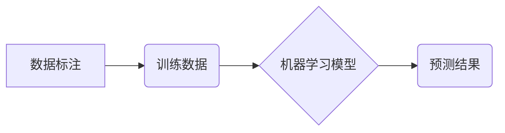

> 数据标注，人工智能，机器学习，深度学习，数据质量，标注工具，标注人员

## 1. 背景介绍

人工智能（AI）近年来发展迅速，在各个领域取得了令人瞩目的成就。从语音识别到图像识别，从自然语言处理到自动驾驶，AI技术的应用无处不在。然而，支撑AI发展的核心力量并非仅仅是算法和计算能力，而是海量高质量的数据标注。

数据标注是指为机器学习算法提供训练数据，并为这些数据赋予标签或标记的过程。简单来说，就是让机器“学会”理解和解释数据。例如，在训练图像识别模型时，需要对大量图像进行标注，标记出图像中包含的物体，例如猫、狗、车等。

数据标注是机器学习和深度学习的基础，是AI技术发展的关键环节。高质量的数据标注可以提高模型的准确率、鲁棒性和泛化能力，而低质量的数据标注则会导致模型性能下降，甚至产生错误的结果。

## 2. 核心概念与联系

数据标注的核心概念包括：

* **训练数据：** 用于训练机器学习模型的数据集。
* **标签：** 为训练数据赋予的标记或分类。
* **标注工具：** 用于进行数据标注的软件工具。
* **标注人员：** 负责进行数据标注的人员。

数据标注与机器学习的关系可以概括为：



数据标注为机器学习模型提供了训练数据，模型通过学习这些数据，建立起预测模型，最终能够对新的数据进行预测。

## 3. 核心算法原理 & 具体操作步骤

### 3.1  算法原理概述

数据标注算法本身并不存在独立的算法，而是根据不同的任务类型和数据特点，采用不同的标注方法和技术。常见的标注方法包括：

* **监督学习标注：** 

根据已知标签的数据进行标注，例如图像分类、文本情感分析等。

* **无监督学习标注：** 

不依赖于已知标签，通过数据本身的结构和特征进行标注，例如聚类分析、异常检测等。

* **半监督学习标注：** 

结合监督学习和无监督学习，利用少量标注数据和大量未标注数据进行标注。

### 3.2  算法步骤详解

数据标注的具体操作步骤取决于具体的标注任务和工具。一般来说，包括以下几个步骤：

1. **数据收集：** 收集需要标注的数据，例如图像、文本、音频等。
2. **数据预处理：** 对数据进行清洗、格式化和转换，使其适合标注工具使用。
3. **标注工具选择：** 根据标注任务和数据类型选择合适的标注工具。
4. **数据标注：** 使用标注工具对数据进行标注，赋予标签或标记。
5. **数据验证：** 对标注结果进行验证，确保标注质量。
6. **数据导出：** 将标注结果导出为机器学习模型可以识别的格式。

### 3.3  算法优缺点

数据标注算法的优缺点取决于具体的标注方法和工具。

**优点：**

* 可以提高机器学习模型的准确率和性能。
* 可以帮助机器理解和解释数据。
* 可以为机器学习算法提供训练数据。

**缺点：**

* 数据标注成本高昂，需要大量的人力投入。
* 数据标注工作耗时费力，需要专业人员进行操作。
* 数据标注质量难以保证，需要严格的质量控制。

### 3.4  算法应用领域

数据标注在各个领域都有广泛的应用，例如：

* **计算机视觉：** 图像识别、目标检测、图像分割等。
* **自然语言处理：** 文本分类、情感分析、机器翻译等。
* **语音识别：** 语音转文本、语音助手等。
* **自动驾驶：** 路标识别、行人检测、障碍物识别等。

## 4. 数学模型和公式 & 详细讲解 & 举例说明

### 4.1  数学模型构建

数据标注的数学模型主要用于评估标注质量和优化标注过程。常见的数学模型包括：

* **精确率（Precision）：** 正确预测的正例数占所有预测为正例的数的比例。
* **召回率（Recall）：** 正确预测的正例数占所有实际正例数的比例。
* **F1-score：** 精确率和召回率的调和平均数。

### 4.2  公式推导过程

**精确率：**

$$Precision = \frac{TP}{TP + FP}$$

**召回率：**

$$Recall = \frac{TP}{TP + FN}$$

**F1-score：**

$$F1-score = \frac{2 * Precision * Recall}{Precision + Recall}$$

其中：

* TP：真阳性（正确预测为正例）
* FP：假阳性（错误预测为正例）
* FN：假阴性（错误预测为负例）

### 4.3  案例分析与讲解

假设我们有一个图像分类任务，需要将图像分类为“猫”或“狗”。经过标注后，我们得到了以下结果：

* 正确预测为“猫”的图像：100张
* 错误预测为“猫”的图像：10张
* 正确预测为“狗”的图像：80张
* 错误预测为“狗”的图像：20张

那么，我们可以计算出：

* 精确率：100 / (100 + 10) = 0.91
* 召回率：100 / (100 + 20) = 0.83
* F1-score：2 * 0.91 * 0.83 / (0.91 + 0.83) = 0.87

## 5. 项目实践：代码实例和详细解释说明

### 5.1  开发环境搭建

数据标注项目可以使用多种开发环境搭建，例如：

* **Python环境：** Python 是数据科学和机器学习领域最常用的编程语言，拥有丰富的标注工具和库。
* **Java环境：** Java 是一种成熟的企业级编程语言，也有一些数据标注工具和库。
* **云平台环境：** 云平台例如AWS、Azure、GCP等提供数据标注服务和工具，可以方便地进行数据标注和管理。

### 5.2  源代码详细实现

以下是一个使用Python语言和标注工具LabelImg进行图像标注的简单代码示例：

```python
import os
import xml.etree.ElementTree as ET

# 设置标注数据路径
data_path = "/path/to/data"

# 遍历所有图像文件
for filename in os.listdir(data_path):
    if filename.endswith(".jpg") or filename.endswith(".png"):
        # 获取图像文件名
        image_filename = os.path.join(data_path, filename)
        # 生成对应的标注文件名称
        annotation_filename = filename.replace(".jpg", ".xml").replace(".png", ".xml")
        annotation_filepath = os.path.join(data_path, annotation_filename)

        # 使用LabelImg工具标注图像
        # ...

        # 将标注结果写入XML文件
        root = ET.Element("annotation")
        # ...
        tree = ET.ElementTree(root)
        tree.write(annotation_filepath)
```

### 5.3  代码解读与分析

这段代码首先定义了数据路径，然后遍历所有图像文件，并根据图像文件名生成对应的标注文件名称。接着，使用LabelImg工具对图像进行标注，并将标注结果写入XML文件。

### 5.4  运行结果展示

运行这段代码后，会在数据路径下生成对应的标注文件，这些文件可以被机器学习模型用于训练。

## 6. 实际应用场景

数据标注在各个领域都有广泛的应用场景，例如：

### 6.1  医疗领域

* **疾病诊断：** 使用图像标注技术，可以帮助医生识别和诊断疾病，例如癌症、心血管疾病等。
* **药物研发：** 使用文本标注技术，可以帮助研究人员分析医学文献，加速药物研发过程。

### 6.2  金融领域

* **欺诈检测：** 使用文本和图像标注技术，可以帮助金融机构识别和预防欺诈行为。
* **风险评估：** 使用数据标注技术，可以帮助金融机构评估客户的信用风险。

### 6.3  零售领域

* **商品推荐：** 使用用户行为数据标注技术，可以帮助电商平台推荐更符合用户需求的商品。
* **个性化营销：** 使用用户数据标注技术，可以帮助零售商进行个性化营销，提高营销效果。

### 6.4  未来应用展望

随着人工智能技术的不断发展，数据标注的应用场景将会更加广泛。例如：

* **自动驾驶：** 数据标注将是自动驾驶技术发展的关键环节，需要大量的数据标注来训练自动驾驶模型。
* **机器人技术：** 数据标注可以帮助机器人理解和交互环境，提高机器人的智能化水平。
* **个性化教育：** 数据标注可以帮助教育机构提供个性化的学习方案，提高学生的学习效率。

## 7. 工具和资源推荐

### 7.1  学习资源推荐

* **斯坦福大学CS224N课程：** 自然语言处理课程，包含数据标注相关内容。
* **Udacity机器学习工程师 Nanodegree：** 机器学习工程师课程，包含数据标注相关内容。
* **Kaggle平台：** 数据科学竞赛平台，提供大量数据标注任务和资源。

### 7.2  开发工具推荐

* **LabelImg：** 用于图像标注的开源工具。
* **BRAT：** 用于文本标注的开源工具。
* **Amazon Mechanical Turk：** 云平台上的数据标注服务。

### 7.3  相关论文推荐

* **ImageNet Classification with Deep Convolutional Neural Networks**
* **Attention Is All You Need**
* **BERT: Pre-training of Deep Bidirectional Transformers for Language Understanding**

## 8. 总结：未来发展趋势与挑战

### 8.1  研究成果总结

数据标注技术近年来取得了显著的进展，出现了许多新的标注方法和工具，提高了标注效率和质量。

### 8.2  未来发展趋势

未来数据标注技术的发展趋势包括：

* **自动化标注：** 利用机器学习算法自动完成数据标注，减少人工标注成本。
* **主动学习：** 通过选择最难标注的数据进行标注，提高标注效率。
* **联邦学习：** 在不共享原始数据的情况下，利用分布式数据进行标注，保护数据隐私。

### 8.3  面临的挑战

数据标注技术也面临着一些挑战，例如：

* **标注质量控制：** 确保标注质量是数据标注的关键问题，需要建立有效的质量控制机制。
* **标注成本：** 数据标注成本仍然较高，需要寻找更经济高效的标注方法。
* **数据隐私保护：** 在数据标注过程中，需要保护用户隐私，避免数据泄露。

### 8.4  研究展望

未来，数据标注技术将继续朝着自动化、智能化、隐私保护的方向发展，为人工智能技术的进步提供更优质的数据支撑。

## 9. 附录：常见问题与解答

### 9.1  常见问题

* **数据标注的成本如何控制？**

可以通过自动化标注、主动学习等方法降低标注成本。

* **如何保证数据标注的质量？**

可以通过建立严格的质量控制机制、使用专业的标注工具、进行标注人员培训等方式保证标注质量。

* **数据标注与机器学习的关系是什么？**

数据标注为机器学习模型提供训练数据，是机器学习模型训练的基础