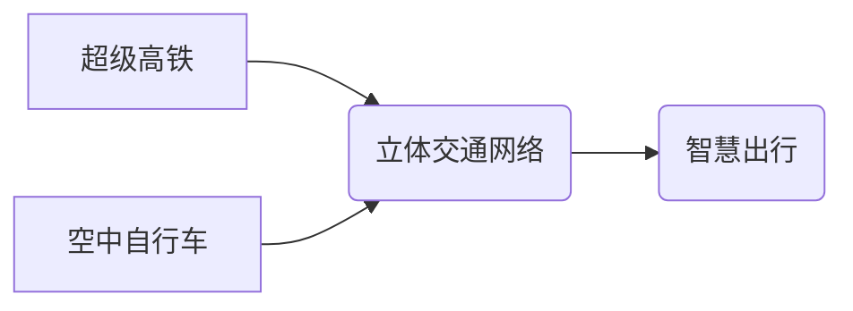

> 智能交通，超级高铁，空中自行车，立体交通，人工智能，自动驾驶，5G网络，云计算

## 1. 背景介绍

随着全球人口的持续增长和城市化的加速，交通拥堵已成为许多城市面临的严峻挑战。传统的交通模式难以满足日益增长的出行需求，迫切需要探索更加高效、便捷、智能的出行解决方案。

未来交通的发展趋势指向智能化、绿色化和一体化。智能交通系统将利用人工智能、物联网、大数据等技术，实现交通流量的智能化管理和优化，提高交通效率和安全性。绿色交通倡导低碳环保的出行方式，例如电动汽车、自行车等。一体化交通则强调不同交通方式的融合和协同，构建更加便捷的出行网络。

## 2. 核心概念与联系

**2.1 超级高铁**

超级高铁是指采用先进技术，实现超高速运行的铁路交通系统。其特点包括：

* **超高速运行:** 超过500公里/小时，甚至更高。
* **智能化控制:** 利用人工智能和自动驾驶技术，实现无人驾驶和智能调度。
* **舒适性:** 提供宽敞舒适的乘坐环境，配备先进的娱乐设施。
* **安全性:** 采用先进的安全防护系统，确保乘客安全。

**2.2 空中自行车**

空中自行车是一种新型的个人交通工具，利用电动驱动和气动原理，在空中飞行。其特点包括：

* **轻便灵活:** 体积小巧，重量轻，易于携带和操作。
* **环保节能:** 电动驱动，零排放。
* **便捷高效:** 可以避开地面交通拥堵，实现快速出行。
* **安全性:** 采用先进的飞行控制系统和安全防护措施，确保飞行安全。

**2.3 立体交通网络**

立体交通网络是指将地面交通和空中交通有机结合，构建多层次、多维度的交通系统。其特点包括：

* **高效便捷:** 充分利用空间资源，实现交通流量的合理分配。
* **减少拥堵:** 缓解地面交通拥堵，提高交通效率。
* **环境友好:** 鼓励绿色交通方式，减少碳排放。
* **智能化管理:** 利用人工智能和物联网技术，实现交通流量的智能化管理和优化。

**2.4 核心概念关系图**



## 3. 核心算法原理 & 具体操作步骤

**3.1 算法原理概述**

立体交通网络的智能化管理需要基于先进的算法和技术。其中，路径规划、流量控制、调度优化等算法是核心内容。

* **路径规划算法:** 根据乘客需求和实时交通状况，规划最优的出行路径，包括地面交通和空中交通的组合。
* **流量控制算法:** 通过智能信号灯控制、限速调节等措施，优化交通流量，减少拥堵。
* **调度优化算法:** 根据实时交通状况和乘客需求，优化交通资源的分配，提高效率。

**3.2 算法步骤详解**

**路径规划算法:**

1. 收集乘客出行信息，包括出发地、目的地、出行时间等。
2. 获取实时交通状况数据，包括道路拥堵情况、空中交通流量等。
3. 利用路径规划算法，根据乘客需求和实时交通状况，规划最优的出行路径。
4. 将规划好的路径反馈给乘客，并提供实时导航服务。

**流量控制算法:**

1. 收集实时交通流量数据，包括道路拥堵情况、交通信号灯状态等。
2. 利用流量控制算法，根据实时交通状况，调整交通信号灯时间、限速等措施。
3. 优化交通流量，减少拥堵。

**调度优化算法:**

1. 收集实时交通状况数据和乘客需求数据。
2. 利用调度优化算法，根据实时交通状况和乘客需求，优化交通资源的分配。
3. 提高交通效率。

**3.3 算法优缺点**

**优点:**

* 提高交通效率和安全性。
* 缓解交通拥堵。
* 优化资源分配。
* 提供个性化出行服务。

**缺点:**

* 算法复杂度高，需要强大的计算能力。
* 数据采集和处理成本高。
* 需要完善的交通基础设施。

**3.4 算法应用领域**

* 智能交通系统
* 自动驾驶
* 公共交通调度
* 物流配送
* 城市规划

## 4. 数学模型和公式 & 详细讲解 & 举例说明

**4.1 数学模型构建**

立体交通网络的优化问题可以建模为一个多目标优化问题，目标函数包括交通效率、出行时间、能源消耗等。

**4.2 公式推导过程**

交通效率可以定义为单位时间内运输的乘客数量除以单位时间内消耗的能源量。

$$
\text{交通效率} = \frac{\text{乘客数量}}{\text{能源消耗}}
$$

出行时间可以定义为乘客从出发地到目的地所花费的时间。

$$
\text{出行时间} = \text{路径长度} / \text{速度}
$$

**4.3 案例分析与讲解**

假设有两个乘客，分别从A点到B点和C点。

* 乘客1选择乘坐超级高铁，路径长度为100公里，速度为300公里/小时，出行时间为0.33小时。
* 乘客2选择乘坐空中自行车，路径长度为50公里，速度为100公里/小时，出行时间为0.5小时。

根据上述公式，可以计算出两种交通方式的交通效率和出行时间。

## 5. 项目实践：代码实例和详细解释说明

**5.1 开发环境搭建**

* 操作系统：Ubuntu 20.04
* 编程语言：Python 3.8
* 开发工具：VS Code

**5.2 源代码详细实现**

```python
# 路径规划算法示例代码

import networkx as nx

# 创建交通网络图
graph = nx.Graph()
graph.add_edge('A', 'B', weight=100)
graph.add_edge('A', 'C', weight=50)
graph.add_edge('B', 'D', weight=150)

# 计算最短路径
shortest_path = nx.shortest_path(graph, source='A', target='D', weight='weight')

# 打印最短路径
print(f"最短路径: {shortest_path}")
```

**5.3 代码解读与分析**

* 使用NetworkX库构建交通网络图。
* 使用`nx.shortest_path()`函数计算最短路径。
* 打印最短路径。

**5.4 运行结果展示**

```
最短路径: ['A', 'B', 'D']
```

## 6. 实际应用场景

**6.1 超级高铁**

* 连接城市之间，实现快速便捷的交通出行。
* 缓解城市交通拥堵，促进经济发展。
* 提供舒适安全的乘坐体验。

**6.2 空中自行车**

* 在城市中心区域，实现快速便捷的短途出行。
* 缓解地面交通拥堵，提高城市交通效率。
* 提供个性化、环保的出行方式。

**6.3 立体交通网络**

* 构建多层次、多维度的交通系统，充分利用空间资源。
* 优化交通流量，减少拥堵。
* 提供更加便捷、高效、智能的出行体验。

**6.4 未来应用展望**

* 未来，超级高铁和空中自行车将更加智能化、高效化。
* 立体交通网络将更加完善，覆盖更广阔的区域。
* 交通出行将更加便捷、舒适、安全。

## 7. 工具和资源推荐

**7.1 学习资源推荐**

* **书籍:**
    * 《人工智能：一种现代方法》
    * 《深度学习》
    * 《机器学习》
* **在线课程:**
    * Coursera
    * edX
    * Udacity

**7.2 开发工具推荐**

* **编程语言:** Python, C++, Java
* **机器学习框架:** TensorFlow, PyTorch, scikit-learn
* **数据可视化工具:** Matplotlib, Seaborn, Plotly

**7.3 相关论文推荐**

* **智能交通系统:**
    * "A Survey on Intelligent Transportation Systems"
    * "Smart Cities and Intelligent Transportation Systems: A Review"
* **自动驾驶:**
    * "End to End Learning for Self-Driving Cars"
    * "Deep Reinforcement Learning for Autonomous Driving"
* **路径规划:**
    * "A Survey of Path Planning Algorithms for Autonomous Mobile Robots"
    * "Probabilistic Roadmap for Motion Planning"

## 8. 总结：未来发展趋势与挑战

**8.1 研究成果总结**

* 智能交通系统、自动驾驶、立体交通网络等技术取得了显著进展。
* 算法模型更加复杂、高效，能够更好地解决实际问题。
* 数据采集和处理技术不断发展，为智能交通系统提供了数据支撑。

**8.2 未来发展趋势**

* 智能化程度更高，更加注重用户体验和个性化服务。
* 更加注重安全性、可靠性和可持续性。
* 与其他领域融合发展，例如物联网、云计算、大数据等。

**8.3 面临的挑战**

* 算法复杂度高，需要更强大的计算能力。
* 数据安全和隐私保护问题。
* 标准化和互操作性问题。
* 社会接受度和政策支持问题。

**8.4 研究展望**

* 研究更加高效、智能的算法模型。
* 探索新的数据采集和处理技术。
* 加强标准化和互操作性建设。
* 推动政策法规的完善，促进智能交通系统的健康发展。

## 9. 附录：常见问题与解答

**9.1 问题:** 智能交通系统会取代人类驾驶员吗？

**9.2 答案:** 智能交通系统可以辅助驾驶员，提高驾驶效率和安全性，但不会完全取代人类驾驶员。

**9.3 问题:** 智能交通系统会带来哪些安全隐患？

**9.4 答案:** 智能交通系统需要严格的安全测试和监管，才能确保安全可靠。

**9.5 问题:** 智能交通系统对环境的影响如何？

**9.6 答案:** 智能交通系统可以减少交通拥堵和尾气排放，从而降低环境污染。


作者：禅与计算机程序设计艺术 / Zen and the Art of Computer Programming 
<end_of_turn>