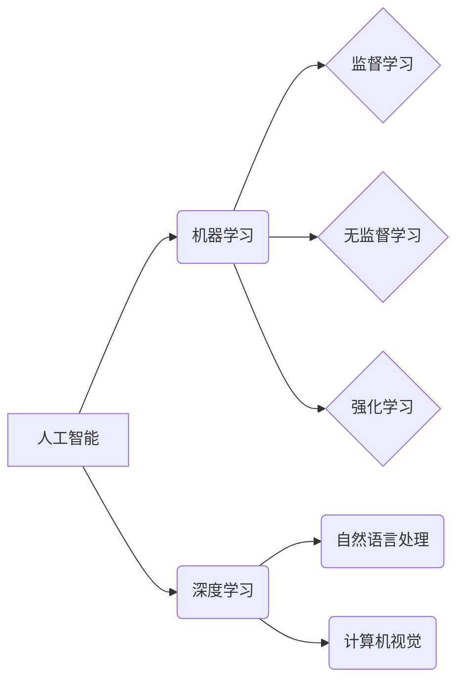

> 苹果、AI应用、机器学习、深度学习、自然语言处理、计算机视觉、科技发展趋势、未来应用

## 1. 背景介绍

2023年，苹果公司在全球开发者大会上发布了一系列搭载人工智能（AI）技术的应用，引发了业界和公众的广泛关注。李开复，作为一位享誉全球的计算机科学家和科技评论家，在接受采访时对苹果发布AI应用的意义进行了深入的分析。他认为，苹果的这一举措标志着AI技术已经从实验室走向了大众生活，并将在未来深刻地改变我们的生活方式。

## 2. 核心概念与联系

### 2.1  人工智能（AI）

人工智能是指模拟人类智能行为的计算机系统。它涵盖了广泛的领域，包括机器学习、深度学习、自然语言处理、计算机视觉等。

### 2.2  机器学习（ML）

机器学习是人工智能的一个重要分支，它使计算机能够从数据中学习，并根据学习到的知识进行预测或决策。机器学习算法可以分为监督学习、无监督学习和强化学习三种类型。

### 2.3  深度学习（DL）

深度学习是机器学习的一个子领域，它利用多层神经网络来模拟人类大脑的学习过程。深度学习算法在图像识别、语音识别、自然语言处理等领域取得了突破性的进展。

### 2.4  自然语言处理（NLP）

自然语言处理是指使计算机能够理解、处理和生成人类语言的技术。NLP应用广泛，例如聊天机器人、机器翻译、文本摘要等。

### 2.5  计算机视觉（CV）

计算机视觉是指使计算机能够“看”和理解图像的技术。计算机视觉应用于图像识别、物体检测、场景理解等领域。

**核心概念与联系流程图**



## 3. 核心算法原理 & 具体操作步骤

### 3.1  算法原理概述

李开复指出，苹果发布的AI应用主要基于深度学习算法。深度学习算法通过多层神经网络来学习数据特征，并进行预测或决策。

### 3.2  算法步骤详解

1. **数据收集和预处理:** 收集大量相关数据，并进行清洗、格式化等预处理工作。
2. **模型构建:** 设计多层神经网络结构，并选择合适的激活函数、损失函数等参数。
3. **模型训练:** 使用训练数据训练神经网络模型，调整模型参数，使模型能够准确地预测或决策。
4. **模型评估:** 使用测试数据评估模型的性能，并进行调整和优化。
5. **模型部署:** 将训练好的模型部署到实际应用场景中。

### 3.3  算法优缺点

**优点:**

* 能够学习复杂的数据特征，并进行精准的预测或决策。
* 具有强大的泛化能力，能够应用于不同的领域和任务。

**缺点:**

* 需要大量的训练数据，训练时间较长。
* 模型解释性较差，难以理解模型的决策过程。

### 3.4  算法应用领域

深度学习算法广泛应用于图像识别、语音识别、自然语言处理、推荐系统、医疗诊断等领域。

## 4. 数学模型和公式 & 详细讲解 & 举例说明

### 4.1  数学模型构建

深度学习模型通常由多层神经网络组成，每层神经网络包含多个神经元。每个神经元接收来自上一层的输入信号，并通过激活函数进行处理，输出到下一层。

### 4.2  公式推导过程

深度学习模型的训练过程基于梯度下降算法。梯度下降算法的目标是找到模型参数，使模型的损失函数最小化。损失函数衡量模型预测结果与真实结果之间的差异。

**损失函数公式:**

$$
L = \frac{1}{N} \sum_{i=1}^{N} loss(y_i, \hat{y}_i)
$$

其中：

* $L$ 是损失函数
* $N$ 是样本数量
* $y_i$ 是真实标签
* $\hat{y}_i$ 是模型预测结果

**梯度下降公式:**

$$
\theta = \theta - \alpha \nabla L(\theta)
$$

其中：

* $\theta$ 是模型参数
* $\alpha$ 是学习率
* $\nabla L(\theta)$ 是损失函数对模型参数的梯度

### 4.3  案例分析与讲解

例如，在图像识别任务中，深度学习模型可以学习图像特征，并预测图像中所包含的物体类别。训练过程中，模型会使用大量标注好的图像数据，通过梯度下降算法不断调整模型参数，使模型能够准确地识别图像中的物体类别。

## 5. 项目实践：代码实例和详细解释说明

### 5.1  开发环境搭建

使用Python语言开发深度学习模型，需要安装相关的库和工具，例如TensorFlow、PyTorch、NumPy等。

### 5.2  源代码详细实现

```python
import tensorflow as tf

# 定义模型结构
model = tf.keras.models.Sequential([
    tf.keras.layers.Conv2D(32, (3, 3), activation='relu', input_shape=(28, 28, 1)),
    tf.keras.layers.MaxPooling2D((2, 2)),
    tf.keras.layers.Conv2D(64, (3, 3), activation='relu'),
    tf.keras.layers.MaxPooling2D((2, 2)),
    tf.keras.layers.Flatten(),
    tf.keras.layers.Dense(10, activation='softmax')
])

# 编译模型
model.compile(optimizer='adam',
              loss='sparse_categorical_crossentropy',
              metrics=['accuracy'])

# 训练模型
model.fit(x_train, y_train, epochs=5)

# 评估模型
loss, accuracy = model.evaluate(x_test, y_test)
print('Test loss:', loss)
print('Test accuracy:', accuracy)
```

### 5.3  代码解读与分析

这段代码定义了一个简单的卷积神经网络模型，用于手写数字识别任务。模型包含两层卷积层、两层最大池化层、一层全连接层和一层输出层。模型使用Adam优化器、交叉熵损失函数和准确率作为评估指标。

### 5.4  运行结果展示

训练完成后，模型可以用于预测新的手写数字图像。

## 6. 实际应用场景

### 6.1  智能助手

苹果的Siri智能助手利用自然语言处理技术，能够理解用户的语音指令，并执行相应的操作。

### 6.2  图像识别

苹果的iPhone手机内置了图像识别功能，能够识别物体、场景和文本。

### 6.3  个性化推荐

苹果的App Store和音乐平台利用机器学习算法，根据用户的喜好推荐应用程序和音乐。

### 6.4  未来应用展望

李开复认为，AI技术将深刻地改变我们的生活方式，未来将应用于更多领域，例如医疗保健、教育、交通运输等。

## 7. 工具和资源推荐

### 7.1  学习资源推荐

* **在线课程:** Coursera、edX、Udacity等平台提供丰富的AI课程。
* **书籍:** 《深度学习》、《机器学习实战》等书籍是学习AI技术的经典教材。
* **开源项目:** TensorFlow、PyTorch等开源项目提供了丰富的代码示例和工具。

### 7.2  开发工具推荐

* **Python:** Python语言是深度学习开发的常用语言。
* **TensorFlow:** TensorFlow是一个开源的深度学习框架。
* **PyTorch:** PyTorch是一个开源的深度学习框架。

### 7.3  相关论文推荐

* **《ImageNet Classification with Deep Convolutional Neural Networks》**
* **《Attention Is All You Need》**
* **《BERT: Pre-training of Deep Bidirectional Transformers for Language Understanding》**

## 8. 总结：未来发展趋势与挑战

### 8.1  研究成果总结

李开复总结了AI技术在图像识别、语音识别、自然语言处理等领域的取得的重大进展，并指出AI技术正在快速发展，未来将应用于更多领域。

### 8.2  未来发展趋势

* **模型规模和复杂度不断提升:** 未来将出现更大规模、更复杂的深度学习模型。
* **跨模态学习:** 将不同模态的数据（例如文本、图像、音频）融合在一起进行学习。
* **可解释性增强:** 研究如何提高深度学习模型的解释性，使模型的决策过程更加透明。

### 8.3  面临的挑战

* **数据获取和隐私保护:** 深度学习模型需要大量的训练数据，如何获取高质量的数据并保护用户隐私是一个挑战。
* **计算资源需求:** 训练大型深度学习模型需要大量的计算资源，如何降低计算成本是一个关键问题。
* **伦理和社会影响:** AI技术的应用可能带来伦理和社会问题，例如算法偏见、就业失业等，需要认真思考和解决。

### 8.4  研究展望

李开复呼吁科学家和工程师们继续努力，推动AI技术的进步，并将其应用于解决人类面临的重大挑战。

## 9. 附录：常见问题与解答

### 9.1  什么是深度学习？

深度学习是一种机器学习的子领域，它利用多层神经网络来模拟人类大脑的学习过程。

### 9.2  深度学习有哪些应用？

深度学习应用广泛，例如图像识别、语音识别、自然语言处理、推荐系统、医疗诊断等。

### 9.3  如何学习深度学习？

可以通过在线课程、书籍、开源项目等方式学习深度学习。

作者：禅与计算机程序设计艺术 / Zen and the Art of Computer Programming


<end_of_turn>