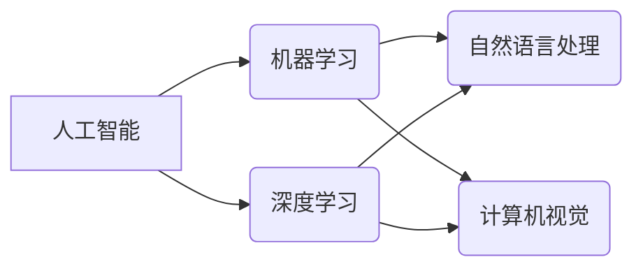

> 苹果, AI应用, 投资价值,  机器学习, 深度学习, 自然语言处理, 计算机视觉, 人工智能

## 1. 背景介绍

近年来，人工智能（AI）技术飞速发展，已渗透到生活的方方面面。从智能手机的语音助手到自动驾驶汽车，AI正在改变着我们的生活方式。作为科技巨头，苹果也积极布局AI领域，并于2023年发布了一系列AI应用，引发了业界和投资者的广泛关注。

李开复，作为一位享誉全球的人工智能专家，在接受采访时谈到了苹果发布AI应用的投资价值。他认为，苹果拥有强大的硬件、软件和生态系统，以及庞大的用户群体，这些优势为其在AI领域的发展提供了坚实的基础。

## 2. 核心概念与联系

### 2.1  人工智能 (AI)

人工智能是指模拟人类智能行为的计算机系统。它涵盖了多个领域，包括机器学习、深度学习、自然语言处理、计算机视觉等。

### 2.2  机器学习 (ML)

机器学习是人工智能的一个重要分支，它通过算法学习数据，并从中发现模式和规律，从而进行预测或决策。

### 2.3  深度学习 (DL)

深度学习是机器学习的一种更高级形式，它利用多层神经网络来模拟人类大脑的学习过程，能够处理更复杂的数据，并取得更优异的性能。

### 2.4  自然语言处理 (NLP)

自然语言处理是指让计算机能够理解和处理人类语言的技术。它包括文本分析、机器翻译、语音识别等应用。

### 2.5  计算机视觉 (CV)

计算机视觉是指让计算机能够“看”和理解图像的技术。它包括图像识别、物体检测、图像分割等应用。

**核心概念与联系流程图:**



## 3. 核心算法原理 & 具体操作步骤

### 3.1  算法原理概述

机器学习算法的核心是通过训练模型来学习数据。训练过程通常包括以下步骤：

1. **数据收集和预处理:** 收集相关数据并进行清洗、转换等预处理操作。
2. **模型选择:** 根据任务需求选择合适的机器学习算法模型。
3. **模型训练:** 使用训练数据训练模型，调整模型参数以最小化预测误差。
4. **模型评估:** 使用测试数据评估模型的性能，并进行调优。
5. **模型部署:** 将训练好的模型部署到实际应用场景中。

### 3.2  算法步骤详解

以线性回归算法为例，详细说明其训练步骤：

1. **数据收集和预处理:** 收集包含输入特征和目标变量的数据集。
2. **模型选择:** 选择线性回归算法模型，其假设目标变量与输入特征之间存在线性关系。
3. **模型训练:** 使用训练数据训练模型，通过最小化预测误差来调整模型参数（权重和偏差）。
4. **模型评估:** 使用测试数据评估模型的性能，例如计算均方误差 (MSE) 或 R-squared 值。
5. **模型调优:** 根据评估结果，调整模型参数或选择其他算法模型，以提高模型性能。

### 3.3  算法优缺点

**线性回归算法的优点:**

* 算法简单易懂，易于实现。
* 计算效率高，训练速度快。
* 可解释性强，可以直观地理解模型参数的含义。

**线性回归算法的缺点:**

* 只能处理线性关系，对于非线性关系的预测效果较差。
* 对异常值敏感，容易受到异常值的影响。

### 3.4  算法应用领域

线性回归算法广泛应用于以下领域：

* 房价预测
* 股票价格预测
* 销售预测
* 医疗诊断

## 4. 数学模型和公式 & 详细讲解 & 举例说明

### 4.1  数学模型构建

线性回归模型的数学表达式为：

$$y = w_0 + w_1x_1 + w_2x_2 + ... + w_nx_n + \epsilon$$

其中：

* $y$ 是目标变量
* $x_1, x_2, ..., x_n$ 是输入特征
* $w_0, w_1, w_2, ..., w_n$ 是模型参数（权重）
* $\epsilon$ 是误差项

### 4.2  公式推导过程

模型参数的求解可以通过最小化预测误差来实现。常用的误差函数是均方误差 (MSE)：

$$MSE = \frac{1}{n}\sum_{i=1}^{n}(y_i - \hat{y}_i)^2$$

其中：

* $n$ 是样本数量
* $y_i$ 是第 $i$ 个样本的目标变量
* $\hat{y}_i$ 是模型预测的第 $i$ 个样本的目标变量

通过求解 MSE 的最小值，可以得到最优的模型参数。

### 4.3  案例分析与讲解

假设我们想要预测房屋价格，输入特征包括房屋面积、房间数量、地理位置等。我们可以使用线性回归模型来建立房屋价格预测模型。

通过训练模型，我们可以得到每个特征对应的权重值，例如：

* 房屋面积的权重为 1000 元/平方米
* 房间数量的权重为 50000 元/间

这意味着，房屋面积每增加 1 平方米，价格预计增加 1000 元；房间数量每增加 1 间，价格预计增加 50000 元。

## 5. 项目实践：代码实例和详细解释说明

### 5.1  开发环境搭建

本项目使用 Python 语言进行开发，需要安装以下软件包：

* NumPy
* Pandas
* Scikit-learn

可以使用 pip 命令安装：

```bash
pip install numpy pandas scikit-learn
```

### 5.2  源代码详细实现

```python
import numpy as np
from sklearn.linear_model import LinearRegression

# 数据加载
data = np.loadtxt('housing_data.csv', delimiter=',')
X = data[:, :-1]  # 输入特征
y = data[:, -1]  # 目标变量

# 模型训练
model = LinearRegression()
model.fit(X, y)

# 模型预测
predictions = model.predict(X)

# 模型评估
from sklearn.metrics import mean_squared_error
mse = mean_squared_error(y, predictions)
print(f'均方误差: {mse}')
```

### 5.3  代码解读与分析

1. 导入必要的库函数。
2. 加载数据，将数据分为输入特征和目标变量。
3. 创建线性回归模型对象。
4. 使用训练数据训练模型。
5. 使用训练好的模型对输入数据进行预测。
6. 使用均方误差 (MSE) 评估模型性能。

### 5.4  运行结果展示

运行代码后，会输出模型的均方误差值，该值越小，模型的预测效果越好。

## 6. 实际应用场景

### 6.1  智能客服

苹果可以使用 AI 技术构建智能客服系统，能够自动回答用户常见问题，提高客户服务效率。

### 6.2  个性化推荐

苹果可以利用用户行为数据，通过 AI 算法进行个性化推荐，例如推荐用户可能感兴趣的应用、音乐或电影。

### 6.3  语音助手

苹果的 Siri 语音助手可以利用自然语言处理技术，更好地理解用户的语音指令，并提供更精准的回复。

### 6.4  未来应用展望

随着 AI 技术的不断发展，苹果未来将有更多 AI 应用场景，例如：

* **医疗诊断:** 利用 AI 辅助医生进行疾病诊断，提高诊断准确率。
* **自动驾驶:** 开发基于 AI 的自动驾驶系统，提高交通安全和效率。
* **教育:** 利用 AI 个性化教学，提高学习效率。

## 7. 工具和资源推荐

### 7.1  学习资源推荐

* **斯坦福大学 CS229 机器学习课程:** https://cs229.stanford.edu/
* **Andrew Ng 的机器学习课程:** https://www.coursera.org/learn/machine-learning
* **DeepLearning.AI 深度学习课程:** https://www.deeplearning.ai/

### 7.2  开发工具推荐

* **TensorFlow:** https://www.tensorflow.org/
* **PyTorch:** https://pytorch.org/
* **Scikit-learn:** https://scikit-learn.org/

### 7.3  相关论文推荐

* **《ImageNet Classification with Deep Convolutional Neural Networks》:** https://arxiv.org/abs/1202.1038
* **《Attention Is All You Need》:** https://arxiv.org/abs/1706.03762

## 8. 总结：未来发展趋势与挑战

### 8.1  研究成果总结

近年来，AI 技术取得了长足进步，在各个领域都取得了突破性进展。从图像识别到自然语言处理，AI 算法的性能不断提升，应用场景也越来越广泛。

### 8.2  未来发展趋势

未来，AI 技术将继续朝着以下方向发展：

* **更强大的计算能力:** 随着硬件技术的进步，AI 算法将能够处理更大规模的数据，并进行更复杂的计算。
* **更智能的算法:** 研究人员将继续开发更智能的 AI 算法，例如能够学习人类思维模式的算法。
* **更广泛的应用场景:** AI 技术将应用于更多领域，例如医疗、教育、金融等。

### 8.3  面临的挑战

AI 技术的发展也面临着一些挑战：

* **数据安全和隐私:** AI 算法需要大量数据进行训练，如何保护数据安全和隐私是一个重要问题。
* **算法偏见:** AI 算法可能存在偏见，导致不公平的结果。
* **伦理问题:** AI 技术的应用可能引发一些伦理问题，例如人工智能的责任和义务。

### 8.4  研究展望

未来，我们需要继续加强对 AI 技术的研究，解决其面临的挑战，并确保 AI 技术的健康发展，造福人类社会。

## 9. 附录：常见问题与解答

**Q1: 什么是机器学习？**

**A1:** 机器学习是人工智能的一个重要分支，它通过算法学习数据，并从中发现模式和规律，从而进行预测或决策。

**Q2: 什么是深度学习？**

**A2:** 深度学习是机器学习的一种更高级形式，它利用多层神经网络来模拟人类大脑的学习过程，能够处理更复杂的数据，并取得更优异的性能。

**Q3: 苹果在 AI 领域有哪些优势？**

**A3:** 苹果拥有强大的硬件、软件和生态系统，以及庞大的用户群体，这些优势为其在 AI 领域的发展提供了坚实的基础。

**Q4: 苹果的 AI 应用有哪些？**

**A4:** 苹果的 AI 应用包括智能客服、个性化推荐、语音助手等。

**Q5: 未来 AI 技术的发展趋势是什么？**

**A5:** 未来，AI 技术将朝着更强大的计算能力、更智能的算法和更广泛的应用场景发展。


作者：禅与计算机程序设计艺术 / Zen and the Art of Computer Programming 
<end_of_turn>