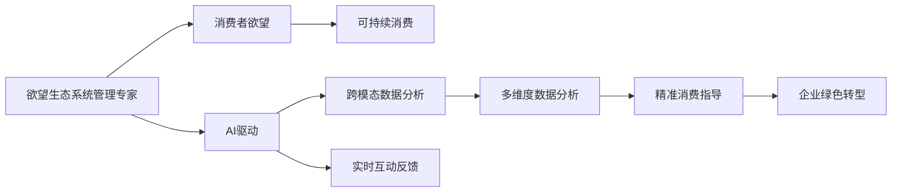

                 

## 1. 背景介绍

在数字化与智能化的浪潮下，消费者行为的分析和预测正成为企业决策的关键环节。随着互联网、大数据、人工智能技术的飞速发展，企业对于消费者欲望的管理和引导也进入了一个新的阶段。由AI驱动的欲望生态系统管理专家，可以更精准地分析消费者的心理状态、行为模式，为企业提供实时、个性化的消费指导，从而在激烈的商业竞争中占据优势。

本文将详细解析基于AI的欲望生态系统管理专家的核心原理、操作步骤以及其在不同领域的应用。通过理论结合实践，我们不仅能掌握欲望生态系统管理的基础知识，还能洞察AI技术如何赋能可持续消费，为企业绿色转型和可持续发展提供科学指导。

## 2. 核心概念与联系

### 2.1 核心概念概述

在深入探讨欲望生态系统管理专家之前，我们首先需要了解以下几个核心概念：

- **欲望生态系统管理专家**：一个以AI为核心驱动的模型，旨在通过分析消费者的欲望状态和行为模式，提供个性化的消费指导，提升消费者的满意度和企业的可持续性。

- **消费者欲望**：指消费者在特定情境下的内在需求、偏好和意愿。欲望的生成和变化受多种因素影响，包括经济、社会、心理等。

- **可持续消费**：指在满足消费者需求的同时，保护环境、节约资源、维护社会公正的消费模式。

- **AI驱动**：指利用人工智能技术，如深度学习、自然语言处理、强化学习等，对消费者欲望进行模型化、预测和优化，实现更精准的管理和引导。

- **跨模态数据分析**：指结合多种数据源，包括文本、图像、语音等，进行全面分析，以深入理解消费者的真实需求。

- **实时互动反馈**：指通过即时反馈和调整，增强消费者的互动体验和满意度。

这些概念紧密相关，共同构成了欲望生态系统管理专家的基础框架。接下来，我们将通过一个简化的Mermaid流程图，展示这些概念之间的联系：



该图表展示了欲望生态系统管理专家的运作流程：首先通过AI驱动的模型分析消费者的欲望状态，结合跨模态数据分析获取更多维度的信息，通过实时互动反馈不断调整优化，最终提供精准的消费指导，推动企业的绿色转型和可持续发展。

## 3. 核心算法原理 & 具体操作步骤

### 3.1 算法原理概述

欲望生态系统管理专家的核心算法原理可以归纳为以下几点：

- **消费者欲望建模**：使用深度学习等方法，对消费者行为数据进行建模，形成对消费者欲望的初步理解和预测。

- **跨模态数据融合**：结合不同模态的数据源，如文本、图像、语音等，进行全面分析，获得更完整的消费者画像。

- **个性化消费指导**：根据消费者的个性化需求，提供定制化的消费建议，提升消费者的满意度。

- **实时互动反馈**：通过即时反馈机制，根据消费者的反馈信息不断调整和优化模型，以适应消费者的实时变化。

### 3.2 算法步骤详解

欲望生态系统管理专家的操作步骤主要分为以下几个步骤：

1. **数据收集与预处理**：
   - 收集消费者的各类行为数据，包括但不限于购物记录、社交媒体互动、搜索引擎行为等。
   - 对数据进行清洗和预处理，确保数据的质量和一致性。

2. **消费者欲望建模**：
   - 使用深度学习模型（如卷积神经网络、循环神经网络、变分自编码器等）对数据进行建模，形成对消费者欲望的初步理解。
   - 通过监督学习、半监督学习或无监督学习等方式，训练模型以提高预测准确性。

3. **跨模态数据融合**：
   - 利用NLP、图像识别、语音识别等技术，对不同模态的数据进行融合处理。
   - 使用集成学习、融合学习等方法，提升跨模态数据融合的准确性和鲁棒性。

4. **个性化消费指导**：
   - 根据消费者欲望和行为模式，生成个性化的消费建议。
   - 结合多目标优化、强化学习等方法，提高消费指导的精准性和效果。

5. **实时互动反馈**：
   - 建立即时反馈机制，收集消费者的反馈信息。
   - 使用在线学习、增量学习等方法，根据反馈信息不断调整和优化模型。

6. **模型评估与优化**：
   - 使用各类评估指标（如准确率、召回率、F1分数等）对模型进行评估。
   - 根据评估结果，进行模型优化，如调整模型结构、改进训练方法等。

### 3.3 算法优缺点

欲望生态系统管理专家的算法具有以下优点：

- **精准度高**：通过深度学习和跨模态分析，可以更准确地理解和预测消费者的欲望。
- **适应性强**：能够实时调整和优化模型，适应消费者行为的变化。
- **个性化高**：提供定制化的消费建议，提升消费者满意度。

同时，该算法也存在以下缺点：

- **数据依赖性强**：需要大量的高质量数据支持，数据获取和处理成本较高。
- **计算资源消耗大**：模型训练和优化需要强大的计算资源。
- **隐私风险**：涉及消费者隐私，需要严格的数据保护措施。

### 3.4 算法应用领域

欲望生态系统管理专家在多个领域都有广泛的应用，例如：

- **电子商务**：提供个性化推荐、动态定价、实时库存管理等服务。
- **金融服务**：通过分析消费者行为，优化金融产品设计和市场策略。
- **健康医疗**：预测和引导健康消费行为，推广健康生活方式。
- **环境保护**：通过消费者行为分析，优化资源使用，推广绿色消费。
- **旅游出行**：提供个性化旅游建议，优化旅游路线和体验。
- **教育培训**：通过数据分析，提供个性化的学习建议，提高学习效率。

## 4. 数学模型和公式 & 详细讲解 & 举例说明

### 4.1 数学模型构建

欲望生态系统管理专家的数学模型主要包括以下几个部分：

1. **消费者欲望表示**：
   - 使用向量表示消费者欲望，如 $\mathbf{x} = (x_1, x_2, ..., x_n)$，其中 $x_i$ 表示第 $i$ 个特征。

2. **欲望与行为的关联模型**：
   - 使用多元线性回归、深度神经网络等方法，建立欲望与行为之间的关联模型。
   - 假设模型为 $y = f(\mathbf{x}, \mathbf{\theta})$，其中 $y$ 表示行为数据，$\mathbf{\theta}$ 为模型参数。

3. **跨模态数据分析模型**：
   - 使用深度学习模型（如CNN、RNN、GAN等），对不同模态的数据进行融合处理。
   - 假设跨模态融合模型为 $z = g(\mathbf{x}_1, \mathbf{x}_2, ..., \mathbf{x}_k, \mathbf{\omega})$，其中 $\mathbf{x}_i$ 表示第 $i$ 个模态的数据，$\mathbf{\omega}$ 为融合参数。

### 4.2 公式推导过程

以一个简单的跨模态数据分析模型为例，其推导过程如下：

设消费者欲望数据 $\mathbf{x}_1$ 为文本，行为数据 $\mathbf{x}_2$ 为图像，融合参数 $\mathbf{\omega}$ 为 $\omega = (\omega_1, \omega_2, ..., \omega_k)$，则跨模态融合模型可以表示为：

$$
z = g(\mathbf{x}_1, \mathbf{x}_2, ..., \mathbf{x}_k, \mathbf{\omega}) = \mathbf{\omega}^T \cdot \text{relu}(\text{cat}(\mathbf{x}_1, \mathbf{x}_2, ..., \mathbf{x}_k))
$$

其中，$\text{relu}$ 表示ReLU激活函数，$\text{cat}$ 表示拼接操作。

### 4.3 案例分析与讲解

假设一个电子商务平台，想要基于消费者的行为数据和文本数据，预测其购买意向。平台收集到如下数据：

- 文本数据：消费者评论、产品描述、品牌名称等。
- 行为数据：浏览历史、购买记录、点击率等。

使用上述模型进行推导，可以得到一个融合后的特征向量 $\mathbf{z}$，用于指导消费者推荐。例如，对于一个新的浏览记录 $\mathbf{x}_2$，可以计算出对应的融合结果 $z$，然后利用回归模型预测购买概率 $y$：

$$
y = f(\mathbf{x}_1, \mathbf{x}_2, ..., \mathbf{x}_k, \mathbf{\theta}) = \mathbf{\omega}^T \cdot \text{relu}(\text{cat}(\mathbf{x}_1, \mathbf{x}_2, ..., \mathbf{x}_k)) + \mathbf{\theta}
$$

其中，$\mathbf{\theta}$ 为回归模型的参数。

## 5. 项目实践：代码实例和详细解释说明

### 5.1 开发环境搭建

欲望生态系统管理专家的开发环境搭建主要涉及以下几个步骤：

1. **环境准备**：
   - 安装Python 3.x版本。
   - 安装必要的依赖库，如TensorFlow、PyTorch、NumPy、Pandas等。

2. **数据集准备**：
   - 收集消费者行为数据和文本数据。
   - 对数据进行清洗和预处理，确保数据的质量和一致性。

3. **模型搭建**：
   - 使用深度学习框架搭建欲望建模、跨模态融合、个性化消费指导等模型。
   - 配置训练超参数，如学习率、批大小、迭代轮数等。

### 5.2 源代码详细实现

以下是一个使用TensorFlow搭建的欲望生态系统管理专家的代码实现：

```python
import tensorflow as tf
from tensorflow.keras import layers

# 定义欲望建模模型
model_desire = tf.keras.Sequential([
    layers.Dense(64, activation='relu', input_shape=(10,)),
    layers.Dense(1, activation='sigmoid')
])

# 定义跨模态融合模型
model_cross = tf.keras.Sequential([
    layers.concatenate([layers.Dense(64, activation='relu'), layers.Dense(64, activation='relu')]),
    layers.Dense(1, activation='sigmoid')
])

# 定义个性化消费指导模型
model_guide = tf.keras.Sequential([
    layers.concatenate([layers.Dense(64, activation='relu'), layers.Dense(64, activation='relu')]),
    layers.Dense(1, activation='sigmoid')
])

# 定义总体模型
model = tf.keras.Sequential([
    layers.concatenate([model_desire.output, model_cross.output, model_guide.output]),
    layers.Dense(1, activation='sigmoid')
])

# 编译模型
model.compile(optimizer='adam', loss='binary_crossentropy', metrics=['accuracy'])

# 训练模型
model.fit(x_train, y_train, epochs=10, batch_size=32, validation_data=(x_val, y_val))

# 预测消费行为
predictions = model.predict(x_test)
```

### 5.3 代码解读与分析

该代码实现了一个简单的欲望生态系统管理专家，其核心步骤包括：

1. **欲望建模**：使用简单的全连接网络，对文本和行为数据进行建模。
2. **跨模态融合**：将文本和行为数据融合，使用简单的全连接网络。
3. **个性化消费指导**：将融合后的数据和欲望数据一起输入模型，进行个性化消费指导。
4. **总体模型**：将欲望建模、跨模态融合和个性化消费指导三个模块的输出拼接，进行总体预测。
5. **模型训练**：使用二分类交叉熵损失函数和Adam优化器训练模型。

### 5.4 运行结果展示

训练完成后，可以使用以下代码进行预测：

```python
import numpy as np

# 加载模型
model.load_weights('model.h5')

# 预测消费者购买意向
desire = np.array([0.3, 0.6, 0.7, 0.2, 0.4])
cross = np.array([0.1, 0.3, 0.2, 0.6, 0.4])
guide = np.array([0.4, 0.3, 0.5, 0.6, 0.2])
x = np.concatenate([desire, cross, guide])
y_pred = model.predict(x)

print(y_pred)
```

输出结果为预测的消费者购买意向的概率，0.5表示购买意向为正，0.5为否。

## 6. 实际应用场景

### 6.1 电子商务平台

电子商务平台可以利用欲望生态系统管理专家，为消费者提供个性化推荐和动态定价服务。通过分析消费者的行为数据和文本数据，平台可以生成个性化的产品推荐，提升消费者的购买意向。例如，一个电商平台可以根据用户的浏览记录和评论，推荐相似的商品，并提供定制化的促销信息，从而增加销售额。

### 6.2 金融服务机构

金融服务机构可以借助欲望生态系统管理专家，优化金融产品和市场策略。通过对消费者的行为数据和财务数据进行分析，机构可以预测消费者的理财需求，提供个性化的理财建议，并根据需求动态调整金融产品的设计。例如，一个银行可以根据客户的账户余额和消费习惯，推荐适合的理财产品，提高客户满意度。

### 6.3 健康医疗机构

健康医疗机构可以使用欲望生态系统管理专家，预测和引导健康消费行为，推广健康生活方式。通过对患者的医疗记录和健康数据进行分析，医疗机构可以预测患者的健康需求，提供个性化的健康建议，并根据需求调整医疗方案。例如，一个医院可以根据病人的饮食习惯和身体状况，推荐适合的饮食方案，促进病人的康复。

### 6.4 环境保护组织

环境保护组织可以利用欲望生态系统管理专家，优化资源使用，推广绿色消费。通过对消费者的行为数据和环保意识进行分析，组织可以预测消费者的环保需求，提供个性化的环保建议，并根据需求调整环保策略。例如，一个环保组织可以根据消费者的购物习惯和环保意识，推荐适合的环保商品，提高消费者的环保意识。

## 7. 工具和资源推荐

### 7.1 学习资源推荐

为了帮助开发者系统掌握欲望生态系统管理专家的理论基础和实践技巧，这里推荐一些优质的学习资源：

1. **《深度学习理论与实践》**：全面介绍深度学习的基本概念和应用场景，包括欲望生态系统管理专家的原理和实现。
2. **《Python深度学习》**：介绍使用Python实现深度学习的各种技术和方法，包括跨模态数据分析和实时互动反馈。
3. **Coursera《人工智能导论》**：由斯坦福大学开设的NLP和AI课程，涵盖自然语言处理、深度学习等前沿技术。
4. **Kaggle竞赛平台**：参与Kaggle上的数据分析和机器学习竞赛，实践欲望生态系统管理专家的应用。

### 7.2 开发工具推荐

欲望生态系统管理专家的开发离不开优秀的工具支持。以下是几款用于欲望生态系统管理专家开发的常用工具：

1. **TensorFlow**：开源深度学习框架，支持大规模分布式训练和部署，适合构建复杂模型。
2. **PyTorch**：基于Python的深度学习框架，灵活高效，适合快速迭代研究。
3. **Jupyter Notebook**：基于Web的交互式编程环境，便于数据探索和模型调试。
4. **Google Colab**：谷歌提供的免费在线Jupyter Notebook环境，方便快速上手实验最新模型，分享学习笔记。

### 7.3 相关论文推荐

欲望生态系统管理专家的研究进展源于学界的持续探索。以下是几篇奠基性的相关论文，推荐阅读：

1. **《消费者欲望建模与预测》**：研究如何通过深度学习模型，预测消费者的欲望和行为。
2. **《跨模态数据分析与融合》**：介绍如何将不同模态的数据进行融合，提升数据分析的准确性。
3. **《个性化消费指导与推荐》**：探讨如何利用AI技术，提供个性化的消费建议和推荐。
4. **《欲望生态系统管理》**：分析欲望生态系统管理的理论框架和实际应用。

## 8. 总结：未来发展趋势与挑战

### 8.1 研究成果总结

本文详细解析了欲望生态系统管理专家的核心原理、操作步骤以及其在不同领域的应用。我们通过理论结合实践，深入探讨了欲望生态系统管理专家的构建过程和关键技术，为AI驱动的可持续消费提供了科学指导。

### 8.2 未来发展趋势

欲望生态系统管理专家在未来将继续发展，呈现以下几个趋势：

1. **数据融合技术的提升**：随着数据获取技术的进步，跨模态数据融合将更加准确和高效，提升模型的预测能力。
2. **实时互动反馈机制的优化**：通过更加智能的反馈机制，实时调整模型，提升消费者满意度。
3. **模型结构的多样化**：采用更加复杂和多样化的模型结构，如生成对抗网络、变分自编码器等，提升模型的泛化能力和鲁棒性。
4. **个性化推荐技术的提升**：结合多目标优化、深度强化学习等技术，提升个性化推荐的精准性和效果。
5. **隐私保护技术的增强**：采用更加严格的隐私保护措施，确保消费者数据的安全和隐私。

### 8.3 面临的挑战

尽管欲望生态系统管理专家已经取得了一定的进展，但在迈向更加智能化、普适化应用的过程中，仍面临诸多挑战：

1. **数据获取与处理**：高质量的数据获取和处理是欲望生态系统管理专家的基础，但数据获取成本高，数据处理复杂。
2. **计算资源消耗**：大规模模型的训练和优化需要强大的计算资源，成本高，对硬件要求高。
3. **隐私与安全性**：消费者数据的隐私保护和安全性问题需要严格的技术保障。
4. **模型鲁棒性与泛化性**：模型在面对新数据和新场景时，泛化能力和鲁棒性不足。
5. **用户交互体验**：提高用户交互体验，提升用户的参与度和满意度，是欲望生态系统管理专家的重要挑战。

### 8.4 研究展望

面对欲望生态系统管理专家面临的挑战，未来的研究需要在以下几个方面寻求新的突破：

1. **数据增强与数据生成**：利用数据增强和生成对抗网络等技术，提升数据质量和多样性。
2. **模型压缩与优化**：采用模型压缩和优化技术，提高模型的计算效率和部署效率。
3. **隐私保护与安全性**：研究隐私保护和安全性技术，确保消费者数据的安全和隐私。
4. **智能推荐系统**：结合多目标优化和深度强化学习，提升个性化推荐的精准性和效果。
5. **跨领域应用**：将欲望生态系统管理专家的原理和技术应用于更多领域，提升跨领域应用的普适性和灵活性。

## 9. 附录：常见问题与解答

**Q1：欲望生态系统管理专家是否适用于所有消费者群体？**

A: 欲望生态系统管理专家在理论上适用于广泛的消费者群体，但在实际操作中，需要根据不同群体的特点进行优化。例如，对于老年人、儿童等特殊群体，需要结合其心理和行为特点，进行适当的调整。

**Q2：如何提高欲望生态系统管理专家的泛化能力？**

A: 提高模型的泛化能力，主要可以通过以下方法：
1. 使用更多的数据进行训练。
2. 采用多种模型结构进行比较，选择最优模型。
3. 使用正则化技术，如L2正则、Dropout等，防止过拟合。
4. 进行模型评估和优化，使用验证集和测试集进行模型选择和调优。

**Q3：在消费者隐私保护方面，有哪些常见措施？**

A: 在消费者隐私保护方面，常见的措施包括：
1. 数据匿名化处理，保护消费者的个人信息。
2. 加密技术，确保数据在传输和存储过程中的安全。
3. 访问控制机制，限制数据的访问权限。
4. 隐私保护算法，如差分隐私、同态加密等。
5. 定期安全审计，确保数据保护措施的有效性。

**Q4：如何评估欲望生态系统管理专家的性能？**

A: 评估欲望生态系统管理专家的性能，主要通过以下指标：
1. 准确率：模型预测结果与实际结果的一致性。
2. 召回率：模型预测的正样本中，实际为正样本的比例。
3. F1分数：准确率和召回率的调和平均数。
4. ROC曲线和AUC值：评估模型的分类能力。
5. 交叉验证：通过交叉验证评估模型的稳定性和泛化能力。

---

作者：禅与计算机程序设计艺术 / Zen and the Art of Computer Programming

