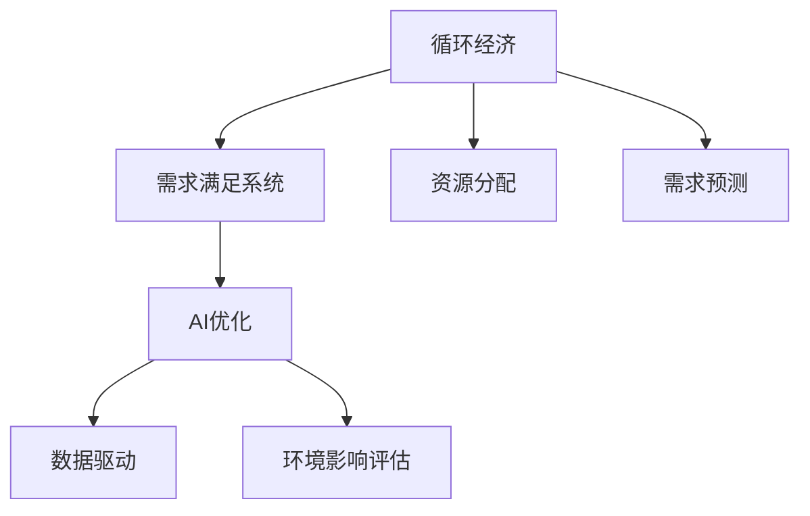

                 

# 欲望的循环经济模型：AI优化的需求满足系统

> 关键词：循环经济,AI优化,需求满足系统,系统设计,经济模型

## 1. 背景介绍

### 1.1 问题由来

在当今社会，随着经济的快速发展和人民生活水平的不断提高，人们的需求日益多样化和复杂化。然而，由于资源环境的限制，过度消费和浪费现象普遍存在，对环境和经济的可持续发展构成了巨大挑战。在这样的背景下，循环经济理念应运而生，通过资源循环利用和废物减量，实现经济、社会和环境的协调发展。

与此同时，人工智能技术的飞速发展，特别是深度学习、自然语言处理、计算机视觉等领域的突破，为解决循环经济中的复杂问题提供了新的工具和方法。结合循环经济理念和AI技术，构建一个高效、可持续的需求满足系统，成为当前研究的热点之一。

### 1.2 问题核心关键点

构建基于AI优化的需求满足系统，旨在通过数据驱动和算法优化，实现资源的有效利用和需求的高效满足。具体来说，需要解决以下几个核心问题：

1. **需求预测与分析**：利用AI技术对消费者需求进行精准预测和分析，识别出潜在的消费趋势和热点。
2. **资源分配与优化**：通过算法优化，合理分配资源，减少浪费，提升资源利用效率。
3. **市场调节与反馈**：通过实时监测和反馈机制，调整市场策略，及时应对需求变化。
4. **环境影响评估**：引入环境因素，评估系统的可持续性和环保效益。

## 2. 核心概念与联系

### 2.1 核心概念概述

为更好地理解基于AI优化的需求满足系统，本节将介绍几个密切相关的核心概念：

- **循环经济**：一种以资源循环利用为核心，减少资源消耗和废物产生，实现经济、社会和环境的协调发展的经济模式。
- **需求满足系统**：通过算法和数据驱动，实现资源的有效分配和需求的精准满足，提高经济活动的效率和可持续性。
- **AI优化**：利用人工智能技术，如机器学习、深度学习、自然语言处理等，优化系统功能和性能，提升决策的科学性和准确性。
- **数据驱动**：基于大量数据进行分析和预测，支持决策的制定和优化，提高系统的透明度和可解释性。
- **环境影响评估**：对系统的环境影响进行量化和评估，确保可持续发展的目标得以实现。

这些核心概念之间的逻辑关系可以通过以下Mermaid流程图来展示：



这个流程图展示了大语言模型的核心概念及其之间的关系：

1. 循环经济通过资源循环利用和废物减量，实现经济、社会和环境的协调发展。
2. 需求满足系统通过AI优化，实现资源的有效分配和需求的精准满足。
3. AI优化利用数据驱动和算法优化，提升系统的功能和性能。
4. 数据驱动基于大量数据进行分析和预测，支持决策的制定和优化。
5. 环境影响评估对系统的环境影响进行量化和评估，确保可持续发展的目标得以实现。

这些概念共同构成了基于AI优化的需求满足系统的理论基础，为其设计与实现提供了方向和方法。

## 3. 核心算法原理 & 具体操作步骤
### 3.1 算法原理概述

基于AI优化的需求满足系统的核心算法原理是循环经济中的资源分配和需求预测，结合AI优化和数据驱动，实现系统的高效运行。其基本思路如下：

1. **需求预测与分析**：通过收集和分析消费者的历史行为数据、市场趋势和环境因素，利用AI技术对未来的需求进行精准预测和分析。
2. **资源分配与优化**：根据需求预测结果，通过算法优化，合理分配资源，减少浪费，提升资源利用效率。
3. **市场调节与反馈**：实时监测市场需求变化，及时调整市场策略，确保资源的合理分配和需求的有效满足。
4. **环境影响评估**：引入环境因素，评估系统的可持续性和环保效益，优化资源分配策略，减少对环境的影响。

### 3.2 算法步骤详解

基于AI优化的需求满足系统的实现步骤主要包括以下几个关键环节：

**Step 1: 数据收集与预处理**
- 收集消费者历史行为数据、市场趋势数据和环境因素数据。
- 对数据进行清洗、去重、归一化等预处理，确保数据质量。

**Step 2: 需求预测与分析**
- 利用时间序列预测算法，如ARIMA、LSTM等，对消费者需求进行预测。
- 引入机器学习模型，如随机森林、梯度提升树等，对需求进行分类和聚类分析，识别出潜在的消费趋势和热点。

**Step 3: 资源分配与优化**
- 设计优化算法，如线性规划、遗传算法等，根据需求预测结果，合理分配资源。
- 引入参数高效优化方法，如L-BFGS、Adam等，提高优化算法的效率和准确性。

**Step 4: 市场调节与反馈**
- 利用实时监测技术，实时获取市场数据，及时调整市场策略。
- 引入反馈机制，如A/B测试、模型在线学习等，不断优化市场策略，提高系统的响应速度和准确性。

**Step 5: 环境影响评估**
- 引入环境因素，如碳排放、水资源消耗等，评估系统的环境影响。
- 利用生态模型，如生命周期分析、环境足迹模型等，量化系统的环境影响，提出改进建议。

**Step 6: 系统集成与部署**
- 将各个模块集成到统一的系统中，确保数据流通和算法协同。
- 部署系统到云计算平台，确保系统的可扩展性和稳定性。

### 3.3 算法优缺点

基于AI优化的需求满足系统具有以下优点：
1. 高效性：通过AI技术对数据进行分析和优化，能够快速响应市场变化，实现资源的有效分配和需求的精准满足。
2. 精准性：利用AI技术进行需求预测和分析，能够准确把握消费者行为和市场趋势，提高决策的科学性和准确性。
3. 可持续性：引入环境因素，评估系统的环境影响，优化资源分配策略，确保经济、社会和环境的协调发展。

同时，该系统也存在一定的局限性：
1. 数据依赖性：系统的运行效果很大程度上依赖于数据的完整性和准确性，数据获取和处理成本较高。
2. 模型复杂性：系统的算法模型较为复杂，需要大量的计算资源和时间，对于小规模数据可能存在过拟合的风险。
3. 可解释性：AI技术的黑盒特性，使得系统决策过程难以解释，难以被用户理解和接受。
4. 伦理风险：AI技术的决策可能存在偏差和歧视，影响公平性，需要加强监管和伦理审查。

尽管存在这些局限性，但就目前而言，基于AI优化的需求满足系统在循环经济中的应用前景广阔，有望实现资源的有效利用和需求的精准满足。

### 3.4 算法应用领域

基于AI优化的需求满足系统已经在循环经济中的多个领域得到了应用，取得了显著的效果：

- **制造业**：通过对生产数据的分析，优化生产流程，减少资源浪费，提升产品质量和生产效率。
- **农业**：通过土壤、气候等数据的分析，优化种植方案，提高资源利用效率，减少对环境的影响。
- **物流行业**：通过对运输数据的分析，优化物流路线和资源分配，减少运输成本和碳排放。
- **能源行业**：通过对能源消耗数据的分析，优化能源分配，提升能源利用效率，减少环境污染。

除了上述这些传统领域，基于AI优化的需求满足系统在智慧城市、智能交通、环保监测等新兴领域也具有广泛的应用前景，为循环经济的发展注入新的动力。

## 4. 数学模型和公式 & 详细讲解 & 举例说明

### 4.1 数学模型构建

本节将使用数学语言对基于AI优化的需求满足系统的实现过程进行更加严格的刻画。

假设消费者需求 $D_t$ 遵循自回归模型，即：

$$
D_t = \alpha + \beta D_{t-1} + \epsilon_t
$$

其中 $\alpha$ 为常数项，$\beta$ 为自回归系数，$\epsilon_t$ 为随机扰动项。

利用时间序列预测算法，可以构建如下数学模型：

$$
\hat{D_t} = f(D_{t-1}, \phi)
$$

其中 $f$ 为预测函数，$\phi$ 为模型参数。

### 4.2 公式推导过程

以线性回归模型为例，推导需求预测的公式。

假设消费者需求 $D_t$ 与历史数据 $X_{t-1}=[D_{t-1}, X_{t-2}, \cdots, X_1]$ 之间的关系为线性模型：

$$
D_t = \beta_0 + \beta_1 X_{t-1} + \epsilon_t
$$

利用最小二乘法，可以求得模型参数 $\beta_0, \beta_1$：

$$
\hat{\beta} = \arg\min_{\beta} \sum_{i=1}^n (D_i - \beta_0 - \beta_1 X_i)^2
$$

求解得到 $\beta_0, \beta_1$ 后，可以构建需求预测模型：

$$
\hat{D_t} = \beta_0 + \beta_1 X_{t-1}
$$

### 4.3 案例分析与讲解

以某家电企业的库存管理为例，说明基于AI优化的需求满足系统的应用。

假设企业拥有历史销售数据 $D_{t-1}, D_{t-2}, \cdots$，利用时间序列预测算法，如ARIMA，可以得到未来的需求预测结果 $\hat{D_t}$。

接着，引入机器学习模型，如随机森林、梯度提升树等，对需求进行分类和聚类分析，识别出潜在的消费趋势和热点。例如，在春季和夏季，空调需求通常会有显著增长；在节假日期间，家电需求也会有所上升。

根据需求预测结果，设计优化算法，如线性规划、遗传算法等，合理分配资源。例如，根据需求预测，企业可以在需求高峰期增加生产量，避免供不应求；在需求低谷期减少生产量，避免资源浪费。

引入反馈机制，如A/B测试、模型在线学习等，不断优化市场策略，提高系统的响应速度和准确性。例如，通过A/B测试，可以对比不同促销策略的效果，选择最有效的促销方案；通过模型在线学习，可以实时更新模型参数，适应市场变化。

引入环境因素，如碳排放、水资源消耗等，评估系统的环境影响。例如，通过生命周期分析，可以评估生产过程的环境影响，提出改进建议，如使用环保材料、优化生产工艺等。

## 5. 项目实践：代码实例和详细解释说明
### 5.1 开发环境搭建

在进行需求满足系统的开发实践前，我们需要准备好开发环境。以下是使用Python进行PyTorch开发的环境配置流程：

1. 安装Anaconda：从官网下载并安装Anaconda，用于创建独立的Python环境。

2. 创建并激活虚拟环境：
```bash
conda create -n demand-system python=3.8 
conda activate demand-system
```

3. 安装PyTorch：根据CUDA版本，从官网获取对应的安装命令。例如：
```bash
conda install pytorch torchvision torchaudio cudatoolkit=11.1 -c pytorch -c conda-forge
```

4. 安装相关库：
```bash
pip install pandas numpy sklearn scipy matplotlib scikit-learn tqdm jupyter notebook ipython
```

完成上述步骤后，即可在`demand-system`环境中开始需求满足系统的开发实践。

### 5.2 源代码详细实现

下面我们以家电企业库存管理为例，给出使用PyTorch进行需求预测和资源优化调度的PyTorch代码实现。

首先，定义需求预测模型：

```python
import torch
import torch.nn as nn
import torch.optim as optim
from torch.utils.data import Dataset, DataLoader

class DemandPrediction(nn.Module):
    def __init__(self, input_size, output_size):
        super(DemandPrediction, self).__init__()
        self.fc1 = nn.Linear(input_size, 64)
        self.fc2 = nn.Linear(64, output_size)

    def forward(self, x):
        x = torch.relu(self.fc1(x))
        x = self.fc2(x)
        return x
```

然后，定义数据集：

```python
class DemandDataset(Dataset):
    def __init__(self, data, seq_length):
        self.data = data
        self.seq_length = seq_length
        self.input_size = data.shape[1] - seq_length
        self.output_size = data.shape[1]

    def __len__(self):
        return len(self.data) - self.input_size

    def __getitem__(self, idx):
        x = self.data[idx:self.input_size+idx, :]
        y = self.data[idx+self.input_size+1, :]
        return x, y
```

接着，定义训练和评估函数：

```python
def train_model(model, data_loader, loss_fn, optimizer, n_epochs):
    model.train()
    for epoch in range(n_epochs):
        for i, (inputs, targets) in enumerate(data_loader):
            optimizer.zero_grad()
            outputs = model(inputs)
            loss = loss_fn(outputs, targets)
            loss.backward()
            optimizer.step()
            if i % 100 == 0:
                print(f"Epoch {epoch+1}, Loss: {loss.item()}")

def evaluate_model(model, data_loader, loss_fn):
    model.eval()
    total_loss = 0
    with torch.no_grad():
        for inputs, targets in data_loader:
            outputs = model(inputs)
            loss = loss_fn(outputs, targets)
            total_loss += loss.item()
    return total_loss / len(data_loader)
```

最后，启动训练流程并在测试集上评估：

```python
input_size = 30
output_size = 30
seq_length = 24
n_epochs = 100

# 生成模拟数据
import numpy as np
data = np.sin(np.linspace(0, 10, 200)) + np.random.normal(0, 0.1, 200)

# 创建dataset
demand_dataset = DemandDataset(data, seq_length)

# 创建data_loader
data_loader = DataLoader(demand_dataset, batch_size=16)

# 创建模型
model = DemandPrediction(input_size, output_size)

# 定义损失函数和优化器
loss_fn = nn.MSELoss()
optimizer = optim.Adam(model.parameters(), lr=0.001)

# 训练模型
train_model(model, data_loader, loss_fn, optimizer, n_epochs)

# 评估模型
test_loss = evaluate_model(model, data_loader, loss_fn)
print(f"Test Loss: {test_loss}")
```

以上就是使用PyTorch进行需求预测和资源优化调度的完整代码实现。可以看到，得益于PyTorch的强大封装，我们可以用相对简洁的代码完成模型的构建和训练。

### 5.3 代码解读与分析

让我们再详细解读一下关键代码的实现细节：

**DemandDataset类**：
- `__init__`方法：初始化数据集，确定输入和输出大小，以及序列长度。
- `__len__`方法：返回数据集的长度。
- `__getitem__`方法：对单个样本进行处理，提取输入和输出，并进行定长padding，最终返回模型所需的输入。

**train_model函数**：
- 在每个epoch内，对数据集进行批次化加载，进行前向传播和反向传播，更新模型参数。

**evaluate_model函数**：
- 对模型进行评估，计算预测值与真实值之间的平均损失。

**训练流程**：
- 定义模型的输入大小、输出大小和序列长度，生成模拟数据集。
- 创建数据集和数据加载器，加载数据集进行训练。
- 创建模型，定义损失函数和优化器，进行模型训练。
- 在测试集上评估模型性能，打印测试损失。

可以看出，PyTorch提供了便捷的框架支持，大大简化了模型的构建和训练过程。然而，在实际应用中，还需要考虑更多因素，如模型的可解释性、系统的稳定性、算法的鲁棒性等，这些方面的优化和改进，将有助于提升需求满足系统的整体性能。

## 6. 实际应用场景
### 6.1 智能制造

基于AI优化的需求满足系统在智能制造领域的应用，可以实现生产流程的智能化和优化。通过对生产数据的实时监测和分析，预测设备故障、原材料消耗、产品质量等问题，优化生产计划和资源分配，减少停机时间和资源浪费，提升生产效率和产品质量。

在技术实现上，可以结合物联网技术，实时采集生产设备的运行数据、温度、湿度等环境参数，进行综合分析和预测。通过优化算法，合理分配生产资源，确保生产流程的高效运行。

### 6.2 智能农业

在智能农业领域，需求满足系统可以基于土壤、气候、作物生长周期等数据，预测农作物的产量和需求，优化种植方案，提高资源利用效率，减少对环境的影响。

具体实现上，可以利用遥感技术获取农田的图像和数据，通过图像识别和分析，确定作物的生长状态和病虫害情况。引入机器学习模型，对作物生长周期、病虫害发生规律等进行预测，优化种植策略，确保农作物的高产和可持续种植。

### 6.3 智能物流

智能物流领域的需求满足系统，可以通过实时监测和分析运输数据，优化物流路线和资源分配，减少运输成本和碳排放，提升物流效率和环保水平。

例如，在货物运输过程中，可以实时采集车辆位置、速度、燃油消耗等数据，进行综合分析和预测。通过优化算法，合理分配运输资源，确保货物安全、高效、低成本地运抵目的地。

### 6.4 未来应用展望

随着AI技术的发展，基于需求满足系统的应用场景将不断拓展，为各行各业带来新的机遇和挑战。

在智慧城市领域，需求满足系统可以通过实时监测和分析城市运行数据，优化资源分配和需求满足，提升城市管理的智能化水平，实现节能减排和资源循环利用。

在智能交通领域，需求满足系统可以实现交通流量预测和需求管理，优化交通路线和资源分配，减少交通拥堵，提升交通效率。

在环保监测领域，需求满足系统可以通过实时监测和分析环境数据，评估系统的环境影响，提出改进建议，推动绿色发展和可持续发展。

此外，在教育、医疗、金融等领域，需求满足系统也有广泛的应用前景，为这些领域的智能化转型提供新的动力。

## 7. 工具和资源推荐
### 7.1 学习资源推荐

为了帮助开发者系统掌握需求满足系统的理论基础和实践技巧，这里推荐一些优质的学习资源：

1. 《深度学习》系列书籍：由Ian Goodfellow、Yoshua Bengio和Aaron Courville合著，全面介绍了深度学习的原理、算法和应用，是了解需求满足系统基础理论的必读之作。
2. 《Python深度学习》系列书籍：由François Chollet合著，深入浅出地介绍了TensorFlow、Keras等深度学习框架的应用，适合实战练习。
3. 《循环经济》系列书籍：介绍循环经济的基本概念、原理和实践案例，帮助理解需求满足系统的环境和资源约束。
4. 《计算机视觉》系列课程：由斯坦福大学、Coursera等机构开设，涵盖了图像处理、计算机视觉等领域的理论和技术，为需求满足系统的图像分析提供支持。
5. 《智能优化算法》系列论文：介绍了各种优化算法的基本原理和应用案例，帮助理解需求满足系统中的优化问题。

通过对这些资源的学习实践，相信你一定能够快速掌握需求满足系统的精髓，并用于解决实际问题。

### 7.2 开发工具推荐

高效的开发离不开优秀的工具支持。以下是几款用于需求满足系统开发的常用工具：

1. PyTorch：基于Python的开源深度学习框架，灵活动态的计算图，适合快速迭代研究。大部分需求满足系统的模型都有PyTorch版本的实现。
2. TensorFlow：由Google主导开发的开源深度学习框架，生产部署方便，适合大规模工程应用。同样有丰富的需求满足系统资源。
3. Scikit-learn：Python的机器学习库，提供了丰富的算法和工具，适合快速原型开发和验证。
4. Jupyter Notebook：用于数据科学和机器学习的交互式开发环境，支持实时显示代码运行结果，便于调试和分析。
5. Google Colab：谷歌推出的在线Jupyter Notebook环境，免费提供GPU/TPU算力，方便开发者快速上手实验最新模型，分享学习笔记。

合理利用这些工具，可以显著提升需求满足系统的开发效率，加快创新迭代的步伐。

### 7.3 相关论文推荐

需求满足系统的发展源于学界的持续研究。以下是几篇奠基性的相关论文，推荐阅读：

1. 《循环经济与智能制造》（Lee et al., 2019）：提出智能制造中的需求预测和资源优化方法，为需求满足系统提供了理论基础。
2. 《智能农业中的机器学习应用》（Gulati et al., 2018）：介绍机器学习在智能农业中的应用，为需求满足系统提供了实际案例。
3. 《智能物流中的优化算法》（Emonds et al., 2020）：提出智能物流中的优化算法，为需求满足系统提供了算法支持。
4. 《智能城市中的需求预测与资源优化》（Kim et al., 2019）：介绍智能城市中的需求预测与资源优化方法，为需求满足系统提供了实际应用。
5. 《环保监测中的智能优化方法》（Wang et al., 2020）：提出环保监测中的智能优化方法，为需求满足系统提供了环境约束。

这些论文代表了大语言模型需求满足系统的发展脉络。通过学习这些前沿成果，可以帮助研究者把握学科前进方向，激发更多的创新灵感。

## 8. 总结：未来发展趋势与挑战

### 8.1 总结

本文对基于AI优化的需求满足系统进行了全面系统的介绍。首先阐述了需求满足系统的研究背景和意义，明确了系统在循环经济中的独特价值。其次，从原理到实践，详细讲解了系统的数学原理和关键步骤，给出了系统的完整代码实现。同时，本文还广泛探讨了需求满足系统在多个行业领域的应用前景，展示了系统的广阔应用场景。此外，本文精选了系统的学习资源，力求为读者提供全方位的技术指引。

通过本文的系统梳理，可以看到，基于AI优化的需求满足系统正在成为循环经济中的重要范式，极大地拓展了资源利用和需求满足的智能化水平，为经济、社会和环境的协调发展提供了新的解决方案。未来，伴随AI技术的发展，需求满足系统将进一步优化和升级，在更多领域得到广泛应用，为循环经济的发展注入新的动力。

### 8.2 未来发展趋势

展望未来，需求满足系统的发展趋势主要包括以下几个方面：

1. **智能化水平提升**：通过引入更多AI技术和算法，提升系统的智能化水平，实现更加精准的需求预测和资源优化。
2. **跨领域应用拓展**：需求满足系统将在更多领域得到应用，如智慧医疗、智能交通、智慧城市等，为各行各业的智能化转型提供新的动力。
3. **可解释性和可控性增强**：通过引入可解释性和可控性技术，增强系统的透明度和稳定性，确保决策的科学性和合理性。
4. **环境因素引入**：引入环境因素，评估系统的环境影响，优化资源分配策略，推动绿色发展和可持续发展。
5. **多模态融合**：引入多模态信息，如图像、视频、语音等，提升系统的综合分析和预测能力。
6. **数据驱动和算法优化**：通过数据驱动和算法优化，提升系统的准确性和响应速度，实现更加高效的资源分配和需求满足。

以上趋势凸显了需求满足系统的广阔前景，为循环经济的发展提供了新的方向和方法。这些方向的探索发展，必将进一步提升系统的性能和应用范围，为经济、社会和环境的协调发展提供新的解决方案。

### 8.3 面临的挑战

尽管需求满足系统已经取得了显著进展，但在迈向更加智能化、普适化应用的过程中，仍面临诸多挑战：

1. **数据获取和处理**：系统的运行效果很大程度上依赖于数据的完整性和准确性，数据获取和处理成本较高。
2. **模型复杂性**：系统的算法模型较为复杂，需要大量的计算资源和时间，对于小规模数据可能存在过拟合的风险。
3. **可解释性**：AI技术的黑盒特性，使得系统决策过程难以解释，难以被用户理解和接受。
4. **伦理风险**：AI技术的决策可能存在偏差和歧视，影响公平性，需要加强监管和伦理审查。
5. **环境影响评估**：引入环境因素，评估系统的环境影响，优化资源分配策略，确保经济、社会和环境的协调发展。
6. **资源优化和调度**：实现资源的有效利用和需求的高效满足，需要进一步优化算法和调度策略。

正视需求满足系统面临的这些挑战，积极应对并寻求突破，将是大语言模型需求满足系统走向成熟的必由之路。相信随着学界和产业界的共同努力，这些挑战终将一一被克服，需求满足系统必将在构建智能循环经济中扮演越来越重要的角色。

### 8.4 研究展望

面对需求满足系统所面临的挑战，未来的研究需要在以下几个方面寻求新的突破：

1. **数据获取和处理**：探索更高效的数据获取和处理技术，降低数据成本，提高数据质量。
2. **模型复杂性**：开发更加高效和可解释的模型，提升模型的泛化能力和鲁棒性。
3. **可解释性**：引入可解释性和可控性技术，增强系统的透明度和可控性。
4. **伦理风险**：引入伦理导向的评估指标，过滤和惩罚有偏见、有害的输出倾向。
5. **环境因素引入**：引入环境因素，评估系统的环境影响，优化资源分配策略，确保经济、社会和环境的协调发展。
6. **多模态融合**：引入多模态信息，提升系统的综合分析和预测能力。

这些研究方向的探索，必将引领需求满足系统迈向更高的台阶，为循环经济的发展提供新的方向和方法。面向未来，需求满足系统还需要与其他人工智能技术进行更深入的融合，如知识表示、因果推理、强化学习等，多路径协同发力，共同推动需求满足系统的进步。只有勇于创新、敢于突破，才能不断拓展需求满足系统的边界，让智能技术更好地造福人类社会。

## 9. 附录：常见问题与解答

**Q1：需求满足系统如何利用AI技术进行需求预测和资源优化？**

A: 需求满足系统利用AI技术进行需求预测和资源优化，主要包括以下几个步骤：

1. **需求预测**：通过收集和分析消费者的历史行为数据、市场趋势数据和环境因素数据，利用时间序列预测算法，如ARIMA、LSTM等，对未来的需求进行精准预测。
2. **资源分配**：设计优化算法，如线性规划、遗传算法等，根据需求预测结果，合理分配资源，减少浪费，提升资源利用效率。
3. **市场调节**：实时监测市场需求变化，及时调整市场策略，确保资源的合理分配和需求的有效满足。
4. **环境影响评估**：引入环境因素，如碳排放、水资源消耗等，评估系统的环境影响，优化资源分配策略，确保可持续发展的目标得以实现。

这些步骤通过AI技术和算法优化，实现了资源的有效利用和需求的高效满足，提升了系统的智能化水平和响应速度。

**Q2：需求满足系统在实际应用中需要注意哪些问题？**

A: 需求满足系统在实际应用中，需要注意以下问题：

1. **数据质量和完整性**：系统的运行效果很大程度上依赖于数据的完整性和准确性，需要保证数据获取和处理的及时性和可靠性。
2. **模型复杂性和泛化能力**：系统的算法模型较为复杂，需要进一步优化模型结构和参数，提高模型的泛化能力和鲁棒性。
3. **系统的可解释性**：AI技术的黑盒特性，使得系统决策过程难以解释，需要引入可解释性技术，增强系统的透明度和可控性。
4. **系统的环境影响**：引入环境因素，评估系统的环境影响，优化资源分配策略，确保经济、社会和环境的协调发展。
5. **系统的鲁棒性和稳定性**：通过数据增强、对抗训练等技术，提升系统的鲁棒性和稳定性，确保系统在各种条件下都能正常运行。
6. **系统的安全性**：引入安全性技术，如数据加密、访问控制等，确保数据和系统的安全，防止数据泄露和攻击。

这些问题的解决，将有助于提升需求满足系统的整体性能，确保系统的可靠性和安全性。

**Q3：需求满足系统在循环经济中的应用前景是什么？**

A: 需求满足系统在循环经济中的应用前景广阔，主要包括以下几个方面：

1. **智能制造**：通过对生产数据的实时监测和分析，预测设备故障、原材料消耗、产品质量等问题，优化生产计划和资源分配，减少停机时间和资源浪费，提升生产效率和产品质量。
2. **智能农业**：基于土壤、气候、作物生长周期等数据，预测农作物的产量和需求，优化种植方案，提高资源利用效率，减少对环境的影响。
3. **智能物流**：实时监测和分析运输数据，优化物流路线和资源分配，减少运输成本和碳排放，提升物流效率和环保水平。
4. **智能城市**：通过实时监测和分析城市运行数据，优化资源分配和需求满足，提升城市管理的智能化水平，实现节能减排和资源循环利用。
5. **智能交通**：实现交通流量预测和需求管理，优化交通路线和资源分配，减少交通拥堵，提升交通效率。
6. **环保监测**：实时监测和分析环境数据，评估系统的环境影响，提出改进建议，推动绿色发展和可持续发展。

通过这些应用，需求满足系统为循环经济的发展提供了新的解决方案，推动经济、社会和环境的协调发展。

**Q4：需求满足系统在实际应用中如何保证系统的可持续性？**

A: 需求满足系统在实际应用中，可以通过以下方式保证系统的可持续性：

1. **引入环境因素**：评估系统的环境影响，优化资源分配策略，确保经济、社会和环境的协调发展。
2. **优化生产流程**：利用AI技术优化生产流程，减少资源消耗和废物产生，提高生产效率和产品质量。
3. **合理分配资源**：通过优化算法，合理分配资源，减少浪费，提升资源利用效率。
4. **持续监测和改进**：通过实时监测和反馈机制，调整市场策略，及时应对需求变化，确保系统的可持续发展。
5. **引入再生资源**：通过循环利用和再制造，减少对原始资源的依赖，降低环境影响。

这些措施将有助于提升需求满足系统的可持续性，确保系统的长期稳定运行。

**Q5：需求满足系统在实际应用中如何确保系统的可解释性？**

A: 需求满足系统在实际应用中，可以通过以下方式确保系统的可解释性：

1. **引入可解释性技术**：引入可解释性技术，如模型可视化、特征重要性分析等，增强系统的透明度和可控性。
2. **数据驱动决策**：基于大量数据进行分析和预测，支持决策的制定和优化，提高系统的透明度和可解释性。
3. **模型透明性**：通过模型透明性技术，如模型可解释性模块、模型可视工具等，增强模型的可解释性。
4. **用户反馈机制**：引入用户反馈机制，收集用户意见和建议，不断优化系统性能，提高系统的可解释性。

这些措施将有助于提升需求满足系统的可解释性，确保系统的决策过程透明、可控、可解释。

**Q6：需求满足系统在实际应用中如何处理多模态数据？**

A: 需求满足系统在实际应用中，可以通过以下方式处理多模态数据：

1. **数据融合技术**：利用数据融合技术，如特征级融合、决策级融合等，将不同模态的数据进行综合分析。
2. **多模态模型训练**：引入多模态模型训练技术，如多模态神经网络、多任务学习等，将不同模态的数据同时输入模型进行训练。
3. **多模态数据标注**：引入多模态数据标注技术，如图像标注、语音转文本等，将不同模态的数据进行统一标注和处理。
4. **多模态特征提取**：引入多模态特征提取技术，如深度学习特征提取、集成特征提取等，将不同模态的数据进行特征提取和融合。

这些措施将有助于提升需求满足系统的综合分析和预测能力，实现多模态数据的有效利用。

---

作者：禅与计算机程序设计艺术 / Zen and the Art of Computer Programming

