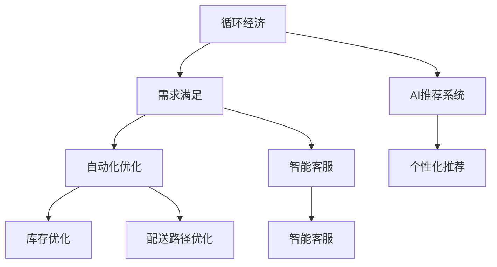

                 

# 欲望的循环经济：AI优化的需求满足

> 关键词：循环经济,人工智能,需求满足,自动化优化,智能推荐,个性化服务,数据驱动

## 1. 背景介绍

### 1.1 问题由来
在当今快速发展的经济社会中，消费者的需求日益多样化、个性化。传统的供应与需求匹配机制面临着效率低下、响应慢、个性化缺失等挑战。而循环经济，作为一种环保和可持续发展的模式，强调资源的循环利用和再生利用，减少资源浪费和环境污染。将AI技术应用于需求满足，特别是结合循环经济的理念，可以创造出更加智能化、高效、环保的需求匹配解决方案。

### 1.2 问题核心关键点
AI在需求满足中的应用主要集中在以下几个关键点：

- **个性化推荐**：通过分析用户行为和偏好，提供个性化商品或服务推荐。
- **自动化优化**：利用算法自动化优化库存和配送路径，提高资源利用率。
- **智能客服**：通过自然语言处理技术，实现全天候的智能客服，提升用户体验。
- **数据驱动决策**：通过大数据分析，实时调整生产、库存和营销策略，以适应市场变化。

AI在这些方面的应用，不仅提升了效率和用户体验，也促进了资源的循环利用，推动了循环经济的发展。但如何有效地结合AI技术与循环经济理念，构建智能化的需求满足系统，仍然是一个值得深入探索的问题。

### 1.3 问题研究意义
研究和实践AI在需求满足中的应用，对于提升市场效率、减少资源浪费、推动绿色经济具有重要意义。具体而言：

1. **提升效率**：AI的智能推荐和自动化优化能力，可以显著提高需求匹配和供应链管理的效率。
2. **环保效益**：智能化的库存和配送系统，能够减少库存积压和运输能耗，促进环保。
3. **用户满意度**：个性化的需求满足方式，提升用户满意度，促进消费者忠诚度。
4. **经济增长**：通过数据分析和预测，引导企业精准投放资源，实现经济增长。

本文将从AI的个性化推荐和自动化优化两个方面，探讨如何结合循环经济理念，优化需求满足过程，构建智能化的循环经济需求匹配系统。

## 2. 核心概念与联系

### 2.1 核心概念概述

为更好地理解AI在需求满足中的应用，本节将介绍几个密切相关的核心概念：

- **循环经济**：一种以资源循环利用和再生利用为核心，减少资源浪费和环境污染的经济模式。
- **需求满足**：通过供应和需求匹配，实现资源的最优配置和利用。
- **AI推荐系统**：利用机器学习、自然语言处理等技术，为用户提供个性化的商品或服务推荐。
- **自动化优化**：利用算法和AI技术，自动优化库存、配送路径等资源配置。
- **智能客服**：通过自然语言处理和机器学习，实现智能化的客户服务。

这些概念之间的逻辑关系可以通过以下Mermaid流程图来展示：



这个流程图展示了循环经济、需求满足与AI技术的关联：

1. 循环经济强调资源的循环利用和再生利用，减少资源浪费。
2. 需求满足通过供应和需求匹配，实现资源的最优配置。
3. AI推荐系统提供个性化商品或服务推荐，提升用户体验。
4. 自动化优化系统利用算法自动优化库存和配送路径，提高资源利用率。
5. 智能客服提供全天候的智能服务，提升用户满意度。

这些概念共同构成了AI在需求满足中的应用框架，使其能够高效地支持循环经济的发展。通过理解这些核心概念，我们可以更好地把握AI技术在需求满足中的应用方向和优化路径。

## 3. 核心算法原理 & 具体操作步骤
### 3.1 算法原理概述

AI在需求满足中的应用，主要体现在两个方面：个性化推荐和自动化优化。这两者均基于机器学习算法，通过数据分析和模式识别，实现对需求和供给的智能匹配。

#### 3.1.1 个性化推荐

个性化推荐系统通过分析用户的历史行为和偏好，预测用户可能感兴趣的商品或服务，并实时推荐给用户。其核心思想是利用协同过滤、基于内容的推荐、深度学习等技术，建立用户与商品之间的兴趣关系。

#### 3.1.2 自动化优化

自动化优化系统通过优化库存、配送路径等，提高资源利用率和效率。其核心算法包括遗传算法、模拟退火、蚁群算法等，利用算法优化模型的目标函数，自动寻找最优解。

### 3.2 算法步骤详解

#### 3.2.1 个性化推荐系统

**Step 1: 数据收集与预处理**
- 收集用户的历史行为数据，包括浏览记录、购买记录、评价信息等。
- 对数据进行清洗和归一化，去除噪声和不相关数据。

**Step 2: 特征提取与建模**
- 提取用户和商品的关键特征，如用户年龄、性别、兴趣标签，商品类别、价格、评价等。
- 利用协同过滤、基于内容的推荐、深度学习等算法，建立推荐模型。

**Step 3: 模型训练与评估**
- 在标注数据集上训练推荐模型，优化模型参数。
- 在验证集上评估模型性能，调整模型参数。

**Step 4: 实时推荐**
- 在用户实时请求时，根据当前数据和模型，生成推荐列表。

#### 3.2.2 自动化优化系统

**Step 1: 数据收集与预处理**
- 收集供应链的相关数据，包括库存量、订单量、配送路径、交通状况等。
- 对数据进行清洗和归一化，去除噪声和不相关数据。

**Step 2: 建模与优化**
- 建立库存优化和配送路径优化的数学模型。
- 使用遗传算法、模拟退火、蚁群算法等优化算法，求解目标函数，寻找最优解。

**Step 3: 系统集成与部署**
- 将优化结果集成到供应链管理系统中，自动调整库存和配送路径。
- 进行系统测试，确保算法可靠性和稳定性。

### 3.3 算法优缺点

#### 3.3.1 个性化推荐系统

**优点**：
1. **高效性**：自动化推荐过程，快速响应用户需求。
2. **个性化**：基于用户历史行为和兴趣，提供个性化推荐。
3. **成本低**：无需人工干预，减少人力成本。

**缺点**：
1. **数据依赖**：推荐效果高度依赖于数据质量。
2. **冷启动问题**：新用户或新商品难以获得推荐。
3. **隐私风险**：用户数据隐私问题难以完全解决。

#### 3.3.2 自动化优化系统

**优点**：
1. **自动化**：自动优化库存和配送路径，提高效率。
2. **成本节约**：减少库存积压和运输能耗，降低成本。
3. **可扩展性**：适用于大规模供应链系统。

**缺点**：
1. **模型复杂**：优化模型通常较为复杂，计算资源需求高。
2. **参数调优**：需要手动调整参数，可能影响优化结果。
3. **局部最优**：优化算法可能陷入局部最优，难以找到全局最优解。

### 3.4 算法应用领域

#### 3.4.1 电商领域

在电商领域，个性化推荐和自动化优化技术广泛应用。电商网站通过推荐系统，提高用户购买率和复购率，通过优化库存和配送路径，提高物流效率和减少库存成本。

#### 3.4.2 物流行业

物流行业通过优化配送路径，降低运输成本，提高配送效率。智能仓库管理系统通过自动化优化，实现库存的智能补货和调拨。

#### 3.4.3 制造企业

制造企业通过AI优化生产计划和供应链管理，提高生产效率和资源利用率。智能客服系统提供24小时服务，提升客户满意度。

## 4. 数学模型和公式 & 详细讲解 & 举例说明

### 4.1 数学模型构建

#### 4.1.1 个性化推荐系统

推荐系统通常基于用户-物品矩阵 $\mathbf{R} \in \mathbb{R}^{N \times M}$，其中 $N$ 为用户的数量，$M$ 为物品的数量，$R_{ij}$ 表示用户 $i$ 对物品 $j$ 的评分（或预测评分）。假设模型为 $\hat{R}_{ij}$，通过优化损失函数 $\mathcal{L}(\mathbf{R},\mathbf{R}')$，使得 $\hat{R}_{ij}$ 逼近 $R_{ij}$。

#### 4.1.2 自动化优化系统

自动化优化系统通常基于库存和配送路径的数学模型，如最小化库存量或配送成本。以库存优化为例，目标函数为：

$$
\min_{x_i} \sum_{i=1}^{N} \sum_{j=1}^{M} c_{ij} x_i
$$

其中 $c_{ij}$ 为第 $i$ 个仓库和第 $j$ 个需求点的单位配送成本，$x_i$ 为第 $i$ 个仓库的配送量。约束条件包括：

1. 每个仓库的库存量不超过上限 $Q_i$
2. 每个仓库的配送量满足需求 $x_i \geq d_i$
3. 每个仓库的库存和配送量非负 $x_i \geq 0$

### 4.2 公式推导过程

#### 4.2.1 个性化推荐系统

假设推荐模型为 $\hat{R}_{ij} = f_k(u_i,v_j)$，其中 $u_i$ 为用户 $i$ 的特征向量，$v_j$ 为物品 $j$ 的特征向量，$f_k$ 为模型的映射函数。

推荐系统的损失函数通常为均方误差（MSE）或平均绝对误差（MAE）：

$$
\mathcal{L} = \frac{1}{N \times M} \sum_{i=1}^{N} \sum_{j=1}^{M} (R_{ij} - \hat{R}_{ij})^2
$$

利用梯度下降等优化算法，求解最小化损失函数，更新模型参数：

$$
\mathbf{R}_{ij} = \mathbf{R}_{ij} - \eta \nabla_{\mathbf{R}} \mathcal{L}
$$

#### 4.2.2 自动化优化系统

以库存优化为例，遗传算法（GA）的核心步骤包括：

1. **初始化种群**：随机生成初始种群 $\mathbf{X}_0$，其中每个个体 $x_i$ 表示仓库的配送量。
2. **评估适应度**：计算每个个体的适应度值，即库存优化目标函数的值。
3. **选择**：根据适应度值选择个体，生成下一代种群 $\mathbf{X}_1$。
4. **交叉**：通过交叉操作生成新个体，生成下一代种群 $\mathbf{X}_2$。
5. **变异**：通过变异操作引入新的个体，生成下一代种群 $\mathbf{X}_3$。
6. **终止条件**：当满足终止条件（如达到迭代次数、目标函数收敛等），选择最优个体作为最终解。

### 4.3 案例分析与讲解

#### 4.3.1 电商推荐系统

某电商平台利用协同过滤算法建立推荐系统。通过收集用户的历史浏览记录和购买记录，建立用户-物品矩阵 $\mathbf{R} \in \mathbb{R}^{N \times M}$。

采用ALS（交替最小二乘）算法，优化模型参数：

$$
\min_{\mathbf{P},\mathbf{Q}} \sum_{i=1}^{N} \sum_{j=1}^{M} (R_{ij} - \mathbf{p}_i^T \mathbf{q}_j)^2
$$

其中 $\mathbf{P} \in \mathbb{R}^{N \times K}$ 为用户的特征矩阵，$\mathbf{Q} \in \mathbb{R}^{M \times K}$ 为物品的特征矩阵，$K$ 为特征向量的维度。

#### 4.3.2 物流配送优化

某物流公司利用遗传算法优化配送路径。通过收集供应链的相关数据，建立库存优化模型，如：

$$
\min_{x_i} \sum_{i=1}^{N} \sum_{j=1}^{M} c_{ij} x_i
$$

其中 $c_{ij}$ 为第 $i$ 个仓库和第 $j$ 个需求点的单位配送成本，$x_i$ 为第 $i$ 个仓库的配送量。

设置约束条件，求解最优解。遗传算法通过交叉和变异操作，逐步迭代优化，最终找到最优解。

## 5. 项目实践：代码实例和详细解释说明

### 5.1 开发环境搭建

在进行AI需求满足的实践前，我们需要准备好开发环境。以下是使用Python进行PyTorch和TensorFlow开发的环境配置流程：

1. 安装Anaconda：从官网下载并安装Anaconda，用于创建独立的Python环境。

2. 创建并激活虚拟环境：
```bash
conda create -n pytorch-env python=3.8 
conda activate pytorch-env
```

3. 安装PyTorch和TensorFlow：根据CUDA版本，从官网获取对应的安装命令。例如：
```bash
conda install pytorch torchvision torchaudio cudatoolkit=11.1 -c pytorch -c conda-forge
conda install tensorflow -c conda-forge
```

4. 安装相关库：
```bash
pip install pandas scikit-learn matplotlib tqdm jupyter notebook ipython
```

完成上述步骤后，即可在`pytorch-env`环境中开始实践。

### 5.2 源代码详细实现

下面我们以电商推荐系统为例，给出使用TensorFlow实现个性化推荐系统的PyTorch代码实现。

首先，定义推荐模型的输入和输出：

```python
import tensorflow as tf

# 定义模型的输入和输出
inputs = tf.keras.Input(shape=(n_features,))
outputs = tf.keras.layers.Dense(1, activation='sigmoid')(inputs)
model = tf.keras.Model(inputs, outputs)
```

然后，定义损失函数和优化器：

```python
# 定义损失函数
loss_fn = tf.keras.losses.BinaryCrossentropy()

# 定义优化器
optimizer = tf.keras.optimizers.Adam()
```

接着，定义训练和评估函数：

```python
# 定义训练函数
def train_step(inputs, targets):
    with tf.GradientTape() as tape:
        predictions = model(inputs)
        loss = loss_fn(targets, predictions)
    gradients = tape.gradient(loss, model.trainable_variables)
    optimizer.apply_gradients(zip(gradients, model.trainable_variables))
    return loss

# 定义评估函数
def evaluate_step(inputs, targets):
    predictions = model(inputs)
    loss = loss_fn(targets, predictions)
    return loss
```

最后，启动训练流程并在测试集上评估：

```python
# 加载数据集
train_data = ...
test_data = ...

# 训练模型
for epoch in range(num_epochs):
    for (inputs, targets) in train_data:
        loss = train_step(inputs, targets)
    for (inputs, targets) in test_data:
        loss = evaluate_step(inputs, targets)
    print(f'Epoch {epoch+1}, train loss: {loss:.4f}, test loss: {test_loss:.4f}')
```

以上就是使用TensorFlow实现个性化推荐系统的完整代码实现。可以看到，TensorFlow提供了便捷的高层次API，使得模型构建和训练过程更加高效。

### 5.3 代码解读与分析

让我们再详细解读一下关键代码的实现细节：

**inputs和outputs定义**：
- 使用`tf.keras.Input`定义输入层的维度，即用户和物品的特征。
- 通过`tf.keras.layers.Dense`层，定义一个线性层作为输出层，输出用户对物品的评分预测值。

**损失函数和优化器定义**：
- 使用`tf.keras.losses.BinaryCrossentropy`定义二元交叉熵损失函数，用于优化模型。
- 使用`tf.keras.optimizers.Adam`定义Adam优化器，用于更新模型参数。

**训练和评估函数定义**：
- 在`train_step`函数中，使用`tf.GradientTape`记录梯度，并使用`optimizer.apply_gradients`更新模型参数。
- 在`evaluate_step`函数中，计算模型在测试集上的损失，用于评估模型性能。

**训练流程**：
- 在循环迭代中，对于每个epoch，分别在训练集和测试集上进行前向传播和反向传播。
- 输出训练集和测试集的损失，评估模型效果。

可以看出，TensorFlow的高级API大大简化了模型构建和训练的代码实现，使得开发者可以更加专注于模型设计和算法优化。

当然，工业级的系统实现还需考虑更多因素，如模型的保存和部署、超参数的自动搜索、多模型的集成等。但核心的推荐算法基本与此类似。

## 6. 实际应用场景
### 6.1 电商推荐系统

电商推荐系统已经成为电商平台的核心功能之一。通过个性化推荐，电商平台能够提高用户满意度和复购率，增加销售额。同时，通过自动化库存和配送路径优化，平台能够提高运营效率，降低成本。

具体实现上，电商推荐系统通常由以下几个模块构成：

1. **用户画像生成模块**：通过分析用户的历史行为数据，生成用户的兴趣画像。
2. **商品画像生成模块**：通过分析商品的属性和用户评价，生成商品的属性画像。
3. **推荐模块**：利用协同过滤、基于内容的推荐等算法，生成个性化推荐列表。
4. **库存和配送优化模块**：利用优化算法，自动调整库存和配送路径，提高资源利用率。

### 6.2 物流配送优化

物流行业对配送路径和库存的优化，能够显著提高配送效率和减少运输成本。通过自动化优化系统，物流公司能够实时调整配送路径和库存，确保订单及时送达。

具体实现上，物流配送优化系统通常由以下几个模块构成：

1. **需求预测模块**：通过历史订单数据，预测未来的需求量。
2. **库存管理模块**：根据需求预测，自动调整库存，确保库存充足。
3. **配送路径优化模块**：利用优化算法，自动调整配送路径，降低运输成本。
4. **实时调度模块**：实时监控配送情况，动态调整配送计划。

### 6.3 智能客服系统

智能客服系统能够24小时提供优质的客户服务，提升用户满意度。通过自然语言处理技术，智能客服能够理解用户的问题，提供合适的回答。

具体实现上，智能客服系统通常由以下几个模块构成：

1. **意图识别模块**：通过自然语言处理技术，识别用户的问题意图。
2. **知识库查询模块**：根据用户问题，查询知识库中的相关信息。
3. **回答生成模块**：根据知识库查询结果，生成合适的回答。
4. **对话管理模块**：通过对话管理策略，保持对话连贯性。

## 7. 工具和资源推荐
### 7.1 学习资源推荐

为了帮助开发者系统掌握AI在需求满足中的应用，这里推荐一些优质的学习资源：

1. 《深度学习推荐系统》书籍：全面介绍了推荐系统的理论基础和经典算法，包括协同过滤、基于内容的推荐、深度学习等。
2. CS294课程：斯坦福大学开设的推荐系统课程，涵盖了推荐系统的基础理论和最新进展。
3. TensorFlow官方文档：TensorFlow的官方文档，提供了丰富的API和代码示例，方便快速上手。
4. PyTorch官方文档：PyTorch的官方文档，提供了详细的API和教程，支持深度学习模型的开发。
5. Weights & Biases：模型训练的实验跟踪工具，可以记录和可视化模型训练过程中的各项指标，方便对比和调优。

通过对这些资源的学习实践，相信你一定能够快速掌握AI技术在需求满足中的应用，并用于解决实际的业务问题。

### 7.2 开发工具推荐

高效的开发离不开优秀的工具支持。以下是几款用于AI需求满足开发的常用工具：

1. TensorFlow：由Google主导开发的开源深度学习框架，生产部署方便，适合大规模工程应用。
2. PyTorch：基于Python的开源深度学习框架，灵活动态的计算图，适合快速迭代研究。
3. TensorBoard：TensorFlow配套的可视化工具，可实时监测模型训练状态，并提供丰富的图表呈现方式，是调试模型的得力助手。
4. Weights & Biases：模型训练的实验跟踪工具，可以记录和可视化模型训练过程中的各项指标，方便对比和调优。
5. Jupyter Notebook：基于Python的交互式开发环境，方便进行模型实验和数据可视化。

合理利用这些工具，可以显著提升AI需求满足的开发效率，加快创新迭代的步伐。

### 7.3 相关论文推荐

AI在需求满足中的应用源于学界的持续研究。以下是几篇奠基性的相关论文，推荐阅读：

1. Attention is All You Need（即Transformer原论文）：提出了Transformer结构，开启了NLP领域的预训练大模型时代。
2. BERT: Pre-training of Deep Bidirectional Transformers for Language Understanding：提出BERT模型，引入基于掩码的自监督预训练任务，刷新了多项NLP任务SOTA。
3. Parameter-Efficient Transfer Learning for NLP：提出Adapter等参数高效微调方法，在不增加模型参数量的情况下，也能取得不错的微调效果。
4. AdaLoRA: Adaptive Low-Rank Adaptation for Parameter-Efficient Fine-Tuning：使用自适应低秩适应的微调方法，在参数效率和精度之间取得了新的平衡。
5. AutoRec: Automated Feature Engineering for Recommendation Systems：提出自动化特征工程算法，提升推荐系统的准确性和泛化能力。

这些论文代表了大语言模型微调技术的发展脉络。通过学习这些前沿成果，可以帮助研究者把握学科前进方向，激发更多的创新灵感。

## 8. 总结：未来发展趋势与挑战

### 8.1 总结

本文对AI在需求满足中的应用进行了全面系统的介绍。首先阐述了循环经济和AI技术在需求满足中的应用背景，明确了个性化推荐和自动化优化在提升市场效率和环保效益方面的重要意义。其次，从原理到实践，详细讲解了推荐系统和优化算法的数学模型和具体实现步骤。同时，本文还广泛探讨了AI在电商、物流、客服等行业的实际应用场景，展示了AI技术在需求满足中的广泛应用。此外，本文精选了相关学习资源和开发工具，力求为读者提供全方位的技术指引。

通过本文的系统梳理，可以看到，AI在需求满足中的应用正不断深化，不仅提高了市场效率和用户满意度，也促进了循环经济的发展。未来，伴随技术的不断进步，AI在需求满足中的应用将更加智能化、高效化、环保化。

### 8.2 未来发展趋势

展望未来，AI在需求满足中的应用将呈现以下几个发展趋势：

1. **智能化程度提升**：通过深度学习、自然语言处理等技术的进一步发展，推荐系统将更加智能、准确，能够更好地理解用户需求和商品属性。
2. **跨模态融合**：将视觉、语音等多模态信息与文本信息结合，提升系统的综合感知能力。
3. **数据驱动决策**：通过大数据分析和预测，引导企业精准投放资源，实现个性化定制和柔性生产。
4. **自动化优化**：利用AI技术，自动调整库存和配送路径，提高资源利用率和物流效率。
5. **智能客服普及**：智能客服系统将更加普及，24小时提供优质的客户服务，提升用户满意度。

以上趋势凸显了AI在需求满足中的应用潜力，预示着未来智能化的需求匹配系统将成为常态。这些方向的探索发展，将进一步提升市场效率和用户体验，推动循环经济的发展。

### 8.3 面临的挑战

尽管AI在需求满足中的应用已经取得了显著进展，但在迈向更加智能化、普适化应用的过程中，仍面临诸多挑战：

1. **数据隐私和安全**：用户数据隐私和安全问题难以完全解决，需要建立严格的数据保护机制。
2. **算法透明度和可解释性**：AI推荐和优化系统的决策过程难以解释，需要提升算法的透明度和可解释性。
3. **跨领域适配**：不同领域的数据和业务模式差异大，AI技术需要具备跨领域的适配能力。
4. **资源优化**：大规模数据和模型的计算资源需求高，需要优化计算资源的使用。
5. **成本控制**：AI技术的落地应用需要大量的研发和维护成本，需要建立合理的成本控制机制。

正视这些挑战，积极应对并寻求突破，将是大语言模型微调走向成熟的必由之路。相信随着学界和产业界的共同努力，这些挑战终将一一被克服，AI在需求满足中的应用将更加成熟和高效。

### 8.4 研究展望

面对AI在需求满足中所面临的挑战，未来的研究需要在以下几个方面寻求新的突破：

1. **跨领域适配**：开发更加灵活的AI技术，能够适应不同领域的业务模式和数据特征。
2. **数据隐私保护**：研究数据隐私保护技术，如差分隐私、联邦学习等，确保用户数据安全。
3. **算法透明度**：通过可解释性AI（XAI）技术，提升算法的透明度和可解释性。
4. **资源优化**：探索高效的数据存储和计算技术，如模型压缩、分布式计算等，优化资源使用。
5. **智能客服**：引入自然语言处理、情感分析等技术，提升智能客服系统的理解能力和交互体验。

这些研究方向的探索，将进一步推动AI在需求满足中的应用，促进循环经济的发展，实现资源的可持续发展。面向未来，AI需求满足技术将与更多领域的技术深度融合，共同推动智能化社会的进步。

## 9. 附录：常见问题与解答

**Q1：AI推荐系统的推荐效果受数据质量影响吗？**

A: AI推荐系统的推荐效果高度依赖于数据质量。如果用户历史行为数据不完整、不准确，推荐系统无法准确捕捉用户的兴趣和需求。因此，在构建推荐系统时，需要确保数据收集和预处理的准确性和完整性。

**Q2：AI优化系统是否可以处理大规模数据？**

A: 现代AI优化系统通常可以处理大规模数据。通过分布式计算和优化算法，AI优化系统能够在大规模数据上高效运行。但需要注意的是，数据量越大，计算资源的需求也越高，需要合理分配计算资源。

**Q3：AI推荐系统是否需要定期更新数据？**

A: AI推荐系统需要定期更新数据，以保持推荐效果的准确性和时效性。随着用户行为和商品属性的变化，推荐系统需要不断调整模型参数，以适应新的数据分布。

**Q4：AI推荐系统是否可以处理冷启动问题？**

A: 对于冷启动问题，AI推荐系统通常采用基线推荐、内容推荐等方法，以提高新用户和新商品的推荐效果。此外，利用用户画像生成和商品画像生成模块，可以更好地理解新用户和新商品，提升推荐效果。

**Q5：AI优化系统是否需要人工干预？**

A: AI优化系统通常需要人工干预，以调整优化算法的参数和策略。人工干预可以确保优化结果符合业务需求，避免算法误导。但随着技术的不断进步，未来自动优化算法将逐步减少人工干预的需求。

**Q6：AI需求满足系统是否可以应用于所有行业？**

A: AI需求满足系统可以应用于许多行业，但不同行业的数据和业务模式差异较大，需要针对性地设计和优化AI系统。例如，电商、物流、金融等领域的AI需求满足系统需要不同的数据处理和优化算法。

总之，AI在需求满足中的应用前景广阔，但需要综合考虑数据质量、计算资源、用户隐私等多方面因素。只有在这些因素得到充分考虑和优化的情况下，AI技术才能真正发挥其在需求满足中的潜力，推动循环经济的发展。

---

作者：禅与计算机程序设计艺术 / Zen and the Art of Computer Programming

