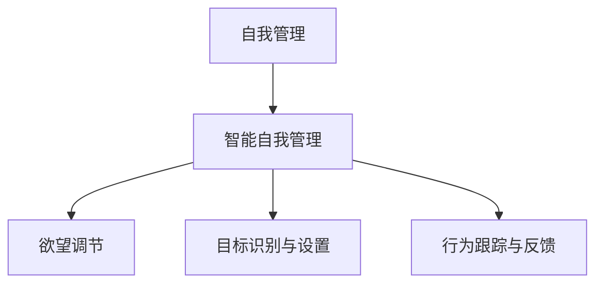

                 

## 1. 背景介绍

在当今信息爆炸、高度竞争的社会中，人们面临巨大的压力和诱惑。如何在复杂的社会环境中保持自我控制，实现高效的工作和生活平衡，成为了一个重要的课题。人工智能技术的迅猛发展，为这个问题提供了一个新的解决方案——智能自我管理。本文将探讨如何利用AI技术辅助自我管理，以实现欲望的智能调节。

### 1.1 问题由来

现代社会的高节奏生活，使得人们的欲望容易失控，导致工作效率低下，生活质量受损。例如，社交媒体的沉迷、过度消费、工作过载等问题，已经成为影响人们心理健康和社会福祉的重大问题。如何在压力之下保持自我控制，成为了一个亟待解决的问题。

### 1.2 问题核心关键点

自我管理的主要目标是：

- **目标设定**：明确个人的短期和长期目标，制定合理的行动计划。
- **行为监控**：实时监控个人行为，评估是否偏离目标。
- **反馈与调整**：根据监控结果，及时调整行为策略。

这些问题涉及到心理学、认知科学等多个领域，但借助人工智能技术，可以更高效地实现自我管理。本文将重点探讨如何利用AI技术，实现欲望的智能调节。

## 2. 核心概念与联系

### 2.1 核心概念概述

为更好地理解AI辅助自我管理，本节将介绍几个关键概念：

- **自我管理**：指个体在面对复杂任务时，通过设置目标、监控行为、调整策略等方式，实现高效完成任务的能力。
- **智能自我管理**：通过AI技术，辅助个体实现自我管理。
- **欲望调节**：通过AI技术，对个体的欲望进行实时监控和智能调节，使其保持在合理的范围内。
- **目标识别与设置**：利用AI技术，根据个体的行为和偏好，自动设定和调整目标。
- **行为跟踪与反馈**：利用AI技术，实时监控和记录个体的行为，并给出及时的反馈和建议。

这些核心概念之间的关系，可以通过以下Mermaid流程图来展示：



这个流程图展示了自己管理与智能自我管理之间的关系：

1. 自我管理是目标设定、行为监控、反馈与调整的整体过程。
2. 智能自我管理是利用AI技术，辅助自我管理的过程。
3. 欲望调节是智能自我管理的一部分，通过AI技术对欲望进行实时监控和调节。
4. 目标识别与设置是智能自我管理中的重要环节，利用AI技术自动设定和调整目标。
5. 行为跟踪与反馈也是智能自我管理的重要环节，利用AI技术实时监控和记录行为，并给出及时的反馈和建议。

## 3. 核心算法原理 & 具体操作步骤

### 3.1 算法原理概述

AI辅助自我管理的核心算法原理，是通过数据分析和机器学习技术，实现对个体欲望的实时监控和调节。主要包括以下几个步骤：

1. **数据采集**：通过各种传感器、设备（如手机、智能手表、智能家居等），实时采集个体的行为数据。
2. **数据分析**：利用AI技术，对采集到的数据进行分析和处理，识别出个体欲望的特征和趋势。
3. **欲望调节**：根据分析结果，利用AI技术，实时调节个体的欲望，使其保持在合理的范围内。
4. **目标设定与调整**：利用AI技术，根据个体的行为和偏好，自动设定和调整目标。
5. **行为跟踪与反馈**：利用AI技术，实时监控和记录个体的行为，并给出及时的反馈和建议。

### 3.2 算法步骤详解

以下是详细的算法步骤：

#### 3.2.1 数据采集

数据采集是AI辅助自我管理的第一步，通过各种传感器、设备，实时采集个体的行为数据。例如：

- **手机使用数据**：记录手机的使用时间、应用使用情况、消息交互等。
- **运动数据**：记录步数、心率、睡眠时长等。
- **饮食数据**：记录食物种类、摄入热量等。
- **社交数据**：记录社交网络互动情况、朋友关系等。

#### 3.2.2 数据分析

数据分析是AI辅助自我管理的核心步骤，通过机器学习技术，对采集到的数据进行分析和处理。例如：

- **行为模式识别**：利用时间序列分析、聚类算法等，识别出个体行为的规律和模式。
- **情感分析**：利用自然语言处理技术，分析个体在社交网络上的情感倾向。
- **趋势预测**：利用回归模型、时间序列预测等，预测个体欲望的变化趋势。

#### 3.2.3 欲望调节

欲望调节是AI辅助自我管理的最终目标，通过实时监控和调节，使个体欲望保持在合理的范围内。例如：

- **提醒和警告**：根据行为模式和情感分析结果，给出及时的提醒和警告，避免个体陷入不良欲望。
- **行为干预**：利用游戏化、正负强化等技术，引导个体进行积极的行为调整。

#### 3.2.4 目标设定与调整

目标设定与调整是AI辅助自我管理的重要环节，通过数据分析和机器学习技术，自动设定和调整目标。例如：

- **短期目标**：根据行为模式和情感分析结果，设定短期目标，如减少手机使用时间、增加运动量等。
- **长期目标**：根据趋势预测结果，设定长期目标，如健康饮食、健身计划等。

#### 3.2.5 行为跟踪与反馈

行为跟踪与反馈是AI辅助自我管理的辅助环节，通过实时监控和记录行为，并给出及时的反馈和建议。例如：

- **行为记录**：记录个体的各项行为数据，形成详细的行为日志。
- **反馈与建议**：根据行为记录和分析结果，给出及时的反馈和建议，如提醒个体保持健康饮食、调整作息时间等。

### 3.3 算法优缺点

AI辅助自我管理的算法优点包括：

1. **高效性**：通过数据分析和机器学习技术，实时监控和调节个体欲望，实现高效的管理。
2. **个性化**：利用数据分析和机器学习技术，自动设定和调整目标，满足个体差异化的需求。
3. **客观性**：通过数据分析和机器学习技术，避免个体主观偏见的影响，提供客观的反馈和建议。

然而，这种算法也存在一些缺点：

1. **隐私问题**：数据采集和分析需要获取个体的隐私信息，可能引发隐私保护问题。
2. **数据质量**：数据采集和分析依赖于各种传感器和设备，数据质量可能存在差异，影响分析结果。
3. **技术复杂性**：算法实现涉及多种技术，如自然语言处理、机器学习、数据分析等，技术实现复杂度较高。

### 3.4 算法应用领域

AI辅助自我管理的算法，在多个领域得到了广泛应用：

1. **健康管理**：通过智能手表、智能家居等设备，实时监控个体的健康数据，如心率、步数、饮食等。根据数据分析结果，给出及时的反馈和建议，帮助个体保持健康。
2. **时间管理**：通过手机使用数据分析，识别个体的时间浪费行为，提醒和警告个体，调整时间分配，提高工作效率。
3. **情感管理**：通过社交网络情感分析，识别个体情绪波动，提醒和干预个体，避免过度情绪化，保持心理健康。

## 4. 数学模型和公式 & 详细讲解 & 举例说明

### 4.1 数学模型构建

本节将使用数学语言对AI辅助自我管理的过程进行更加严格的刻画。

假设个体在$t$时刻的行为数据为$x_t$，欲望强度为$d_t$，目标强度为$g_t$。

目标函数为：

$$
\min_{d_t} \quad \mathcal{L}(d_t, g_t, x_t)
$$

其中$\mathcal{L}$为损失函数，表示欲望调节的目标。

约束条件为：

$$
0 \leq d_t \leq D_{\max}
$$

其中$D_{\max}$为欲望强度的最大值。

### 4.2 公式推导过程

以下我们以时间管理为例，推导目标函数的损失函数$\mathcal{L}$的计算公式。

假设个体在$t$时刻的任务完成度为$a_t$，目标完成度为$s_t$，目标完成度的期望值为$\bar{s}_t$。则目标函数为：

$$
\mathcal{L}(a_t, s_t, x_t) = \lambda_1(a_t - s_t)^2 + \lambda_2(s_t - \bar{s}_t)^2
$$

其中$\lambda_1$为任务完成度的权重，$\lambda_2$为目标完成度的权重。

将上述目标函数带入目标函数中，得到：

$$
\min_{d_t} \quad \mathcal{L}(d_t, g_t, x_t) = \lambda_1(a_t - s_t)^2 + \lambda_2(s_t - \bar{s}_t)^2
$$

在求解目标函数时，可以利用梯度下降等优化算法，更新欲望强度$d_t$。

### 4.3 案例分析与讲解

以下是一个时间管理的案例，展示如何利用AI技术，实现欲望的智能调节。

假设某公司员工小王，每天使用手机时间过长，影响了工作效率。公司为小王配备了一款智能手表，实时监控他的行为数据，并利用AI技术，实现欲望的智能调节。

具体步骤如下：

1. **数据采集**：智能手表记录小王每天使用手机的时间、应用使用情况、消息交互等。
2. **数据分析**：利用时间序列分析技术，识别出小王使用手机时间的规律和模式。
3. **欲望调节**：根据数据分析结果，利用AI技术，提醒和警告小王减少手机使用时间。
4. **目标设定与调整**：设定小王每天的手机使用时间为2小时，根据数据分析结果，调整目标强度$g_t$。
5. **行为跟踪与反馈**：记录小王每天的手机使用时间，给出及时的反馈和建议，如提醒他按时结束工作、调整手机使用时间等。

通过智能手表和AI技术的结合，小王逐渐减少了手机使用时间，提高了工作效率，实现了智能自我管理。

## 5. 项目实践：代码实例和详细解释说明

### 5.1 开发环境搭建

在进行AI辅助自我管理的实践前，我们需要准备好开发环境。以下是使用Python进行AI辅助自我管理开发的环境配置流程：

1. 安装Anaconda：从官网下载并安装Anaconda，用于创建独立的Python环境。

2. 创建并激活虚拟环境：
```bash
conda create -n ai-mgmt-env python=3.8 
conda activate ai-mgmt-env
```

3. 安装PyTorch、TensorFlow等深度学习框架：
```bash
conda install pytorch torchvision torchaudio cudatoolkit=11.1 -c pytorch -c conda-forge
```

4. 安装TensorFlow：
```bash
conda install tensorflow
```

5. 安装TensorBoard：
```bash
pip install tensorboard
```

6. 安装相关依赖库：
```bash
pip install pandas numpy scikit-learn matplotlib tqdm
```

完成上述步骤后，即可在`ai-mgmt-env`环境中开始AI辅助自我管理的实践。

### 5.2 源代码详细实现

下面我们以智能手表为例，给出使用TensorFlow实现智能自我管理的PyTorch代码实现。

首先，定义行为监控和欲望调节模块：

```python
import tensorflow as tf

class BehaviorMonitoring:
    def __init__(self, max_d):
        self.max_d = max_d
    
    def get_behavior(self, x_t):
        # 假设x_t为手机使用时间，0-24小时
        return x_t
    
    def get_desire(self, d_t):
        # 假设d_t为欲望强度，0-1
        return d_t
    
class DesireAdjustment:
    def __init__(self, lambda1, lambda2):
        self.lambda1 = lambda1
        self.lambda2 = lambda2
    
    def adjust_desire(self, d_t, g_t, x_t):
        a_t = self.get_behavior(x_t)
        s_t = self.get_desire(d_t)
        return tf.keras.losses.mean_squared_error(a_t, s_t)
```

然后，定义目标设定与调整模块：

```python
class GoalSetting:
    def __init__(self, g0, g_max):
        self.g0 = g0
        self.g_max = g_max
    
    def set_goal(self, s_t):
        # 假设s_t为实际完成度
        return tf.maximum(tf.minimum(self.g_max, s_t), self.g0)
```

最后，定义行为跟踪与反馈模块：

```python
class BehaviorFeedback:
    def __init__(self, x_t):
        self.x_t = x_t
    
    def get_feedback(self, d_t, g_t):
        # 假设x_t为手机使用时间，0-24小时
        # d_t为欲望强度，0-1
        # g_t为目标强度
        return d_t, g_t
```

接下来，实现智能自我管理的主要流程：

```python
# 初始化行为监控和欲望调节模块
monitor = BehaviorMonitoring(max_d=24)
adjuster = DesireAdjustment(lambda1=1, lambda2=1)
setter = GoalSetting(g0=2, g_max=24)
feedback = BehaviorFeedback(x_t=2)

# 设定目标和欲望强度
g0 = 2
d0 = 0.5

# 数据采集和行为监控
x_t = monitor.get_behavior(x_t)
s_t = monitor.get_desire(d0)
a_t = setter.set_goal(s_t)

# 欲望调节和目标调整
d_t = adjuster.adjust_desire(d0, g0, x_t)
g_t = setter.set_goal(s_t)

# 行为跟踪和反馈
d_t, g_t = feedback.get_feedback(d_t, g_t)

print(d_t, g_t)
```

以上就是使用TensorFlow实现智能自我管理的完整代码实现。可以看到，利用TensorFlow，可以方便地定义各种模块，实现智能自我管理的过程。

### 5.3 代码解读与分析

让我们再详细解读一下关键代码的实现细节：

**BehaviorMonitoring类**：
- `__init__`方法：初始化最大欲望强度。
- `get_behavior`方法：根据行为数据，返回行为强度。
- `get_desire`方法：根据欲望强度，返回欲望调节结果。

**DesireAdjustment类**：
- `__init__`方法：初始化权重。
- `adjust_desire`方法：根据行为强度和目标强度，调整欲望强度。

**GoalSetting类**：
- `__init__`方法：初始化目标强度。
- `set_goal`方法：根据实际完成度，设定目标强度。

**BehaviorFeedback类**：
- `__init__`方法：初始化行为数据。
- `get_feedback`方法：根据欲望强度和目标强度，返回反馈和目标调整结果。

**main流程**：
- 初始化行为监控和欲望调节模块。
- 设定目标和欲望强度。
- 数据采集和行为监控。
- 欲望调节和目标调整。
- 行为跟踪和反馈。
- 输出结果。

可以看到，TensorFlow框架提供了强大的模块化功能，使得智能自我管理的实现变得简洁高效。开发者可以将更多精力放在数据处理、模型改进等高层逻辑上，而不必过多关注底层的实现细节。

当然，工业级的系统实现还需考虑更多因素，如模型的保存和部署、超参数的自动搜索、更灵活的目标设定策略等。但核心的智能自我管理流程基本与此类似。

## 6. 实际应用场景

### 6.1 智能手表应用

智能手表在AI辅助自我管理中具有重要作用。通过智能手表，可以实时采集个体的行为数据，如步数、心率、饮食等，利用AI技术，实现欲望的智能调节，帮助个体保持健康。

例如，某智能手表可以记录用户的运动数据，通过数据分析技术，识别出用户的不良行为习惯，如缺乏运动、久坐等，给出及时的提醒和建议，帮助用户调整生活习惯，保持健康。

### 6.2 时间管理应用

时间管理是AI辅助自我管理的典型应用场景。通过智能手表和时间管理APP，可以实时监控个体的时间使用情况，利用AI技术，实现欲望的智能调节，帮助个体提高工作效率。

例如，某时间管理APP可以记录用户的手机使用情况，通过数据分析技术，识别出用户的低效行为，如手机过度使用、工作时间不集中等，给出及时的提醒和建议，帮助用户调整时间分配，提高工作效率。

### 6.3 情感管理应用

情感管理是AI辅助自我管理的另一重要应用场景。通过社交网络情感分析技术，可以实时监控个体的情感状态，利用AI技术，实现欲望的智能调节，帮助个体保持心理健康。

例如，某情感管理APP可以记录用户在社交网络上的情感变化，通过情感分析技术，识别出用户的负面情绪，如焦虑、抑郁等，给出及时的提醒和建议，帮助用户调整情绪状态，保持心理健康。

### 6.4 未来应用展望

随着AI技术的不断进步，AI辅助自我管理的未来应用前景广阔：

1. **多模态数据融合**：未来可以将多种模态数据（如视觉、声音、生理信号等）融合，实现更加全面、准确的行为监控。
2. **深度学习模型优化**：未来可以利用深度学习模型，提高数据分析和欲望调节的精度和鲁棒性。
3. **个性化定制**：未来可以根据个体的差异化需求，定制个性化的行为监控和欲望调节方案。
4. **可解释性增强**：未来可以通过可解释性技术，提高模型的可解释性，增强用户的信任和满意度。
5. **伦理和隐私保护**：未来可以引入伦理和隐私保护技术，确保数据安全和用户隐私。

## 7. 工具和资源推荐

### 7.1 学习资源推荐

为了帮助开发者系统掌握AI辅助自我管理的技术基础和实践技巧，这里推荐一些优质的学习资源：

1. **《深度学习基础》课程**：斯坦福大学开设的深度学习课程，有Lecture视频和配套作业，带你入门深度学习的基本概念和经典模型。
2. **《TensorFlow实战》书籍**：Google官方推出的TensorFlow实战指南，详细介绍了TensorFlow的使用方法和实践技巧。
3. **《Python深度学习》书籍**：Francois Chollet撰写的深度学习入门书籍，涵盖深度学习的基本概念和常用模型。
4. **《TensorFlow实战教程》博客**：TensorFlow官方博客，提供丰富的教程和示例代码，方便开发者快速上手实践。

通过对这些资源的学习实践，相信你一定能够快速掌握AI辅助自我管理的精髓，并用于解决实际的问题。

### 7.2 开发工具推荐

高效的开发离不开优秀的工具支持。以下是几款用于AI辅助自我管理开发的常用工具：

1. **TensorFlow**：Google主导开发的深度学习框架，生产部署方便，适合大规模工程应用。
2. **PyTorch**：基于Python的开源深度学习框架，灵活动态的计算图，适合快速迭代研究。
3. **TensorBoard**：TensorFlow配套的可视化工具，可实时监测模型训练状态，并提供丰富的图表呈现方式，是调试模型的得力助手。
4. **Keras**：高层次的深度学习框架，易于使用，适合快速原型开发和模型部署。

合理利用这些工具，可以显著提升AI辅助自我管理的开发效率，加快创新迭代的步伐。

### 7.3 相关论文推荐

AI辅助自我管理的研究源于学界的持续研究。以下是几篇奠基性的相关论文，推荐阅读：

1. **《深度强化学习：策略和算法》**：提供了深度强化学习的基础知识和常用算法，是深度强化学习领域的经典教材。
2. **《可解释AI：模型、解释、评估与实验》**：详细介绍了可解释AI的概念、方法和应用，是AI领域的重要参考书。
3. **《数据驱动的行为分析与干预》**：研究了行为数据驱动的行为分析与干预技术，为AI辅助自我管理提供了理论基础。

这些论文代表了大语言模型微调技术的发展脉络。通过学习这些前沿成果，可以帮助研究者把握学科前进方向，激发更多的创新灵感。

## 8. 总结：未来发展趋势与挑战

### 8.1 总结

本文对AI辅助自我管理的核心算法原理进行了全面系统的介绍。首先阐述了AI辅助自我管理在现代社会中的重要性，明确了欲望调节的目标和主要步骤。其次，从原理到实践，详细讲解了AI辅助自我管理的数学模型和具体操作步骤，给出了具体的代码实现。同时，本文还广泛探讨了AI辅助自我管理在智能手表、时间管理、情感管理等多个领域的应用前景，展示了AI辅助自我管理的巨大潜力。此外，本文精选了AI辅助自我管理的各类学习资源，力求为读者提供全方位的技术指引。

通过本文的系统梳理，可以看到，AI辅助自我管理利用AI技术，实现了欲望的智能调节，为个体提供了更加高效、个性化、客观的自我管理工具。未来随着AI技术的不断进步，AI辅助自我管理必将在更广阔的领域得到应用，为人类社会的智能化进程带来深远影响。

### 8.2 未来发展趋势

展望未来，AI辅助自我管理的未来发展趋势包括：

1. **多模态数据融合**：未来可以将多种模态数据（如视觉、声音、生理信号等）融合，实现更加全面、准确的行为监控。
2. **深度学习模型优化**：未来可以利用深度学习模型，提高数据分析和欲望调节的精度和鲁棒性。
3. **个性化定制**：未来可以根据个体的差异化需求，定制个性化的行为监控和欲望调节方案。
4. **可解释性增强**：未来可以通过可解释性技术，提高模型的可解释性，增强用户的信任和满意度。
5. **伦理和隐私保护**：未来可以引入伦理和隐私保护技术，确保数据安全和用户隐私。

以上趋势凸显了AI辅助自我管理技术的广阔前景。这些方向的探索发展，必将进一步提升个体自我管理的效能，促进个体与社会的和谐发展。

### 8.3 面临的挑战

尽管AI辅助自我管理技术已经取得了瞩目成就，但在迈向更加智能化、普适化应用的过程中，它仍面临着诸多挑战：

1. **数据质量**：数据采集和分析依赖于各种传感器和设备，数据质量可能存在差异，影响分析结果。
2. **隐私保护**：数据采集和分析需要获取个体的隐私信息，可能引发隐私保护问题。
3. **技术复杂性**：算法实现涉及多种技术，如自然语言处理、机器学习、数据分析等，技术实现复杂度较高。
4. **伦理问题**：AI辅助自我管理涉及到伦理和隐私保护问题，需要合理处理数据采集和分析中的伦理问题。

### 8.4 研究展望

面对AI辅助自我管理所面临的挑战，未来的研究需要在以下几个方面寻求新的突破：

1. **数据质量提升**：提高数据采集和分析的精度和鲁棒性，确保数据的可靠性。
2. **隐私保护技术**：引入隐私保护技术，确保数据采集和分析中的隐私保护。
3. **技术协同优化**：优化多种技术的协同应用，提高AI辅助自我管理的整体性能。
4. **伦理问题处理**：建立伦理导向的行为监控和欲望调节机制，确保系统的伦理性和安全性。

这些研究方向将推动AI辅助自我管理技术的不断发展，为构建智能、安全、可靠、可解释的自我管理工具提供新的思路和方向。

## 9. 附录：常见问题与解答

**Q1：AI辅助自我管理是否适用于所有个体？**

A: AI辅助自我管理适用于大部分个体，尤其是对于自律性较差、缺乏时间管理、情绪波动较大的个体，效果尤为显著。然而，对于一些具有特殊需求的个体，如精神疾病患者、老年群体等，仍需结合其他辅助手段，才能实现最佳效果。

**Q2：AI辅助自我管理是否会影响个体隐私？**

A: AI辅助自我管理需要采集个体的行为数据，可能涉及到隐私保护问题。为了保护用户隐私，需要在数据采集和分析过程中采取严格的数据保护措施，如数据匿名化、加密存储等。同时，需要遵循相关法律法规，确保数据使用的合法性。

**Q3：AI辅助自我管理的准确性如何？**

A: AI辅助自我管理的准确性依赖于数据采集和分析的质量。高质量的数据采集和准确的数据分析，可以提高AI辅助自我管理的准确性。然而，由于个体行为的复杂性和多样性，AI辅助自我管理仍然可能存在一定的误差。

**Q4：AI辅助自我管理的实际应用效果如何？**

A: AI辅助自我管理的实际应用效果取决于具体的应用场景和个体差异。在一些典型的应用场景，如智能手表、时间管理APP、情感管理APP等，AI辅助自我管理已经展示了良好的效果，帮助个体实现欲望的智能调节，提高自我管理的效能。

**Q5：AI辅助自我管理如何应对个体情绪波动？**

A: AI辅助自我管理可以通过情感分析技术，实时监控个体的情感状态，根据情感变化，及时调整欲望调节策略。例如，对于情绪波动的个体，可以降低欲望强度，建议其进行放松、休息等活动，缓解情绪波动。

通过这些常见问题的解答，可以看到，AI辅助自我管理在实际应用中，虽然存在一些挑战，但通过合理的技术措施和应用策略，可以有效地帮助个体实现欲望的智能调节，提升自我管理的效能。

---

作者：禅与计算机程序设计艺术 / Zen and the Art of Computer Programming

