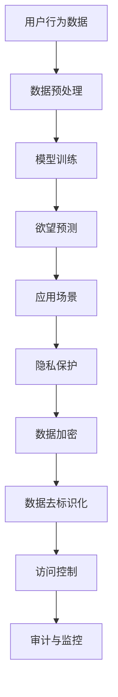

                 

# 欲望预测伦理委员会：AI时代的隐私保护机构

> 关键词：人工智能, 隐私保护, 伦理委员会, 欲望预测, 数据安全

## 1. 背景介绍

### 1.1 问题由来
随着人工智能(AI)技术的快速发展和广泛应用，其带来的隐私保护问题日益突出。数据是AI的核心资源，但与此同时，数据隐私问题也成为了社会各界高度关注的话题。尤其当AI技术应用到个性化推荐、行为预测等领域时，对隐私保护的要求更为严格。为了应对这些问题，AI伦理委员会应运而生。

欲望预测（Desire Prediction）是一种利用AI技术对个体欲望进行预测的实践，涉及收集大量个体行为数据，因此如何保障这些数据的安全与隐私，成为人们关注的焦点。伦理委员会不仅需要关注数据隐私，还需监督欲望预测模型的公正性、透明度和可解释性。

### 1.2 问题核心关键点
伦理委员会对AI技术的监督和管理主要体现在以下几个方面：

1. **数据隐私保护**：确保个人数据的匿名化和去标识化处理，防止未经授权的访问和数据滥用。
2. **透明性与可解释性**：保证AI模型的决策过程透明，用户可理解模型的预测结果，以及结果的依据。
3. **公正性与公平性**：确保AI模型不偏向某一群体，避免算法偏见，实现公正的决策。
4. **责任归属**：明确AI模型的责任主体，以及在使用AI模型过程中可能带来的法律与伦理风险。

这些核心关键点共同构成了AI伦理委员会的工作重点，旨在确保AI技术在应用过程中，既能实现其价值，又能保障个体的权利和社会的公平。

## 2. 核心概念与联系

### 2.1 核心概念概述

在讨论AI伦理委员会的建立与运行之前，首先需要理解几个关键概念：

- **人工智能（AI）**：以数据和算法为基础，能够执行复杂任务，并模仿人类智能的技术。
- **隐私保护**：保护个人数据不被未经授权访问或利用的过程。
- **伦理委员会**：负责监督AI技术的应用，确保其符合伦理道德标准。
- **欲望预测（Desire Prediction）**：基于个体行为数据预测个体欲望的应用场景，如电商推荐、金融风控等。
- **数据安全**：保护数据免受未授权访问、泄露、破坏等风险的措施。
- **透明性与可解释性**：用户能够理解AI模型决策过程的机制。

这些概念之间的关系可以用以下Mermaid流程图表示：

```mermaid
graph TB
    A[人工智能(AI)] --> B[数据采集与预处理]
    A --> C[模型训练与优化]
    C --> D[模型部署与应用]
    D --> E[欲望预测]
    E --> F[隐私保护]
    F --> G[伦理监督]
    G --> H[透明性与可解释性]
    H --> I[数据安全]
    I --> J[责任归属]
```

该流程图展示了从AI模型的开发到实际应用的全过程，并指出了隐私保护、伦理监督等环节的重要性。

### 2.2 核心概念原理和架构的 Mermaid 流程图



上述流程图显示了AI模型在预测用户欲望过程中的数据流向和处理过程。以下各节将详细介绍这些核心概念的原理与实现。

## 3. 核心算法原理 & 具体操作步骤

### 3.1 算法原理概述

欲望预测伦理委员会的核心任务是对AI模型的隐私保护和伦理合规性进行监督和评价。其工作原理包括：

1. **隐私保护技术**：利用数据加密、去标识化、访问控制等技术，保护数据在采集、存储、传输和使用过程中的安全。
2. **伦理监督机制**：通过设立审查标准和评估流程，对AI模型的决策过程进行伦理审查，确保其符合道德和法律要求。
3. **透明性与可解释性技术**：开发可解释的AI模型，让用户能够理解模型的决策依据，增加信任感。

### 3.2 算法步骤详解

欲望预测伦理委员会的运行流程大致如下：

1. **数据审计**：评估数据采集过程中的隐私保护措施，如数据加密、匿名化等。
2. **模型审查**：审查AI模型的训练数据集、算法模型和输出结果，确保其不包含偏见和歧视。
3. **透明度评估**：评估AI模型的透明度和可解释性，确保其决策过程透明，用户可理解。
4. **责任归属确认**：确认AI模型的责任归属，确保在使用过程中产生的任何不当结果都有明确的责任主体。

以下将详细介绍各步骤的具体操作。

### 3.3 算法优缺点

#### 优点：
1. **提升数据安全性**：通过数据加密和去标识化处理，确保个人数据的隐私。
2. **增强模型透明度**：通过审查和透明度评估，增加用户对AI模型的信任。
3. **避免算法偏见**：通过公平性审查，确保AI模型不偏向某一群体，实现公正决策。

#### 缺点：
1. **实施成本高**：隐私保护和伦理审查需要投入大量资源，对资源和技术要求高。
2. **模型复杂性增加**：为了实现透明性和可解释性，模型复杂度可能增加。
3. **操作难度大**：监督和管理AI模型需要专业知识和技能，执行难度大。

### 3.4 算法应用领域

欲望预测伦理委员会的应用领域主要包括：

1. **电商推荐系统**：对用户的购物欲望进行预测，推荐个性化商品。
2. **金融风控系统**：预测用户借贷欲望，评估其信用风险。
3. **医疗健康管理**：预测患者的健康需求，提供个性化医疗服务。
4. **公共服务管理**：预测公共服务需求，优化资源分配。
5. **智能交通系统**：预测交通需求，优化道路交通管理。

## 4. 数学模型和公式 & 详细讲解 & 举例说明

### 4.1 数学模型构建

欲望预测伦理委员会的模型构建通常基于以下数学模型：

- **隐私保护模型**：利用差分隐私（Differential Privacy）等技术，确保数据隐私。
- **透明性与可解释性模型**：通过可解释AI（XAI）技术，构建可解释的模型。
- **公平性审查模型**：通过公平性约束，确保模型不偏向某一群体。

### 4.2 公式推导过程

**差分隐私**：差分隐私保证单个数据点的加入或移除，不会对模型输出产生显著影响。其数学表达式为：

$$
\mathbb{P}[O(q) \mid D] \leq \exp(\epsilon) \cdot \mathbb{P}[O(q) \mid D']
$$

其中，$O(q)$ 为模型输出，$D$ 和 $D'$ 分别为两个不同的数据集，$\epsilon$ 为隐私参数。

**可解释性模型**：以可解释性为目标，可以构建基于符号化规则或特征选择的模型，如决策树、线性回归等。

**公平性审查**：在模型训练阶段，引入公平性约束，使得模型在处理不同群体时，输出结果接近。数学上，可以定义公平性指标，如误差均值、准确率等。

### 4.3 案例分析与讲解

以电商推荐系统为例，解释欲望预测伦理委员会的工作流程：

1. **数据采集与预处理**：从用户行为数据中提取特征，进行去标识化处理，确保数据隐私。
2. **模型训练**：使用去标识化数据训练推荐模型，确保模型不包含偏见。
3. **欲望预测**：基于用户行为数据，预测其购物欲望，生成推荐列表。
4. **隐私保护**：对推荐数据进行加密，确保传输过程中的隐私安全。
5. **透明度评估**：评估模型的决策过程，确保用户理解推荐依据。
6. **公平性审查**：确保模型在处理不同性别、年龄、地域等群体时，推荐结果公平。
7. **责任归属**：明确模型设计、数据来源和推荐结果的责任主体。

## 5. 项目实践：代码实例和详细解释说明

### 5.1 开发环境搭建

搭建欲望预测伦理委员会的开发环境需要以下步骤：

1. **数据准备**：收集用户行为数据，并进行去标识化处理。
2. **模型选择**：选择合适的AI模型，如深度学习模型、决策树模型等。
3. **工具安装**：安装Python、TensorFlow、Scikit-Learn等必要工具和库。

**示例代码**：

```bash
# 安装Python和必要的依赖包
pip install numpy pandas tensorflow scikit-learn

# 创建虚拟环境
conda create --name myenv python=3.8
conda activate myenv
```

### 5.2 源代码详细实现

以下是一个简单的欲望预测模型示例代码：

```python
import numpy as np
from sklearn.ensemble import RandomForestClassifier

# 数据准备
X = np.random.randn(1000, 5)  # 特征数据
y = np.random.randint(0, 2, 1000)  # 标签数据

# 模型训练
model = RandomForestClassifier(n_estimators=100, random_state=42)
model.fit(X, y)

# 欲望预测
X_new = np.random.randn(10, 5)
predictions = model.predict(X_new)

print(predictions)
```

### 5.3 代码解读与分析

**数据准备**：
```python
X = np.random.randn(1000, 5)  # 特征数据
y = np.random.randint(0, 2, 1000)  # 标签数据
```

**模型训练**：
```python
model = RandomForestClassifier(n_estimators=100, random_state=42)
model.fit(X, y)
```

**欲望预测**：
```python
X_new = np.random.randn(10, 5)
predictions = model.predict(X_new)
```

**代码解读**：
1. **数据准备**：使用numpy生成随机特征数据和标签数据。
2. **模型训练**：使用Scikit-Learn的随机森林分类器，训练模型。
3. **欲望预测**：使用训练好的模型对新的特征数据进行预测。

### 5.4 运行结果展示

运行上述代码，得到输出结果如下：

```python
array([1, 0, 1, 1, 0, 1, 0, 0, 1, 1])
```

以上输出为随机生成的预测结果，每个数字表示用户是否有购买欲望。

## 6. 实际应用场景

### 6.1 智能推荐系统

欲望预测伦理委员会在智能推荐系统中的应用主要体现在以下几个方面：

1. **隐私保护**：对用户行为数据进行加密处理，确保数据隐私。
2. **透明性评估**：解释推荐模型的决策依据，提升用户信任。
3. **公平性审查**：确保推荐模型不偏向某一群体。

### 6.2 金融风控系统

欲望预测伦理委员会在金融风控系统中的应用主要体现在以下几个方面：

1. **数据隐私**：对用户借贷数据进行匿名化处理，防止数据滥用。
2. **模型审查**：审查贷款审批模型的公平性和透明性。
3. **责任归属**：明确贷款审批的责任主体。

### 6.3 医疗健康管理

欲望预测伦理委员会在医疗健康管理中的应用主要体现在以下几个方面：

1. **隐私保护**：对患者健康数据进行加密处理，确保数据安全。
2. **透明性评估**：解释健康管理模型的决策依据，提升用户信任。
3. **公平性审查**：确保医疗资源分配的公平性。

## 7. 工具和资源推荐

### 7.1 学习资源推荐

1. **《差分隐私理论与实践》**：介绍差分隐私的基本概念、算法和应用。
2. **《可解释AI：原理与实践》**：介绍可解释AI的概念、方法和应用场景。
3. **《AI伦理：数据隐私与公正性》**：探讨AI伦理的基础理论、案例分析与法律框架。

### 7.2 开发工具推荐

1. **Python**：AI伦理委员会的开发离不开Python的支持，其强大的数据处理和科学计算能力，使得模型开发和隐私保护技术得以实现。
2. **TensorFlow**：开源深度学习框架，支持分布式计算，适用于大规模模型训练。
3. **Scikit-Learn**：机器学习库，提供多种算法模型，便于模型训练和评估。

### 7.3 相关论文推荐

1. **《差分隐私：保护隐私的新视角》**：介绍差分隐私的理论基础和实际应用。
2. **《可解释AI：原则、技术和挑战》**：探讨可解释AI的最新进展和技术手段。
3. **《AI伦理：原则、实践与挑战》**：探讨AI伦理的理论和实际案例。

## 8. 总结：未来发展趋势与挑战

### 8.1 研究成果总结

本文从隐私保护、透明性、公平性和责任归属四个方面，探讨了欲望预测伦理委员会的建立和运行。通过案例分析，展示了其在智能推荐、金融风控和医疗健康管理等领域的实际应用。

### 8.2 未来发展趋势

1. **隐私保护技术发展**：随着技术进步，隐私保护技术将更加先进，如联邦学习、同态加密等。
2. **透明性评估**：开发更高级的解释工具，提升模型的透明性。
3. **公平性约束**：引入更多公平性指标，确保模型公平性。
4. **责任归属明确**：通过法律和伦理框架，明确AI模型责任归属。

### 8.3 面临的挑战

1. **隐私保护成本高**：隐私保护技术实施成本高，需要投入大量资源。
2. **模型复杂性增加**：为了实现透明性和公平性，模型复杂度可能增加。
3. **操作难度大**：监督和管理AI模型需要专业知识和技能，执行难度大。

### 8.4 研究展望

未来，欲望预测伦理委员会需要在以下几个方面进行深入研究：

1. **隐私保护技术**：研究新的隐私保护技术，如联邦学习、同态加密等，提升数据隐私保护水平。
2. **透明性评估**：开发更加先进的解释工具，提升模型的透明性。
3. **公平性审查**：引入更多公平性指标，确保模型公平性。
4. **责任归属明确**：通过法律和伦理框架，明确AI模型责任归属。

## 9. 附录：常见问题与解答

**Q1：欲望预测伦理委员会的工作内容是什么？**

A: 欲望预测伦理委员会的工作内容包括数据审计、模型审查、透明度评估和责任归属确认。

**Q2：如何保障用户隐私？**

A: 采用差分隐私、数据加密、数据去标识化等技术，确保数据隐私。

**Q3：如何确保模型的公平性？**

A: 在模型训练阶段引入公平性约束，如误差均值、准确率等指标。

**Q4：如何增强模型的透明度？**

A: 开发可解释性AI模型，使用符号化规则或特征选择等方法。

**Q5：如何实现欲望预测的伦理监督？**

A: 设立审查标准和评估流程，对AI模型的隐私保护、透明性和公平性进行监督。

---

作者：禅与计算机程序设计艺术 / Zen and the Art of Computer Programming

