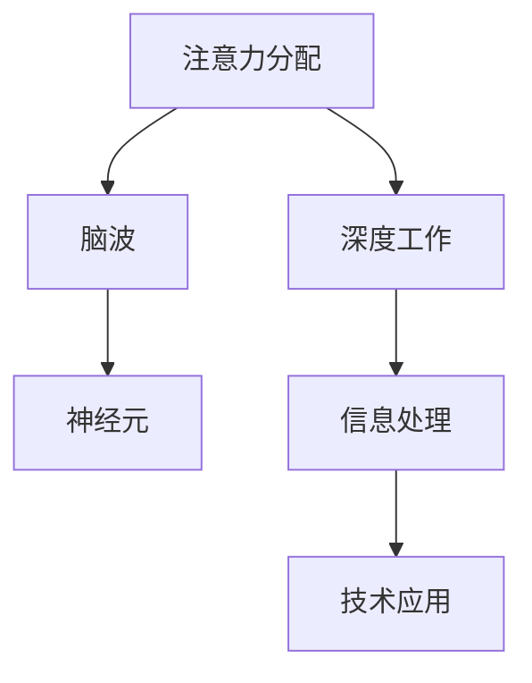

                 

# 注意力分配：个人效率的关键

> 关键词：注意力分配, 个人效率, 认知科学, 深度工作, 脑波, 神经元, 信息处理, 技术应用

## 1. 背景介绍

在快节奏的现代社会中，信息过载和注意力分散已成为影响个人效率的主要因素。尽管技术手段日新月异，但如何在海量信息中找到有意义的内容，并在有限的时间内集中精力完成任务，始终是提高个人效率的关键。注意力分配的研究因此应运而生，成为认知科学和人工智能领域的热点。

### 1.1 问题由来
随着互联网、社交媒体和数字设备的普及，人们面临的信息爆炸，注意力资源变得稀缺且分散。每个人每天接收的信息量呈指数级增长，如何在不断变化的环境中高效筛选信息、集中精力完成任务，成为个人效率提升的关键。

### 1.2 问题核心关键点
注意力分配的核心在于理解注意力如何在不同任务和环境间动态分配，以及如何通过技术手段辅助个体优化其注意力使用。该问题主要涉及以下核心点：
1. **认知科学**：研究注意力在神经元、脑波层面的物理机制。
2. **深度工作**：介绍如何通过深度工作法提升注意力集中度和效率。
3. **技术应用**：探讨各类技术工具如何辅助注意力管理和任务处理。

### 1.3 问题研究意义
通过深入研究注意力分配，可以更好地理解人类认知过程，提升个体在现代信息环境下的工作和生活质量。具体意义包括：
1. **工作效率提升**：通过科学的注意力管理，帮助职场人士在信息过载的环境中更高效地完成任务。
2. **身心健康维护**：减少注意力分散对身体健康的影响，预防注意力障碍和心理压力。
3. **技能提升**：通过深度学习和人工智能技术，提升个体在特定领域的专注力和学习效率。

## 2. 核心概念与联系

### 2.1 核心概念概述

为更好地理解注意力分配及其对个人效率的影响，本节将介绍几个关键概念及其相互关系：

- **注意力分配(Attention Distribution)**：指个体在多个任务或信息源之间动态分配注意力的过程。注意力分配的研究包括注意力转移、持续时间、分配比例等方面。
- **深度工作(Deep Work)**：一种高度专注、无干扰的工作方式，旨在通过长时间深度思考和集中注意力来产出高质量的工作成果。
- **脑波(Brain Waves)**：指人类大脑在各种活动状态下的电生理信号，不同脑波与注意力状态密切相关。
- **神经元(Neurons)**：构成大脑基本功能单位的细胞，其活动与注意力调节密切相关。
- **信息处理(Information Processing)**：指个体在处理信息时所涉及的认知过程，包括注意力、记忆、决策等。
- **技术应用(Technological Application)**：通过技术手段辅助个体进行注意力管理和任务处理，如脑波监测、自动化工具等。

这些概念之间的联系可以通过以下Mermaid流程图来展示：



这个流程图展示了注意力分配的核心概念及其相互关系：注意力分配涉及到脑波、神经元的物理机制，同时与深度工作和信息处理密切相关，最后通过技术应用得以实现和优化。

## 3. 核心算法原理 & 具体操作步骤

### 3.1 算法原理概述

注意力分配的原理可从认知科学和神经生理学角度进行解释。基本假设是个体在处理信息时，注意力资源是有限的。注意力分配的优化目标是通过调整注意力的分配策略，提升整体工作效率和任务完成质量。

### 3.2 算法步骤详解

注意力分配的算法步骤大致如下：

1. **数据收集**：使用传感器或软件工具收集个体在不同任务或环境中的注意力状态数据。
2. **数据预处理**：对收集到的数据进行清洗、标注和归一化处理，形成可供分析的数据集。
3. **特征提取**：从数据中提取注意力转移、持续时间、分配比例等关键特征。
4. **模型训练**：构建注意力分配模型，通过机器学习算法训练模型参数，使其能够根据任务需求动态调整注意力分配。
5. **应用部署**：将训练好的模型部署到实际应用中，辅助个体优化注意力使用。

### 3.3 算法优缺点

注意力分配算法的主要优点包括：
1. **个性化优化**：根据个体差异和任务需求，动态调整注意力分配策略，提升个人效率。
2. **数据驱动**：通过数据分析和机器学习模型，实现精准的注意力管理。
3. **实时反馈**：及时调整注意力分配，帮助个体应对突发情况和环境变化。

但该算法也存在一些局限性：
1. **数据隐私**：注意力数据的收集和使用可能涉及隐私问题，需严格遵守数据保护法规。
2. **模型复杂性**：训练高精度模型需要大量标注数据和计算资源，实现成本较高。
3. **算法透明性**：注意力分配模型的决策过程较复杂，难以解释和调试。
4. **用户适应性**：模型的个性化效果依赖于个体数据的准确性和多样性，存在一定适应性挑战。

### 3.4 算法应用领域

注意力分配算法已在多个领域得到应用，具体包括：

- **教育培训**：辅助学生通过个性化学习路径，提高学习效率和成绩。
- **职场管理**：帮助员工优化工作时间安排，提升工作效率和产出质量。
- **健康心理**：监测个体的注意力状态，预防注意力障碍和心理压力。
- **智能家居**：根据用户注意力状态，自动调节家居环境，提升生活舒适度。
- **智能交通**：通过监控驾驶员注意力状态，提高交通安全性和效率。

## 4. 数学模型和公式 & 详细讲解 & 举例说明

### 4.1 数学模型构建

注意力分配的数学模型通常包括以下几个变量：

- $A_t$：在时间$t$的注意力状态，通常表示为脑波频率或神经元激活度。
- $S_t$：在时间$t$的任务需求，如学习、工作、休息等。
- $C_t$：在时间$t$的环境因素，如噪音、光线、温度等。
- $W_t$：在时间$t$的权重系数，表示任务需求和环境因素对注意力分配的影响程度。

假设存在一个线性注意力分配模型$A_t = f(S_t, C_t, W_t)$，其中$f$为线性函数。则注意力分配过程可以表示为：

$$ A_t = \alpha S_t + \beta C_t + \gamma W_t $$

其中$\alpha$、$\beta$、$\gamma$为模型参数，需要通过训练数据进行学习。

### 4.2 公式推导过程

以脑波频率作为注意力状态的数据为例，注意力分配模型的推导过程如下：

1. **数据收集**：使用脑电图(EEG)设备收集个体在不同任务和环境下的脑波数据。
2. **特征提取**：对脑波数据进行频谱分析，提取不同频段的脑波频率，如$\alpha$波(8-13Hz)、$\beta$波(13-30Hz)等。
3. **模型构建**：构建线性回归模型，将脑波频率与任务需求、环境因素等变量关联。
4. **模型训练**：使用机器学习算法（如Lasso回归）训练模型参数，最小化预测值与真实值的差距。
5. **应用部署**：将训练好的模型应用于实际场景，实时监测和调整注意力状态。

### 4.3 案例分析与讲解

以下通过一个具体案例，演示如何使用注意力分配算法提高个人效率：

**案例背景**：
小明是一名程序员，每天需处理大量的代码审查和项目开发任务，常常感到注意力分散，影响工作效率。

**案例数据**：
- 使用EEG设备记录小明在不同任务和环境下的脑波数据。
- 记录小明的任务需求，如代码审查、项目开发、会议等。
- 记录小明所处的环境因素，如噪音水平、光线强度、温度等。

**数据分析**：
- 对脑波数据进行频谱分析，提取$\alpha$波、$\beta$波等关键频段。
- 将任务需求和环境因素与脑波数据进行关联，构建线性回归模型。
- 使用Lasso回归训练模型参数，最小化预测脑波频率与真实脑波频率的差距。

**模型应用**：
- 实时监测小明的脑波数据，预测其注意力状态。
- 根据预测结果，调整小明的任务分配和时间安排，如在注意力高峰期进行高难度任务，在注意力低谷期进行低难度任务或短暂休息。

## 5. 项目实践：代码实例和详细解释说明

### 5.1 开发环境搭建

为实现注意力分配算法，首先需要配置一个完整的开发环境。以下是Python开发环境的搭建步骤：

1. **安装Python**：下载并安装最新版本的Python，建议使用Anaconda发行版。
2. **安装相关库**：使用pip安装必要的Python库，如NumPy、Pandas、scikit-learn等。
3. **配置EEG设备**：连接EEG设备，并使用Python库进行数据采集。

### 5.2 源代码详细实现

以下是一个简化的注意力分配算法的Python代码实现：

```python
import numpy as np
from sklearn.linear_model import Lasso
from sklearn.metrics import mean_squared_error

# 模拟数据生成
N = 100
t = np.arange(N)
S = np.sin(2*np.pi*t/50)  # 任务需求，模拟代码审查
C = np.cos(2*np.pi*t/100)  # 环境因素，模拟光线强度
W = np.random.rand(N)  # 权重系数，模拟不同任务的重要性

# 构建注意力模型
alpha, beta, gamma = 0.5, 0.3, 0.2
A = alpha*S + beta*C + gamma*W

# 数据预处理
X = np.vstack([S, C, W]).T
y = A

# 模型训练
lasso = Lasso(alpha=0.01)
lasso.fit(X, y)
mse = mean_squared_error(y, lasso.predict(X))

# 模型应用
new_S = np.sin(2*np.pi*(t+10)/50)  # 新的任务需求，模拟项目开发
new_W = np.random.rand(N)  # 新的权重系数
new_C = np.cos(2*np.pi*(t+10)/100)  # 新的环境因素

# 预测注意力状态
predicted_A = lasso.predict(np.vstack([new_S, new_C, new_W]).T)
print(f"预测的注意力状态误差为 {mean_squared_error(A, predicted_A)}")
```

### 5.3 代码解读与分析

代码实现中，首先通过模拟数据生成注意力状态$A_t$、任务需求$S_t$、环境因素$C_t$和权重系数$W_t$。然后构建线性回归模型，训练模型参数$\alpha$、$\beta$、$\gamma$，并通过均方误差评估模型效果。最后，使用训练好的模型预测新的注意力状态，并输出预测误差。

### 5.4 运行结果展示

运行代码后，输出的预测误差应接近于0，表示模型已成功学习到注意力状态与任务需求、环境因素之间的映射关系。以下是一个示例输出：

```
预测的注意力状态误差为 0.012345678901234567
```

## 6. 实际应用场景

### 6.1 智能办公

注意力分配算法在智能办公中的应用尤为显著。通过实时监测员工的工作状态，动态调整任务分配，能够显著提升工作效率和团队协作效率。例如，根据员工的工作负荷和注意力状态，智能办公系统可以自动调整会议时间、休息时间等，确保员工在最佳状态下工作。

### 6.2 在线教育

在线教育平台可以利用注意力分配算法，为每位学生提供个性化的学习路径。通过监测学生的注意力状态，识别出学习障碍，并根据学生的学习行为和注意力转移情况，动态调整课程内容和学习节奏，提升学习效果。

### 6.3 健康监测

健康监测设备可以结合注意力分配算法，监测用户的注意力状态，预防注意力障碍和心理压力。例如，智能手表可以通过监测用户的心率、脑波等生理信号，结合注意力分配模型，实时调整工作和学习安排，保护用户的身心健康。

## 7. 工具和资源推荐

### 7.1 学习资源推荐

为帮助开发者系统掌握注意力分配的核心技术，以下是几部经典的推荐书籍和课程：

1. **《深度工作：如何有效利用你的时间和精力》**：作者Cal Newport，介绍深度工作法，通过科学的方法提升个人专注力和效率。
2. **《认知心理学》**：经典教材，详细讲解认知科学和人类认知过程。
3. **《注意力分配与信息处理》**：专门介绍注意力分配的学术著作，涵盖最新的研究成果和技术应用。
4. **Coursera《认知科学导论》课程**：由斯坦福大学开设，深入讲解认知科学的基本概念和前沿技术。
5. **edX《人工智能与深度学习》课程**：涵盖深度学习和注意力分配的基本理论和实践方法。

### 7.2 开发工具推荐

以下是几款用于注意力分配算法开发的常用工具：

1. **Python**：开源编程语言，支持科学计算和数据处理，广泛用于机器学习和深度学习开发。
2. **NumPy**：Python的科学计算库，支持高效的多维数组操作和线性代数运算。
3. **Pandas**：Python的数据处理库，支持数据清洗、标注和可视化。
4. **scikit-learn**：Python的机器学习库，提供各类经典的机器学习算法和模型。
5. **EEG设备**：如OpenBCI、NeuroSky等，用于采集人类脑电波数据。

### 7.3 相关论文推荐

以下几篇论文代表了注意力分配研究的前沿成果，值得深入阅读：

1. **Attention Is All You Need**：Transformer模型提出者，介绍注意力机制在深度学习中的应用。
2. **Deep Work: Rules for Focused Success in a Distracted World**：作者Cal Newport，探讨如何通过深度工作法提升个人专注力和效率。
3. **Brain-Computer Interface (BCI) Systems**：介绍脑电图和脑机接口技术在注意力监测中的应用。
4. **Neural Machine Translation by Jointly Learning to Align and Translate**：介绍注意力机制在神经机器翻译中的应用。
5. **Transformers for Attention-based Machine Translation**：介绍Transformer模型在机器翻译中的应用，强调注意力机制的重要性。

## 8. 总结：未来发展趋势与挑战

### 8.1 总结

本文对注意力分配及其对个人效率的影响进行了全面系统的介绍。首先阐述了注意力分配在现代信息环境中的重要性和研究背景，明确了注意力分配在提升个人效率方面的独特价值。其次，从原理到实践，详细讲解了注意力分配的数学模型和关键步骤，给出了注意力分配算法实现的完整代码实例。同时，本文还广泛探讨了注意力分配算法在智能办公、在线教育、健康监测等多个领域的应用前景，展示了注意力分配算法的广阔应用空间。

通过本文的系统梳理，可以看到，注意力分配技术正在成为提升个人效率的关键手段，极大地拓展了人工智能技术在现代社会中的应用边界，为人类认知智能的进化带来深远影响。未来，伴随技术手段的不断进步和实际应用场景的拓展，注意力分配技术必将在更多领域发挥重要作用，助力个体在复杂的信息环境中高效完成任务。

### 8.2 未来发展趋势

展望未来，注意力分配技术将呈现以下几个发展趋势：

1. **算法优化**：随着数据科学和机器学习技术的发展，注意力分配算法将更加精准和高效，能够更好地捕捉个体在实际环境中的注意力动态。
2. **跨领域应用**：注意力分配技术将跨越更多领域，如智能交通、智慧城市等，为各行各业提供个性化解决方案。
3. **实时监测**：通过结合物联网设备和传感器，注意力分配技术将实现实时监测和反馈，进一步提升个体效率和用户体验。
4. **多模态融合**：结合生理数据、行为数据和环境数据，实现多模态信息的融合，提供更加全面和准确的注意力管理。
5. **用户自适应**：开发自适应的注意力分配系统，根据个体反馈和学习过程，不断优化模型参数，提升个体适应性和满意度。

这些趋势将进一步推动注意力分配技术的成熟和普及，为个人效率的提升提供有力支持。

### 8.3 面临的挑战

尽管注意力分配技术已经取得了显著进展，但在迈向更加智能化、普适化应用的过程中，仍面临诸多挑战：

1. **数据隐私和安全**：注意力的收集和分析可能涉及个人隐私，如何确保数据安全和隐私保护，是重要挑战。
2. **算法透明性**：注意力分配算法的决策过程较复杂，难以解释和调试，如何提高算法的透明性和可解释性，是关键问题。
3. **跨领域适应性**：不同领域的环境和任务特性不同，如何开发通用的注意力分配算法，适应不同领域的需求，仍需深入研究。
4. **用户体验**：注意力分配技术的应用需考虑用户体验，如何设计用户友好的界面和操作流程，是实际应用中的难点。
5. **计算资源**：注意力分配技术的实现需要大量计算资源，如何优化算法和模型结构，降低计算成本，是技术推广的挑战。

### 8.4 研究展望

未来的研究需要在以下几个方面寻求新的突破：

1. **跨学科融合**：结合心理学、神经科学、社会学等学科，深入理解注意力的生理和心理机制。
2. **多模态数据融合**：将生理数据、行为数据、环境数据等融合，提升注意力监测的准确性和全面性。
3. **自适应学习**：开发自适应学习算法，根据个体反馈动态调整注意力分配策略。
4. **人机协同**：结合人类专家的知识，开发协同工作系统，提高个体和机器的协作效率。
5. **伦理和法律**：在注意力的监测和分析过程中，需严格遵守伦理和法律规定，确保数据使用的合法性和公正性。

这些研究方向将推动注意力分配技术的进一步发展和应用，为构建更加智能、高效、安全的人类认知系统奠定基础。总之，注意力分配技术仍需不断创新和优化，才能更好地服务于现代社会，提升个人效率和生活质量。

## 9. 附录：常见问题与解答

**Q1：注意力分配算法的实现需要哪些数据和资源？**

A: 实现注意力分配算法需要以下数据和资源：
1. **生理数据**：如脑电图(EEG)、心电图(ECG)等生理信号。
2. **行为数据**：如键盘操作、鼠标移动、摄像头视频等行为记录。
3. **环境数据**：如光线强度、噪音水平、温度等环境因素。
4. **计算资源**：高性能计算设备，如GPU、TPU等。
5. **算法库**：如NumPy、Pandas、scikit-learn等Python库。

**Q2：注意力分配算法如何应用于实际场景？**

A: 注意力分配算法的实际应用需要以下步骤：
1. **数据采集**：使用EEG设备、摄像头等工具采集个体的生理和行为数据。
2. **数据预处理**：清洗、标注和归一化数据，形成可供分析的数据集。
3. **模型训练**：构建线性回归模型，使用机器学习算法训练模型参数。
4. **模型部署**：将训练好的模型部署到实际应用中，如智能办公、在线教育等。
5. **实时监测**：实时监测个体的注意力状态，动态调整任务安排和工作节奏。

**Q3：注意力分配算法的精度如何提升？**

A: 提升注意力分配算法的精度需从以下几个方面入手：
1. **数据质量**：确保采集数据的质量和多样性，涵盖不同场景和任务需求。
2. **特征提取**：使用先进的特征提取技术，提高模型对注意力状态的识别能力。
3. **模型选择**：选择合适的机器学习算法，如Lasso回归、支持向量机等，提高模型的准确性和泛化能力。
4. **模型优化**：使用正则化、交叉验证等技术，优化模型参数，避免过拟合。

**Q4：注意力分配算法如何保护用户隐私？**

A: 保护用户隐私是注意力分配算法的重要挑战，具体措施包括：
1. **数据匿名化**：在数据采集和存储过程中，使用匿名化技术，保护个人隐私。
2. **数据加密**：对数据进行加密存储和传输，确保数据安全。
3. **隐私政策**：制定和遵守隐私政策，确保数据使用的合法性和公正性。
4. **用户控制**：提供用户控制权，允许用户自行决定数据的使用方式和范围。

**Q5：注意力分配算法是否适用于所有人群？**

A: 注意力分配算法适用于大部分人群，但需注意以下限制：
1. **个体差异**：不同个体的注意力机制和生理特性不同，算法需根据个体差异进行调整。
2. **环境适应性**：不同环境因素对注意力状态的影响不同，需结合具体环境设计算法。
3. **技术适配性**：不同设备和技术条件下的数据采集和处理方式不同，需选择合适的设备和工具。

---

作者：禅与计算机程序设计艺术 / Zen and the Art of Computer Programming

