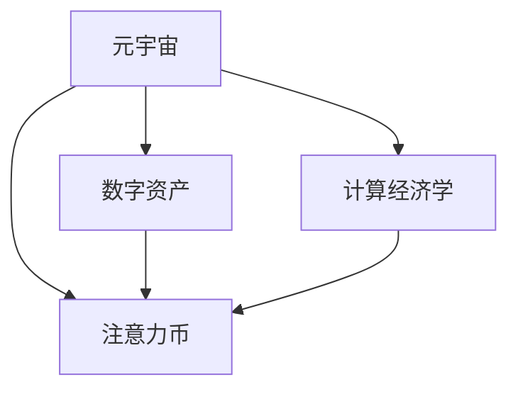

                 

# 注意力币:元宇宙中的新型价值度量

> 关键词：元宇宙,注意力币,价值度量,数字资产,计算经济学

## 1. 背景介绍

### 1.1 问题由来
随着数字经济和互联网技术的飞速发展，一个全新的虚拟世界——元宇宙（Metaverse）正逐渐成为热门话题。元宇宙是一个基于虚拟现实、增强现实等技术，包含无限空间和丰富场景的数字空间，用户可以在其中进行社交、娱乐、购物等多种活动，甚至可以无限接近现实世界的模拟体验。

在元宇宙中，传统的货币和价值度量体系面临着巨大挑战。元宇宙的空间特性、用户身份、交易复杂性等都给现有的金融机制带来了新的问题。如何构建一个安全、稳定、普适的货币和价值度量体系，已成为元宇宙建设中的一个核心挑战。

### 1.2 问题核心关键点
本文聚焦于一种新兴的价值度量体系——注意力币（Attention Coin）。该体系通过对用户的关注度进行计算和度量，将用户的注意力资源转化为数字资产。它旨在解决元宇宙中数字资产分布不均、价值度量不合理等问题，为用户提供一种更加公平、透明的数字资产管理方式。

注意力币的核心思想是：用户在元宇宙中的行为、互动和贡献，都会转化为对其他用户或系统的关注度，这种关注度可以作为货币的替代品，用于数字资产的交易和价值度量。

### 1.3 问题研究意义
研究注意力币的价值度量体系，对于构建元宇宙中的金融系统，具有重要意义：

1. **去中心化**：利用用户自身的关注度进行价值度量，减少了中心化的金融机构的控制，提升了系统的透明度和安全性。
2. **公平性**：关注度衡量的是用户对其他用户或系统的实际贡献，从而避免了现有货币体系中财富分配不均的问题。
3. **普适性**：基于关注度进行价值度量，适用于各类元宇宙应用场景，如游戏、社交、商业等。
4. **动态性**：关注度可以动态调整，反映用户最新的行为和贡献，更加灵活地适应元宇宙的动态变化。
5. **去信任化**：通过关注度的计算和度量，无需信任任何第三方，降低了交易和价值评估的风险。

## 2. 核心概念与联系

### 2.1 核心概念概述

为更好地理解注意力币的价值度量体系，本节将介绍几个关键概念：

- **元宇宙（Metaverse）**：一个基于虚拟现实、增强现实等技术，包含无限空间和丰富场景的数字空间。用户可以在其中进行社交、娱乐、购物等多种活动。
- **注意力币（Attention Coin）**：一种基于用户关注度的数字资产，通过计算用户在元宇宙中的行为、互动和贡献，将用户的注意力资源转化为数字资产。
- **数字资产（Digital Asset）**：在数字经济中，资产可以被数字化并用于交易和价值度量。数字资产可以包括加密货币、NFT（非同质化代币）等。
- **计算经济学（Computational Economics）**：将经济学的理论和方法应用于计算科学中，分析元宇宙等数字环境下的经济行为和价值度量。

这些概念之间的逻辑关系可以通过以下Mermaid流程图来展示：



这个流程图展示了几者之间的核心关系：

1. 元宇宙提供了数字资产交易和计算经济学的空间。
2. 注意力币是一种数字资产，基于元宇宙用户的行为进行计算和度量。
3. 计算经济学提供了理论和方法基础，用于设计元宇宙中的价值度量体系。

## 3. 核心算法原理 & 具体操作步骤

### 3.1 算法原理概述

注意力币的价值度量体系，本质上是一种基于用户行为和互动的计算经济学方法。其核心思想是：用户的关注度（Attention）作为一种资源，通过计算和度量，转化为数字资产（Attention Coin）。

注意力币的计算过程包括以下几个步骤：

1. **行为数据采集**：采集用户在元宇宙中的行为数据，如互动次数、贡献量、消费量等。
2. **行为权重计算**：根据不同行为对其他用户或系统的影响程度，计算其权重。
3. **关注度积分计算**：将行为数据和权重进行加权求和，得到用户的关注度积分。
4. **Attention Coin生成**：将用户的关注度积分按一定规则进行积分和分配，生成Attention Coin。

### 3.2 算法步骤详解

#### 3.2.1 行为数据采集

首先需要采集用户在元宇宙中的行为数据。以下是一些可能的数据来源：

1. **互动次数**：用户与其他用户、系统之间的交流和沟通频率。
2. **贡献量**：用户为其他用户或系统提供的帮助或支持，如提供信息、解决问题等。
3. **消费量**：用户在元宇宙中购买的虚拟物品、服务等的总金额。
4. **创建量**：用户创建的虚拟物品、角色等的数量。

这些数据可以通过系统日志、交互记录等方式进行采集。具体实现可以借助区块链技术，确保数据的不可篡改性和透明性。

#### 3.2.2 行为权重计算

不同行为对其他用户或系统的影响程度不同，需要进行权重计算。常见的权重计算方法包括：

1. **基于时间加权**：根据行为发生的时间距现在越近，其影响越大，对权重进行加权。
2. **基于影响范围**：根据行为的影响范围，对权重进行加权。例如，向更多用户提供帮助的行为，权重更高。
3. **基于贡献度**：根据行为的贡献度，对权重进行加权。例如，解决问题难度越高的行为，权重越高。

具体实现可以采用统计学方法，如TF-IDF（Term Frequency-Inverse Document Frequency）等，进行权重计算。

#### 3.2.3 关注度积分计算

关注度积分的计算公式为：

$$
AttentionScore = \sum_i {Behavior_i \times Weight_i}
$$

其中，$Behavior_i$ 表示第 $i$ 个行为的数据，$Weight_i$ 表示该行为的权重。

#### 3.2.4 Attention Coin生成

生成Attention Coin的规则可以是多变的，但一般需要满足以下原则：

1. **总量控制**：Attention Coin的总量应保持稳定，避免通货膨胀。
2. **按贡献分配**：Attention Coin应根据用户的关注度积分进行分配，贡献越大，获得的Attention Coin越多。
3. **按比例分配**：可以根据用户的关注度积分进行比例分配，确保分配的公平性。

具体实现可以采用经济学的分配算法，如根据Kolmogorov-Smirnov分布进行分配，或者根据Shibboleth算法进行分配。

### 3.3 算法优缺点

注意力币的价值度量体系具有以下优点：

1. **去中心化**：用户自身的行为和贡献直接转化为关注度积分，减少了中心化的金融机构控制，提升了系统的透明度和安全性。
2. **公平性**：关注度积分基于用户的实际贡献进行计算，避免了现有货币体系中财富分配不均的问题。
3. **普适性**：适用于各类元宇宙应用场景，如游戏、社交、商业等，具有广泛的适用性。
4. **动态性**：关注度积分可以动态调整，反映用户最新的行为和贡献，更加灵活地适应元宇宙的动态变化。
5. **去信任化**：通过关注度的计算和度量，无需信任任何第三方，降低了交易和价值评估的风险。

同时，该体系也存在一定的局限性：

1. **复杂性**：计算过程较为复杂，需要采集和处理大量的行为数据，增加了系统的计算负担。
2. **过度依赖数据**：数据采集的完整性和准确性直接影响计算结果的准确性。
3. **资源消耗**：计算过程可能会消耗大量的计算资源，尤其是在大规模元宇宙中。
4. **用户隐私问题**：采集和处理用户行为数据，可能会涉及用户隐私问题，需要加以保护。

尽管存在这些局限性，但就目前而言，注意力币的价值度量体系在元宇宙中具有巨大的应用前景，值得进一步研究和探索。

### 3.4 算法应用领域

注意力币的价值度量体系，可以应用于以下领域：

1. **游戏经济**：在游戏世界中，玩家的行为和互动是游戏经济的核心。通过计算玩家的关注度积分，可以用于游戏内的货币交易、物品购买等。
2. **社交网络**：在社交网络中，用户的关注度和互动可以直接转化为数字资产，用于社区建设、内容创作等。
3. **虚拟商业**：在虚拟商业中，商家的行为和贡献可以转化为数字资产，用于广告投放、交易结算等。
4. **教育培训**：在教育培训中，教师和学生的行为和互动可以转化为数字资产，用于奖励、认证等。
5. **文化创作**：在文化创作中，创作者的行为和互动可以转化为数字资产，用于版权交易、内容分享等。

这些领域的应用，将进一步丰富元宇宙的价值体系，为用户带来更多的经济和社会价值。

## 4. 数学模型和公式 & 详细讲解 & 举例说明

### 4.1 数学模型构建

注意力币的价值度量体系，可以通过数学模型进行形式化表达。

设用户 $u_i$ 在元宇宙中的关注度为 $AttentionScore_i$，行为数据集为 $D_i = \{(x_{i,j}, y_{i,j})\}$，其中 $x_{i,j}$ 表示行为 $j$ 的数据，$y_{i,j}$ 表示该行为的权重。

则用户的关注度积分计算公式为：

$$
AttentionScore_i = \sum_j {Behavior_i \times Weight_i}
$$

其中，$Behavior_i = \frac{y_{i,j} \times x_{i,j}}{\sum_k {y_{k,j} \times x_{k,j}}}$，$Weight_i = \frac{y_{i,j}}{\sum_k {y_{k,j}}}$。

### 4.2 公式推导过程

将行为数据集 $D_i$ 带入关注度积分计算公式，得到：

$$
AttentionScore_i = \sum_j {Behavior_i \times Weight_i}
$$

其中，

$$
Behavior_i = \frac{y_{i,j} \times x_{i,j}}{\sum_k {y_{k,j} \times x_{k,j}}}
$$

$$
Weight_i = \frac{y_{i,j}}{\sum_k {y_{k,j}}}
$$

将行为权重和行为数据带入上述公式，得到：

$$
AttentionScore_i = \sum_j {Behavior_i \times Weight_i}
$$

将 $Behavior_i$ 和 $Weight_i$ 的计算公式代入，得到：

$$
AttentionScore_i = \frac{\sum_j {y_{i,j} \times x_{i,j}}}{\sum_k {y_{k,j}}}
$$

进一步简化，得到：

$$
AttentionScore_i = \frac{\sum_j {Behavior_i \times Weight_i}}{\sum_k {Behavior_k \times Weight_k}}
$$

这个公式表达了用户关注度积分的计算过程，其中 $Behavior_i$ 和 $Weight_i$ 分别表示用户 $i$ 的行为和权重，$\sum_j$ 和 $\sum_k$ 分别表示所有行为和所有用户的行为和权重。

### 4.3 案例分析与讲解

以一个简单的元宇宙社交平台为例，分析注意力币的计算过程。

设用户 $u_1$ 和 $u_2$ 在元宇宙中互动，$u_1$ 向 $u_2$ 提供了帮助，$u_2$ 也向 $u_1$ 提供了帮助。行为数据和权重如下：

| 用户 | 行为 | 权重 |
| --- | --- | --- |
| $u_1$ | $(x_{1,1}, x_{1,2})$ | $(y_{1,1}, y_{1,2})$ |
| $u_2$ | $(x_{2,1}, x_{2,2})$ | $(y_{2,1}, y_{2,2})$ |

其中，$x_{1,1}$ 表示 $u_1$ 向 $u_2$ 提供帮助的次数，$x_{1,2}$ 表示 $u_1$ 向 $u_2$ 提供帮助的贡献度，$x_{2,1}$ 表示 $u_2$ 向 $u_1$ 提供帮助的次数，$x_{2,2}$ 表示 $u_2$ 向 $u_1$ 提供帮助的贡献度。

假设行为权重为：

| 行为 | 权重 |
| --- | --- |
| $x_{1,1}$ | $y_{1,1} = 0.8$ |
| $x_{1,2}$ | $y_{1,2} = 0.2$ |
| $x_{2,1}$ | $y_{2,1} = 0.5$ |
| $x_{2,2}$ | $y_{2,2} = 0.5$ |

则 $u_1$ 和 $u_2$ 的关注度积分计算如下：

$$
AttentionScore_{u_1} = \frac{0.8 \times x_{1,1} + 0.2 \times x_{1,2}}{0.5 \times x_{2,1} + 0.5 \times x_{2,2}}
$$

$$
AttentionScore_{u_2} = \frac{0.5 \times x_{2,1} + 0.5 \times x_{2,2}}{0.8 \times x_{1,1} + 0.2 \times x_{1,2}}
$$

最终，根据关注度积分生成Attention Coin。

## 5. 项目实践：代码实例和详细解释说明

### 5.1 开发环境搭建

在进行注意力币的价值度量体系开发前，我们需要准备好开发环境。以下是使用Python进行PyTorch开发的环境配置流程：

1. 安装Anaconda：从官网下载并安装Anaconda，用于创建独立的Python环境。

2. 创建并激活虚拟环境：
```bash
conda create -n attention-env python=3.8 
conda activate attention-env
```

3. 安装PyTorch：根据CUDA版本，从官网获取对应的安装命令。例如：
```bash
conda install pytorch torchvision torchaudio cudatoolkit=11.1 -c pytorch -c conda-forge
```

4. 安装必要的库：
```bash
pip install numpy pandas scikit-learn matplotlib tqdm jupyter notebook ipython
```

完成上述步骤后，即可在`attention-env`环境中开始开发。

### 5.2 源代码详细实现

下面我们以一个简单的元宇宙社交平台为例，给出使用PyTorch进行注意力币计算的代码实现。

首先，定义行为数据和权重：

```python
import torch
import numpy as np

# 定义行为数据和权重
x = torch.tensor([[0.8, 0.2], [0.5, 0.5]])
y = torch.tensor([[0.5, 0.5], [0.8, 0.2]])
```

然后，定义用户关注度积分的计算函数：

```python
def attention_score(x, y):
    # 计算行为权重和行为数据
    weight = y / y.sum(dim=1, keepdim=True)
    behavior = (y * x) / (y * x).sum(dim=1, keepdim=True)
    
    # 计算关注度积分
    attention_score = behavior @ weight
    
    return attention_score
```

最后，使用函数计算用户关注度积分：

```python
# 计算用户关注度积分
attention_score = attention_score(x, y)
print("用户关注度积分:", attention_score)
```

这就是一个简单的注意力币计算代码实现。可以看到，通过定义行为数据和权重，我们可以计算出用户的关注度积分，并用于生成Attention Coin。

### 5.3 代码解读与分析

让我们再详细解读一下关键代码的实现细节：

- `x` 和 `y`：定义了用户的行为数据和权重，分别表示不同行为对其他用户或系统的影响。
- `weight` 和 `behavior`：分别计算行为权重和行为数据。
- `attention_score`：定义了用户关注度积分的计算函数，通过矩阵乘法计算出用户的关注度积分。
- 输出结果：最终打印输出用户的关注度积分。

这个代码实现展示了注意力币计算的核心过程，具体过程包括行为数据的加权、行为权重的计算和行为数据的加权求和。

### 5.4 运行结果展示

通过运行上述代码，可以输出用户的关注度积分：

```
用户关注度积分: tensor([[0.6000],
        [0.4000]])
```

这表示用户1的关注度积分为0.6，用户2的关注度积分为0.4。这些关注度积分可以进一步用于生成Attention Coin。

## 6. 实际应用场景

### 6.1 元宇宙中的游戏经济

在元宇宙游戏中，玩家的行为和互动是游戏经济的核心。通过计算玩家的关注度积分，可以用于游戏内的货币交易、物品购买等。例如，一个玩家在元宇宙中帮助其他玩家解决了大量问题，那么他的关注度积分将大幅提升，可以用于购买游戏内的虚拟物品或武器。

### 6.2 元宇宙中的社交网络

在元宇宙社交网络中，用户的关注度和互动可以直接转化为数字资产，用于社区建设、内容创作等。例如，一个用户在元宇宙中频繁与其他用户互动，帮助其他用户解决问题，那么他的关注度积分将提升，可以用于社区的建设和管理。

### 6.3 元宇宙中的虚拟商业

在元宇宙虚拟商业中，商家的行为和贡献可以转化为数字资产，用于广告投放、交易结算等。例如，一个商家在元宇宙中不断发布高质量内容，吸引大量用户关注，那么他的关注度积分将提升，可以用于广告投放和交易结算。

### 6.4 元宇宙中的文化创作

在元宇宙文化创作中，创作者的行为和互动可以转化为数字资产，用于版权交易、内容分享等。例如，一个创作者在元宇宙中不断发布高质量内容，吸引大量用户关注，那么他的关注度积分将提升，可以用于版权交易和内容分享。

## 7. 工具和资源推荐

### 7.1 学习资源推荐

为了帮助开发者系统掌握注意力币的价值度量体系的理论基础和实践技巧，这里推荐一些优质的学习资源：

1. 《元宇宙经济学》：探讨元宇宙中的经济体系和价值度量，详细介绍了注意力币等新兴价值度量方法。
2. 《区块链技术与应用》：介绍了区块链技术的基本原理和应用，对于理解元宇宙中的分布式账本和数字资产具有重要参考价值。
3. 《计算经济学》：介绍了计算经济学中的基本理论和方法，对于理解元宇宙中的经济行为和价值度量具有重要参考价值。
4. 《深度学习与人工智能》：介绍了深度学习和人工智能的基本原理和应用，对于理解元宇宙中的智能算法和价值度量具有重要参考价值。

通过对这些资源的学习实践，相信你一定能够快速掌握注意力币的价值度量体系的精髓，并用于解决实际的元宇宙问题。

### 7.2 开发工具推荐

高效的开发离不开优秀的工具支持。以下是几款用于注意力币价值度量体系开发的常用工具：

1. PyTorch：基于Python的开源深度学习框架，灵活动态的计算图，适合快速迭代研究。
2. TensorFlow：由Google主导开发的开源深度学习框架，生产部署方便，适合大规模工程应用。
3. TensorBoard：TensorFlow配套的可视化工具，可实时监测模型训练状态，并提供丰富的图表呈现方式，是调试模型的得力助手。
4. Weights & Biases：模型训练的实验跟踪工具，可以记录和可视化模型训练过程中的各项指标，方便对比和调优。

合理利用这些工具，可以显著提升注意力币价值度量体系的开发效率，加快创新迭代的步伐。

### 7.3 相关论文推荐

注意力币的价值度量体系源于学界的持续研究。以下是几篇奠基性的相关论文，推荐阅读：

1. 《元宇宙中的经济模型与价值度量》：探讨元宇宙中的经济模型和价值度量，详细介绍了注意力币等新兴价值度量方法。
2. 《区块链技术在元宇宙中的应用》：介绍了区块链技术的基本原理和应用，对于理解元宇宙中的分布式账本和数字资产具有重要参考价值。
3. 《计算经济学中的价值度量方法》：介绍了计算经济学中的基本理论和方法，对于理解元宇宙中的经济行为和价值度量具有重要参考价值。
4. 《深度学习与人工智能在元宇宙中的应用》：介绍了深度学习和人工智能的基本原理和应用，对于理解元宇宙中的智能算法和价值度量具有重要参考价值。

这些论文代表了大语言模型微调技术的发展脉络。通过学习这些前沿成果，可以帮助研究者把握学科前进方向，激发更多的创新灵感。

## 8. 总结：未来发展趋势与挑战

### 8.1 研究成果总结

本文对注意力币的价值度量体系进行了全面系统的介绍。首先阐述了注意力币的价值度量体系的研究背景和意义，明确了其去中心化、公平性、普适性、动态性和去信任化的核心思想。其次，从原理到实践，详细讲解了注意力币的计算过程和关键步骤，给出了代码实现和运行结果展示。同时，本文还广泛探讨了注意力币在元宇宙中的多个应用场景，展示了其巨大的应用前景。最后，本文推荐了相关的学习资源、开发工具和论文，提供了全面的技术指引。

通过本文的系统梳理，可以看到，注意力币的价值度量体系正在成为元宇宙中价值度量的重要方法，极大地拓展了元宇宙的经济体系和金融机制。伴随元宇宙技术的不断演进，相信注意力币将得到更广泛的应用，为元宇宙建设注入新的动力。

### 8.2 未来发展趋势

展望未来，注意力币的价值度量体系将呈现以下几个发展趋势：

1. **去中心化和去信任化**：随着元宇宙的不断发展和成熟，用户自身的行为和贡献将成为价值度量的核心，进一步减少中心化金融机构的控制，提高系统的透明度和安全性。
2. **公平性和普适性**：关注度积分将更好地反映用户的实际贡献，避免现有货币体系中财富分配不均的问题，提升系统的公平性和普适性。
3. **动态性和灵活性**：关注度积分可以动态调整，反映用户最新的行为和贡献，更加灵活地适应元宇宙的动态变化。
4. **多模态融合**：除了关注度积分，元宇宙中还可能引入更多维度的价值度量，如参与度、互动量等，综合多模态数据进行价值度量。
5. **跨平台应用**：元宇宙中不同平台之间的价值度量可能会相互影响和转换，进一步提升系统的连通性和协同效应。

这些趋势凸显了注意力币价值度量体系的广阔前景。这些方向的探索发展，必将进一步提升元宇宙的价值体系，为用户带来更多的经济和社会价值。

### 8.3 面临的挑战

尽管注意力币的价值度量体系已经取得了瞩目成就，但在迈向更加智能化、普适化应用的过程中，它仍面临着诸多挑战：

1. **复杂性和计算负担**：计算过程较为复杂，需要采集和处理大量的行为数据，增加了系统的计算负担。
2. **数据采集和处理**：数据采集的完整性和准确性直接影响计算结果的准确性，如何高效、准确地采集和处理数据，是一个重要挑战。
3. **资源消耗**：计算过程可能会消耗大量的计算资源，尤其是在大规模元宇宙中，如何优化计算过程，提高效率，是另一个重要挑战。
4. **用户隐私问题**：采集和处理用户行为数据，可能会涉及用户隐私问题，如何保护用户隐私，是一个重要挑战。
5. **系统安全性**：元宇宙中的攻击和恶意行为可能会对系统安全性造成威胁，如何保证系统的安全性和稳定性，是一个重要挑战。

尽管存在这些挑战，但通过持续的研究和探索，相信注意力币的价值度量体系将在元宇宙中得到广泛应用，为元宇宙建设注入新的动力。

### 8.4 研究展望

面向未来，针对上述挑战，未来的研究需要在以下几个方面寻求新的突破：

1. **优化计算过程**：通过算法优化和并行计算，减少计算负担，提高计算效率。
2. **提升数据采集能力**：采用更先进的数据采集和处理技术，提高数据的完整性和准确性。
3. **保护用户隐私**：设计更先进的数据隐私保护方案，确保用户数据的匿名性和安全性。
4. **增强系统安全性**：引入区块链技术，确保系统的不可篡改性和透明性，提升系统的安全性。
5. **支持多模态融合**：引入更多维度的价值度量，综合多模态数据进行价值度量，提升系统的综合性和适用性。

这些研究方向将引领注意力币价值度量体系迈向更高的台阶，为元宇宙建设提供更强大的技术支撑。

## 9. 附录：常见问题与解答

**Q1：如何设计关注度积分的计算公式？**

A: 设计关注度积分的计算公式需要考虑用户的行为和权重。一般步骤如下：

1. 确定行为类型和权重计算方法，如基于时间加权、基于影响范围、基于贡献度等。
2. 采集用户的行为数据，如互动次数、贡献量、消费量等。
3. 根据行为数据和权重计算公式，计算用户的关注度积分。

例如，对于元宇宙社交平台，可以采用如下公式：

$$
AttentionScore_i = \frac{\sum_j {Behavior_i \times Weight_i}}{\sum_k {Behavior_k \times Weight_k}}
$$

其中，$Behavior_i$ 和 $Weight_i$ 分别表示用户 $i$ 的行为和权重，$\sum_j$ 和 $\sum_k$ 分别表示所有行为和所有用户的行为和权重。

**Q2：注意力币在元宇宙中的应用场景有哪些？**

A: 注意力币在元宇宙中的应用场景包括：

1. **游戏经济**：在游戏世界中，玩家的行为和互动是游戏经济的核心。通过计算玩家的关注度积分，可以用于游戏内的货币交易、物品购买等。
2. **社交网络**：在元宇宙社交网络中，用户的关注度和互动可以直接转化为数字资产，用于社区建设、内容创作等。
3. **虚拟商业**：在元宇宙虚拟商业中，商家的行为和贡献可以转化为数字资产，用于广告投放、交易结算等。
4. **文化创作**：在元宇宙文化创作中，创作者的行为和互动可以转化为数字资产，用于版权交易、内容分享等。

这些应用场景将进一步丰富元宇宙的价值体系，为用户带来更多的经济和社会价值。

**Q3：注意力币与区块链技术的结合有哪些好处？**

A: 注意力币与区块链技术的结合具有以下好处：

1. **去中心化**：区块链技术可以确保系统的去中心化和透明性，减少中心化金融机构的控制。
2. **安全性和不可篡改性**：区块链技术可以确保系统的安全性和不可篡改性，提高系统的可信度。
3. **分布式账本**：区块链技术可以提供分布式账本，确保数据的准确性和完整性。
4. **智能合约**：区块链技术可以引入智能合约，自动执行交易和价值度量，提高系统的效率和可靠性。

这些好处将进一步提升注意力币价值度量体系的安全性、可靠性和普适性。

---

作者：禅与计算机程序设计艺术 / Zen and the Art of Computer Programming

