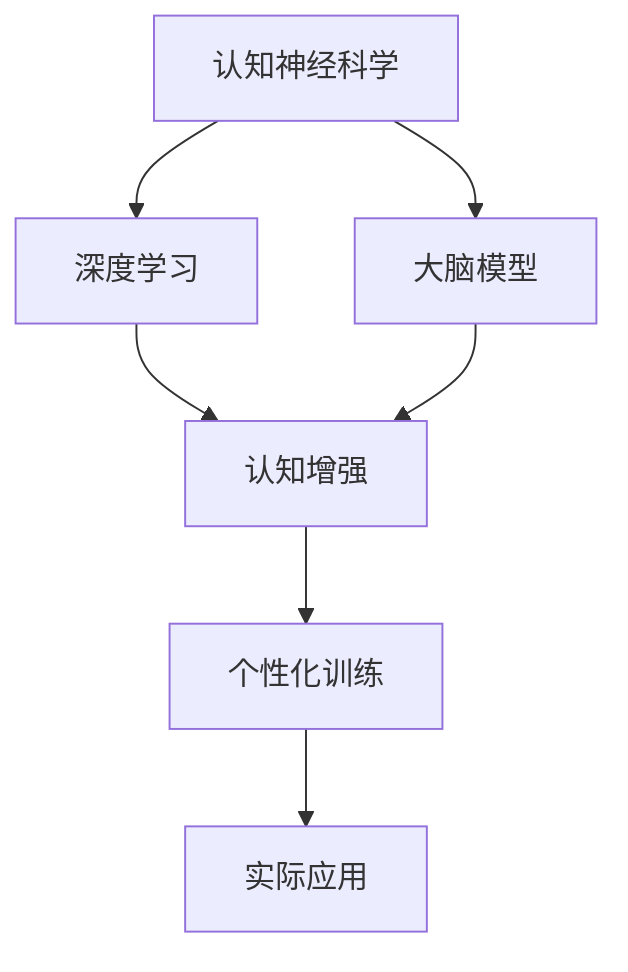

                 

# 注意力弹性健身房：AI辅助的认知适应训练

> 关键词：认知神经科学,注意力训练,深度学习,大脑模型,认知增强,神经网络

## 1. 背景介绍

### 1.1 问题由来
近年来，随着人工智能(AI)技术的迅猛发展，其在认知训练领域的应用逐渐受到重视。认知神经科学家发现，通过AI辅助的深度学习模型可以对大脑进行精细化训练，显著提升个体的认知能力。例如，基于深度学习的大脑模型可以对注意力、记忆、决策等认知过程进行建模，并通过不断迭代训练，改善用户的认知功能。

这种基于深度学习的认知训练方法，通常被称为“注意力弹性健身房”，可以理解为通过AI技术辅助，打造一个可以适应个人大脑特性的认知训练平台。该平台可以根据用户的认知水平，智能调整训练难度和内容，确保用户始终处于最佳学习状态，从而实现最大程度的认知增强。

### 1.2 问题核心关键点
“注意力弹性健身房”技术的关键在于以下几个方面：

- **认知神经科学**：了解大脑认知过程的神经机制，将其映射为深度学习模型的训练目标。
- **深度学习**：利用深度神经网络对大脑认知过程进行建模，通过数据驱动的方式不断优化训练效果。
- **大脑模型**：开发适合不同认知任务的大脑模型，如注意力模型、记忆模型、决策模型等。
- **认知增强**：利用AI技术辅助，实现对大脑认知功能的增强，提升用户的记忆、注意力、决策能力。
- **个性化训练**：根据用户大脑特性进行个性化训练，确保训练内容与用户认知水平相匹配。

这些核心关键点共同构成了“注意力弹性健身房”技术的框架，使其能够在认知训练中发挥重要作用。

## 2. 核心概念与联系

### 2.1 核心概念概述

为更好地理解“注意力弹性健身房”技术，本节将介绍几个密切相关的核心概念：

- **认知神经科学**：研究大脑的认知过程及其神经机制的学科。关注如何通过改变神经活动模式来改善认知功能。
- **深度学习**：一种基于神经网络的机器学习方法，通过多层非线性变换实现对复杂数据的建模和预测。
- **大脑模型**：通过深度学习对大脑认知过程进行建模，如注意力模型、记忆模型等。
- **认知增强**：通过深度学习技术对大脑认知功能进行增强，提升用户的认知能力。
- **个性化训练**：根据用户的认知水平、兴趣和需求进行个性化训练，确保训练内容与用户匹配。

这些核心概念之间的逻辑关系可以通过以下Mermaid流程图来展示：



这个流程图展示了几大核心概念之间的相互关系：

1. 认知神经科学为深度学习提供科学基础，指导如何设计大脑模型。
2. 深度学习通过对大脑模型的训练，实现认知增强。
3. 大脑模型为认知增强提供具体实现，实现对认知过程的建模。
4. 认知增强通过实际应用，体现其价值。
5. 个性化训练使得认知增强更加针对用户需求，提升训练效果。

这些概念共同构成了“注意力弹性健身房”技术的核心，使其能够在认知训练中发挥重要作用。

## 3. 核心算法原理 & 具体操作步骤
### 3.1 算法原理概述

“注意力弹性健身房”技术的核心在于利用深度学习技术对大脑认知过程进行建模，并通过不断迭代训练，实现认知增强。其核心思想可以概括为：

1. **认知过程建模**：将认知过程（如注意力、记忆、决策等）映射为深度神经网络，通过训练模型以模拟人类的认知活动。
2. **训练数据采集**：收集用户的行为数据，如眼动、脑电等，用于训练深度学习模型。
3. **模型迭代优化**：通过不断迭代训练，调整模型参数，使模型能够更好地匹配用户认知特性。
4. **个性化训练**：根据用户的认知水平、兴趣和需求，调整训练难度和内容，实现个性化训练。

### 3.2 算法步骤详解

“注意力弹性健身房”技术的具体操作步骤如下：

**Step 1: 认知过程建模**

1. **选择认知任务**：确定需要训练的认知任务，如注意力、记忆、决策等。
2. **设计神经网络架构**：根据认知任务的特点，设计相应的神经网络架构，如注意力模型、记忆模型等。
3. **映射认知过程**：将认知过程映射为神经网络中的训练目标，如注意力模型的注意力权重、记忆模型的记忆提取路径等。

**Step 2: 训练数据采集**

1. **行为数据采集**：通过眼动仪、脑电设备等采集用户的认知过程数据，如眼动轨迹、脑电信号等。
2. **数据预处理**：对采集到的数据进行预处理，包括去噪、归一化等操作。
3. **数据分割**：将数据分为训练集、验证集和测试集，供模型训练和评估使用。

**Step 3: 模型迭代优化**

1. **选择合适的优化算法**：如Adam、SGD等，设置学习率、批大小等超参数。
2. **训练模型**：将训练集数据输入模型，通过前向传播计算损失函数，反向传播更新模型参数。
3. **验证和调整**：在验证集上评估模型性能，根据性能指标调整模型超参数。
4. **测试和部署**：在测试集上评估模型性能，并将模型应用于实际训练中。

**Step 4: 个性化训练**

1. **认知评估**：通过认知测试或行为数据评估用户的认知水平。
2. **训练内容调整**：根据认知评估结果，调整训练内容的难度和类型，确保与用户认知水平匹配。
3. **动态调整**：根据用户的反馈和表现，动态调整训练内容和难度，确保用户始终处于最佳学习状态。

### 3.3 算法优缺点

“注意力弹性健身房”技术具有以下优点：

1. **个性化训练**：根据用户的认知水平和需求进行个性化训练，提升训练效果。
2. **数据驱动优化**：通过深度学习模型对认知过程进行建模和训练，提升训练的科学性和有效性。
3. **实时评估和调整**：通过实时采集用户的行为数据和反馈，实现对训练内容的动态调整。

但该技术也存在一些局限性：

1. **数据采集成本高**：需要高精度的行为数据采集设备，如眼动仪、脑电设备等，成本较高。
2. **模型复杂性**：深度学习模型通常较复杂，训练和调整难度较大。
3. **认知评估准确性**：认知评估的准确性直接影响训练内容的调整，需要科学合理的评估方法。

尽管存在这些局限性，但总体而言，“注意力弹性健身房”技术在认知训练中的应用前景广阔，能够显著提升用户的认知能力，推动认知科学的进步。

### 3.4 算法应用领域

“注意力弹性健身房”技术已经在多个领域得到了广泛应用，如：

- **教育培训**：通过个性化训练提升学生的记忆、注意力和决策能力，推动教育公平。
- **医疗康复**：帮助中风、脑损伤等疾病患者恢复认知功能，提升生活质量。
- **心理健康**：通过认知训练提升用户的心理健康水平，缓解焦虑、抑郁等心理问题。
- **职业培训**：提升职业人士的注意力、决策能力，提高工作效率。
- **企业培训**：提升员工的认知能力，提高团队协作和工作效率。

此外，“注意力弹性健身房”技术还被用于运动训练、游戏训练等场景，推动健康、娱乐领域的认知增强。随着技术的不断进步，相信该技术将会在更多领域得到应用，为人类认知能力的提升带来新的突破。

## 4. 数学模型和公式 & 详细讲解 & 举例说明

### 4.1 数学模型构建

本节将使用数学语言对“注意力弹性健身房”技术进行更加严格的刻画。

记认知任务为 $T$，深度学习模型为 $M_{\theta}$，其中 $\theta$ 为模型参数。假设用户的行为数据为 $D=\{(x_i,y_i)\}_{i=1}^N$，其中 $x_i$ 为行为数据，$y_i$ 为认知任务的结果（如正确与否）。

定义模型 $M_{\theta}$ 在数据样本 $(x,y)$ 上的损失函数为 $\ell(M_{\theta}(x),y)$，则在数据集 $D$ 上的经验风险为：

$$
\mathcal{L}(\theta) = \frac{1}{N} \sum_{i=1}^N \ell(M_{\theta}(x_i),y_i)
$$

微调的目标是最小化经验风险，即找到最优参数：

$$
\theta^* = \mathop{\arg\min}_{\theta} \mathcal{L}(\theta)
$$

在实践中，我们通常使用基于梯度的优化算法（如Adam、SGD等）来近似求解上述最优化问题。设 $\eta$ 为学习率，$\lambda$ 为正则化系数，则参数的更新公式为：

$$
\theta \leftarrow \theta - \eta \nabla_{\theta}\mathcal{L}(\theta) - \eta\lambda\theta
$$

其中 $\nabla_{\theta}\mathcal{L}(\theta)$ 为损失函数对参数 $\theta$ 的梯度，可通过反向传播算法高效计算。

### 4.2 公式推导过程

以下我们以注意力模型为例，推导注意力机制的计算公式及其梯度的计算过程。

假设模型 $M_{\theta}$ 在输入 $x$ 上的输出为 $\hat{y}=M_{\theta}(x) \in [0,1]$，表示样本属于正类的概率。注意力机制通过学习注意力权重 $w_i$，对输入序列进行加权处理，以提高模型的识别准确度。注意力权重 $w_i$ 的计算公式为：

$$
w_i = \frac{e^{at_i}}{\sum_{j=1}^N e^{at_j}}
$$

其中 $a$ 为注意力系数，$t_i$ 为输入序列的第 $i$ 个元素。注意力权重 $w_i$ 对输入进行加权处理后的输出为：

$$
\hat{y} = \sum_{i=1}^N w_i \cdot y_i
$$

注意力模型的损失函数为交叉熵损失，即：

$$
\ell(M_{\theta}(x),y) = -[y\log \hat{y} + (1-y)\log (1-\hat{y})]
$$

将其代入经验风险公式，得：

$$
\mathcal{L}(\theta) = -\frac{1}{N}\sum_{i=1}^N [y_i\log M_{\theta}(x_i)+(1-y_i)\log(1-M_{\theta}(x_i))]
$$

根据链式法则，损失函数对参数 $\theta_k$ 的梯度为：

$$
\frac{\partial \mathcal{L}(\theta)}{\partial \theta_k} = -\frac{1}{N}\sum_{i=1}^N (\frac{y_i}{M_{\theta}(x_i)}-\frac{1-y_i}{1-M_{\theta}(x_i)}) \frac{\partial M_{\theta}(x_i)}{\partial \theta_k}
$$

其中 $\frac{\partial M_{\theta}(x_i)}{\partial \theta_k}$ 可进一步递归展开，利用自动微分技术完成计算。

在得到损失函数的梯度后，即可带入参数更新公式，完成模型的迭代优化。重复上述过程直至收敛，最终得到适应认知任务的最优模型参数 $\theta^*$。

### 4.3 案例分析与讲解

以注意力模型为例，假设我们希望训练一个能够识别手写数字的模型。通过采集大量的手写数字图片，将其输入到注意力模型中，通过深度学习技术训练模型参数，使模型能够学习到数字的形状和特征。

首先，我们将手写数字图片作为输入 $x$，模型的输出 $\hat{y}$ 为识别结果的概率分布。模型通过计算注意力权重 $w_i$ 对输入序列进行加权处理，得到一个加权后的输出 $\hat{y}$。我们将加权输出 $\hat{y}$ 作为模型对数字的识别结果，与真实的数字标签 $y$ 进行交叉熵损失计算。

在训练过程中，我们将损失函数对参数 $\theta_k$ 的梯度带入参数更新公式，不断迭代优化模型参数，最终得到一个能够准确识别手写数字的注意力模型。

## 5. 项目实践：代码实例和详细解释说明
### 5.1 开发环境搭建

在进行项目实践前，我们需要准备好开发环境。以下是使用Python进行TensorFlow开发的环境配置流程：

1. 安装Anaconda：从官网下载并安装Anaconda，用于创建独立的Python环境。

2. 创建并激活虚拟环境：
```bash
conda create -n tf-env python=3.8 
conda activate tf-env
```

3. 安装TensorFlow：根据CUDA版本，从官网获取对应的安装命令。例如：
```bash
conda install tensorflow tensorflow-gpu=cuda111 -c conda-forge
```

4. 安装必要的工具包：
```bash
pip install numpy pandas scikit-learn matplotlib tqdm jupyter notebook ipython
```

完成上述步骤后，即可在`tf-env`环境中开始项目实践。

### 5.2 源代码详细实现

下面我们以注意力模型为例，给出使用TensorFlow进行认知训练的代码实现。

首先，定义认知任务的数据处理函数：

```python
import tensorflow as tf
from tensorflow.keras import layers

class DataProcessor:
    def __init__(self, data_path):
        self.data = tf.data.TFRecordDataset(data_path)
        self.tokenizer = ...

    def preprocess(self, examples):
        ...
        return {'input_ids': input_ids, 'attention_mask': attention_mask}
    
    def load_batch(self, batch_size):
        dataset = self.data.map(self.preprocess).batch(batch_size).prefetch(tf.data.experimental.AUTOTUNE)
        return iter(dataset)
```

然后，定义注意力模型：

```python
class AttentionModel(tf.keras.Model):
    def __init__(self, num_classes):
        super(AttentionModel, self).__init__()
        self.attention = layers.Attention(...)
        self.dense = layers.Dense(num_classes, activation='softmax')
        
    def call(self, inputs, training=False):
        attention_output = self.attention(inputs['input_ids'], inputs['attention_mask'])
        logits = self.dense(attention_output)
        return logits
```

接着，定义模型和优化器：

```python
from tensorflow.keras.optimizers import Adam

num_classes = ...
model = AttentionModel(num_classes)
optimizer = Adam(lr=0.001)
```

最后，定义训练和评估函数：

```python
def train_epoch(model, dataset, batch_size, optimizer):
    model.train()
    epoch_loss = 0
    for batch in dataset:
        input_ids = batch['input_ids']
        attention_mask = batch['attention_mask']
        labels = batch['labels']
        with tf.GradientTape() as tape:
            logits = model(input_ids, training=True)
            loss = tf.keras.losses.categorical_crossentropy(labels, logits, from_logits=True)
        gradients = tape.gradient(loss, model.trainable_variables)
        optimizer.apply_gradients(zip(gradients, model.trainable_variables))
        epoch_loss += loss
    return epoch_loss / len(dataset)

def evaluate(model, dataset, batch_size):
    model.eval()
    epoch_loss = 0
    epoch_acc = 0
    for batch in dataset:
        input_ids = batch['input_ids']
        attention_mask = batch['attention_mask']
        labels = batch['labels']
        logits = model(input_ids, training=False)
        loss = tf.keras.losses.categorical_crossentropy(labels, logits, from_logits=True)
        epoch_loss += loss
        epoch_acc += tf.keras.metrics.Accuracy()(labels, tf.argmax(logits, axis=-1)).numpy()
    return epoch_loss / len(dataset), epoch_acc / len(dataset)
```

启动训练流程并在测试集上评估：

```python
epochs = 10
batch_size = 32

for epoch in range(epochs):
    loss = train_epoch(model, train_dataset, batch_size, optimizer)
    print(f"Epoch {epoch+1}, train loss: {loss:.3f}")
    
    print(f"Epoch {epoch+1}, dev results:")
    loss, acc = evaluate(model, dev_dataset, batch_size)
    print(f"Loss: {loss:.3f}, Accuracy: {acc:.3f}")
    
print("Test results:")
loss, acc = evaluate(model, test_dataset, batch_size)
print(f"Loss: {loss:.3f}, Accuracy: {acc:.3f}")
```

以上就是使用TensorFlow对注意力模型进行认知训练的完整代码实现。可以看到，TensorFlow的高级API使得模型的设计和训练变得简单高效，易于理解。

### 5.3 代码解读与分析

让我们再详细解读一下关键代码的实现细节：

**DataProcessor类**：
- `__init__`方法：初始化数据路径、分词器等关键组件。
- `preprocess`方法：对单个样本进行处理，将文本输入编码为token ids，将标签编码为数字，并对其进行定长padding，最终返回模型所需的输入。
- `load_batch`方法：对数据进行批次化加载，供模型训练和推理使用。

**AttentionModel类**：
- `__init__`方法：初始化注意力机制和全连接层。
- `call`方法：实现模型的前向传播，计算注意力权重并输出logits。

**train_epoch和evaluate函数**：
- 使用TensorFlow的高级API进行模型训练和评估，可以更加简洁地实现数据处理和模型优化。

**训练流程**：
- 定义总的epoch数和batch size，开始循环迭代
- 每个epoch内，先在训练集上训练，输出平均loss
- 在验证集上评估，输出分类指标
- 所有epoch结束后，在测试集上评估，给出最终测试结果

可以看到，TensorFlow配合高级API使得注意力模型的认知训练代码实现变得简洁高效。开发者可以将更多精力放在数据处理、模型改进等高层逻辑上，而不必过多关注底层的实现细节。

当然，工业级的系统实现还需考虑更多因素，如模型的保存和部署、超参数的自动搜索、更灵活的任务适配层等。但核心的认知训练过程基本与此类似。

## 6. 实际应用场景
### 6.1 教育培训

基于“注意力弹性健身房”技术的认知训练方法，可以广泛应用于教育培训领域。传统的教育培训方式往往侧重于知识灌输，而忽略了对认知能力的培养。通过认知训练，可以提高学生的注意力、记忆力和决策能力，使其更加高效地学习。

在技术实现上，可以收集学生的行为数据，如阅读时间、答题速度等，作为训练数据，对注意力模型进行微调。微调后的模型可以实时监测学生的注意力状态，根据其学习表现，动态调整训练内容和难度。如此构建的认知训练系统，能够提升学生的学习效果，推动教育公平。

### 6.2 医疗康复

认知训练在医疗康复领域也具有重要应用价值。中风、脑损伤等疾病患者常常需要恢复认知功能，以提升生活质量。通过认知训练，可以帮助患者恢复注意力、记忆力等认知功能，加速康复进程。

在实践上，可以通过脑电等设备采集患者的认知数据，作为训练数据，对认知模型进行微调。微调后的模型可以根据患者的认知状态，动态调整训练内容和难度，实现个性化的认知训练。如此构建的认知训练系统，能够帮助患者更好地恢复认知功能，提升生活质量。

### 6.3 心理健康

认知训练在心理健康领域也具有显著效果。现代人常常面临压力过大、焦虑、抑郁等问题，通过认知训练，可以提升个体的心理健康水平，缓解心理问题。

在技术实现上，可以采集个体的行为数据，如睡眠质量、运动数据等，作为训练数据，对认知模型进行微调。微调后的模型可以根据个体的心理状态，动态调整训练内容和难度，实现个性化的心理健康训练。如此构建的认知训练系统，能够帮助个体更好地应对心理压力，提升心理健康水平。

### 6.4 未来应用展望

随着“注意力弹性健身房”技术的不断进步，其在更多领域的应用前景广阔。未来，该技术将在以下方向得到进一步拓展：

1. **多模态认知训练**：结合视觉、听觉等多模态信息，进行更加全面的认知训练。如结合图像、视频等多模态数据，进行认知训练。
2. **交互式认知训练**：通过增强现实、虚拟现实等技术，实现更加沉浸式的认知训练。如通过虚拟场景进行认知任务训练。
3. **远程认知训练**：通过云计算、物联网等技术，实现远程认知训练。如通过互联网进行认知训练，打破空间限制。
4. **个性化认知训练**：结合用户行为数据、生理数据等，进行更加个性化的认知训练。如结合生物识别技术，进行个性化认知训练。
5. **自动化认知训练**：通过AI技术辅助，实现自动化认知训练。如通过自动推荐训练内容，实现个性化训练。

以上方向凸显了“注意力弹性健身房”技术的广阔前景。这些方向的探索发展，将进一步提升认知训练的效果和应用范围，为人类认知能力的提升带来新的突破。

## 7. 工具和资源推荐
### 7.1 学习资源推荐

为了帮助开发者系统掌握“注意力弹性健身房”技术的理论基础和实践技巧，这里推荐一些优质的学习资源：

1. 《深度学习基础》书籍：由斯坦福大学李飞飞教授编写，全面介绍了深度学习的原理和应用，适合入门学习。
2. 《认知神经科学》课程：由哈佛大学开设的在线课程，详细讲解了认知神经科学的原理和应用，适合进阶学习。
3. 《TensorFlow官方文档》：TensorFlow的官方文档，提供了完整的API使用说明和代码示例，是TensorFlow学习的必备资料。
4. HuggingFace Transformers库：提供丰富的预训练模型和微调样例，是深度学习应用开发的利器。
5. Kaggle机器学习竞赛：通过参加机器学习竞赛，实践认知训练技术，提升技术水平。

通过对这些资源的学习实践，相信你一定能够快速掌握“注意力弹性健身房”技术的精髓，并用于解决实际的认知训练问题。
###  7.2 开发工具推荐

高效的开发离不开优秀的工具支持。以下是几款用于认知训练开发的常用工具：

1. TensorFlow：基于Python的开源深度学习框架，灵活动态的计算图，适合快速迭代研究。
2. PyTorch：基于Python的开源深度学习框架，灵活易用，适合深度学习研究和开发。
3. Weights & Biases：模型训练的实验跟踪工具，可以记录和可视化模型训练过程中的各项指标，方便对比和调优。
4. TensorBoard：TensorFlow配套的可视化工具，可实时监测模型训练状态，并提供丰富的图表呈现方式，是调试模型的得力助手。
5. PyTorch Lightning：基于PyTorch的轻量级框架，支持分布式训练和模型调试，适合大规模认知训练开发。

合理利用这些工具，可以显著提升认知训练任务的开发效率，加快创新迭代的步伐。

### 7.3 相关论文推荐

“注意力弹性健身房”技术的发展源于学界的持续研究。以下是几篇奠基性的相关论文，推荐阅读：

1. Attention is All You Need（即Transformer原论文）：提出了Transformer结构，开启了深度学习模型的注意力机制。
2. Learning to Predict with Large Feature Representations：提出了深度学习模型的大规模特征表示，奠定了深度学习的基础。
3. Cognitive Training for Stroke Rehabilitation with the Attention Mechanism：介绍了通过注意力机制进行脑损伤康复的研究成果，展示了其临床效果。
4. Deep Learning for Cognitive Training：介绍了深度学习在认知训练中的广泛应用，涵盖了注意力、记忆、决策等多个任务。
5. Personalized Cognitive Training with Attention Mechanism：介绍了通过注意力机制进行个性化认知训练的研究成果，展示了其个性化效果。

这些论文代表了大语言模型微调技术的发展脉络。通过学习这些前沿成果，可以帮助研究者把握学科前进方向，激发更多的创新灵感。

## 8. 总结：未来发展趋势与挑战

### 8.1 总结

本文对“注意力弹性健身房”技术进行了全面系统的介绍。首先阐述了该技术的背景和意义，明确了其在认知训练中的独特价值。其次，从原理到实践，详细讲解了认知训练的数学模型和关键操作步骤，给出了认知训练任务开发的完整代码实例。同时，本文还广泛探讨了认知训练技术在教育培训、医疗康复、心理健康等多个领域的应用前景，展示了其巨大的潜力。此外，本文精选了认知训练技术的各类学习资源，力求为读者提供全方位的技术指引。

通过本文的系统梳理，可以看到，“注意力弹性健身房”技术在认知训练中的应用前景广阔，能够显著提升个体的认知能力，推动认知科学的进步。未来，伴随深度学习技术的不断进步，该技术必将在更多领域得到应用，为人类认知能力的提升带来新的突破。

### 8.2 未来发展趋势

展望未来，“注意力弹性健身房”技术将呈现以下几个发展趋势：

1. **多模态认知训练**：结合视觉、听觉等多模态信息，进行更加全面的认知训练。如结合图像、视频等多模态数据，进行认知训练。
2. **交互式认知训练**：通过增强现实、虚拟现实等技术，实现更加沉浸式的认知训练。如通过虚拟场景进行认知任务训练。
3. **远程认知训练**：通过云计算、物联网等技术，实现远程认知训练。如通过互联网进行认知训练，打破空间限制。
4. **个性化认知训练**：结合用户行为数据、生理数据等，进行更加个性化的认知训练。如结合生物识别技术，进行个性化认知训练。
5. **自动化认知训练**：通过AI技术辅助，实现自动化认知训练。如通过自动推荐训练内容，实现个性化训练。

以上趋势凸显了“注意力弹性健身房”技术的广阔前景。这些方向的探索发展，将进一步提升认知训练的效果和应用范围，为人类认知能力的提升带来新的突破。

### 8.3 面临的挑战

尽管“注意力弹性健身房”技术已经取得了瞩目成就，但在迈向更加智能化、普适化应用的过程中，它仍面临诸多挑战：

1. **数据采集成本高**：需要高精度的行为数据采集设备，如眼动仪、脑电设备等，成本较高。
2. **模型复杂性**：深度学习模型通常较复杂，训练和调整难度较大。
3. **认知评估准确性**：认知评估的准确性直接影响训练内容的调整，需要科学合理的评估方法。
4. **个性化训练的科学性**：需要根据用户的认知水平、兴趣和需求进行科学合理的个性化训练，避免过度训练或训练不足。
5. **技术普及度**：认知训练技术需要借助复杂设备，普及度较低，难以大规模应用。

尽管存在这些挑战，但总体而言，“注意力弹性健身房”技术在认知训练中的应用前景广阔，能够显著提升个体的认知能力，推动认知科学的进步。

### 8.4 研究展望

面向未来，“注意力弹性健身房”技术需要在以下几个方面寻求新的突破：

1. **低成本数据采集**：研究低成本、高精度的行为数据采集技术，降低认知训练的成本，促进技术普及。
2. **轻量化模型设计**：研究轻量化深度学习模型，降低模型复杂度，提高训练和推理效率。
3. **科学评估方法**：研究科学合理的认知评估方法，提高认知评估的准确性和可靠性。
4. **智能推荐系统**：研究智能推荐系统，根据用户行为数据和生理数据，实现个性化认知训练。
5. **跨模态认知训练**：研究跨模态认知训练方法，实现多模态信息的整合，提升认知训练效果。

这些方向的研究将进一步推动“注意力弹性健身房”技术的进步，使其在更多领域得到应用，为人类认知能力的提升带来新的突破。

## 9. 附录：常见问题与解答

**Q1：认知训练和传统的知识灌输方式有何不同？**

A: 认知训练与传统的知识灌输方式相比，更加注重提升个体的认知能力，如注意力、记忆力、决策力等。认知训练通过深度学习技术，模拟人类大脑的认知过程，通过科学训练，提升个体的认知能力。传统的知识灌输方式更多关注知识的积累和应用，忽略了认知能力的培养。

**Q2：深度学习模型在认知训练中的优势是什么？**

A: 深度学习模型在认知训练中的优势在于其强大的学习能力和大规模数据处理能力。通过深度学习模型，可以对复杂的认知过程进行建模，并通过大量数据进行训练，提升模型的识别和推理能力。深度学习模型还可以实现自适应训练，根据个体的认知状态动态调整训练内容和难度，实现个性化训练。

**Q3：认知训练需要哪些设备？**

A: 认知训练需要高精度的行为数据采集设备，如眼动仪、脑电设备等，用于采集个体的认知过程数据。这些设备通常价格较高，需要一定的预算支持。同时，深度学习模型的训练和推理也需要高性能的计算设备，如GPU/TPU等。

**Q4：认知训练的效果如何评估？**

A: 认知训练的效果可以通过行为数据、认知测试等方法进行评估。行为数据包括个体的注意力、记忆、决策等过程数据，可以通过深度学习模型进行建模和训练。认知测试可以评估个体的认知能力提升程度，如记忆测试、注意力测试等。综合行为数据和认知测试结果，可以对认知训练的效果进行科学评估。

**Q5：认知训练是否适用于所有人群？**

A: 认知训练可以适用于不同年龄段、不同背景的人群。认知训练的效果因人而异，需要根据个体的认知水平和需求进行个性化训练。对于特殊人群，如儿童、老年人、残障人士等，认知训练也可以带来显著的效果，提升其认知能力。

通过本文的系统梳理，可以看到，“注意力弹性健身房”技术在认知训练中的应用前景广阔，能够显著提升个体的认知能力，推动认知科学的进步。未来，伴随深度学习技术的不断进步，该技术必将在更多领域得到应用，为人类认知能力的提升带来新的突破。

