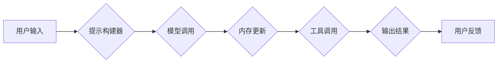

> LangChain, Chat Model, 语言模型, 应用流程, 开发实践, 

## 1. 背景介绍

近年来，大型语言模型（LLM）的快速发展，如GPT-3、LaMDA等，为自然语言处理（NLP）领域带来了革命性的变革。这些模型展现出惊人的文本生成、翻译、问答等能力，为各种应用场景提供了强大的工具。然而，直接使用LLM往往需要复杂的开发流程和大量的计算资源。

为了降低LLM应用的门槛，并更好地将LLM的强大能力应用于实际场景，LangChain应运而生。LangChain是一个开源框架，旨在简化LLM的开发和部署，并提供丰富的工具和组件，帮助开发者构建更强大的应用。

## 2. 核心概念与联系

LangChain的核心概念是将LLM与其他工具和数据源进行集成，从而构建更复杂的应用。它提供了一套通用的框架和组件，包括：

* **模型（Model）：** LangChain支持多种LLM，包括OpenAI的GPT系列、HuggingFace的Transformers等。
* **提示（Prompt）：** LangChain提供灵活的提示构建工具，帮助开发者设计更有效的输入，引导LLM生成更准确的输出。
* **链（Chain）：** LangChain的核心概念，将多个工具和组件串联起来，形成一个完整的应用流程。
* **内存（Memory）：** LangChain支持多种内存机制，帮助LLM记住之前的对话上下文，从而实现更自然的交互。
* **工具（Tool）：** LangChain支持集成各种外部工具，例如搜索引擎、数据库、API等，扩展LLM的功能。

**LangChain 架构流程图**



## 3. 核心算法原理 & 具体操作步骤

### 3.1  算法原理概述

LangChain的核心算法原理是基于Transformer模型的序列到序列生成。它通过学习大量的文本数据，掌握语言的语法和语义规则，从而能够生成流畅、自然的文本。

### 3.2  算法步骤详解

1. **预处理：** 将用户输入的文本进行预处理，例如分词、词嵌入等，将其转换为模型可以理解的格式。
2. **提示构建：** 根据用户输入和应用场景，构建一个有效的提示，引导模型生成期望的输出。
3. **模型调用：** 将预处理后的文本和提示输入到LLM模型中，模型会根据其训练的知识和规则生成相应的文本输出。
4. **输出处理：** 对模型生成的文本进行后处理，例如去除非法字符、格式化输出等，使其更易于用户理解。

### 3.3  算法优缺点

**优点：**

* 生成流畅、自然的文本
* 能够理解和响应复杂的指令
* 可扩展性强，可以集成各种工具和数据源

**缺点：**

* 训练成本高
* 容易受到训练数据的影响，可能生成不准确或有偏见的文本
* 对硬件资源要求高

### 3.4  算法应用领域

* **聊天机器人：** 创建更智能、更自然的对话体验。
* **文本生成：** 自动生成文章、故事、诗歌等文本内容。
* **问答系统：** 回答用户的问题，提供信息查询服务。
* **代码生成：** 根据自然语言描述生成代码。
* **翻译：** 将文本从一种语言翻译成另一种语言。

## 4. 数学模型和公式 & 详细讲解 & 举例说明

### 4.1  数学模型构建

LLM通常基于Transformer模型架构，其核心是自注意力机制（Self-Attention）。自注意力机制允许模型在处理文本序列时，关注不同位置的词语之间的关系，从而更好地理解文本的语义。

**公式：**

$$
Attention(Q, K, V) = \frac{exp(Q \cdot K^T / \sqrt{d_k})}{exp(Q \cdot K^T / \sqrt{d_k})} \cdot V
$$

其中：

* $Q$：查询矩阵
* $K$：键矩阵
* $V$：值矩阵
* $d_k$：键向量的维度

### 4.2  公式推导过程

自注意力机制的核心是计算每个词语与其他词语之间的注意力权重。

1. 将输入序列的每个词语分别转换为查询向量 $Q$、键向量 $K$ 和值向量 $V$。
2. 计算每个查询向量与所有键向量的点积，并进行归一化，得到每个词语与其他词语之间的注意力权重。
3. 将注意力权重与值向量进行加权求和，得到每个词语的上下文表示。

### 4.3  案例分析与讲解

例如，在句子“我爱吃苹果”中，自注意力机制会计算每个词语与其他词语之间的注意力权重。

* “我”与“爱”的注意力权重较高，因为它们是主语和谓语，关系密切。
* “我”与“苹果”的注意力权重较低，因为它们在句子的语义上关系较弱。

通过自注意力机制，LLM能够更好地理解句子中的语义关系，从而生成更准确、更自然的文本。

## 5. 项目实践：代码实例和详细解释说明

### 5.1  开发环境搭建

1. 安装Python 3.7+
2. 安装必要的库，例如：
    * `pip install langchain transformers openai`

### 5.2  源代码详细实现

```python
from langchain.llms import OpenAI
from langchain.prompts import PromptTemplate
from langchain.chains import ConversationChain

# 初始化LLM
llm = OpenAI(temperature=0.7)

# 定义提示模板
template = """
你是一个非常友好的聊天机器人。
用户：{user_input}
机器人："""

prompt = PromptTemplate(template=template, input_variables=["user_input"])

# 创建对话链
conversation = ConversationChain(llm=llm, prompt=prompt)

# 与机器人对话
while True:
    user_input = input("你：")
    if user_input.lower() == "exit":
        break
    response = conversation.run(user_input)
    print("机器人：", response)
```

### 5.3  代码解读与分析

1. 首先，我们初始化OpenAI的LLM模型。
2. 然后，我们定义一个提示模板，用于引导LLM生成聊天机器人风格的回复。
3. 接着，我们创建一个对话链，将LLM和提示模板结合起来。
4. 最后，我们进入一个循环，不断接收用户的输入，并通过对话链生成相应的回复。

### 5.4  运行结果展示

```
你：你好
机器人：你好！很高兴认识你。

你：今天天气怎么样？
机器人：今天天气晴朗，很适合出去玩。

你：谢谢
机器人：不客气！

你：exit
```

## 6. 实际应用场景

### 6.1  聊天机器人

LangChain可以用于构建更智能、更自然的聊天机器人，例如客服机器人、陪伴机器人等。

### 6.2  文本生成

LangChain可以用于自动生成各种文本内容，例如文章、故事、诗歌、代码等。

### 6.3  问答系统

LangChain可以用于构建问答系统，回答用户的问题，提供信息查询服务。

### 6.4  未来应用展望

LangChain在未来将有更广泛的应用场景，例如：

* **个性化教育：** 根据学生的学习情况，提供个性化的学习内容和辅导。
* **医疗诊断：** 辅助医生进行诊断，提高医疗效率。
* **法律服务：** 自动生成法律文件，提供法律咨询服务。

## 7. 工具和资源推荐

### 7.1  学习资源推荐

* **LangChain 官方文档：** https://python.langchain.com/docs/
* **HuggingFace Transformers 文档：** https://huggingface.co/docs/transformers/index

### 7.2  开发工具推荐

* **VS Code：** https://code.visualstudio.com/
* **PyCharm：** https://www.jetbrains.com/pycharm/

### 7.3  相关论文推荐

* **Attention Is All You Need：** https://arxiv.org/abs/1706.03762

## 8. 总结：未来发展趋势与挑战

### 8.1  研究成果总结

LangChain为LLM的应用提供了更便捷、更灵活的工具，促进了LLM技术在各个领域的应用。

### 8.2  未来发展趋势

* **更强大的模型：** 未来将会有更强大的LLM模型问世，拥有更强的文本生成能力和理解能力。
* **更丰富的工具和组件：** LangChain将继续扩展其工具和组件库，支持更多类型的应用场景。
* **更易于使用的界面：** 未来将会有更易于使用的界面，让更多人能够轻松使用LangChain构建LLM应用。

### 8.3  面临的挑战

* **数据安全和隐私：** LLM的训练需要大量的文本数据，如何保证数据的安全和隐私是一个重要的挑战。
* **模型可解释性：** LLM的决策过程往往难以理解，如何提高模型的可解释性是一个重要的研究方向。
* **伦理问题：** LLM的应用可能带来一些伦理问题，例如生成虚假信息、歧视等，需要认真思考和解决。

### 8.4  研究展望

未来，LLM技术将继续发展，并应用于更多领域。LangChain作为LLM应用的平台，将继续发挥重要作用，帮助开发者构建更强大、更智能的应用。

## 9. 附录：常见问题与解答

**Q1：如何选择合适的LLM模型？**

**A1：** 选择合适的LLM模型取决于具体的应用场景。例如，如果需要生成高质量的文本，可以选择GPT-3等大型模型；如果需要处理特定领域的文本，可以选择预训练在该领域的数据上的模型。

**Q2：如何构建更有效的提示？**

**A2：** 构建有效的提示需要根据具体的应用场景和LLM模型的特点进行设计。一般来说，提示应该清晰、简洁、具体，并提供足够的上下文信息。

**Q3：如何解决LLM生成的文本有偏见的问题？**

**A3：** LLM的训练数据可能存在偏见，导致生成的文本也存在偏见。可以尝试使用更均衡的数据集进行训练，或者使用一些技术来减轻偏见的影响。


作者：禅与计算机程序设计艺术 / Zen and the Art of Computer Programming 
<end_of_turn>