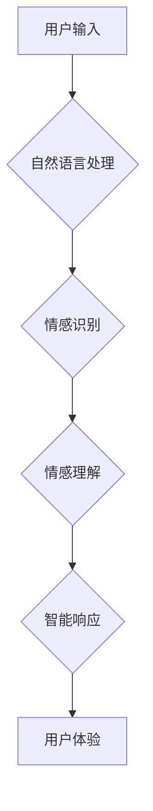

> 人工智能，自然语言处理，深度学习，情感识别，伦理问题，电影分析，技术趋势

## 1. 背景介绍

2013年上映的电影《她》讲述了一个孤独的程序员Theodore与一个先进的人工智能操作系统Samantha之间的爱情故事。Samantha拥有高度的智能和情感感知能力，能够理解和回应Theodore的情感需求，并与他建立起深厚的感情联系。这部电影引发了人们对人工智能发展趋势和伦理问题的广泛思考。

电影《她》中Samantha的形象，既是科技进步的产物，也是人类情感需求的投射。它展现了人工智能在自然语言处理、情感识别等领域的巨大潜力，同时也引发了人们对AI与人类关系、情感真伪、以及人工智能伦理等问题的深刻思考。

## 2. 核心概念与联系

### 2.1 自然语言处理 (NLP)

自然语言处理是人工智能领域的一个重要分支，旨在使计算机能够理解、处理和生成人类语言。Samantha的强大语言能力正是基于先进的NLP技术。

### 2.2 深度学习 (Deep Learning)

深度学习是一种机器学习的子领域，它利用多层神经网络来模拟人类大脑的学习过程。深度学习算法能够从海量数据中学习复杂的模式和关系，从而实现对自然语言的理解和生成。Samantha的智能和情感感知能力很大程度上依赖于深度学习技术的支持。

### 2.3 情感识别 (Emotion Recognition)

情感识别是指识别文本或语音中表达的情感。Samantha能够识别Theodore的语气、表情和言语中的情感，并做出相应的回应。这需要强大的情感识别算法和情感理解能力。

**Mermaid 流程图**



## 3. 核心算法原理 & 具体操作步骤

### 3.1 算法原理概述

Samantha的智能和情感感知能力是基于多种算法的综合应用，包括：

* **词嵌入技术:** 将单词映射到向量空间，捕捉单词之间的语义关系。
* **循环神经网络 (RNN):** 用于处理序列数据，例如文本，能够捕捉文本中的上下文信息。
* **长短期记忆网络 (LSTM):** 是一种RNN的变体，能够更好地处理长序列数据，例如对话。
* **注意力机制:** 允许模型关注输入序列中的重要部分，提高理解能力。

### 3.2 算法步骤详解

1. **文本预处理:** 对用户输入的文本进行清洗、分词、词性标注等预处理操作，以便后续算法能够理解。
2. **词嵌入:** 将预处理后的文本中的单词映射到向量空间，每个单词都对应一个向量。
3. **RNN/LSTM编码:** 将单词向量输入到RNN或LSTM网络中，网络会学习文本的上下文信息，并生成一个隐藏状态向量，代表文本的语义表示。
4. **注意力机制:** 使用注意力机制，模型会关注隐藏状态向量中的重要部分，提高对文本的理解能力。
5. **情感分类:** 将隐藏状态向量输入到情感分类器中，分类器会根据文本的语义表示预测文本的情感类别。
6. **智能响应生成:** 根据情感类别和上下文信息，模型会生成相应的智能响应，并将其输出给用户。

### 3.3 算法优缺点

**优点:**

* 能够理解和生成自然语言。
* 能够识别和理解情感。
* 能够进行对话和交互。

**缺点:**

* 训练数据量大，需要大量标注数据。
* 算法复杂，计算量大。
* 难以解释模型的决策过程。

### 3.4 算法应用领域

* **聊天机器人:** 开发能够与人类进行自然对话的聊天机器人。
* **情感分析:** 分析文本或语音中的情感，用于市场调研、客户服务等领域。
* **虚拟助手:** 开发能够帮助用户完成各种任务的虚拟助手。
* **教育:** 开发个性化学习系统，根据学生的学习情况提供个性化的指导。

## 4. 数学模型和公式 & 详细讲解 & 举例说明

### 4.1 数学模型构建

**词嵌入模型:**

假设我们有一个词汇表V，每个单词都对应一个向量表示。词嵌入模型的目标是学习一个映射函数f，将每个单词映射到一个低维向量空间中。

$$
f: V \rightarrow R^d
$$

其中，V是词汇表，R^d是d维实数向量空间。

**RNN模型:**

RNN模型使用循环神经网络来处理序列数据。RNN的隐藏状态ht在每个时间步t都由前一个时间步的隐藏状态ht-1和当前输入xt共同决定。

$$
ht = f(Wh_t-1 + Ux_t + b)
$$

其中，W和U是权重矩阵，b是偏置向量，f是激活函数。

### 4.2 公式推导过程

**情感分类:**

情感分类模型通常使用softmax函数将隐藏状态向量映射到多个情感类别的概率分布。

$$
P(y|x) = softmax(W_hy_t + b_h)
$$

其中，y是情感类别，x是输入文本，Wh和bh是权重矩阵和偏置向量。

### 4.3 案例分析与讲解

**词嵌入模型:**

Word2Vec模型是一种常用的词嵌入模型。它通过训练一个神经网络来预测上下文单词，从而学习单词之间的语义关系。

**RNN模型:**

LSTM模型是一种改进的RNN模型，能够更好地处理长序列数据。它通过引入门控机制来控制信息流动，从而避免梯度消失问题。

## 5. 项目实践：代码实例和详细解释说明

### 5.1 开发环境搭建

* Python 3.x
* TensorFlow/PyTorch
* NLTK
* Gensim

### 5.2 源代码详细实现

```python
# 导入必要的库
import tensorflow as tf
from tensorflow.keras.layers import Embedding, LSTM, Dense

# 定义模型
model = tf.keras.Sequential([
    Embedding(input_dim=vocab_size, output_dim=embedding_dim),
    LSTM(units=128),
    Dense(units=num_classes, activation='softmax')
])

# 编译模型
model.compile(optimizer='adam',
              loss='sparse_categorical_crossentropy',
              metrics=['accuracy'])

# 训练模型
model.fit(x_train, y_train, epochs=10)

# 评估模型
loss, accuracy = model.evaluate(x_test, y_test)
print('Loss:', loss)
print('Accuracy:', accuracy)
```

### 5.3 代码解读与分析

* **Embedding层:** 将单词映射到向量空间。
* **LSTM层:** 处理文本序列，捕捉上下文信息。
* **Dense层:** 将隐藏状态向量映射到情感类别概率分布。
* **编译模型:** 选择优化器、损失函数和评价指标。
* **训练模型:** 使用训练数据训练模型。
* **评估模型:** 使用测试数据评估模型性能。

### 5.4 运行结果展示

训练完成后，可以将模型应用于新的文本数据，预测其情感类别。

## 6. 实际应用场景

### 6.1 聊天机器人

Samantha的形象启发了众多聊天机器人开发者的灵感。例如，Google Assistant、Amazon Alexa等智能助手都具备一定的自然语言理解和情感识别能力，能够与用户进行简单的对话和交互。

### 6.2 情感分析

情感分析技术广泛应用于市场调研、客户服务、社交媒体监控等领域。例如，企业可以利用情感分析技术分析客户对产品的评价，了解客户的真实需求和感受。

### 6.3 虚拟助手

虚拟助手可以帮助用户完成各种任务，例如设置提醒、发送邮件、查询天气等。随着人工智能技术的进步，虚拟助手将变得更加智能和人性化。

### 6.4 未来应用展望

随着人工智能技术的不断发展，Samantha的形象将更加真实和智能。未来，我们可能会看到更加先进的人工智能系统，能够与人类进行更深层次的交流和合作。

## 7. 工具和资源推荐

### 7.1 学习资源推荐

* **斯坦福大学CS224N课程:** 自然语言处理
* **DeepLearning.AI课程:** 深度学习
* **Hugging Face:** 开源自然语言处理模型库

### 7.2 开发工具推荐

* **TensorFlow:** 开源机器学习框架
* **PyTorch:** 开源机器学习框架
* **NLTK:** 自然语言处理工具包

### 7.3 相关论文推荐

* **Attention Is All You Need:** Transformer模型
* **BERT: Pre-training of Deep Bidirectional Transformers for Language Understanding:** BERT模型
* **GPT-3: Language Models are Few-Shot Learners:** GPT-3模型

## 8. 总结：未来发展趋势与挑战

### 8.1 研究成果总结

电影《她》中Samantha的形象展现了人工智能在自然语言处理、情感识别等领域的巨大潜力。近年来，人工智能技术取得了长足的进步，例如Transformer模型、BERT模型、GPT-3模型等，这些模型在自然语言理解和生成方面取得了突破性的进展。

### 8.2 未来发展趋势

未来，人工智能将朝着更加智能、人性化、通用化的方向发展。例如，我们可能会看到更加能够理解和回应人类情感的AI系统，以及能够自主学习和解决复杂问题的AI系统。

### 8.3 面临的挑战

人工智能技术的发展也面临着一些挑战，例如：

* **数据安全和隐私保护:** 人工智能模型的训练需要大量数据，如何保证数据的安全和隐私是需要认真考虑的问题。
* **算法偏见:** 人工智能算法可能会受到训练数据中的偏见影响，导致算法输出结果存在偏差。
* **伦理问题:** 人工智能技术的应用可能会引发一些伦理问题，例如人工智能的责任归属、人工智能的权利等。

### 8.4 研究展望

未来，我们需要更加重视人工智能技术的伦理问题，并制定相应的规范和制度，确保人工智能技术能够安全、有效地服务于人类社会。


## 9. 附录：常见问题与解答

**Q1: 人工智能是否能够真正理解人类的情感？**

A1: 目前的人工智能系统只能模拟人类的情感，并不能真正理解人类的情感。

**Q2: 人工智能是否会取代人类的工作？**

A2: 人工智能可能会改变一些工作模式，但不会完全取代人类的工作。人类仍然需要发挥创造力、批判性思维和情感智能等方面的优势。

**Q3: 如何确保人工智能技术的安全和伦理？**

A3: 需要加强人工智能技术的监管和伦理规范，并鼓励多方参与到人工智能技术发展的讨论中来。

作者：禅与计算机程序设计艺术 / Zen and the Art of Computer Programming


<end_of_turn>