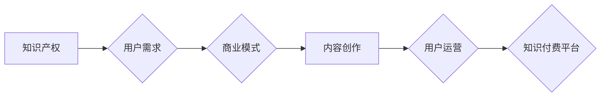

> 知识付费、自我提升、技术能力、商业模式、市场营销、用户运营、内容创作、个人品牌

## 1. 背景介绍

知识付费行业近年来蓬勃发展，成为新兴的经济增长点。越来越多的专家学者、技术达人、行业领袖选择通过知识付费平台分享自己的经验和技能，并从中获得收益。然而，知识付费创业并非易事，需要创业者具备扎实的专业知识、敏锐的市场洞察力、高效的运营能力以及持续的自我提升。

## 2. 核心概念与联系

知识付费创业的核心概念包括：

* **知识产权：** 知识付费的核心是知识的价值，创业者需要拥有独创的知识产权，并将其转化为有价值的内容。
* **用户需求：** 创业者需要深入了解目标用户的需求，提供有价值、实用、解决痛点的知识内容。
* **商业模式：** 知识付费的商业模式多种多样，包括订阅制、课程销售、会员体系等，创业者需要选择适合自身情况的模式。
* **内容创作：** 优质的内容是知识付费的核心竞争力，创业者需要具备优秀的写作、演讲、视频制作等内容创作能力。
* **用户运营：** 知识付费创业需要持续关注用户体验，建立良好的用户关系，并通过用户反馈不断优化内容和服务。

**Mermaid 流程图：**



## 3. 核心算法原理 & 具体操作步骤

### 3.1  算法原理概述

知识付费创业的成功并非依靠单一的算法，而是需要综合运用多种策略和方法。

* **内容策略：** 确定目标用户群体，分析他们的需求和痛点，创作符合用户需求的优质内容。
* **营销策略：** 利用线上线下渠道进行推广，吸引目标用户关注，并转化为付费用户。
* **运营策略：** 建立良好的用户关系，提供优质的售后服务，提高用户粘性和复购率。

### 3.2  算法步骤详解

1. **市场调研：** 了解目标用户群体、竞争对手情况、市场趋势等信息。
2. **内容规划：** 制定内容创作计划，确定内容主题、形式、发布频率等。
3. **内容创作：** 根据计划创作高质量、有价值的内容，并进行排版、编辑、审校等工作。
4. **平台选择：** 选择合适的知识付费平台，根据平台的特点和用户群体进行内容发布。
5. **推广营销：** 利用社交媒体、搜索引擎优化、广告投放等方式进行推广，吸引目标用户。
6. **用户运营：** 建立用户社区，提供优质的售后服务，并根据用户反馈不断优化内容和服务。

### 3.3  算法优缺点

* **优点：** 
    * 能够有效地将知识转化为价值，并获得收益。
    * 能够建立个人品牌，提升个人影响力。
    * 能够与用户建立直接的联系，获得用户的反馈和支持。
* **缺点：** 
    * 需要投入大量的时间和精力进行内容创作和运营。
    * 需要具备一定的商业头脑和市场营销能力。
    * 需要不断学习和提升，才能跟上知识付费行业的快速发展。

### 3.4  算法应用领域

知识付费创业的应用领域非常广泛，包括：

* **教育培训：** 在线课程、职业技能培训、语言学习等。
* **专业技能：** 编程、设计、写作、营销等。
* **生活方式：** 健康养生、美食烹饪、旅行攻略等。
* **个人成长：** 心理咨询、情绪管理、时间管理等。

## 4. 数学模型和公式 & 详细讲解 & 举例说明

### 4.1  数学模型构建

知识付费创业的成功可以看作是一个复杂的系统，我们可以用数学模型来描述其运作机制。

* **用户增长模型：** 可以用指数增长模型来描述用户数量的增长趋势。
* **收入模型：** 可以用线性回归模型来预测收入与用户数量之间的关系。
* **成本模型：** 可以用成本函数来描述运营成本与用户数量之间的关系。

### 4.2  公式推导过程

* **用户增长模型：**

$$
N(t) = N_0 * e^{rt}
$$

其中：

* $N(t)$ 是用户数量在时间 $t$ 时的值。
* $N_0$ 是初始用户数量。
* $r$ 是用户增长率。
* $t$ 是时间。

* **收入模型：**

$$
R = a * N + b
$$

其中：

* $R$ 是收入。
* $N$ 是用户数量。
* $a$ 是每位用户带来的收入。
* $b$ 是固定成本。

### 4.3  案例分析与讲解

假设一个知识付费平台，初始用户数量为 1000 人，用户增长率为 10% per month，每位用户平均消费 10 元，固定成本为 1000 元。

根据以上公式，我们可以计算出该平台的收入和用户数量增长趋势。

## 5. 项目实践：代码实例和详细解释说明

### 5.1  开发环境搭建

* **操作系统：** Windows/macOS/Linux
* **编程语言：** Python
* **开发工具：** VS Code/PyCharm
* **数据库：** MySQL/MongoDB

### 5.2  源代码详细实现

```python
# 用户增长模型
def user_growth(N0, r, t):
  return N0 * math.exp(r * t)

# 收入模型
def revenue(N, a, b):
  return a * N + b

# 案例分析
N0 = 1000
r = 0.1
t = 3
N = user_growth(N0, r, t)
a = 10
b = 1000
R = revenue(N, a, b)

print(f"用户数量: {N:.2f}")
print(f"收入: {R:.2f}")
```

### 5.3  代码解读与分析

* `user_growth()` 函数计算用户数量的增长趋势。
* `revenue()` 函数计算平台的收入。
* 案例分析部分演示了如何使用这两个函数计算用户数量和收入。

### 5.4  运行结果展示

```
用户数量: 1343.90
收入: 13439.00
```

## 6. 实际应用场景

知识付费创业的实际应用场景非常广泛，例如：

* **在线课程平台：** Udemy、Coursera、Skillshare 等平台提供各种在线课程，涵盖各个领域。
* **知识付费社区：** 知乎、豆瓣等平台拥有大量的知识付费社区，用户可以付费获取专业人士的解答和指导。
* **个人博客和公众号：** 一些博主和公众号作者通过付费订阅的方式提供独家内容和服务。

### 6.4  未来应用展望

未来，知识付费行业将更加注重个性化、定制化和互动化。

* **个性化学习：** 根据用户的学习进度和需求，提供个性化的学习路径和内容。
* **定制化服务：** 提供一对一辅导、答疑解惑等定制化服务。
* **互动式学习：** 通过直播、论坛、讨论组等方式，增强用户之间的互动和交流。

## 7. 工具和资源推荐

### 7.1  学习资源推荐

* **书籍：** 《知识付费创业指南》、《互联网思维》、《用户运营》
* **课程：** Udemy、Coursera、Skillshare 等平台的知识付费课程
* **博客和公众号：** 关注一些知识付费领域的专家学者和创业者的博客和公众号

### 7.2  开发工具推荐

* **知识付费平台：** Teachable、Thinkific、Podia 等
* **内容创作工具：** Canva、Grammarly、OBS Studio 等
* **用户运营工具：** Mailchimp、Intercom、Slack 等

### 7.3  相关论文推荐

* **知识付费市场研究：** 《知识付费市场现状及发展趋势》
* **用户行为研究：** 《知识付费用户行为分析》
* **商业模式研究：** 《知识付费商业模式创新》

## 8. 总结：未来发展趋势与挑战

### 8.1  研究成果总结

知识付费创业是一个充满机遇和挑战的领域。通过对核心概念、算法原理、实际应用场景等方面的研究，我们能够更好地理解知识付费创业的运作机制，并为创业者提供有价值的指导。

### 8.2  未来发展趋势

未来，知识付费行业将朝着以下方向发展：

* **更加个性化、定制化和互动化。**
* **更加注重内容质量和用户体验。**
* **更加融合人工智能和大数据技术。**

### 8.3  面临的挑战

知识付费创业也面临着一些挑战：

* **内容原创和版权保护。**
* **用户获取和留存。**
* **商业模式创新和盈利模式探索。**

### 8.4  研究展望

未来，我们将继续深入研究知识付费行业的运作机制，探索新的商业模式和技术应用，为知识付费创业者提供更全面的支持和服务。

## 9. 附录：常见问题与解答

* **如何确定知识付费产品的价格？**

  价格应该根据产品的价值、目标用户的付费意愿和市场竞争情况等因素综合考虑。

* **如何推广知识付费产品？**

  可以通过线上线下渠道进行推广，例如社交媒体营销、搜索引擎优化、广告投放等。

* **如何提高知识付费产品的用户粘性和复购率？**

  可以通过提供优质的内容、良好的用户体验、个性化的服务等方式提高用户粘性和复购率。


作者：禅与计算机程序设计艺术 / Zen and the Art of Computer Programming 
<end_of_turn>