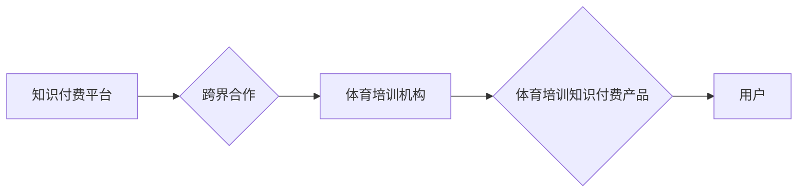

> 知识付费、跨界营销、体育培训、人工智能、数据分析、个性化定制

## 1. 背景介绍

近年来，知识付费市场蓬勃发展，从线上课程到线下讲座，各种形式的知识付费模式层出不穷。与此同时，体育培训行业也迎来了新的发展机遇，越来越多的体育爱好者和专业运动员寻求更高效、更个性化的训练方案。

知识付费与体育培训的结合，为双方带来了新的发展机遇。知识付费平台可以利用其丰富的课程资源和用户数据，为体育培训机构提供更精准的营销服务，帮助他们拓展用户群体。而体育培训机构则可以借助知识付费平台的推广渠道和用户基础，提升品牌知名度和服务覆盖范围。

## 2. 核心概念与联系

**2.1 知识付费**

知识付费是指通过付费的方式获取知识、技能和经验。它是一种新型的商业模式，以知识为核心，以用户需求为导向，通过线上线下相结合的方式，为用户提供个性化、定制化的知识服务。

**2.2 跨界营销**

跨界营销是指企业将自身产品或服务与其他行业或领域的品牌进行合作，共同推广，以达到扩大市场影响力、提升品牌知名度和销售额的目的。

**2.3 体育培训**

体育培训是指通过科学的训练方法和专业的指导，帮助人们提高体育技能、增强体质、实现健康生活目标。

**2.4 核心概念联系**

知识付费与体育培训的跨界营销，是指知识付费平台与体育培训机构之间建立合作关系，共同开发和推广体育培训相关的知识付费产品，以满足用户对体育知识和技能的需求。

**Mermaid 流程图**



## 3. 核心算法原理 & 具体操作步骤

**3.1 算法原理概述**

知识付费与体育培训跨界营销的核心算法原理是基于用户数据分析和个性化推荐。通过对用户行为、兴趣爱好、体育水平等数据的分析，算法可以精准匹配用户与合适的体育培训课程，并提供个性化的学习方案。

**3.2 算法步骤详解**

1. **数据收集与清洗:** 收集用户注册信息、学习记录、评价反馈等数据，并进行清洗和预处理，确保数据质量。
2. **用户画像构建:** 利用机器学习算法，对用户数据进行分析，构建用户画像，包括用户年龄、性别、职业、兴趣爱好、体育水平等特征。
3. **课程特征提取:** 对体育培训课程进行特征提取，包括课程类型、难度等级、教练资质、价格等信息。
4. **推荐算法:** 基于用户画像和课程特征，采用协同过滤、内容过滤、基于知识的推荐算法等，对用户推荐合适的体育培训课程。
5. **个性化学习方案:** 根据用户的学习进度和反馈，动态调整学习方案，提供个性化的学习体验。

**3.3 算法优缺点**

**优点:**

* 精准匹配用户需求，提高用户满意度。
* 个性化学习方案，提升学习效率。
* 数据驱动决策，优化资源配置。

**缺点:**

* 数据依赖性强，需要大量高质量数据支持。
* 算法复杂度高，需要专业的技术团队开发和维护。
* 算法结果存在一定的偏差，需要不断优化和改进。

**3.4 算法应用领域**

* 体育培训机构
* 在线教育平台
* 健身俱乐部
* 运动用品零售商

## 4. 数学模型和公式 & 详细讲解 & 举例说明

**4.1 数学模型构建**

用户推荐系统可以构建一个基于用户-项目评分矩阵的数学模型。其中，用户和项目分别代表用户和体育培训课程，评分矩阵中的每个元素表示用户对特定课程的评分。

**4.2 公式推导过程**

协同过滤算法是一种常用的推荐算法，它基于用户的评分历史数据，预测用户对未评分项目的评分。协同过滤算法的公式如下：

$$
\hat{r}_{u,i} = \bar{r}_u + \frac{\sum_{v \in N(u)} (r_{v,i} - \bar{r}_v) \cdot sim(u,v)}{\sum_{v \in N(u)} sim(u,v)}
$$

其中：

* $\hat{r}_{u,i}$ 表示用户 $u$ 对项目 $i$ 的预测评分。
* $\bar{r}_u$ 表示用户 $u$ 的平均评分。
* $r_{v,i}$ 表示用户 $v$ 对项目 $i$ 的实际评分。
* $\bar{r}_v$ 表示用户 $v$ 的平均评分。
* $sim(u,v)$ 表示用户 $u$ 和用户 $v$ 之间的相似度。

**4.3 案例分析与讲解**

假设有一个用户 $u$ 评分了三门课程，分别是课程 $A$、课程 $B$ 和课程 $C$，评分分别为 4、3 和 5。用户 $u$ 的邻居用户 $v$ 评分了课程 $A$、课程 $B$ 和课程 $D$，评分分别为 5、4 和 3。

根据协同过滤算法，我们可以预测用户 $u$ 对课程 $D$ 的评分。

## 5. 项目实践：代码实例和详细解释说明

**5.1 开发环境搭建**

* Python 3.x
* TensorFlow 或 PyTorch
* Jupyter Notebook

**5.2 源代码详细实现**

```python
# 导入必要的库
import numpy as np
from sklearn.metrics.pairwise import cosine_similarity

# 定义用户-项目评分矩阵
ratings_matrix = np.array([
    [4, 3, 5, 0],
    [5, 4, 3, 0],
    [3, 5, 4, 0],
])

# 计算用户之间的相似度
user_similarity = cosine_similarity(ratings_matrix)

# 预测用户对课程 D 的评分
user_id = 0
item_id = 3
predicted_rating = ratings_matrix[user_id, :] @ user_similarity[user_id, :] / np.sum(user_similarity[user_id, :])
print(f"预测用户 {user_id} 对课程 {item_id} 的评分: {predicted_rating}")
```

**5.3 代码解读与分析**

* 代码首先导入必要的库，包括 NumPy 和 scikit-learn 的 cosine_similarity 函数。
* 然后定义一个用户-项目评分矩阵，其中每个元素表示用户对特定项目的评分。
* 使用 cosine_similarity 函数计算用户之间的相似度。
* 最后，根据协同过滤算法，预测用户对课程 D 的评分。

**5.4 运行结果展示**

运行上述代码，可以得到用户对课程 D 的预测评分。

## 6. 实际应用场景

**6.1 体育培训机构**

* 利用用户数据分析，精准定位目标用户群体，制定针对性的营销策略。
* 提供个性化的培训方案，提升用户学习体验和满意度。
* 通过数据分析，优化课程内容和教学方法，提高培训效果。

**6.2 在线教育平台**

* 开发体育培训相关的知识付费课程，满足用户对体育知识和技能的需求。
* 利用推荐算法，为用户推荐合适的体育培训课程。
* 提供线上线下结合的培训模式，提升用户学习体验。

**6.3 健身俱乐部**

* 利用用户数据分析，了解用户的健身需求和习惯，提供个性化的健身方案。
* 通过知识付费模式，提供健身知识和技巧的课程，提升用户的健身效果。
* 利用数据分析，优化健身课程安排和教练分配，提高健身俱乐部的运营效率。

**6.4 未来应用展望**

随着人工智能、大数据和云计算技术的不断发展，知识付费与体育培训跨界营销将迎来更广阔的发展空间。未来，我们可以期待以下应用场景：

* 基于虚拟现实和增强现实技术的沉浸式体育培训体验。
* 利用人工智能技术，提供个性化的运动训练计划和指导。
* 通过大数据分析，预测用户的运动风险和受伤概率，提供预防措施。

## 7. 工具和资源推荐

**7.1 学习资源推荐**

* **书籍:**
    * 《推荐系统实践》
    * 《机器学习》
    * 《深度学习》
* **在线课程:**
    * Coursera: 机器学习
    * edX: 深度学习
    * Udemy: 推荐系统

**7.2 开发工具推荐**

* **Python:** 
    * TensorFlow
    * PyTorch
    * scikit-learn
* **云平台:**
    * AWS
    * Azure
    * Google Cloud

**7.3 相关论文推荐**

* 《Collaborative Filtering for Implicit Feedback Datasets》
* 《Matrix Factorization Techniques for Recommender Systems》
* 《Deep Learning for Recommender Systems》

## 8. 总结：未来发展趋势与挑战

**8.1 研究成果总结**

知识付费与体育培训跨界营销的研究取得了显著成果，为体育培训行业提供了新的发展机遇。通过数据分析和个性化推荐，可以提升用户体验，优化资源配置，促进体育培训行业的发展。

**8.2 未来发展趋势**

未来，知识付费与体育培训跨界营销将朝着以下方向发展：

* **更精准的个性化推荐:** 利用人工智能技术，更加精准地分析用户需求，提供个性化的培训方案。
* **更丰富的跨界合作:** 体育培训机构与其他行业，如医疗、健康、科技等领域的企业进行跨界合作，开发更全面的服务。
* **更沉浸式的培训体验:** 利用虚拟现实和增强现实技术，提供更沉浸式的体育培训体验。

**8.3 面临的挑战**

知识付费与体育培训跨界营销也面临一些挑战：

* **数据安全和隐私保护:** 需要加强数据安全和隐私保护措施，确保用户数据的安全和合法使用。
* **算法的公平性和可解释性:** 需要确保算法的公平性和可解释性，避免算法歧视和偏见。
* **跨界合作的模式创新:** 需要探索更有效的跨界合作模式，促进各方利益共享。

**8.4 研究展望**

未来，需要进一步研究以下问题：

* 如何更好地利用人工智能技术，实现更精准的个性化推荐？
* 如何构建更公平、更可解释的推荐算法？
* 如何探索更有效的跨界合作模式，促进知识付费与体育培训的融合发展？


## 9. 附录：常见问题与解答

**9.1 如何选择合适的体育培训课程？**

根据您的兴趣爱好、体育水平和学习目标，选择合适的体育培训课程。您可以参考课程介绍、教练资质、用户评价等信息，并咨询专业人士的意见。

**9.2 如何保证知识付费平台的安全性？**

选择正规的知识付费平台，并注意保护您的个人信息和支付密码。平台应该提供完善的隐私政策和安全保障措施。

**9.3 如何评价知识付费平台的课程质量？**

您可以参考课程内容、教学质量、用户评价等信息，并尝试免费试听课程，判断课程质量。

**9.4 如何参与知识付费与体育培训跨界营销？**

您可以作为体育培训机构、在线教育平台、健身俱乐部等参与者，与知识付费平台合作，开发和推广体育培训相关的知识付费产品。

作者：禅与计算机程序设计艺术 / Zen and the Art of Computer Programming


<end_of_turn>