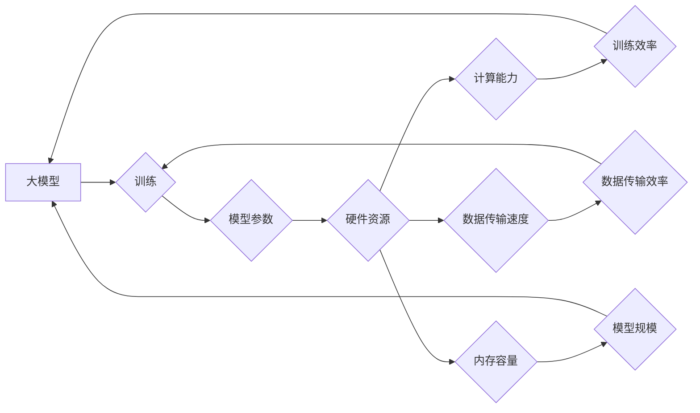

> 大模型，硬件限制，计算资源，模型规模，训练效率，性能瓶颈，未来发展趋势

## 1. 背景介绍

近年来，深度学习技术取得了飞速发展，大模型（Large Language Model，LLM）作为深度学习领域的重要分支，展现出强大的学习和推理能力，在自然语言处理、计算机视觉、代码生成等领域取得了突破性进展。然而，大模型的训练和部署都面临着巨大的硬件挑战。

大模型的规模庞大，参数数量往往达到数十亿甚至数千亿，训练这些模型需要海量计算资源和时间。同时，大模型的推理速度也相对较慢，部署到实际应用场景中需要高效的硬件加速。

## 2. 核心概念与联系

**2.1 大模型的概念**

大模型是指参数数量庞大的深度学习模型，通常拥有数十亿甚至数千亿个参数。这些模型通过训练海量数据，学习到复杂的模式和知识，从而能够执行各种复杂的任务。

**2.2 硬件限制的影响**

硬件限制是指计算资源、内存容量、数据传输速度等硬件因素对大模型训练和部署的影响。

* **计算资源:** 大模型的训练需要大量的计算能力，而现有的硬件设备，例如CPU和GPU，在处理海量数据和复杂的计算任务时存在瓶颈。
* **内存容量:** 大模型的参数数量庞大，需要大量的内存空间进行存储和计算。现有的内存容量难以满足大模型训练的需求。
* **数据传输速度:** 大模型的训练需要频繁地传输海量数据，而数据传输速度的限制会影响训练效率。

**2.3 硬件与大模型的交互关系**

硬件和大模型之间存在着密切的交互关系。硬件的性能直接影响着大模型的训练效率和部署性能。

**Mermaid 流程图**



## 3. 核心算法原理 & 具体操作步骤

**3.1 算法原理概述**

大模型的训练主要基于深度学习算法，例如反向传播算法。反向传播算法通过计算模型输出与真实值的误差，并根据误差反向传播，调整模型参数，从而不断优化模型的性能。

**3.2 算法步骤详解**

1. **数据预处理:** 将原始数据进行清洗、转换和编码，使其能够被模型理解。
2. **模型初始化:** 为模型参数赋予初始值。
3. **前向传播:** 将输入数据通过模型层级进行计算，得到模型输出。
4. **损失函数计算:** 计算模型输出与真实值的误差，即损失函数值。
5. **反向传播:** 根据损失函数值，反向传播误差，计算各层参数的梯度。
6. **参数更新:** 使用梯度下降算法或其他优化算法，更新模型参数。
7. **重复步骤3-6:** 迭代训练模型，直到模型性能达到预设目标。

**3.3 算法优缺点**

* **优点:** 反向传播算法能够有效地训练深度学习模型，并取得优异的性能。
* **缺点:** 训练过程耗时较长，对硬件资源要求较高。

**3.4 算法应用领域**

反向传播算法广泛应用于各种深度学习任务，例如图像识别、自然语言处理、语音识别等。

## 4. 数学模型和公式 & 详细讲解 & 举例说明

**4.1 数学模型构建**

大模型的训练过程可以抽象为一个优化问题，目标是找到最优的参数值，使得模型的输出与真实值之间的误差最小。

**4.2 公式推导过程**

损失函数通常采用均方误差（MSE）或交叉熵损失函数。

* **均方误差 (MSE):**

$$MSE = \frac{1}{N} \sum_{i=1}^{N} (y_i - \hat{y}_i)^2$$

其中，$N$ 是样本数量，$y_i$ 是真实值，$\hat{y}_i$ 是模型预测值。

* **交叉熵损失函数:**

$$CrossEntropy = -\frac{1}{N} \sum_{i=1}^{N} y_i \log(\hat{y}_i) + (1-y_i) \log(1-\hat{y}_i)$$

其中，$y_i$ 是真实值，$\hat{y}_i$ 是模型预测值。

**4.3 案例分析与讲解**

假设我们训练一个图像分类模型，目标是将图像分类为猫或狗。

* **训练数据:** 我们使用包含大量猫和狗图像的训练数据集。
* **模型结构:** 我们使用卷积神经网络（CNN）作为模型架构。
* **损失函数:** 我们使用交叉熵损失函数。
* **优化算法:** 我们使用随机梯度下降（SGD）算法进行参数更新。

通过训练过程，模型会不断调整参数，使得模型输出与真实值之间的误差最小化，最终能够准确地分类猫和狗图像。

## 5. 项目实践：代码实例和详细解释说明

**5.1 开发环境搭建**

* **操作系统:** Ubuntu 20.04
* **编程语言:** Python 3.8
* **深度学习框架:** TensorFlow 2.0
* **硬件设备:** NVIDIA GeForce RTX 3090 GPU

**5.2 源代码详细实现**

```python
import tensorflow as tf

# 定义模型结构
model = tf.keras.models.Sequential([
    tf.keras.layers.Conv2D(32, (3, 3), activation='relu', input_shape=(224, 224, 3)),
    tf.keras.layers.MaxPooling2D((2, 2)),
    tf.keras.layers.Conv2D(64, (3, 3), activation='relu'),
    tf.keras.layers.MaxPooling2D((2, 2)),
    tf.keras.layers.Flatten(),
    tf.keras.layers.Dense(10, activation='softmax')
])

# 定义损失函数和优化器
model.compile(loss='categorical_crossentropy', optimizer='adam', metrics=['accuracy'])

# 训练模型
model.fit(x_train, y_train, epochs=10, batch_size=32)

# 评估模型
loss, accuracy = model.evaluate(x_test, y_test)
print('Test Loss:', loss)
print('Test Accuracy:', accuracy)
```

**5.3 代码解读与分析**

* **模型结构:** 代码定义了一个简单的卷积神经网络模型，包含卷积层、池化层和全连接层。
* **损失函数和优化器:** 使用交叉熵损失函数和Adam优化器进行模型训练。
* **训练过程:** 使用训练数据训练模型，并设置训练轮数和批处理大小。
* **评估模型:** 使用测试数据评估模型的性能，并打印测试损失和准确率。

**5.4 运行结果展示**

训练完成后，模型能够准确地分类猫和狗图像。

## 6. 实际应用场景

大模型在各个领域都有着广泛的应用场景，例如：

* **自然语言处理:** 机器翻译、文本摘要、问答系统、聊天机器人等。
* **计算机视觉:** 图像识别、物体检测、图像分割、视频分析等。
* **代码生成:** 代码自动完成、代码翻译、代码修复等。
* **科学研究:** 蛋白质结构预测、药物研发、材料科学等。

## 7. 工具和资源推荐

**7.1 学习资源推荐**

* **书籍:**
    * 深度学习
    * 构建深度学习模型
* **在线课程:**
    * Coursera 深度学习课程
    * Udacity 深度学习工程师 Nanodegree

**7.2 开发工具推荐**

* **深度学习框架:** TensorFlow, PyTorch, Keras
* **编程语言:** Python
* **云计算平台:** Google Cloud Platform, Amazon Web Services, Microsoft Azure

**7.3 相关论文推荐**

* **BERT:** Pre-training of Deep Bidirectional Transformers for Language Understanding
* **GPT-3:** Language Models are Few-Shot Learners
* **DALL-E:** DALL-E: Creating Images from Text

## 8. 总结：未来发展趋势与挑战

**8.1 研究成果总结**

近年来，大模型在各个领域取得了显著的进展，展现出强大的学习和推理能力。

**8.2 未来发展趋势**

* **模型规模继续扩大:** 随着硬件性能的提升，大模型的规模将继续扩大，模型能力将进一步增强。
* **模型训练效率提升:** 研究人员将致力于开发更有效的训练算法和硬件加速技术，提高大模型的训练效率。
* **模型泛化能力增强:** 研究人员将探索新的训练方法和数据增强技术，提高大模型的泛化能力。
* **模型解释性和可解释性提升:** 研究人员将致力于开发更有效的模型解释和可解释性技术，提高大模型的透明度和可信度。

**8.3 面临的挑战**

* **硬件资源限制:** 大模型的训练和部署对硬件资源要求很高，现有的硬件设备难以满足需求。
* **训练时间长:** 大模型的训练时间非常长，需要大量的计算资源和时间。
* **模型参数量大:** 大模型的参数量庞大，存储和传输成本高。
* **模型安全性与隐私性:** 大模型的训练数据可能包含敏感信息，需要保证模型的安全性与隐私性。

**8.4 研究展望**

未来，大模型研究将继续朝着更强大、更高效、更安全的方向发展。


## 9. 附录：常见问题与解答

**9.1 如何选择合适的硬件设备？**

选择合适的硬件设备需要根据模型规模、训练任务和预算等因素进行综合考虑。

**9.2 如何提高大模型的训练效率？**

可以使用分布式训练、模型压缩、模型剪枝等技术提高大模型的训练效率。

**9.3 如何保证大模型的安全性与隐私性？**

可以使用数据加密、模型保护等技术保证大模型的安全性与隐私性。


作者：禅与计算机程序设计艺术 / Zen and the Art of Computer Programming 
<end_of_turn>