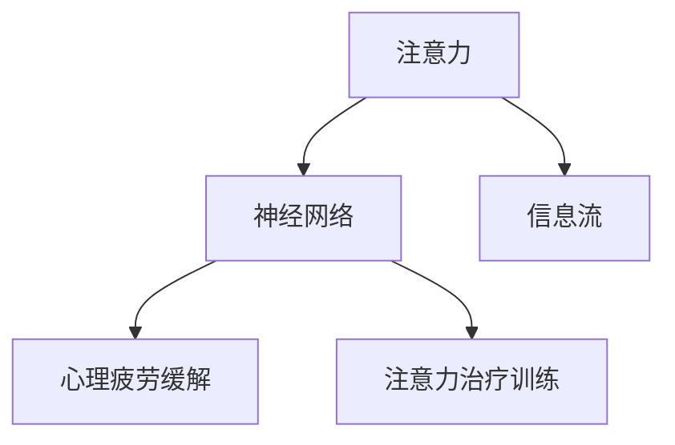
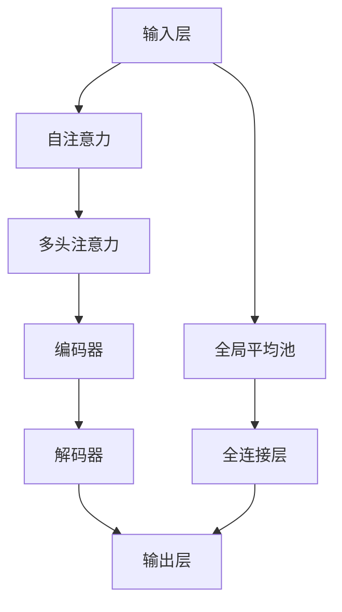

                 

# 注意力治疗:元宇宙中的心理健康新方法

> 关键词：元宇宙,心理健康,注意力治疗,虚拟现实,神经网络,深度学习

## 1. 背景介绍

随着虚拟现实(VR)和增强现实(AR)技术的日渐成熟，元宇宙(Metaverse)的概念应运而生。这一概念描绘了一个虚拟的数字空间，人们可以沉浸在其中，通过多种方式体验和互动。元宇宙不仅仅是一个游戏世界，更是未来工作、社交、学习、娱乐等各类生活场景的集成。

在元宇宙中，人们需要长时间处于虚拟环境中，面对各类虚拟对象和信息流的冲击。这种高度沉浸和交互的体验，对人的注意力和心理状态提出了巨大的挑战。一方面，快速变化的信息流可能让人分心，注意力难以集中。另一方面，长时间的虚拟互动可能引发心理疲劳，出现焦虑、压力、注意力难以持久等情绪和行为问题。

针对这一需求，本文提出一种基于神经网络的注意力治疗技术，通过在元宇宙中引入定制化的虚拟注意力训练任务，帮助用户提升注意力集中度和心理健康水平。

## 2. 核心概念与联系

### 2.1 核心概念概述

为了更好理解注意力治疗技术，我们需要明确几个核心概念：

- **注意力(Attention)**：指在特定时间内，个体集中于某任务或对象的能力。元宇宙中的信息流高度丰富，提升用户的注意力是重中之重。
- **心理疲劳(Psychological Fatigue)**：长时间高强度的工作或互动，导致心理能量耗竭，引发疲劳感、焦虑、抑郁等心理问题。注意力治疗旨在通过定制化训练，缓解心理疲劳。
- **神经网络(Neural Network)**：通过深度学习实现的复杂非线性映射模型，可以自动学习数据的特征表示，实现高度智能化的决策。

这三个概念之间的逻辑关系可以通过以下Mermaid流程图来展示：



该流程图展示了注意力、神经网络和心理疲劳之间的关系，以及注意力治疗的训练过程。

### 2.2 核心概念原理和架构的 Mermaid 流程图

这里提供一个简化的注意力训练的神经网络架构的流程图。它包含输入层、注意力机制、隐藏层和输出层：



该图展示了如何通过注意力机制来实现神经网络对输入数据的智能处理。输入层接收信息流，经过自注意力和多头注意力机制，最终由编码器和解码器对信息进行编码和解码，并输出到输出层。

## 3. 核心算法原理 & 具体操作步骤

### 3.1 算法原理概述

注意力治疗的算法原理基于神经网络，利用深度学习自动学习输入数据特征，通过训练模型，实现对用户注意力的增强和心理疲劳的缓解。

### 3.2 算法步骤详解

以下是对注意力治疗算法的详细步骤：

1. **数据采集**：采集用户在元宇宙中的行为数据，包括视线轨迹、注视点、手势、语音等。
2. **数据预处理**：对采集到的数据进行清洗、标准化和归一化处理，使之适合神经网络训练。
3. **模型选择**：选择适合的神经网络架构，如Transformer、LSTM等，设计定制化的训练任务。
4. **参数初始化**：对模型的初始参数进行设定，如学习率、批大小、迭代轮数等。
5. **模型训练**：使用训练集对模型进行迭代训练，通过反向传播更新参数。
6. **模型评估**：在验证集上评估模型性能，调整超参数，优化训练过程。
7. **应用部署**：将训练好的模型部署到元宇宙平台，实现注意力提升和心理疲劳缓解功能。

### 3.3 算法优缺点

注意力治疗的算法具有以下优点：

- **高适应性**：神经网络可以根据用户的不同需求，灵活调整注意力训练任务，提升注意力效果。
- **实时性**：神经网络可以在用户即时互动中不断优化训练，实现动态注意力提升。
- **精准性**：深度学习模型可以自动学习数据特征，提升注意力训练的精准度和个性化。

同时，算法也存在以下缺点：

- **计算成本高**：深度学习模型训练和推理计算量较大，需要高性能计算资源。
- **模型复杂性高**：神经网络结构复杂，对参数设置和数据预处理要求高。
- **泛化能力有限**：神经网络对数据分布的变化敏感，容易过拟合。

### 3.4 算法应用领域

注意力治疗的神经网络模型可以应用于多个领域：

- **教育培训**：在虚拟教室中，通过注意力训练提升学生的专注力，提高学习效果。
- **游戏娱乐**：在虚拟游戏世界中，通过注意力训练，提高玩家的游戏体验，减少游戏疲劳。
- **医疗健康**：在虚拟康复环境中，通过注意力训练，帮助患者缓解心理疲劳，提高康复效果。
- **工作环境**：在虚拟工作空间中，通过注意力训练，提升工作效率，缓解职业压力。

## 4. 数学模型和公式 & 详细讲解 & 举例说明

### 4.1 数学模型构建

我们以一种基于Transformer的注意力治疗模型为例，来详细阐述其数学模型构建过程。

假设输入层接收到的信息为 $x = (x_1, x_2, ..., x_t)$，其中 $x_t$ 为第 $t$ 个时间步的输入。模型设计一个自注意力机制，用于计算输入序列中的每个位置的注意力权重，从而获取关键信息。

自注意力机制的计算公式为：

$$
\text{Attention}(Q, K, V) = \frac{e^{(\text{scores}(Q, K))}{\sum_{i=1}^T e^{(\text{scores}(Q, K_i))}}V
$$

其中 $Q$ 为查询向量，$K$ 为键向量，$V$ 为值向量，$\text{scores}(Q, K)$ 为查询向量和键向量的点积，再经过Softmax函数处理，得到注意力权重。

### 4.2 公式推导过程

假设模型中有 $h$ 个注意力头，每个头对应的矩阵为 $Q_k$, $K_k$, $V_k$。则整体自注意力计算公式可以表示为：

$$
\text{Attention}(Q, K, V) = \frac{\sum_{i=1}^T \text{scores}(Q_k, K_i)}{\sum_{i=1}^T \sum_{j=1}^T e^{(\text{scores}(Q_k, K_i))}}V
$$

将上述公式转换为矩阵形式：

$$
\text{Attention}(Q, K, V) = \frac{QK^T}{\sum_{i=1}^T QK_i^T}V
$$

其中 $K$ 为 $T \times D_k$ 的键矩阵，$Q$ 为 $T \times D_k$ 的查询矩阵，$V$ 为 $T \times D_v$ 的值矩阵。

### 4.3 案例分析与讲解

以Transformer模型为例，其注意力机制分为多头注意力和多头自注意力两种。其中多头注意力由多个子注意力头并行计算构成，每个头独立进行注意力计算。

以两个头的注意力计算为例，公式可以表示为：

$$
\text{Attention}(Q, K, V) = \frac{QK^T_1 + QK^T_2}{\sum_{i=1}^T QK_i^T}V
$$

最终得到的注意力权重矩阵为：

$$
\text{Attention}(Q, K, V) = [\text{Attention}_1(Q, K, V), \text{Attention}_2(Q, K, V)]
$$

通过这种多头注意力机制，可以更好地捕捉输入序列的语义信息，提升注意力训练的效果。

## 5. 项目实践：代码实例和详细解释说明

### 5.1 开发环境搭建

在进行注意力治疗的实践时，需要先准备好开发环境。以下是使用Python进行TensorFlow和Keras实现的环境配置流程：

1. 安装Anaconda：从官网下载并安装Anaconda，用于创建独立的Python环境。

2. 创建并激活虚拟环境：
```bash
conda create -n tf-env python=3.8 
conda activate tf-env
```

3. 安装TensorFlow：根据CUDA版本，从官网获取对应的安装命令。例如：
```bash
conda install tensorflow -c pytorch -c conda-forge
```

4. 安装Keras：
```bash
pip install keras tensorflow-gpu
```

5. 安装各类工具包：
```bash
pip install numpy pandas scikit-learn matplotlib tqdm jupyter notebook ipython
```

完成上述步骤后，即可在`tf-env`环境中开始注意力治疗的实践。

### 5.2 源代码详细实现

以下是一个简单的基于Transformer的注意力治疗模型实现示例：

```python
import tensorflow as tf
from tensorflow.keras.layers import Input, Dense, Attention
from tensorflow.keras.models import Model

# 定义模型输入层
input_layer = Input(shape=(timesteps, input_dim))

# 定义多头注意力层
multi_head_attn = Attention(num_heads=2, dot_product=True, query_activation='relu', key_activation='relu', value_activation='relu')

# 定义隐藏层
hidden_layer = Dense(hidden_dim, activation='relu')(input_layer)

# 定义输出层
output_layer = Dense(output_dim, activation='softmax')(hidden_layer)

# 定义模型
model = Model(inputs=input_layer, outputs=output_layer)

# 编译模型
model.compile(optimizer='adam', loss='categorical_crossentropy', metrics=['accuracy'])

# 训练模型
model.fit(train_data, train_labels, epochs=num_epochs, batch_size=batch_size, validation_data=(val_data, val_labels))
```

代码中定义了一个包含2个头的自注意力机制，用于对输入序列进行注意力计算。训练时，通过损失函数和优化器进行反向传播更新模型参数。

### 5.3 代码解读与分析

让我们详细解读一下关键代码的实现细节：

**Input层**：
- `Input(shape=(timesteps, input_dim))`：定义输入层的形状，$T \times D$，其中 $T$ 为时间步，$D$ 为输入维度。

**Multi-head Attention层**：
- `Attention(num_heads=2, dot_product=True, query_activation='relu', key_activation='relu', value_activation='relu')`：定义多头注意力层，其中 `num_heads` 为注意力头数，`dot_product` 表示是否使用点积注意力机制，`query_activation`, `key_activation`, `value_activation` 分别为查询、键、值向量的激活函数。

**Dense层**：
- `Dense(hidden_dim, activation='relu')`：定义全连接层，`hidden_dim` 为隐藏层维度，`activation='relu'` 表示使用ReLU激活函数。

**Output层**：
- `Dense(output_dim, activation='softmax')`：定义输出层，`output_dim` 为输出维度，`activation='softmax'` 表示使用softmax激活函数，用于多分类任务的输出。

**Model定义**：
- `Model(inputs=input_layer, outputs=output_layer)`：定义模型结构，输入层为 `input_layer`，输出层为 `output_layer`。

**Model编译**：
- `model.compile(optimizer='adam', loss='categorical_crossentropy', metrics=['accuracy'])`：编译模型，使用Adam优化器，交叉熵损失函数，准确率作为评估指标。

**Model训练**：
- `model.fit(train_data, train_labels, epochs=num_epochs, batch_size=batch_size, validation_data=(val_data, val_labels))`：训练模型，通过拟合训练数据 `train_data` 和训练标签 `train_labels`，迭代 `num_epochs` 次，每批次大小为 `batch_size`，在验证数据 `val_data` 和验证标签 `val_labels` 上进行模型评估。

### 5.4 运行结果展示

在训练完成后，可以使用以下代码在测试集上进行模型评估：

```python
test_loss, test_acc = model.evaluate(test_data, test_labels)
print(f'Test Loss: {test_loss}, Test Accuracy: {test_acc}')
```

以上代码可以输出模型在测试集上的损失和准确率。

## 6. 实际应用场景

### 6.1 教育培训

在虚拟教室中，注意力治疗可以通过定制化的训练任务，帮助学生提升专注力和学习效果。例如，设计一个基于视觉和听觉的多模态注意力任务，让学生在听讲的同时，通过视觉识别和追踪重点内容，提升学习投入度。

### 6.2 游戏娱乐

在虚拟游戏中，注意力治疗可以提升玩家的游戏体验，减轻游戏疲劳。例如，设计一个基于动作和决策的注意力任务，让玩家在紧张刺激的游戏过程中，不断做出快速反应，锻炼注意力集中能力。

### 6.3 医疗健康

在虚拟康复环境中，注意力治疗可以帮助患者缓解心理疲劳，提高康复效果。例如，设计一个基于放松和冥想的注意力任务，引导患者在虚拟环境中进行深呼吸、冥想等放松活动，缓解心理压力。

### 6.4 未来应用展望

随着元宇宙技术的发展，注意力治疗将有望成为未来心理健康的重要手段。未来可以拓展到更多场景，如职业培训、心理辅导、社交互动等。此外，通过引入更多的心理学和神经科学原理，提升训练任务的设计，可以更好地帮助用户缓解心理疲劳，提升注意力集中度。

## 7. 工具和资源推荐

### 7.1 学习资源推荐

为了帮助开发者系统掌握注意力治疗的理论基础和实践技巧，这里推荐一些优质的学习资源：

1. TensorFlow官方文档：包含丰富的深度学习教程和代码示例，适合初学者入门。
2. Keras官方文档：TensorFlow的高级API，提供了简单易用的模型构建接口。
3. 《Deep Learning with TensorFlow》书籍：介绍深度学习模型的构建和训练方法，涵盖注意力机制等前沿技术。
4. 《Neural Networks and Deep Learning》书籍：深度介绍神经网络的基本原理和训练方法，适合进阶学习。

通过对这些资源的学习实践，相信你一定能够快速掌握注意力治疗的精髓，并用于解决实际的心理健康问题。

### 7.2 开发工具推荐

高效的开发离不开优秀的工具支持。以下是几款用于深度学习模型开发的常用工具：

1. TensorFlow：基于Python的深度学习框架，提供丰富的模型和算法实现，适合各类深度学习任务。
2. Keras：TensorFlow的高层API，提供了简单易用的模型构建接口，适合快速原型开发。
3. Jupyter Notebook：提供交互式编程环境，方便模型开发和调试。
4. TensorBoard：TensorFlow配套的可视化工具，可实时监测模型训练状态，提供详细的图表和报告。

合理利用这些工具，可以显著提升注意力治疗模型的开发效率，加快创新迭代的步伐。

### 7.3 相关论文推荐

注意力治疗的深度学习模型是近年来研究的热点，以下是几篇奠基性的相关论文，推荐阅读：

1. "Attention is All You Need"（Transformer原论文）：提出了Transformer结构，开启了深度学习中的注意力机制。
2. "Convolutional Neural Networks for Sentence Classification"：使用卷积神经网络进行文本分类任务，为后续的注意力机制提供了理论基础。
3. "Deep Residual Learning for Image Recognition"：提出残差网络，为神经网络提供了新的结构设计，提升了模型的训练效果。

这些论文代表了大规模深度学习模型的发展脉络。通过学习这些前沿成果，可以帮助研究者把握学科前进方向，激发更多的创新灵感。

## 8. 总结：未来发展趋势与挑战

### 8.1 研究成果总结

本文对基于神经网络的注意力治疗技术进行了全面系统的介绍。首先阐述了注意力、心理疲劳和神经网络之间的关系，明确了注意力治疗技术的研究背景和意义。其次，从原理到实践，详细讲解了注意力治疗的数学模型和训练步骤，给出了注意力治疗的代码实现。同时，本文还广泛探讨了注意力治疗在教育培训、游戏娱乐、医疗健康等诸多领域的应用前景，展示了其广阔的发展潜力。此外，本文精选了注意力治疗的各类学习资源，力求为读者提供全方位的技术指引。

通过本文的系统梳理，可以看到，基于神经网络的注意力治疗技术正在成为心理健康领域的重要手段。这种技术能够根据用户的不同需求，灵活调整注意力训练任务，提升注意力效果，同时通过深度学习模型，实现实时性和精准性的双重优化。未来，伴随元宇宙技术的持续发展，注意力治疗技术必将在更多场景中得到应用，为人类心理健康保驾护航。

### 8.2 未来发展趋势

展望未来，注意力治疗技术将呈现以下几个发展趋势：

1. **多模态融合**：注意力治疗将结合视觉、听觉、触觉等多模态数据，提升用户体验和训练效果。
2. **个性化定制**：针对不同用户和场景，设计个性化训练任务，提升训练的针对性和效果。
3. **实时交互**：注意力治疗将实现实时交互，提升用户的训练沉浸感和效果。
4. **自我优化**：注意力治疗模型将具备自我优化能力，根据用户反馈动态调整训练策略。
5. **跨领域应用**：除了心理健康领域，注意力治疗将拓展到更多领域，如教育培训、游戏娱乐等。

这些趋势凸显了注意力治疗技术的广泛应用前景，必将推动其在更多场景中的落地和应用。

### 8.3 面临的挑战

尽管注意力治疗技术已经取得了瞩目成就，但在迈向更加智能化、普适化应用的过程中，它仍面临诸多挑战：

1. **数据隐私问题**：在虚拟环境中，用户的个人隐私和数据安全成为关注的重点。如何保护用户隐私，防止数据泄露，是亟待解决的问题。
2. **模型复杂性高**：深度学习模型结构复杂，参数调整难度大，需要更多工程经验和数据驱动的优化。
3. **泛化能力有限**：模型对数据分布的变化敏感，容易过拟合，需要更多数据驱动的泛化方法。
4. **用户依赖性高**：注意力治疗对用户参与度要求高，如何提升用户主动性和训练效果，是未来的研究重点。
5. **效果评估困难**：注意力训练的效果评估存在主观性和复杂性，需要更多客观和可量化的评估指标。

### 8.4 研究展望

面对注意力治疗所面临的种种挑战，未来的研究需要在以下几个方面寻求新的突破：

1. **数据隐私保护**：引入差分隐私、联邦学习等方法，保护用户隐私，防止数据泄露。
2. **模型简化**：通过模型压缩、剪枝等方法，降低模型复杂度，提升训练效率。
3. **泛化方法研究**：引入对抗性训练、自适应学习等方法，提升模型的泛化能力。
4. **用户动机增强**：设计更加互动和有趣的训练任务，提升用户参与度，增强训练效果。
5. **效果评估标准**：建立统一的评估标准和工具，客观评估注意力训练的效果和改进空间。

这些研究方向的研究突破，必将推动注意力治疗技术迈向更高的台阶，为构建更加智能和普适的心理健康系统提供坚实的基础。

## 9. 附录：常见问题与解答

**Q1：注意力治疗是否可以应用到其他领域？**

A: 注意力治疗的算法原理可以应用到多个领域。例如，在虚拟教学中，可以通过注意力训练提升学生的专注力，提高学习效果。在虚拟游戏中，可以通过注意力训练提高玩家的游戏体验，缓解游戏疲劳。在虚拟康复环境中，可以通过注意力训练缓解心理疲劳，提高康复效果。

**Q2：注意力治疗的训练数据从哪里来？**

A: 注意力治疗的训练数据可以来自多个渠道，包括用户行为数据、游戏记录、教育数据等。这些数据可以通过自然语言处理技术进行清洗和标准化，用于训练神经网络模型。

**Q3：注意力治疗的训练效果如何评估？**

A: 注意力治疗的训练效果可以通过多种指标进行评估，包括注意力集中度、心理疲劳缓解效果、学习效果提升等。可以设计实验对比训练前后的变化，或者引入其他领域的效果评估方法。

**Q4：注意力治疗如何与现有系统结合？**

A: 注意力治疗可以与现有的心理健康、教育培训、游戏娱乐等系统结合，提升系统的功能和效果。例如，可以集成到虚拟教室中，提升教学效果。可以集成到游戏中，提高玩家体验。可以集成到虚拟康复环境中，提升康复效果。

**Q5：注意力治疗在实现过程中需要注意哪些问题？**

A: 在注意力治疗的实现过程中，需要注意数据隐私保护、模型复杂度、泛化能力、用户动机增强等问题。需要引入差分隐私、联邦学习等方法保护用户隐私。需要设计简化模型结构，提升训练效率。需要引入对抗性训练、自适应学习等方法提升泛化能力。需要设计有趣和互动的训练任务，增强用户参与度。

这些问题的解决将推动注意力治疗技术更加智能化和普适化，为用户带来更好的体验和效果。

---

作者：禅与计算机程序设计艺术 / Zen and the Art of Computer Programming

