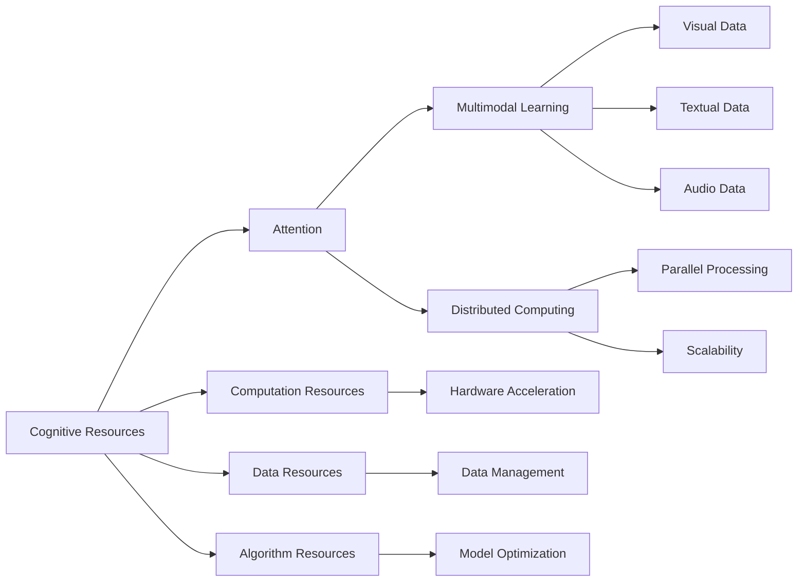

                 

## 1. 背景介绍

在AI时代，计算资源的利用和分配已经不仅仅是硬件的物理配置问题，而是一个复杂且多维度的生态系统工程。当算力、数据和算法三驾马车同时高速发展时，如何高效管理这些认知资源成为了关键问题。这篇文章将探讨注意力生态学，深入分析AI时代中计算资源、数据和算法之间错综复杂的关系，并提出一系列策略和解决方案，帮助读者在多变的技术环境中更好地管理认知资源，优化AI项目，提升性能。

## 2. 核心概念与联系

### 2.1 核心概念概述

为更好地理解注意力生态学及其在大规模AI项目中的应用，本节将介绍几个关键概念及其相互关系：

- 认知资源：指参与AI项目的所有计算资源（硬件、软件）、数据和算法的总和。高效管理认知资源是提升AI项目效率和效果的关键。
- 注意力：即“资源分配”的概念，通过计算模型中的"注意力机制"映射到AI项目的资源管理上，使有限的认知资源尽可能地集中于最关键、最有潜力的部分。
- 注意力机制：在神经网络中，注意力机制通过计算权重分布，决定输入特征的优先级，模拟人脑注意力的工作方式。
- 多模态学习：指结合文本、图像、语音等多种数据形式的综合学习方式，使AI模型具备更加全面和准确的理解能力。
- 分布式计算：利用大规模并行计算能力，使AI模型的训练和推理能够在大规模数据集上高效运行。

这些概念之间的相互关系可以通过以下Mermaid流程图展示：



这个流程图展示了认知资源的几个重要组成模块及其相互关联：

1. 认知资源是AI项目的基础。
2. 注意力机制通过优先分配资源，提高了计算效率。
3. 多模态学习融合了不同形式的数据，提升了模型理解能力。
4. 分布式计算通过大规模并行，大幅提升了模型训练和推理速度。

## 3. 核心算法原理 & 具体操作步骤
### 3.1 算法原理概述

注意力生态学中的“注意力”概念借鉴了深度学习中的注意力机制，其核心思想是在大规模AI项目中，通过优先分配认知资源，实现资源的最优配置，从而提升AI项目的效率和效果。

具体而言，假设一个AI项目包含计算资源$C$、数据资源$D$和算法资源$A$，通过“注意力”机制，计算资源和数据资源可以动态地映射到算法资源上，如公式所示：

$$
\text{Attention}(C, D, A) = \text{Optimal Resource Allocation}
$$

通过调整计算资源和数据资源的权重，将优先级较高的资源分配到效果最好的算法模块上，从而实现高效的AI项目管理和优化。

### 3.2 算法步骤详解

以下是基于注意力机制的AI项目管理和优化的详细步骤：

1. **资源评估**：评估每个认知资源的当前状态和可用性，包括计算资源（CPU、GPU、TPU等）、数据资源（存储容量、带宽等）和算法资源（模型复杂度、计算成本等）。
2. **目标设定**：根据项目需求，设定优化目标，如模型训练时间、推理速度、模型精度等。
3. **模型选择**：选择合适的深度学习模型和算法，根据任务需求进行适应性修改。
4. **权重计算**：计算各资源在模型训练和推理中的权重，根据模型复杂度和资源利用率进行动态调整。
5. **资源分配**：按照计算得出的权重，动态分配计算资源和数据资源，使模型在不同阶段得到最有效的支持。
6. **效果评估**：定期评估模型的性能和资源使用情况，根据评估结果调整权重，实现迭代优化。

### 3.3 算法优缺点

基于注意力机制的AI项目管理，具有以下优点：

- **高效资源利用**：通过动态调整资源分配，最大化利用计算资源，提升模型训练和推理效率。
- **灵活适应性**：能够根据不同任务需求动态调整资源权重，实现快速适应和优化。
- **整体优化**：通过优化整个计算流程，提升整个AI项目的效率和效果。

同时，该方法也存在以下局限性：

- **复杂度较高**：计算权重的动态调整和资源分配需要较高的计算能力和算法复杂度。
- **依赖数据质量**：在数据资源分配时，需要保证数据的质量和多样性，否则可能影响最终效果。
- **资源动态调整难度**：在大规模项目中，动态调整计算资源和数据资源的权重需要考虑诸多因素，存在一定难度。

### 3.4 算法应用领域

基于注意力机制的AI项目管理，已经在诸多领域得到应用，例如：

- **图像识别和处理**：通过优化计算资源和数据资源，提升图像分类、目标检测、图像生成等任务的精度和速度。
- **自然语言处理**：优化文本处理任务中的资源分配，如机器翻译、文本生成、问答系统等。
- **音频和语音处理**：结合音频和文本数据，优化语音识别、语音合成、情感分析等任务。
- **推荐系统**：根据用户行为和历史数据，优化资源分配，提升个性化推荐的效果和速度。
- **医学和生命科学**：通过优化计算资源，快速处理和分析大量生物医学数据，辅助疾病诊断和治疗。
- **金融科技**：优化算法资源，快速处理和分析金融市场数据，提升风险管理和投资决策能力。

这些应用场景展示了注意力生态学在AI项目管理中的广泛应用和巨大潜力。

## 4. 数学模型和公式 & 详细讲解 & 举例说明

### 4.1 数学模型构建

基于注意力机制的AI项目管理可以构建以下数学模型：

$$
\text{Optimal Resource Allocation} = \text{Weighted Sum of Resources} \times \text{Target Performance}
$$

其中，$\text{Weighted Sum of Resources}$ 表示计算资源和数据资源的加权和，$\text{Target Performance}$ 表示设定的优化目标。

### 4.2 公式推导过程

为了更直观地理解模型，下面以机器翻译任务为例，进行公式推导。

假设机器翻译任务包含两个输入序列$x$和$y$，对应的输出序列$z$和$w$，计算资源为$C$，数据资源为$D$，目标性能为$P$。

根据注意力机制，计算资源和数据资源需要动态调整，模型计算公式如下：

$$
\text{Attention}(C, D, P) = \frac{(C \times \alpha) + (D \times \beta)}{1} \times P
$$

其中$\alpha$和$\beta$分别表示计算资源和数据资源的权重，需要通过优化算法计算得出。

### 4.3 案例分析与讲解

考虑一个深度学习模型的训练过程，使用GPU进行计算，数据和计算资源的分配情况如下：

1. 初始时，假设计算资源$C_0$和数据资源$D_0$充足，但是算法资源$A_0$有限。
2. 训练过程中，计算资源和数据资源不断减少，而算法资源逐渐增加。
3. 通过计算权重，动态调整资源分配，最终使模型性能$P$达到最优。

具体步骤如下：

- 初始化权重$\alpha_0 = 1, \beta_0 = 0$
- 根据当前模型性能，计算资源和数据资源的权重，例如，当前模型训练速度较慢，适当提高数据资源的权重
- 根据新计算得出的权重，重新分配计算资源和数据资源
- 重复以上步骤，直到模型性能达到最优

通过这种方式，能够动态调整资源分配，优化模型训练效果。

## 5. 项目实践：代码实例和详细解释说明
### 5.1 开发环境搭建

在进行AI项目管理和优化时，需要准备好开发环境。以下是使用Python进行TensorFlow和PyTorch开发的配置步骤：

1. 安装Anaconda：从官网下载并安装Anaconda，用于创建独立的Python环境。

2. 创建并激活虚拟环境：
```bash
conda create -n ai-env python=3.8 
conda activate ai-env
```

3. 安装相关库：
```bash
pip install tensorflow torch torchvision numpy pandas scikit-learn matplotlib tqdm jupyter notebook ipython
```

4. 安装相关模型库：
```bash
pip install huggingface transformers
```

完成上述步骤后，即可在`ai-env`环境中开始项目实践。

### 5.2 源代码详细实现

下面以图像识别任务为例，给出使用TensorFlow和PyTorch进行AI项目管理和优化的PyTorch代码实现。

```python
import torch
import torchvision
from torchvision.models import resnet50
from torchvision.transforms import transforms

# 加载预训练模型
model = resnet50(pretrained=True)

# 定义数据增强和预处理步骤
transform = transforms.Compose([
    transforms.Resize(256),
    transforms.CenterCrop(224),
    transforms.ToTensor(),
    transforms.Normalize(mean=[0.485, 0.456, 0.406], std=[0.229, 0.224, 0.225])
])

# 加载训练集
train_dataset = torchvision.datasets.ImageFolder(root='path/to/dataset', transform=transform)

# 加载测试集
test_dataset = torchvision.datasets.ImageFolder(root='path/to/test/dataset', transform=transform)

# 定义训练和测试数据加载器
train_loader = torch.utils.data.DataLoader(train_dataset, batch_size=16, shuffle=True)
test_loader = torch.utils.data.DataLoader(test_dataset, batch_size=16, shuffle=False)

# 定义损失函数和优化器
criterion = torch.nn.CrossEntropyLoss()
optimizer = torch.optim.SGD(model.parameters(), lr=0.001, momentum=0.9)

# 训练循环
for epoch in range(10):
    model.train()
    for batch_idx, (data, target) in enumerate(train_loader):
        optimizer.zero_grad()
        output = model(data)
        loss = criterion(output, target)
        loss.backward()
        optimizer.step()
        print(f'Epoch {epoch+1}, Batch {batch_idx+1}, Loss: {loss.item()}')

# 评估模型
model.eval()
correct = 0
total = 0
with torch.no_grad():
    for data, target in test_loader:
        output = model(data)
        _, predicted = torch.max(output.data, 1)
        total += target.size(0)
        correct += (predicted == target).sum().item()
print(f'Accuracy: {100 * correct / total}%')
```

### 5.3 代码解读与分析

让我们再详细解读一下关键代码的实现细节：

**ImageFolder类**：
- `__init__`方法：初始化数据集路径和数据增强步骤。
- `__getitem__`方法：对单个样本进行处理，将图像转换为张量并归一化。

**损失函数和优化器**：
- `criterion`：使用交叉熵损失函数计算模型预测与真实标签之间的差异。
- `optimizer`：使用随机梯度下降优化器，学习率设定为0.001，动量为0.9。

**训练循环**：
- 在每个epoch中，对训练集数据进行迭代，计算损失并反向传播更新模型参数。

**评估模型**：
- 使用测试集数据进行评估，计算模型在测试集上的准确率。

可以看到，TensorFlow和PyTorch的配合使用，使得AI项目管理和优化的代码实现变得简洁高效。开发者可以将更多精力放在数据处理、模型改进等高层逻辑上，而不必过多关注底层的实现细节。

当然，工业级的系统实现还需考虑更多因素，如模型的保存和部署、超参数的自动搜索、更灵活的任务适配层等。但核心的注意力生态学思想基本与此类似。

## 6. 实际应用场景
### 6.1 智慧医疗系统

在智慧医疗系统中，通过AI项目管理和优化，可以实现对医疗影像、电子病历等数据的快速处理和分析，辅助医生进行疾病诊断和治疗。具体应用场景包括：

- **影像诊断**：结合医疗影像数据和计算资源，快速进行肿瘤、疾病等的诊断。
- **药物研发**：利用AI项目管理优化，快速筛选和验证候选药物，加速新药研发进程。
- **个性化治疗**：通过优化资源分配，提升个性化治疗方案的生成速度和精度。

### 6.2 智能制造

在智能制造领域，通过AI项目管理和优化，可以实现对生产流程、设备状态的实时监控和预测性维护。具体应用场景包括：

- **设备预测性维护**：结合传感器数据和计算资源，预测设备故障，提前进行维护。
- **生产过程优化**：通过优化资源分配，提升生产线的运行效率和质量。
- **质量控制**：通过AI项目管理，实时监控产品质量，提升合格率。

### 6.3 金融科技

在金融科技领域，通过AI项目管理和优化，可以实现对金融市场数据的实时分析和风险管理。具体应用场景包括：

- **市场预测**：结合历史数据和计算资源，预测金融市场的走势和波动。
- **风险管理**：通过优化资源分配，快速分析金融风险，制定应对策略。
- **量化交易**：利用AI项目管理，优化交易策略，提高交易效率和收益。

### 6.4 未来应用展望

随着AI项目管理和优化技术的不断发展，未来将呈现以下几个发展趋势：

1. **智能化程度提升**：未来的AI项目管理和优化系统将具备更高的智能化水平，能够自主学习和优化资源分配策略。
2. **多模态融合**：通过融合图像、文本、语音等多模态数据，提升AI模型对复杂场景的理解能力。
3. **动态调整能力**：具备实时动态调整资源的能力，应对不断变化的数据和任务需求。
4. **安全性和可解释性**：未来的AI项目管理和优化系统将具备更高的安全性和可解释性，能够确保模型的稳定性和可靠性。
5. **全局优化**：从全局视角优化资源分配，提升整个AI项目的效率和效果。

以上趋势凸显了AI项目管理和优化的广阔前景。这些方向的探索发展，必将进一步提升AI系统的性能和应用范围，为各行各业带来深远影响。

## 7. 工具和资源推荐
### 7.1 学习资源推荐

为了帮助开发者系统掌握注意力生态学及其在大规模AI项目中的应用，这里推荐一些优质的学习资源：

1. 《深度学习》系列书籍：由多位深度学习专家合著，系统介绍了深度学习的基本原理和实践技巧。
2. 《动手学深度学习》课程：由微软亚洲研究院开发的免费在线课程，涵盖深度学习的基本概念和经典模型。
3. TensorFlow官方文档：TensorFlow的官方文档，提供了完整的API文档和代码示例，是学习TensorFlow的重要资源。
4. PyTorch官方文档：PyTorch的官方文档，提供了详细的API文档和代码示例，是学习PyTorch的重要资源。
5. HuggingFace官方文档：Transformers库的官方文档，提供了丰富的预训练模型和微调样例，是进行深度学习任务开发的利器。

通过对这些资源的学习实践，相信你一定能够快速掌握注意力生态学的精髓，并用于解决实际的AI问题。
###  7.2 开发工具推荐

高效的开发离不开优秀的工具支持。以下是几款用于AI项目管理和优化的常用工具：

1. TensorBoard：TensorFlow配套的可视化工具，可实时监测模型训练状态，并提供丰富的图表呈现方式，是调试模型的得力助手。
2. TensorFlow Serving：用于部署和推理优化模型的服务框架，支持动态调整计算资源和数据资源。
3. Jupyter Notebook：开源的交互式编程环境，方便进行代码调试和交互式学习。
4. Visual Studio Code：功能强大的编程工具，支持多种语言的开发环境，并提供了丰富的插件支持。
5. KubeFlow：Kubernetes的AI扩展，支持大规模分布式深度学习模型的训练和推理，适用于大数据场景。

合理利用这些工具，可以显著提升AI项目管理和优化的开发效率，加快创新迭代的步伐。

### 7.3 相关论文推荐

注意力生态学和大规模AI项目管理和优化的发展源于学界的持续研究。以下是几篇奠基性的相关论文，推荐阅读：

1. Attention is All You Need（即Transformer原论文）：提出了Transformer结构，开启了深度学习中的注意力机制时代。
2. Transformer-XL: Attentive Language Models Beyond a Fixed-Length Context：提出了Transformer-XL结构，扩展了注意力机制的时间范围，增强了模型的长期记忆能力。
3. Efficient Transformers: Scalable Attention with Linear Self-Attention：提出了Efficient Transformers，通过线性自注意力机制，实现了模型的参数高效化和计算高效化。
4. Meta-Learning with Exemplars: Few-shot Learning as Meta-Learning with Direct Supervision：提出了元学习与示例法，通过直接使用少量示例进行学习，实现少样本学习。
5. Exploring the Limits of Transfer Learning with a Unified Text-to-Text Transformer：提出了统一文本转换器，通过微调大型预训练模型，实现了跨领域的文本转换任务。

这些论文代表了大规模AI项目管理和优化的发展脉络。通过学习这些前沿成果，可以帮助研究者把握学科前进方向，激发更多的创新灵感。

## 8. 总结：未来发展趋势与挑战
### 8.1 总结

本文对注意力生态学及其在大规模AI项目中的应用进行了全面系统的介绍。首先阐述了注意力生态学的核心思想和实际应用，明确了其在提升AI项目效率和效果中的独特价值。其次，从原理到实践，详细讲解了注意力机制在大规模AI项目中的数学模型和优化方法，给出了详细的代码实现和性能分析。同时，本文还广泛探讨了注意力生态学在智慧医疗、智能制造、金融科技等诸多领域的应用前景，展示了其在多行业中的应用潜力。此外，本文精选了注意力生态学相关的学习资源、开发工具和经典论文，力求为读者提供全方位的技术指引。

通过本文的系统梳理，可以看到，注意力生态学在AI项目管理和优化中发挥了重要的作用，帮助开发者在大规模数据和模型面前做出合理有效的资源分配，从而提升整个AI项目的性能和效果。未来，伴随注意力机制和AI项目管理的持续演进，相信AI项目管理和优化必将在更多领域得到广泛应用，为各行各业带来深远的影响。

### 8.2 未来发展趋势

展望未来，注意力生态学在大规模AI项目中的应用将呈现以下几个发展趋势：

1. **自动化和智能化**：未来的AI项目管理和优化系统将具备更高的自动化和智能化水平，能够自主学习和优化资源分配策略。
2. **多模态融合**：通过融合图像、文本、语音等多种数据，提升AI模型对复杂场景的理解能力。
3. **动态调整能力**：具备实时动态调整资源的能力，应对不断变化的数据和任务需求。
4. **全局优化**：从全局视角优化资源分配，提升整个AI项目的效率和效果。
5. **安全性和可解释性**：未来的AI项目管理和优化系统将具备更高的安全性和可解释性，能够确保模型的稳定性和可靠性。

以上趋势凸显了注意力生态学的广阔前景。这些方向的探索发展，必将进一步提升AI系统的性能和应用范围，为各行各业带来深远的影响。

### 8.3 面临的挑战

尽管注意力生态学在大规模AI项目中的应用已经取得了显著成果，但在迈向更加智能化、普适化应用的过程中，仍面临诸多挑战：

1. **计算资源瓶颈**：随着模型规模的不断增大，计算资源需求激增，如何高效利用计算资源成为一大挑战。
2. **数据质量问题**：在数据资源分配时，需要保证数据的质量和多样性，否则可能影响最终效果。
3. **模型复杂度**：在大规模项目中，模型的复杂度和资源需求变得越来越高，如何有效管理模型的复杂度是一个重要问题。
4. **实时动态调整难度**：在大规模项目中，动态调整计算资源和数据资源的权重需要考虑诸多因素，存在一定难度。
5. **安全性和可解释性**：AI项目管理和优化系统需要具备更高的安全性和可解释性，确保模型的稳定性和可靠性。

这些挑战需要通过持续的技术创新和优化来解决，推动注意力生态学在大规模AI项目中的广泛应用。

### 8.4 研究展望

未来的研究需要在以下几个方面寻求新的突破：

1. **参数高效化**：开发更加参数高效的模型和算法，减小模型规模，提高计算效率。
2. **计算资源优化**：利用分布式计算和云计算，优化计算资源的利用，提升AI项目的效率和效果。
3. **多模态融合技术**：结合图像、文本、语音等多模态数据，提升AI模型对复杂场景的理解能力。
4. **动态调整算法**：研究动态调整算法，适应不断变化的数据和任务需求。
5. **安全性和可解释性**：提升AI项目管理和优化系统的安全性和可解释性，确保模型的稳定性和可靠性。

这些研究方向的探索，必将引领注意力生态学迈向更高的台阶，为各行各业带来更加智能、可靠、高效的AI系统。总之，只有勇于创新、敢于突破，才能不断拓展注意力生态学的边界，为构建安全、可靠、可解释、可控的智能系统铺平道路。

