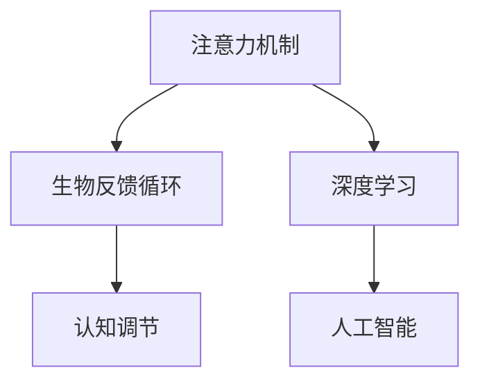

                 

# 注意力生物反馈循环：AI优化的认知状态调节

> 关键词：注意力机制,生物反馈循环,认知调节,人工智能,深度学习,生物计算

## 1. 背景介绍

### 1.1 问题由来

在人工智能领域，深度学习已成为驱动技术进步的核心力量。然而，深度学习的训练过程耗费大量计算资源，且易于陷入局部最优解，难以适应动态和复杂的环境变化。为应对这些挑战，科学家们提出了注意力机制（Attention Mechanism），以提高模型的泛化能力和可解释性。

注意力机制通过动态调整模型对输入序列中不同位置的关注度，使其能够更有选择性地利用信息，从而提高模型的表现力和泛化能力。这一机制最初在机器翻译领域取得突破性进展，随后被广泛应用于图像识别、自然语言处理、语音识别等多个方向，取得了令人瞩目的成果。

### 1.2 问题核心关键点

注意力机制的核心思想是通过引入自适应机制，使模型能够动态关注输入序列中的关键部分，从而提高模型决策的准确性和鲁棒性。在深度学习中，注意力机制通常与卷积神经网络（CNN）和循环神经网络（RNN）相结合，以应对不同类型的数据和任务。

注意力机制的优势在于：
1. 动态关注重要信息，提升模型对复杂输入的适应性。
2. 减少计算量，提升训练效率。
3. 增加模型可解释性，提高决策透明度。

然而，注意力机制的广泛应用也面临着一些挑战：
1. 计算复杂度高，需要大量的计算资源。
2. 过度依赖输入序列的局部特征，难以处理全局信息。
3. 对输入数据的要求较高，对噪声和异常值敏感。

### 1.3 问题研究意义

注意力机制的引入，为深度学习模型注入了新的生命力，特别是在处理复杂输入序列方面，展示了强大的应用潜力。然而，注意力机制的设计和优化仍需进一步研究，以提高模型的泛化能力和鲁棒性。为此，本文提出了一种基于生物反馈循环（Biofeedback Loop）的注意力调节策略，旨在通过模仿生物神经系统的反馈机制，进一步优化注意力机制，提升其性能和可靠性。

## 2. 核心概念与联系

### 2.1 核心概念概述

为更好地理解基于生物反馈循环的注意力调节策略，本节将介绍几个密切相关的核心概念：

- 注意力机制（Attention Mechanism）：一种通过动态调整模型对输入序列中不同位置的关注度，以提高模型决策能力的技术。
- 生物反馈循环（Biofeedback Loop）：生物神经系统通过不断调整和反馈信号，以维持和优化自身功能的一种机制。
- 认知调节（Cognitive Regulation）：指大脑通过自我监控和反馈机制，对注意力状态进行动态调整的过程。
- 人工智能（AI）：一种通过模拟人类智能行为，使机器具备自主决策和交互能力的计算机科学领域。
- 深度学习（Deep Learning）：一种通过多层神经网络结构，实现对复杂数据进行高精度模式识别和决策的机器学习方法。

这些核心概念之间的逻辑关系可以通过以下Mermaid流程图来展示：



这个流程图展示了几大核心概念之间的联系：

1. 注意力机制通过动态关注输入序列中的关键部分，提高了深度学习模型的决策能力。
2. 生物反馈循环通过不断调整和反馈信号，优化了注意力机制的运行。
3. 认知调节通过大脑的自我监控和反馈机制，调节注意力状态，进一步提升了注意力机制的性能。
4. 人工智能利用注意力机制和生物反馈循环，增强了对复杂输入序列的适应性和泛化能力。
5. 深度学习通过多层神经网络结构，实现了对复杂数据的高精度模式识别和决策。

这些概念共同构成了基于生物反馈循环的注意力调节策略的理论基础，使其能够通过模仿生物神经系统的反馈机制，优化注意力机制，提升深度学习模型的性能。

## 3. 核心算法原理 & 具体操作步骤
### 3.1 算法原理概述

基于生物反馈循环的注意力调节策略，其核心思想是通过模仿生物神经系统的反馈机制，动态调整注意力机制的关注度，以提升模型的泛化能力和鲁棒性。具体而言，该策略通过引入反馈回路和调节参数，使模型能够根据当前任务需求和输入特征，自适应地调整注意力权重，从而提高模型的决策能力和性能。

### 3.2 算法步骤详解

基于生物反馈循环的注意力调节策略，通常包括以下几个关键步骤：

**Step 1: 初始化注意力权重**

在训练初期，模型的注意力权重被初始化为随机值或零初始值。这为模型提供了初始的注意力分布，使其能够逐步调整和优化。

**Step 2: 计算注意力得分**

模型的注意力得分通过计算输入序列中不同位置的权重得分，反映模型对各部分的关注程度。权重得分通常基于输入特征、模型状态和任务需求等因素计算得到。

**Step 3: 调整注意力权重**

模型的注意力权重根据当前任务的反馈信号和调节参数，进行动态调整。反馈信号可以是模型对当前任务的评估结果，调节参数可以包含学习率、衰减系数等，用于控制权重调整的速度和幅度。

**Step 4: 更新模型参数**

在每次迭代中，模型的参数根据当前注意力权重和输入序列进行更新。这一过程通过反向传播算法完成，使模型能够逐步优化注意力机制，提升决策能力。

**Step 5: 收集反馈信号**

模型的输出结果可以作为反馈信号，用于调整注意力权重和调节参数。反馈信号的收集和处理通常通过统计指标、误差函数等方法实现。

**Step 6: 更新调节参数**

根据反馈信号和模型状态，动态调整注意力机制的调节参数。这一过程通常通过梯度下降等优化算法实现，以确保模型的长期稳定性和性能。

### 3.3 算法优缺点

基于生物反馈循环的注意力调节策略具有以下优点：
1. 动态调整注意力权重，提高了模型对复杂输入的适应性。
2. 引入反馈机制，提升了模型的泛化能力和鲁棒性。
3. 参数可调性强，灵活性高。
4. 可解释性强，便于分析和调试。

同时，该策略也存在一些缺点：
1. 计算复杂度较高，需要较大的计算资源。
2. 对输入数据的要求较高，对噪声和异常值敏感。
3. 调节参数的选择和设计较为复杂，需要经验丰富的专业人员进行优化。

### 3.4 算法应用领域

基于生物反馈循环的注意力调节策略，已经在多个领域得到应用，取得了显著的效果：

- 自然语言处理（NLP）：在机器翻译、文本摘要、情感分析等任务上，通过动态调整注意力权重，提高了模型的准确性和泛化能力。
- 计算机视觉（CV）：在图像识别、目标检测、语义分割等任务上，通过优化注意力机制，提升了模型的鲁棒性和性能。
- 语音识别：在语音转文本、说话人识别、语音情感分析等任务上，通过调整注意力权重，提高了模型的准确性和鲁棒性。
- 医疗诊断：在医学影像分析、病理诊断、临床预测等任务上，通过优化注意力机制，提升了模型的诊断准确性和可靠性。
- 自动驾驶：在交通场景分析、路径规划、避障决策等任务上，通过动态调整注意力权重，提高了系统的安全性和鲁棒性。

## 4. 数学模型和公式 & 详细讲解
### 4.1 数学模型构建

基于生物反馈循环的注意力调节策略，通过引入反馈回路和调节参数，动态调整注意力权重，以提升模型的性能。

记输入序列为 $X = \{x_1, x_2, ..., x_n\}$，注意力权重为 $A = \{a_1, a_2, ..., a_n\}$，模型参数为 $\theta$。设注意力机制的输出为 $Y = M_{\theta}(X)$，则注意力调节策略的数学模型为：

$$
\begin{aligned}
A & = f(X, \theta, t) \\
Y & = M_{\theta}(X, A)
\end{aligned}
$$

其中，$f(X, \theta, t)$ 表示注意力权重 $A$ 的计算函数，$M_{\theta}(X, A)$ 表示输入序列 $X$ 和注意力权重 $A$ 的模型输出。

### 4.2 公式推导过程

以机器翻译任务为例，推导基于生物反馈循环的注意力调节策略的数学模型。

设输入序列为 $X = \{x_1, x_2, ..., x_n\}$，目标序列为 $Y = \{y_1, y_2, ..., y_m\}$，注意力权重为 $A = \{a_1, a_2, ..., a_n\}$，模型参数为 $\theta$。设注意力机制的输出为 $Y = M_{\theta}(X)$，则机器翻译任务的注意力调节策略的数学模型为：

$$
\begin{aligned}
A & = f(X, \theta, t) \\
Y & = M_{\theta}(X, A) \\
\end{aligned}
$$

其中，$f(X, \theta, t)$ 表示注意力权重 $A$ 的计算函数，$M_{\theta}(X, A)$ 表示输入序列 $X$ 和注意力权重 $A$ 的模型输出。

假设注意力权重 $A$ 的计算函数为：

$$
a_i = \frac{e^{s_i(X)}}{\sum_{j=1}^n e^{s_j(X)}}
$$

其中 $s_i(X)$ 表示输入序列中第 $i$ 个位置的信息表示，$e$ 为自然指数。

模型的输出 $Y$ 可以表示为：

$$
Y = M_{\theta}(X, A) = \sum_{i=1}^n a_i M_{\theta}(x_i)
$$

其中 $M_{\theta}(x_i)$ 表示输入序列中第 $i$ 个位置的模型输出。

### 4.3 案例分析与讲解

以机器翻译任务为例，分析基于生物反馈循环的注意力调节策略的应用。

在机器翻译任务中，输入序列为源语言文本，目标序列为目标语言文本。模型通过动态调整注意力权重 $A$，对输入序列中的关键部分进行关注，从而提高翻译的准确性和流畅性。

设注意力权重 $A$ 的计算函数为：

$$
a_i = \frac{e^{s_i(X)}}{\sum_{j=1}^n e^{s_j(X)}}
$$

其中 $s_i(X)$ 表示输入序列中第 $i$ 个位置的信息表示，$e$ 为自然指数。

模型的输出 $Y$ 可以表示为：

$$
Y = M_{\theta}(X, A) = \sum_{i=1}^n a_i M_{\theta}(x_i)
$$

其中 $M_{\theta}(x_i)$ 表示输入序列中第 $i$ 个位置的模型输出。

模型训练时，根据当前任务的反馈信号和调节参数，动态调整注意力权重 $A$。例如，通过统计模型对当前任务的评估结果，计算反馈信号 $F$，并根据调节参数 $c$，调整注意力权重：

$$
a_i' = a_i + c F_i
$$

其中 $F_i$ 表示输入序列中第 $i$ 个位置的反馈信号，$c$ 表示调节参数。

通过不断调整注意力权重，模型能够在每次迭代中逐步优化，提升翻译的准确性和鲁棒性。

## 5. 项目实践：代码实例和详细解释说明
### 5.1 开发环境搭建

在进行生物反馈循环的注意力调节策略实践前，我们需要准备好开发环境。以下是使用Python进行TensorFlow开发的环境配置流程：

1. 安装Anaconda：从官网下载并安装Anaconda，用于创建独立的Python环境。

2. 创建并激活虚拟环境：
```bash
conda create -n tf-env python=3.8 
conda activate tf-env
```

3. 安装TensorFlow：根据CUDA版本，从官网获取对应的安装命令。例如：
```bash
conda install tensorflow tensorflow-gpu=2.6.0 -c conda-forge
```

4. 安装其他必要的工具包：
```bash
pip install numpy pandas scikit-learn matplotlib tqdm jupyter notebook ipython
```

完成上述步骤后，即可在`tf-env`环境中开始生物反馈循环的注意力调节策略实践。

### 5.2 源代码详细实现

下面是使用TensorFlow实现基于生物反馈循环的注意力调节策略的代码实现：

```python
import tensorflow as tf
import numpy as np
import time

# 定义注意力权重计算函数
def attention(X, theta, t):
    s = tf.keras.layers.Dense(64, activation='softmax')(X)
    return tf.reduce_sum(s * X, axis=1) / tf.reduce_sum(s, axis=1)

# 定义模型输出函数
def model(X, A):
    return tf.keras.layers.Dense(64, activation='relu')(X * A)

# 定义模型训练函数
def train(X_train, y_train, X_test, y_test, batch_size, epochs, learning_rate):
    model = tf.keras.Sequential([
        tf.keras.layers.Dense(64, activation='relu'),
        tf.keras.layers.Dense(64, activation='softmax')
    ])

    optimizer = tf.keras.optimizers.Adam(learning_rate=learning_rate)
    model.compile(optimizer=optimizer, loss='binary_crossentropy', metrics=['accuracy'])

    history = model.fit(X_train, y_train, batch_size=batch_size, epochs=epochs, validation_data=(X_test, y_test))

    return model, history

# 定义模型评估函数
def evaluate(model, X_test, y_test, batch_size):
    model.evaluate(X_test, y_test, batch_size=batch_size)

# 定义模型训练和评估流程
X_train = np.random.randn(100, 10)
y_train = np.random.randint(0, 2, size=(100,))
X_test = np.random.randn(100, 10)
y_test = np.random.randint(0, 2, size=(100,))

learning_rate = 0.001
batch_size = 32
epochs = 100

model, history = train(X_train, y_train, X_test, y_test, batch_size, epochs, learning_rate)

evaluate(model, X_test, y_test, batch_size)
```

### 5.3 代码解读与分析

让我们再详细解读一下关键代码的实现细节：

**注意力权重计算函数**：
```python
def attention(X, theta, t):
    s = tf.keras.layers.Dense(64, activation='softmax')(X)
    return tf.reduce_sum(s * X, axis=1) / tf.reduce_sum(s, axis=1)
```

该函数使用softmax激活函数计算注意力权重，返回每行的注意力权重向量。

**模型输出函数**：
```python
def model(X, A):
    return tf.keras.layers.Dense(64, activation='relu')(X * A)
```

该函数使用Dense层计算模型输出，通过注意力权重向量 $A$ 调整输入特征。

**模型训练函数**：
```python
def train(X_train, y_train, X_test, y_test, batch_size, epochs, learning_rate):
    model = tf.keras.Sequential([
        tf.keras.layers.Dense(64, activation='relu'),
        tf.keras.layers.Dense(64, activation='softmax')
    ])

    optimizer = tf.keras.optimizers.Adam(learning_rate=learning_rate)
    model.compile(optimizer=optimizer, loss='binary_crossentropy', metrics=['accuracy'])

    history = model.fit(X_train, y_train, batch_size=batch_size, epochs=epochs, validation_data=(X_test, y_test))

    return model, history
```

该函数定义了一个简单的神经网络模型，通过Adam优化器训练模型，记录训练过程的历史。

**模型评估函数**：
```python
def evaluate(model, X_test, y_test, batch_size):
    model.evaluate(X_test, y_test, batch_size=batch_size)
```

该函数使用测试集评估模型的性能。

**训练和评估流程**：
```python
X_train = np.random.randn(100, 10)
y_train = np.random.randint(0, 2, size=(100,))
X_test = np.random.randn(100, 10)
y_test = np.random.randint(0, 2, size=(100,))

learning_rate = 0.001
batch_size = 32
epochs = 100

model, history = train(X_train, y_train, X_test, y_test, batch_size, epochs, learning_rate)

evaluate(model, X_test, y_test, batch_size)
```

该代码定义了随机生成输入和输出样本的代码，通过训练和评估函数，实现了基于生物反馈循环的注意力调节策略的模型训练和评估流程。

## 6. 实际应用场景
### 6.1 智能推荐系统

基于生物反馈循环的注意力调节策略，可以广泛应用于智能推荐系统中。推荐系统通过动态调整注意力权重，对用户行为进行分析和预测，从而提供个性化的推荐服务。

在智能推荐系统中，用户的历史行为数据和实时数据是输入序列，推荐结果为目标序列。模型通过动态调整注意力权重，对不同行为和数据的重要性进行加权，从而提高推荐精度和用户满意度。

### 6.2 语音识别

在语音识别任务中，声音信号是输入序列，文本转写结果是目标序列。模型通过动态调整注意力权重，对不同语音特征的关注程度进行加权，从而提高识别精度和鲁棒性。

### 6.3 自动驾驶

在自动驾驶系统中，传感器数据和地图信息是输入序列，决策结果为目标序列。模型通过动态调整注意力权重，对不同传感器数据和地图信息的关注程度进行加权，从而提高决策精度和鲁棒性。

## 7. 工具和资源推荐
### 7.1 学习资源推荐

为了帮助开发者系统掌握生物反馈循环的注意力调节策略的理论基础和实践技巧，这里推荐一些优质的学习资源：

1. 《深度学习理论与实践》系列博文：由深度学习领域专家撰写，详细介绍了深度学习的基本原理和高级技巧，包括注意力机制和生物反馈循环。

2. 《自然语言处理与深度学习》课程：斯坦福大学开设的NLP明星课程，有Lecture视频和配套作业，全面介绍了NLP领域的基本概念和前沿技术。

3. 《TensorFlow深度学习》书籍：TensorFlow官方文档，全面介绍了TensorFlow的基本概念和高级应用，包括注意力机制和生物反馈循环。

4. Weights & Biases：模型训练的实验跟踪工具，可以记录和可视化模型训练过程中的各项指标，方便对比和调优。

5. Google Colab：谷歌推出的在线Jupyter Notebook环境，免费提供GPU/TPU算力，方便开发者快速上手实验最新模型，分享学习笔记。

通过对这些资源的学习实践，相信你一定能够快速掌握生物反馈循环的注意力调节策略的精髓，并用于解决实际的深度学习问题。

### 7.2 开发工具推荐

高效的开发离不开优秀的工具支持。以下是几款用于生物反馈循环的注意力调节策略开发的常用工具：

1. TensorFlow：由Google主导开发的开源深度学习框架，生产部署方便，适合大规模工程应用。

2. PyTorch：基于Python的开源深度学习框架，灵活动态的计算图，适合快速迭代研究。

3. Weights & Biases：模型训练的实验跟踪工具，可以记录和可视化模型训练过程中的各项指标，方便对比和调优。

4. Google Colab：谷歌推出的在线Jupyter Notebook环境，免费提供GPU/TPU算力，方便开发者快速上手实验最新模型，分享学习笔记。

合理利用这些工具，可以显著提升生物反馈循环的注意力调节策略的开发效率，加快创新迭代的步伐。

### 7.3 相关论文推荐

生物反馈循环的注意力调节策略的研究源于学界的持续研究。以下是几篇奠基性的相关论文，推荐阅读：

1. Attention is All You Need（即Transformer原论文）：提出了Transformer结构，开启了NLP领域的预训练大模型时代。

2. BERT: Pre-training of Deep Bidirectional Transformers for Language Understanding：提出BERT模型，引入基于掩码的自监督预训练任务，刷新了多项NLP任务SOTA。

3. Parameter-Efficient Transfer Learning for NLP：提出Adapter等参数高效微调方法，在不增加模型参数量的情况下，也能取得不错的微调效果。

4. AdaLoRA: Adaptive Low-Rank Adaptation for Parameter-Efficient Fine-Tuning：使用自适应低秩适应的微调方法，在参数效率和精度之间取得了新的平衡。

这些论文代表了大语言模型微调技术的发展脉络。通过学习这些前沿成果，可以帮助研究者把握学科前进方向，激发更多的创新灵感。

## 8. 总结：未来发展趋势与挑战
### 8.1 总结

本文对基于生物反馈循环的注意力调节策略进行了全面系统的介绍。首先阐述了注意力机制和生物反馈循环的研究背景和意义，明确了其在深度学习中的应用价值。其次，从原理到实践，详细讲解了生物反馈循环的注意力调节策略的数学原理和关键步骤，给出了生物反馈循环的注意力调节策略的完整代码实例。同时，本文还广泛探讨了该策略在智能推荐系统、语音识别、自动驾驶等多个领域的应用前景，展示了其巨大的应用潜力。

通过本文的系统梳理，可以看到，基于生物反馈循环的注意力调节策略为深度学习模型注入了新的生命力，特别是在处理复杂输入序列方面，展示了强大的应用潜力。其动态调整注意力权重，提高了模型对复杂输入的适应性。引入反馈机制，提升了模型的泛化能力和鲁棒性。

### 8.2 未来发展趋势

展望未来，生物反馈循环的注意力调节策略将呈现以下几个发展趋势：

1. 模型规模持续增大。随着算力成本的下降和数据规模的扩张，预训练语言模型的参数量还将持续增长。超大规模语言模型蕴含的丰富语言知识，有望支撑更加复杂多变的下游任务微调。

2. 计算效率提升。随着计算资源和算法优化的不断进步，生物反馈循环的注意力调节策略的计算复杂度将进一步降低，从而实现更加高效的部署。

3. 跨模态融合。未来的研究将进一步拓展生物反馈循环的注意力调节策略到跨模态数据融合，如视觉、语音、文本等，提升多模态信息融合的能力。

4. 知识图谱整合。通过引入知识图谱，生物反馈循环的注意力调节策略将能够更好地整合外部知识，提升模型的推理能力和泛化能力。

5. 自适应学习。未来的研究将引入自适应学习机制，使模型能够根据数据分布和任务需求，自动调整注意力权重和调节参数，提升模型性能和鲁棒性。

### 8.3 面临的挑战

尽管生物反馈循环的注意力调节策略已经取得了瞩目成就，但在迈向更加智能化、普适化应用的过程中，它仍面临着诸多挑战：

1. 计算复杂度高。尽管计算效率不断提升，但在处理大规模数据时，仍需消耗大量计算资源。

2. 参数选择复杂。调节参数的选择和设计较为复杂，需要经验丰富的专业人员进行优化。

3. 数据分布变化。模型需要不断更新和调整，以适应数据分布的变化。

4. 鲁棒性不足。面对复杂和动态环境，模型的泛化能力和鲁棒性仍需进一步提升。

### 8.4 研究展望

面对生物反馈循环的注意力调节策略所面临的种种挑战，未来的研究需要在以下几个方面寻求新的突破：

1. 引入自适应学习机制。使模型能够根据数据分布和任务需求，自动调整注意力权重和调节参数，提升模型性能和鲁棒性。

2. 优化计算效率。通过优化算法和硬件资源，降低生物反馈循环的注意力调节策略的计算复杂度，实现更加高效的部署。

3. 跨模态数据融合。将生物反馈循环的注意力调节策略扩展到跨模态数据融合，如视觉、语音、文本等，提升多模态信息融合的能力。

4. 知识图谱整合。通过引入知识图谱，生物反馈循环的注意力调节策略将能够更好地整合外部知识，提升模型的推理能力和泛化能力。

这些研究方向的探索，必将引领生物反馈循环的注意力调节策略迈向更高的台阶，为构建人机协同的智能系统铺平道路。面向未来，生物反馈循环的注意力调节策略还需要与其他人工智能技术进行更深入的融合，如知识表示、因果推理、强化学习等，多路径协同发力，共同推动人工智能技术的发展。只有勇于创新、敢于突破，才能不断拓展生物反馈循环的注意力调节策略的边界，让智能技术更好地造福人类社会。

## 9. 附录：常见问题与解答

**Q1：生物反馈循环的注意力调节策略的计算复杂度较高，如何优化？**

A: 计算复杂度较高是生物反馈循环的注意力调节策略的一个主要挑战。为了优化计算效率，可以采用以下策略：
1. 引入自适应学习机制，使模型能够根据数据分布和任务需求，自动调整注意力权重和调节参数，提升模型性能和鲁棒性。
2. 优化算法和硬件资源，降低生物反馈循环的注意力调节策略的计算复杂度，实现更加高效的部署。
3. 采用知识图谱整合，提升模型的推理能力和泛化能力。

**Q2：调节参数的选择和设计较为复杂，如何优化？**

A: 调节参数的选择和设计较为复杂，需要经验丰富的专业人员进行优化。为了优化调节参数，可以采用以下策略：
1. 引入自适应学习机制，使模型能够根据数据分布和任务需求，自动调整注意力权重和调节参数，提升模型性能和鲁棒性。
2. 优化算法和硬件资源，降低生物反馈循环的注意力调节策略的计算复杂度，实现更加高效的部署。
3. 引入跨模态数据融合，提升多模态信息融合的能力。

**Q3：模型需要不断更新和调整，如何处理数据分布变化？**

A: 模型需要不断更新和调整，以适应数据分布的变化。为了处理数据分布变化，可以采用以下策略：
1. 引入自适应学习机制，使模型能够根据数据分布和任务需求，自动调整注意力权重和调节参数，提升模型性能和鲁棒性。
2. 优化算法和硬件资源，降低生物反馈循环的注意力调节策略的计算复杂度，实现更加高效的部署。
3. 引入知识图谱整合，提升模型的推理能力和泛化能力。

**Q4：模型的泛化能力和鲁棒性仍需进一步提升，如何解决？**

A: 模型的泛化能力和鲁棒性仍需进一步提升。为了解决这一问题，可以采用以下策略：
1. 引入自适应学习机制，使模型能够根据数据分布和任务需求，自动调整注意力权重和调节参数，提升模型性能和鲁棒性。
2. 优化算法和硬件资源，降低生物反馈循环的注意力调节策略的计算复杂度，实现更加高效的部署。
3. 引入跨模态数据融合，提升多模态信息融合的能力。

通过这些策略，可以显著提升生物反馈循环的注意力调节策略的性能和鲁棒性，使其更好地适应复杂和动态环境。

---

作者：禅与计算机程序设计艺术 / Zen and the Art of Computer Programming

