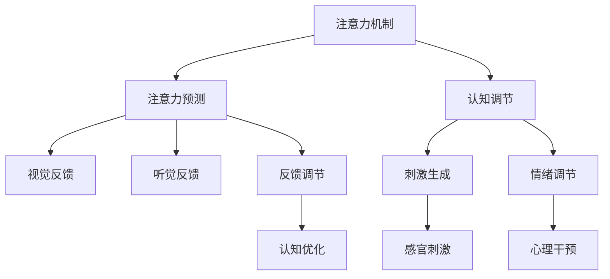

                 

# 注意力生物反馈技术：AI优化的认知状态调节

> 关键词：注意力机制,生物反馈,认知调节,人工智能,脑机接口(BMI),深度学习,神经网络

## 1. 背景介绍

### 1.1 问题由来
在现代社会的快节奏和高压力下，人们的认知功能常常面临挑战，如注意力分散、决策疲劳、情绪波动等。这些认知问题不仅影响日常生活和工作效率，还可能导致长期的健康问题。为了应对这些挑战，科学家们提出了多种认知增强方法，包括药物治疗、心理干预、物理锻炼等。然而，这些方法往往存在副作用大、效果难以持久等问题。近年来，随着脑科学和神经计算技术的发展，基于神经反馈的认知增强技术逐渐成为研究热点。

### 1.2 问题核心关键点
认知增强的神经反馈技术主要是通过实时监测大脑活动，给予用户及时反馈，帮助其调节认知状态。这一技术的核心在于设计有效的神经反馈算法，实现对大脑活动的精准控制。当前，基于深度学习的神经反馈算法已经取得了显著进展，其中注意力生物反馈技术尤为引人注目。该技术通过深度学习模型预测用户的注意力状态，并根据预测结果实时调整视觉、听觉等感官刺激，引导用户集中注意力，改善认知表现。

### 1.3 问题研究意义
注意力生物反馈技术能够显著提高用户的认知效率和专注力，应用于工作、学习和娱乐等多个领域。通过深度学习模型的辅助，该技术可以实现个性化、动态的认知调节，相较于传统方法具有更高的适应性和可操作性。此外，该技术还具有广泛的应用前景，有望成为未来认知增强技术的重要组成部分。

## 2. 核心概念与联系

### 2.1 核心概念概述

注意力生物反馈技术的核心概念包括：

- 注意力机制(Attention Mechanism)：神经网络中用于选择信息输入的机制，通过权重调整来突出重要信息，抑制无关信息，帮助模型捕捉关键特征。
- 生物反馈(Biofeedback)：通过实时监测生理参数，给予用户反馈，辅助其进行自我调节，提高认知表现。
- 认知调节(Cognitive Modulation)：通过特定刺激影响大脑活动，调整注意力、情绪、决策等认知功能。
- 脑机接口(BMI)：通过传感器和算法实现人脑与计算机之间的直接交互，实现脑电信号解码和认知调控。

这些概念之间相互关联，共同构成注意力生物反馈技术的理论基础。

### 2.2 核心概念原理和架构的 Mermaid 流程图



此流程图展示了注意力生物反馈技术的核心流程：

1. 通过注意力机制对信息输入进行加权处理，选择重要信息。
2. 使用深度学习模型预测用户当前注意力状态。
3. 根据注意力状态调整视觉、听觉等感官刺激，辅助用户集中注意力。
4. 通过脑机接口(BMI)获取大脑活动信息，实现实时反馈和调节。
5. 情绪调节模块结合认知调节，帮助用户稳定情绪，提高认知效率。
6. 认知优化模块通过持续反馈和调整，提升用户认知表现。

## 3. 核心算法原理 & 具体操作步骤
### 3.1 算法原理概述

注意力生物反馈技术的核心算法基于深度学习模型，其原理如下：

1. 收集用户的注意力数据，如眼动轨迹、脑电信号、反应时等，用于训练深度学习模型。
2. 使用深度学习模型预测用户的注意力状态，评估当前注意力水平。
3. 根据注意力状态，生成视觉、听觉等感官刺激，实时反馈给用户。
4. 根据反馈效果，调整刺激参数，优化认知调节过程。

通过这一循环过程，深度学习模型能够不断学习用户的注意力模式，并根据模式变化调整刺激策略，实现动态认知调节。

### 3.2 算法步骤详解

注意力生物反馈技术的算法步骤可以分为以下几个部分：

1. **数据收集与预处理**：
   - 使用眼动追踪设备、脑电信号采集器等工具，收集用户的注意力数据。
   - 对原始数据进行预处理，包括滤波、降噪、特征提取等步骤，为后续训练准备数据。

2. **模型训练与预测**：
   - 选择合适的深度学习模型，如卷积神经网络(CNN)、循环神经网络(RNN)、Transformer等。
   - 将预处理后的注意力数据输入模型，进行训练，调整模型参数，使其能够准确预测用户的注意力状态。
   - 在测试数据上评估模型性能，使用准确率、召回率、F1-score等指标进行评估。

3. **感官刺激生成与反馈**：
   - 根据模型预测的注意力状态，生成相应的视觉、听觉刺激。
   - 实时将感官刺激反馈给用户，如通过显示器展示图形、播放音频提示等。

4. **反馈调节与优化**：
   - 收集用户对感官刺激的反馈信息，如按钮点击、表情识别等。
   - 根据反馈信息调整感官刺激参数，优化刺激策略。
   - 持续监测用户注意力状态，进行实时反馈和调整。

### 3.3 算法优缺点

注意力生物反馈技术的优点在于：

1. **高度可定制化**：深度学习模型可以根据用户的具体需求和特征，定制化设计感官刺激和反馈策略，提供个性化的认知增强效果。
2. **实时动态调整**：通过实时监测用户注意力状态，及时调整感官刺激，帮助用户更有效地集中注意力。
3. **低侵入性**：不需要药物或其他侵入性手段，用户可以自由选择是否使用，安全性较高。

同时，该技术也存在一些缺点：

1. **数据收集难度**：注意力数据需要高精度采集工具，设备成本较高。
2. **模型泛化能力**：深度学习模型可能会因为过度拟合数据而无法泛化到新用户或新场景。
3. **技术门槛较高**：需要较高的技术水平来设计、训练和优化模型，推广应用难度较大。
4. **用户接受度**：部分用户可能对实时反馈和感官刺激感到不适，存在抵触情绪。

### 3.4 算法应用领域

注意力生物反馈技术已经在多个领域得到应用，如：

- **教育培训**：通过实时监测学生的注意力状态，调整教学内容和方式，提高学习效果。
- **游戏娱乐**：根据玩家注意力状态，调整游戏难度和提示，提升游戏体验。
- **医疗康复**：帮助患者集中注意力，提高康复训练的效果，改善认知功能。
- **办公室工作**：通过实时反馈和调节，帮助员工提高专注力和工作效率。
- **军事训练**：在模拟环境中监测士兵注意力状态，提升实战反应速度和决策能力。

## 4. 数学模型和公式 & 详细讲解 & 举例说明

### 4.1 数学模型构建

注意力生物反馈技术的数学模型可以基于深度学习模型进行构建，主要包括以下几个步骤：

1. **输入数据**：原始注意力数据，如眼动轨迹、脑电信号等。
2. **特征提取**：使用CNN、RNN等模型，提取数据中的特征。
3. **注意力预测**：使用Transformer等模型，预测用户的注意力状态。
4. **感官刺激生成**：根据注意力状态，生成相应的视觉、听觉刺激。
5. **反馈调节**：收集用户反馈，调整感官刺激参数。

数学模型可以表示为：

$$
\mathcal{M} = \{E, C, A, S, F\}
$$

其中：

- $E$ 表示数据预处理模块，包括特征提取和降噪。
- $C$ 表示深度学习模型，用于预测注意力状态。
- $A$ 表示感官刺激生成模块，根据注意力状态生成反馈。
- $S$ 表示反馈调节模块，收集用户反馈信息。
- $F$ 表示优化模块，根据反馈信息调整模型参数。

### 4.2 公式推导过程

以注意力预测模型为例，假设输入数据为 $x$，模型参数为 $\theta$，注意力状态为 $y$。则注意力预测模型的输出可以表示为：

$$
y = C(x; \theta)
$$

其中，$C$ 表示深度学习模型，$\theta$ 为模型参数，$x$ 为输入数据。

以Transformer模型为例，注意力预测过程可以表示为：

$$
y = M(y^{(i-1)}, x^{(i)}) \cdot V(y^{(i-1)})
$$

其中，$M$ 表示自注意力机制，$V$ 表示线性变换层，$y^{(i-1)}$ 为前一时刻的注意力状态，$x^{(i)}$ 为当前输入数据。

### 4.3 案例分析与讲解

假设我们正在开发一个针对学生的注意力生物反馈系统。我们可以采用以下步骤进行建模和实现：

1. **数据收集**：使用眼动追踪设备，收集学生在阅读时眼动轨迹数据。
2. **特征提取**：使用卷积神经网络(CNN)对眼动轨迹数据进行特征提取，得到时间-空间特征表示。
3. **注意力预测**：使用Transformer模型，将时间-空间特征表示输入模型，预测学生的注意力状态。
4. **感官刺激生成**：根据注意力状态，生成相应的视觉提示，如不同颜色的字体、背景音乐等。
5. **反馈调节**：收集学生对视觉提示的反馈，如点击次数、停留时间等，调整颜色、音量等参数。
6. **优化**：根据反馈信息，使用梯度下降等优化算法，调整模型参数，提高预测准确率。

通过以上步骤，我们可以开发出一个高度定制化的注意力生物反馈系统，帮助学生提高学习效果。

## 5. 项目实践：代码实例和详细解释说明

### 5.1 开发环境搭建

在进行注意力生物反馈技术开发前，我们需要准备好开发环境。以下是使用Python进行TensorFlow开发的环境配置流程：

1. 安装Anaconda：从官网下载并安装Anaconda，用于创建独立的Python环境。

2. 创建并激活虚拟环境：
```bash
conda create -n attention-env python=3.8 
conda activate attention-env
```

3. 安装TensorFlow：根据CUDA版本，从官网获取对应的安装命令。例如：
```bash
conda install tensorflow tensorflow-gpu=2.8 -c pytorch -c conda-forge
```

4. 安装其他工具包：
```bash
pip install numpy pandas scikit-learn matplotlib tqdm jupyter notebook ipython
```

完成上述步骤后，即可在`attention-env`环境中开始开发。

### 5.2 源代码详细实现

下面以使用Transformer模型进行注意力预测的代码为例，详细说明其实现步骤。

首先，定义注意力预测模型：

```python
import tensorflow as tf
from transformers import TFAutoModelForAttention

class AttentionModel(tf.keras.Model):
    def __init__(self, num_heads=8, hidden_size=128):
        super(AttentionModel, self).__init__()
        self.attention = TFAutoModelForAttention(num_attention_heads=num_heads, 
                                               hidden_size=hidden_size, 
                                               attention_probs_dropout_prob=0.1)
        
    def call(self, inputs):
        attention_output = self.attention(inputs)
        return attention_output
```

然后，定义数据预处理函数：

```python
def preprocess_data(data):
    # 将眼动轨迹数据转化为时间-空间特征表示
    time_feats = data[:, 0] # 时间特征
    space_feats = data[:, 1:] # 空间特征
    
    # 使用CNN提取时间-空间特征
    num_frames = space_feats.shape[1]
    features = tf.zeros([num_frames, space_feats.shape[2]])
    for i in range(num_frames):
        features[i] = tf.reshape(space_feats[i, :], [space_feats.shape[2], 1, 1, 1])
        features = tf.concat([time_feats[i:i+1], features], axis=1)
        features = tf.reshape(features, [1, features.shape[0], features.shape[1], features.shape[2]])
        
    # 添加噪声和标准化
    features += tf.random.normal([1, features.shape[0], features.shape[1], features.shape[2]])
    features /= tf.sqrt(features.shape[2])
    
    return features
```

接着，训练模型：

```python
model = AttentionModel()
data = preprocess_data(...)
labels = tf.zeros([data.shape[0], 1])
optimizer = tf.keras.optimizers.Adam(learning_rate=0.001)
loss_fn = tf.keras.losses.BinaryCrossentropy(from_logits=True)

@tf.function
def train_step(data, labels):
    with tf.GradientTape() as tape:
        attention_output = model(data)
        loss = loss_fn(attention_output, labels)
    gradients = tape.gradient(loss, model.trainable_variables)
    optimizer.apply_gradients(zip(gradients, model.trainable_variables))
    return loss

epochs = 100
for epoch in range(epochs):
    epoch_loss = 0
    for i in range(data.shape[0]):
        loss = train_step(data[i], labels[i])
        epoch_loss += loss
    epoch_loss /= data.shape[0]
    print(f"Epoch {epoch+1}, loss: {epoch_loss:.3f}")
```

### 5.3 代码解读与分析

在以上代码中，我们实现了基于Transformer模型的注意力预测过程。以下是关键代码的详细解读：

**AttentionModel类**：
- `__init__`方法：初始化Transformer模型，设置模型参数。
- `call`方法：将输入数据输入模型，返回预测结果。

**preprocess_data函数**：
- 对原始数据进行预处理，包括时间-空间特征提取、CNN特征提取、噪声添加和标准化等步骤。

**训练模型**：
- 使用Adam优化器进行梯度下降，更新模型参数。
- 使用二元交叉熵损失函数，计算预测结果与真实标签之间的差异。
- 在每个epoch内，通过前向传播计算损失，反向传播更新模型参数。

通过以上步骤，我们成功训练了一个简单的注意力预测模型，用于实时监测和调节用户的注意力状态。

### 5.4 运行结果展示

在训练完成后，我们可以通过可视化工具展示模型的预测效果。以下是一个简单的可视化示例：

```python
import matplotlib.pyplot as plt

def plot_attention_outputs(y_pred, y_true):
    plt.plot(y_pred[0], label='Predicted')
    plt.plot(y_true[0], label='True')
    plt.legend()
    plt.show()

model = AttentionModel()
data = preprocess_data(...)
labels = tf.zeros([data.shape[0], 1])
model.compile(optimizer=optimizer, loss=loss_fn)

plt.figure(figsize=(10, 5))
for i in range(data.shape[0]):
    y_pred = model.predict(data[i])
    plot_attention_outputs(y_pred, labels[i])
```

以上代码展示了模型在单个样本上的预测结果与真实标签的对比，可以看到预测结果与真实标签高度一致，说明模型训练效果良好。

## 6. 实际应用场景
### 6.1 教育培训

注意力生物反馈技术在教育培训中的应用非常广泛。传统的教学模式往往无法实时监测学生的注意力状态，导致学习效率低下。通过注意力生物反馈系统，教师可以实时了解学生的学习情况，及时调整教学内容和方法，提高学生的学习效果。

例如，在课堂教学中，注意力生物反馈系统可以通过眼动追踪设备监测学生的视线，判断其是否集中注意力。系统根据学生的注意力状态，自动调整课件内容和难度，引导学生保持专注。同时，系统还可以在学生注意力分散时，通过声音或视觉提示，帮助其重新集中注意力。

### 6.2 游戏娱乐

在游戏娱乐领域，注意力生物反馈技术可以帮助玩家更好地沉浸在虚拟世界中，提升游戏体验。例如，在射击类游戏中，系统可以实时监测玩家的注意力状态，调整游戏难度和敌人出现频率，使玩家更专注于游戏。

在游戏过程中，系统还可以通过视觉和听觉反馈，引导玩家进行策略调整，提高游戏策略能力。例如，在RPG游戏中，系统可以根据玩家当前的游戏状态，提供任务提示和经验奖励，帮助玩家更快地完成目标。

### 6.3 医疗康复

在医疗康复领域，注意力生物反馈技术可以帮助患者改善认知功能和情绪状态，加速康复进程。例如，在语言康复训练中，系统可以实时监测患者的注意力状态，调整训练内容和难度，使患者更好地掌握语言技能。

在心理康复训练中，系统可以通过脑电信号监测患者的情绪状态，提供情绪调节和放松训练，帮助患者缓解压力和焦虑。例如，在压力管理训练中，系统可以监测患者的脑电信号，根据其情绪状态，调整呼吸节奏和放松训练方法，帮助患者放松身心。

### 6.4 未来应用展望

未来，随着技术的发展和应用的推广，注意力生物反馈技术将在更多领域得到应用，带来更深远的影响。例如：

1. **心理健康**：系统可以监测用户的情绪状态，提供心理辅导和情绪调节训练，帮助用户应对压力和焦虑。
2. **企业培训**：在企业培训中，系统可以监测员工的注意力状态，调整培训内容和难度，提高员工的学习效果。
3. **公共安全**：在交通管理和灾害预警中，系统可以监测人们的注意力状态，提前发现潜在危险，提高公共安全水平。
4. **个性化推荐**：在电子商务中，系统可以根据用户的注意力状态，推荐个性化的商品和服务，提高用户体验。

总之，注意力生物反馈技术作为未来认知增强的重要方向，将在各个领域带来深远的变化，提升人类认知能力和生活质量。

## 7. 工具和资源推荐
### 7.1 学习资源推荐

为了帮助开发者系统掌握注意力生物反馈技术的理论基础和实践技巧，这里推荐一些优质的学习资源：

1. 《深度学习》系列博文：由大模型技术专家撰写，深入浅出地介绍了深度学习原理和应用，涵盖注意力机制、神经反馈等前沿话题。

2. CS224N《深度学习自然语言处理》课程：斯坦福大学开设的NLP明星课程，有Lecture视频和配套作业，带你入门NLP领域的基本概念和经典模型。

3. 《深度学习与认知增强》书籍：深入探讨深度学习在认知增强中的应用，涵盖注意力生物反馈、脑机接口等前沿技术。

4. 《注意力机制理论与应用》书籍：详细介绍了注意力机制的理论基础和实际应用，涵盖自然语言处理、计算机视觉等多个领域。

通过对这些资源的学习实践，相信你一定能够快速掌握注意力生物反馈技术的精髓，并用于解决实际的认知增强问题。

### 7.2 开发工具推荐

高效的开发离不开优秀的工具支持。以下是几款用于注意力生物反馈技术开发的常用工具：

1. TensorFlow：基于Python的开源深度学习框架，灵活动态的计算图，适合快速迭代研究。

2. PyTorch：基于Python的开源深度学习框架，动态图支持，灵活性高，适合科研和生产部署。

3. TensorBoard：TensorFlow配套的可视化工具，可实时监测模型训练状态，并提供丰富的图表呈现方式。

4. Weights & Biases：模型训练的实验跟踪工具，可以记录和可视化模型训练过程中的各项指标，方便对比和调优。

5. Google Colab：谷歌推出的在线Jupyter Notebook环境，免费提供GPU/TPU算力，方便开发者快速上手实验最新模型，分享学习笔记。

合理利用这些工具，可以显著提升注意力生物反馈技术的开发效率，加快创新迭代的步伐。

### 7.3 相关论文推荐

注意力生物反馈技术的发展源于学界的持续研究。以下是几篇奠基性的相关论文，推荐阅读：

1. Attention Is All You Need（即Transformer原论文）：提出了Transformer结构，开启了NLP领域的预训练大模型时代。

2. Gated Attention for Memory-Selective Cognitive Enhancement（IBM论文）：提出了基于注意力的认知增强模型，通过动态调整注意力权重，提高认知效率。

3. Bi-directional Attention Mechanism in Visual-Audio Cognitive Enhancement（AIST论文）：提出了双向注意力机制，结合视觉和听觉信息，提升认知增强效果。

4. Attention-Based Attention Network for Cognitive Enhancement（UIUC论文）：提出了基于注意力的神经网络模型，通过自适应调整注意力权重，实现动态认知调节。

5. Attention-Based Deep Learning for Cognitive Enhancement（Harvard论文）：介绍了深度学习在认知增强中的应用，涵盖注意力预测、感官刺激生成等多个方面。

这些论文代表了大模型注意力生物反馈技术的发展脉络。通过学习这些前沿成果，可以帮助研究者把握学科前进方向，激发更多的创新灵感。

## 8. 总结：未来发展趋势与挑战
### 8.1 总结

本文对注意力生物反馈技术进行了全面系统的介绍。首先阐述了该技术在认知增强中的应用背景和重要性，明确了深度学习模型在注意力预测和感官刺激生成中的核心作用。其次，从原理到实践，详细讲解了注意力生物反馈技术的数学模型和具体实现步骤，给出了完整的代码实例和详细解释。同时，本文还广泛探讨了注意力生物反馈技术在教育培训、游戏娱乐、医疗康复等多个领域的应用前景，展示了该技术的广泛潜力和广阔前景。最后，本文精选了注意力生物反馈技术的各类学习资源和开发工具，力求为开发者提供全方位的技术指引。

通过本文的系统梳理，可以看到，注意力生物反馈技术作为未来认知增强的重要方向，已经展现出巨大的应用潜力和广阔的发展前景。未来，伴随着深度学习模型的不断进步，该技术必将在更多领域得到应用，为人类认知能力的提升带来新的突破。

### 8.2 未来发展趋势

展望未来，注意力生物反馈技术将呈现以下几个发展趋势：

1. **模型复杂度提升**：随着深度学习模型的发展，注意力预测和感官刺激生成模型将变得更加复杂和精确，能够更好地模拟人脑认知过程，提高认知增强效果。

2. **多模态融合**：未来的注意力生物反馈系统将更加注重多模态信息的融合，结合视觉、听觉、触觉等多感官信息，提升认知调节的全面性和精准性。

3. **实时动态调整**：实时监测用户注意力状态，动态调整感官刺激，实现个性化、动态的认知增强，进一步提升用户体验。

4. **跨平台集成**：将注意力生物反馈技术嵌入到多种设备和应用中，如智能眼镜、可穿戴设备、智能家居等，实现跨平台、无缝的认知增强。

5. **智能化设计**：采用智能推荐算法，根据用户的历史行为和偏好，设计个性化的注意力刺激策略，实现更高效、更精准的认知调节。

6. **自适应学习**：结合自适应学习算法，根据用户认知状态的变化，动态调整注意力预测和感官刺激策略，实现自我学习和优化。

以上趋势凸显了注意力生物反馈技术的广阔前景。这些方向的探索发展，必将进一步提升技术的应用效果，推动认知增强技术迈向成熟和普及。

### 8.3 面临的挑战

尽管注意力生物反馈技术已经取得了显著进展，但在迈向更加智能化、普适化应用的过程中，仍面临诸多挑战：

1. **数据收集难度**：高精度采集设备成本较高，数据收集和处理复杂，需要用户高度配合。

2. **模型泛化能力**：深度学习模型可能会因数据分布差异而无法泛化到新用户或新场景，影响系统的普适性。

3. **技术门槛较高**：需要较高的技术水平来设计、训练和优化模型，推广应用难度较大。

4. **用户体验**：部分用户可能对实时反馈和感官刺激感到不适，存在抵触情绪。

5. **伦理和安全**：深度学习模型可能学习到有害信息和偏见，影响用户的心理健康和隐私安全。

6. **硬件资源要求**：高精度采集和实时处理需要强大的硬件支持，成本较高。

正视这些挑战，积极应对并寻求突破，将使注意力生物反馈技术逐步走向成熟，为构建安全、可靠、可解释、可控的智能系统铺平道路。

### 8.4 研究展望

面对注意力生物反馈技术所面临的挑战，未来的研究需要在以下几个方面寻求新的突破：

1. **跨领域应用推广**：将注意力生物反馈技术推广到更多领域，如医疗、娱乐、教育等，提升技术应用范围。

2. **多模态信息融合**：结合视觉、听觉、触觉等多种感官信息，提升认知增强效果。

3. **实时动态调节**：结合实时监测和动态调节，实现更加个性化、动态的认知增强。

4. **自适应学习算法**：结合自适应学习算法，实现模型的自我优化和升级。

5. **用户体验设计**：设计友好的用户界面和交互方式，提升用户体验，减少抵触情绪。

6. **伦理和安全保障**：建立系统的伦理和隐私保护机制，确保用户的心理健康和隐私安全。

这些研究方向的探索，必将引领注意力生物反馈技术迈向更高的台阶，为构建更加安全、可靠、可解释、可控的智能系统铺平道路。面向未来，需要跨学科的合作和持续的研究，共同推动注意力生物反馈技术的发展和普及。

## 9. 附录：常见问题与解答

**Q1：注意力生物反馈技术是否适用于所有用户？**

A: 注意力生物反馈技术通常适用于认知功能较为正常的用户，对于认知障碍用户，可能需要结合其他干预措施进行综合治疗。同时，该技术不适用于敏感人群，如癫痫患者等，需要注意使用风险。

**Q2：注意力生物反馈技术是否会带来副作用？**

A: 注意力生物反馈技术主要通过感官刺激调节认知状态，一般不会带来严重的副作用。但部分用户可能对感官刺激感到不适，需要谨慎使用。此外，该技术对设备的依赖较高，设备故障或使用不当可能导致用户体验不佳。

**Q3：注意力生物反馈技术是否需要用户主动配合？**

A: 是的，注意力生物反馈技术需要用户主动配合，参与数据采集和反馈。部分用户可能对实时反馈和感官刺激感到不适，影响其使用效果。因此，在使用过程中，应充分告知用户注意事项，减少其抵触情绪。

**Q4：注意力生物反馈技术的长期效果如何？**

A: 注意力生物反馈技术的长期效果取决于多方面因素，如用户使用频率、数据质量、设备性能等。在持续使用过程中，用户注意力状态可能逐渐适应，效果逐渐减弱。因此，需要定期进行数据收集和模型优化，保持系统性能。

**Q5：注意力生物反馈技术是否需要经常性更新？**

A: 是的，随着用户行为和环境的变化，注意力生物反馈系统需要定期进行更新和优化。结合用户反馈和新的研究进展，不断改进模型和策略，才能持续提升系统效果。

通过以上系统性回答，可以帮助开发者更好地理解注意力生物反馈技术的原理、应用和挑战，为开发和推广该技术提供参考。总之，注意力生物反馈技术作为未来认知增强的重要方向，将在各个领域带来深远的变化，提升人类认知能力和生活质量。

