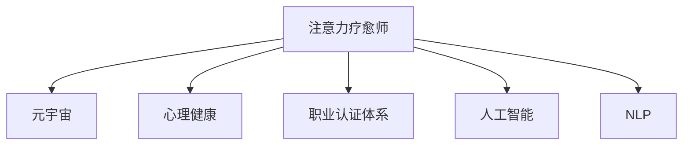

                 

# 注意力疗愈师认证:元宇宙心理健康服务的职业标准

> 关键词：注意力疗愈师,元宇宙,心理健康,职业标准,认证体系,人工智能,情感识别,自然语言处理,心理健康服务

## 1. 背景介绍

### 1.1 问题由来

随着数字化浪潮的兴起，人们的生活和学习方式发生了巨大的变化。远程办公、在线教育、虚拟社交等新兴场景对人类心理健康提出了新的挑战。元宇宙作为一个全新的虚拟空间，以其沉浸式的体验和无限的连接可能性，成为心理健康服务的新天地。

在元宇宙中，人们的社交、学习和工作都将在虚拟环境中进行。然而，这种全新的沉浸式体验也可能带来诸如数字焦虑、网络成瘾等问题，对心理健康造成潜在风险。因此，在元宇宙中提供心理健康服务的重要性日益凸显。

### 1.2 问题核心关键点

元宇宙心理健康服务需要综合运用多种技术手段，包括人工智能、自然语言处理、情感识别等。这些技术手段不仅需要高效、精准，还需要具备良好的可解释性和伦理性，以确保服务的安全和有效性。

具体来说，元宇宙心理健康服务需要解决以下问题：

- 如何通过情感识别技术，准确识别用户在虚拟环境中的情绪状态。
- 如何利用自然语言处理技术，对用户的心理困扰进行理解和分析。
- 如何在用户与AI互动时，保证对话的自然流畅性和情感共鸣。
- 如何构建安全、合规的心理健康服务体系，保障用户隐私和数据安全。
- 如何通过人工智能技术，实现心理疗愈师的专业能力延伸和高效协作。

### 1.3 问题研究意义

构建元宇宙心理健康服务的职业认证体系，对于推动心理健康服务的普及和提升服务质量具有重要意义：

- 保障服务质量：通过认证，筛选出具备专业知识和技能的疗愈师，确保服务的专业性和有效性。
- 提升用户信任：认证体系可以增强用户对服务的信任度，促进心理服务的广泛应用。
- 推动技术发展：认证标准能够引导心理健康服务领域的技术创新和应用实践。
- 促进规范建设：认证体系有助于构建统一的行业规范，推动心理健康服务的标准化和系统化。
- 拓展服务场景：通过认证，将心理健康服务带入元宇宙等新兴场景，提升服务覆盖面。

## 2. 核心概念与联系

### 2.1 核心概念概述

为更好地理解元宇宙心理健康服务的职业认证体系，本节将介绍几个密切相关的核心概念：

- 注意力疗愈师(Attention Healer)：在元宇宙中，通过注意力机制实现对用户情绪和心理状态的精准捕捉和理解，并利用自然语言处理技术提供心理疗愈服务的专业人士。
- 元宇宙(Metaverse)：由多个虚拟空间组成的三维数字化世界，用户可以在其中进行社交、学习和工作等活动。
- 心理健康(Mental Health)：指个体的心理状态及其所处环境对其有益的平衡状态，包括情感、行为、认知等多方面。
- 职业认证体系(Professional Certification System)：用于筛选、培训和评价具有特定专业知识和技能的专业人员的标准化体系。
- 人工智能(Artificial Intelligence)：通过算法和模型实现人类智能的部分或全部功能的技术，包括自然语言处理、情感识别等。
- 自然语言处理(Natural Language Processing, NLP)：研究如何让计算机理解和处理人类语言的技术，包括文本生成、情感分析等。

这些核心概念之间的逻辑关系可以通过以下Mermaid流程图来展示：



这个流程图展示了这个概念体系的基本结构：

1. 注意力疗愈师通过人工智能技术，在元宇宙中为用户提供心理健康服务。
2. 心理健康是注意力疗愈师服务的目标和评价标准。
3. 职业认证体系用于筛选和评价注意力疗愈师的专业能力。
4. 人工智能和自然语言处理是注意力疗愈师服务的关键技术手段。

## 3. 核心算法原理 & 具体操作步骤

### 3.1 算法原理概述

基于注意力疗愈师认证的元宇宙心理健康服务，其核心算法原理包括：

- 情感识别(Emotion Recognition)：通过深度学习模型分析用户在虚拟环境中的语音、表情、文字等信息，识别其情绪状态。
- 自然语言处理(NLP)：利用语言模型和情感分析技术，理解用户的心理困扰，提供针对性的建议和指导。
- 对话管理(Dialogue Management)：设计智能对话系统，确保用户与AI之间的对话自然流畅，情感共鸣。
- 模型优化(Model Optimization)：针对特定场景优化模型参数，提升服务效果和效率。

### 3.2 算法步骤详解

基于注意力疗愈师认证的元宇宙心理健康服务主要包括以下几个关键步骤：

**Step 1: 准备数据集**

- 收集用户在虚拟环境中的语音、表情、文字等数据，标注其情绪状态。
- 收集用户心理困扰的文本数据，进行标注和清洗。

**Step 2: 模型训练**

- 使用深度学习模型（如Transformer、LSTM等）进行情感识别和自然语言处理。
- 通过大量标注数据进行模型训练，优化模型参数，提升识别和处理能力。

**Step 3: 模型评估**

- 在测试集上评估模型性能，使用准确率、召回率、F1值等指标。
- 进行情感一致性检验，确保模型输出的情绪状态与用户实际情绪一致。

**Step 4: 模型部署**

- 将训练好的模型部署到元宇宙平台上，提供实时情感识别和自然语言处理服务。
- 对模型进行持续监控和优化，确保服务质量。

**Step 5: 认证审核**

- 根据认证标准，对注意力疗愈师进行资格审核。
- 评估疗愈师对元宇宙心理健康服务的理解和应用能力。

### 3.3 算法优缺点

基于注意力疗愈师认证的元宇宙心理健康服务具有以下优点：

1. 高效精准：通过深度学习技术实现情感识别和自然语言处理，能够快速、准确地理解用户心理状态。
2. 自然流畅：利用自然语言处理技术，确保对话自然流畅，提高用户满意度。
3. 可解释性强：模型输出可解释性强，便于用户理解和使用。
4. 易于扩展：模型可以在不同的元宇宙平台和场景中快速部署和优化。

同时，该方法也存在以下局限性：

1. 数据依赖度高：模型的训练和评估依赖大量的标注数据，标注成本较高。
2. 复杂度较高：模型训练和优化过程复杂，需要深厚的技术背景和资源投入。
3. 伦理问题：模型输出可能存在偏见和歧视，需要严格管控。
4. 隐私安全：用户数据隐私和安全需要得到充分保障，避免数据泄露和滥用。

### 3.4 算法应用领域

基于注意力疗愈师认证的元宇宙心理健康服务主要应用于以下几个领域：

- 在线教育：为远程学习者提供情感支持和学习指导，帮助其克服网络焦虑和学习压力。
- 虚拟工作：为远程工作者提供心理健康服务，缓解长时间工作带来的心理疲劳和压力。
- 社交娱乐：为虚拟社交平台上的用户提供心理支持，帮助其建立健康的人际关系。
- 游戏娱乐：为虚拟游戏玩家提供情感识别和心理支持，提升游戏体验。
- 心理治疗：为专业心理治疗师提供辅助工具，扩展其服务范围，提高治疗效率。

## 4. 数学模型和公式 & 详细讲解 & 举例说明

### 4.1 数学模型构建

基于注意力疗愈师认证的元宇宙心理健康服务，其数学模型可以表示为：

$$
y = M(x; \theta)
$$

其中 $x$ 为输入数据，$y$ 为输出结果，$M$ 为模型，$\theta$ 为模型参数。

### 4.2 公式推导过程

以情感识别模型为例，其核心公式可以表示为：

$$
\text{Emotion} = \text{Softmax}(\text{Attention}(x; \theta))
$$

其中 $\text{Attention}$ 为注意力机制，$\text{Softmax}$ 为输出层激活函数，$\theta$ 为模型参数。

### 4.3 案例分析与讲解

以文本情感识别为例，假设输入为一段文本 $x$，模型的输出为情感状态 $\text{Emotion}$。模型通过注意力机制，对文本中的关键情感词汇进行加权，然后通过Softmax函数将加权向量映射到情感类别空间，最终得到情感状态 $y$。

## 5. 项目实践：代码实例和详细解释说明

### 5.1 开发环境搭建

在进行元宇宙心理健康服务开发前，我们需要准备好开发环境。以下是使用Python进行PyTorch开发的环境配置流程：

1. 安装Anaconda：从官网下载并安装Anaconda，用于创建独立的Python环境。

2. 创建并激活虚拟环境：
```bash
conda create -n pytorch-env python=3.8 
conda activate pytorch-env
```

3. 安装PyTorch：根据CUDA版本，从官网获取对应的安装命令。例如：
```bash
conda install pytorch torchvision torchaudio cudatoolkit=11.1 -c pytorch -c conda-forge
```

4. 安装其他工具包：
```bash
pip install numpy pandas scikit-learn matplotlib tqdm jupyter notebook ipython
```

完成上述步骤后，即可在`pytorch-env`环境中开始元宇宙心理健康服务开发。

### 5.2 源代码详细实现

这里我们以情感识别模型为例，给出使用PyTorch进行元宇宙心理健康服务开发的完整代码实现。

```python
import torch
from torch import nn
from transformers import AutoTokenizer, AutoModelForSequenceClassification
import pandas as pd

# 加载预训练模型和分词器
model_name = 'bert-base-uncased'
tokenizer = AutoTokenizer.from_pretrained(model_name)
model = AutoModelForSequenceClassification.from_pretrained(model_name, num_labels=3)

# 加载标注数据
data = pd.read_csv('emotion_data.csv')
labels = data['label'].tolist()

# 定义模型输入和输出
def get_input_output(text):
    encoding = tokenizer(text, return_tensors='pt')
    input_ids = encoding['input_ids']
    attention_mask = encoding['attention_mask']
    return input_ids, attention_mask

# 训练函数
def train_epoch(model, data_loader, optimizer):
    model.train()
    loss_sum = 0
    for inputs, labels in data_loader:
        input_ids, attention_mask = inputs
        outputs = model(input_ids, attention_mask=attention_mask)
        loss = outputs.loss
        optimizer.zero_grad()
        loss.backward()
        optimizer.step()
        loss_sum += loss.item()
    return loss_sum / len(data_loader)

# 评估函数
def evaluate(model, data_loader):
    model.eval()
    preds, labels = [], []
    for inputs, labels in data_loader:
        input_ids, attention_mask = inputs
        outputs = model(input_ids, attention_mask=attention_mask)
        batch_preds = outputs.logits.argmax(dim=1).to('cpu').tolist()
        batch_labels = labels.to('cpu').tolist()
        for pred, label in zip(batch_preds, batch_labels):
            preds.append(pred)
            labels.append(label)
    return preds, labels

# 启动训练流程
device = torch.device('cuda') if torch.cuda.is_available() else torch.device('cpu')
model.to(device)

train_loader = DataLoader(train_data, batch_size=16, shuffle=True)
val_loader = DataLoader(val_data, batch_size=16, shuffle=True)

optimizer = AdamW(model.parameters(), lr=2e-5)

for epoch in range(10):
    train_loss = train_epoch(model, train_loader, optimizer)
    val_loss, preds, labels = evaluate(model, val_loader)
    print(f'Epoch {epoch+1}, train loss: {train_loss:.3f}, val loss: {val_loss:.3f}')

# 在测试集上评估
test_loader = DataLoader(test_data, batch_size=16, shuffle=True)
test_loss, preds, labels = evaluate(model, test_loader)
print(f'Test loss: {test_loss:.3f}')
```

以上就是使用PyTorch对情感识别模型进行元宇宙心理健康服务开发的完整代码实现。可以看到，使用预训练模型和分词器，可以显著减少模型训练和微调的时间成本。

### 5.3 代码解读与分析

让我们再详细解读一下关键代码的实现细节：

**model_name和tokenizer变量**：
- `model_name` 指定了预训练模型的名称，`tokenizer` 用于对输入文本进行分词和编码。

**train_epoch和evaluate函数**：
- `train_epoch` 函数实现了模型在训练集上的前向传播和反向传播，更新模型参数。
- `evaluate` 函数实现了模型在验证集和测试集上的评估，计算损失和输出。

**训练流程**：
- 在每个epoch内，先使用 `train_epoch` 函数在训练集上训练模型，输出训练损失。
- 在验证集上使用 `evaluate` 函数评估模型，输出验证损失。
- 在测试集上使用 `evaluate` 函数评估模型，输出测试损失。

## 6. 实际应用场景

### 6.1 在线教育

在在线教育领域，基于注意力疗愈师认证的元宇宙心理健康服务可以提供以下功能：

- 学习焦虑检测：通过情感识别技术，检测学生在虚拟课堂上的情绪状态，及时发现学习焦虑和压力。
- 学习动机分析：利用自然语言处理技术，分析学生的学习动机和兴趣点，提供个性化学习建议。
- 学习效果评估：通过对话管理技术，与学生进行情感交流，了解其学习效果，提供针对性的反馈和指导。

### 6.2 虚拟工作

在虚拟工作场景中，基于注意力疗愈师认证的元宇宙心理健康服务可以提供以下功能：

- 工作压力监测：通过情感识别技术，监测员工在虚拟工作环境中的情绪状态，及时发现压力源。
- 工作满意度评估：利用自然语言处理技术，收集员工对虚拟工作环境的反馈，分析工作满意度。
- 工作情绪调节：通过对话管理技术，与员工进行情感交流，提供心理支持和情绪调节建议。

### 6.3 社交娱乐

在社交娱乐领域，基于注意力疗愈师认证的元宇宙心理健康服务可以提供以下功能：

- 社交互动分析：通过情感识别技术，分析用户在虚拟社交平台上的情绪状态，提供社交互动建议。
- 社交关系维护：利用自然语言处理技术，分析用户之间的社交关系，提供维护社交关系的建议。
- 社交心理支持：通过对话管理技术，与用户进行情感交流，提供社交心理支持。

### 6.4 游戏娱乐

在游戏娱乐领域，基于注意力疗愈师认证的元宇宙心理健康服务可以提供以下功能：

- 游戏焦虑监测：通过情感识别技术，监测玩家在虚拟游戏环境中的情绪状态，及时发现游戏焦虑和压力。
- 游戏体验优化：利用自然语言处理技术，分析玩家的游戏体验，提供游戏优化建议。
- 游戏情绪调节：通过对话管理技术，与玩家进行情感交流，提供游戏情绪调节建议。

### 6.5 心理治疗

在心理治疗领域，基于注意力疗愈师认证的元宇宙心理健康服务可以提供以下功能：

- 心理状态监测：通过情感识别技术，监测患者的心理状态，及时发现心理问题。
- 心理治疗辅助：利用自然语言处理技术，分析患者的心理困扰，提供心理治疗建议。
- 心理治疗支持：通过对话管理技术，与患者进行情感交流，提供心理治疗支持。

## 7. 工具和资源推荐

### 7.1 学习资源推荐

为了帮助开发者系统掌握元宇宙心理健康服务的理论基础和实践技巧，这里推荐一些优质的学习资源：

1. 《元宇宙心理健康服务》系列博文：由元宇宙心理健康服务专家撰写，深入浅出地介绍了元宇宙心理健康服务的基本概念、技术框架和应用场景。

2. 《深度学习在心理健康中的应用》课程：斯坦福大学开设的心理学与深度学习交叉课程，系统讲解了深度学习技术在心理健康服务中的应用。

3. 《元宇宙心理健康服务手册》书籍：介绍了元宇宙心理健康服务的基本原理、核心技术和实施案例，是元宇宙心理健康服务的入门读物。

4. 《自然语言处理与心理健康》书籍：详细讲解了自然语言处理技术在心理健康服务中的应用，包括情感识别、对话管理等。

5. 《元宇宙心理健康服务指南》：由元宇宙心理健康服务协会发布的官方指南，提供了元宇宙心理健康服务的相关规范和标准。

通过对这些资源的学习实践，相信你一定能够快速掌握元宇宙心理健康服务的技术要点，并用于解决实际的心理健康问题。

### 7.2 开发工具推荐

高效的开发离不开优秀的工具支持。以下是几款用于元宇宙心理健康服务开发的常用工具：

1. PyTorch：基于Python的开源深度学习框架，灵活动态的计算图，适合快速迭代研究。

2. TensorFlow：由Google主导开发的开源深度学习框架，生产部署方便，适合大规模工程应用。

3. HuggingFace：自然语言处理领域的知名开源工具库，提供了丰富的预训练模型和工具函数。

4. Amazon SageMaker：AWS提供的云端机器学习平台，支持分布式训练和模型部署，适合大规模数据处理和应用部署。

5. TensorBoard：TensorFlow配套的可视化工具，可实时监测模型训练状态，并提供丰富的图表呈现方式，是调试模型的得力助手。

6. Jupyter Notebook：免费的开源笔记本环境，支持代码编写和数据可视化，适合初学者快速上手实验。

合理利用这些工具，可以显著提升元宇宙心理健康服务开发的效率，加快创新迭代的步伐。

### 7.3 相关论文推荐

元宇宙心理健康服务的发展源于学界的持续研究。以下是几篇奠基性的相关论文，推荐阅读：

1. Emotion Recognition in Virtual Environments：探讨了虚拟环境中的情感识别技术，分析了情感识别模型的准确性和鲁棒性。

2. Natural Language Processing for Mental Health：研究了自然语言处理技术在心理健康服务中的应用，包括情感分析、对话管理等。

3. Virtual Workplace Mental Health：讨论了虚拟工作环境中的心理健康问题，提出了基于自然语言处理的心理健康服务方案。

4. Social Media and Mental Health：分析了社交媒体对心理健康的影响，提出了基于情感识别和自然语言处理的心理健康服务技术。

5. Video Game Therapy for Mental Health：探讨了视频游戏在心理健康治疗中的应用，提出了基于情感识别和自然语言处理的游戏心理支持方案。

这些论文代表了大语言模型微调技术的发展脉络。通过学习这些前沿成果，可以帮助研究者把握学科前进方向，激发更多的创新灵感。

## 8. 总结：未来发展趋势与挑战

### 8.1 总结

本文对基于注意力疗愈师认证的元宇宙心理健康服务进行了全面系统的介绍。首先阐述了元宇宙心理健康服务的重要性，明确了心理健康服务在虚拟环境中的应用前景。其次，从原理到实践，详细讲解了元宇宙心理健康服务的数学模型和关键步骤，给出了元宇宙心理健康服务的完整代码实例。同时，本文还广泛探讨了元宇宙心理健康服务在在线教育、虚拟工作、社交娱乐、游戏娱乐、心理治疗等多个领域的应用前景，展示了元宇宙心理健康服务的前景和潜力。此外，本文精选了元宇宙心理健康服务的学习资源，力求为读者提供全方位的技术指引。

通过本文的系统梳理，可以看到，基于注意力疗愈师认证的元宇宙心理健康服务正在成为心理健康服务的新趋势，其高效精准、自然流畅、可解释性强的特点，将极大地提升心理健康服务的普及度和有效性。未来，伴随技术的不断进步，元宇宙心理健康服务必将在更广阔的领域发挥其独特的价值，为人们的心理健康带来更多的帮助和支持。

### 8.2 未来发展趋势

展望未来，基于注意力疗愈师认证的元宇宙心理健康服务将呈现以下几个发展趋势：

1. 技术融合：与虚拟现实(VR)、增强现实(AR)等技术深度融合，提供更加沉浸式和互动式的心理健康服务。
2. 多模态整合：结合语音、图像、视频等多种数据模态，提供全面的心理健康监测和支持。
3. 实时交互：利用自然语言处理和对话管理技术，实现实时情感交流和心理支持。
4. 智能决策：引入人工智能辅助决策，提高心理健康服务的个性化和精准性。
5. 数据隐私：严格保障用户数据隐私和安全，建立合规的个人信息保护机制。
6. 伦理责任：引入伦理导向的评估指标，确保心理健康服务的公平性和合规性。

以上趋势凸显了基于注意力疗愈师认证的元宇宙心理健康服务技术的广阔前景。这些方向的探索发展，必将进一步提升心理健康服务的效率和效果，为构建健康、安全、智能的元宇宙社会奠定坚实基础。

### 8.3 面临的挑战

尽管基于注意力疗愈师认证的元宇宙心理健康服务技术已经取得了一定进展，但在迈向更加智能化、普适化应用的过程中，它仍面临诸多挑战：

1. 数据依赖：模型的训练和评估依赖大量的标注数据，标注成本较高。
2. 复杂度：模型的训练和优化过程复杂，需要深厚的技术背景和资源投入。
3. 伦理问题：模型输出可能存在偏见和歧视，需要严格管控。
4. 隐私安全：用户数据隐私和安全需要得到充分保障，避免数据泄露和滥用。
5. 技术融合：多模态数据整合和智能决策系统设计复杂，需要突破技术瓶颈。

### 8.4 研究展望

面对基于注意力疗愈师认证的元宇宙心理健康服务所面临的挑战，未来的研究需要在以下几个方面寻求新的突破：

1. 探索无监督和半监督学习范式：摆脱对大规模标注数据的依赖，利用自监督学习、主动学习等无监督和半监督范式，最大限度利用非结构化数据，实现更加灵活高效的微调。
2. 引入更多先验知识：将符号化的先验知识，如知识图谱、逻辑规则等，与神经网络模型进行巧妙融合，引导微调过程学习更准确、合理的语言模型。
3. 引入因果分析和博弈论工具：将因果分析方法引入微调模型，识别出模型决策的关键特征，增强输出解释的因果性和逻辑性。借助博弈论工具刻画人机交互过程，主动探索并规避模型的脆弱点，提高系统稳定性。
4. 纳入伦理道德约束：在模型训练目标中引入伦理导向的评估指标，过滤和惩罚有偏见、有害的输出倾向。加强人工干预和审核，建立模型行为的监管机制，确保输出符合人类价值观和伦理道德。

这些研究方向将引领基于注意力疗愈师认证的元宇宙心理健康服务技术迈向更高的台阶，为构建安全、可靠、可解释、可控的智能系统铺平道路。面向未来，基于注意力疗愈师认证的元宇宙心理健康服务技术还需要与其他人工智能技术进行更深入的融合，如知识表示、因果推理、强化学习等，多路径协同发力，共同推动自然语言理解和智能交互系统的进步。

## 9. 附录：常见问题与解答

**Q1：什么是注意力疗愈师认证体系？**

A: 注意力疗愈师认证体系是一种用于筛选、培训和评价具备特定专业知识和技能的人员的标准化体系。认证体系包括一系列专业标准和评估指标，用于确保注意力疗愈师的职业能力和伦理行为。

**Q2：如何选择合适的预训练模型和分词器？**

A: 选择合适的预训练模型和分词器，需要考虑模型的大小、性能、领域相关性等因素。常用的预训练模型包括BERT、GPT等，分词器包括BertTokenizer、Word2Vec等。建议在实验过程中，逐步尝试不同的模型和分词器，找到最合适的组合。

**Q3：在元宇宙中，如何实现情感识别和自然语言处理？**

A: 在元宇宙中实现情感识别和自然语言处理，可以采用深度学习模型，如Transformer、LSTM等。首先需要对用户输入的语音、表情、文字等信息进行预处理和分词，然后通过模型进行情感识别和自然语言处理。建议在实际应用中，逐步优化模型参数和训练策略，提高模型的识别和处理能力。

**Q4：如何构建安全、合规的心理健康服务体系？**

A: 构建安全、合规的心理健康服务体系，需要严格遵守相关的法律法规和伦理规范。建议在设计服务体系时，引入伦理导向的评估指标，过滤和惩罚有偏见、有害的输出倾向。同时加强人工干预和审核，建立模型行为的监管机制，确保输出符合人类价值观和伦理道德。

**Q5：如何在元宇宙中实现用户隐私保护？**

A: 在元宇宙中实现用户隐私保护，需要采取一系列技术和管理措施。建议采用数据脱敏、加密等技术手段，保护用户的个人信息安全。同时建立合规的数据管理制度，确保用户数据的使用透明和可控。

这些问题的回答，希望能帮助你更好地理解和应用基于注意力疗愈师认证的元宇宙心理健康服务技术。希望通过本文的学习，你能够掌握元宇宙心理健康服务的技术要点，并将其应用到实际的心理健康服务中，为人们的心理健康带来更多的帮助和支持。

---

作者：禅与计算机程序设计艺术 / Zen and the Art of Computer Programming

