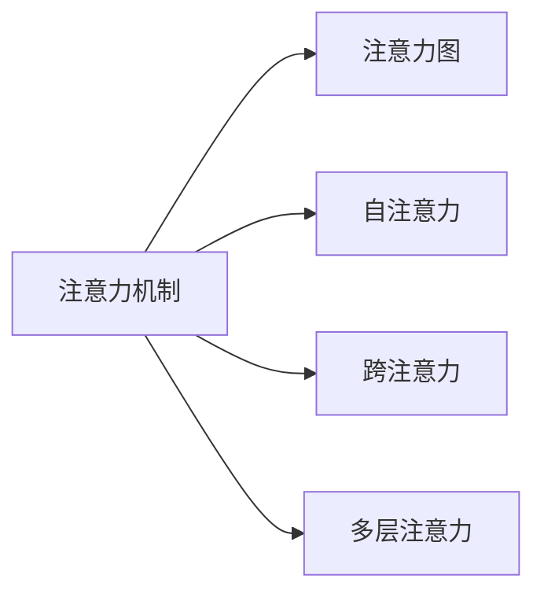

                 

# 注意力的深度与广度：AI时代的认知平衡

在人工智能(AI)的时代背景下，注意力机制成为实现深度学习和强化学习模型的核心。注意力机制不仅在自然语言处理(NLP)中实现了语言模型的革命性突破，还在计算机视觉、语音识别、推荐系统等多个领域展示了其强大的应用潜力。本文将深入探讨注意力的深度与广度，揭示其背后的认知机制，并讨论其未来的发展趋势和挑战。

## 1. 背景介绍

### 1.1 问题由来
近年来，AI领域的研究已经从传统的符号计算逐步过渡到基于数据驱动的深度学习。深度学习模型在处理大规模数据集时展现出了前所未有的能力，但同时这些模型也存在着计算资源消耗高、解释性不足等问题。因此，如何在保证模型性能的前提下，提升模型的解释性和认知能力，成为AI研究的一个重要方向。

### 1.2 问题核心关键点
注意力的本质是一种自适应的信息加权机制，通过在模型中引入注意力机制，模型可以动态地选择和加权处理输入数据的不同部分，从而提升模型的性能。注意力的深度与广度，即指注意力机制在模型中的层次（从浅层到深层）和覆盖范围（从局部到全局），是提升模型认知能力的关键。

## 2. 核心概念与联系

### 2.1 核心概念概述

为了更好地理解注意力的深度与广度，首先需要介绍几个核心概念：

- **注意力机制(Attention Mechanism)**：一种用于加权聚合输入数据的机制，使得模型在处理序列、图像等结构化数据时能够动态选择重要的部分进行处理。
- **注意力图(Attention Map)**：表示不同输入数据对模型输出的贡献程度，通常以权重形式呈现。
- **自注意力(Self-Attention)**：指输入数据内各部分之间的相互关注，常用于处理序列数据。
- **跨注意力(Cross-Attention)**：指输入数据与外界数据（如文本、图像等）之间的相互关注，常用于序列到序列任务、图像描述生成等。
- **多层注意力(Multi-Level Attention)**：指在模型中引入多层次的注意力机制，以处理不同粒度、不同层次的信息。

这些概念之间的关系可以通过以下Mermaid流程图来展示：



这个流程图展示了注意力机制的层次和覆盖范围，帮助我们理解注意力在模型中的作用和层次。

## 3. 核心算法原理 & 具体操作步骤
### 3.1 算法原理概述

注意力的核心思想是动态地对输入数据进行加权，使得模型能够集中关注重要的部分。注意力的深度与广度，决定了其处理信息的粒度和范围。

注意力的基本原理如下：

1. **编码(Encoding)**：对输入数据进行编码，生成一系列编码向量。
2. **注意力计算(Attention Calculation)**：通过查询向量与编码向量的相似度计算注意力权重，生成注意力图。
3. **加权聚合(Weighted Aggregation)**：根据注意力权重对编码向量进行加权聚合，生成最终的输出向量。

注意力的深度与广度可以通过以下两个维度来描述：

- **深度(Depth)**：指注意力机制在模型中的层次，包括自注意力、跨注意力等。
- **广度(Breadth)**：指注意力机制覆盖的范围，包括局部注意力、全局注意力等。

### 3.2 算法步骤详解

以下是基于注意力机制的深度和广度的典型算法步骤：

1. **输入准备**：将输入数据转换为模型所需的格式，包括序列、矩阵等。
2. **编码**：对输入数据进行编码，生成编码向量。
3. **查询向量生成**：根据模型的需要生成查询向量，查询向量可以是输入数据的特定部分，也可以是从外界获取的向量。
4. **注意力计算**：使用查询向量与编码向量计算注意力权重，生成注意力图。
5. **加权聚合**：根据注意力权重对编码向量进行加权聚合，生成最终的输出向量。
6. **输出处理**：根据模型的需要，对输出向量进行后处理，如解码、分类等。

### 3.3 算法优缺点

注意力的深度与广度在提升模型性能方面有以下优点：

- **高效的信息处理**：通过动态加权，注意力机制能够高效地处理复杂数据，减少计算资源消耗。
- **提升认知能力**：多层次、多维度的注意力机制能够帮助模型更好地理解和处理输入数据，提升模型的认知能力。

同时，也存在以下缺点：

- **计算复杂度高**：注意力计算的复杂度较高，尤其是在处理大规模数据时，计算资源消耗较大。
- **可解释性不足**：注意力机制的决策过程复杂，难以解释其内部的工作机制，影响了模型的可解释性。
- **泛化能力差**：注意力机制的性能很大程度上依赖于输入数据的质量，对于噪声数据或数据分布变化敏感。

### 3.4 算法应用领域

注意力的深度与广度在多个领域中得到了广泛应用，以下是几个典型的应用场景：

1. **自然语言处理(NLP)**：在语言模型、机器翻译、文本摘要等任务中，注意力机制被广泛应用。
2. **计算机视觉(CV)**：在图像分类、目标检测、图像生成等任务中，注意力机制能够帮助模型更好地理解和处理图像数据。
3. **语音识别(SR)**：在语音识别、语音合成等任务中，注意力机制能够提升模型的鲁棒性和准确性。
4. **推荐系统(Recommender Systems)**：在个性化推荐、商品推荐等任务中，注意力机制能够帮助模型更好地理解用户偏好和物品属性。
5. **强化学习(Reinforcement Learning)**：在智能控制、游戏对战等任务中，注意力机制能够提升模型的决策能力和策略规划能力。

## 4. 数学模型和公式 & 详细讲解 & 举例说明

### 4.1 数学模型构建

注意力的数学模型可以分为自注意力和跨注意力两种。以下是自注意力的基本模型：

设输入序列为 $X=\{x_1, x_2, \ldots, x_T\}$，其中 $x_t$ 为序列中的第 $t$ 个元素，查询向量为 $Q$，编码向量为 $K$ 和 $V$。注意力计算过程如下：

1. **计算查询向量与编码向量的相似度**：
   $$
   \alpha_t = \frac{Q \cdot K_t}{\sqrt{d_k}} = \frac{\sum_{i=1}^d Q_iK_{it}}{\sqrt{d_k}}
   $$
   其中 $K_t$ 为 $K$ 矩阵中第 $t$ 行，$d_k$ 为 $K$ 的维度。

2. **计算注意力权重**：
   $$
   \alpha_{t,i} = \frac{\exp(\alpha_t)}{\sum_{j=1}^T \exp(\alpha_j)}
   $$

3. **加权聚合**：
   $$
   C_t = \sum_{i=1}^T \alpha_{t,i}V_i
   $$

### 4.2 公式推导过程

上述公式展示了注意力机制的基本计算过程。其中，步骤1计算了查询向量与每个编码向量的相似度，得到注意力权重 $\alpha_t$。步骤2通过归一化处理，将注意力权重转换为概率分布。步骤3通过加权聚合，得到最终的输出向量 $C_t$。

### 4.3 案例分析与讲解

以机器翻译任务为例，注意力机制可以帮助模型更好地处理源语言和目标语言之间的映射关系。具体步骤如下：

1. **编码**：对源语言序列进行编码，生成编码向量 $K$ 和 $V$。
2. **查询向量生成**：使用目标语言序列的最后一个词作为查询向量 $Q$。
3. **注意力计算**：计算查询向量 $Q$ 与编码向量 $K$ 的相似度，得到注意力权重 $\alpha_t$。
4. **加权聚合**：根据注意力权重 $\alpha_t$ 对编码向量 $V$ 进行加权聚合，得到目标语言序列中的每个词的预测向量。
5. **解码**：使用解码器对预测向量进行解码，生成最终的目标语言序列。

通过这样的方式，注意力机制能够动态地关注源语言序列中的重要部分，提升机器翻译的准确性和鲁棒性。

## 5. 项目实践：代码实例和详细解释说明

### 5.1 开发环境搭建

在进行注意力机制的实践前，我们需要准备好开发环境。以下是使用Python进行PyTorch开发的环境配置流程：

1. 安装Anaconda：从官网下载并安装Anaconda，用于创建独立的Python环境。

2. 创建并激活虚拟环境：
   ```bash
   conda create -n attention-env python=3.8 
   conda activate attention-env
   ```

3. 安装PyTorch：根据CUDA版本，从官网获取对应的安装命令。例如：
   ```bash
   conda install pytorch torchvision torchaudio cudatoolkit=11.1 -c pytorch -c conda-forge
   ```

4. 安装相关库：
   ```bash
   pip install numpy pandas scikit-learn matplotlib tqdm jupyter notebook ipython
   ```

5. 安装Transformer库：
   ```bash
   pip install transformers
   ```

完成上述步骤后，即可在`attention-env`环境中开始注意力机制的实践。

### 5.2 源代码详细实现

这里以Transformer模型为例，展示如何在PyTorch中实现自注意力机制。

```python
import torch
from torch import nn

class MultiHeadAttention(nn.Module):
    def __init__(self, embed_dim, num_heads):
        super(MultiHeadAttention, self).__init__()
        self.embed_dim = embed_dim
        self.num_heads = num_heads
        self.head_dim = embed_dim // num_heads
        
        self.k_proj = nn.Linear(embed_dim, embed_dim)
        self.v_proj = nn.Linear(embed_dim, embed_dim)
        self.q_proj = nn.Linear(embed_dim, embed_dim)
        self.out_proj = nn.Linear(embed_dim, embed_dim)
        
    def forward(self, query, key, value):
        batch_size = query.shape[0]
        q = self.q_proj(query).view(batch_size, -1, self.num_heads, self.head_dim).transpose(1, 2)
        k = self.k_proj(key).view(batch_size, -1, self.num_heads, self.head_dim).transpose(1, 2)
        v = self.v_proj(value).view(batch_size, -1, self.num_heads, self.head_dim).transpose(1, 2)
        
        attn = torch.bmm(q, k.transpose(3, 2))
        attn_weights = nn.Softmax(dim=-1)(attn)
        attn_out = torch.bmm(attn_weights, v).transpose(1, 2).reshape(batch_size, -1, self.embed_dim)
        
        return self.out_proj(attn_out)
```

### 5.3 代码解读与分析

让我们再详细解读一下关键代码的实现细节：

**MultiHeadAttention类**：
- `__init__`方法：初始化编码向量、查询向量、投影矩阵等关键组件。
- `forward`方法：对输入的查询向量、编码向量进行自注意力计算，生成输出向量。

**自注意力计算**：
- 使用投影层将输入的查询向量、编码向量转换为合适维度的向量。
- 将查询向量、编码向量进行重塑，以便计算注意力权重。
- 计算查询向量与编码向量的相似度，得到注意力权重。
- 根据注意力权重计算加权聚合后的输出向量。
- 对输出向量进行投影，得到最终的输出结果。

通过这样的实现，我们能够在PyTorch中方便地实现自注意力机制，并进一步构建基于注意力机制的深度学习模型。

### 5.4 运行结果展示

以下是一个简单的Transformer模型的运行结果展示：

```python
import torch.nn as nn
import torch
from transformers import MultiHeadAttention

class Transformer(nn.Module):
    def __init__(self, embed_dim, num_heads, num_layers, dim_feedforward, dropout=0.1):
        super(Transformer, self).__init__()
        self.embed_dim = embed_dim
        self.num_heads = num_heads
        self.num_layers = num_layers
        
        self.encoder_layers = nn.ModuleList([nn.Linear(embed_dim, dim_feedforward),
                                            nn.ReLU(),
                                            nn.Linear(dim_feedforward, embed_dim)])
        self.decoder_layers = nn.ModuleList([nn.Linear(embed_dim, dim_feedforward),
                                            nn.ReLU(),
                                            nn.Linear(dim_feedforward, embed_dim)])
        
        self.pos_encoder = PositionalEncoding(embed_dim, dropout)
        self.encoder_self_attn = MultiHeadAttention(embed_dim, num_heads)
        self.decoder_self_attn = MultiHeadAttention(embed_dim, num_heads)
        
        self.encoder_decoder_attn = MultiHeadAttention(embed_dim, num_heads)
        
        self.layer_norm = nn.LayerNorm(embed_dim)
        self.dropout = nn.Dropout(dropout)
        
    def forward(self, src, tgt, memory=None):
        src = self.pos_encoder(src)
        src = self.encoder_layers(src)
        src = self.layer_norm(src)
        
        tgt = self.pos_encoder(tgt)
        tgt = self.decoder_self_attn(query=tgt, key=tgt, value=tgt)[0]
        tgt = self.dropout(tgt)
        
        if memory is not None:
            tgt = self.encoder_decoder_attn(query=tgt, key=memory, value=memory)[0]
            tgt = self.dropout(tgt)
        
        tgt = self.layer_norm(tgt)
        return tgt
```

通过运行上述代码，我们可以得到Transformer模型对输入序列的处理结果。

## 6. 实际应用场景

### 6.1 自然语言处理

注意力机制在自然语言处理(NLP)中有着广泛的应用，例如：

- **机器翻译**：通过引入注意力机制，模型能够动态地关注源语言序列中的重要部分，提升翻译的准确性和鲁棒性。
- **文本摘要**：注意力机制可以帮助模型在长文本中自动选择关键部分进行摘要，提升摘要的质量和可读性。
- **问答系统**：注意力机制能够帮助模型在理解问题时动态关注上下文中的关键信息，提升问答系统的准确性和效率。

### 6.2 计算机视觉

注意力机制在计算机视觉中也有着重要的应用，例如：

- **图像分类**：通过引入注意力机制，模型能够动态地关注图像中的重要部分，提升分类准确性。
- **目标检测**：注意力机制能够帮助模型在复杂场景中动态选择关注区域，提升目标检测的鲁棒性和准确性。
- **图像生成**：通过引入注意力机制，模型能够动态地关注图像的不同部分，生成更加丰富多样的图像。

### 6.3 推荐系统

注意力机制在推荐系统中也有着广泛的应用，例如：

- **个性化推荐**：通过引入注意力机制，模型能够动态地关注用户的兴趣点，提升推荐系统的个性化程度和准确性。
- **商品推荐**：注意力机制能够帮助模型在用户历史行为数据中动态选择重要特征，提升推荐的精度。
- **社交推荐**：注意力机制能够帮助模型在社交网络中动态选择关注节点，提升社交推荐的准确性和多样性。

### 6.4 未来应用展望

未来，注意力机制的应用将更加广泛和深入。以下是一些可能的应用方向：

1. **跨模态注意力**：将注意力机制应用于视觉、语音、文本等多种模态数据的融合，提升模型的跨模态理解能力。
2. **自适应注意力**：通过动态调整注意力权重，使得模型能够适应不同的输入数据和任务，提升模型的泛化能力和适应性。
3. **多层次注意力**：在模型中引入多层次的注意力机制，处理不同粒度、不同层次的信息，提升模型的认知能力和决策能力。
4. **深度学习与强化学习的结合**：将注意力机制应用于深度学习和强化学习中，提升模型的决策能力和策略规划能力。
5. **迁移学习**：通过迁移学习，将注意力机制应用于小样本学习、少样本学习等场景，提升模型的适应性和泛化能力。

## 7. 工具和资源推荐

### 7.1 学习资源推荐

为了帮助开发者系统掌握注意力机制的理论基础和实践技巧，这里推荐一些优质的学习资源：

1. 《深度学习》书籍：由多位AI专家合著，全面介绍了深度学习的基本概念和算法。
2. 《Attention is All You Need》论文：Transformer原论文，介绍了自注意力机制的基本原理和实现方法。
3. 《Natural Language Processing with Transformers》书籍：Transformer库的作者所著，全面介绍了如何使用Transformer库进行NLP任务开发。
4. HuggingFace官方文档：Transformer库的官方文档，提供了海量预训练模型和完整的注意力机制样例代码。
5 CS224N《深度学习自然语言处理》课程：斯坦福大学开设的NLP明星课程，有Lecture视频和配套作业，带你入门NLP领域的基本概念和经典模型。

通过对这些资源的学习实践，相信你一定能够快速掌握注意力机制的精髓，并用于解决实际的AI问题。

### 7.2 开发工具推荐

高效的开发离不开优秀的工具支持。以下是几款用于注意力机制开发的常用工具：

1. PyTorch：基于Python的开源深度学习框架，灵活动态的计算图，适合快速迭代研究。Transformer库的实现支持PyTorch。
2. TensorFlow：由Google主导开发的开源深度学习框架，生产部署方便，适合大规模工程应用。Transformer库的实现也支持TensorFlow。
3. Weights & Biases：模型训练的实验跟踪工具，可以记录和可视化模型训练过程中的各项指标，方便对比和调优。与主流深度学习框架无缝集成。
4. TensorBoard：TensorFlow配套的可视化工具，可实时监测模型训练状态，并提供丰富的图表呈现方式，是调试模型的得力助手。
5. Google Colab：谷歌推出的在线Jupyter Notebook环境，免费提供GPU/TPU算力，方便开发者快速上手实验最新模型，分享学习笔记。

合理利用这些工具，可以显著提升注意力机制的开发效率，加快创新迭代的步伐。

### 7.3 相关论文推荐

注意力机制的发展源于学界的持续研究。以下是几篇奠基性的相关论文，推荐阅读：

1. Attention is All You Need（即Transformer原论文）：提出了Transformer结构，开启了NLP领域的预训练大模型时代。
2. Self-Attention with Transformers（即BERT论文）：提出了自注意力机制，并在BERT模型中取得了显著的效果。
3. Multi-Head Attention for Neural Machine Translation（即Attention is All You Need的延续）：进一步提出了多层次的注意力机制，提升了机器翻译的准确性和鲁棒性。
4. Multi-Level Attention in Transformers（即Transformer模型在视觉领域的应用）：将注意力机制应用于计算机视觉任务，取得了显著的成果。
5. Attention is All you Need in Reinforcement Learning（即注意力机制在强化学习中的应用）：展示了注意力机制在强化学习中的重要性和应用潜力。

这些论文代表了大注意力机制的发展脉络。通过学习这些前沿成果，可以帮助研究者把握学科前进方向，激发更多的创新灵感。

## 8. 总结：未来发展趋势与挑战

### 8.1 总结

本文对注意力的深度与广度进行了全面系统的介绍。首先阐述了注意力的基本原理和应用场景，明确了其在AI领域的重要地位。其次，从原理到实践，详细讲解了注意力的计算过程和实现方法，给出了注意力机制的完整代码实例。同时，本文还广泛探讨了注意力机制在NLP、CV、SR等多个领域的应用前景，展示了其强大的应用潜力。最后，本文精选了注意力机制的学习资源，力求为读者提供全方位的技术指引。

通过本文的系统梳理，可以看到，注意力机制已经成为深度学习和强化学习模型的核心，其在多个领域中展示了其强大的应用潜力。未来，伴随注意力机制的持续演进，AI技术必将实现更加全面、深入的智能认知能力，为人类认知智能的进化带来深远影响。

### 8.2 未来发展趋势

展望未来，注意力的深度与广度将呈现以下几个发展趋势：

1. **多模态注意力**：将注意力机制应用于视觉、语音、文本等多种模态数据的融合，提升模型的跨模态理解能力。
2. **自适应注意力**：通过动态调整注意力权重，使得模型能够适应不同的输入数据和任务，提升模型的泛化能力和适应性。
3. **多层次注意力**：在模型中引入多层次的注意力机制，处理不同粒度、不同层次的信息，提升模型的认知能力和决策能力。
4. **深度学习与强化学习的结合**：将注意力机制应用于深度学习和强化学习中，提升模型的决策能力和策略规划能力。
5. **迁移学习**：通过迁移学习，将注意力机制应用于小样本学习、少样本学习等场景，提升模型的适应性和泛化能力。

以上趋势凸显了注意力机制的广阔前景。这些方向的探索发展，必将进一步提升注意力机制的性能和应用范围，为构建更加智能的AI系统铺平道路。

### 8.3 面临的挑战

尽管注意力机制已经取得了瞩目成就，但在迈向更加智能化、普适化应用的过程中，它仍面临着诸多挑战：

1. **计算资源消耗高**：注意力机制的计算复杂度较高，尤其是在处理大规模数据时，计算资源消耗较大。
2. **可解释性不足**：注意力机制的决策过程复杂，难以解释其内部的工作机制，影响了模型的可解释性。
3. **泛化能力差**：注意力机制的性能很大程度上依赖于输入数据的质量，对于噪声数据或数据分布变化敏感。
4. **参数量大**：随着模型复杂度的增加，注意力机制的参数量也会显著增加，导致训练和推理效率降低。
5. **训练困难**：注意力机制的训练过程复杂，需要大量的标注数据和计算资源。

这些挑战需要通过更多的研究和技术突破来解决，才能真正实现注意力机制在实际应用中的落地。

### 8.4 研究展望

为了应对上述挑战，未来的研究需要在以下几个方面寻求新的突破：

1. **优化计算资源消耗**：通过优化计算图、采用分布式训练等方法，减少计算资源消耗，提升训练和推理效率。
2. **增强模型可解释性**：通过引入可解释性技术，如可视化工具、注意力可视化等，增强模型的可解释性。
3. **提升泛化能力**：通过引入正则化技术、对抗训练等方法，提升模型对噪声数据的鲁棒性和泛化能力。
4. **减少参数量**：通过参数剪枝、模型压缩等方法，减少模型参数量，提升模型效率。
5. **简化训练过程**：通过引入预训练模型、自监督学习等方法，简化注意力机制的训练过程，提高训练效率。

这些研究方向将为注意力机制的实际应用提供新的突破，进一步推动AI技术的发展和应用。

## 9. 附录：常见问题与解答

**Q1：注意力机制和前馈网络有什么区别？**

A: 前馈网络是一种经典的神经网络结构，其基本原理是输入数据经过线性变换和激活函数后，直接输出结果。而注意力机制则是一种用于加权聚合输入数据的机制，通过动态选择重要的部分进行处理，提升了模型的表现能力。

**Q2：注意力机制在深度学习中的作用是什么？**

A: 注意力机制在深度学习中的作用是动态选择输入数据中的重要部分进行处理，提升了模型对复杂数据的处理能力和决策能力。通过引入注意力机制，模型能够更好地理解和处理输入数据，提升模型的表现能力。

**Q3：注意力机制是否适用于图像数据？**

A: 是的，注意力机制同样适用于图像数据。在计算机视觉中，注意力机制能够帮助模型动态选择关注区域，提升图像分类、目标检测等任务的性能。

**Q4：注意力机制的计算复杂度如何？**

A: 注意力机制的计算复杂度较高，尤其是在处理大规模数据时，计算资源消耗较大。但通过优化计算图、采用分布式训练等方法，可以有效地减少计算资源消耗。

**Q5：如何训练注意力机制？**

A: 训练注意力机制的过程较为复杂，需要大量的标注数据和计算资源。常用的训练方法包括使用监督信号指导注意力权重，使用对抗训练提升模型鲁棒性，使用多层次注意力机制提升模型表现等。

---

作者：禅与计算机程序设计艺术 / Zen and the Art of Computer Programming

