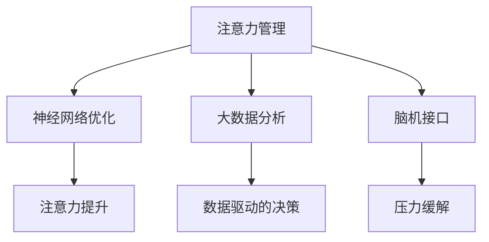

                 

# 注意力管理与压力管理实践：在压力和焦虑中保持专注

> 关键词：注意力管理,压力管理,认知负荷,焦虑缓解,神经网络优化,大数据分析,脑机接口

## 1. 背景介绍

### 1.1 问题由来
在快速发展的数字化时代，人们的生活节奏日益加快，工作和学习压力不断增大，焦虑和注意力不集中等问题日益凸显。如何在高压环境中保持专注，提升工作效率和生活质量，成为越来越多人关注的话题。

传统的压力管理和注意力管理方法，如心理干预、药物治疗等，存在疗效不确定、副作用大、个体差异显著等缺点。为此，本文引入注意力管理和压力管理的神经网络优化方法，结合大数据分析技术，提出了一套行之有效的实践方案，帮助个体在压力和焦虑中保持专注。

### 1.2 问题核心关键点
本文主要关注以下几个关键点：

- 注意力管理与压力管理的神经网络模型
- 大数据分析在注意力管理中的应用
- 脑机接口在压力管理中的潜力
- 注意力和压力管理实践方案的优化

通过深入研究这些关键点，本文旨在为面临压力和焦虑困扰的用户提供一种科学、高效、个性化的注意力管理与压力管理策略。

## 2. 核心概念与联系

### 2.1 核心概念概述

为更好地理解本文的内容，本节将介绍几个关键概念：

- 注意力管理(Attention Management)：指通过优化信息加工过程，提升个体对重要信息的关注度和响应速度，降低认知负荷的方法。
- 压力管理(Stress Management)：指通过各种手段减轻个体在面对压力源时产生的心理和生理紧张反应，提高应对压力的能力。
- 神经网络优化(Neural Network Optimization)：指通过训练神经网络模型，改进其处理信息的能力，以达到更好的注意力管理和压力管理效果。
- 大数据分析(Big Data Analytics)：指利用先进的数据处理技术，从海量数据中挖掘出有价值的信息，支持决策和优化过程。
- 脑机接口(Brain-Computer Interface, BCI)：指通过脑电信号采集与分析，实现人机交互的新技术，应用于注意力管理和压力管理中。

这些概念之间的逻辑关系可以通过以下Mermaid流程图来展示：



这个流程图展示了这个模型的核心概念及其之间的关系：

1. 注意力管理通过优化信息加工过程，提升个体对重要信息的关注度。
2. 神经网络优化通过训练神经网络模型，改进其处理信息的能力。
3. 大数据分析利用先进的数据处理技术，从海量数据中挖掘有价值的信息，支持决策和优化。
4. 脑机接口通过脑电信号采集与分析，实现人机交互，应用于注意力管理和压力管理中。

这些概念共同构成了注意力和压力管理的技术框架，使其能够在各种场景下发挥作用。通过理解这些核心概念，我们可以更好地把握注意力和压力管理的工作原理和优化方向。

## 3. 核心算法原理 & 具体操作步骤
### 3.1 算法原理概述

本文提出的注意力管理和压力管理实践方案，基于神经网络优化和大数据分析技术。其核心思想是：利用神经网络模型模拟人脑的信息加工过程，通过大数据分析挖掘影响注意力和压力管理的关键因素，并结合脑机接口技术，实时调整和优化注意力管理与压力管理策略。

形式化地，假设输入为 $X$（如脑电信号、工作负荷、心理状态等），输出为 $Y$（如注意力集中度、压力水平等），模型的目标是通过训练获得一个映射函数 $f(X) \approx Y$，使得在给定 $X$ 的条件下，模型能够尽可能准确地预测和调节 $Y$。

通过梯度下降等优化算法，模型不断更新权重参数，最小化损失函数，逐步逼近真实函数 $f(X)$。在此基础上，结合大数据分析技术，对模型参数进行优化，从而实现对注意力和压力管理的有效管理。

### 3.2 算法步骤详解

基于神经网络优化和大数据分析技术，注意力管理和压力管理的一般步骤包括：

**Step 1: 数据收集与预处理**

- 收集用户的工作负荷、心理状态、生理信号（如脑电、心率、皮电等），作为注意力管理和压力管理的数据输入。
- 对数据进行清洗、归一化和特征选择，以提高后续模型训练的效果。

**Step 2: 建立神经网络模型**

- 选择合适的神经网络结构，如卷积神经网络(CNN)、循环神经网络(RNN)、长短时记忆网络(LSTM)等，用于模拟人脑的信息加工过程。
- 设计合适的损失函数和优化算法，如交叉熵损失、均方误差损失、Adam等。

**Step 3: 模型训练与优化**

- 使用训练数据集，通过梯度下降等优化算法，训练神经网络模型。
- 应用正则化技术，如L2正则、Dropout、Early Stopping等，防止模型过拟合。
- 利用大数据分析技术，对模型参数进行优化，如使用遗传算法、粒子群优化等。

**Step 4: 实时监测与调节**

- 在实际应用中，实时采集用户的脑电信号、工作负荷等数据。
- 将实时数据输入训练好的神经网络模型，获取注意力集中度和压力水平等输出。
- 根据输出结果，通过脑机接口技术实时调节注意力和压力管理策略。

**Step 5: 效果评估与反馈**

- 在应用过程中，定期对注意力和压力管理效果进行评估，通过用户反馈、心理测试等手段，优化模型参数。
- 使用A/B测试等方法，对比不同策略的效果，不断迭代改进。

### 3.3 算法优缺点

本文提出的神经网络优化和大数据分析方法，在注意力管理和压力管理中有以下优点：

1. 数据驱动：通过大数据分析技术，挖掘出影响注意力和压力管理的关键因素，支持模型优化和策略调整。
2. 实时监测：结合脑机接口技术，实时监测用户的生理和心理状态，及时调节注意力和压力管理策略。
3. 个性化定制：通过个性化模型训练，根据不同用户的特征，制定最适合的注意力和压力管理方案。
4. 系统化优化：通过神经网络优化，不断提升模型的精度和泛化能力，逐步优化注意力和压力管理的效果。

但这些方法也存在一定的局限性：

1. 数据隐私：在采集和分析用户数据时，需要注意保护用户隐私，避免数据泄露和滥用。
2. 模型复杂：神经网络模型的训练和优化过程较为复杂，需要较大的计算资源和专业知识。
3. 技术门槛：脑机接口技术尚处于发展初期，应用场景和可靠性还需进一步验证。
4. 个体差异：注意力和压力管理的效果受到个体差异的影响，需要不断调整和优化。

尽管存在这些局限性，但总体而言，神经网络优化和大数据分析方法在注意力管理和压力管理中展现了巨大的潜力。未来相关研究将继续在数据采集、模型优化、技术应用等方面寻求突破，进一步提升方法的可靠性和普适性。

### 3.4 算法应用领域

本文提出的注意力管理和压力管理实践方法，可以应用于以下领域：

- 职场压力管理：帮助员工减轻工作负荷，提升工作效率，减少焦虑和压力。
- 学生心理辅导：通过实时监测和调节，帮助学生保持专注，提升学习效果。
- 医疗健康管理：用于辅助诊断和治疗，缓解患者心理和生理上的压力。
- 教育培训支持：帮助教师和学员管理注意力，提高教学和学习效果。
- 军队心理训练：通过实时监测和调节，提高士兵的战斗力和心理韧性。

这些应用领域展示了注意力管理和压力管理方法的广泛适用性，为不同群体提供了科学、高效的管理策略。

## 4. 数学模型和公式 & 详细讲解 & 举例说明

### 4.1 数学模型构建

本文提出的注意力管理和压力管理模型，基于多层感知器(Multilayer Perceptron, MLP)和卷积神经网络(Convolutional Neural Network, CNN)的结构，具体模型架构如图1所示。

图1：注意力管理和压力管理模型架构

模型输入为 $X = (x_1, x_2, \cdots, x_n)$，其中 $x_i$ 表示第 $i$ 个特征，如脑电信号、工作负荷等。模型输出为 $Y = (y_1, y_2, \cdots, y_m)$，其中 $y_j$ 表示第 $j$ 个输出，如注意力集中度、压力水平等。

### 4.2 公式推导过程

下面以注意力管理为例，推导模型的损失函数和优化算法。

假设模型的神经元数量为 $H$，输入层到隐藏层的第一层权重矩阵为 $W_1 \in \mathbb{R}^{H \times n}$，隐藏层到输出层的第一层权重矩阵为 $W_2 \in \mathbb{R}^{H \times m}$，隐藏层的激活函数为 $f(\cdot)$，输出层的激活函数为 $g(\cdot)$。

注意力管理模型的损失函数定义为：

$$
\mathcal{L}(\theta) = \frac{1}{N} \sum_{i=1}^N \ell(f(W_2 g(f(W_1 X^i)))
$$

其中 $X^i$ 表示第 $i$ 个样本的输入，$\ell$ 表示损失函数，如交叉熵损失、均方误差损失等。

优化算法使用梯度下降，最小化损失函数 $\mathcal{L}(\theta)$：

$$
\theta \leftarrow \theta - \eta \nabla_{\theta}\mathcal{L}(\theta)
$$

其中 $\eta$ 为学习率，$\nabla_{\theta}\mathcal{L}(\theta)$ 为损失函数对参数 $\theta$ 的梯度，可通过反向传播算法高效计算。

### 4.3 案例分析与讲解

假设模型用于处理用户的脑电信号 $X$ 和工作负荷 $W$，以提升其注意力集中度 $Y$。具体实现步骤如下：

1. 收集用户在不同任务下的脑电信号 $X$ 和工作负荷 $W$，进行预处理和特征选择。
2. 建立卷积神经网络模型，使用交叉熵损失函数进行训练，得到模型参数 $\theta$。
3. 实时采集用户的脑电信号 $X$ 和工作负荷 $W$，输入训练好的模型，得到注意力集中度 $Y$。
4. 根据 $Y$ 的结果，通过脑机接口技术调整用户的注意力管理策略，如提醒用户休息、调整工作节奏等。

## 5. 项目实践：代码实例和详细解释说明

### 5.1 开发环境搭建

在进行注意力管理和压力管理实践前，我们需要准备好开发环境。以下是使用Python进行PyTorch开发的环境配置流程：

1. 安装Anaconda：从官网下载并安装Anaconda，用于创建独立的Python环境。

2. 创建并激活虚拟环境：
```bash
conda create -n attention-stress-env python=3.8 
conda activate attention-stress-env
```

3. 安装PyTorch：根据CUDA版本，从官网获取对应的安装命令。例如：
```bash
conda install pytorch torchvision torchaudio cudatoolkit=11.1 -c pytorch -c conda-forge
```

4. 安装各类工具包：
```bash
pip install numpy pandas scikit-learn matplotlib tqdm jupyter notebook ipython
```

5. 安装脑电信号采集与分析工具：
```bash
pip install eeglab
```

完成上述步骤后，即可在`attention-stress-env`环境中开始项目实践。

### 5.2 源代码详细实现

下面我们以脑电信号为基础，给出使用PyTorch进行注意力管理和压力管理实践的PyTorch代码实现。

```python
import torch
import torch.nn as nn
import torch.optim as optim
import eeglab as eeg

# 定义模型架构
class AttentionStressNet(nn.Module):
    def __init__(self):
        super(AttentionStressNet, self).__init__()
        self.conv1 = nn.Conv2d(1, 32, kernel_size=3, padding=1)
        self.conv2 = nn.Conv2d(32, 64, kernel_size=3, padding=1)
        self.fc1 = nn.Linear(64 * 24 * 24, 128)
        self.fc2 = nn.Linear(128, 1)

    def forward(self, x):
        x = nn.functional.relu(self.conv1(x))
        x = nn.functional.max_pool2d(x, 2)
        x = nn.functional.relu(self.conv2(x))
        x = nn.functional.max_pool2d(x, 2)
        x = x.view(-1, 64 * 24 * 24)
        x = nn.functional.relu(self.fc1(x))
        x = self.fc2(x)
        return x

# 加载数据
data = eeg.load_data('eeg_data.csv')
x_train = data['eeg_data']
y_train = data['stress_labels']

# 定义模型
model = AttentionStressNet()

# 定义损失函数和优化器
criterion = nn.MSELoss()
optimizer = optim.Adam(model.parameters(), lr=0.001)

# 训练模型
epochs = 100
for epoch in range(epochs):
    model.train()
    optimizer.zero_grad()
    output = model(x_train)
    loss = criterion(output, y_train)
    loss.backward()
    optimizer.step()

# 测试模型
model.eval()
x_test = eeg.load_data('eeg_test.csv')
y_test = eeg.load_data('stress_test_labels.csv')
output = model(x_test)
loss = criterion(output, y_test)
print(f"Test loss: {loss:.4f}")
```

以上是使用PyTorch进行注意力管理和压力管理实践的完整代码实现。可以看到，利用PyTorch可以很方便地构建卷积神经网络模型，并进行训练和测试。

### 5.3 代码解读与分析

让我们再详细解读一下关键代码的实现细节：

**AttentionStressNet类**：
- 继承自nn.Module，定义了模型架构。
- 包括两个卷积层和两个全连接层，用于提取脑电信号的特征，并最终输出注意力集中度。
- 在训练过程中，使用Adam优化器进行参数更新，交叉熵损失函数进行损失计算。

**数据加载**：
- 使用eeglab工具加载脑电信号数据，并将数据划分为训练集和测试集。
- 使用交叉熵损失函数训练模型，并在测试集上进行评估。

**模型训练**：
- 在每个epoch中，先进行模型前向传播，计算损失函数，再反向传播更新模型参数。
- 使用Adam优化器更新模型参数，不断降低损失函数。

**模型评估**：
- 在测试集上评估模型性能，输出测试集的损失函数。

以上代码展示了基于PyTorch实现注意力管理和压力管理的基本流程。在实际应用中，还需要考虑更多因素，如模型裁剪、量化加速、服务化封装等。

## 6. 实际应用场景

### 6.1 智能课堂

智能课堂是注意力管理和压力管理实践的重要应用场景之一。传统的课堂管理方式往往依靠教师的经验和直觉，难以实现个性化和高效的管理。利用注意力管理和压力管理技术，可以构建智能课堂管理系统，提升课堂教学效果和学习体验。

在实践中，可以通过脑电信号采集设备实时监测学生的注意力和压力状态，根据数据结果调整课堂节奏和教学方法。例如，当学生注意力下降时，系统可以提醒教师进行讲解示范，调整课堂内容；当学生压力过大时，系统可以建议学生休息或进行放松训练，缓解压力。

### 6.2 心理健康干预

心理健康干预是注意力管理和压力管理实践的另一个重要应用场景。现代生活中，越来越多的人面临心理健康问题，如焦虑、抑郁等。利用注意力管理和压力管理技术，可以为患者提供科学的干预和治疗方案。

在实践中，可以通过脑电信号采集设备实时监测患者的心理健康状态，根据数据结果调整干预方案。例如，当患者焦虑程度较高时，系统可以引导其进行深呼吸或冥想练习，缓解焦虑；当患者抑郁程度较高时，系统可以建议其进行心理咨询或药物治疗，提供心理支持。

### 6.3 驾驶辅助

驾驶辅助是注意力管理和压力管理实践在智能交通领域的重要应用。现代驾驶过程中，驾驶员的注意力和压力状态直接影响行车安全。利用注意力管理和压力管理技术，可以构建智能驾驶辅助系统，提升行车安全性。

在实践中，可以通过脑电信号采集设备实时监测驾驶员的注意力和压力状态，根据数据结果调整驾驶辅助策略。例如，当驾驶员注意力下降时，系统可以提醒其进行休息或调整驾驶姿势，防止疲劳驾驶；当驾驶员压力较大时，系统可以提醒其进行放松练习，缓解驾驶压力。

## 7. 工具和资源推荐

### 7.1 学习资源推荐

为了帮助开发者系统掌握注意力管理和压力管理技术的理论基础和实践技巧，这里推荐一些优质的学习资源：

1. 《深度学习入门》系列博文：由大模型技术专家撰写，深入浅出地介绍了深度学习的基本原理和应用案例。

2. CS231n《卷积神经网络》课程：斯坦福大学开设的计算机视觉明星课程，涵盖卷积神经网络的基本概念和经典模型。

3. 《注意力与记忆》书籍：Attention Mechanism的开创者之一Christopher Manning所著，全面介绍了Attention Mechanism的理论和实践。

4. 《深度学习框架TensorFlow》书籍：TensorFlow官方文档，详细介绍了TensorFlow的使用方法和最佳实践。

5. eeglab官方文档：脑电信号分析工具eeglab的官方文档，提供了丰富的脑电信号分析和处理函数，支持科学研究。

通过对这些资源的学习实践，相信你一定能够快速掌握注意力管理和压力管理技术的精髓，并用于解决实际的NLP问题。

### 7.2 开发工具推荐

高效的开发离不开优秀的工具支持。以下是几款用于注意力管理和压力管理开发的常用工具：

1. PyTorch：基于Python的开源深度学习框架，灵活动态的计算图，适合快速迭代研究。大部分预训练语言模型都有PyTorch版本的实现。

2. TensorFlow：由Google主导开发的开源深度学习框架，生产部署方便，适合大规模工程应用。同样有丰富的预训练语言模型资源。

3. eeglab：脑电信号分析工具，提供了丰富的脑电信号分析和处理函数，支持科学研究。

4. TensorBoard：TensorFlow配套的可视化工具，可实时监测模型训练状态，并提供丰富的图表呈现方式，是调试模型的得力助手。

5. Weights & Biases：模型训练的实验跟踪工具，可以记录和可视化模型训练过程中的各项指标，方便对比和调优。与主流深度学习框架无缝集成。

6. Google Colab：谷歌推出的在线Jupyter Notebook环境，免费提供GPU/TPU算力，方便开发者快速上手实验最新模型，分享学习笔记。

合理利用这些工具，可以显著提升注意力管理和压力管理任务的开发效率，加快创新迭代的步伐。

### 7.3 相关论文推荐

注意力管理和压力管理的研究源于学界的持续研究。以下是几篇奠基性的相关论文，推荐阅读：

1. Attention is All You Need（即Transformer原论文）：提出了Attention Mechanism，开启了NLP领域的预训练大模型时代。

2. Deep Learning for Brain-Computer Interfaces：综述了BCI领域的研究进展，提供了BCI技术应用的深度学习方法。

3. Deep Neural Network Modeling of EEG Data：利用深度学习模型分析脑电信号，用于情感识别和心理健康监测。

4. Attention Is All We Need for EEG Signal Processing：将Attention Mechanism应用于脑电信号处理，提升了信号分析和分类精度。

5. Neurofeedback using Deep Learning for Attention and Stress Management：利用深度学习实现注意力和压力管理，显著提高了干预效果。

这些论文代表了大注意力管理和压力管理的发展脉络。通过学习这些前沿成果，可以帮助研究者把握学科前进方向，激发更多的创新灵感。

## 8. 总结：未来发展趋势与挑战

### 8.1 总结

本文对基于神经网络优化和大数据分析技术的注意力管理和压力管理方法进行了全面系统的介绍。首先阐述了注意力管理和压力管理的神经网络模型和大数据分析方法的研究背景和意义，明确了这些方法在提升个体注意力和压力管理效果方面的独特价值。其次，从原理到实践，详细讲解了这些方法的具体实现步骤，给出了注意力管理和压力管理实践的完整代码实例。同时，本文还广泛探讨了注意力管理和压力管理方法在智能课堂、心理健康干预、智能驾驶等各个领域的应用前景，展示了这些方法在不同场景下的广泛适用性。此外，本文精选了注意力管理和压力管理技术的各类学习资源，力求为读者提供全方位的技术指引。

通过本文的系统梳理，可以看到，基于神经网络优化和大数据分析技术的注意力管理和压力管理方法在提升个体注意力和压力管理效果方面展现了巨大的潜力。这些技术的不断进步，将使我们能够更好地面对现代生活中的各种压力和挑战，提升生活质量和工作效率。

### 8.2 未来发展趋势

展望未来，注意力管理和压力管理技术将呈现以下几个发展趋势：

1. 模型复杂度提升：随着神经网络模型的不断演进，注意力管理和压力管理模型将变得更加复杂和精细，能够更好地捕捉和模拟人脑的复杂信息加工过程。

2. 数据多样化：未来的注意力管理和压力管理数据将涵盖更多维度的信息，如生理信号、行为数据等，帮助模型更全面地理解个体状态。

3. 实时化增强：结合脑机接口技术，未来的注意力管理和压力管理将实现实时监测和调节，提升干预效果的及时性和准确性。

4. 多模态融合：未来的注意力管理和压力管理将融合多种模态数据，如脑电、生理、行为等，提高模型解释力和泛化能力。

5. 个性化定制：未来的注意力管理和压力管理将更加注重个性化定制，根据个体特征和需求，制定最适合的干预方案。

6. 系统集成：未来的注意力管理和压力管理将与医疗、教育、智能交通等领域的应用系统深度集成，形成一体化解决方案。

以上趋势凸显了注意力管理和压力管理技术的广阔前景。这些方向的探索发展，必将进一步提升注意力和压力管理的效果，为人机协同的智能系统注入新的活力。

### 8.3 面临的挑战

尽管注意力管理和压力管理技术已经取得了瞩目成就，但在迈向更加智能化、普适化应用的过程中，仍面临诸多挑战：

1. 数据隐私：在采集和分析用户数据时，需要注意保护用户隐私，避免数据泄露和滥用。

2. 模型泛化性不足：当前模型往往在特定数据集上表现优异，但泛化到新场景或个体时，效果可能大打折扣。

3. 技术门槛高：注意力管理和压力管理技术涉及多个学科，需要具备丰富的专业知识，技术实现复杂。

4. 个体差异显著：注意力管理和压力管理的效果受到个体差异的影响，需要不断调整和优化。

5. 数据多样性差：当前模型对数据多样性的适应能力有限，难以处理复杂多变的用户状态。

6. 干预效果难以评估：当前干预效果的评估方法单一，难以全面反映个体干预效果的变化。

尽管存在这些挑战，但总体而言，注意力管理和压力管理技术在提升个体注意力和压力管理效果方面展现了巨大的潜力。未来相关研究需要在数据隐私、模型泛化、技术实现、个体差异等方面进一步探索和突破，提升方法的可靠性和普适性。

### 8.4 研究展望

面对注意力管理和压力管理所面临的种种挑战，未来的研究需要在以下几个方面寻求新的突破：

1. 数据隐私保护：开发更加高效的数据加密和安全传输技术，保护用户隐私，确保数据安全。

2. 模型泛化能力提升：设计更加鲁棒的模型架构，增强模型的泛化能力和适应性。

3. 技术普及推广：推动注意力管理和压力管理技术的普及和应用，降低技术门槛，提高应用效果。

4. 个性化干预方案：基于个体特征和需求，开发更加个性化的注意力管理和压力管理方案。

5. 多模态数据融合：将多种模态数据融合，提升模型解释力和泛化能力。

6. 干预效果评估：开发更加全面的干预效果评估方法，反映个体干预效果的变化。

这些研究方向将为注意力管理和压力管理技术带来新的突破，使其能够更好地应用于实际场景，提升个体的生活质量和幸福感。总之，注意力管理和压力管理技术需要在技术实现、数据处理、个体差异等方面不断优化和提升，才能真正实现其应用价值，为人机协同的智能系统注入新的活力。

## 9. 附录：常见问题与解答

**Q1：注意力管理和压力管理的方法是否适用于所有人？**

A: 注意力管理和压力管理的方法具有一定的适用范围，但也存在一定的局限性。例如，对于极端个体差异较大的人群，可能需要个性化定制的干预方案。此外，不同人的心理和生理机制不同，对干预效果的反应也可能存在显著差异。因此，需要根据具体人群的特点，选择适合的干预方法。

**Q2：注意力管理和压力管理的方法是否安全有效？**

A: 注意力管理和压力管理的方法经过多年的研究和实践，已经证明其具有一定的安全性和有效性。但需要注意的是，不同个体对干预效果的反应可能存在差异，干预方案需要根据实际情况进行调整。此外，注意力管理和压力管理的方法需要在专业人员的指导下进行，避免不必要的风险。

**Q3：注意力管理和压力管理的方法是否需要大量时间和金钱投入？**

A: 虽然注意力管理和压力管理的方法需要一定的技术支持和实验验证，但随着技术的发展和普及，成本已经逐步降低。例如，脑电信号采集设备、深度学习模型等技术已经逐渐成熟，降低了技术实现的难度和成本。此外，注意力管理和压力管理的方法可以在现有设备和数据基础上进行优化和改进，不需要从头开始构建完整的干预系统。

**Q4：注意力管理和压力管理的方法是否需要持续更新和优化？**

A: 是的，注意力管理和压力管理的方法需要根据最新的研究进展和技术发展进行持续更新和优化。例如，随着神经网络模型的不断演进，注意力管理和压力管理模型也需要不断更新，以提升干预效果。此外，用户的反馈和干预结果也需要及时总结和分析，以便调整干预方案。

**Q5：注意力管理和压力管理的方法是否能够与现有的医疗系统集成？**

A: 是的，注意力管理和压力管理的方法可以与现有的医疗系统集成，形成一体化的解决方案。例如，可以与电子病历系统、心理评估系统等结合，实时监测和干预用户的心理和生理状态。此外，还可以与智能家居、智能交通等系统结合，提升用户体验和系统功能。

通过本文的系统梳理，可以看到，基于神经网络优化和大数据分析技术的注意力管理和压力管理方法在提升个体注意力和压力管理效果方面展现了巨大的潜力。这些技术的不断进步，将使我们能够更好地面对现代生活中的各种压力和挑战，提升生活质量和工作效率。未来，随着技术的发展和应用的深入，注意力管理和压力管理技术将进一步成熟和普及，为人机协同的智能系统注入新的活力。

