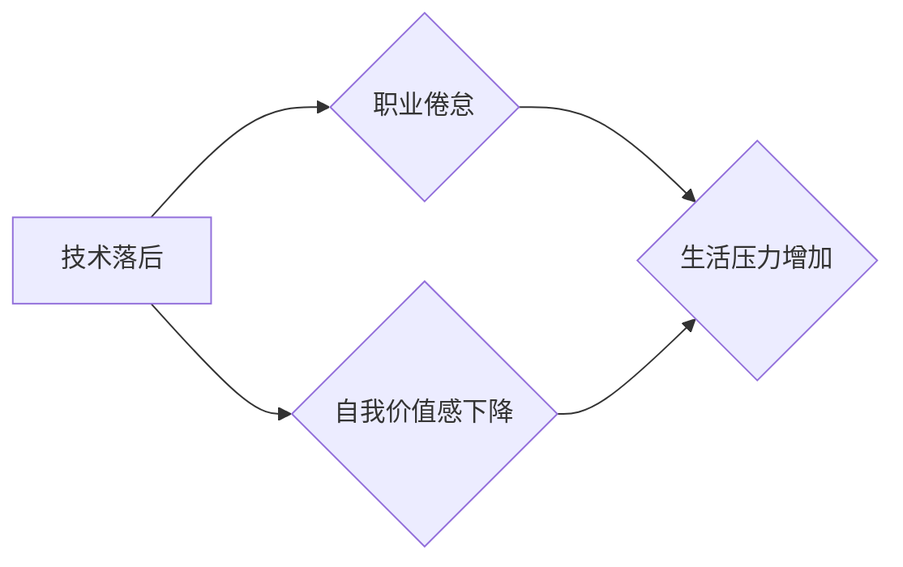

> 程序员，中年危机，职场转型，技能提升，学习方法，心理调节，职业规划

## 1. 背景介绍

在当今科技飞速发展的时代，程序员作为数字时代的基石，肩负着构建未来世界的重任。然而，随着年龄的增长，程序员也面临着职业生涯中的一个重要阶段——中年危机。

中年危机并非一蹴而就，而是由多种因素共同作用的结果。一方面，随着技术的不断更新迭代，程序员需要不断学习新知识、掌握新技能，才能保持竞争力。另一方面，工作压力、生活节奏的加快，以及对自身价值的重新审视，也容易导致程序员产生焦虑、迷茫等情绪。

## 2. 核心概念与联系

中年危机并非程序员独有的问题，它是一种普遍存在的社会现象，在各个职业领域都可能出现。 

**程序员中年危机主要表现为：**

* **技术落后：** 无法跟上新技术的步伐，导致技能贬值，工作机会减少。
* **职业倦怠：** 对工作失去兴趣，缺乏动力，工作效率下降。
* **自我价值感下降：** 对自身能力和价值产生怀疑，感到迷茫和焦虑。
* **生活压力增加：** 家庭、经济、健康等方面的压力，加重心理负担。

**程序员中年危机与以下因素密切相关：**

* **技术迭代速度快：**  软件开发领域技术更新迭代速度极快，需要程序员不断学习新知识、掌握新技能，才能保持竞争力。
* **工作压力大：**  程序员的工作通常需要长时间面对电脑，工作节奏快，压力大，容易导致身心疲惫。
* **社会竞争激烈：**  程序员是一个竞争激烈的行业，需要不断提升自身能力，才能在激烈的竞争中脱颖而出。

**Mermaid 流程图：**



## 3. 核心算法原理 & 具体操作步骤

**3.1 算法原理概述**

应对中年危机，需要程序员采取积极主动的措施，进行自我提升和职业转型。

**3.2 算法步骤详解**

**步骤一：自我评估**

程序员需要认真评估自身的技术能力、职业规划、个人兴趣爱好等方面，了解自身优势和劣势，明确职业发展方向。

**步骤二：技能提升**

程序员需要不断学习新技术、掌握新技能，保持自身竞争力。可以参加培训课程、阅读技术书籍、参与开源项目等方式进行学习。

**步骤三：职业转型**

如果程序员对自身职业感到迷茫，可以考虑进行职业转型，寻找更适合自己的职业方向。

**步骤四：心理调节**

程序员需要保持积极乐观的心态，学会调节压力，避免焦虑和迷茫情绪。

**3.3 算法优缺点**

**优点：**

* 能够帮助程序员及时发现自身问题，并采取措施进行解决。
* 能够帮助程序员保持学习热情，不断提升自身能力。
* 能够帮助程序员找到更适合自己的职业方向。

**缺点：**

* 需要程序员付出一定的努力和时间。
* 职业转型可能存在一定的风险。

**3.4 算法应用领域**

该算法适用于所有年龄段的程序员，尤其适合中年程序员应对职业生涯中的挑战。

## 4. 数学模型和公式 & 详细讲解 & 举例说明

**4.1 数学模型构建**

我们可以用一个简单的数学模型来描述程序员技能衰减的过程：

```latex
S(t) = S_0 * e^{-kt}
```

其中：

* $S(t)$ 表示程序员在时间 $t$ 时点的技能水平。
* $S_0$ 表示程序员初始技能水平。
* $k$ 表示技能衰减系数，反映了程序员学习和实践的强度。
* $t$ 表示时间。

**4.2 公式推导过程**

该公式基于指数衰减模型，假设程序员技能水平随着时间的推移呈指数衰减趋势。

**4.3 案例分析与讲解**

假设一位程序员在30岁时拥有较高的技能水平，初始技能水平为 $S_0 = 100$。如果他的技能衰减系数为 $k = 0.05$，那么在40岁时，他的技能水平将为：

```latex
S(10) = 100 * e^{-0.05 * 10} \approx 60.65
```

可见，即使没有进行主动学习，程序员的技能水平也会随着时间的推移而下降。

## 5. 项目实践：代码实例和详细解释说明

**5.1 开发环境搭建**

程序员可以利用各种开发工具和平台进行学习和实践，例如：

* **IDE:**  Visual Studio Code, IntelliJ IDEA, Eclipse 等
* **云平台:**  AWS, Azure, GCP 等
* **在线学习平台:**  Coursera, Udemy, edX 等

**5.2 源代码详细实现**

程序员可以根据自身兴趣和目标，选择不同的项目进行实践，例如：

* **开发一个简单的网站:**  学习HTML, CSS, JavaScript 等前端技术。
* **开发一个移动应用:**  学习Android 或 iOS 开发技术。
* **参与开源项目:**  学习最新的技术和最佳实践。

**5.3 代码解读与分析**

程序员需要认真阅读和理解代码，分析代码结构和逻辑，并进行调试和优化。

**5.4 运行结果展示**

程序员需要测试和验证代码的运行结果，并根据测试结果进行改进和完善。

## 6. 实际应用场景

**6.1  技术领域应用**

程序员可以将学习到的技术应用于各个领域，例如：

* **软件开发:**  开发各种类型的软件应用程序。
* **数据科学:**  分析和处理大数据，挖掘数据价值。
* **人工智能:**  开发人工智能算法和模型。

**6.2  个人成长应用**

程序员可以通过学习编程，提升自身的逻辑思维能力、解决问题的能力和创造力。

**6.3  未来应用展望**

随着技术的不断发展，程序员的需求将更加多样化，需要具备更广泛的知识和技能。

## 7. 工具和资源推荐

**7.1 学习资源推荐**

* **在线学习平台:**  Coursera, Udemy, edX, Codecademy 等
* **技术博客:**  Hacker News, Stack Overflow, Medium 等
* **技术书籍:**  《编程之美》、《代码的艺术》等

**7.2 开发工具推荐**

* **IDE:**  Visual Studio Code, IntelliJ IDEA, Eclipse 等
* **版本控制系统:**  Git, GitHub 等
* **云平台:**  AWS, Azure, GCP 等

**7.3 相关论文推荐**

* **程序员职业生涯发展研究**
* **程序员技能衰减模型**
* **程序员心理健康研究**

## 8. 总结：未来发展趋势与挑战

**8.1 研究成果总结**

程序员中年危机是一个复杂的问题，需要从多个方面进行研究和解决。

**8.2 未来发展趋势**

未来，程序员需要具备更强的学习能力、适应能力和创新能力，才能在不断变化的科技环境中保持竞争力。

**8.3 面临的挑战**

程序员面临着技术迭代速度快、竞争激烈、职业倦怠等挑战。

**8.4 研究展望**

未来研究可以进一步探讨程序员中年危机的原因、影响因素和应对策略，并提出更有效的解决方案。

## 9. 附录：常见问题与解答

**常见问题:**

* 如何应对技术落后？
* 如何缓解职业倦怠？
* 如何提升自我价值感？

**解答:**

* 积极学习新技术，参加培训课程，阅读技术书籍。
* 寻找工作中的乐趣，保持学习热情，尝试新的挑战。
* 关注自身成就，积极参与社会活动，拓展人脉关系。


作者：禅与计算机程序设计艺术 / Zen and the Art of Computer Programming 
<end_of_turn>