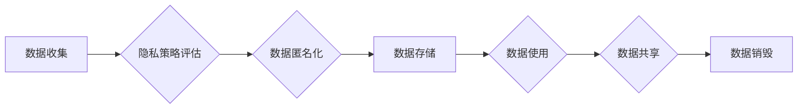

> 自动化创业，用户隐私，数据安全，隐私保护策略，联邦学习，差分隐私，同态加密

## 1. 背景介绍

在当今数字经济时代，自动化创业模式蓬勃发展，各种智能化应用层出不穷。从智能客服到个性化推荐，从自动交易到数据分析，自动化创业模式正在深刻改变着人们的生活方式和商业模式。然而，伴随着自动化创业的快速发展，用户隐私保护问题也日益凸显。

自动化创业模式通常依赖于海量用户数据进行训练和优化，而这些数据往往包含敏感个人信息，如姓名、地址、消费记录、浏览历史等。如果这些数据泄露或被滥用，将可能导致用户隐私泄露、身份盗窃、经济损失等严重后果。因此，如何有效保护用户隐私，是自动化创业企业面临的重大挑战。

## 2. 核心概念与联系

**2.1 用户隐私**

用户隐私是指个人在网络和信息时代拥有不被侵犯、不被随意收集、使用和传播的权利。它涵盖了个人信息、行为轨迹、通信内容等多个方面。

**2.2 数据安全**

数据安全是指保护数据免受未经授权的访问、使用、披露、修改或销毁的措施。它包括数据加密、访问控制、数据备份等技术手段。

**2.3 隐私保护策略**

隐私保护策略是指企业为了保护用户隐私而采取的一系列措施和机制。它包括数据收集、存储、使用、共享等各个环节的规范和控制。

**2.4 自动化创业模式**

自动化创业模式是指利用人工智能、机器学习等技术，自动完成创业流程的模式。它包括自动化的产品开发、市场营销、客户服务等环节。

**2.5 隐私保护与自动化创业的联系**

自动化创业模式依赖于海量用户数据进行训练和优化，而用户隐私保护是企业不可或缺的责任。如何平衡自动化创业的效率和用户隐私的保护，是企业需要认真思考的问题。

**2.6 隐私保护策略架构**



## 3. 核心算法原理 & 具体操作步骤

### 3.1 算法原理概述

本节将介绍几种常用的隐私保护算法，包括联邦学习、差分隐私和同态加密。

**3.1.1 联邦学习**

联邦学习是一种分布式机器学习方法，它允许模型在各个数据拥有者本地进行训练，而无需将原始数据传输到中央服务器。

**3.1.2 差分隐私**

差分隐私是一种数学工具，它可以保证数据分析结果的隐私性，即使分析者可以访问到原始数据。

**3.1.3 同态加密**

同态加密是一种加密技术，它允许对加密数据进行运算，而无需解密。

### 3.2 算法步骤详解

**3.2.1 联邦学习步骤详解**

1. 数据分发：将原始数据分发到各个数据拥有者本地。
2. 模型训练：每个数据拥有者在本地训练模型，并上传模型参数到中央服务器。
3. 参数聚合：中央服务器将所有模型参数聚合，得到全局模型参数。
4. 模型更新：将全局模型参数分发到各个数据拥有者本地，重复步骤2-3，直到模型收敛。

**3.2.2 差分隐私步骤详解**

1. 添加噪声：在数据分析过程中，添加随机噪声，以掩盖原始数据的信息。
2. 噪声预算：根据隐私预算，确定添加噪声的强度。
3. 分析结果：对添加了噪声的数据进行分析，得到分析结果。

**3.2.3 同态加密步骤详解**

1. 数据加密：将原始数据加密，得到密文。
2. 密文运算：对密文进行运算，得到密文结果。
3. 密文解密：解密密文结果，得到明文结果。

### 3.3 算法优缺点

**3.3.1 联邦学习**

* 优点：保护原始数据隐私，提高数据安全。
* 缺点：训练速度慢，模型性能可能不如集中式训练。

**3.3.2 差分隐私**

* 优点：保证数据分析结果的隐私性。
* 缺点：可能会降低分析结果的准确性。

**3.3.3 同态加密**

* 优点：允许对加密数据进行运算，保证数据安全。
* 缺点：计算复杂度高，效率较低。

### 3.4 算法应用领域

**3.4.1 联邦学习**

* 医疗保健：保护患者隐私，进行疾病研究。
* 金融服务：保护客户数据，进行风险评估。
* 人工智能：训练模型，保护数据隐私。

**3.4.2 差分隐私**

* 数据分析：保护敏感数据，进行统计分析。
* 机器学习：保护训练数据，进行模型训练。
* 隐私查询：保护用户隐私，进行数据查询。

**3.4.3 同态加密**

* 数据安全：保护数据在传输和存储过程中不被窃取。
* 隐私计算：允许对加密数据进行运算，保护数据隐私。
* 区块链：保护区块链数据隐私。

## 4. 数学模型和公式 & 详细讲解 & 举例说明

### 4.1 数学模型构建

**4.1.1 差分隐私数学模型**

差分隐私的数学模型基于ε-隐私的概念。对于一个数据集D和一个算法A，如果满足以下条件，则称A满足ε-隐私：

$$
\frac{Pr(A(D_1))}{Pr(A(D_2))} \leq e^{\epsilon}
$$

其中：

* $D_1$和$D_2$是两个相邻的数据集，即它们只相差一个数据点。
* $Pr(A(D_1))$和$Pr(A(D_2))$分别是算法A在数据集$D_1$和$D_2$上的输出概率。
* $\epsilon$是隐私预算，它控制着隐私泄露的程度。

**4.1.2 联邦学习数学模型**

联邦学习的数学模型基于梯度下降算法。每个数据拥有者在本地训练模型，并上传模型参数到中央服务器。中央服务器将所有模型参数聚合，得到全局模型参数。

### 4.2 公式推导过程

**4.2.1 差分隐私公式推导**

差分隐私公式的推导过程比较复杂，涉及到概率论、信息论和微积分等知识。

**4.2.2 联邦学习公式推导**

联邦学习的公式推导主要涉及到梯度下降算法和参数聚合算法。

### 4.3 案例分析与讲解

**4.3.1 差分隐私案例分析**

例如，可以使用差分隐私技术保护用户的医疗数据，进行疾病研究。研究者可以对医疗数据进行分析，而不会泄露用户的隐私信息。

**4.3.2 联邦学习案例分析**

例如，可以使用联邦学习技术训练一个语音识别模型，而无需将用户的语音数据集中存储。每个数据拥有者可以训练自己的模型，并上传模型参数到中央服务器，最终得到一个全局模型。

## 5. 项目实践：代码实例和详细解释说明

### 5.1 开发环境搭建

本项目使用Python语言开发，需要安装以下软件包：

* TensorFlow
* PyTorch
* scikit-learn

### 5.2 源代码详细实现

```python
# 联邦学习示例代码

import tensorflow as tf

# 定义模型
model = tf.keras.models.Sequential([
    tf.keras.layers.Dense(128, activation='relu'),
    tf.keras.layers.Dense(10, activation='softmax')
])

# 定义训练函数
def train_model(model, data, epochs):
    model.compile(optimizer='adam',
                  loss='sparse_categorical_crossentropy',
                  metrics=['accuracy'])
    model.fit(data, epochs=epochs)

# 联邦学习训练
def federated_learning(clients, epochs):
    for epoch in range(epochs):
        # 每个客户端本地训练模型
        for client in clients:
            train_model(model, client.data, epochs=1)

        # 参数聚合
        global_model = aggregate_parameters(clients)

        # 更新全局模型
        model = global_model

# 聚合参数
def aggregate_parameters(clients):
    # ...

# ...
```

### 5.3 代码解读与分析

* 代码首先定义了一个简单的深度学习模型。
* 然后定义了两个函数：`train_model`用于训练模型，`federated_learning`用于进行联邦学习训练。
* `federated_learning`函数首先迭代训练多个epochs，每个epochs内，每个客户端都对自己的数据进行训练，然后将模型参数上传到中央服务器进行聚合。
* 聚合后的参数更新全局模型，最终得到一个全局模型。

### 5.4 运行结果展示

运行上述代码，可以得到训练过程中的损失值和准确率，以及最终训练得到的全局模型的性能。

## 6. 实际应用场景

### 6.1 医疗保健

* **疾病诊断:** 利用联邦学习技术，可以训练一个疾病诊断模型，而无需将患者的医疗数据集中存储。
* **药物研发:** 可以使用差分隐私技术保护患者隐私，进行药物研发和临床试验。

### 6.2 金融服务

* **风险评估:** 可以使用联邦学习技术，训练一个风险评估模型，而无需将客户的金融数据集中存储。
* **欺诈检测:** 可以使用差分隐私技术，保护客户隐私，进行欺诈检测。

### 6.3 人工智能

* **个性化推荐:** 可以使用联邦学习技术，训练一个个性化推荐模型，而无需将用户的浏览历史数据集中存储。
* **语音识别:** 可以使用联邦学习技术，训练一个语音识别模型，而无需将用户的语音数据集中存储。

### 6.4 未来应用展望

随着人工智能技术的不断发展，自动化创业模式将更加广泛地应用于各个领域。在未来，隐私保护技术将更加成熟，能够更好地保护用户隐私，促进自动化创业的健康发展。

## 7. 工具和资源推荐

### 7.1 学习资源推荐

* **书籍:**
    * 《隐私计算》
    * 《联邦学习》
* **在线课程:**
    * Coursera: 隐私计算
    * edX: 联邦学习

### 7.2 开发工具推荐

* **TensorFlow Federated:** 一个开源的联邦学习框架。
* **PySyft:** 一个开源的隐私计算框架。

### 7.3 相关论文推荐

* **Federated Learning: Strategies for Improving Communication Efficiency**
* **Differential Privacy**

## 8. 总结：未来发展趋势与挑战

### 8.1 研究成果总结

本篇文章介绍了自动化创业中的用户隐私保护策略，包括核心概念、算法原理、代码实例和实际应用场景。

### 8.2 未来发展趋势

* **隐私计算技术将更加成熟:** 未来，隐私计算技术将更加完善，能够更好地保护用户隐私。
* **自动化创业模式将更加广泛地应用:** 自动化创业模式将更加广泛地应用于各个领域，对用户隐私保护提出了更高的要求。
* **隐私保护与商业价值的平衡:** 如何平衡隐私保护和商业价值，是未来需要解决的关键问题。

### 8.3 面临的挑战

* **技术复杂性:** 隐私保护技术相对复杂，需要专业的技术人员进行开发和维护。
* **数据安全:** 即使采用了隐私保护技术，也需要确保数据的安全存储和传输。
* **法律法规:** 隐私保护相关的法律法规还在不断完善，企业需要及时了解和遵守相关规定。

### 8.4 研究展望

未来，需要进一步研究隐私保护技术的应用场景，开发更加高效、安全的隐私保护算法，并制定更加完善的隐私保护法律法规，为自动化创业的健康发展提供保障。

## 9