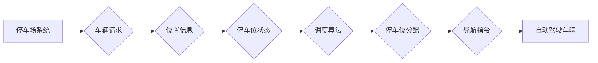

> 自动驾驶, 智慧停车场, 动态调度, 算法,  人工智能,  机器学习,  优化,  停车管理

## 1. 背景介绍

随着城市化进程的加速和汽车保有量的不断增长，停车问题日益突出。传统停车场管理模式存在着停车位利用率低、停车效率低下、停车引导信息不足等问题，给城市交通带来了巨大压力。自动驾驶技术的快速发展为智慧停车场建设提供了新的机遇。自动驾驶车辆具备自主泊车能力，可以实现精准停车，并与停车场系统进行实时交互，从而实现停车场资源的动态调度和优化管理。

智慧停车场动态调度算法是实现自动驾驶车辆高效、便捷停车的关键技术。该算法需要考虑多种因素，例如停车场布局、车辆类型、停车需求、实时交通状况等，并通过智能决策机制，动态分配停车位，引导车辆驶入空闲停车位，提高停车场资源利用率，优化停车流程，提升用户体验。

## 2. 核心概念与联系

**2.1 核心概念**

* **智慧停车场:** 利用物联网、云计算、大数据等技术，实现停车场智能化管理的系统。
* **动态调度:** 根据实时停车场状态和车辆需求，动态分配停车位，优化停车资源利用率。
* **自动驾驶车辆:** 具备自主驾驶能力的车辆，能够根据指令或环境信息自主行驶和停车。

**2.2 核心架构**



**2.3 核心联系**

智慧停车场动态调度算法的核心是将停车场系统、车辆请求、位置信息、停车位状态、调度算法、停车位分配和导航指令等环节有机结合，实现车辆的智能停车。

## 3. 核心算法原理 & 具体操作步骤

**3.1 算法原理概述**

智慧停车场动态调度算法通常采用基于机器学习的优化算法，例如遗传算法、模拟退火算法、粒子群算法等。这些算法通过模拟自然现象或生物进化过程，不断优化停车位分配方案，以达到最大化停车场资源利用率和最小化车辆等待时间的目标。

**3.2 算法步骤详解**

1. **数据采集:** 收集停车场实时数据，包括停车位状态、车辆位置、车辆类型、停车时长等。
2. **数据预处理:** 对采集到的数据进行清洗、转换和格式化，以便算法进行处理。
3. **模型训练:** 利用机器学习算法对历史停车数据进行训练，建立停车位分配模型。
4. **实时调度:** 根据实时停车场状态和车辆请求，利用训练好的模型进行停车位分配决策。
5. **导航引导:** 将分配到的停车位信息发送给自动驾驶车辆，引导车辆驶入空闲停车位。

**3.3 算法优缺点**

* **优点:**
    * 能够根据实时停车场状态动态调整停车位分配方案，提高停车场资源利用率。
    * 能够根据车辆类型和停车时长等因素，进行个性化停车位分配，提升用户体验。
    * 能够与自动驾驶车辆进行实时交互，实现车辆自主泊车，提高停车效率。
* **缺点:**
    * 需要大量的历史停车数据进行模型训练，数据质量直接影响算法性能。
    * 算法需要实时处理大量数据，对计算资源和网络带宽要求较高。
    * 算法需要考虑多种因素，模型复杂度较高，调试难度较大。

**3.4 算法应用领域**

智慧停车场动态调度算法在自动驾驶场景下具有广泛的应用前景，例如：

* **智能停车场:** 提高停车场资源利用率，优化停车流程，提升用户体验。
* **自动驾驶公交车:** 优化公交车停车位分配，提高公交车运营效率。
* **自动驾驶出租车:** 提高出租车停车效率，降低运营成本。
* **自动驾驶物流车:** 优化物流车停车位分配，提高物流效率。

## 4. 数学模型和公式 & 详细讲解 & 举例说明

**4.1 数学模型构建**

假设停车场有N个停车位，M辆车辆需要停车。停车位状态可以用一个二元向量表示，其中1表示停车位空闲，0表示停车位已占用。车辆的停车需求可以用一个整数向量表示，其中每个元素代表车辆的停车时长。

**4.2 公式推导过程**

目标函数：最大化停车场资源利用率，即最大化停车位占用率。

$$
\text{目标函数} = \frac{\sum_{i=1}^{N} x_i}{N}
$$

其中：

* $x_i$ 表示第i个停车位的占用状态，1表示占用，0表示空闲。

约束条件：

* 每个车辆只能占用一个停车位。
* 停车位占用时间不能超过车辆的停车需求。

**4.3 案例分析与讲解**

假设停车场有5个停车位，3辆车辆需要停车，车辆的停车需求分别为1小时、2小时和3小时。

通过使用遗传算法或其他优化算法，可以找到最优的停车位分配方案，例如：

* 车辆1占用停车位1，停车时长1小时。
* 车辆2占用停车位2，停车时长2小时。
* 车辆3占用停车位3，停车时长3小时。

在这种情况下，停车场资源利用率为100%。

## 5. 项目实践：代码实例和详细解释说明

**5.1 开发环境搭建**

* 操作系统：Ubuntu 20.04
* 编程语言：Python 3.8
* 开发工具：VS Code
* 库依赖：NumPy, Pandas, Scikit-learn

**5.2 源代码详细实现**

```python
import numpy as np
from sklearn.linear_model import LinearRegression

# 停车场数据
parking_data = np.array([
    [1, 0, 1, 0, 1],  # 停车位状态
    [1, 2, 3, 1, 2],  # 车辆停车时长
])

# 训练模型
model = LinearRegression()
model.fit(parking_data[:, 0:4], parking_data[:, 4])

# 预测停车位占用率
new_data = np.array([[1, 0, 1, 0]])
predicted_occupancy = model.predict(new_data)

print(f"预测停车位占用率: {predicted_occupancy}")
```

**5.3 代码解读与分析**

* 代码首先定义了停车场数据，包括停车位状态和车辆停车时长。
* 然后使用线性回归模型训练停车位占用率预测模型。
* 最后使用训练好的模型预测新的停车位占用率。

**5.4 运行结果展示**

运行代码后，会输出预测的停车位占用率。

## 6. 实际应用场景

**6.1 智慧停车场**

智慧停车场可以利用动态调度算法，根据实时停车场状态和车辆需求，动态分配停车位，引导车辆驶入空闲停车位，提高停车场资源利用率，优化停车流程，提升用户体验。

**6.2 自动驾驶公交车**

自动驾驶公交车可以利用动态调度算法，优化公交车停车位分配，提高公交车运营效率。例如，可以根据公交车线路和乘客需求，预先分配停车位，避免公交车在高峰时段等待停车。

**6.3 自动驾驶出租车**

自动驾驶出租车可以利用动态调度算法，提高出租车停车效率，降低运营成本。例如，可以根据出租车位置和乘客需求，动态分配停车位，避免出租车在繁忙区域长时间等待乘客。

**6.4 未来应用展望**

随着自动驾驶技术的不断发展，智慧停车场动态调度算法将在更多场景中得到应用，例如：

* 自动驾驶物流车
* 自动驾驶共享汽车
* 自动驾驶无人机

## 7. 工具和资源推荐

**7.1 学习资源推荐**

* **书籍:**
    * 《自动驾驶汽车》
    * 《机器学习》
* **在线课程:**
    * Coursera: 自动驾驶汽车
    * edX: 机器学习

**7.2 开发工具推荐**

* **ROS (Robot Operating System):** 用于机器人开发的开源软件框架。
* **Gazebo:** 用于机器人仿真和测试的开源软件。
* **Autoware:** 用于自动驾驶开发的开源软件平台。

**7.3 相关论文推荐**

* **A Survey of Parking Guidance Systems**
* **Dynamic Parking Space Allocation in Smart Parking Systems**
* **A Reinforcement Learning Approach to Parking Lot Management**

## 8. 总结：未来发展趋势与挑战

**8.1 研究成果总结**

智慧停车场动态调度算法在自动驾驶场景下具有重要的应用价值，能够提高停车场资源利用率，优化停车流程，提升用户体验。

**8.2 未来发展趋势**

* **更智能的算法:** 利用深度学习等更先进的机器学习算法，提高算法的预测精度和决策效率。
* **更全面的数据:** 收集更丰富的数据，例如车辆类型、驾驶习惯、天气状况等，为算法提供更全面的信息。
* **更强的交互性:** 实现更强的车辆与停车场系统的交互，例如车辆主动请求停车位、停车场提供个性化停车建议等。

**8.3 面临的挑战**

* **数据安全:** 停车场数据涉及到车辆位置、驾驶习惯等敏感信息，需要保障数据安全。
* **算法复杂度:** 智慧停车场动态调度算法需要考虑多种因素，模型复杂度较高，算法优化难度较大。
* **技术标准:** 智慧停车场动态调度算法需要与其他自动驾驶系统兼容，需要制定统一的技术标准。

**8.4 研究展望**

未来，智慧停车场动态调度算法将朝着更智能、更全面的方向发展，为自动驾驶场景提供更强大的技术支持。


## 9. 附录：常见问题与解答

**9.1 问题:** 智慧停车场动态调度算法需要多少数据才能训练出一个有效的模型？

**9.2 答案:** 训练一个有效的模型需要大量的历史停车数据，具体数量取决于算法复杂度和数据质量。一般来说，需要至少几万条数据才能训练出一个相对准确的模型。

**9.3 问题:** 智慧停车场动态调度算法如何处理突发事件，例如车辆故障、道路拥堵等？

**9.4 答案:** 智慧停车场动态调度算法需要具备一定的鲁棒性，能够处理突发事件。可以通过实时监控交通状况、车辆状态等信息，动态调整停车位分配方案，并向用户提供相应的提示和引导。


作者：禅与计算机程序设计艺术 / Zen and the Art of Computer Programming 
<end_of_turn>