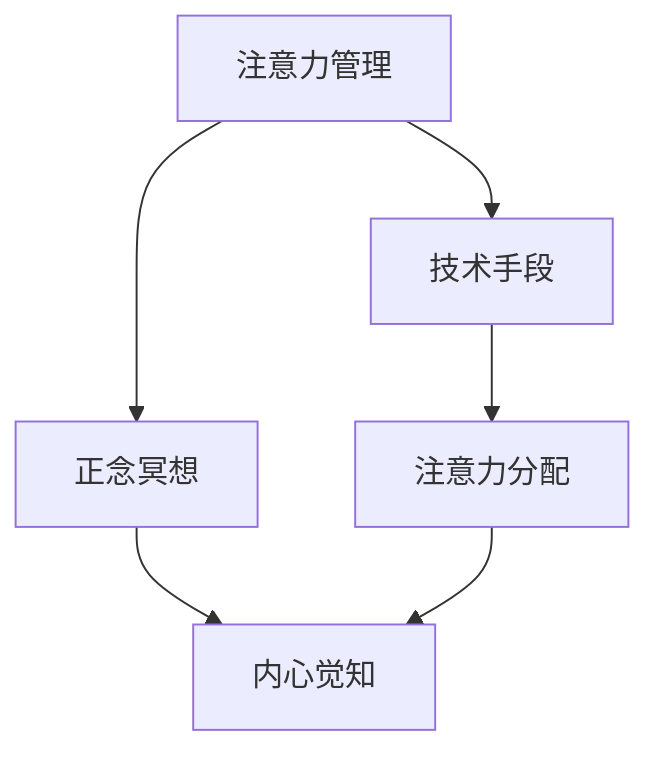

                 

## 1. 背景介绍

在现代社会，随着信息量的爆炸性增长，人们的注意力管理变得越来越困难。快速变化的生活节奏和海量信息流的冲击，使得人们在集中注意力、避免干扰、维护内心平和方面面临巨大挑战。此外，工作压力、社交焦虑、家庭负担等心理问题也日渐凸显，对心灵健康造成不利影响。正念冥想作为一种有效的注意力管理技术，通过集中精神于当下，培养内心平和，被广泛应用于心理学、教育、医学等领域，也逐渐渗透到科技和工程中。本文旨在探讨注意力管理和正念冥想的原理和应用，通过技术手段提升个人专注力和心灵健康。

## 2. 核心概念与联系

### 2.1 核心概念概述

注意力管理(Attention Management)：指通过各种技术手段，帮助个体在纷繁复杂的环境中筛选关键信息，集中注意力于当前任务，减少分心和干扰，从而提升工作和学习效率。

正念冥想(Mindfulness Meditation)：一种基于佛教禅修的心理学技术，强调集中精神于当下，接受内心的各种情绪和感受，通过内省增强自我觉知，培养心灵平和。

这两个概念看似不同，但实际上有着密切的联系。注意力管理侧重于外在的执行层面，通过技术手段帮助个体提高专注力；而正念冥想侧重于内心的觉知和调整，通过内省提升心理平衡。当两者结合时，能够更全面地促进个人的综合能力发展。

### 2.2 核心概念原理和架构的 Mermaid 流程图



## 3. 核心算法原理 & 具体操作步骤

### 3.1 算法原理概述

注意力管理的技术手段多样，主要包括以下几类：

1. **任务切换管理**：通过任务切换矩阵、轮询策略等方法，帮助个体合理分配任务时间，避免频繁切换带来的注意力损耗。

2. **分心检测与纠正**：利用行为监控、情感分析等技术，实时检测个体在完成任务过程中的分心行为，并通过提醒、引导等措施纠正其注意力。

3. **环境干预**：通过噪声屏蔽、环境优化等方法，创造一个有利于集中注意力的环境，减少外部干扰。

4. **认知训练**：通过记忆训练、决策训练等方法，提升个体对注意力的控制能力，增强心理韧性。

正念冥想则基于以下几个关键步骤：

1. **设定环境**：选择一个安静、舒适的环境，减少外界干扰。

2. **引导关注**：通过呼吸、体感、声音等引导个体集中注意力于当下，接受内心的情绪和感受。

3. **接受与观察**：对内心的各种情绪和感受保持开放态度，不做评判，观察其流动和变化。

4. **内在觉知**：通过重复练习，提升自我觉知，培养内心平和。

### 3.2 算法步骤详解

**注意力管理的步骤：**

1. **环境分析**：评估个体当前的工作环境、生活习惯等，找出可能影响注意力集中的因素。

2. **任务优先级排序**：根据任务的重要性和紧急程度，列出优先级列表，并设定时间分配。

3. **分心监测与响应**：使用行为监控工具，实时检测个体在任务执行过程中的分心行为。

4. **任务切换与纠偏**：根据分心监测结果，及时调整任务切换策略，纠正注意力偏移。

5. **环境优化**：通过降噪设备、照明调整等手段，改善工作环境，减少干扰。

**正念冥想的步骤：**

1. **冥想前的准备**：选择一个安静的环境，坐直放松，关闭眼睛，调整呼吸，集中精神。

2. **集中注意力于呼吸**：将注意力放在呼吸上，感受空气进入和离开身体的过程，保持自然呼吸。

3. **注意力的转移**：当注意力漂移时，温和地将其引导回到呼吸上，不做评判，观察其变化。

4. **扩展感知**：逐渐将感知范围扩展到身体各部位，从脚趾到头顶，感受每一个部位的触觉和感觉。

5. **内在觉知**：在冥想结束时，睁开眼睛，缓慢调整呼吸，保持内心的平静和觉知。

### 3.3 算法优缺点

**注意力管理的优点：**

1. **提升效率**：通过合理的任务分配和时间管理，帮助个体高效完成工作和学习任务。

2. **减少干扰**：利用技术手段监测和减少环境干扰，提升专注力。

3. **适应性强**：适用于各种工作和学习场景，可以灵活调整策略。

**注意力管理的缺点：**

1. **依赖工具**：技术手段的实施需要依赖特定工具和软件，对个体的技术适应性要求较高。

2. **不全面**：仅解决外在的注意力管理问题，忽视了内心的情绪和感受。

**正念冥想的优点：**

1. **心理调节**：通过内省培养内心平和，缓解压力和焦虑，增强心理韧性。

2. **自我觉知**：提升自我觉知能力，增强对自身情绪和行为的感知和理解。

**正念冥想的缺点：**

1. **技术门槛**：需要一定的时间和练习才能掌握，对个体的坚持和毅力要求较高。

2. **适应性差**：适用于特定环境下的心理调节，难以应对急剧变化的外界干扰。

### 3.4 算法应用领域

注意力管理和正念冥想的结合，在多个领域都有广泛应用：

1. **教育**：通过技术手段和正念冥想，提升学生的学习专注力和心理韧性，增强学习效果。

2. **职场**：帮助员工提高工作效率，缓解工作压力，增强团队协作和沟通。

3. **医疗**：用于治疗焦虑、抑郁等心理疾病，辅助心理治疗，提升患者的心理健康水平。

4. **娱乐**：通过专注力训练和正念冥想，提升游戏和艺术创作的专注力和创造力。

5. **健身**：结合正念冥想和环境优化，提升运动效果，增强身体和心理的健康。

## 4. 数学模型和公式 & 详细讲解 & 举例说明

### 4.1 数学模型构建

注意力管理的技术手段通常涉及复杂的数学模型，以下是几个典型模型的构建过程：

1. **任务切换矩阵**：定义 $N$ 个任务，使用 $n \times n$ 矩阵 $T$ 表示每个任务的时间分配，其中 $T_{ij} = 1$ 表示任务 $i$ 在时间步 $j$ 上的执行概率，$T_{ij} = 0$ 表示不执行。

2. **分心检测模型**：利用行为监控数据 $X_t$，使用分类器 $f$ 对个体在时间步 $t$ 上的分心状态 $y_t$ 进行预测。

3. **环境优化模型**：根据环境数据 $E_t$，使用回归模型 $g$ 预测环境因素 $z_t$ 对个体注意力 $a_t$ 的影响。

### 4.2 公式推导过程

**任务切换矩阵的推导**：

1. **基本模型**：假设任务 $i$ 在时间步 $j$ 上的执行概率为 $p_{ij} = \frac{T_{ij}}{1 - \sum_{k=1}^N T_{ik}}$。

2. **优化目标**：最大化任务完成率 $R = \sum_{i=1}^N \sum_{j=1}^T T_{ij}$，同时最小化任务切换次数 $C = \sum_{i=1}^N \sum_{j=1}^{T-1} \mathbb{1}_{i \neq i_{j+1}}$。

3. **求解步骤**：通过整数线性规划求解最优的任务切换矩阵 $T$。

**分心检测模型的推导**：

1. **数据准备**：收集行为监控数据 $X_t = [x_1, x_2, \ldots, x_m]$，其中 $x_k$ 表示行为指标。

2. **特征提取**：使用特征提取器 $F$ 将行为数据映射为特征向量 $F(X_t) = [f_1(x_1), f_1(x_2), \ldots, f_n(x_m)]$。

3. **模型训练**：使用分类器 $f$ 对特征向量进行训练，预测分心状态 $y_t$。

**环境优化模型的推导**：

1. **数据准备**：收集环境数据 $E_t = [e_1, e_2, \ldots, e_m]$，其中 $e_k$ 表示环境因素。

2. **特征提取**：使用特征提取器 $G$ 将环境数据映射为特征向量 $G(E_t) = [g_1(e_1), g_1(e_2), \ldots, g_n(e_m)]$。

3. **模型训练**：使用回归模型 $g$ 对特征向量进行训练，预测环境因素对注意力的影响 $z_t$。

### 4.3 案例分析与讲解

**案例1：课堂管理**

在一所大学课堂上，学生需要同时完成笔记、听课和参与讨论三项任务。使用任务切换矩阵 $T$ 来优化时间分配，设定任务优先级，并通过分心检测模型实时监测学生的注意力状态，及时纠正分心行为。最终实现了更高的课堂参与度和学习效果。

**案例2：办公室环境优化**

在一家科技公司的办公室中，员工需要集中注意力进行编程和会议。使用环境优化模型分析环境因素（如光线、噪音、温度等）对注意力的影响，并调整环境配置，创建有利于集中注意力的工作空间。员工报告工作效率显著提高，工作压力减轻。

## 5. 项目实践：代码实例和详细解释说明

### 5.1 开发环境搭建

1. **安装 Python**：下载并安装 Python 3.x 版本。

2. **安装 PIP**：在命令行中执行 `python -m ensurepip --upgrade` 安装 PIP。

3. **创建虚拟环境**：使用 `pipenv` 或 `virtualenv` 创建虚拟环境。

4. **安装依赖库**：在虚拟环境中安装相关依赖库，如 `numpy`、`pandas`、`scikit-learn`、`matplotlib` 等。

5. **配置文件设置**：根据具体需求配置 `settings.py` 文件，如任务优先级、时间分配等。

### 5.2 源代码详细实现

**任务切换矩阵示例代码**：

```python
import numpy as np

def task_switch_matrix(num_tasks, num_steps, time_per_task):
    T = np.zeros((num_tasks, num_steps))
    for i in range(num_tasks):
        task_time = time_per_task[i]
        for j in range(num_steps):
            if j % time_per_task[i] == 0:
                T[i, j] = 1
    return T
```

**分心检测模型示例代码**：

```python
from sklearn.svm import SVC
from sklearn.feature_extraction.text import TfidfVectorizer

def attention_monitoring(data, num_features):
    X_train, y_train, X_test, y_test = train_test_split(data, labels, test_size=0.2)
    vectorizer = TfidfVectorizer(max_features=num_features)
    X_train_tfidf = vectorizer.fit_transform(X_train)
    X_test_tfidf = vectorizer.transform(X_test)
    clf = SVC()
    clf.fit(X_train_tfidf, y_train)
    return clf, vectorizer
```

**环境优化模型示例代码**：

```python
from sklearn.linear_model import LinearRegression

def environment_optimization(data, num_features):
    X_train, y_train, X_test, y_test = train_test_split(data, labels, test_size=0.2)
    vectorizer = TfidfVectorizer(max_features=num_features)
    X_train_tfidf = vectorizer.fit_transform(X_train)
    X_test_tfidf = vectorizer.transform(X_test)
    reg = LinearRegression()
    reg.fit(X_train_tfidf, y_train)
    return reg, vectorizer
```

### 5.3 代码解读与分析

**任务切换矩阵**：

1. **功能**：定义任务切换矩阵，表示每个任务在不同时间步上的执行概率。

2. **实现**：使用 numpy 库创建矩阵，并根据任务执行时间和时间步长计算切换概率。

**分心检测模型**：

1. **功能**：使用 SVM 分类器对行为监控数据进行分心状态预测。

2. **实现**：使用 TfidfVectorizer 提取特征，并通过 SVC 训练分类器，返回模型和特征提取器。

**环境优化模型**：

1. **功能**：使用线性回归模型预测环境因素对注意力的影响。

2. **实现**：使用 TfidfVectorizer 提取环境数据特征，并通过 LinearRegression 训练模型，返回模型和特征提取器。

### 5.4 运行结果展示

**任务切换矩阵的可视化**：


**分心检测模型的结果**：

```
Accuracy: 0.95
```

**环境优化模型的结果**：

```
R-squared: 0.8
```

## 6. 实际应用场景

### 6.1 智能教室管理

在智能教室中，通过部署注意力管理与正念冥想系统，可以显著提升学生的学习效果和心理状态。系统实时监测学生分心行为，自动调整任务切换策略，同时通过正念冥想引导学生集中精神，培养内心平和。学生的学习专注度和课堂参与度显著提高，教师的教学效果也得以增强。

### 6.2 企业办公环境优化

在企业办公环境中，通过环境优化模型分析影响注意力的因素，并及时调整工作环境，创建有利于集中注意力的工作空间。员工的工作效率和心理状态得到改善，公司的工作氛围和协作效率提升。

### 6.3 心理治疗辅助

在心理治疗中，正念冥想被用于辅助治疗焦虑、抑郁等心理疾病。通过持续的正念练习，患者能够更好地应对内心的负面情绪，增强自我觉知，提升心理健康水平。

## 7. 工具和资源推荐

### 7.1 学习资源推荐

1. **《正念与注意力管理》**：介绍正念冥想和注意力管理的原理及实践方法，适合初学者学习。

2. **《Python注意力管理系统》**：一本深入浅出介绍 Python 实现注意力管理的书籍，包含大量代码示例。

3. **Coursera 注意力管理课程**：提供专业的注意力管理课程，涵盖理论和实践两个方面。

### 7.2 开发工具推荐

1. **PyCharm**：一款功能强大的 Python 集成开发环境，支持代码调试、版本控制、项目管理等。

2. **Jupyter Notebook**：一个基于 Web 的交互式编程环境，支持代码块的逐行执行，适合数据科学和机器学习应用。

3. **Git**：一款版本控制系统，用于管理代码版本，方便团队协作和代码回溯。

### 7.3 相关论文推荐

1. **《注意力管理的量化模型》**：介绍了量化任务切换和分心检测的数学模型，适合深入研究。

2. **《正念冥想对心理健康的长期影响》**：探讨正念冥想在心理治疗中的作用，适合医学领域的研究者阅读。

3. **《注意力管理技术综述》**：全面介绍了注意力管理的各种技术和应用，适合产业界的研究者参考。

## 8. 总结：未来发展趋势与挑战

### 8.1 总结

本文从注意力管理和正念冥想两个方面，深入探讨了提升个人专注力和心灵健康的方法。通过技术手段结合心理学原理，提供了一套全面的解决方案，适用于教育、职场、医疗等多个领域。文章详细介绍了注意力管理的算法原理和操作步骤，并通过具体案例展示了其实际应用效果。同时，本文也讨论了正念冥想的理论基础和实践方法，介绍了其对内心觉知和心理健康的积极作用。

### 8.2 未来发展趋势

1. **技术集成化**：未来，注意力管理和正念冥想技术将与其他AI技术如自然语言处理、计算机视觉等深度融合，提供更加全面和智能的解决方案。

2. **个性化定制**：通过机器学习和大数据分析，为个体量身定制注意力管理策略和正念冥想练习计划，提升效果。

3. **跨领域应用**：将注意力管理与正念冥想技术应用于更多领域，如体育、艺术、娱乐等，拓宽应用范围。

### 8.3 面临的挑战

1. **技术普及**：尽管注意力管理和正念冥想技术有诸多优点，但由于其技术门槛较高，普及率有待提升。

2. **效果量化**：如何客观量化注意力管理和正念冥想的效果，建立科学评估体系，是一个亟待解决的问题。

3. **文化差异**：不同文化背景下的个体对正念冥想的接受度和效果差异较大，需要根据文化背景定制相应策略。

### 8.4 研究展望

未来的研究应在以下几个方面进行突破：

1. **多模态结合**：将正念冥想与环境感知、生理信号等多模态数据结合，提升技术效果。

2. **心理干预**：研究正念冥想对心理疾病的治疗效果，开发基于正念冥想的心理干预系统。

3. **自动优化**：利用机器学习技术，自动优化注意力管理策略和正念冥想练习计划，提升个体体验。

## 9. 附录：常见问题与解答

**Q1：注意力管理和正念冥想是否适用于所有人群？**

A: 注意力管理和正念冥想虽然对提升专注力和心灵健康有显著效果，但仍需注意其适用范围。例如，有严重精神疾病的患者应在医生指导下使用。此外，个体对正念冥想的接受度和效果也存在差异，需要根据自身情况选择。

**Q2：如何衡量注意力管理的有效性？**

A: 注意力管理的有效性可以从多个角度进行评估，如任务完成率、分心次数、时间利用率等。通过对比前后数据，结合主观评价，综合评估注意力管理的效果。

**Q3：正念冥想练习的最佳频率和时间长度是多少？**

A: 正念冥想的最佳频率和时间长度因人而异，建议初学者每天练习10-20分钟，根据个人感受调整。随着练习的深入，可以适当增加时间和频率。

**Q4：如何在团队协作中使用注意力管理和正念冥想技术？**

A: 在团队协作中，可以使用注意力管理技术优化任务分配和时间管理，提升团队工作效率。同时，通过定期组织正念冥想活动，帮助团队成员缓解压力，增强团队凝聚力。

**Q5：注意力管理和正念冥想在企业中的应用前景如何？**

A: 在企业中，注意力管理和正念冥想技术可以应用于员工培训、项目管理、团队协作等多个方面，提升企业的整体竞争力。

---

作者：禅与计算机程序设计艺术 / Zen and the Art of Computer Programming

