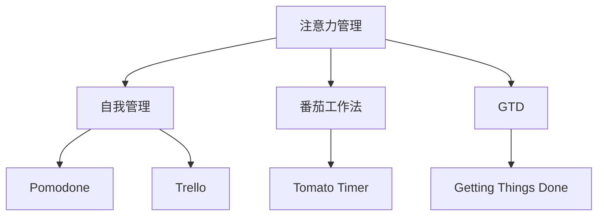

                 

# 注意力管理与自我管理策略：通过专注力增强个人和职业成功

## 1. 背景介绍

### 1.1 问题由来
在信息爆炸的时代，我们每个人都需要面对海量的信息和任务，如何高效管理自己的注意力，提升工作和学习效率，成为现代人的重要课题。传统的注意力管理方法往往过于抽象，难以量化和操作，而基于注意力管理的自我管理策略，则提供了一套更系统、更科学的方法论，帮助人们更好地掌控自己的注意力，从而提升个人和职业的成功率。

### 1.2 问题核心关键点
注意力管理与自我管理策略的核心在于如何通过科学的方法和工具，帮助人们提升专注力和自我控制能力。其关键点包括：
1. 定义清晰的目标：明确目标可以帮助我们更专注地工作，减少分散注意力的干扰。
2. 分配合理的时间：根据任务的复杂度和紧急程度，合理分配时间，避免拖延和资源浪费。
3. 使用专注工具：借助工具如番茄工作法、番茄钟等，帮助我们更好地集中注意力。
4. 定时休息：适当的休息可以提升注意力，避免疲劳导致的效率下降。
5. 反馈与调整：通过定期回顾和调整，不断优化注意力管理策略，提升效果。

### 1.3 问题研究意义
在信息时代，注意力管理的技巧不仅能帮助个人提升工作效率，还能为组织提升整体生产力，实现更高效的团队协作。其研究意义在于：
1. 提高个人效率：通过科学的管理方法和工具，提升个人专注力和执行力。
2. 提升组织效益：通过优化团队协作，提升团队整体的生产力和效率。
3. 促进技术创新：注意力管理策略可以应用于各种技术领域，提升创新效率。
4. 改善心理健康：科学的注意力管理有助于减轻压力，提升心理健康。

## 2. 核心概念与联系

### 2.1 核心概念概述

为更好地理解注意力管理与自我管理策略，本节将介绍几个密切相关的核心概念：

- **注意力管理(Attention Management)**：指通过科学的方法和技术，帮助个体更好地管理自己的注意力，提升专注力和工作效果。
- **自我管理(Self-Management)**：指通过自我反思、自我激励、自我调整等手段，提升个人自我控制力和行为决策能力。
- **番茄工作法(Pomodoro Technique)**：一种常见的时间管理方法，通过设定固定时间的工作和休息周期，提升工作效率。
- **番茄钟(Tomato Timer)**：一种计时器工具，用于支持番茄工作法的实践。
- **GTD(Getting Things Done)**：一种任务管理方法，通过收集、处理、组织和执行任务，提升工作流程效率。
- **Pomodone**：一种支持番茄工作法的自动化工具，可以与多种任务管理工具集成。
- **Trello**：一种流行的任务管理工具，支持看板、列表等多种视图模式，帮助团队协作。

这些核心概念之间的逻辑关系可以通过以下Mermaid流程图来展示：



这个流程图展示了几类注意力管理和自我管理策略的相互关系：

1. 注意力管理通过科学的方法提升专注力，帮助实现自我管理。
2. 番茄工作法和番茄钟是注意力管理的工具支持。
3. GTD和Trello等工具是自我管理的辅助手段。
4. Pomodone提供自动化工具支持，提升管理效率。

这些概念共同构成了注意力管理和自我管理策略的基础框架，为个人和组织提供了提升效率和绩效的科学手段。

## 3. 核心算法原理 & 具体操作步骤
### 3.1 算法原理概述

注意力管理与自我管理策略的核心算法原理，主要基于时间管理、任务管理和行为科学等理论。其核心在于通过时间切片和任务分解，提升个体的专注力和自我控制能力，具体包括以下几个步骤：

1. **目标设定**：明确具体、可衡量、可实现、相关性强、时限性的(SMART)目标。
2. **任务分解**：将大任务分解为可管理的小任务，以便于逐步完成。
3. **时间分配**：根据任务的复杂度和紧急程度，合理分配时间，设定工作周期。
4. **专注执行**：在固定时间内全神贯注于任务，避免干扰和分心。
5. **定期休息**：设定固定时间的休息周期，避免疲劳导致的效率下降。
6. **反馈调整**：定期回顾任务完成情况，调整目标和策略。

### 3.2 算法步骤详解

基于注意力管理和自我管理策略的科学方法，以下是一个典型的操作步骤示例：

1. **明确目标**：使用SMART原则定义清晰的目标。例如，“完成一篇关于人工智能的深度学习论文，字数8000字，4小时内完成”。
2. **任务分解**：将目标分解为可管理的小任务，如“选择主题、文献综述、理论框架、实验设计、数据收集、模型训练、结果分析、论文撰写”等。
3. **时间分配**：根据任务的重要性和紧急程度，设定工作周期。例如，每个任务分配2小时的时间，共需8小时。
4. **番茄工作法**：使用番茄钟工具，设定25分钟的专注工作时间，随后5分钟的短暂休息，4次后进行较长时间的休息(15-30分钟)。
5. **执行任务**：在番茄钟设定的时间内，全神贯注于当前任务，避免干扰。
6. **回顾调整**：每完成一个番茄周期，回顾任务进度，调整时间和策略。例如，发现某个任务花费时间过长，可能需要增加时间或调整任务优先级。

### 3.3 算法优缺点

注意力管理与自我管理策略具有以下优点：
1. 系统化：通过科学的时间管理和任务分解，帮助个体提升效率。
2. 可量化：使用工具和数据，可以准确地追踪和管理注意力和任务进度。
3. 灵活性：可以根据实际情况灵活调整策略，适应不同的任务和环境。
4. 可操作性：方法简单明了，易于实施和推广。

同时，这些方法也存在一些局限性：
1. 依赖执行力：方法的有效性依赖于个体的执行力，难以应对自我管理能力较差的个体。
2. 短期性：主要针对短期任务管理，对长期目标和习惯养成可能不够有效。
3. 个体差异：不同个体对不同策略的接受程度和效果可能不同，需要个性化调整。
4. 工具依赖：使用工具需要一定的技术和时间成本，对新手可能较为复杂。

### 3.4 算法应用领域

注意力管理和自我管理策略广泛应用于个人和组织中，例如：

- **个人学习**：使用番茄工作法提升学习效率，避免拖延和分心。
- **项目管理**：通过GTD和Trello等工具，管理项目任务和时间进度。
- **软件开发**：利用番茄钟工具，提升代码编写和测试的效率。
- **团队协作**：使用Trello等协作工具，协调团队任务和时间安排。
- **企业绩效**：通过科学管理，提升企业整体的生产力和绩效。

除了上述这些常见应用外，注意力管理和自我管理策略还可以应用于各种复杂和多样化的场景中，如医疗管理、教育培训、生产调度等，帮助提升整体效益和效率。

## 4. 数学模型和公式 & 详细讲解 & 举例说明

### 4.1 数学模型构建

本节将使用数学语言对注意力管理与自我管理策略进行更加严格的刻画。

设个体每日工作时间为T小时，总任务时间为Ttask小时，每个番茄周期为25分钟。假设个体目标任务数为Ntask，每个任务平均需要time_i小时完成，任务优先级为p_i，i∈{1,2,...,Ntask}。

定义每个任务的专注度为C_i，时间片内完成任务的概率为P_i。每个番茄周期内，完成任务的概率为：

$$
P_i = \left(1 - (1 - \frac{C_i}{100})\right)^{25/60}
$$

目标任务的完成概率为：

$$
P_{total} = \prod_{i=1}^{Ntask} P_i
$$

目标任务的期望完成时间为：

$$
E_{total} = \sum_{i=1}^{Ntask} p_i \times time_i
$$

定义注意力管理的策略为策略A，其效果函数为F(A)，基于策略A的目标任务完成概率为F(A)。

### 4.2 公式推导过程

以下我们以番茄工作法为例，推导期望完成时间的计算公式。

设每个番茄周期内，完成任务的概率为 $P_i$，总任务时间为 $T_{total}$，每个番茄周期为25分钟，则总番茄周期数为：

$$
N_{tomato} = \frac{T_{total}}{25}
$$

每个番茄周期内，期望完成的任务数为：

$$
E_{task} = N_{tomato} \times P_i
$$

总任务时间的期望完成时间为：

$$
E_{total} = \frac{T_{total}}{N_{tomato}} \times E_{task} = \frac{T_{total}}{N_{tomato}} \times N_{tomato} \times P_i = T_{total} \times P_i
$$

因此，期望完成时间为：

$$
E_{total} = T_{total} \times P_i
$$

为了使期望完成时间最小化，需要最大化 $P_i$。根据公式可知，$P_i$ 的取值与任务的专注度 $C_i$ 成正比，因此需要提升任务的专注度，以提高完成概率。

### 4.3 案例分析与讲解

假设某人在一天内需要完成5项任务，每项任务需要2小时，优先级均为中等。使用番茄工作法，每个番茄周期为25分钟，设定每项任务的专注度为80%。则期望完成时间为：

$$
E_{total} = 5 \times 2 \times \left(1 - (1 - 0.8)^{25/60}\right)^{-1} \approx 5 \times 2 \times 2.07 \approx 20.4 \text{小时}
$$

如果某项任务专注度提升至90%，则期望完成时间为：

$$
E_{total} = 5 \times 2 \times \left(1 - (1 - 0.9)^{25/60}\right)^{-1} \approx 5 \times 2 \times 2.13 \approx 20.9 \text{小时}
$$

可以看出，专注度的提升能够显著减少任务的完成时间。

## 5. 项目实践：代码实例和详细解释说明
### 5.1 开发环境搭建

在进行注意力管理与自我管理策略的实践前，我们需要准备好开发环境。以下是使用Python进行开发的环境配置流程：

1. 安装Anaconda：从官网下载并安装Anaconda，用于创建独立的Python环境。

2. 创建并激活虚拟环境：
```bash
conda create -n py_dev python=3.8 
conda activate py_dev
```

3. 安装PyTorch、Pandas、Pymunk等库：
```bash
pip install torch pandas pymunk
```

4. 安装番茄工作法工具库：
```bash
pip install pymunk-tomato
```

5. 安装代码示例运行环境：
```bash
pip install requests
```

完成上述步骤后，即可在`py_dev`环境中开始实践。

### 5.2 源代码详细实现

这里我们提供一个基于Python的番茄工作法代码实现示例：

```python
import requests
import time
import pymunk
from pymunk_tomato import TomatoTimer

class Task:
    def __init__(self, name, time):
        self.name = name
        self.time = time
        self.completion = False

    def start(self):
        print(f"Starting task {self.name}")

    def complete(self):
        print(f"Completed task {self.name}")

class PomodoroManager:
    def __init__(self, tasks, time):
        self.tasks = tasks
        self.time = time
        self.current_task = 0
        self.current_timer = TomatoTimer()

    def run(self):
        for task in self.tasks:
            task.start()
            while not task.completion:
                self.current_timer.start()
                time.sleep(25)
                self.current_timer.stop()
                if not self.current_timer.completed:
                    print(f"Working on {task.name}")
                else:
                    task.complete()
                    self.current_timer.reset()
                    self.current_task += 1
                    if self.current_task < len(self.tasks):
                        task = self.tasks[self.current_task]
                        print(f"Starting task {task.name}")
                    else:
                        break

if __name__ == "__main__":
    tasks = [
        Task("Write Code", 2),
        Task("Read Paper", 1),
        Task("Test Function", 1),
        Task("Check Email", 0.5),
        Task("Review Code", 1.5)
    ]
    manager = PomodoroManager(tasks, 25)
    manager.run()
```

这个代码实现了一个简单的番茄工作法，用于管理多个任务。具体流程如下：

1. 定义任务类：每个任务包含任务名和需要的时间。
2. 定义PomodoroManager类：管理番茄周期和任务。
3. 运行方法：在每个番茄周期内，执行当前任务，并根据番茄钟的状态进行任务切换。

### 5.3 代码解读与分析

让我们再详细解读一下关键代码的实现细节：

**Task类**：
- `__init__`方法：初始化任务名和时间。
- `start`方法：开始执行任务。
- `complete`方法：完成任务并标记为已完成。

**PomodoroManager类**：
- `__init__`方法：初始化任务列表和时间周期。
- `run`方法：按顺序执行任务，每个番茄周期内全神贯注于当前任务。
- `current_timer`属性：记录当前的番茄钟状态。

**番茄工作法执行**：
- 每个任务开始时，输出“Starting task X”。
- 在每个番茄周期内，执行任务，直到任务完成或番茄钟结束。
- 任务完成后，输出“Completed task X”，并根据下一个任务的优先级进行任务切换。

这个代码示例展示了如何使用番茄工作法管理多个任务，每25分钟休息5分钟，确保高效工作和学习。

## 6. 实际应用场景
### 6.1 学习提升

在学习场景中，番茄工作法可以显著提升学习效率。传统的学习方式往往容易疲劳和分心，而使用番茄工作法，可以按照固定周期专注学习，避免疲劳和分心，同时能够提高学习的持久力和专注力。

例如，学生可以使用番茄工作法管理每日的学习任务，设定固定的学习时间和休息时间，提升学习效果和成绩。教师可以采用番茄工作法组织课堂教学，提高课堂互动和学生参与度。

### 6.2 工作效率

在职场中，番茄工作法同样能够显著提升工作效率。许多现代职业要求高强度和高效率的工作，而传统的长时间工作往往容易疲劳和效率下降。通过番茄工作法，可以将工作时间切分为多个番茄周期，提高专注度和工作质量。

例如，软件开发人员可以采用番茄工作法管理代码编写和调试任务，提升代码质量和开发效率。市场营销人员可以采用番茄工作法管理营销方案和市场调研任务，提升营销效果和市场洞察。

### 6.3 项目管理

在项目管理中，番茄工作法也可以发挥重要作用。项目管理通常涉及多个任务和复杂的协作关系，使用番茄工作法可以提升任务进度管理和团队协作效率。

例如，项目经理可以使用番茄工作法管理项目任务和进度，设定每个任务的时间周期和优先级，提升项目交付速度和质量。团队成员可以采用番茄工作法协同工作，避免任务冲突和时间浪费。

### 6.4 未来应用展望

随着注意力管理和自我管理策略的不断演进，其应用场景和效果将会更加广泛。未来，这些方法可能会结合更多新技术，如人工智能、机器学习等，进一步提升个体和组织的生产力和效率。

例如，智能番茄钟可以根据用户的专注度和任务优先级，自动调整番茄周期长度，提升用户体验和效率。基于大数据分析的自我管理平台，可以为用户提供个性化的任务管理方案和策略优化建议。

此外，注意力管理和自我管理策略还可以与智能家居、健康管理等技术结合，提升整体的生活质量和工作效率。

## 7. 工具和资源推荐
### 7.1 学习资源推荐

为了帮助开发者系统掌握注意力管理与自我管理策略的理论基础和实践技巧，这里推荐一些优质的学习资源：

1. **《番茄工作法图解》**：经典书籍，系统讲解了番茄工作法的原理、使用方法和案例分析。
2. **《深度工作：如何有效利用每一点脑力》**：探讨了如何在信息爆炸的时代提升专注力和工作效率。
3. **《GTD入门》**：讲解了GTD方法的核心思想和应用技巧，帮助个人提升任务管理能力。
4. **Pomodone官网**：提供免费的番茄钟工具，支持多种任务管理工具的集成。
5. **Trello官网**：介绍Trello的任务管理方法和工具使用技巧，帮助团队协作和项目管理。

通过对这些资源的学习实践，相信你一定能够快速掌握注意力管理与自我管理策略的精髓，并用于解决实际的效率问题。

### 7.2 开发工具推荐

高效的开发离不开优秀的工具支持。以下是几款用于注意力管理与自我管理策略开发的常用工具：

1. **Pymunk-Tomato**：一个Python实现的番茄工作法工具库，提供了计时器和任务管理功能。
2. **Trello**：一个流行的任务管理工具，支持看板、列表等多种视图模式，帮助团队协作。
3. **Trello API**：Trello提供的API接口，支持自定义开发和集成。
4. **Python番茄工作法模板**：基于Python的番茄工作法代码示例，帮助开发者快速上手实践。
5. **GTD模板**：基于GTD方法的模板和工具，帮助个人和团队提升任务管理能力。

合理利用这些工具，可以显著提升注意力管理与自我管理策略的开发效率，加快创新迭代的步伐。

### 7.3 相关论文推荐

注意力管理和自我管理策略的研究源于学界的持续研究。以下是几篇奠基性的相关论文，推荐阅读：

1. **《番茄工作法：用25分钟改变你的一生》**：作者Francesco Cirillo，介绍了番茄工作法的原理和使用方法。
2. **《GTD：探索工作之道》**：作者David Allen，讲解了GTD方法的核心思想和实践技巧。
3. **《注意力管理策略：提高工作和学习的效率》**：作者Larry C. organizational change，探讨了注意力管理策略在个人和组织中的应用。
4. **《番茄工作法的科学依据》**：作者John L. Howard，从心理学角度探讨了番茄工作法的科学依据和效果。
5. **《基于机器学习的任务管理方法》**：作者Richard S. Sutton，探讨了使用机器学习技术优化任务管理的思路和方法。

这些论文代表了大语言模型微调技术的发展脉络。通过学习这些前沿成果，可以帮助研究者把握学科前进方向，激发更多的创新灵感。

## 8. 总结：未来发展趋势与挑战

### 8.1 总结

本文对注意力管理和自我管理策略进行了全面系统的介绍。首先阐述了注意力管理与自我管理策略的研究背景和意义，明确了这些策略在提升个体和组织效率方面的独特价值。其次，从原理到实践，详细讲解了注意力管理与自我管理策略的科学方法，并给出了具体的代码实现示例。同时，本文还广泛探讨了这些策略在多个领域的应用前景，展示了其在提升效率和绩效方面的强大潜力。

通过本文的系统梳理，可以看到，注意力管理和自我管理策略已经成为提升个人和组织效率的重要方法，其科学性和操作性得到了广泛的认可。未来，随着这些策略的不断演进和应用推广，必将在更广泛的应用领域发挥更大的作用。

### 8.2 未来发展趋势

展望未来，注意力管理和自我管理策略将呈现以下几个发展趋势：

1. **技术融合**：未来，注意力管理和自我管理策略可能会与其他人工智能技术进行更深入的融合，如认知计算、增强现实等，提升管理效率和用户体验。
2. **个性化优化**：借助大数据分析和机器学习，未来的注意力管理工具将提供更加个性化的优化建议，提升用户的专注力和效率。
3. **多模态集成**：未来的注意力管理工具可能会结合视觉、语音、生物信号等多种模态信息，提供更全面、实时的管理方案。
4. **企业应用**：注意力管理和自我管理策略将在企业中得到更广泛的应用，提升整体的生产力和绩效。
5. **全球化推广**：随着全球化趋势的加强，注意力管理与自我管理策略将在全球范围内推广应用，帮助更多的人提升效率和幸福感。

以上趋势凸显了注意力管理和自我管理策略的广阔前景。这些方向的探索发展，必将进一步提升个体和组织的生产力和效率，为构建更加智能、高效的社会提供坚实基础。

### 8.3 面临的挑战

尽管注意力管理和自我管理策略已经取得了显著的效果，但在迈向更加智能化、普适化应用的过程中，仍面临诸多挑战：

1. **用户接受度**：不同用户对注意力管理策略的接受程度和效果可能不同，需要个性化调整和推广。
2. **技术复杂性**：实现技术复杂，尤其是结合大数据和人工智能技术的工具，需要较高的技术门槛。
3. **隐私保护**：用户数据隐私保护成为重要问题，需要在数据收集和使用过程中严格遵守法律法规。
4. **多任务适应**：有些任务可能无法简单分解，需要结合多种方法进行管理。
5. **文化差异**：不同文化背景的用户对注意力管理策略的接受程度和使用方法可能不同，需要全球化推广和本地化适配。

### 8.4 研究展望

面对注意力管理和自我管理策略所面临的挑战，未来的研究需要在以下几个方面寻求新的突破：

1. **跨文化适应**：开发适用于全球不同文化背景用户的注意力管理工具。
2. **技术集成**：探索将注意力管理策略与其他人工智能技术进行深度融合的途径。
3. **个性化优化**：利用大数据和机器学习技术，提供更加个性化的管理方案。
4. **隐私保护**：设计隐私友好的注意力管理工具，确保用户数据安全。
5. **多任务管理**：开发适用于复杂任务的管理工具，提升用户的工作效率。

这些研究方向的探索，必将引领注意力管理和自我管理策略迈向更高的台阶，为构建更加智能、高效的社会提供坚实的技术保障。总之，只有勇于创新、敢于突破，才能不断拓展注意力管理和自我管理策略的边界，让智能技术更好地造福人类社会。

## 9. 附录：常见问题与解答

**Q1：如何使用番茄工作法提高学习效率？**

A: 使用番茄工作法，将学习任务分成25分钟的工作周期和5分钟的休息周期。具体步骤如下：
1. 选定一个学习任务，设定需要完成的时间。
2. 开启计时器，全神贯注于学习任务，不受干扰。
3. 当计时器提醒时，停止学习，进行短暂休息，起来活动一下。
4. 休息结束后，回到学习任务，继续进行下一个番茄周期。
5. 每4个番茄周期后，进行较长时间的休息(15-30分钟)。
6. 循环上述步骤，直到任务完成。

**Q2：如何结合GTD和番茄工作法提升工作效率？**

A: 结合GTD和番茄工作法，可以更好地管理任务和时间。具体步骤如下：
1. 收集所有待办事项，记录在GTD工具中。
2. 对任务进行分类和优先级排序。
3. 选择需要立即处理的任务，开始番茄工作法。
4. 在每个番茄周期内，专注于当前任务，避免分心。
5. 完成番茄周期后，记录任务完成情况，更新GTD工具。
6. 根据任务进展，进行适当的调整和优化。

**Q3：如何选择合适的番茄周期时间？**

A: 番茄工作法的核心在于设定固定的时间周期，提升专注力和效率。一般来说，25分钟是一个相对合理的时间周期，可以根据个人和任务的特点进行调整。例如，对于需要高度集中的任务，可以设定更短的时间周期，如15分钟；对于较为轻松的任务，可以设定更长的时间周期，如30分钟。

**Q4：如何调整番茄工作法以适应复杂任务？**

A: 对于复杂任务，可以采用灵活的番茄工作法。例如，将任务分解为多个子任务，每个子任务设定一个番茄周期，逐步完成。在每个番茄周期内，专注于当前子任务，避免分心。完成子任务后，记录进展，再进行下一个子任务。这样可以更好地管理复杂任务，避免任务堆积。

**Q5：番茄工作法和GTD的区别和联系是什么？**

A: 番茄工作法和GTD是两种不同的时间管理方法，但有互补性。
1. 番茄工作法关注时间管理，通过设定固定时间周期，提升专注力和效率。
2. GTD关注任务管理，通过收集、处理、组织和执行任务，提升工作流程效率。
3. 结合使用，可以在时间管理的基础上，更好地任务管理，提升整体效率。
4. 番茄工作法更适合需要高度集中的任务，GTD更适合需要多任务处理的情况。
5. 番茄工作法可以应用于个人学习、职场工作等多个场景，GTD更多用于团队协作和项目管理。

通过合理结合番茄工作法和GTD，可以提升个人和团队的整体效率和绩效，实现更加高效的工作和学习。

---

作者：禅与计算机程序设计艺术 / Zen and the Art of Computer Programming

