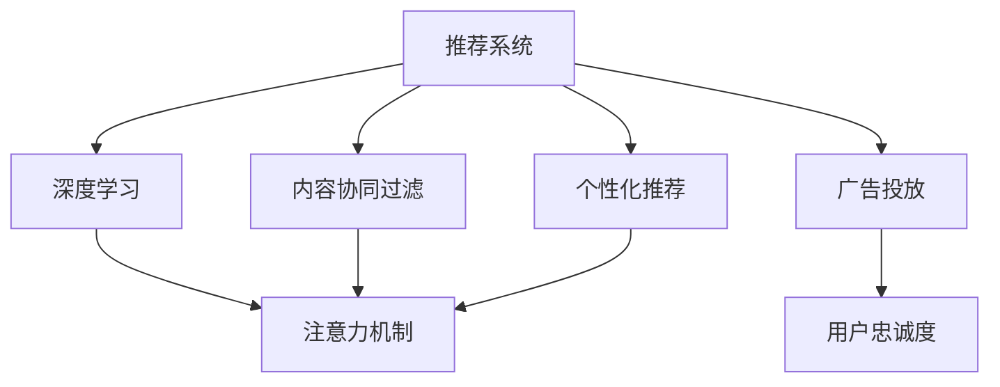

                 

# 注意力经济下的用户忠诚度培养

> 关键词：注意力经济,用户忠诚度,推荐系统,内容协同过滤,深度学习,广告投放,个性化推荐,数据挖掘

## 1. 背景介绍

### 1.1 问题由来

随着移动互联网和社交媒体的快速发展，注意力经济的概念日益凸显。在信息爆炸的时代，用户面对海量内容，注意力成为最宝贵的资源。如何高效地获取和利用用户注意力，提升用户忠诚度，成为各大平台和企业的核心命题。

用户忠诚度是指用户在特定平台或品牌上长期稳定地使用和消费。建立高用户忠诚度，不仅能带来稳定的收入流，还能增强用户粘性，促进二次消费和口碑传播。在注意力经济背景下，提升用户忠诚度成为了企业竞争的关键。

近年来，推荐系统技术在电商、社交、内容等多个领域得到了广泛应用，通过个性化的内容推荐，满足用户个性化需求，提升用户满意度和忠诚度。然而，现有的推荐系统存在诸多问题，如冷启动难题、长尾问题、多样性问题等，制约了用户忠诚度的提升。

本博文将从注意力经济的角度出发，介绍基于深度学习的推荐系统在用户忠诚度培养中的应用，并分析面临的挑战和未来发展趋势。

### 1.2 问题核心关键点

1. **注意力经济**：注意力经济是以用户注意力为核心的经济形态，强调在信息过载的环境下，如何高效获取用户注意力，实现商业价值。
2. **用户忠诚度**：用户忠诚度是指用户在特定平台或品牌上的持续使用和消费行为。提升用户忠诚度是企业竞争的关键。
3. **推荐系统**：推荐系统通过分析用户行为数据，为用户提供个性化的内容推荐，提升用户满意度和忠诚度。
4. **深度学习**：深度学习技术，如神经网络、自编码器等，能够高效地处理大规模数据，提取复杂特征，提升推荐系统性能。
5. **广告投放**：广告投放是获取用户注意力的重要手段，通过个性化的广告推荐，提升用户点击率和转化率。
6. **个性化推荐**：个性化推荐通过分析用户历史行为数据，预测用户兴趣，实现更精准的内容推送。
7. **数据挖掘**：数据挖掘技术可以从海量数据中提取有价值的信息，构建用户兴趣模型，提升推荐系统的准确性和多样性。

## 2. 核心概念与联系

### 2.1 核心概念概述

为更好地理解基于深度学习的推荐系统在用户忠诚度培养中的应用，本节将介绍几个密切相关的核心概念：

- **推荐系统**：通过分析用户行为数据，为用户推荐个性化内容的系统。推荐系统主要分为基于内容的推荐、协同过滤推荐和混合推荐等类型。
- **深度学习**：通过多层神经网络模型，从大量数据中提取高阶特征，用于分类、预测、推荐等任务。
- **注意力机制**：一种重要的深度学习机制，通过动态调整模型对不同特征的关注程度，提升模型的性能。
- **内容协同过滤**：通过分析用户历史行为数据和物品属性，找到用户与物品之间的相似度，进行推荐。
- **个性化推荐**：根据用户兴趣和行为，提供个性化的内容推荐，提升用户满意度和忠诚度。
- **广告投放**：通过个性化广告推荐，获取用户注意力，提升点击率和转化率。
- **用户忠诚度**：用户在特定平台或品牌上的持续使用和消费行为。

这些核心概念之间的逻辑关系可以通过以下Mermaid流程图来展示：



这个流程图展示了大语言模型的核心概念及其之间的关系：

1. 推荐系统通过深度学习模型提取用户和物品的特征，结合注意力机制，实现个性化的内容推荐。
2. 内容协同过滤和个性化推荐是推荐系统的两个主要类型。
3. 广告投放通过个性化广告推荐，获取用户注意力。
4. 用户忠诚度是推荐系统的重要目标，通过提升用户满意度，实现长期稳定使用。

这些概念共同构成了深度学习在用户忠诚度培养中的基本框架，使其能够高效地获取和利用用户注意力，提升用户忠诚度。

## 3. 核心算法原理 & 具体操作步骤
### 3.1 算法原理概述

基于深度学习的推荐系统，通过分析用户历史行为数据和物品属性，构建用户兴趣模型和物品特征模型，实现个性化的内容推荐。在推荐过程中，注意力机制的应用，能够动态调整模型对不同特征的关注程度，提升推荐的准确性和多样性。

推荐系统的核心思想是通过以下步骤，构建用户兴趣模型和物品特征模型，实现个性化的内容推荐：

1. 数据采集与预处理：收集用户行为数据和物品属性数据，并进行数据清洗和预处理。
2. 特征提取与建模：通过深度学习模型，提取用户和物品的特征，构建用户兴趣模型和物品特征模型。
3. 注意力机制应用：通过动态调整模型对不同特征的关注程度，提升推荐准确性和多样性。
4. 个性化推荐生成：根据用户兴趣模型和物品特征模型，生成个性化推荐结果。
5. 推荐结果排序：根据推荐结果的相关性、新颖性等指标，对推荐结果进行排序，生成最终推荐列表。

### 3.2 算法步骤详解

基于深度学习的推荐系统主要包括以下几个关键步骤：

**Step 1: 数据采集与预处理**

- 收集用户行为数据，如点击、浏览、购买等。
- 收集物品属性数据，如商品名称、描述、类别等。
- 对数据进行清洗和标准化处理，去除噪声和异常值。

**Step 2: 特征提取与建模**

- 将用户行为数据和物品属性数据，转换为模型输入。
- 通过深度学习模型，提取用户和物品的特征。
- 使用自编码器、神经网络等模型，构建用户兴趣模型和物品特征模型。

**Step 3: 注意力机制应用**

- 在推荐模型中引入注意力机制，动态调整模型对不同特征的关注程度。
- 通过注意力权重，计算用户和物品的相似度。
- 将注意力权重与用户兴趣模型和物品特征模型结合，生成推荐结果。

**Step 4: 个性化推荐生成**

- 根据用户兴趣模型和物品特征模型，生成推荐列表。
- 对推荐列表进行去重、排序等处理，生成最终的推荐结果。

**Step 5: 推荐结果排序**

- 根据推荐结果的相关性、新颖性等指标，对推荐结果进行排序。
- 使用A/B测试等方法，评估推荐效果，不断优化模型参数。

### 3.3 算法优缺点

基于深度学习的推荐系统具有以下优点：

1. **高效性**：通过深度学习模型，能够高效地处理大规模数据，提取复杂特征。
2. **个性化**：通过用户兴趣模型和物品特征模型，能够实现个性化的内容推荐。
3. **鲁棒性**：通过注意力机制，能够动态调整模型对不同特征的关注程度，提升推荐准确性。
4. **多样性**：通过结合用户历史行为和物品属性，能够保证推荐结果的多样性。

同时，该方法也存在一些局限性：

1. **冷启动问题**：新用户或新物品没有足够的历史数据，难以建立准确的兴趣模型。
2. **长尾问题**：热门物品推荐效果好，但长尾物品可能难以获得足够的曝光率。
3. **数据稀疏性**：用户行为数据和物品属性数据可能存在稀疏性，影响模型的泛化能力。
4. **计算资源消耗大**：深度学习模型需要大量的计算资源，可能带来较高的成本。

### 3.4 算法应用领域

基于深度学习的推荐系统在多个领域得到了广泛应用，例如：

- 电商推荐：根据用户行为数据和物品属性，为用户推荐商品。
- 内容推荐：根据用户历史行为和文章属性，为用户推荐新闻、文章等。
- 社交推荐：根据用户兴趣和好友关系，为用户推荐新朋友、群组等。
- 广告投放：根据用户兴趣和行为，为用户推荐个性化广告。
- 金融推荐：根据用户历史交易和属性，为用户推荐理财产品、基金等。

除了上述这些经典应用外，基于深度学习的推荐系统还被创新性地应用于更多场景中，如医疗推荐、教育推荐、智能家居推荐等，为不同行业带来了新的商业价值。

## 4. 数学模型和公式 & 详细讲解  
### 4.1 数学模型构建

本节将使用数学语言对基于深度学习的推荐系统在用户忠诚度培养中的应用进行更加严格的刻画。

记用户为 $u$，物品为 $i$，行为数据为 $x_{ui}$，物品属性为 $x_i$，深度学习模型为 $M$。

假设用户兴趣模型为 $U(u)$，物品特征模型为 $I(i)$，推荐模型为 $P(u,i)$。

通过深度学习模型，提取用户和物品的特征，构建用户兴趣模型和物品特征模型，并应用注意力机制，生成推荐结果。推荐模型的目标函数为：

$$
\min_{U, I, P} \mathcal{L} = \sum_{u,i} \mathcal{L}(u,i)
$$

其中 $\mathcal{L}(u,i)$ 为用户 $u$ 对物品 $i$ 的预测误差。

在实践中，我们通常使用交叉熵损失函数，用于衡量模型预测值与真实值之间的差异。具体损失函数为：

$$
\mathcal{L}(u,i) = -y_{ui}\log \hat{y}_{ui} + (1-y_{ui})\log (1-\hat{y}_{ui})
$$

其中 $\hat{y}_{ui} = P(u,i)$ 为模型预测用户 $u$ 对物品 $i$ 的兴趣。

### 4.2 公式推导过程

以下我们以内容协同过滤为例，推导推荐模型的数学表达式及其梯度计算过程。

假设用户 $u$ 对物品 $i$ 的行为为 $x_{ui}$，物品 $i$ 的属性为 $x_i$，深度学习模型 $M$ 的输出为 $\hat{y}_{ui} = M(x_{ui}, x_i)$。

内容协同过滤的目标是最大化用户 $u$ 对物品 $i$ 的预测兴趣：

$$
\min_{U, I, P} \mathcal{L} = \sum_{u,i} -y_{ui}\log \hat{y}_{ui} + (1-y_{ui})\log (1-\hat{y}_{ui})
$$

通过最大化用户 $u$ 对物品 $i$ 的预测兴趣，实现推荐模型的优化。

在优化过程中，通过梯度下降等优化算法，更新模型参数 $U$、$I$ 和 $P$。具体来说，设 $\eta$ 为学习率，$\lambda$ 为正则化系数，则参数的更新公式为：

$$
U \leftarrow U - \eta \nabla_{U}\mathcal{L} - \eta\lambda U
$$
$$
I \leftarrow I - \eta \nabla_{I}\mathcal{L} - \eta\lambda I
$$
$$
P \leftarrow P - \eta \nabla_{P}\mathcal{L} - \eta\lambda P
$$

其中 $\nabla_{U}\mathcal{L}$、$\nabla_{I}\mathcal{L}$ 和 $\nabla_{P}\mathcal{L}$ 为损失函数对模型参数的梯度，可通过反向传播算法高效计算。

## 5. 项目实践：代码实例和详细解释说明
### 5.1 开发环境搭建

在进行推荐系统实践前，我们需要准备好开发环境。以下是使用Python进行TensorFlow开发的环境配置流程：

1. 安装Anaconda：从官网下载并安装Anaconda，用于创建独立的Python环境。

2. 创建并激活虚拟环境：
```bash
conda create -n tf-env python=3.8 
conda activate tf-env
```

3. 安装TensorFlow：根据CUDA版本，从官网获取对应的安装命令。例如：
```bash
conda install tensorflow -c pytorch -c conda-forge
```

4. 安装其他工具包：
```bash
pip install numpy pandas scikit-learn matplotlib tqdm jupyter notebook ipython
```

完成上述步骤后，即可在`tf-env`环境中开始推荐系统开发。

### 5.2 源代码详细实现

下面我们以电商推荐为例，给出使用TensorFlow对推荐系统进行开发的PyTorch代码实现。

首先，定义推荐系统所需的数据处理函数：

```python
import tensorflow as tf
from tensorflow.keras.layers import Input, Dense, Embedding, Dot, Flatten, Add, Activation
from tensorflow.keras.models import Model

# 用户行为数据和物品属性数据
train_dataset = tf.data.Dataset.from_tensor_slices(train_data)
test_dataset = tf.data.Dataset.from_tensor_slices(test_data)

# 用户和物品的嵌入层
user_embedding_dim = 64
item_embedding_dim = 64

user_embedding = Embedding(input_dim=num_users, output_dim=user_embedding_dim, name='user_embedding')
item_embedding = Embedding(input_dim=num_items, output_dim=item_embedding_dim, name='item_embedding')

# 物品属性表示层
item_property_dim = 32
item_property_embedding = Dense(item_property_dim, activation='relu', name='item_property_embedding')

# 推荐模型
user_input = Input(shape=(num_items,), name='user_input')
item_input = Input(shape=(num_items,), name='item_input')
user_embedding_output = user_embedding(user_input)
item_embedding_output = item_embedding(item_input)
item_property_output = item_property_embedding(item_property)
dot_product = Dot(axes=(2, 2), name='dot_product')([user_embedding_output, item_property_output])
concat_output = Add()([user_embedding_output, item_property_output])
model_output = Flatten()(concat_output)
predictions = Dense(1, activation='sigmoid', name='predictions')(model_output)

model = Model(inputs=[user_input, item_input], outputs=predictions)
model.compile(loss='binary_crossentropy', optimizer='adam', metrics=['accuracy'])
```

然后，定义训练和评估函数：

```python
def train_epoch(model, dataset, batch_size, optimizer):
    model.train()
    epoch_loss = 0
    for batch in tqdm(dataset, desc='Training'):
        user_input, item_input = batch
        model.zero_grad()
        outputs = model(user_input, item_input)
        loss = outputs.loss
        epoch_loss += loss.item()
        loss.backward()
        optimizer.step()
    return epoch_loss / len(dataset)

def evaluate(model, dataset, batch_size):
    model.eval()
    preds, labels = [], []
    with tf.no_grad():
        for batch in tqdm(dataset, desc='Evaluating'):
            user_input, item_input = batch
            batch_labels = batch['labels']
            outputs = model(user_input, item_input)
            batch_preds = outputs.predict()
            for pred, label in zip(batch_preds, batch_labels):
                preds.append(pred.numpy())
                labels.append(label.numpy())
    return preds, labels

train_dataset, test_dataset = train_dataset.shuffle(buffer_size=10000).batch(batch_size=64), test_dataset.batch(batch_size=64)
```

最后，启动训练流程并在测试集上评估：

```python
epochs = 10
batch_size = 64

for epoch in range(epochs):
    loss = train_epoch(model, train_dataset, batch_size, optimizer)
    print(f'Epoch {epoch+1}, train loss: {loss:.3f}')

    print(f'Epoch {epoch+1}, test results:')
    preds, labels = evaluate(model, test_dataset, batch_size)
    accuracy = tf.metrics.AUC(from_logits=True, curve='ROC').update_state(labels, preds)
    print(f'Accuracy: {accuracy.numpy()}')
```

以上就是使用TensorFlow对电商推荐系统进行开发的完整代码实现。可以看到，得益于TensorFlow的强大封装，推荐系统的开发变得简洁高效。

### 5.3 代码解读与分析

让我们再详细解读一下关键代码的实现细节：

**train_dataset和test_dataset**：
- `train_dataset` 和 `test_dataset` 分别表示训练集和测试集。

**user_embedding和item_embedding**：
- `user_embedding` 和 `item_embedding` 分别表示用户和物品的嵌入层，用于将用户和物品表示为低维向量。

**item_property_embedding**：
- `item_property_embedding` 表示物品属性的表示层，用于提取物品属性的特征。

**model_output和predictions**：
- `model_output` 表示模型的输出层，通过将用户和物品嵌入层的结果进行拼接，实现更全面的特征融合。
- `predictions` 表示最终的预测结果，通过 sigmoid 激活函数进行二分类预测。

**Model和compile**：
- `model` 表示推荐系统的深度学习模型。
- `compile` 方法用于设置模型的优化器、损失函数和评估指标。

**train_epoch和evaluate**：
- `train_epoch` 表示模型训练的单个epoch，计算损失并更新模型参数。
- `evaluate` 表示模型在测试集上的评估，计算预测结果和真实标签。

**training**：
- 在训练过程中，通过梯度下降等优化算法，不断更新模型参数，以最小化损失函数。
- 在测试过程中，通过计算准确率等指标，评估模型的性能。

可以看到，TensorFlow的推荐系统开发相对简单，但核心原理和数学推导与深度学习推荐系统的基本框架一致。开发者可以将更多精力放在模型优化和业务应用上，而不必过多关注底层的实现细节。

当然，工业级的系统实现还需考虑更多因素，如模型保存和部署、超参数调优、实时化部署等。但核心的推荐范式基本与此类似。

## 6. 实际应用场景
### 6.1 智能客服系统

基于推荐系统的智能客服系统，能够高效地处理用户咨询，提升用户满意度和忠诚度。在实践中，可以通过分析用户的历史咨询记录和行为数据，为用户推荐相关的知识库文章、FAQ、专家对话等，帮助用户快速解决问题。

智能客服系统的推荐系统一般包含以下关键模块：

1. **数据采集与预处理**：收集用户咨询记录和相关文本数据，并进行数据清洗和预处理。
2. **特征提取与建模**：通过深度学习模型，提取用户和问题的特征，构建用户兴趣模型和问题特征模型。
3. **推荐模型应用**：根据用户历史行为和当前问题，生成推荐结果。
4. **推荐结果排序**：根据推荐结果的相关性、新颖性等指标，对推荐结果进行排序，生成最终推荐列表。
5. **用户反馈处理**：通过用户反馈，不断优化模型参数和推荐结果。

### 6.2 金融投资平台

金融投资平台需要根据用户历史交易和行为，为用户推荐理财产品、基金等投资品种，提升用户投资回报和忠诚度。在实践中，可以通过分析用户历史交易和属性数据，构建用户兴趣模型和产品特征模型，实现个性化的投资推荐。

推荐系统的关键在于：

1. **数据采集与预处理**：收集用户交易记录和属性数据，并进行数据清洗和预处理。
2. **特征提取与建模**：通过深度学习模型，提取用户和产品的特征，构建用户兴趣模型和产品特征模型。
3. **推荐模型应用**：根据用户历史行为和当前需求，生成推荐结果。
4. **推荐结果排序**：根据推荐结果的相关性、风险等指标，对推荐结果进行排序，生成最终推荐列表。
5. **用户反馈处理**：通过用户反馈，不断优化模型参数和推荐结果。

### 6.3 视频平台

视频平台需要根据用户历史观看记录和偏好，为用户推荐相关视频内容，提升用户观看时长和忠诚度。在实践中，可以通过分析用户历史观看记录和视频属性数据，构建用户兴趣模型和视频特征模型，实现个性化的视频推荐。

推荐系统的关键在于：

1. **数据采集与预处理**：收集用户观看记录和视频属性数据，并进行数据清洗和预处理。
2. **特征提取与建模**：通过深度学习模型，提取用户和视频的特征，构建用户兴趣模型和视频特征模型。
3. **推荐模型应用**：根据用户历史行为和当前需求，生成推荐结果。
4. **推荐结果排序**：根据推荐结果的相关性、新颖性等指标，对推荐结果进行排序，生成最终推荐列表。
5. **用户反馈处理**：通过用户反馈，不断优化模型参数和推荐结果。

### 6.4 未来应用展望

随着推荐系统的不断发展，基于深度学习的推荐技术将在更多领域得到应用，为不同行业带来新的商业价值。

在智慧医疗领域，推荐系统可以帮助医生推荐适合的诊疗方案、药品，提升诊疗效率和效果。

在智能教育领域，推荐系统可以根据学生的学习行为和成绩，推荐适合的学习资源和练习题，提升学习效果和兴趣。

在智慧城市治理中，推荐系统可以推荐适合的城市事件、活动，提升城市管理和市民参与度。

此外，在电商、社交、内容等多个领域，基于深度学习的推荐系统也将不断创新应用，为不同行业带来新的发展机遇。相信随着技术的日益成熟，推荐系统必将在更多领域得到广泛应用，为经济社会发展注入新的动力。

## 7. 工具和资源推荐
### 7.1 学习资源推荐

为了帮助开发者系统掌握深度学习在推荐系统中的应用，这里推荐一些优质的学习资源：

1. **《推荐系统：原理与算法》书籍**：介绍推荐系统的基本原理、算法和应用，涵盖了基于协同过滤、深度学习等各类推荐方法。
2. **Coursera《推荐系统》课程**：斯坦福大学开设的推荐系统课程，有Lecture视频和配套作业，带你系统了解推荐系统的基础和进阶知识。
3. **DeepLearning.ai《深度学习与推荐系统》课程**：由Andrew Ng主持的课程，涵盖深度学习在推荐系统中的应用，包括内容协同过滤、混合推荐等。
4. **Kaggle《推荐系统》竞赛**：参与Kaggle的推荐系统竞赛，实战练兵，学习推荐系统的实际应用。
5. **Arxiv上的推荐系统论文**：查阅最新的推荐系统论文，了解最新的研究进展和技术趋势。

通过对这些资源的学习实践，相信你一定能够快速掌握深度学习在推荐系统中的应用，并用于解决实际的推荐问题。

### 7.2 开发工具推荐

高效的开发离不开优秀的工具支持。以下是几款用于推荐系统开发的常用工具：

1. TensorFlow：基于Python的开源深度学习框架，灵活动态的计算图，适合快速迭代研究。
2. PyTorch：基于Python的开源深度学习框架，灵活高效的动态图，适合复杂模型开发。
3. Keras：高级神经网络API，简化了深度学习模型的构建和训练，适合初学者上手。
4. Scikit-learn：基于Python的机器学习库，包含多种分类、回归、聚类等算法，适合初步建模。
5. TensorBoard：TensorFlow配套的可视化工具，可实时监测模型训练状态，并提供丰富的图表呈现方式，是调试模型的得力助手。

合理利用这些工具，可以显著提升推荐系统的开发效率，加快创新迭代的步伐。

### 7.3 相关论文推荐

推荐系统的研究源于学界的持续研究。以下是几篇奠基性的相关论文，推荐阅读：

1. **Adaptive Collaborative Filtering using Matrix Factorization Techniques**：AdaCF：提出自适应协同过滤方法，通过调整用户和物品的权重，提升推荐系统的准确性。
2. **Collaborative Filtering for Implicit Feedback Datasets**：CFIMF：提出基于隐式反馈数据的协同过滤方法，提升推荐系统的鲁棒性。
3. **A Neural Collaborative Filtering Approach**：NeCF：提出基于神经网络的协同过滤方法，通过多层神经网络提取特征，提升推荐系统的泛化能力。
4. **Deep Co-attention Network for Personalized Recommendation**：DCN：提出基于深度学习的协同过滤方法，通过自注意力机制，提升推荐系统的性能。
5. **Learning Deep Architectures for Recommendations**：Neural Factorization Machines：提出基于深度学习的协同过滤方法，通过多层神经网络优化模型，提升推荐系统的准确性。

这些论文代表了大语言模型微调技术的发展脉络。通过学习这些前沿成果，可以帮助研究者把握学科前进方向，激发更多的创新灵感。

## 8. 总结：未来发展趋势与挑战

### 8.1 总结

本文对基于深度学习的推荐系统在用户忠诚度培养中的应用进行了全面系统的介绍。首先阐述了推荐系统在注意力经济下的重要性和用户忠诚度培养的价值，明确了深度学习在推荐系统中的核心地位。其次，从原理到实践，详细讲解了推荐系统的数学模型和算法步骤，给出了推荐系统开发和评估的完整代码实例。同时，本文还广泛探讨了推荐系统在多个行业领域的应用前景，展示了深度学习在推荐系统中的强大应用潜力。

通过本文的系统梳理，可以看到，基于深度学习的推荐系统通过高效地获取和利用用户注意力，能够显著提升用户忠诚度，实现商业价值的最大化。深度学习技术的不断进步，使得推荐系统在更多领域得到应用，为不同行业带来了新的发展机遇。

### 8.2 未来发展趋势

展望未来，推荐系统的发展趋势如下：

1. **个性化推荐技术不断提升**：随着深度学习模型的不断优化，推荐系统能够更加准确地预测用户兴趣和行为，实现更个性化的推荐。
2. **推荐系统融合更多数据源**：推荐系统将不再局限于单一数据源，融合用户行为数据、物品属性数据、社会网络数据等多种数据源，提升推荐系统的性能和鲁棒性。
3. **推荐系统智能化水平提升**：推荐系统将引入更多智能技术，如强化学习、因果推理等，实现更智能、动态的推荐。
4. **推荐系统可解释性增强**：推荐系统将引入更多可解释性技术，如因果分析、对比学习等，提升推荐的透明度和可信度。
5. **推荐系统落地应用多样化**：推荐系统将应用于更多垂直行业，如医疗、教育、金融等，提升各行业的智能化水平。

以上趋势凸显了深度学习在推荐系统中的巨大前景。这些方向的探索发展，必将进一步提升推荐系统的性能和应用范围，为各行业的智能化转型提供强大的技术支持。

### 8.3 面临的挑战

尽管深度学习在推荐系统中的应用取得了显著进展，但在实际落地应用中也面临诸多挑战：

1. **冷启动问题**：新用户或新物品没有足够的历史数据，难以建立准确的兴趣模型。
2. **长尾问题**：热门物品推荐效果好，但长尾物品可能难以获得足够的曝光率。
3. **数据稀疏性**：用户行为数据和物品属性数据可能存在稀疏性，影响模型的泛化能力。
4. **计算资源消耗大**：深度学习模型需要大量的计算资源，可能带来较高的成本。
5. **模型可解释性不足**：推荐系统通常被视为"黑盒"系统，难以解释其内部工作机制和决策逻辑。
6. **模型安全性问题**：推荐系统可能学习到有偏见、有害的信息，产生误导性、歧视性的输出，给实际应用带来安全隐患。

这些挑战需要通过算法优化、模型设计、工程实践等多方面的努力来逐步解决。只有不断攻克这些难题，才能使推荐系统更好地服务于用户，提升各行业的智能化水平。

### 8.4 研究展望

面向未来，推荐系统需要在以下几个方面寻求新的突破：

1. **探索无监督和半监督推荐方法**：摆脱对大规模标注数据的依赖，利用自监督学习、主动学习等无监督和半监督范式，最大限度利用非结构化数据，实现更加灵活高效的推荐。
2. **研究参数高效和计算高效的推荐范式**：开发更加参数高效的推荐方法，在固定大部分模型参数的情况下，只更新极少量的任务相关参数。同时优化推荐模型的计算图，减少前向传播和反向传播的资源消耗，实现更加轻量级、实时性的部署。
3. **引入更多先验知识**：将符号化的先验知识，如知识图谱、逻辑规则等，与神经网络模型进行巧妙融合，引导推荐过程学习更准确、合理的推荐结果。
4. **结合因果分析和博弈论工具**：将因果分析方法引入推荐模型，识别出推荐过程的关键特征，增强推荐结果的因果性和逻辑性。借助博弈论工具刻画人机交互过程，主动探索并规避推荐模型的脆弱点，提高系统稳定性。
5. **纳入伦理道德约束**：在推荐目标中引入伦理导向的评估指标，过滤和惩罚有偏见、有害的输出倾向。加强人工干预和审核，建立推荐模型的监管机制，确保推荐结果符合人类价值观和伦理道德。

这些研究方向的研究进展，必将引领推荐系统迈向更高的台阶，为各行业提供更智能、透明、安全的推荐服务。面向未来，推荐系统需要从数据、算法、工程、业务等多个维度协同发力，共同推动人工智能技术在垂直行业的规模化落地。总之，深度学习在推荐系统中的应用需要不断创新、不断优化，才能更好地服务于用户，提升各行业的智能化水平。

## 9. 附录：常见问题与解答

**Q1：推荐系统如何处理冷启动问题？**

A: 推荐系统处理冷启动问题，主要通过以下几种方式：

1. **基于内容的推荐**：通过物品属性数据，为冷启动用户推荐与已曝光物品相似的物品。
2. **基于社会网络的推荐**：通过用户社会网络数据，为冷启动用户推荐与已有用户相似的用户喜欢的物品。
3. **基于协同过滤的推荐**：通过历史行为数据，为冷启动用户推荐与已曝光物品相似的物品。

**Q2：推荐系统如何处理长尾问题？**

A: 推荐系统处理长尾问题，主要通过以下几种方式：

1. **基于多臂赌博机的推荐**：通过多臂赌博机算法，为长尾物品分配合理的曝光机会。
2. **基于多样性的推荐**：在推荐过程中，增加长尾物品的曝光率，提升长尾物品的曝光机会。
3. **基于物品属性特征的推荐**：通过物品属性特征，为长尾物品提供更加精准的推荐。

**Q3：推荐系统如何处理数据稀疏性？**

A: 推荐系统处理数据稀疏性，主要通过以下几种方式：

1. **基于稀疏矩阵分解的推荐**：通过稀疏矩阵分解技术，提取用户和物品的隐含特征，降低数据稀疏性的影响。
2. **基于深度学习的推荐**：通过深度学习模型，从少量数据中提取复杂特征，提升模型的泛化能力。
3. **基于迁移学习的推荐**：通过迁移学习技术，利用已有领域的知识，提升新领域推荐系统的性能。

**Q4：推荐系统如何优化计算资源消耗？**

A: 推荐系统优化计算资源消耗，主要通过以下几种方式：

1. **使用分布式计算框架**：通过分布式计算框架，如Apache Spark、Flink等，将推荐系统部署在多个计算节点上，实现并行计算。
2. **使用模型压缩技术**：通过模型压缩技术，如剪枝、量化、稀疏化等，减小模型大小，提升计算效率。
3. **使用GPU/TPU等加速硬件**：通过使用GPU/TPU等加速硬件，提升计算速度，降低计算资源消耗。

**Q5：推荐系统如何提升模型可解释性？**

A: 推荐系统提升模型可解释性，主要通过以下几种方式：

1. **引入可解释性模型**：使用可解释性模型，如决策树、逻辑回归等，增强推荐模型的透明度。
2. **引入因果分析方法**：通过因果分析方法，识别推荐过程中的关键特征，增强推荐结果的因果性和逻辑性。
3. **引入可视化工具**：使用可视化工具，如TorchViz、TensorBoard等，展示模型内部工作机制和决策逻辑。

**Q6：推荐系统如何确保推荐安全性？**

A: 推荐系统确保推荐安全性，主要通过以下几种方式：

1. **数据清洗和过滤**：在数据采集和预处理阶段，过滤掉有害、敏感数据，确保推荐模型的安全性。
2. **模型参数优化**：在模型训练过程中，优化模型参数，避免学习到有害、偏见的数据。
3. **人工干预和审核**：在推荐结果生成阶段，引入人工干预和审核机制，确保推荐结果符合人类价值观和伦理道德。

这些方法将帮助推荐系统更好地服务于用户，提升各行业的智能化水平，实现商业价值的最大化。

---

作者：禅与计算机程序设计艺术 / Zen and the Art of Computer Programming

